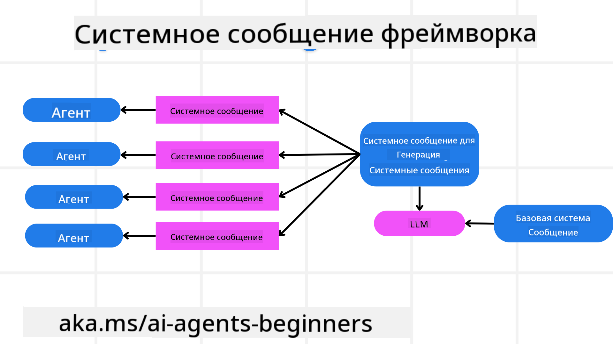
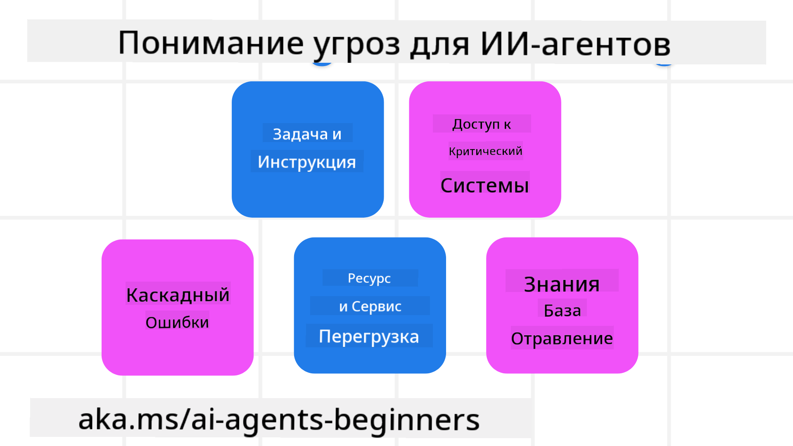
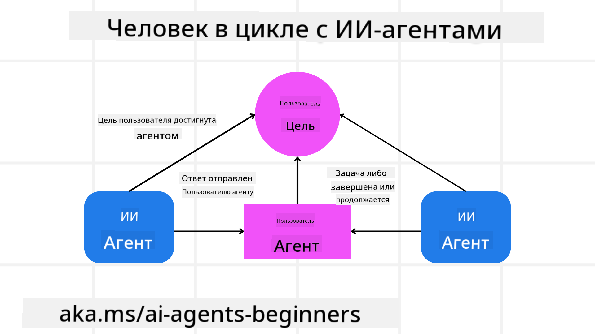

<!--
CO_OP_TRANSLATOR_METADATA:
{
  "original_hash": "f57852cac3a86c4a5ef47f793cc12178",
  "translation_date": "2025-07-12T10:21:39+00:00",
  "source_file": "06-building-trustworthy-agents/README.md",
  "language_code": "ru"
}
-->
[](https://youtu.be/iZKkMEGBCUQ?si=Q-kEbcyHUMPoHp8L)

> _(Нажмите на изображение выше, чтобы посмотреть видео этого урока)_

# Создание надежных AI-агентов

## Введение

В этом уроке мы рассмотрим:

- Как создавать и запускать безопасных и эффективных AI-агентов
- Важные аспекты безопасности при разработке AI-агентов
- Как обеспечивать конфиденциальность данных и пользователей при создании AI-агентов

## Цели обучения

После прохождения этого урока вы сможете:

- Определять и снижать риски при создании AI-агентов
- Внедрять меры безопасности для правильного управления данными и доступом
- Создавать AI-агентов, которые сохраняют конфиденциальность данных и обеспечивают качественный пользовательский опыт

## Безопасность

Для начала рассмотрим создание безопасных агентных приложений. Безопасность означает, что AI-агент работает так, как задумано. В качестве разработчиков агентных приложений у нас есть методы и инструменты для максимизации безопасности:

### Создание системы сообщений

Если вы когда-либо создавали AI-приложение с использованием больших языковых моделей (LLM), вы знаете, насколько важно разработать надежный системный запрос или системное сообщение. Эти запросы задают мета-правила, инструкции и рекомендации о том, как LLM будет взаимодействовать с пользователем и данными.

Для AI-агентов системный запрос еще важнее, так как им нужны очень конкретные инструкции для выполнения поставленных задач.

Чтобы создавать масштабируемые системные запросы, мы можем использовать систему сообщений для построения одного или нескольких агентов в нашем приложении:



#### Шаг 1: Создайте мета-системное сообщение

Мета-запрос будет использоваться LLM для генерации системных запросов для создаваемых агентов. Мы проектируем его как шаблон, чтобы эффективно создавать несколько агентов при необходимости.

Вот пример мета-системного сообщения, которое мы передадим LLM:

```plaintext
You are an expert at creating AI agent assistants. 
You will be provided a company name, role, responsibilities and other
information that you will use to provide a system prompt for.
To create the system prompt, be descriptive as possible and provide a structure that a system using an LLM can better understand the role and responsibilities of the AI assistant. 
```

#### Шаг 2: Создайте базовый запрос

Следующий шаг — создать базовый запрос, описывающий AI-агента. В нем следует указать роль агента, задачи, которые он будет выполнять, и другие его обязанности.

Пример:

```plaintext
You are a travel agent for Contoso Travel that is great at booking flights for customers. To help customers you can perform the following tasks: lookup available flights, book flights, ask for preferences in seating and times for flights, cancel any previously booked flights and alert customers on any delays or cancellations of flights.  
```

#### Шаг 3: Передайте базовое системное сообщение LLM

Теперь мы можем оптимизировать это системное сообщение, передав мета-системное сообщение как системное сообщение и наш базовый системный запрос.

Это создаст системное сообщение, лучше подходящее для управления нашими AI-агентами:

```markdown
**Company Name:** Contoso Travel  
**Role:** Travel Agent Assistant

**Objective:**  
You are an AI-powered travel agent assistant for Contoso Travel, specializing in booking flights and providing exceptional customer service. Your main goal is to assist customers in finding, booking, and managing their flights, all while ensuring that their preferences and needs are met efficiently.

**Key Responsibilities:**

1. **Flight Lookup:**
    
    - Assist customers in searching for available flights based on their specified destination, dates, and any other relevant preferences.
    - Provide a list of options, including flight times, airlines, layovers, and pricing.
2. **Flight Booking:**
    
    - Facilitate the booking of flights for customers, ensuring that all details are correctly entered into the system.
    - Confirm bookings and provide customers with their itinerary, including confirmation numbers and any other pertinent information.
3. **Customer Preference Inquiry:**
    
    - Actively ask customers for their preferences regarding seating (e.g., aisle, window, extra legroom) and preferred times for flights (e.g., morning, afternoon, evening).
    - Record these preferences for future reference and tailor suggestions accordingly.
4. **Flight Cancellation:**
    
    - Assist customers in canceling previously booked flights if needed, following company policies and procedures.
    - Notify customers of any necessary refunds or additional steps that may be required for cancellations.
5. **Flight Monitoring:**
    
    - Monitor the status of booked flights and alert customers in real-time about any delays, cancellations, or changes to their flight schedule.
    - Provide updates through preferred communication channels (e.g., email, SMS) as needed.

**Tone and Style:**

- Maintain a friendly, professional, and approachable demeanor in all interactions with customers.
- Ensure that all communication is clear, informative, and tailored to the customer's specific needs and inquiries.

**User Interaction Instructions:**

- Respond to customer queries promptly and accurately.
- Use a conversational style while ensuring professionalism.
- Prioritize customer satisfaction by being attentive, empathetic, and proactive in all assistance provided.

**Additional Notes:**

- Stay updated on any changes to airline policies, travel restrictions, and other relevant information that could impact flight bookings and customer experience.
- Use clear and concise language to explain options and processes, avoiding jargon where possible for better customer understanding.

This AI assistant is designed to streamline the flight booking process for customers of Contoso Travel, ensuring that all their travel needs are met efficiently and effectively.

```

#### Шаг 4: Итерации и улучшения

Ценность этой системы сообщений в том, что она упрощает масштабирование создания системных сообщений для нескольких агентов, а также позволяет улучшать их со временем. Редко когда системное сообщение идеально подходит с первого раза для полного сценария использования. Возможность вносить небольшие изменения и улучшения, меняя базовое системное сообщение и прогоняя его через систему, позволит сравнивать и оценивать результаты.

## Понимание угроз

Чтобы создавать надежных AI-агентов, важно понимать и снижать риски и угрозы для вашего AI-агента. Рассмотрим лишь некоторые из угроз AI-агентам и способы их предотвращения.



### Задачи и инструкции

**Описание:** Злоумышленники пытаются изменить инструкции или цели AI-агента через подсказки или манипуляции входными данными.

**Меры защиты:** Выполняйте проверки и фильтрацию входных данных, чтобы обнаруживать потенциально опасные подсказки до их обработки AI-агентом. Поскольку такие атаки обычно требуют частого взаимодействия с агентом, ограничение количества ходов в разговоре — еще один способ предотвратить подобные атаки.

### Доступ к критическим системам

**Описание:** Если AI-агент имеет доступ к системам и сервисам, хранящим конфиденциальные данные, злоумышленники могут нарушить коммуникацию между агентом и этими сервисами. Это могут быть прямые атаки или косвенные попытки получить информацию о системах через агента.

**Меры защиты:** AI-агенты должны иметь доступ к системам только по необходимости, чтобы предотвратить такие атаки. Коммуникация между агентом и системой должна быть защищена. Внедрение аутентификации и контроля доступа — еще один способ защитить эту информацию.

### Перегрузка ресурсов и сервисов

**Описание:** AI-агенты могут использовать различные инструменты и сервисы для выполнения задач. Злоумышленники могут использовать эту возможность для атак на сервисы, отправляя через AI-агента большое количество запросов, что может привести к сбоям системы или высоким затратам.

**Меры защиты:** Внедрите политики ограничения количества запросов, которые AI-агент может отправлять сервису. Ограничение количества ходов в разговоре и запросов к AI-агенту — еще один способ предотвратить такие атаки.

### Отравление базы знаний

**Описание:** Этот тип атаки не направлен непосредственно на AI-агента, а на базу знаний и другие сервисы, которые агент использует. Это может включать повреждение данных или информации, используемой агентом для выполнения задач, что приведет к предвзятым или нежелательным ответам пользователю.

**Меры защиты:** Регулярно проверяйте данные, которые AI-агент использует в своих рабочих процессах. Обеспечьте безопасность доступа к этим данным и разрешайте изменения только доверенным лицам, чтобы избежать такого рода атак.

### Каскадные ошибки

**Описание:** AI-агенты используют различные инструменты и сервисы для выполнения задач. Ошибки, вызванные злоумышленниками, могут привести к сбоям других систем, связанных с AI-агентом, что усложняет устранение неполадок и расширяет масштаб атаки.

**Меры защиты:** Один из способов избежать этого — запускать AI-агента в ограниченной среде, например, выполнять задачи в Docker-контейнере, чтобы предотвратить прямые атаки на систему. Создание механизмов резервного копирования и логики повторных попыток при ошибках систем — еще один способ предотвратить крупные сбои.

## Человек в цикле

Еще один эффективный способ создания надежных систем AI-агентов — использование подхода «человек в цикле». Это создает процесс, в котором пользователи могут предоставлять обратную связь агентам во время их работы. Пользователи фактически выступают в роли агентов в многоагентной системе, одобряя или прерывая выполняемый процесс.



Вот пример кода с использованием AutoGen, показывающий, как реализуется эта концепция:

```python

# Create the agents.
model_client = OpenAIChatCompletionClient(model="gpt-4o-mini")
assistant = AssistantAgent("assistant", model_client=model_client)
user_proxy = UserProxyAgent("user_proxy", input_func=input)  # Use input() to get user input from console.

# Create the termination condition which will end the conversation when the user says "APPROVE".
termination = TextMentionTermination("APPROVE")

# Create the team.
team = RoundRobinGroupChat([assistant, user_proxy], termination_condition=termination)

# Run the conversation and stream to the console.
stream = team.run_stream(task="Write a 4-line poem about the ocean.")
# Use asyncio.run(...) when running in a script.
await Console(stream)

```

## Заключение

Создание надежных AI-агентов требует тщательного проектирования, надежных мер безопасности и постоянного улучшения. Внедряя структурированные системы мета-запросов, понимая потенциальные угрозы и применяя стратегии их снижения, разработчики могут создавать AI-агентов, которые одновременно безопасны и эффективны. Кроме того, включение подхода «человек в цикле» гарантирует, что AI-агенты остаются ориентированными на потребности пользователей и минимизируют риски. По мере развития AI поддержание проактивного подхода к безопасности, конфиденциальности и этическим вопросам будет ключом к укреплению доверия и надежности систем на базе AI.

## Дополнительные ресурсы

- <a href="https://learn.microsoft.com/azure/ai-studio/responsible-use-of-ai-overview" target="_blank">Обзор ответственного использования AI</a>
- <a href="https://learn.microsoft.com/azure/ai-studio/concepts/evaluation-approach-gen-ai" target="_blank">Оценка моделей генеративного AI и AI-приложений</a>
- <a href="https://learn.microsoft.com/azure/ai-services/openai/concepts/system-message?context=%2Fazure%2Fai-studio%2Fcontext%2Fcontext&tabs=top-techniques" target="_blank">Системные сообщения безопасности</a>
- <a href="https://blogs.microsoft.com/wp-content/uploads/prod/sites/5/2022/06/Microsoft-RAI-Impact-Assessment-Template.pdf?culture=en-us&country=us" target="_blank">Шаблон оценки рисков</a>

## Предыдущий урок

[Agentic RAG](../05-agentic-rag/README.md)

## Следующий урок

[Паттерн проектирования планирования](../07-planning-design/README.md)

**Отказ от ответственности**:  
Этот документ был переведен с помощью сервиса автоматического перевода [Co-op Translator](https://github.com/Azure/co-op-translator). Несмотря на наши усилия по обеспечению точности, просим учитывать, что автоматические переводы могут содержать ошибки или неточности. Оригинальный документ на его исходном языке следует считать авторитетным источником. Для получения критически важной информации рекомендуется обращаться к профессиональному человеческому переводу. Мы не несем ответственности за любые недоразумения или неправильные толкования, возникшие в результате использования данного перевода.