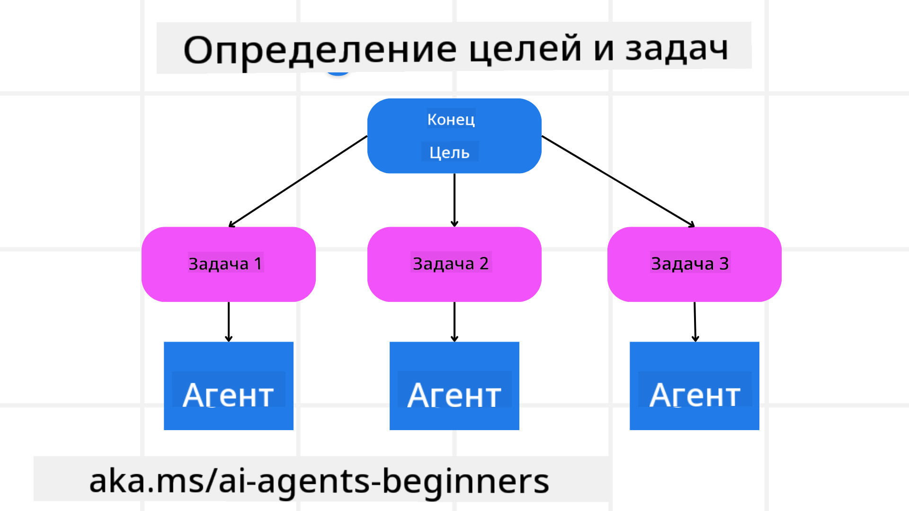

<!--
CO_OP_TRANSLATOR_METADATA:
{
  "original_hash": "a28d30590704ea13b6a08d4793cf9c2b",
  "translation_date": "2025-08-29T12:31:04+00:00",
  "source_file": "07-planning-design/README.md",
  "language_code": "ru"
}
-->
[](https://youtu.be/kPfJ2BrBCMY?si=9pYpPXp0sSbK91Dr)

> _(Нажмите на изображение выше, чтобы посмотреть видео этого урока)_

# Планирование дизайна

## Введение

В этом уроке мы рассмотрим:

* Определение четкой общей цели и разбиение сложной задачи на управляемые этапы.
* Использование структурированного вывода для более надежных и машиночитаемых ответов.
* Применение событийного подхода для обработки динамических задач и неожиданных вводных данных.

## Цели обучения

После завершения этого урока вы будете понимать:

* Как определить и установить общую цель для AI-агента, чтобы он четко знал, что нужно достичь.
* Как разбить сложную задачу на управляемые подзадачи и организовать их в логической последовательности.
* Как снабдить агентов необходимыми инструментами (например, инструментами поиска или анализа данных), решить, когда и как их использовать, и справляться с неожиданными ситуациями.
* Как оценивать результаты подзадач, измерять производительность и корректировать действия для улучшения конечного результата.

## Определение общей цели и разбиение задачи



Большинство задач в реальном мире слишком сложны, чтобы решать их за один шаг. AI-агенту нужна четкая цель, которая будет направлять его планирование и действия. Например, рассмотрим цель:

    "Создать трехдневный туристический маршрут."

Хотя она звучит просто, ее все же нужно уточнить. Чем яснее цель, тем лучше агент (и любые человеческие коллеги) смогут сосредоточиться на достижении правильного результата, например, создании полного маршрута с вариантами перелетов, рекомендациями отелей и предложениями по мероприятиям.

### Декомпозиция задачи

Большие или сложные задачи становятся более управляемыми, если их разделить на меньшие, ориентированные на цель подзадачи. Для примера с туристическим маршрутом можно разбить цель на:

* Бронирование перелета
* Бронирование отеля
* Аренда автомобиля
* Персонализация

Каждую подзадачу можно поручить специализированным агентам или процессам. Один агент может специализироваться на поиске лучших предложений по перелетам, другой — на бронировании отелей и так далее. Координирующий или "низовой" агент затем объединяет эти результаты в единый маршрут для конечного пользователя.

Такой модульный подход также позволяет постепенно улучшать результат. Например, можно добавить специализированных агентов для рекомендаций по питанию или местным мероприятиям и со временем уточнять маршрут.

### Структурированный вывод

Большие языковые модели (LLM) могут генерировать структурированный вывод (например, JSON), который легче анализировать и обрабатывать последующим агентам или сервисам. Это особенно полезно в контексте многоагентной системы, где можно выполнять задачи после получения результата планирования. Для быстрого ознакомления:

Следующий фрагмент кода на Python демонстрирует простой планирующий агент, который разбивает цель на подзадачи и создает структурированный план:

```python
from pydantic import BaseModel
from enum import Enum
from typing import List, Optional, Union
import json
import os
from typing import Optional
from pprint import pprint
from autogen_core.models import UserMessage, SystemMessage, AssistantMessage
from autogen_ext.models.azure import AzureAIChatCompletionClient
from azure.core.credentials import AzureKeyCredential

class AgentEnum(str, Enum):
    FlightBooking = "flight_booking"
    HotelBooking = "hotel_booking"
    CarRental = "car_rental"
    ActivitiesBooking = "activities_booking"
    DestinationInfo = "destination_info"
    DefaultAgent = "default_agent"
    GroupChatManager = "group_chat_manager"

# Travel SubTask Model
class TravelSubTask(BaseModel):
    task_details: str
    assigned_agent: AgentEnum  # we want to assign the task to the agent

class TravelPlan(BaseModel):
    main_task: str
    subtasks: List[TravelSubTask]
    is_greeting: bool

client = AzureAIChatCompletionClient(
    model="gpt-4o-mini",
    endpoint="https://models.inference.ai.azure.com",
    # To authenticate with the model you will need to generate a personal access token (PAT) in your GitHub settings.
    # Create your PAT token by following instructions here: https://docs.github.com/en/authentication/keeping-your-account-and-data-secure/managing-your-personal-access-tokens
    credential=AzureKeyCredential(os.environ["GITHUB_TOKEN"]),
    model_info={
        "json_output": False,
        "function_calling": True,
        "vision": True,
        "family": "unknown",
    },
)

# Define the user message
messages = [
    SystemMessage(content="""You are an planner agent.
    Your job is to decide which agents to run based on the user's request.
                      Provide your response in JSON format with the following structure:
{'main_task': 'Plan a family trip from Singapore to Melbourne.',
 'subtasks': [{'assigned_agent': 'flight_booking',
               'task_details': 'Book round-trip flights from Singapore to '
                               'Melbourne.'}
    Below are the available agents specialised in different tasks:
    - FlightBooking: For booking flights and providing flight information
    - HotelBooking: For booking hotels and providing hotel information
    - CarRental: For booking cars and providing car rental information
    - ActivitiesBooking: For booking activities and providing activity information
    - DestinationInfo: For providing information about destinations
    - DefaultAgent: For handling general requests""", source="system"),
    UserMessage(
        content="Create a travel plan for a family of 2 kids from Singapore to Melboune", source="user"),
]

response = await client.create(messages=messages, extra_create_args={"response_format": 'json_object'})

response_content: Optional[str] = response.content if isinstance(
    response.content, str) else None
if response_content is None:
    raise ValueError("Response content is not a valid JSON string" )

pprint(json.loads(response_content))

# # Ensure the response content is a valid JSON string before loading it
# response_content: Optional[str] = response.content if isinstance(
#     response.content, str) else None
# if response_content is None:
#     raise ValueError("Response content is not a valid JSON string")

# # Print the response content after loading it as JSON
# pprint(json.loads(response_content))

# Validate the response content with the MathReasoning model
# TravelPlan.model_validate(json.loads(response_content))
```

### Планирующий агент с многоагентной оркестрацией

В этом примере агент Semantic Router получает запрос пользователя (например, "Мне нужен план отеля для моей поездки.").

Планировщик затем:

* Получает план отеля: Планировщик принимает сообщение пользователя и, основываясь на системном запросе (включая детали доступных агентов), создает структурированный план поездки.
* Составляет список агентов и их инструментов: Реестр агентов содержит список агентов (например, для перелетов, отелей, аренды автомобилей и мероприятий) вместе с функциями или инструментами, которые они предлагают.
* Направляет план соответствующим агентам: В зависимости от количества подзадач планировщик либо отправляет сообщение напрямую выделенному агенту (для сценариев с одной задачей), либо координирует через менеджер группового чата для многоагентного взаимодействия.
* Резюмирует результат: Наконец, планировщик резюмирует созданный план для ясности. 

Следующий пример кода на Python иллюстрирует эти шаги:

```python

from pydantic import BaseModel

from enum import Enum
from typing import List, Optional, Union

class AgentEnum(str, Enum):
    FlightBooking = "flight_booking"
    HotelBooking = "hotel_booking"
    CarRental = "car_rental"
    ActivitiesBooking = "activities_booking"
    DestinationInfo = "destination_info"
    DefaultAgent = "default_agent"
    GroupChatManager = "group_chat_manager"

# Travel SubTask Model

class TravelSubTask(BaseModel):
    task_details: str
    assigned_agent: AgentEnum # we want to assign the task to the agent

class TravelPlan(BaseModel):
    main_task: str
    subtasks: List[TravelSubTask]
    is_greeting: bool
import json
import os
from typing import Optional

from autogen_core.models import UserMessage, SystemMessage, AssistantMessage
from autogen_ext.models.openai import AzureOpenAIChatCompletionClient

# Create the client with type-checked environment variables

client = AzureOpenAIChatCompletionClient(
    azure_deployment=os.getenv("AZURE_OPENAI_DEPLOYMENT_NAME"),
    model=os.getenv("AZURE_OPENAI_DEPLOYMENT_NAME"),
    api_version=os.getenv("AZURE_OPENAI_API_VERSION"),
    azure_endpoint=os.getenv("AZURE_OPENAI_ENDPOINT"),
    api_key=os.getenv("AZURE_OPENAI_API_KEY"),
)

from pprint import pprint

# Define the user message

messages = [
    SystemMessage(content="""You are an planner agent.
    Your job is to decide which agents to run based on the user's request.
    Below are the available agents specialized in different tasks:
    - FlightBooking: For booking flights and providing flight information
    - HotelBooking: For booking hotels and providing hotel information
    - CarRental: For booking cars and providing car rental information
    - ActivitiesBooking: For booking activities and providing activity information
    - DestinationInfo: For providing information about destinations
    - DefaultAgent: For handling general requests""", source="system"),
    UserMessage(content="Create a travel plan for a family of 2 kids from Singapore to Melbourne", source="user"),
]

response = await client.create(messages=messages, extra_create_args={"response_format": TravelPlan})

# Ensure the response content is a valid JSON string before loading it

response_content: Optional[str] = response.content if isinstance(response.content, str) else None
if response_content is None:
    raise ValueError("Response content is not a valid JSON string")

# Print the response content after loading it as JSON

pprint(json.loads(response_content))
```

Далее представлен вывод из предыдущего кода, который можно использовать для маршрутизации к `assigned_agent` и резюмирования плана поездки для конечного пользователя.

```json
{
    "is_greeting": "False",
    "main_task": "Plan a family trip from Singapore to Melbourne.",
    "subtasks": [
        {
            "assigned_agent": "flight_booking",
            "task_details": "Book round-trip flights from Singapore to Melbourne."
        },
        {
            "assigned_agent": "hotel_booking",
            "task_details": "Find family-friendly hotels in Melbourne."
        },
        {
            "assigned_agent": "car_rental",
            "task_details": "Arrange a car rental suitable for a family of four in Melbourne."
        },
        {
            "assigned_agent": "activities_booking",
            "task_details": "List family-friendly activities in Melbourne."
        },
        {
            "assigned_agent": "destination_info",
            "task_details": "Provide information about Melbourne as a travel destination."
        }
    ]
}
```

Пример блокнота с предыдущим кодом доступен [здесь](07-autogen.ipynb).

### Итеративное планирование

Некоторые задачи требуют обратной связи или перепланирования, когда результат одной подзадачи влияет на следующую. Например, если агент обнаруживает неожиданный формат данных при бронировании перелетов, ему может понадобиться адаптировать свою стратегию перед переходом к бронированию отелей.

Кроме того, обратная связь от пользователя (например, если человек решает, что предпочитает более ранний рейс) может вызвать частичное перепланирование. Такой динамичный, итеративный подход гарантирует, что конечное решение соответствует реальным ограничениям и изменяющимся предпочтениям пользователя.

Пример кода:

```python
from autogen_core.models import UserMessage, SystemMessage, AssistantMessage
#.. same as previous code and pass on the user history, current plan
messages = [
    SystemMessage(content="""You are a planner agent to optimize the
    Your job is to decide which agents to run based on the user's request.
    Below are the available agents specialized in different tasks:
    - FlightBooking: For booking flights and providing flight information
    - HotelBooking: For booking hotels and providing hotel information
    - CarRental: For booking cars and providing car rental information
    - ActivitiesBooking: For booking activities and providing activity information
    - DestinationInfo: For providing information about destinations
    - DefaultAgent: For handling general requests""", source="system"),
    UserMessage(content="Create a travel plan for a family of 2 kids from Singapore to Melbourne", source="user"),
    AssistantMessage(content=f"Previous travel plan - {TravelPlan}", source="assistant")
]
# .. re-plan and send the tasks to respective agents
```

Для более комплексного планирования ознакомьтесь с Magnetic One для решения сложных задач.

## Итоги

В этой статье мы рассмотрели пример создания планировщика, который может динамически выбирать доступных агентов. Вывод планировщика разбивает задачи и назначает агентов для их выполнения. Предполагается, что агенты имеют доступ к функциям/инструментам, необходимым для выполнения задачи. В дополнение к агентам можно включить другие шаблоны, такие как рефлексия, резюмирование и круговой чат, чтобы настроить процесс.

## Дополнительные ресурсы

* AutoGen Magnetic One — универсальная многоагентная система для решения сложных задач, которая достигла впечатляющих результатов на множестве сложных агентных тестов. Ссылка:

В этой реализации оркестратор создает план, специфичный для задачи, и делегирует эти задачи доступным агентам. Помимо планирования оркестратор также использует механизм отслеживания для мониторинга прогресса задачи и перепланирования по мере необходимости.

### Остались вопросы о шаблоне проектирования планирования?

Присоединяйтесь к [Azure AI Foundry Discord](https://aka.ms/ai-agents/discord), чтобы встретиться с другими учащимися, посетить часы консультаций и получить ответы на свои вопросы о AI-агентах.

## Предыдущий урок

[Создание надежных AI-агентов](../06-building-trustworthy-agents/README.md)

## Следующий урок

[Шаблон проектирования многоагентных систем](../08-multi-agent/README.md)

---

**Отказ от ответственности**:  
Этот документ был переведен с помощью сервиса автоматического перевода [Co-op Translator](https://github.com/Azure/co-op-translator). Несмотря на наши усилия обеспечить точность, автоматические переводы могут содержать ошибки или неточности. Оригинальный документ на его родном языке следует считать авторитетным источником. Для получения критически важной информации рекомендуется профессиональный перевод человеком. Мы не несем ответственности за любые недоразумения или неправильные интерпретации, возникшие в результате использования данного перевода.