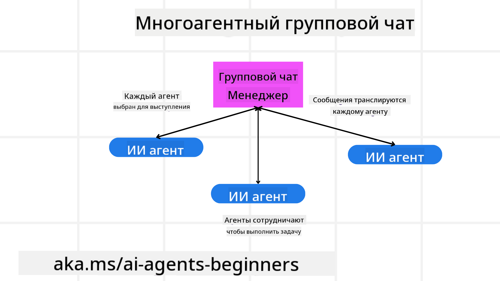
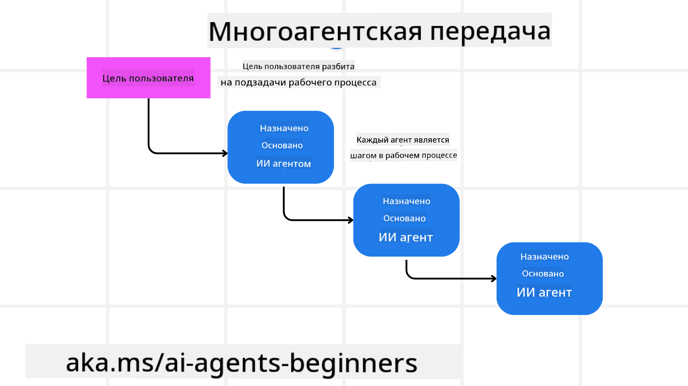
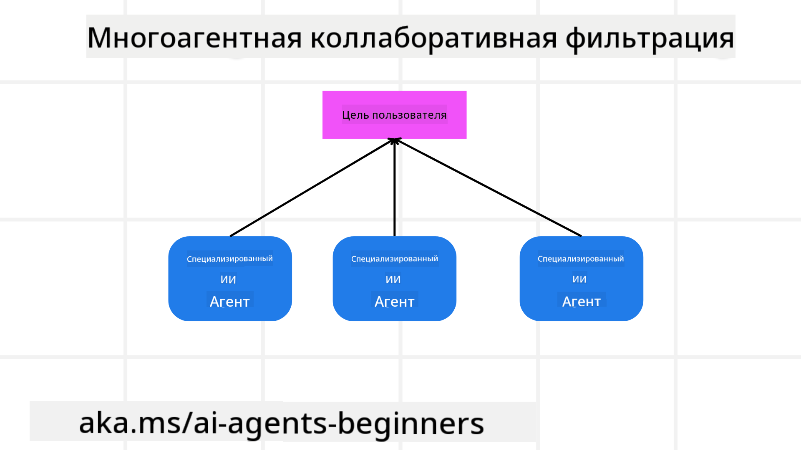

<!--
CO_OP_TRANSLATOR_METADATA:
{
  "original_hash": "c692a8975d7d5b99575a553de1c5e8a7",
  "translation_date": "2025-07-12T10:52:07+00:00",
  "source_file": "08-multi-agent/README.md",
  "language_code": "ru"
}
-->

> _(Нажмите на изображение выше, чтобы посмотреть видео этого урока)_

# Мультиагентные шаблоны проектирования

Как только вы начинаете работать над проектом, в котором задействовано несколько агентов, вам нужно учитывать мультиагентный шаблон проектирования. Однако не всегда сразу понятно, когда стоит перейти к мультиагентной системе и какие преимущества это даёт.

## Введение

В этом уроке мы постараемся ответить на следующие вопросы:

- В каких сценариях применимы мультиагенты?
- Какие преимущества использования мультиагентов по сравнению с одним агентом, выполняющим несколько задач?
- Какие основные компоненты нужны для реализации мультиагентного шаблона проектирования?
- Как получить представление о взаимодействии нескольких агентов друг с другом?

## Цели обучения

После этого урока вы сможете:

- Определять сценарии, в которых применимы мультиагенты
- Понимать преимущества использования мультиагентов по сравнению с одним агентом
- Осознавать основные компоненты реализации мультиагентного шаблона проектирования

В чём общий смысл?

*Мультиагенты — это шаблон проектирования, который позволяет нескольким агентам работать вместе для достижения общей цели*.

Этот шаблон широко используется в различных областях, включая робототехнику, автономные системы и распределённые вычисления.

## Сценарии применения мультиагентов

В каких же случаях стоит использовать мультиагенты? Ответ в том, что существует множество сценариев, где применение нескольких агентов приносит пользу, особенно в следующих случаях:

- **Большие объёмы работы**: Большие задачи можно разбить на более мелкие и распределить между разными агентами, что позволяет выполнять их параллельно и быстрее завершать. Пример — обработка больших объёмов данных.
- **Сложные задачи**: Сложные задачи, как и большие объёмы работы, можно разделить на подзадачи и назначить разным агентам, каждый из которых специализируется на определённом аспекте. Хороший пример — автономные транспортные средства, где разные агенты отвечают за навигацию, обнаружение препятствий и связь с другими автомобилями.
- **Разнообразная экспертиза**: Разные агенты могут обладать разной экспертизой, что позволяет им эффективнее справляться с разными аспектами задачи, чем один агент. Например, в здравоохранении агенты могут заниматься диагностикой, планированием лечения и мониторингом пациентов.

## Преимущества использования мультиагентов по сравнению с одним агентом

Одна система с одним агентом может хорошо работать для простых задач, но для более сложных задач использование нескольких агентов даёт ряд преимуществ:

- **Специализация**: Каждый агент может специализироваться на конкретной задаче. Отсутствие специализации у одного агента означает, что он пытается делать всё сразу, что может привести к путанице при выполнении сложных задач. Например, агент может взяться за задачу, для которой он не подходит.
- **Масштабируемость**: Легче масштабировать систему, добавляя новых агентов, чем перегружать одного.
- **Отказоустойчивость**: Если один агент выходит из строя, другие продолжают работать, обеспечивая надёжность системы.

Рассмотрим пример: бронирование поездки для пользователя. Система с одним агентом должна обрабатывать все этапы бронирования — от поиска авиабилетов до бронирования отелей и аренды автомобилей. Для этого агенту нужны инструменты для всех этих задач, что может привести к сложной и монолитной системе, которую трудно поддерживать и масштабировать. Мультиагентная система, напротив, может иметь разных агентов, специализирующихся на поиске авиабилетов, бронировании отелей и аренде автомобилей. Это делает систему более модульной, удобной для поддержки и масштабируемой.

Сравните это с туристическим агентством в формате семейного бизнеса и туристическим агентством, работающим по франшизе. В первом случае один агент занимается всеми аспектами бронирования, во втором — разные агенты отвечают за разные этапы.

## Основные компоненты реализации мультиагентного шаблона проектирования

Прежде чем реализовывать мультиагентный шаблон, нужно понять его основные компоненты.

Снова рассмотрим пример бронирования поездки. В этом случае основные компоненты включают:

- **Взаимодействие агентов**: Агенты, отвечающие за поиск авиабилетов, бронирование отелей и аренду автомобилей, должны обмениваться информацией о предпочтениях и ограничениях пользователя. Нужно определить протоколы и методы для такого взаимодействия. Конкретно это значит, что агент по поиску авиабилетов должен общаться с агентом по бронированию отелей, чтобы убедиться, что отель забронирован на те же даты, что и рейс. Значит, агенты должны обмениваться информацией о датах поездки пользователя, то есть нужно решить, *какие агенты обмениваются информацией и как именно*.
- **Механизмы координации**: Агенты должны координировать свои действия, чтобы удовлетворить предпочтения и ограничения пользователя. Например, пользователь может хотеть отель рядом с аэропортом, а аренда автомобилей доступна только в аэропорту. Значит, агент по бронированию отелей должен координироваться с агентом по аренде автомобилей, чтобы учесть эти условия. Нужно решить, *как агенты координируют свои действия*.
- **Архитектура агента**: Агенты должны иметь внутреннюю структуру для принятия решений и обучения на основе взаимодействия с пользователем. Например, агент по поиску авиабилетов должен уметь принимать решения о том, какие рейсы рекомендовать. Нужно решить, *как агенты принимают решения и учатся на взаимодействиях с пользователем*. Примером может служить использование машинного обучения агентом по поиску авиабилетов для рекомендаций на основе прошлых предпочтений пользователя.
- **Видимость взаимодействий мультиагентов**: Необходимо иметь возможность видеть, как агенты взаимодействуют друг с другом. Для этого нужны инструменты и методы отслеживания активности и взаимодействий агентов. Это могут быть средства логирования и мониторинга, визуализации и метрики производительности.
- **Мультиагентные шаблоны**: Существуют разные шаблоны реализации мультиагентных систем — централизованные, децентрализованные и гибридные архитектуры. Нужно выбрать подходящий для вашего случая.
- **Человек в системе**: В большинстве случаев в систему вовлечён человек, и нужно определить, когда агенты должны запрашивать вмешательство человека. Например, пользователь может запросить конкретный отель или рейс, который агенты не рекомендовали, или потребовать подтверждения перед бронированием.

## Видимость взаимодействий мультиагентов

Очень важно иметь представление о том, как агенты взаимодействуют друг с другом. Это необходимо для отладки, оптимизации и обеспечения эффективности всей системы. Для этого нужны инструменты и методы отслеживания активности и взаимодействий агентов. Это могут быть средства логирования и мониторинга, визуализации и метрики производительности.

Например, при бронировании поездки можно создать панель управления, показывающую статус каждого агента, предпочтения и ограничения пользователя, а также взаимодействия между агентами. Такая панель может отображать даты поездки, рейсы, рекомендованные агентом по авиабилетам, отели от агента по бронированию отелей и автомобили от агента по аренде. Это даст чёткое представление о взаимодействии агентов и о том, насколько удовлетворяются предпочтения и ограничения пользователя.

Рассмотрим подробнее каждый из этих аспектов.

- **Средства логирования и мониторинга**: Нужно вести логирование каждого действия агента. Запись в логе может содержать информацию об агенте, совершившем действие, самом действии, времени его выполнения и результате. Эти данные помогут при отладке и оптимизации.
- **Средства визуализации**: Визуализация помогает интуитивно понять взаимодействия между агентами. Например, можно построить граф, показывающий поток информации между агентами. Это поможет выявить узкие места, неэффективности и другие проблемы.
- **Метрики производительности**: Метрики позволяют отслеживать эффективность мультиагентной системы. Например, можно измерять время выполнения задач, количество выполненных задач за единицу времени и точность рекомендаций агентов. Эти данные помогут выявить области для улучшения и оптимизировать систему.

## Мультиагентные шаблоны

Рассмотрим конкретные шаблоны, которые можно использовать для создания мультиагентных приложений. Вот несколько интересных вариантов:

### Групповой чат

Этот шаблон полезен, когда нужно создать приложение группового чата, где несколько агентов могут общаться друг с другом. Типичные случаи использования — командная работа, поддержка клиентов и социальные сети.

В этом шаблоне каждый агент представляет пользователя в групповом чате, а сообщения обмениваются между агентами с помощью протокола обмена сообщениями. Агенты могут отправлять сообщения в чат, получать сообщения из чата и отвечать другим агентам.

Этот шаблон можно реализовать с централизованной архитектурой, где все сообщения проходят через центральный сервер, или с децентрализованной, где сообщения передаются напрямую.

### Передача задач

Этот шаблон полезен, когда нужно создать приложение, в котором агенты могут передавать задачи друг другу.

Типичные случаи использования — поддержка клиентов, управление задачами и автоматизация рабочих процессов.

В этом шаблоне каждый агент представляет задачу или этап рабочего процесса, и агенты могут передавать задачи другим агентам согласно заранее определённым правилам.

### Коллаборативная фильтрация

Этот шаблон полезен, когда нужно создать приложение, в котором несколько агентов совместно делают рекомендации пользователям.

Причина, по которой агенты сотрудничают, в том, что каждый из них обладает разной экспертизой и может внести свой вклад в процесс рекомендаций.

Рассмотрим пример, когда пользователь хочет получить рекомендацию по лучшей акции для покупки на фондовом рынке.

- **Эксперт по отрасли**: Один агент может быть экспертом в конкретной отрасли.
- **Технический анализ**: Другой агент — специалист по техническому анализу.
- **Фундаментальный анализ**: Ещё один агент — эксперт по фундаментальному анализу. Совместно эти агенты могут дать более полную рекомендацию пользователю.

## Сценарий: процесс возврата денег

Рассмотрим ситуацию, когда клиент пытается получить возврат за товар. В этом процессе может участвовать множество агентов, но давайте разделим их на агентов, специфичных для этого процесса, и общих агентов, которые могут использоваться в других процессах.

**Агенты, специфичные для процесса возврата**:

Вот несколько агентов, которые могут участвовать в процессе возврата:

- **Агент клиента**: Представляет клиента и отвечает за инициацию процесса возврата.
- **Агент продавца**: Представляет продавца и отвечает за обработку возврата.
- **Агент платежей**: Отвечает за возврат денег клиенту.
- **Агент разрешения споров**: Отвечает за решение возникающих в процессе возврата проблем.
- **Агент соответствия**: Обеспечивает соблюдение процесса возврата нормативных требований и политик.

**Общие агенты**:

Эти агенты могут использоваться в других частях вашего бизнеса.

- **Агент доставки**: Отвечает за возврат товара продавцу. Может использоваться как в процессе возврата, так и для обычной доставки товара при покупке.
- **Агент обратной связи**: Отвечает за сбор отзывов от клиентов. Обратная связь может собираться в любое время, а не только в процессе возврата.
- **Агент эскалации**: Отвечает за передачу проблем на более высокий уровень поддержки. Такой агент можно использовать в любом процессе, где требуется эскалация.
- **Агент уведомлений**: Отвечает за отправку уведомлений клиенту на разных этапах процесса возврата.
- **Агент аналитики**: Отвечает за анализ данных, связанных с процессом возврата.
- **Агент аудита**: Отвечает за проверку правильности выполнения процесса возврата.
- **Агент отчётности**: Отвечает за формирование отчётов по процессу возврата.
- **Агент знаний**: Отвечает за поддержание базы знаний, связанной с процессом возврата. Может быть полезен как для возвратов, так и для других частей бизнеса.
- **Агент безопасности**: Отвечает за обеспечение безопасности процесса возврата.
- **Агент качества**: Отвечает за контроль качества процесса возврата.

Ранее перечислено довольно много агентов — как специфичных для процесса возврата, так и общих, которые можно использовать в других частях бизнеса. Надеюсь, это поможет вам понять, как выбирать агентов для вашей мультиагентной системы.

## Задание
## Предыдущее занятие

[Планирование дизайна](../07-planning-design/README.md)

## Следующее занятие

[Метапознание в AI-агентах](../09-metacognition/README.md)

**Отказ от ответственности**:  
Этот документ был переведен с помощью сервиса автоматического перевода [Co-op Translator](https://github.com/Azure/co-op-translator). Несмотря на наши усилия по обеспечению точности, просим учитывать, что автоматические переводы могут содержать ошибки или неточности. Оригинальный документ на его исходном языке следует считать авторитетным источником. Для получения критически важной информации рекомендуется обращаться к профессиональному человеческому переводу. Мы не несем ответственности за любые недоразумения или неправильные толкования, возникшие в результате использования данного перевода.