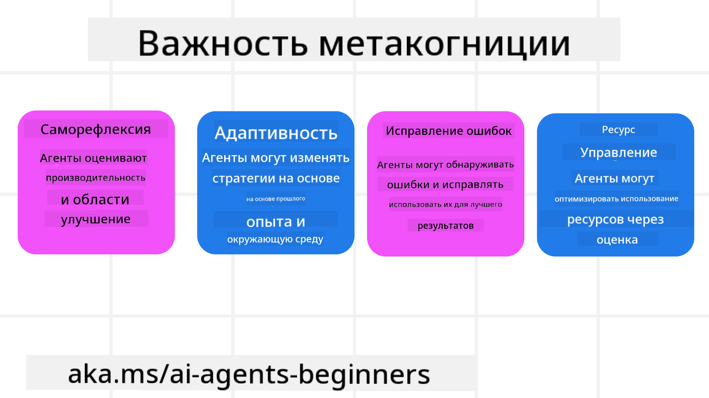
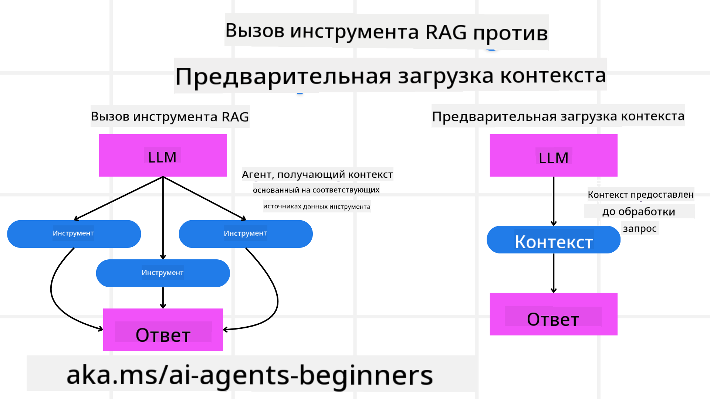

<!--
CO_OP_TRANSLATOR_METADATA:
{
  "original_hash": "8cbf460468c802c7994aa62e0e0779c9",
  "translation_date": "2025-07-12T11:50:48+00:00",
  "source_file": "09-metacognition/README.md",
  "language_code": "ru"
}
-->
[](https://youtu.be/His9R6gw6Ec?si=3_RMb8VprNvdLRhX)

> _(Нажмите на изображение выше, чтобы посмотреть видео этого урока)_
# Метапознание в AI-агентах

## Введение

Добро пожаловать на урок о метапознании в AI-агентах! Эта глава предназначена для новичков, которые интересуются тем, как AI-агенты могут осознавать и анализировать собственные мыслительные процессы. К концу урока вы поймёте ключевые концепции и получите практические примеры применения метапознания в проектировании AI-агентов.

## Цели обучения

После прохождения этого урока вы сможете:

1. Понимать последствия циклов рассуждений в определениях агентов.
2. Использовать методы планирования и оценки для помощи агентам с самокоррекцией.
3. Создавать собственных агентов, способных манипулировать кодом для выполнения задач.

## Введение в метапознание

Метапознание — это процессы высшего порядка, связанные с размышлениями о собственных мыслях. Для AI-агентов это означает способность оценивать и корректировать свои действия, опираясь на самосознание и прошлый опыт. Метапознание, или «мышление о мышлении», — важная концепция в развитии агентных AI-систем. Оно предполагает, что AI-системы осознают свои внутренние процессы и могут контролировать, регулировать и адаптировать своё поведение. Подобно тому, как мы оцениваем ситуацию или анализируем проблему. Такое самосознание помогает AI принимать более взвешенные решения, выявлять ошибки и со временем улучшать свою работу — что снова возвращает нас к тесту Тьюринга и дискуссиям о том, захватит ли AI власть.

В контексте агентных AI-систем метапознание помогает решать несколько задач, таких как:
- Прозрачность: обеспечение возможности объяснять логику и решения AI-систем.
- Рассуждение: улучшение способности AI синтезировать информацию и принимать обоснованные решения.
- Адаптация: возможность AI подстраиваться под новые условия и изменяющуюся среду.
- Восприятие: повышение точности распознавания и интерпретации данных из окружающей среды.

### Что такое метапознание?

Метапознание, или «мышление о мышлении», — это процесс высшего порядка, включающий самосознание и саморегуляцию когнитивных процессов. В области AI метапознание даёт агентам возможность оценивать и корректировать свои стратегии и действия, что ведёт к улучшению решения задач и принятию решений. Понимая метапознание, вы сможете создавать AI-агентов, которые будут не только умнее, но и более гибкими и эффективными. В настоящем метапознании AI явно размышляет о собственных рассуждениях.

Пример: «Я выбрал более дешёвые рейсы, потому что... возможно, я упускаю прямые рейсы, так что стоит перепроверить.»
Отслеживание того, как и почему был выбран определённый маршрут.
- Замечание ошибок, например, из-за чрезмерного опирания на предпочтения пользователя из прошлого, что приводит к изменению стратегии принятия решений, а не только конечной рекомендации.
- Диагностика паттернов, например: «Когда пользователь говорит «слишком многолюдно», я должен не только исключать определённые достопримечательности, но и понимать, что мой метод выбора «лучших достопримечательностей» ошибочен, если я всегда ранжирую по популярности.»

### Важность метапознания в AI-агентах

Метапознание играет ключевую роль в проектировании AI-агентов по нескольким причинам:



- Саморефлексия: агенты могут оценивать собственную работу и выявлять области для улучшения.
- Адаптивность: агенты могут менять стратегии на основе прошлого опыта и изменяющихся условий.
- Исправление ошибок: агенты способны самостоятельно обнаруживать и исправлять ошибки, что повышает точность результатов.
- Управление ресурсами: агенты оптимизируют использование ресурсов, таких как время и вычислительная мощность, планируя и оценивая свои действия.

## Компоненты AI-агента

Прежде чем перейти к метапознавательным процессам, важно понять базовые компоненты AI-агента. Обычно AI-агент состоит из:

- Персона: личность и характеристики агента, определяющие, как он взаимодействует с пользователями.
- Инструменты: возможности и функции, которые агент может выполнять.
- Навыки: знания и экспертиза, которыми обладает агент.

Эти компоненты работают вместе, создавая «единицу экспертизы», способную выполнять конкретные задачи.

**Пример**:
Рассмотрим туристического агента — сервис, который не только планирует ваш отпуск, но и корректирует маршрут на основе данных в реальном времени и опыта предыдущих клиентов.

### Пример: метапознание в сервисе туристического агента

Представьте, что вы разрабатываете сервис туристического агента на базе AI. Этот агент, «Travel Agent», помогает пользователям планировать отпуск. Чтобы внедрить метапознание, Travel Agent должен оценивать и корректировать свои действия, опираясь на самосознание и прошлый опыт. Вот как метапознание может проявляться:

#### Текущая задача

Помочь пользователю спланировать поездку в Париж.

#### Шаги для выполнения задачи

1. **Сбор предпочтений пользователя**: спросить о датах поездки, бюджете, интересах (например, музеи, кухня, шопинг) и особых требованиях.
2. **Поиск информации**: найти варианты перелётов, жилья, достопримечательностей и ресторанов, соответствующие предпочтениям пользователя.
3. **Формирование рекомендаций**: предоставить персонализированный маршрут с деталями перелётов, бронированиями отелей и предложениями по активности.
4. **Корректировка на основе обратной связи**: спросить мнение пользователя о рекомендациях и внести необходимые изменения.

#### Необходимые ресурсы

- Доступ к базам данных по бронированию авиабилетов и отелей.
- Информация о парижских достопримечательностях и ресторанах.
- Данные обратной связи от пользователей из предыдущих взаимодействий.

#### Опыт и саморефлексия

Travel Agent использует метапознание для оценки своей работы и обучения на прошлом опыте. Например:

1. **Анализ обратной связи**: агент изучает отзывы пользователей, чтобы понять, какие рекомендации были удачными, а какие — нет, и корректирует будущие предложения.
2. **Адаптивность**: если пользователь ранее упоминал, что не любит многолюдные места, агент будет избегать популярных туристических локаций в часы пик.
3. **Исправление ошибок**: если агент ранее ошибся с бронированием, например, предложил отель без свободных мест, он научится тщательнее проверять доступность перед рекомендацией.

#### Практический пример для разработчика

Вот упрощённый пример кода Travel Agent с элементами метапознания:

```python
class Travel_Agent:
    def __init__(self):
        self.user_preferences = {}
        self.experience_data = []

    def gather_preferences(self, preferences):
        self.user_preferences = preferences

    def retrieve_information(self):
        # Search for flights, hotels, and attractions based on preferences
        flights = search_flights(self.user_preferences)
        hotels = search_hotels(self.user_preferences)
        attractions = search_attractions(self.user_preferences)
        return flights, hotels, attractions

    def generate_recommendations(self):
        flights, hotels, attractions = self.retrieve_information()
        itinerary = create_itinerary(flights, hotels, attractions)
        return itinerary

    def adjust_based_on_feedback(self, feedback):
        self.experience_data.append(feedback)
        # Analyze feedback and adjust future recommendations
        self.user_preferences = adjust_preferences(self.user_preferences, feedback)

# Example usage
travel_agent = Travel_Agent()
preferences = {
    "destination": "Paris",
    "dates": "2025-04-01 to 2025-04-10",
    "budget": "moderate",
    "interests": ["museums", "cuisine"]
}
travel_agent.gather_preferences(preferences)
itinerary = travel_agent.generate_recommendations()
print("Suggested Itinerary:", itinerary)
feedback = {"liked": ["Louvre Museum"], "disliked": ["Eiffel Tower (too crowded)"]}
travel_agent.adjust_based_on_feedback(feedback)
```

#### Почему метапознание важно

- **Саморефлексия**: агенты могут анализировать свою работу и выявлять зоны для улучшения.
- **Адаптивность**: агенты меняют стратегии на основе отзывов и изменяющихся условий.
- **Исправление ошибок**: агенты самостоятельно обнаруживают и исправляют ошибки.
- **Управление ресурсами**: агенты оптимизируют использование времени и вычислительных мощностей.

Внедряя метапознание, Travel Agent сможет предоставлять более персонализированные и точные рекомендации, улучшая общий опыт пользователя.

---

## 2. Планирование в агентах

Планирование — ключевой элемент поведения AI-агента. Оно включает в себя определение шагов для достижения цели с учётом текущего состояния, ресурсов и возможных препятствий.

### Элементы планирования

- **Текущая задача**: чётко определить задачу.
- **Шаги для выполнения задачи**: разбить задачу на управляемые этапы.
- **Необходимые ресурсы**: определить нужные ресурсы.
- **Опыт**: использовать прошлый опыт для планирования.

**Пример**:
Вот шаги, которые Travel Agent должен выполнить, чтобы эффективно помочь пользователю спланировать поездку:

### Шаги для Travel Agent

1. **Сбор предпочтений пользователя**
   - Спросить пользователя о датах поездки, бюджете, интересах и особых требованиях.
   - Примеры: «Когда вы планируете путешествие?» «Какой у вас бюджет?» «Какие активности вам нравятся во время отпуска?»

2. **Поиск информации**
   - Найти подходящие варианты путешествия на основе предпочтений пользователя.
   - **Рейсы**: подобрать доступные рейсы в рамках бюджета и дат.
   - **Жильё**: найти отели или аренду, соответствующие предпочтениям по расположению, цене и удобствам.
   - **Достопримечательности и рестораны**: определить популярные места и заведения, соответствующие интересам пользователя.

3. **Формирование рекомендаций**
   - Составить персонализированный маршрут.
   - Предоставить детали по рейсам, бронированиям и предлагаемым активностям, учитывая предпочтения пользователя.

4. **Представление маршрута пользователю**
   - Поделиться предложенным маршрутом для ознакомления.
   - Пример: «Вот предложенный маршрут для вашей поездки в Париж. Включены детали рейсов, бронирования отелей и список рекомендуемых активностей и ресторанов. Что вы думаете?»

5. **Сбор обратной связи**
   - Спросить мнение пользователя о предложенном маршруте.
   - Примеры: «Вам подходят варианты рейсов?» «Отель соответствует вашим требованиям?» «Хотите добавить или убрать какие-то активности?»

6. **Корректировка на основе обратной связи**
   - Изменить маршрут с учётом пожеланий пользователя.
   - Внести необходимые изменения в рекомендации по рейсам, жилью и активностям.

7. **Окончательное подтверждение**
   - Предоставить обновлённый маршрут для финального одобрения.
   - Пример: «Я внес изменения согласно вашим комментариям. Вот обновлённый маршрут. Всё устраивает?»

8. **Бронирование и подтверждение**
   - После одобрения пользователя оформить бронирования рейсов, жилья и запланированных активностей.
   - Отправить пользователю подтверждения.

9. **Поддержка на протяжении поездки**
   - Быть доступным для помощи с изменениями или дополнительными запросами до и во время поездки.
   - Пример: «Если вам понадобится помощь во время поездки, обращайтесь в любое время!»

### Пример взаимодействия

```python
class Travel_Agent:
    def __init__(self):
        self.user_preferences = {}
        self.experience_data = []

    def gather_preferences(self, preferences):
        self.user_preferences = preferences

    def retrieve_information(self):
        flights = search_flights(self.user_preferences)
        hotels = search_hotels(self.user_preferences)
        attractions = search_attractions(self.user_preferences)
        return flights, hotels, attractions

    def generate_recommendations(self):
        flights, hotels, attractions = self.retrieve_information()
        itinerary = create_itinerary(flights, hotels, attractions)
        return itinerary

    def adjust_based_on_feedback(self, feedback):
        self.experience_data.append(feedback)
        self.user_preferences = adjust_preferences(self.user_preferences, feedback)

# Example usage within a booing request
travel_agent = Travel_Agent()
preferences = {
    "destination": "Paris",
    "dates": "2025-04-01 to 2025-04-10",
    "budget": "moderate",
    "interests": ["museums", "cuisine"]
}
travel_agent.gather_preferences(preferences)
itinerary = travel_agent.generate_recommendations()
print("Suggested Itinerary:", itinerary)
feedback = {"liked": ["Louvre Museum"], "disliked": ["Eiffel Tower (too crowded)"]}
travel_agent.adjust_based_on_feedback(feedback)
```

## 3. Корректирующая система RAG

Для начала разберём разницу между RAG Tool и Pre-emptive Context Load



### Retrieval-Augmented Generation (RAG)

RAG сочетает систему поиска с генеративной моделью. При запросе система поиска извлекает релевантные документы или данные из внешнего источника, и эта информация используется для дополнения входных данных генеративной модели. Это помогает модели создавать более точные и контекстно релевантные ответы.

В системе RAG агент извлекает релевантную информацию из базы знаний и использует её для генерации подходящих ответов или действий.

### Корректирующий подход RAG

Корректирующий подход RAG направлен на использование техник RAG для исправления ошибок и повышения точности AI-агентов. Это включает:

1. **Технику подсказок**: использование специальных подсказок для направления агента в поиске релевантной информации.
2. **Инструмент**: внедрение алгоритмов и механизмов, позволяющих агенту оценивать релевантность найденной информации и генерировать точные ответы.
3. **Оценку**: постоянный анализ работы агента и внесение корректировок для повышения точности и эффективности.

#### Пример: корректирующий RAG в поисковом агенте

Рассмотрим поискового агента, который извлекает информацию из интернета для ответов на запросы пользователей. Корректирующий подход RAG может включать:

1. **Технику подсказок**: формирование поисковых запросов на основе ввода пользователя.
2. **Инструмент**: использование NLP и алгоритмов машинного обучения для ранжирования и фильтрации результатов.
3. **Оценку**: анализ обратной связи пользователя для выявления и исправления неточностей в найденной информации.

### Корректирующий RAG в Travel Agent

Корректирующий RAG (Retrieval-Augmented Generation) улучшает способность AI извлекать и генерировать информацию, одновременно исправляя ошибки. Посмотрим, как Travel Agent может использовать этот подход для более точных и релевантных рекомендаций.

Это включает:

- **Технику подсказок:** использование специальных подсказок для направления поиска релевантной информации.
- **Инструмент:** внедрение алгоритмов, позволяющих оценивать релевантность найденных данных и генерировать точные ответы.
- **Оценку:** постоянный анализ работы агента и корректировки для повышения точности и эффективности.

#### Шаги внедрения корректирующего RAG в Travel Agent

1. **Первичное взаимодействие с пользователем**
   - Travel Agent собирает начальные предпочтения пользователя: направление, даты поездки, бюджет и интересы.
   - Пример:

     ```python
     preferences = {
         "destination": "Paris",
         "dates": "2025-04-01 to 2025-04-10",
         "budget": "moderate",
         "interests": ["museums", "cuisine"]
     }
     ```

2. **Извлечение информации**
   - Travel Agent ищет данные о рейсах, жилье, достопримечательностях и ресторанах на основе предпочтений пользователя.
   - Пример:

     ```python
     flights = search_flights(preferences)
     hotels = search_hotels(preferences)
     attractions = search_attractions(preferences)
     ```

3. **Формирование первоначальных рекомендаций**
   - Travel Agent использует найденную информацию для создания персонализированного маршрута.
   - Пример:

     ```python
     itinerary = create_itinerary(flights, hotels, attractions)
     print("Suggested Itinerary:", itinerary)
     ```

4. **Сбор обратной связи**
   - Travel Agent запрашивает у пользователя отзывы о первоначальных рекомендациях.
   - Пример:

     ```python
     feedback = {
         "liked": ["Louvre Museum"],
         "disliked": ["Eiffel Tower (too crowded)"]
     }
     ```

5. **Процесс корректирующего RAG**
   - **Техника подсказок**: Travel Agent формирует новые поисковые запросы с учётом обратной связи пользователя.
     - Пример:

       ```python
       if "disliked" in feedback:
           preferences["avoid"] = feedback["disliked"]
       ```

   - **Инструмент**: Travel Agent применяет алгоритмы для ранжирования и фильтрации новых результатов, уделяя внимание релевантности на основе отзывов.
     - Пример:

       ```python
       new_attractions = search_attractions(preferences)
       new_itinerary = create_itinerary(flights, hotels, new_attractions)
       print("Updated Itinerary:", new_itinerary)
       ```

   - **Оценка**: Travel Agent постоянно анализирует релевантность и точность рекомендаций, используя обратную связь и внося необходимые корректировки.
     - Пример:

       ```python
       def adjust_preferences(preferences, feedback):
           if "liked" in feedback:
               preferences["favorites"] = feedback["liked"]
           if "disliked" in feedback:
               preferences["avoid"] = feedback["disliked"]
           return preferences

       preferences = adjust_preferences(preferences, feedback)
       ```

#### Практический пример

Вот упрощённый пример кода на Python, демонстрирующий внедрение корректирующего подхода RAG в Travel Agent:
### Предварительная загрузка контекста

Предварительная загрузка контекста подразумевает загрузку релевантной информации или фоновых данных в модель до обработки запроса. Это означает, что модель с самого начала имеет доступ к этой информации, что помогает ей генерировать более обоснованные ответы без необходимости дополнительного поиска данных во время обработки.

Ниже приведён упрощённый пример того, как может выглядеть предварительная загрузка контекста для приложения туристического агента на Python:

```python
class TravelAgent:
    def __init__(self):
        # Pre-load popular destinations and their information
        self.context = {
            "Paris": {"country": "France", "currency": "Euro", "language": "French", "attractions": ["Eiffel Tower", "Louvre Museum"]},
            "Tokyo": {"country": "Japan", "currency": "Yen", "language": "Japanese", "attractions": ["Tokyo Tower", "Shibuya Crossing"]},
            "New York": {"country": "USA", "currency": "Dollar", "language": "English", "attractions": ["Statue of Liberty", "Times Square"]},
            "Sydney": {"country": "Australia", "currency": "Dollar", "language": "English", "attractions": ["Sydney Opera House", "Bondi Beach"]}
        }

    def get_destination_info(self, destination):
        # Fetch destination information from pre-loaded context
        info = self.context.get(destination)
        if info:
            return f"{destination}:\nCountry: {info['country']}\nCurrency: {info['currency']}\nLanguage: {info['language']}\nAttractions: {', '.join(info['attractions'])}"
        else:
            return f"Sorry, we don't have information on {destination}."

# Example usage
travel_agent = TravelAgent()
print(travel_agent.get_destination_info("Paris"))
print(travel_agent.get_destination_info("Tokyo"))
```

#### Объяснение

1. **Инициализация (метод `__init__`)**: Класс `TravelAgent` заранее загружает словарь с информацией о популярных направлениях, таких как Париж, Токио, Нью-Йорк и Сидней. В словаре содержатся данные о стране, валюте, языке и основных достопримечательностях каждого направления.

2. **Получение информации (метод `get_destination_info`)**: Когда пользователь запрашивает информацию о конкретном направлении, метод `get_destination_info` извлекает соответствующие данные из предварительно загруженного словаря.

Благодаря предварительной загрузке контекста приложение туристического агента может быстро отвечать на запросы пользователей, не обращаясь к внешним источникам в реальном времени. Это делает приложение более эффективным и отзывчивым.

### Инициализация плана с целью перед итерациями

Инициализация плана с целью означает начало с чётко определённой задачи или желаемого результата. Определив цель заранее, модель может использовать её как ориентир на протяжении всего итеративного процесса. Это помогает гарантировать, что каждая итерация приближает к достижению желаемого результата, делая процесс более эффективным и целенаправленным.

Ниже пример того, как можно инициализировать план путешествия с целью перед итерациями для туристического агента на Python:

### Сценарий

Туристический агент хочет спланировать индивидуальный отпуск для клиента. Цель — создать маршрут путешествия, максимально удовлетворяющий предпочтения и бюджет клиента.

### Шаги

1. Определить предпочтения и бюджет клиента.
2. Инициализировать начальный план на основе этих предпочтений.
3. Итеративно улучшать план, оптимизируя его под удовлетворение клиента.

#### Код на Python

```python
class TravelAgent:
    def __init__(self, destinations):
        self.destinations = destinations

    def bootstrap_plan(self, preferences, budget):
        plan = []
        total_cost = 0

        for destination in self.destinations:
            if total_cost + destination['cost'] <= budget and self.match_preferences(destination, preferences):
                plan.append(destination)
                total_cost += destination['cost']

        return plan

    def match_preferences(self, destination, preferences):
        for key, value in preferences.items():
            if destination.get(key) != value:
                return False
        return True

    def iterate_plan(self, plan, preferences, budget):
        for i in range(len(plan)):
            for destination in self.destinations:
                if destination not in plan and self.match_preferences(destination, preferences) and self.calculate_cost(plan, destination) <= budget:
                    plan[i] = destination
                    break
        return plan

    def calculate_cost(self, plan, new_destination):
        return sum(destination['cost'] for destination in plan) + new_destination['cost']

# Example usage
destinations = [
    {"name": "Paris", "cost": 1000, "activity": "sightseeing"},
    {"name": "Tokyo", "cost": 1200, "activity": "shopping"},
    {"name": "New York", "cost": 900, "activity": "sightseeing"},
    {"name": "Sydney", "cost": 1100, "activity": "beach"},
]

preferences = {"activity": "sightseeing"}
budget = 2000

travel_agent = TravelAgent(destinations)
initial_plan = travel_agent.bootstrap_plan(preferences, budget)
print("Initial Plan:", initial_plan)

refined_plan = travel_agent.iterate_plan(initial_plan, preferences, budget)
print("Refined Plan:", refined_plan)
```

#### Объяснение кода

1. **Инициализация (метод `__init__`)**: Класс `TravelAgent` инициализируется списком потенциальных направлений, каждое из которых имеет атрибуты, такие как название, стоимость и тип активности.

2. **Инициализация плана (метод `bootstrap_plan`)**: Этот метод создаёт начальный план путешествия на основе предпочтений и бюджета клиента. Он проходит по списку направлений и добавляет их в план, если они соответствуют предпочтениям клиента и укладываются в бюджет.

3. **Сопоставление предпочтений (метод `match_preferences`)**: Метод проверяет, соответствует ли направление предпочтениям клиента.

4. **Итерация плана (метод `iterate_plan`)**: Метод улучшает начальный план, пытаясь заменить каждое направление на более подходящее с учётом предпочтений и бюджета клиента.

5. **Расчёт стоимости (метод `calculate_cost`)**: Метод вычисляет общую стоимость текущего плана, включая потенциальное новое направление.

#### Пример использования

- **Начальный план**: Туристический агент создаёт начальный план на основе предпочтений клиента по осмотру достопримечательностей и бюджета в $2000.
- **Улучшенный план**: Агент итеративно оптимизирует план, учитывая предпочтения и бюджет клиента.

Инициализируя план с чёткой целью (например, максимизировать удовлетворение клиента) и итеративно улучшая его, туристический агент может создать индивидуальный и оптимизированный маршрут путешествия. Такой подход гарантирует, что план соответствует предпочтениям и бюджету клиента с самого начала и становится лучше с каждой итерацией.

### Использование LLM для переоценки и оценки

Большие языковые модели (LLM) можно использовать для переоценки и оценки, анализируя релевантность и качество найденных документов или сгенерированных ответов. Вот как это работает:

**Поиск:** На первом этапе извлекается набор кандидатов — документов или ответов — на основе запроса.

**Переоценка:** LLM оценивает этих кандидатов и переставляет их в порядке убывания релевантности и качества. Это гарантирует, что наиболее релевантная и качественная информация будет представлена первой.

**Оценка:** LLM присваивает каждому кандидату баллы, отражающие их релевантность и качество. Это помогает выбрать лучший ответ или документ для пользователя.

Используя LLM для переоценки и оценки, система может предоставлять более точную и контекстно релевантную информацию, улучшая общий пользовательский опыт.

Ниже пример того, как туристический агент может использовать LLM для переоценки и оценки направлений путешествий на основе предпочтений пользователя на Python:

#### Сценарий — Путешествие на основе предпочтений

Туристический агент хочет рекомендовать клиенту лучшие направления для путешествий, учитывая его предпочтения. LLM поможет переоценить и оценить направления, чтобы представить наиболее релевантные варианты.

#### Шаги:

1. Собрать предпочтения пользователя.
2. Получить список потенциальных направлений.
3. Использовать LLM для переоценки и оценки направлений на основе предпочтений пользователя.

Вот как можно обновить предыдущий пример для использования Azure OpenAI Services:

#### Требования

1. Наличие подписки Azure.
2. Создание ресурса Azure OpenAI и получение API-ключа.

#### Пример кода на Python

```python
import requests
import json

class TravelAgent:
    def __init__(self, destinations):
        self.destinations = destinations

    def get_recommendations(self, preferences, api_key, endpoint):
        # Generate a prompt for the Azure OpenAI
        prompt = self.generate_prompt(preferences)
        
        # Define headers and payload for the request
        headers = {
            'Content-Type': 'application/json',
            'Authorization': f'Bearer {api_key}'
        }
        payload = {
            "prompt": prompt,
            "max_tokens": 150,
            "temperature": 0.7
        }
        
        # Call the Azure OpenAI API to get the re-ranked and scored destinations
        response = requests.post(endpoint, headers=headers, json=payload)
        response_data = response.json()
        
        # Extract and return the recommendations
        recommendations = response_data['choices'][0]['text'].strip().split('\n')
        return recommendations

    def generate_prompt(self, preferences):
        prompt = "Here are the travel destinations ranked and scored based on the following user preferences:\n"
        for key, value in preferences.items():
            prompt += f"{key}: {value}\n"
        prompt += "\nDestinations:\n"
        for destination in self.destinations:
            prompt += f"- {destination['name']}: {destination['description']}\n"
        return prompt

# Example usage
destinations = [
    {"name": "Paris", "description": "City of lights, known for its art, fashion, and culture."},
    {"name": "Tokyo", "description": "Vibrant city, famous for its modernity and traditional temples."},
    {"name": "New York", "description": "The city that never sleeps, with iconic landmarks and diverse culture."},
    {"name": "Sydney", "description": "Beautiful harbour city, known for its opera house and stunning beaches."},
]

preferences = {"activity": "sightseeing", "culture": "diverse"}
api_key = 'your_azure_openai_api_key'
endpoint = 'https://your-endpoint.com/openai/deployments/your-deployment-name/completions?api-version=2022-12-01'

travel_agent = TravelAgent(destinations)
recommendations = travel_agent.get_recommendations(preferences, api_key, endpoint)
print("Recommended Destinations:")
for rec in recommendations:
    print(rec)
```

#### Объяснение кода — Preference Booker

1. **Инициализация**: Класс `TravelAgent` инициализируется списком потенциальных направлений с атрибутами, такими как название и описание.

2. **Получение рекомендаций (метод `get_recommendations`)**: Метод формирует запрос для сервиса Azure OpenAI на основе предпочтений пользователя и отправляет HTTP POST-запрос к API Azure OpenAI для получения переоцененных и оценённых направлений.

3. **Генерация запроса (метод `generate_prompt`)**: Метод создаёт запрос для Azure OpenAI, включая предпочтения пользователя и список направлений. Запрос направляет модель на переоценку и оценку направлений с учётом заданных предпочтений.

4. **Вызов API**: Для отправки HTTP POST-запроса к API Azure OpenAI используется библиотека `requests`. В ответе содержатся переоцененные и оценённые направления.

5. **Пример использования**: Туристический агент собирает предпочтения пользователя (например, интерес к осмотру достопримечательностей и разнообразной культуре) и использует сервис Azure OpenAI для получения переоцененных и оценённых рекомендаций по направлениям.

Обязательно замените `your_azure_openai_api_key` на ваш реальный API-ключ Azure OpenAI и `https://your-endpoint.com/...` на фактический URL вашего развертывания Azure OpenAI.

Используя LLM для переоценки и оценки, туристический агент может предоставлять более персонализированные и релевантные рекомендации по путешествиям, улучшая общий опыт клиентов.

### RAG: техника подсказок vs инструмент

Retrieval-Augmented Generation (RAG) может выступать как техника подсказок, так и инструмент в разработке AI-агентов. Понимание различий между ними поможет эффективнее использовать RAG в ваших проектах.

#### RAG как техника подсказок

**Что это?**

- В качестве техники подсказок RAG предполагает формулирование конкретных запросов или подсказок для поиска релевантной информации в большом корпусе или базе данных. Эта информация затем используется для генерации ответов или действий.

**Как это работает:**

1. **Формулировка подсказок**: Создание хорошо структурированных подсказок или запросов на основе задачи или ввода пользователя.
2. **Поиск информации**: Использование подсказок для поиска релевантных данных в существующей базе знаний или наборе данных.
3. **Генерация ответа**: Объединение найденной информации с генеративными моделями ИИ для создания полного и связного ответа.

**Пример для туристического агента**:

- Ввод пользователя: «Я хочу посетить музеи в Париже.»
- Подсказка: «Найди лучшие музеи в Париже.»
- Найденная информация: данные о Лувре, Музее Орсе и т.д.
- Сгенерированный ответ: «Вот несколько лучших музеев в Париже: Лувр, Музей Орсе и Центр Помпиду.»

#### RAG как инструмент

**Что это?**

- В качестве инструмента RAG представляет собой интегрированную систему, которая автоматизирует процесс поиска и генерации, облегчая разработчикам внедрение сложных функций ИИ без необходимости вручную создавать подсказки для каждого запроса.

**Как это работает:**

1. **Интеграция**: Встраивание RAG в архитектуру AI-агента, позволяя автоматически обрабатывать задачи поиска и генерации.
2. **Автоматизация**: Инструмент управляет всем процессом — от получения пользовательского ввода до генерации окончательного ответа — без необходимости явных подсказок на каждом этапе.
3. **Эффективность**: Повышает производительность агента, упрощая и ускоряя процесс поиска и генерации, обеспечивая более быстрые и точные ответы.

**Пример для туристического агента**:

- Ввод пользователя: «Я хочу посетить музеи в Париже.»
- Инструмент RAG: автоматически находит информацию о музеях и генерирует ответ.
- Сгенерированный ответ: «Вот несколько лучших музеев в Париже: Лувр, Музей Орсе и Центр Помпиду.»

### Сравнение

| Аспект                 | Техника подсказок                                         | Инструмент                                             |
|------------------------|----------------------------------------------------------|--------------------------------------------------------|
| **Ручное vs Автоматическое** | Ручное формирование подсказок для каждого запроса.       | Автоматизированный процесс поиска и генерации.          |
| **Контроль**            | Больше контроля над процессом поиска.                    | Автоматизация и упрощение поиска и генерации.           |
| **Гибкость**            | Позволяет создавать кастомные подсказки под конкретные задачи. | Более эффективен для масштабных решений.                 |
| **Сложность**           | Требует создания и настройки подсказок.                  | Легче интегрируется в архитектуру AI-агента.            |

### Практические примеры

**Пример техники подсказок:**

```python
def search_museums_in_paris():
    prompt = "Find top museums in Paris"
    search_results = search_web(prompt)
    return search_results

museums = search_museums_in_paris()
print("Top Museums in Paris:", museums)
```

**Пример инструмента:**

```python
class Travel_Agent:
    def __init__(self):
        self.rag_tool = RAGTool()

    def get_museums_in_paris(self):
        user_input = "I want to visit museums in Paris."
        response = self.rag_tool.retrieve_and_generate(user_input)
        return response

travel_agent = Travel_Agent()
museums = travel_agent.get_museums_in_paris()
print("Top Museums in Paris:", museums)
```

### Оценка релевантности

Оценка релевантности — важный аспект работы AI-агента. Она гарантирует, что информация, найденная и сгенерированная агентом, является уместной, точной и полезной для пользователя. Рассмотрим, как оценивать релевантность в AI-агентах, включая практические примеры и методы.

#### Ключевые понятия оценки релевантности

1. **Осознание контекста**:
   - Агент должен понимать контекст запроса пользователя, чтобы находить и генерировать релевантную информацию.
   - Пример: если пользователь спрашивает «лучшие рестораны в Париже», агент должен учитывать предпочтения пользователя, такие как тип кухни и бюджет.

2. **Точность**:
   - Информация, предоставляемая агентом, должна быть фактически верной и актуальной.
   - Пример: рекомендовать рестораны, которые сейчас открыты и имеют хорошие отзывы, а не устаревшие или закрытые.

3. **Намерение пользователя**:
   - Агент должен понимать намерение пользователя за запросом, чтобы предоставить наиболее релевантную информацию.
   - Пример: если пользователь ищет «бюджетные отели», агент должен отдавать приоритет доступным вариантам.

4. **Обратная связь**:
   - Постоянный сбор и анализ отзывов пользователей помогает агенту улучшать процесс оценки релевантности.
   - Пример: использование рейтингов и отзывов пользователей о предыдущих рекомендациях для улучшения будущих ответов.

#### Практические методы оценки релевантности

1. **Оценка релевантности (Relevance Scoring)**:
   - Присваивание каждому найденному элементу балла релевантности на основе того, насколько он соответствует запросу и предпочтениям пользователя.
   - Пример:

     ```python
     def relevance_score(item, query):
         score = 0
         if item['category'] in query['interests']:
             score += 1
         if item['price'] <= query['budget']:
             score += 1
         if item['location'] == query['destination']:
             score += 1
         return score
     ```

2. **Фильтрация и ранжирование**:
   - Отбрасывание нерелевантных элементов и упорядочивание оставшихся по баллам релевантности.
   - Пример:

     ```python
     def filter_and_rank(items, query):
         ranked_items = sorted(items, key=lambda item: relevance_score(item, query), reverse=True)
         return ranked_items[:10]  # Return top 10 relevant items
     ```

3. **Обработка естественного языка (NLP)**:
   - Использование NLP для понимания запроса пользователя и поиска релевантной информации.
   - Пример:

     ```python
     def process_query(query):
         # Use NLP to extract key information from the user's query
         processed_query = nlp(query)
         return processed_query
     ```

4. **Интеграция обратной связи пользователя**:
   - Сбор отзывов о предоставленных рекомендациях и использование их для корректировки будущей оценки релевантности.
   - Пример:

     ```python
     def adjust_based_on_feedback(feedback, items):
         for item in items:
             if item['name'] in feedback['liked']:
                 item['relevance'] += 1
             if item['name'] in feedback['disliked']:
                 item['relevance'] -= 1
         return items
     ```

#### Пример: оценка релевантности в Travel Agent

Ниже приведён практический пример того, как Travel Agent может оценивать релевантность рекомендаций по путешествиям:

```python
class Travel_Agent:
    def __init__(self):
        self.user_preferences = {}
        self.experience_data = []

    def gather_preferences(self, preferences):
        self.user_preferences = preferences

    def retrieve_information(self):
        flights = search_flights(self.user_preferences)
        hotels = search_hotels(self.user_preferences)
        attractions = search_attractions(self.user_preferences)
        return flights, hotels, attractions

    def generate_recommendations(self):
        flights, hotels, attractions = self.retrieve_information()
        ranked_hotels = self.filter_and_rank(hotels, self.user_preferences)
        itinerary = create_itinerary(flights, ranked_hotels, attractions)
        return itinerary

    def filter_and_rank(self, items, query):
        ranked_items = sorted(items, key=lambda item: self.relevance_score(item, query), reverse=True)
        return ranked_items[:10]  # Return top 10 relevant items

    def relevance_score(self, item, query):
        score = 0
        if item['category'] in query['interests']:
            score += 1
        if item['price'] <= query['budget']:
            score += 1
        if item['location'] == query['destination']:
            score += 1
        return score

    def adjust_based_on_feedback(self, feedback, items):
        for item in items:
            if item['name'] in feedback['liked']:
                item['relevance'] += 1
            if item['name'] in feedback['disliked']:
                item['relevance'] -= 1
        return items

# Example usage
travel_agent = Travel_Agent()
preferences = {
    "destination": "Paris",
    "dates": "2025-04-01 to 2025-04-10",
    "budget": "moderate",
    "interests": ["museums", "cuisine"]
}
travel_agent.gather_preferences(preferences)
itinerary = travel_agent.generate_recommendations()
print("Suggested Itinerary:", itinerary)
feedback = {"liked": ["Louvre Museum"], "disliked": ["Eiffel Tower (too crowded)"]}
updated_items = travel_agent.adjust_based_on_feedback(feedback, itinerary['hotels'])
print("Updated Itinerary with Feedback:", updated_items)
```

### Поиск с учётом намерения

Поиск с учётом намерения подразумевает понимание и интерпретацию скрытой цели или задачи пользователя за его запросом, чтобы находить и генерировать наиболее релевантную и полезную информацию. Такой подход выходит за рамки простого совпадения ключевых слов и фокусируется на реальных потребностях и контексте пользователя.

#### Ключевые понятия поиска с учётом намерения

1. **Понимание намерения пользователя**:
   - Намерение пользователя можно разделить на три основных типа: информационное, навигационное и транзакционное.
     - **Информационное намерение**: пользователь ищет информацию по теме (например, «Какие лучшие музеи в Париже?»).
     - **Навигационное намерение**: пользователь хочет перейти на конкретный сайт или страницу (например, «официальный сайт Лувра»).
     - **Транзакционное намерение**: пользователь намерен совершить действие, например, забронировать билет или сделать покупку (например, «забронировать билет в Париж»).

2. **Осознание контекста**:
   - Анализ контекста запроса пользователя помогает точно определить его намерение. Это включает учёт предыдущих взаимодействий, предпочтений пользователя и деталей текущего запроса.

3. **Обработка естественного языка (NLP)**:
   - Использование NLP для понимания и интерпретации естественных языковых запросов пользователя. Включает задачи распознавания сущностей, анализа настроений и парсинга запросов.

4. **Персонализация**:
   - Персонализация результатов поиска на основе истории пользователя, предпочтений и отзывов повышает релевантность найденной информации.
#### Практический пример: Поиск с учётом намерений в Travel Agent

Рассмотрим Travel Agent в качестве примера, чтобы показать, как можно реализовать поиск с учётом намерений.

1. **Сбор предпочтений пользователя**

   ```python
   class Travel_Agent:
       def __init__(self):
           self.user_preferences = {}

       def gather_preferences(self, preferences):
           self.user_preferences = preferences
   ```

2. **Понимание намерений пользователя**

   ```python
   def identify_intent(query):
       if "book" in query or "purchase" in query:
           return "transactional"
       elif "website" in query or "official" in query:
           return "navigational"
       else:
           return "informational"
   ```

3. **Учет контекста**

   ```python
   def analyze_context(query, user_history):
       # Combine current query with user history to understand context
       context = {
           "current_query": query,
           "user_history": user_history
       }
       return context
   ```

4. **Поиск и персонализация результатов**

   ```python
   def search_with_intent(query, preferences, user_history):
       intent = identify_intent(query)
       context = analyze_context(query, user_history)
       if intent == "informational":
           search_results = search_information(query, preferences)
       elif intent == "navigational":
           search_results = search_navigation(query)
       elif intent == "transactional":
           search_results = search_transaction(query, preferences)
       personalized_results = personalize_results(search_results, user_history)
       return personalized_results

   def search_information(query, preferences):
       # Example search logic for informational intent
       results = search_web(f"best {preferences['interests']} in {preferences['destination']}")
       return results

   def search_navigation(query):
       # Example search logic for navigational intent
       results = search_web(query)
       return results

   def search_transaction(query, preferences):
       # Example search logic for transactional intent
       results = search_web(f"book {query} to {preferences['destination']}")
       return results

   def personalize_results(results, user_history):
       # Example personalization logic
       personalized = [result for result in results if result not in user_history]
       return personalized[:10]  # Return top 10 personalized results
   ```

5. **Пример использования**

   ```python
   travel_agent = Travel_Agent()
   preferences = {
       "destination": "Paris",
       "interests": ["museums", "cuisine"]
   }
   travel_agent.gather_preferences(preferences)
   user_history = ["Louvre Museum website", "Book flight to Paris"]
   query = "best museums in Paris"
   results = search_with_intent(query, preferences, user_history)
   print("Search Results:", results)
   ```

---

## 4. Генерация кода как инструмент

Агенты, генерирующие код, используют модели ИИ для написания и выполнения кода, решая сложные задачи и автоматизируя процессы.

### Агенты, генерирующие код

Агенты, генерирующие код, применяют генеративные модели ИИ для написания и выполнения программного кода. Такие агенты способны решать сложные задачи, автоматизировать процессы и предоставлять ценные инсайты, создавая и выполняя код на различных языках программирования.

#### Практические применения

1. **Автоматическая генерация кода**: Создание фрагментов кода для конкретных задач, например, анализа данных, веб-скрапинга или машинного обучения.
2. **SQL как RAG**: Использование SQL-запросов для извлечения и обработки данных из баз.
3. **Решение задач**: Создание и выполнение кода для решения конкретных проблем, например, оптимизации алгоритмов или анализа данных.

#### Пример: Агент для анализа данных, генерирующий код

Представьте, что вы разрабатываете агента, генерирующего код. Вот как он может работать:

1. **Задача**: Проанализировать набор данных для выявления трендов и закономерностей.
2. **Шаги**:
   - Загрузить набор данных в инструмент анализа.
   - Сгенерировать SQL-запросы для фильтрации и агрегации данных.
   - Выполнить запросы и получить результаты.
   - Использовать результаты для создания визуализаций и выводов.
3. **Необходимые ресурсы**: Доступ к набору данных, инструменты анализа и возможности SQL.
4. **Опыт**: Использовать результаты прошлых анализов для повышения точности и релевантности будущих.

### Пример: Агент, генерирующий код для Travel Agent

В этом примере мы создадим агента, генерирующего код, Travel Agent, который поможет пользователям планировать путешествия, создавая и выполняя код. Этот агент может выполнять задачи, такие как поиск вариантов путешествий, фильтрация результатов и составление маршрута с помощью генеративного ИИ.

#### Обзор агента, генерирующего код

1. **Сбор предпочтений пользователя**: Сбор данных от пользователя, таких как пункт назначения, даты поездки, бюджет и интересы.
2. **Генерация кода для получения данных**: Создание фрагментов кода для получения информации о рейсах, отелях и достопримечательностях.
3. **Выполнение сгенерированного кода**: Запуск кода для получения актуальной информации.
4. **Создание маршрута**: Компиляция полученных данных в персонализированный план путешествия.
5. **Корректировка на основе обратной связи**: Получение отзывов пользователя и при необходимости повторная генерация кода для уточнения результатов.

#### Пошаговая реализация

1. **Сбор предпочтений пользователя**

   ```python
   class Travel_Agent:
       def __init__(self):
           self.user_preferences = {}

       def gather_preferences(self, preferences):
           self.user_preferences = preferences
   ```

2. **Генерация кода для получения данных**

   ```python
   def generate_code_to_fetch_data(preferences):
       # Example: Generate code to search for flights based on user preferences
       code = f"""
       def search_flights():
           import requests
           response = requests.get('https://api.example.com/flights', params={preferences})
           return response.json()
       """
       return code

   def generate_code_to_fetch_hotels(preferences):
       # Example: Generate code to search for hotels
       code = f"""
       def search_hotels():
           import requests
           response = requests.get('https://api.example.com/hotels', params={preferences})
           return response.json()
       """
       return code
   ```

3. **Выполнение сгенерированного кода**

   ```python
   def execute_code(code):
       # Execute the generated code using exec
       exec(code)
       result = locals()
       return result

   travel_agent = Travel_Agent()
   preferences = {
       "destination": "Paris",
       "dates": "2025-04-01 to 2025-04-10",
       "budget": "moderate",
       "interests": ["museums", "cuisine"]
   }
   travel_agent.gather_preferences(preferences)
   
   flight_code = generate_code_to_fetch_data(preferences)
   hotel_code = generate_code_to_fetch_hotels(preferences)
   
   flights = execute_code(flight_code)
   hotels = execute_code(hotel_code)

   print("Flight Options:", flights)
   print("Hotel Options:", hotels)
   ```

4. **Создание маршрута**

   ```python
   def generate_itinerary(flights, hotels, attractions):
       itinerary = {
           "flights": flights,
           "hotels": hotels,
           "attractions": attractions
       }
       return itinerary

   attractions = search_attractions(preferences)
   itinerary = generate_itinerary(flights, hotels, attractions)
   print("Suggested Itinerary:", itinerary)
   ```

5. **Корректировка на основе обратной связи**

   ```python
   def adjust_based_on_feedback(feedback, preferences):
       # Adjust preferences based on user feedback
       if "liked" in feedback:
           preferences["favorites"] = feedback["liked"]
       if "disliked" in feedback:
           preferences["avoid"] = feedback["disliked"]
       return preferences

   feedback = {"liked": ["Louvre Museum"], "disliked": ["Eiffel Tower (too crowded)"]}
   updated_preferences = adjust_based_on_feedback(feedback, preferences)
   
   # Regenerate and execute code with updated preferences
   updated_flight_code = generate_code_to_fetch_data(updated_preferences)
   updated_hotel_code = generate_code_to_fetch_hotels(updated_preferences)
   
   updated_flights = execute_code(updated_flight_code)
   updated_hotels = execute_code(updated_hotel_code)
   
   updated_itinerary = generate_itinerary(updated_flights, updated_hotels, attractions)
   print("Updated Itinerary:", updated_itinerary)
   ```

### Использование осведомлённости об окружении и рассуждений

Учет схемы таблицы действительно может улучшить процесс генерации запросов, используя осведомлённость об окружении и рассуждения.

Вот пример, как это можно реализовать:

1. **Понимание схемы**: Система анализирует схему таблицы и использует эту информацию для обоснования генерации запросов.
2. **Корректировка на основе обратной связи**: Система корректирует предпочтения пользователя, учитывая отзывы, и определяет, какие поля в схеме нужно обновить.
3. **Генерация и выполнение запросов**: Система создаёт и выполняет запросы для получения обновлённых данных о рейсах и отелях на основе новых предпочтений.

Ниже приведён обновлённый пример кода на Python, который включает эти концепции:

```python
def adjust_based_on_feedback(feedback, preferences, schema):
    # Adjust preferences based on user feedback
    if "liked" in feedback:
        preferences["favorites"] = feedback["liked"]
    if "disliked" in feedback:
        preferences["avoid"] = feedback["disliked"]
    # Reasoning based on schema to adjust other related preferences
    for field in schema:
        if field in preferences:
            preferences[field] = adjust_based_on_environment(feedback, field, schema)
    return preferences

def adjust_based_on_environment(feedback, field, schema):
    # Custom logic to adjust preferences based on schema and feedback
    if field in feedback["liked"]:
        return schema[field]["positive_adjustment"]
    elif field in feedback["disliked"]:
        return schema[field]["negative_adjustment"]
    return schema[field]["default"]

def generate_code_to_fetch_data(preferences):
    # Generate code to fetch flight data based on updated preferences
    return f"fetch_flights(preferences={preferences})"

def generate_code_to_fetch_hotels(preferences):
    # Generate code to fetch hotel data based on updated preferences
    return f"fetch_hotels(preferences={preferences})"

def execute_code(code):
    # Simulate execution of code and return mock data
    return {"data": f"Executed: {code}"}

def generate_itinerary(flights, hotels, attractions):
    # Generate itinerary based on flights, hotels, and attractions
    return {"flights": flights, "hotels": hotels, "attractions": attractions}

# Example schema
schema = {
    "favorites": {"positive_adjustment": "increase", "negative_adjustment": "decrease", "default": "neutral"},
    "avoid": {"positive_adjustment": "decrease", "negative_adjustment": "increase", "default": "neutral"}
}

# Example usage
preferences = {"favorites": "sightseeing", "avoid": "crowded places"}
feedback = {"liked": ["Louvre Museum"], "disliked": ["Eiffel Tower (too crowded)"]}
updated_preferences = adjust_based_on_feedback(feedback, preferences, schema)

# Regenerate and execute code with updated preferences
updated_flight_code = generate_code_to_fetch_data(updated_preferences)
updated_hotel_code = generate_code_to_fetch_hotels(updated_preferences)

updated_flights = execute_code(updated_flight_code)
updated_hotels = execute_code(updated_hotel_code)

updated_itinerary = generate_itinerary(updated_flights, updated_hotels, feedback["liked"])
print("Updated Itinerary:", updated_itinerary)
```

#### Объяснение — Бронирование на основе обратной связи

1. **Осведомлённость о схеме**: Словарь `schema` определяет, как предпочтения должны корректироваться на основе обратной связи. Включает поля, такие как `favorites` и `avoid`, с соответствующими изменениями.
2. **Корректировка предпочтений (`adjust_based_on_feedback` метод)**: Этот метод изменяет предпочтения в зависимости от отзывов пользователя и схемы.
3. **Корректировки на основе окружения (`adjust_based_on_environment` метод)**: Метод настраивает изменения с учётом схемы и обратной связи.
4. **Генерация и выполнение запросов**: Система создаёт код для получения обновлённых данных о рейсах и отелях на основе скорректированных предпочтений и имитирует выполнение этих запросов.
5. **Создание маршрута**: Система формирует обновлённый маршрут на основе новых данных о рейсах, отелях и достопримечательностях.

Благодаря осведомлённости о среде и рассуждениям на основе схемы, система может генерировать более точные и релевантные запросы, что приводит к лучшим рекомендациям и более персонализированному опыту пользователя.

### Использование SQL как техники Retrieval-Augmented Generation (RAG)

SQL (Structured Query Language) — мощный инструмент для работы с базами данных. В рамках подхода Retrieval-Augmented Generation (RAG) SQL позволяет извлекать релевантные данные из баз для формирования ответов или действий ИИ-агентов. Рассмотрим, как SQL применяется как техника RAG в контексте Travel Agent.

#### Ключевые концепции

1. **Взаимодействие с базой данных**:
   - SQL используется для запросов к базам, получения нужной информации и обработки данных.
   - Пример: получение информации о рейсах, отелях и достопримечательностях из базы путешествий.

2. **Интеграция с RAG**:
   - SQL-запросы формируются на основе ввода и предпочтений пользователя.
   - Полученные данные используются для создания персонализированных рекомендаций или действий.

3. **Динамическая генерация запросов**:
   - Агент ИИ генерирует динамические SQL-запросы с учётом контекста и потребностей пользователя.
   - Пример: настройка запросов для фильтрации по бюджету, датам и интересам.

#### Применения

- **Автоматическая генерация кода**: Создание фрагментов кода для конкретных задач.
- **SQL как RAG**: Использование SQL-запросов для обработки данных.
- **Решение задач**: Создание и выполнение кода для решения проблем.

**Пример**: Агент анализа данных:

1. **Задача**: Проанализировать набор данных для выявления трендов.
2. **Шаги**:
   - Загрузить набор данных.
   - Сгенерировать SQL-запросы для фильтрации данных.
   - Выполнить запросы и получить результаты.
   - Создать визуализации и инсайты.
3. **Ресурсы**: Доступ к данным, возможности SQL.
4. **Опыт**: Использовать прошлые результаты для улучшения будущих анализов.

#### Практический пример: Использование SQL в Travel Agent

1. **Сбор предпочтений пользователя**

   ```python
   class Travel_Agent:
       def __init__(self):
           self.user_preferences = {}

       def gather_preferences(self, preferences):
           self.user_preferences = preferences
   ```

2. **Генерация SQL-запросов**

   ```python
   def generate_sql_query(table, preferences):
       query = f"SELECT * FROM {table} WHERE "
       conditions = []
       for key, value in preferences.items():
           conditions.append(f"{key}='{value}'")
       query += " AND ".join(conditions)
       return query
   ```

3. **Выполнение SQL-запросов**

   ```python
   import sqlite3

   def execute_sql_query(query, database="travel.db"):
       connection = sqlite3.connect(database)
       cursor = connection.cursor()
       cursor.execute(query)
       results = cursor.fetchall()
       connection.close()
       return results
   ```

4. **Генерация рекомендаций**

   ```python
   def generate_recommendations(preferences):
       flight_query = generate_sql_query("flights", preferences)
       hotel_query = generate_sql_query("hotels", preferences)
       attraction_query = generate_sql_query("attractions", preferences)
       
       flights = execute_sql_query(flight_query)
       hotels = execute_sql_query(hotel_query)
       attractions = execute_sql_query(attraction_query)
       
       itinerary = {
           "flights": flights,
           "hotels": hotels,
           "attractions": attractions
       }
       return itinerary

   travel_agent = Travel_Agent()
   preferences = {
       "destination": "Paris",
       "dates": "2025-04-01 to 2025-04-10",
       "budget": "moderate",
       "interests": ["museums", "cuisine"]
   }
   travel_agent.gather_preferences(preferences)
   itinerary = generate_recommendations(preferences)
   print("Suggested Itinerary:", itinerary)
   ```

#### Примеры SQL-запросов

1. **Запрос рейсов**

   ```sql
   SELECT * FROM flights WHERE destination='Paris' AND dates='2025-04-01 to 2025-04-10' AND budget='moderate';
   ```

2. **Запрос отелей**

   ```sql
   SELECT * FROM hotels WHERE destination='Paris' AND budget='moderate';
   ```

3. **Запрос достопримечательностей**

   ```sql
   SELECT * FROM attractions WHERE destination='Paris' AND interests='museums, cuisine';
   ```

Используя SQL в рамках техники Retrieval-Augmented Generation (RAG), такие агенты, как Travel Agent, могут динамически извлекать и использовать релевантные данные для предоставления точных и персонализированных рекомендаций.

### Пример метакогниции

Чтобы продемонстрировать реализацию метакогниции, создадим простого агента, который *рефлексирует над своим процессом принятия решений* во время решения задачи. В этом примере агент пытается оптимизировать выбор отеля, а затем оценивает собственные рассуждения и корректирует стратегию при ошибках или неоптимальных решениях.

Мы смоделируем это на простом примере, где агент выбирает отели, основываясь на сочетании цены и качества, но при этом "рефлексирует" над своими решениями и корректирует их.

#### Как это иллюстрирует метакогницию:

1. **Первоначальное решение**: Агент выбирает самый дешёвый отель, не учитывая качество.
2. **Рефлексия и оценка**: После выбора агент проверяет, был ли отель "плохим" выбором, используя отзывы пользователя. Если качество оказалось низким, агент анализирует свои рассуждения.
3. **Корректировка стратегии**: Агент меняет стратегию с "самый дешёвый" на "лучшее качество", улучшая процесс принятия решений в будущем.

Вот пример:

```python
class HotelRecommendationAgent:
    def __init__(self):
        self.previous_choices = []  # Stores the hotels chosen previously
        self.corrected_choices = []  # Stores the corrected choices
        self.recommendation_strategies = ['cheapest', 'highest_quality']  # Available strategies

    def recommend_hotel(self, hotels, strategy):
        """
        Recommend a hotel based on the chosen strategy.
        The strategy can either be 'cheapest' or 'highest_quality'.
        """
        if strategy == 'cheapest':
            recommended = min(hotels, key=lambda x: x['price'])
        elif strategy == 'highest_quality':
            recommended = max(hotels, key=lambda x: x['quality'])
        else:
            recommended = None
        self.previous_choices.append((strategy, recommended))
        return recommended

    def reflect_on_choice(self):
        """
        Reflect on the last choice made and decide if the agent should adjust its strategy.
        The agent considers if the previous choice led to a poor outcome.
        """
        if not self.previous_choices:
            return "No choices made yet."

        last_choice_strategy, last_choice = self.previous_choices[-1]
        # Let's assume we have some user feedback that tells us whether the last choice was good or not
        user_feedback = self.get_user_feedback(last_choice)

        if user_feedback == "bad":
            # Adjust strategy if the previous choice was unsatisfactory
            new_strategy = 'highest_quality' if last_choice_strategy == 'cheapest' else 'cheapest'
            self.corrected_choices.append((new_strategy, last_choice))
            return f"Reflecting on choice. Adjusting strategy to {new_strategy}."
        else:
            return "The choice was good. No need to adjust."

    def get_user_feedback(self, hotel):
        """
        Simulate user feedback based on hotel attributes.
        For simplicity, assume if the hotel is too cheap, the feedback is "bad".
        If the hotel has quality less than 7, feedback is "bad".
        """
        if hotel['price'] < 100 or hotel['quality'] < 7:
            return "bad"
        return "good"

# Simulate a list of hotels (price and quality)
hotels = [
    {'name': 'Budget Inn', 'price': 80, 'quality': 6},
    {'name': 'Comfort Suites', 'price': 120, 'quality': 8},
    {'name': 'Luxury Stay', 'price': 200, 'quality': 9}
]

# Create an agent
agent = HotelRecommendationAgent()

# Step 1: The agent recommends a hotel using the "cheapest" strategy
recommended_hotel = agent.recommend_hotel(hotels, 'cheapest')
print(f"Recommended hotel (cheapest): {recommended_hotel['name']}")

# Step 2: The agent reflects on the choice and adjusts strategy if necessary
reflection_result = agent.reflect_on_choice()
print(reflection_result)

# Step 3: The agent recommends again, this time using the adjusted strategy
adjusted_recommendation = agent.recommend_hotel(hotels, 'highest_quality')
print(f"Adjusted hotel recommendation (highest_quality): {adjusted_recommendation['name']}")
```

#### Метакогнитивные способности агента

Ключевое здесь — способность агента:
- Оценивать свои предыдущие решения и процесс принятия решений.
- Корректировать стратегию на основе этой рефлексии, то есть проявлять метакогницию на практике.

Это простая форма метакогниции, когда система способна адаптировать свои рассуждения, опираясь на внутреннюю обратную связь.

### Заключение

Метакогниция — мощный инструмент, который значительно расширяет возможности ИИ-агентов. Внедряя метакогнитивные процессы, вы создаёте агентов, которые становятся более умными, адаптивными и эффективными. Используйте дополнительные ресурсы, чтобы глубже изучить увлекательный мир метакогниции в ИИ-агентах.

## Предыдущий урок

[Multi-Agent Design Pattern](../08-multi-agent/README.md)

## Следующий урок

[AI Agents in Production](../10-ai-agents-production/README.md)

**Отказ от ответственности**:  
Этот документ был переведен с помощью сервиса автоматического перевода [Co-op Translator](https://github.com/Azure/co-op-translator). Несмотря на наши усилия по обеспечению точности, просим учитывать, что автоматические переводы могут содержать ошибки или неточности. Оригинальный документ на его исходном языке следует считать авторитетным источником. Для получения критически важной информации рекомендуется обращаться к профессиональному человеческому переводу. Мы не несем ответственности за любые недоразумения или неправильные толкования, возникшие в результате использования данного перевода.