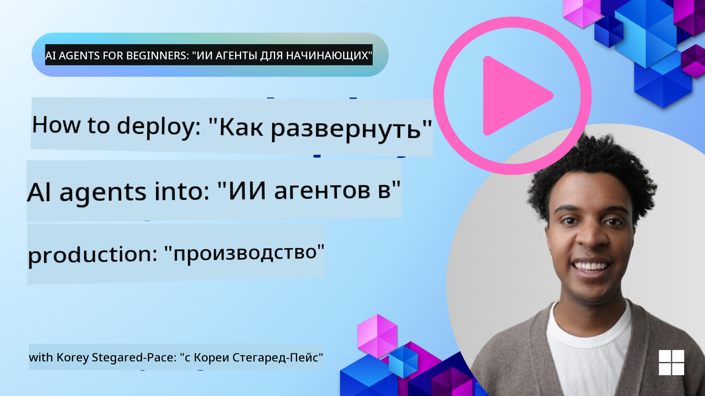

<!--
CO_OP_TRANSLATOR_METADATA:
{
  "original_hash": "1ad5de6a6388d02c145a92dd04358bab",
  "translation_date": "2025-07-12T13:34:53+00:00",
  "source_file": "10-ai-agents-production/README.md",
  "language_code": "ru"
}
-->

> _(Нажмите на изображение выше, чтобы посмотреть видео этого урока)_
# AI-агенты в продакшене

## Введение

В этом уроке мы рассмотрим:

- Как эффективно спланировать развертывание вашего AI-агента в продакшене.
- Распространённые ошибки и проблемы, с которыми вы можете столкнуться при развертывании AI-агента.
- Как контролировать затраты, сохраняя при этом производительность вашего AI-агента.

## Цели обучения

После прохождения этого урока вы будете знать/понимать:

- Методы улучшения производительности, снижения затрат и повышения эффективности системы AI-агентов в продакшене.
- Что и как оценивать у ваших AI-агентов.
- Как контролировать расходы при развертывании AI-агентов в продакшене.

Важно развертывать AI-агентов, которым можно доверять. Рекомендуем также ознакомиться с уроком «Building Trustworthy AI Agents».

## Оценка AI-агентов

До, во время и после развертывания AI-агентов крайне важно иметь надлежащую систему оценки. Это гарантирует, что ваша система соответствует вашим целям и ожиданиям пользователей.

Для оценки AI-агента важно уметь оценивать не только его результаты, но и всю систему, в которой он работает. Это включает, но не ограничивается:

- Исходным запросом к модели.
- Способностью агента определить намерение пользователя.
- Способностью агента выбрать правильный инструмент для выполнения задачи.
- Ответом инструмента на запрос агента.
- Способностью агента интерпретировать ответ инструмента.
- Обратной связью пользователя на ответ агента.

Такой подход позволяет выявлять области для улучшения более модульно. Вы сможете эффективнее отслеживать влияние изменений в моделях, подсказках, инструментах и других компонентах.

## Распространённые проблемы и возможные решения с AI-агентами

| **Проблема**                                   | **Возможное решение**                                                                                                                                                                                                     |
| ---------------------------------------------- | -------------------------------------------------------------------------------------------------------------------------------------------------------------------------------------------------------------------------- |
| AI-агент выполняет задачи непоследовательно    | - Уточните подсказку для AI-агента, чётко обозначьте цели. - Определите, где можно разбить задачи на подзадачи и поручить их нескольким агентам.                                                                        |
| AI-агент зацикливается                         | - Убедитесь, что есть чёткие условия завершения, чтобы агент понимал, когда остановить процесс. - Для сложных задач, требующих рассуждений и планирования, используйте более крупную модель, специализированную на таких задачах. |
| Вызовы инструментов AI-агента работают плохо  | - Тестируйте и проверяйте результаты инструментов вне системы агента. - Уточните параметры, подсказки и названия инструментов.                                                                                        |
| Мультиагентная система работает нестабильно   | - Уточните подсказки для каждого агента, чтобы они были конкретными и отличались друг от друга. - Постройте иерархическую систему с «маршрутизирующим» или контролирующим агентом, который определяет, какой агент подходит лучше. |

## Управление затратами

Вот несколько стратегий для контроля затрат при развертывании AI-агентов в продакшене:

- **Кэширование ответов** — выявление часто повторяющихся запросов и задач и предоставление ответов до их обработки системой агентов — хороший способ снизить количество похожих запросов. Можно даже реализовать механизм, который с помощью более простых AI-моделей определяет степень схожести запроса с кэшированными.

- **Использование меньших моделей** — Малые языковые модели (SLM) могут хорошо справляться с определёнными задачами агентов и значительно снижать затраты. Как уже упоминалось, создание системы оценки для сравнения производительности с более крупными моделями — лучший способ понять, насколько хорошо SLM подойдёт для вашего случая.

- **Использование модели-маршрутизатора** — Похожая стратегия — использовать разнообразие моделей и их размеры. Можно применять LLM/SLM или безсерверные функции для маршрутизации запросов в зависимости от их сложности к наиболее подходящим моделям. Это поможет снизить затраты и обеспечить производительность на нужных задачах.

## Поздравляем

Это пока последний урок курса «AI Agents for Beginners».

Мы планируем продолжать добавлять уроки, учитывая отзывы и изменения в этой постоянно развивающейся области, так что заходите к нам снова в ближайшем будущем.

Если хотите продолжить обучение и разработку с AI-агентами, присоединяйтесь к <a href="https://discord.gg/kzRShWzttr" target="_blank">Azure AI Community Discord</a>.

Там мы проводим мастер-классы, круглые столы сообщества и сессии «спроси меня о чём угодно».

Также у нас есть коллекция Learn с дополнительными материалами, которые помогут вам начать создавать AI-агентов в продакшене.

## Предыдущий урок

[Metacognition Design Pattern](../09-metacognition/README.md)

**Отказ от ответственности**:  
Этот документ был переведен с помощью сервиса автоматического перевода [Co-op Translator](https://github.com/Azure/co-op-translator). Несмотря на наши усилия по обеспечению точности, просим учитывать, что автоматический перевод может содержать ошибки или неточности. Оригинальный документ на его исходном языке следует считать авторитетным источником. Для получения критически важной информации рекомендуется обращаться к профессиональному переводу, выполненному человеком. Мы не несем ответственности за любые недоразумения или неправильные толкования, возникшие в результате использования данного перевода.