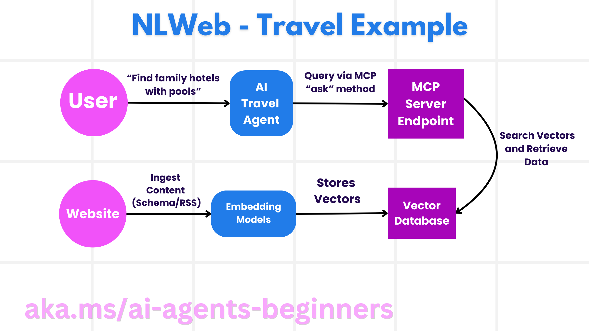

<!--
CO_OP_TRANSLATOR_METADATA:
{
  "original_hash": "5c05bcdfb163dfa2493db39dfb45ad9a",
  "translation_date": "2025-09-04T07:29:59+00:00",
  "source_file": "11-agentic-protocols/README.md",
  "language_code": "ru"
}
-->
# Использование агентных протоколов (MCP, A2A и NLWeb)

С ростом использования ИИ-агентов возрастает потребность в протоколах, которые обеспечивают стандартизацию, безопасность и поддерживают открытые инновации. В этом уроке мы рассмотрим три протокола, которые стремятся удовлетворить эту потребность: Model Context Protocol (MCP), Agent to Agent (A2A) и Natural Language Web (NLWeb).

## Введение

В этом уроке мы рассмотрим:

• Как **MCP** позволяет ИИ-агентам получать доступ к внешним инструментам и данным для выполнения задач пользователя.

• Как **A2A** обеспечивает взаимодействие и сотрудничество между различными ИИ-агентами.

• Как **NLWeb** добавляет интерфейсы на естественном языке к любому веб-сайту, позволяя ИИ-агентам находить и взаимодействовать с контентом.

## Цели обучения

• **Определить** основное назначение и преимущества MCP, A2A и NLWeb в контексте ИИ-агентов.

• **Объяснить**, как каждый протокол облегчает взаимодействие между LLM, инструментами и другими агентами.

• **Распознать** уникальные роли каждого протокола в создании сложных агентных систем.

## Протокол контекста модели (MCP)

**Model Context Protocol (MCP)** — это открытый стандарт, который предоставляет стандартизированный способ для приложений предоставлять контекст и инструменты LLM. Это создает "универсальный адаптер" для различных источников данных и инструментов, к которым ИИ-агенты могут подключаться единообразным образом.

Давайте рассмотрим компоненты MCP, преимущества по сравнению с прямым использованием API и пример того, как ИИ-агенты могут использовать сервер MCP.

### Основные компоненты MCP

MCP работает на основе **архитектуры клиент-сервер**, и его основные компоненты включают:

• **Хосты** — это приложения LLM (например, редактор кода, такой как VSCode), которые инициируют соединения с сервером MCP.

• **Клиенты** — это компоненты внутри хост-приложения, которые поддерживают однонаправленные соединения с серверами.

• **Серверы** — это легковесные программы, которые предоставляют определенные возможности.

Протокол включает три основных примитива, которые представляют собой возможности сервера MCP:

• **Инструменты**: Это отдельные действия или функции, которые ИИ-агент может вызвать для выполнения задачи. Например, сервис погоды может предоставить инструмент "получить погоду", а сервер электронной коммерции — инструмент "купить продукт". Серверы MCP рекламируют имя, описание и схему ввода/вывода каждого инструмента в своем списке возможностей.

• **Ресурсы**: Это данные или документы только для чтения, которые сервер MCP может предоставить, а клиенты могут запрашивать их по мере необходимости. Примеры включают содержимое файлов, записи базы данных или журналы. Ресурсы могут быть текстовыми (например, код или JSON) или бинарными (например, изображения или PDF).

• **Подсказки**: Это заранее определенные шаблоны, которые предоставляют предложенные подсказки, позволяя создавать более сложные рабочие процессы.

### Преимущества MCP

MCP предоставляет значительные преимущества для ИИ-агентов:

• **Динамическое обнаружение инструментов**: Агенты могут динамически получать список доступных инструментов от сервера вместе с описаниями их функций. Это отличается от традиционных API, которые часто требуют статического кодирования для интеграции, что означает необходимость обновления кода при изменении API. MCP предлагает подход "интеграция один раз", обеспечивая большую адаптивность.

• **Совместимость между LLM**: MCP работает с различными LLM, предоставляя гибкость для переключения основных моделей для оценки лучшей производительности.

• **Стандартизированная безопасность**: MCP включает стандартный метод аутентификации, улучшая масштабируемость при добавлении доступа к дополнительным серверам MCP. Это проще, чем управление различными ключами и типами аутентификации для различных традиционных API.

### Пример MCP

Представьте, что пользователь хочет забронировать рейс с помощью ИИ-ассистента, работающего на MCP.

1. **Соединение**: ИИ-ассистент (клиент MCP) подключается к серверу MCP, предоставляемому авиакомпанией.

2. **Обнаружение инструментов**: Клиент спрашивает сервер MCP авиакомпании: "Какие инструменты у вас есть?" Сервер отвечает инструментами, такими как "поиск рейсов" и "бронирование рейсов".

3. **Вызов инструмента**: Затем вы просите ИИ-ассистента: "Пожалуйста, найдите рейс из Портленда в Гонолулу". ИИ-ассистент, используя свой LLM, определяет, что ему нужно вызвать инструмент "поиск рейсов" и передает соответствующие параметры (место отправления, место назначения) серверу MCP.

4. **Выполнение и ответ**: Сервер MCP, действуя как обертка, выполняет фактический вызов внутреннего API бронирования авиакомпании. Затем он получает информацию о рейсе (например, данные JSON) и отправляет ее обратно ИИ-ассистенту.

5. **Дальнейшее взаимодействие**: ИИ-ассистент представляет варианты рейсов. После того как вы выберете рейс, ассистент может вызвать инструмент "бронирование рейса" на том же сервере MCP, завершая бронирование.

## Протокол агент-агент (A2A)

В то время как MCP сосредоточен на подключении LLM к инструментам, **Agent-to-Agent (A2A) протокол** идет дальше, позволяя взаимодействие и сотрудничество между различными ИИ-агентами. A2A соединяет ИИ-агентов из разных организаций, сред и технологических стеков для выполнения общей задачи.

Мы рассмотрим компоненты и преимущества A2A, а также пример его применения в нашем приложении для путешествий.

### Основные компоненты A2A

A2A сосредоточен на обеспечении взаимодействия между агентами и их совместной работе для выполнения подзадачи пользователя. Каждый компонент протокола вносит свой вклад в это:

#### Карточка агента

Подобно тому, как сервер MCP предоставляет список инструментов, карточка агента содержит:
- Имя агента.
- **Описание общих задач**, которые он выполняет.
- **Список конкретных навыков** с описаниями, чтобы помочь другим агентам (или даже пользователям) понять, когда и почему они могут вызвать этого агента.
- **Текущий URL конечной точки** агента.
- **Версию** и **возможности** агента, такие как потоковые ответы и push-уведомления.

#### Исполнитель агента

Исполнитель агента отвечает за **передачу контекста пользовательского чата удаленному агенту**, чтобы тот мог понять задачу, которую нужно выполнить. На сервере A2A агент использует свою собственную модель LLM для анализа входящих запросов и выполнения задач с использованием своих внутренних инструментов.

#### Артефакт

После того как удаленный агент завершил запрошенную задачу, его результат создается в виде артефакта. Артефакт **содержит результат работы агента**, **описание выполненного**, и **текстовый контекст**, который передается через протокол. После отправки артефакта соединение с удаленным агентом закрывается до тех пор, пока оно снова не понадобится.

#### Очередь событий

Этот компонент используется для **обработки обновлений и передачи сообщений**. Он особенно важен в производственных системах для предотвращения закрытия соединения между агентами до завершения задачи, особенно если выполнение задачи занимает длительное время.

### Преимущества A2A

• **Улучшенное сотрудничество**: Протокол позволяет агентам от разных поставщиков и платформ взаимодействовать, делиться контекстом и работать вместе, обеспечивая бесшовную автоматизацию между традиционно разрозненными системами.

• **Гибкость выбора модели**: Каждый агент A2A может самостоятельно решать, какую модель LLM использовать для обработки запросов, что позволяет оптимизировать или настроить модели для каждого агента, в отличие от единого подключения LLM в некоторых сценариях MCP.

• **Встроенная аутентификация**: Аутентификация интегрирована непосредственно в протокол A2A, обеспечивая надежную систему безопасности для взаимодействия агентов.

### Пример A2A

Давайте расширим наш сценарий бронирования путешествия, но теперь с использованием A2A.

1. **Запрос пользователя к мульти-агенту**: Пользователь взаимодействует с "Туристическим агентом" (клиентом/агентом A2A), например, говоря: "Пожалуйста, забронируйте поездку в Гонолулу на следующей неделе, включая рейсы, отель и аренду автомобиля".

2. **Оркестрация туристическим агентом**: Туристический агент получает этот сложный запрос. Он использует свой LLM для анализа задачи и определения необходимости взаимодействия с другими специализированными агентами.

3. **Взаимодействие между агентами**: Туристический агент использует протокол A2A для подключения к агентам, таким как "Агент авиакомпании", "Агент отеля" и "Агент аренды автомобилей", созданным разными компаниями.

4. **Делегирование выполнения задач**: Туристический агент отправляет конкретные задачи этим специализированным агентам (например, "Найти рейсы в Гонолулу", "Забронировать отель", "Арендовать автомобиль"). Каждый из этих специализированных агентов, работающих на своих собственных LLM и используя свои собственные инструменты (которые могут быть серверами MCP), выполняет свою часть бронирования.

5. **Консолидированный ответ**: После того как все агенты завершат свои задачи, туристический агент объединяет результаты (детали рейса, подтверждение бронирования отеля, аренда автомобиля) и отправляет комплексный ответ в стиле чата обратно пользователю.

## Natural Language Web (NLWeb)

Веб-сайты долгое время были основным способом доступа пользователей к информации и данным в интернете.

Давайте рассмотрим различные компоненты NLWeb, его преимущества и пример работы NLWeb, используя наше приложение для путешествий.

### Компоненты NLWeb

- **Приложение NLWeb (основной код сервиса)**: Система, которая обрабатывает вопросы на естественном языке. Она соединяет различные части платформы для создания ответов. Это можно представить как **двигатель, который обеспечивает функции естественного языка** на веб-сайте.

- **Протокол NLWeb**: Это **набор базовых правил для взаимодействия на естественном языке** с веб-сайтом. Он возвращает ответы в формате JSON (часто используя Schema.org). Его цель — создать простую основу для "ИИ-веба", аналогично тому, как HTML сделал возможным обмен документами онлайн.

- **Сервер MCP (конечная точка Model Context Protocol)**: Каждая настройка NLWeb также работает как **сервер MCP**. Это означает, что он может **делиться инструментами (например, методом "ask") и данными** с другими ИИ-системами. На практике это делает контент и возможности веб-сайта доступными для ИИ-агентов, позволяя сайту стать частью более широкой "экосистемы агентов".

- **Модели встраивания**: Эти модели используются для **преобразования контента веб-сайта в числовые представления, называемые векторами** (встраивания). Эти векторы захватывают смысл таким образом, чтобы компьютеры могли сравнивать и искать. Они хранятся в специальной базе данных, и пользователи могут выбирать, какую модель встраивания они хотят использовать.

- **Векторная база данных (механизм извлечения)**: Эта база данных **хранит встраивания контента веб-сайта**. Когда кто-то задает вопрос, NLWeb проверяет векторную базу данных, чтобы быстро найти наиболее релевантную информацию. Она предоставляет быстрый список возможных ответов, ранжированных по схожести. NLWeb работает с различными системами хранения векторов, такими как Qdrant, Snowflake, Milvus, Azure AI Search и Elasticsearch.

### Пример NLWeb

Рассмотрим наш веб-сайт для бронирования путешествий, но теперь он работает на NLWeb.

1. **Загрузка данных**: Существующие каталоги продуктов веб-сайта (например, списки рейсов, описания отелей, туристические пакеты) форматируются с использованием Schema.org или загружаются через RSS-каналы. Инструменты NLWeb загружают эти структурированные данные, создают встраивания и хранят их в локальной или удаленной векторной базе данных.

2. **Запрос на естественном языке (человек)**: Пользователь посещает веб-сайт и, вместо навигации по меню, вводит в интерфейс чата: "Найдите мне семейный отель в Гонолулу с бассейном на следующую неделю".

3. **Обработка NLWeb**: Приложение NLWeb получает этот запрос. Оно отправляет запрос в LLM для понимания и одновременно ищет в своей векторной базе данных релевантные списки отелей.

4. **Точные результаты**: LLM помогает интерпретировать результаты поиска из базы данных, определить лучшие совпадения на основе критериев "семейный", "бассейн" и "Гонолулу", а затем формирует ответ на естественном языке. Важно, что ответ ссылается на реальные отели из каталога веб-сайта, избегая выдуманной информации.

5. **Взаимодействие с ИИ-агентом**: Поскольку NLWeb служит сервером MCP, внешний ИИ-агент для путешествий также может подключиться к экземпляру NLWeb этого веб-сайта. ИИ-агент может использовать метод `ask` MCP для прямого запроса к веб-сайту: `ask("Есть ли в районе Гонолулу веганские рестораны, рекомендованные отелем?")`. Экземпляр NLWeb обработает это, используя свою базу данных информации о ресторанах (если загружена), и вернет структурированный JSON-ответ.

### Остались вопросы о MCP/A2A/NLWeb?

Присоединяйтесь к [Azure AI Foundry Discord](https://aka.ms/ai-agents/discord), чтобы встретиться с другими учащимися, посетить офисные часы и получить ответы на ваши вопросы о ИИ-агентах.

## Ресурсы

- [MCP для начинающих](https://aka.ms/mcp-for-beginners)  
- [Документация MCP](https://github.com/microsoft/semantic-kernel/tree/main/python/semantic-kernel/semantic_kernel/connectors/mcp)
- [Репозиторий NLWeb](https://github.com/nlweb-ai/NLWeb)
- [Руководства Semantic Kernel](https://learn.microsoft.com/semantic-kernel/)

---

**Отказ от ответственности**:  
Этот документ был переведен с помощью сервиса автоматического перевода [Co-op Translator](https://github.com/Azure/co-op-translator). Хотя мы стремимся к точности, пожалуйста, имейте в виду, что автоматические переводы могут содержать ошибки или неточности. Оригинальный документ на его исходном языке следует считать авторитетным источником. Для получения критически важной информации рекомендуется профессиональный перевод человеком. Мы не несем ответственности за любые недоразумения или неправильные толкования, возникшие в результате использования данного перевода.