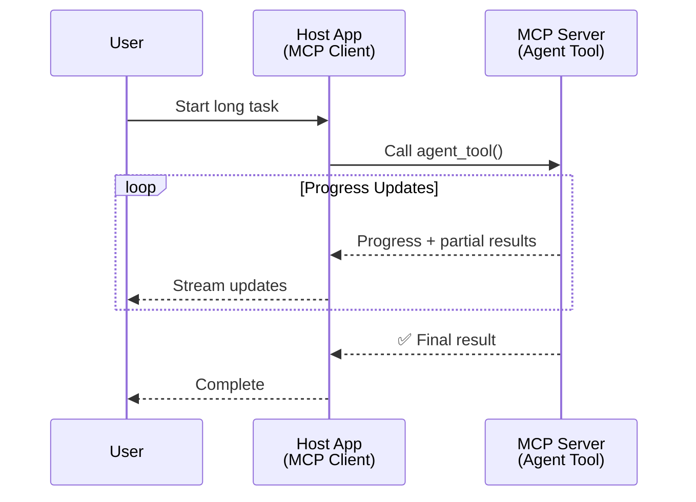
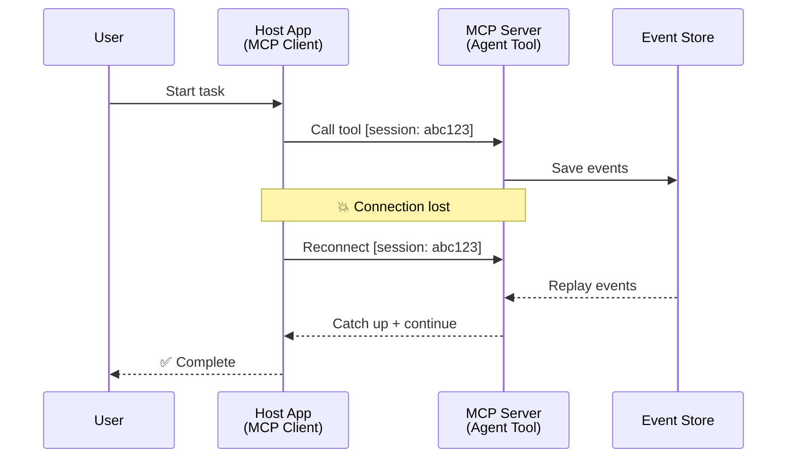
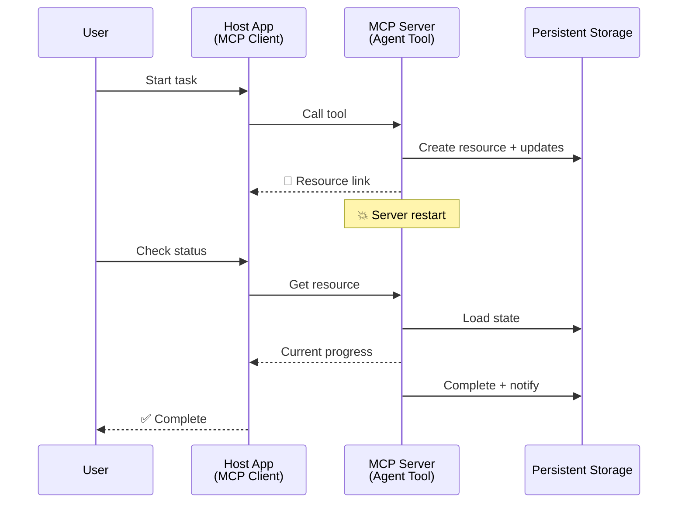
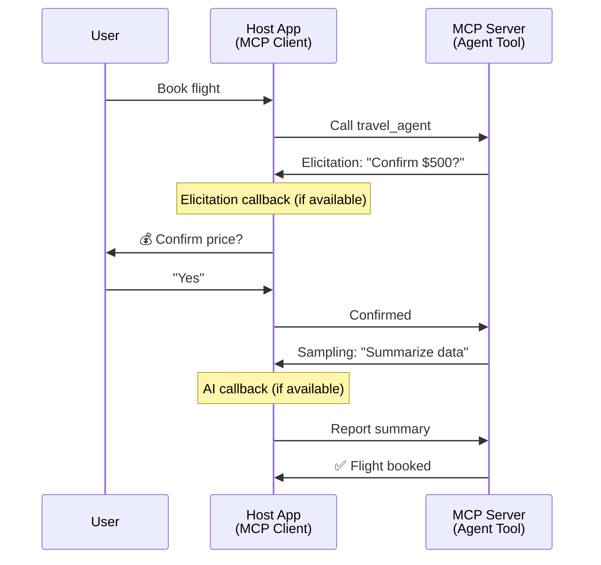
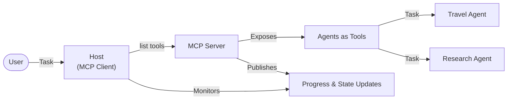

<!--
CO_OP_TRANSLATOR_METADATA:
{
  "original_hash": "5cc6836626047aa055e8960c8484a7d0",
  "translation_date": "2025-08-29T13:26:02+00:00",
  "source_file": "11-agentic-protocols/code_samples/mcp-agents/README.md",
  "language_code": "ru"
}
-->
# Создание систем коммуникации агент-агент с использованием MCP

> Кратко: Можно ли построить коммуникацию Agent2Agent на MCP? Да!

MCP значительно эволюционировал за пределы своей первоначальной цели — "предоставления контекста для LLM". С последними улучшениями, такими как [восстанавливаемые потоки](https://modelcontextprotocol.io/docs/concepts/transports#resumability-and-redelivery), [запросы уточнений](https://modelcontextprotocol.io/specification/2025-06-18/client/elicitation), [выборки](https://modelcontextprotocol.io/specification/2025-06-18/client/sampling) и уведомления ([прогресс](https://modelcontextprotocol.io/specification/2025-06-18/basic/utilities/progress) и [ресурсы](https://modelcontextprotocol.io/specification/2025-06-18/schema#resourceupdatednotification)), MCP теперь предоставляет надежную основу для создания сложных систем коммуникации агент-агент.

## Заблуждение об агентах и инструментах

С ростом числа разработчиков, исследующих инструменты с агентным поведением (длительная работа, необходимость дополнительного ввода во время выполнения и т.д.), распространено заблуждение, что MCP не подходит для таких задач, поскольку ранние примеры его примитивов инструментов были сосредоточены на простых паттернах запрос-ответ.

Это восприятие устарело. Спецификация MCP была значительно улучшена за последние месяцы, чтобы закрыть пробелы для создания долгосрочного агентного поведения:

- **Потоковая передача и частичные результаты**: Обновления прогресса в реальном времени во время выполнения
- **Восстанавливаемость**: Клиенты могут переподключаться и продолжать после разрыва соединения
- **Долговечность**: Результаты сохраняются после перезапуска сервера (например, через ссылки на ресурсы)
- **Многошаговость**: Интерактивный ввод во время выполнения через запросы уточнений и выборки

Эти функции можно комбинировать для создания сложных агентных и мультиагентных приложений, развернутых на протоколе MCP.

Для справки, мы будем называть агентом "инструмент", доступный на сервере MCP. Это подразумевает наличие хост-приложения, которое реализует клиент MCP, устанавливает сессию с сервером MCP и может вызывать агента.

## Что делает инструмент MCP "агентным"?

Прежде чем углубляться в реализацию, давайте определим, какие инфраструктурные возможности необходимы для поддержки долгосрочных агентов.

> Мы определим агента как сущность, которая может работать автономно в течение длительного времени, способную выполнять сложные задачи, требующие нескольких взаимодействий или корректировок на основе обратной связи в реальном времени.

### 1. Потоковая передача и частичные результаты

Традиционные паттерны запрос-ответ не подходят для долгосрочных задач. Агенты должны предоставлять:

- Обновления прогресса в реальном времени
- Промежуточные результаты

**Поддержка MCP**: Уведомления об обновлении ресурсов позволяют передавать частичные результаты в потоковом режиме, хотя это требует тщательного проектирования, чтобы избежать конфликтов с моделью 1:1 запрос/ответ JSON-RPC.

| Функция                   | Пример использования                                                                                                                                                          | Поддержка MCP                                                                            |
| ------------------------- | ---------------------------------------------------------------------------------------------------------------------------------------------------------------------------- | --------------------------------------------------------------------------------------- |
| Обновления прогресса      | Пользователь запрашивает задачу миграции кода. Агент передает прогресс: "10% - Анализ зависимостей... 25% - Конвертация файлов TypeScript... 50% - Обновление импортов..." | ✅ Уведомления о прогрессе                                                              |
| Частичные результаты      | Задача "Создать книгу" передает частичные результаты, например: 1) План сюжета, 2) Список глав, 3) Каждая завершенная глава. Хост может проверять, отменять или перенаправлять на любом этапе. | ✅ Уведомления могут быть "расширены" для включения частичных результатов (см. PR 383, 776) |

<div align="center" style="font-style: italic; font-size: 0.95em; margin-bottom: 0.5em;">
<strong>Рисунок 1:</strong> Диаграмма иллюстрирует, как агент MCP передает обновления прогресса и частичные результаты в реальном времени хост-приложению во время выполнения долгосрочной задачи, позволяя пользователю отслеживать выполнение в реальном времени.
</div>



### 2. Восстанавливаемость

Агенты должны корректно обрабатывать разрывы соединения:

- Переподключение после разрыва соединения (клиент)
- Продолжение с того места, где остановились (повторная доставка сообщений)

**Поддержка MCP**: Транспорт StreamableHTTP в MCP поддерживает восстановление сессий и повторную доставку сообщений с использованием идентификаторов сессий и последних идентификаторов событий. Важно отметить, что сервер должен реализовать EventStore, который позволяет воспроизводить события при переподключении клиента.  
Обратите внимание, что существует предложение сообщества (PR #975), исследующее возможность транспорт-независимых восстанавливаемых потоков.

| Функция         | Пример использования                                                                                                                                 | Поддержка MCP                                                        |
| --------------- | ---------------------------------------------------------------------------------------------------------------------------------------------------- | -------------------------------------------------------------------- |
| Восстанавливаемость | Клиент отключается во время выполнения долгосрочной задачи. После переподключения сессия возобновляется с воспроизведением пропущенных событий, продолжая выполнение без потери прогресса. | ✅ Транспорт StreamableHTTP с идентификаторами сессий, воспроизведением событий и EventStore |

<div align="center" style="font-style: italic; font-size: 0.95em; margin-bottom: 0.5em;">
<strong>Рисунок 2:</strong> Диаграмма показывает, как транспорт StreamableHTTP и хранилище событий MCP обеспечивают бесшовное восстановление сессии: если клиент отключается, он может переподключиться и воспроизвести пропущенные события, продолжая задачу без потери прогресса.
</div>



### 3. Долговечность

Долгосрочные агенты нуждаются в сохранении состояния:

- Результаты сохраняются после перезапуска сервера
- Статус можно получить вне сессии
- Отслеживание прогресса между сессиями

**Поддержка MCP**: MCP теперь поддерживает тип возврата Resource link для вызовов инструментов. Сегодня возможный паттерн — проектировать инструмент, который создает ресурс и немедленно возвращает ссылку на ресурс. Инструмент может продолжать выполнение задачи в фоновом режиме и обновлять ресурс. В свою очередь, клиент может выбрать опрос состояния этого ресурса для получения частичных или полных результатов (в зависимости от того, какие обновления ресурса предоставляет сервер) или подписаться на ресурс для получения уведомлений об обновлениях.

Одним из ограничений здесь является то, что опрос ресурсов или подписка на обновления могут потреблять ресурсы, что имеет последствия при масштабировании. Существует открытое предложение сообщества (включая #992), исследующее возможность включения вебхуков или триггеров, которые сервер может вызывать для уведомления клиента/хост-приложения об обновлениях.

| Функция       | Пример использования                                                                                                                              | Поддержка MCP                                                        |
| ------------- | ------------------------------------------------------------------------------------------------------------------------------------------------ | -------------------------------------------------------------------- |
| Долговечность | Сервер выходит из строя во время задачи миграции данных. Результаты и прогресс сохраняются после перезапуска, клиент может проверить статус и продолжить выполнение из сохраненного ресурса. | ✅ Ссылки на ресурсы с постоянным хранилищем и уведомлениями о статусе |

Сегодня распространенный паттерн — проектировать инструмент, который создает ресурс и немедленно возвращает ссылку на ресурс. Инструмент может в фоновом режиме выполнять задачу, выдавать уведомления о ресурсе, которые служат обновлениями прогресса или включают частичные результаты, и обновлять содержимое ресурса по мере необходимости.

<div align="center" style="font-style: italic; font-size: 0.95em; margin-bottom: 0.5em;">
<strong>Рисунок 3:</strong> Диаграмма демонстрирует, как агенты MCP используют постоянные ресурсы и уведомления о статусе, чтобы гарантировать, что долгосрочные задачи сохраняются после перезапуска сервера, позволяя клиентам проверять прогресс и получать результаты даже после сбоев.
</div>



### 4. Многошаговые взаимодействия

Агенты часто нуждаются в дополнительном вводе во время выполнения:

- Уточнение или подтверждение от человека
- Помощь ИИ для сложных решений
- Динамическая настройка параметров

**Поддержка MCP**: Полностью поддерживается через выборки (для ввода от ИИ) и запросы уточнений (для ввода от человека).

| Функция                 | Пример использования                                                                                                                     | Поддержка MCP                                           |
| ----------------------- | ---------------------------------------------------------------------------------------------------------------------------------------- | ----------------------------------------------------- |
| Многошаговые взаимодействия | Агент бронирования путешествий запрашивает подтверждение цены у пользователя, затем просит ИИ обобщить данные о путешествии перед завершением транзакции. | ✅ Запросы уточнений для ввода от человека, выборки для ввода от ИИ |

<div align="center" style="font-style: italic; font-size: 0.95em; margin-bottom: 0.5em;">
<strong>Рисунок 4:</strong> Диаграмма показывает, как агенты MCP могут интерактивно запрашивать ввод от человека или помощь ИИ во время выполнения, поддерживая сложные многошаговые рабочие процессы, такие как подтверждения и динамическое принятие решений.
</div>



## Реализация долгосрочных агентов на MCP - Обзор кода

В рамках этой статьи мы предоставляем [репозиторий кода](https://github.com/victordibia/ai-tutorials/tree/main/MCP%20Agents), который содержит полную реализацию долгосрочных агентов с использованием MCP Python SDK и транспорта StreamableHTTP для восстановления сессий и повторной доставки сообщений. Реализация демонстрирует, как возможности MCP могут быть скомпонованы для обеспечения сложного агентного поведения.

В частности, мы реализуем сервер с двумя основными инструментами-агентами:

- **Агент путешествий** - Симулирует сервис бронирования путешествий с подтверждением цены через запросы уточнений
- **Агент исследований** - Выполняет исследовательские задачи с помощью ИИ-обобщений через выборки

Оба агента демонстрируют обновления прогресса в реальном времени, интерактивные подтверждения и полные возможности восстановления сессий.

### Основные концепции реализации

Следующие разделы показывают реализацию на стороне сервера и обработку на стороне клиента для каждой возможности:

#### Потоковая передача и обновления прогресса - Статус задачи в реальном времени

Потоковая передача позволяет агентам предоставлять обновления прогресса в реальном времени во время выполнения долгосрочных задач, информируя пользователей о статусе задачи и промежуточных результатах.

**Реализация на сервере (агент отправляет уведомления о прогрессе):**

```python
# From server/server.py - Travel agent sending progress updates
for i, step in enumerate(steps):
    await ctx.session.send_progress_notification(
        progress_token=ctx.request_id,
        progress=i * 25,
        total=100,
        message=step,
        related_request_id=str(ctx.request_id)
    )
    await anyio.sleep(2)  # Simulate work

# Alternative: Log messages for detailed step-by-step updates
await ctx.session.send_log_message(
    level="info",
    data=f"Processing step {current_step}/{steps} ({progress_percent}%)",
    logger="long_running_agent",
    related_request_id=ctx.request_id,
)
```

**Реализация на клиенте (хост получает обновления прогресса):**

```python
# From client/client.py - Client handling real-time notifications
async def message_handler(message) -> None:
    if isinstance(message, types.ServerNotification):
        if isinstance(message.root, types.LoggingMessageNotification):
            console.print(f"📡 [dim]{message.root.params.data}[/dim]")
        elif isinstance(message.root, types.ProgressNotification):
            progress = message.root.params
            console.print(f"🔄 [yellow]{progress.message} ({progress.progress}/{progress.total})[/yellow]")

# Register message handler when creating session
async with ClientSession(
    read_stream, write_stream,
    message_handler=message_handler
) as session:
```

#### Запросы уточнений - Запрос ввода от пользователя

Запросы уточнений позволяют агентам запрашивать ввод от пользователя во время выполнения. Это необходимо для подтверждений, уточнений или одобрений во время выполнения долгосрочных задач.

**Реализация на сервере (агент запрашивает подтверждение):**

```python
# From server/server.py - Travel agent requesting price confirmation
elicit_result = await ctx.session.elicit(
    message=f"Please confirm the estimated price of $1200 for your trip to {destination}",
    requestedSchema=PriceConfirmationSchema.model_json_schema(),
    related_request_id=ctx.request_id,
)

if elicit_result and elicit_result.action == "accept":
    # Continue with booking
    logger.info(f"User confirmed price: {elicit_result.content}")
elif elicit_result and elicit_result.action == "decline":
    # Cancel the booking
    booking_cancelled = True
```

**Реализация на клиенте (хост предоставляет обратный вызов для уточнений):**

```python
# From client/client.py - Client handling elicitation requests
async def elicitation_callback(context, params):
    console.print(f"💬 Server is asking for confirmation:")
    console.print(f"   {params.message}")

    response = console.input("Do you accept? (y/n): ").strip().lower()

    if response in ['y', 'yes']:
        return types.ElicitResult(
            action="accept",
            content={"confirm": True, "notes": "Confirmed by user"}
        )
    else:
        return types.ElicitResult(
            action="decline",
            content={"confirm": False, "notes": "Declined by user"}
        )

# Register the callback when creating the session
async with ClientSession(
    read_stream, write_stream,
    elicitation_callback=elicitation_callback
) as session:
```

#### Выборки - Запрос помощи ИИ

Выборки позволяют агентам запрашивать помощь LLM для сложных решений или генерации контента во время выполнения. Это позволяет реализовать гибридные рабочие процессы человек-ИИ.

**Реализация на сервере (агент запрашивает помощь ИИ):**

```python
# From server/server.py - Research agent requesting AI summary
sampling_result = await ctx.session.create_message(
    messages=[
        SamplingMessage(
            role="user",
            content=TextContent(type="text", text=f"Please summarize the key findings for research on: {topic}")
        )
    ],
    max_tokens=100,
    related_request_id=ctx.request_id,
)

if sampling_result and sampling_result.content:
    if sampling_result.content.type == "text":
        sampling_summary = sampling_result.content.text
        logger.info(f"Received sampling summary: {sampling_summary}")
```

**Реализация на клиенте (хост предоставляет обратный вызов для выборки):**

```python
# From client/client.py - Client handling sampling requests
async def sampling_callback(context, params):
    message_text = params.messages[0].content.text if params.messages else 'No message'
    console.print(f"🧠 Server requested sampling: {message_text}")

    # In a real application, this could call an LLM API
    # For demo purposes, we provide a mock response
    mock_response = "Based on current research, MCP has evolved significantly..."

    return types.CreateMessageResult(
        role="assistant",
        content=types.TextContent(type="text", text=mock_response),
        model="interactive-client",
        stopReason="endTurn"
    )

# Register the callback when creating the session
async with ClientSession(
    read_stream, write_stream,
    sampling_callback=sampling_callback,
    elicitation_callback=elicitation_callback
) as session:
```

#### Восстанавливаемость - Непрерывность сессии при разрывах соединения

Восстанавливаемость гарантирует, что долгосрочные задачи агентов могут пережить разрывы соединения клиента и продолжаться бесшовно после переподключения. Это реализуется через хранилища событий и токены восстановления.

**Реализация хранилища событий (сервер сохраняет состояние сессии):**

```python
# From server/event_store.py - Simple in-memory event store
class SimpleEventStore(EventStore):
    def __init__(self):
        self._events: list[tuple[StreamId, EventId, JSONRPCMessage]] = []
        self._event_id_counter = 0

    async def store_event(self, stream_id: StreamId, message: JSONRPCMessage) -> EventId:
        """Store an event and return its ID."""
        self._event_id_counter += 1
        event_id = str(self._event_id_counter)
        self._events.append((stream_id, event_id, message))
        return event_id

    async def replay_events_after(self, last_event_id: EventId, send_callback: EventCallback) -> StreamId | None:
        """Replay events after the specified ID for resumption."""
        # Find events after the last known event and replay them
        for _, event_id, message in self._events[start_index:]:
            await send_callback(EventMessage(message, event_id))

# From server/server.py - Passing event store to session manager
def create_server_app(event_store: Optional[EventStore] = None) -> Starlette:
    server = ResumableServer()

    # Create session manager with event store for resumption
    session_manager = StreamableHTTPSessionManager(
        app=server,
        event_store=event_store,  # Event store enables session resumption
        json_response=False,
        security_settings=security_settings,
    )

    return Starlette(routes=[Mount("/mcp", app=session_manager.handle_request)])

# Usage: Initialize with event store
event_store = SimpleEventStore()
app = create_server_app(event_store)
```

**Метаданные клиента с токеном восстановления (клиент переподключается, используя сохраненное состояние):**

```python
# From client/client.py - Client resumption with metadata
if existing_tokens and existing_tokens.get("resumption_token"):
    # Use existing resumption token to continue where we left off
    metadata = ClientMessageMetadata(
        resumption_token=existing_tokens["resumption_token"],
    )
else:
    # Create callback to save resumption token when received
    def enhanced_callback(token: str):
        protocol_version = getattr(session, 'protocol_version', None)
        token_manager.save_tokens(session_id, token, protocol_version, command, args)

    metadata = ClientMessageMetadata(
        on_resumption_token_update=enhanced_callback,
    )

# Send request with resumption metadata
result = await session.send_request(
    types.ClientRequest(
        types.CallToolRequest(
            method="tools/call",
            params=types.CallToolRequestParams(name=command, arguments=args)
        )
    ),
    types.CallToolResult,
    metadata=metadata,
)
```

Хост-приложение сохраняет локально идентификаторы сессий и токены восстановления, что позволяет ему переподключаться к существующим сессиям без потери прогресса или состояния.

### Организация кода

<div align="center" style="font-style: italic; font-size: 0.95em; margin-bottom: 0.5em;">
<strong>Рисунок 5:</strong> Архитектура системы агентов на основе MCP
</div>



**Ключевые файлы:**

- **`server/server.py`** - MCP-сервер с поддержкой восстановления, включающий агентов путешествий и исследований, демонстрирующих запросы уточнений, выборки и обновления прогресса
- **`client/client.py`** - Интерактивное хост-приложение с поддержкой восстановления, обработчиками обратных вызовов и управлением токенами
- **`server/event_store.py`** - Реализация хранилища событий, обеспечивающая восстановление сессий и повторную доставку сообщений

## Расширение до мультиагентной коммуникации на MCP

Реализация выше может быть расширена до мультиагентных систем путем улучшения интеллекта и охвата хост-приложения:

- **Интеллектуальная декомпозиция задач**: Хост анализирует сложные запросы пользователей и разбивает их на подзадачи для различных специализированных агентов
- **Координация между серверами**: Хост поддерживает соединения с несколькими серверами MCP, каждый из которых предоставляет различные возможности агентов
- **Управление состоянием задач**: Хост отслеживает прогресс по нескольким параллельным задачам агентов, обрабатывая зависимости и последовательность
- **Устойчивость и повторные попытки**: Хост управляет сбоями, реализует логику повторных попыток и перенаправляет задачи, когда агенты становятся недоступными
- **Синтез результатов**: Хост объединяет результаты от нескольких агентов в единый итоговый результат

Хост эволюционирует из простого клиента в интеллектуального оркестратора, координирующего распределенные возможности агентов, сохраняя при этом ту же основу протокола MCP.

## Заключение

Расширенные возможности MCP — уведомления о ресурсах, запросы уточнений/выборки, восстанавливаемые потоки и постоянные ресурсы — позволяют реализовать сложные взаимодействия агент-агент, сохраняя при этом простоту протокола.

## Начало работы

Готовы создать свою систему agent2agent? Следуйте этим шагам:

### 1. Запустите демонстрацию

```bash
# Start the server with event store for resumption
python -m server.server --port 8006

# In another terminal, run the interactive client
python -m client.client --url http://127.0.0.1:8006/mcp
```

**Доступные команды в интерактивном режиме:**

- `travel_agent` - Забронировать путешествие с подтверждением цены через запросы уточнений
- `research_agent` - Исследовать темы с помощью ИИ-обобщений через выборки
- `list` - Показать все доступные инструменты
- `clean-tokens` - Очистить токены восстановления
- `help` - Показать подробную справку по командам
- `quit` - Выйти из клиента

### 2. Проверьте возможности восстановления

- Запустите долгосрочного агента (например, `travel_agent`)
- Прервите клиента во время выполнения (Ctrl+C)
- Перезапустите клиента — он автоматически возобновит выполнение с того места, где остановился

### 3. Исследуйте и расширяйте

- **Изучите примеры**: Ознакомьтесь с этим [репозиторием mcp-agents](https://github.com/victordibia/ai-tutorials/tree/main/MCP%20Agents)
- **Присоединяйтесь к сообществу**: Участвуйте в обсуждениях MCP на GitHub
- **Экспериментируйте**: Начните с простой долгосрочной задачи и постепенно добавляйте потоковую передачу, восстанавливаемость и координацию мультиагентов

Это демонстрирует, как MCP позволяет реализовать интеллектуальное поведение агентов, сохраняя при этом простоту инструментов.

В целом, спецификация протокола MCP быстро развивается; рекомендуется ознакомиться с официальным сайтом документации для получения самых последних обновлений — https://modelcontextprotocol.io/introduction

---

**Отказ от ответственности**:  
Этот документ был переведен с использованием сервиса автоматического перевода [Co-op Translator](https://github.com/Azure/co-op-translator). Хотя мы стремимся к точности, пожалуйста, имейте в виду, что автоматические переводы могут содержать ошибки или неточности. Оригинальный документ на его исходном языке следует считать авторитетным источником. Для получения критически важной информации рекомендуется профессиональный перевод человеком. Мы не несем ответственности за любые недоразумения или неправильные интерпретации, возникшие в результате использования данного перевода.