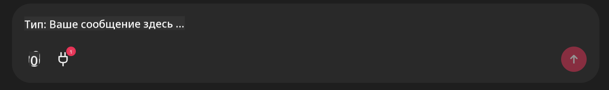

<!--
CO_OP_TRANSLATOR_METADATA:
{
  "original_hash": "9bf0395cbc541ce8db2a9699c8678dfc",
  "translation_date": "2025-07-12T14:19:53+00:00",
  "source_file": "11-mcp/code_samples/github-mcp/README.md",
  "language_code": "ru"
}
-->
# Пример сервера Github MCP

## Описание

Это демонстрация, созданная для AI Agents Hackathon, проходившего в Microsoft Reactor.

Этот инструмент используется для рекомендаций проектов для хакатона на основе репозиториев пользователя на Github.  
Это достигается с помощью:

1. **Github Agent** — использует Github MCP Server для получения репозиториев и информации о них.  
2. **Hackathon Agent** — берет данные от Github Agent и предлагает креативные идеи проектов для хакатона, основываясь на проектах, языках программирования пользователя и треках AI Agents hackathon.  
3. **Events Agent** — на основе предложений Hackathon Agent рекомендует соответствующие мероприятия из серии AI Agent Hackathon.

## Запуск кода

### Переменные окружения

В этой демонстрации используются Azure Open AI Service, Semantic Kernel, Github MCP Server и Azure AI Search.

Убедитесь, что у вас правильно настроены переменные окружения для работы с этими инструментами:

```python
AZURE_OPENAI_CHAT_DEPLOYMENT_NAME=""
AZURE_OPENAI_EMBEDDING_DEPLOYMENT_NAME=""
AZURE_OPENAI_ENDPOINT=""
AZURE_OPENAI_API_KEY=""
AZURE_OPENAI_API_VERSION=""
AZURE_SEARCH_SERVICE_ENDPOINT=""
AZURE_SEARCH_API_KEY=""
```

## Запуск Chainlit сервера

Для подключения к MCP серверу в этой демонстрации используется Chainlit в качестве интерфейса чата.

Чтобы запустить сервер, выполните следующую команду в терминале:

```bash
chainlit run app.py -w
```

Это запустит Chainlit сервер на `localhost:8000` и заполнит индекс Azure AI Search содержимым из `event-descriptions.md`.

## Подключение к MCP серверу

Чтобы подключиться к Github MCP Server, нажмите на иконку "штекера" под полем ввода "Type your message here..":



Далее нажмите "Connect an MCP", чтобы добавить команду подключения к Github MCP Server:

```bash
npx -y @modelcontextprotocol/server-github --env GITHUB_PERSONAL_ACCESS_TOKEN=[YOUR PERSONAL ACCESS TOKEN]
```

Замените "[YOUR PERSONAL ACCESS TOKEN]" на ваш реальный персональный токен доступа.

После подключения рядом с иконкой штекера должен появиться (1), подтверждающий успешное соединение. Если нет, попробуйте перезапустить chainlit сервер командой `chainlit run app.py -w`.

## Использование демо

Чтобы запустить процесс рекомендаций проектов для хакатона, введите сообщение, например:

"Recommend hackathon projects for the Github user koreyspace"

Router Agent проанализирует ваш запрос и определит, какая комбинация агентов (GitHub, Hackathon и Events) лучше всего подойдет для обработки вашего запроса. Агенты работают вместе, чтобы предоставить комплексные рекомендации на основе анализа репозиториев GitHub, генерации идей проектов и релевантных технических мероприятий.

**Отказ от ответственности**:  
Этот документ был переведен с помощью сервиса автоматического перевода [Co-op Translator](https://github.com/Azure/co-op-translator). Несмотря на наши усилия по обеспечению точности, просим учитывать, что автоматический перевод может содержать ошибки или неточности. Оригинальный документ на его исходном языке следует считать авторитетным источником. Для получения критически важной информации рекомендуется обращаться к профессиональному переводу, выполненному человеком. Мы не несем ответственности за любые недоразумения или неправильные толкования, возникшие в результате использования данного перевода.