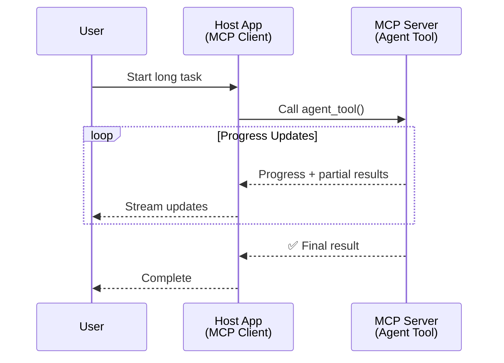
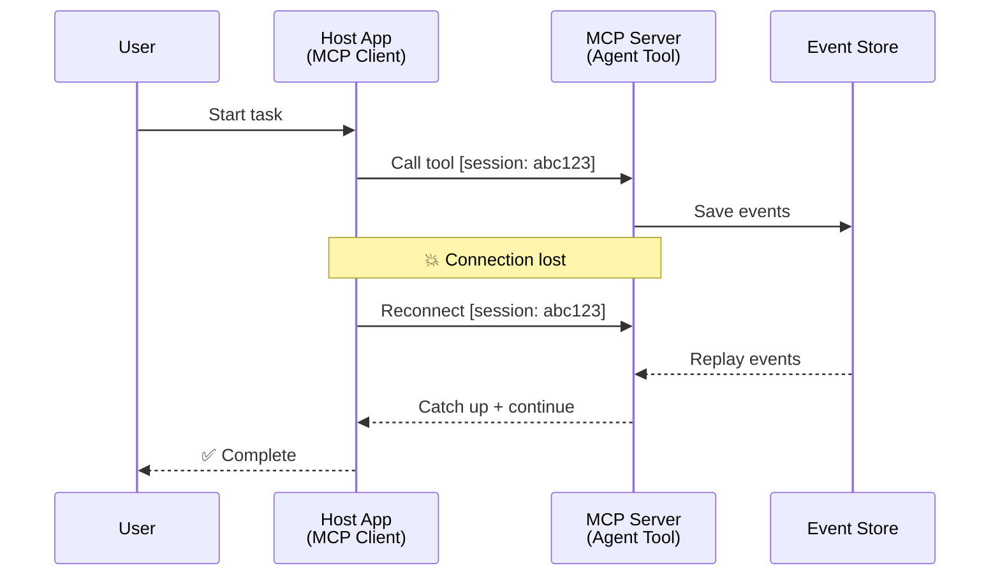
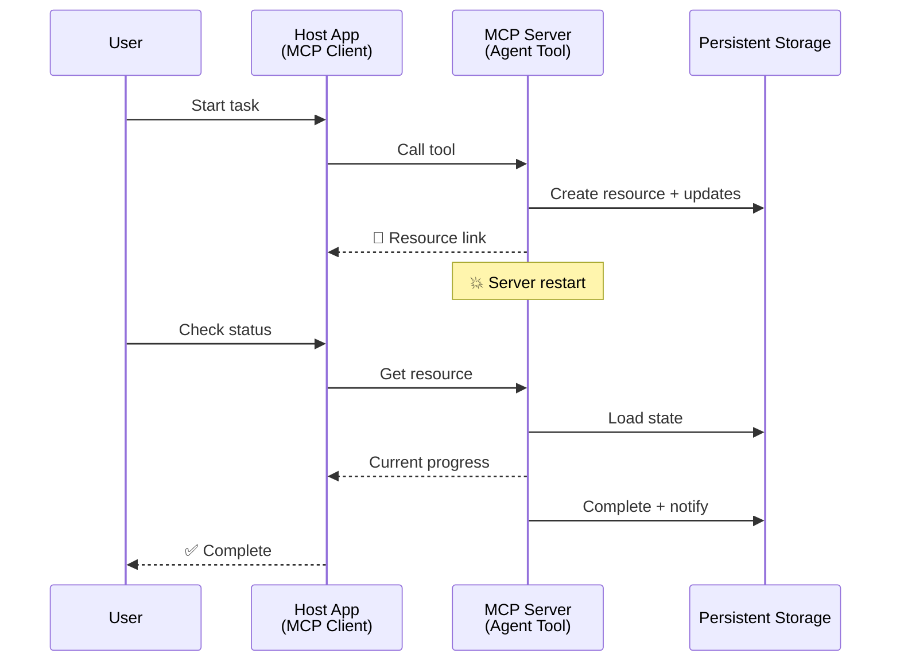
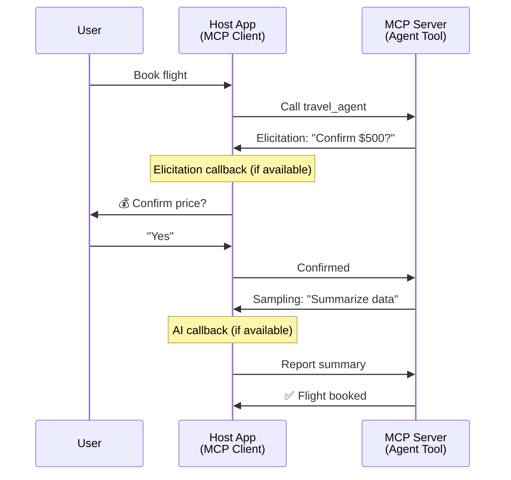
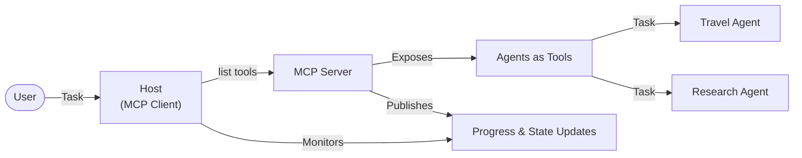

<!--
CO_OP_TRANSLATOR_METADATA:
{
  "original_hash": "5cc6836626047aa055e8960c8484a7d0",
  "translation_date": "2025-08-21T14:15:37+00:00",
  "source_file": "11-mcp/code_samples/mcp-agents/README.md",
  "language_code": "ru"
}
-->
# Создание систем коммуникации между агентами с MCP

> Кратко - Можно ли построить коммуникацию Agent2Agent на MCP? Да!

MCP значительно развился за пределы своей первоначальной цели — "предоставление контекста для LLM". С недавними улучшениями, такими как [восстанавливаемые потоки](https://modelcontextprotocol.io/docs/concepts/transports#resumability-and-redelivery), [запросы](https://modelcontextprotocol.io/specification/2025-06-18/client/elicitation), [выборка](https://modelcontextprotocol.io/specification/2025-06-18/client/sampling) и уведомления ([прогресс](https://modelcontextprotocol.io/specification/2025-06-18/basic/utilities/progress) и [ресурсы](https://modelcontextprotocol.io/specification/2025-06-18/schema#resourceupdatednotification)), MCP теперь предоставляет надежную основу для создания сложных систем коммуникации между агентами.

## Заблуждение об агентах и инструментах

С ростом числа разработчиков, изучающих инструменты с агентным поведением (работа в течение длительного времени, необходимость дополнительного ввода во время выполнения и т.д.), распространено заблуждение, что MCP не подходит, главным образом потому, что ранние примеры его примитивов инструментов были сосредоточены на простых паттернах запрос-ответ.

Это восприятие устарело. Спецификация MCP была значительно улучшена за последние месяцы, чтобы закрыть пробелы в создании долгосрочного агентного поведения:

- **Потоковая передача и частичные результаты**: Обновления прогресса в реальном времени во время выполнения
- **Восстанавливаемость**: Клиенты могут переподключаться и продолжать после разрыва соединения
- **Долговечность**: Результаты сохраняются после перезапуска сервера (например, через ссылки на ресурсы)
- **Многоходовые взаимодействия**: Интерактивный ввод во время выполнения через запросы и выборку

Эти функции можно комбинировать для создания сложных агентных и мультиагентных приложений, развернутых на протоколе MCP.

Для справки, мы будем называть агента "инструментом", доступным на сервере MCP. Это подразумевает наличие хост-приложения, которое реализует клиент MCP, устанавливает сессию с сервером MCP и может вызывать агента.

## Что делает инструмент MCP "агентным"?

Прежде чем перейти к реализации, давайте определим, какие инфраструктурные возможности необходимы для поддержки долгосрочных агентов.

> Мы определим агента как сущность, способную работать автономно в течение длительного времени, справляться со сложными задачами, которые могут требовать многократных взаимодействий или корректировок на основе обратной связи в реальном времени.

### 1. Потоковая передача и частичные результаты

Традиционные паттерны запрос-ответ не подходят для долгосрочных задач. Агенты должны предоставлять:

- Обновления прогресса в реальном времени
- Промежуточные результаты

**Поддержка MCP**: Уведомления об обновлении ресурсов позволяют передавать частичные результаты, хотя это требует тщательного проектирования, чтобы избежать конфликтов с моделью 1:1 запрос/ответ JSON-RPC.

| Функция                   | Пример использования                                                                                                                                                          | Поддержка MCP                                                                            |
| ------------------------- | ----------------------------------------------------------------------------------------------------------------------------------------------------------------------------- | --------------------------------------------------------------------------------------- |
| Обновления прогресса      | Пользователь запрашивает задачу миграции кодовой базы. Агент передает прогресс: "10% - Анализ зависимостей... 25% - Конвертация файлов TypeScript... 50% - Обновление импортов..." | ✅ Уведомления о прогрессе                                                              |
| Частичные результаты      | Задача "Создать книгу" передает частичные результаты, например: 1) Схема сюжета, 2) Список глав, 3) Каждая глава по мере завершения. Хост может проверять, отменять или перенаправлять на любом этапе. | ✅ Уведомления могут быть "расширены" для включения частичных результатов, см. предложения PR 383, 776 |

<div align="center" style="font-style: italic; font-size: 0.95em; margin-bottom: 0.5em;">
<strong>Рисунок 1:</strong> Эта диаграмма иллюстрирует, как агент MCP передает обновления прогресса и частичные результаты в реальном времени хост-приложению во время выполнения долгосрочной задачи, позволяя пользователю отслеживать выполнение в реальном времени.
</div>



### 2. Восстанавливаемость

Агенты должны справляться с перебоями в сети:

- Переподключение после разрыва соединения (клиент)
- Продолжение с того места, где они остановились (повторная доставка сообщений)

**Поддержка MCP**: Транспорт StreamableHTTP MCP сегодня поддерживает восстановление сессии и повторную доставку сообщений с идентификаторами сессии и идентификаторами последнего события. Важно отметить, что сервер должен реализовать EventStore, который позволяет воспроизводить события при переподключении клиента.  
Обратите внимание, что существует предложение сообщества (PR #975), которое исследует транспорт-независимые восстанавливаемые потоки.

| Функция         | Пример использования                                                                                                                                 | Поддержка MCP                                                        |
| --------------- | ---------------------------------------------------------------------------------------------------------------------------------------------------- | -------------------------------------------------------------------- |
| Восстанавливаемость | Клиент отключается во время выполнения долгосрочной задачи. При переподключении сессия возобновляется с воспроизведением пропущенных событий, продолжая без потери прогресса. | ✅ Транспорт StreamableHTTP с идентификаторами сессии, воспроизведением событий и EventStore |

<div align="center" style="font-style: italic; font-size: 0.95em; margin-bottom: 0.5em;">
<strong>Рисунок 2:</strong> Эта диаграмма показывает, как транспорт StreamableHTTP MCP и хранилище событий обеспечивают бесшовное восстановление сессии: если клиент отключается, он может переподключиться и воспроизвести пропущенные события, продолжая задачу без потери прогресса.
</div>



### 3. Долговечность

Долгосрочные агенты нуждаются в сохранении состояния:

- Результаты сохраняются после перезапуска сервера
- Статус можно получить вне сессии
- Отслеживание прогресса между сессиями

**Поддержка MCP**: MCP теперь поддерживает тип возвращаемого значения Resource link для вызовов инструментов. Сегодня возможный паттерн — разработать инструмент, который создает ресурс и немедленно возвращает ссылку на ресурс. Инструмент может продолжать выполнять задачу в фоновом режиме и обновлять ресурс. В свою очередь, клиент может выбрать опрос состояния этого ресурса, чтобы получить частичные или полные результаты (на основе того, какие обновления ресурса предоставляет сервер) или подписаться на ресурс для получения уведомлений об обновлениях.

Одно из ограничений здесь заключается в том, что опрос ресурсов или подписка на обновления может потреблять ресурсы с последствиями для масштабирования. Существует открытое предложение сообщества (включая #992), которое исследует возможность включения вебхуков или триггеров, которые сервер может вызывать для уведомления клиента/хост-приложения об обновлениях.

| Функция       | Пример использования                                                                                                                               | Поддержка MCP                                                        |
| ------------- | ------------------------------------------------------------------------------------------------------------------------------------------------- | -------------------------------------------------------------------- |
| Долговечность | Сервер выходит из строя во время задачи миграции данных. Результаты и прогресс сохраняются после перезапуска, клиент может проверить статус и продолжить с сохраненного ресурса. | ✅ Ссылки на ресурсы с постоянным хранилищем и уведомлениями о статусе |

Сегодня распространенный паттерн — разработать инструмент, который создает ресурс и немедленно возвращает ссылку на ресурс. Инструмент может в фоновом режиме выполнять задачу, выдавать уведомления о ресурсе, которые служат обновлениями прогресса или включают частичные результаты, и обновлять содержимое ресурса по мере необходимости.

<div align="center" style="font-style: italic; font-size: 0.95em; margin-bottom: 0.5em;">
<strong>Рисунок 3:</strong> Эта диаграмма демонстрирует, как агенты MCP используют постоянные ресурсы и уведомления о статусе, чтобы гарантировать, что долгосрочные задачи переживают перезапуск сервера, позволяя клиентам проверять прогресс и получать результаты даже после сбоев.
</div>



### 4. Многоходовые взаимодействия

Агенты часто нуждаются в дополнительном вводе во время выполнения:

- Уточнение или подтверждение от человека
- Помощь ИИ для сложных решений
- Динамическая настройка параметров

**Поддержка MCP**: Полностью поддерживается через выборку (для ввода ИИ) и запросы (для ввода человека).

| Функция                 | Пример использования                                                                                                                      | Поддержка MCP                                           |
| ----------------------- | ----------------------------------------------------------------------------------------------------------------------------------------- | ----------------------------------------------------- |
| Многоходовые взаимодействия | Агент бронирования путешествий запрашивает подтверждение цены у пользователя, затем просит ИИ обобщить данные о путешествии перед завершением транзакции. | ✅ Запросы для ввода человека, выборка для ввода ИИ |

<div align="center" style="font-style: italic; font-size: 0.95em; margin-bottom: 0.5em;">
<strong>Рисунок 4:</strong> Эта диаграмма показывает, как агенты MCP могут интерактивно запрашивать ввод человека или помощь ИИ во время выполнения, поддерживая сложные, многоходовые рабочие процессы, такие как подтверждения и динамическое принятие решений.
</div>



## Реализация долгосрочных агентов на MCP - обзор кода

В рамках этой статьи мы предоставляем [репозиторий кода](https://github.com/victordibia/ai-tutorials/tree/main/MCP%20Agents), который содержит полную реализацию долгосрочных агентов с использованием MCP Python SDK с транспортом StreamableHTTP для восстановления сессии и повторной доставки сообщений. Реализация демонстрирует, как возможности MCP могут быть объединены для создания сложного поведения, похожего на агента.

В частности, мы реализуем сервер с двумя основными инструментами-агентами:

- **Агент путешествий** - Симулирует сервис бронирования путешествий с подтверждением цены через запросы
- **Агент исследований** - Выполняет исследовательские задачи с помощью ИИ-обобщений через выборку

Оба агента демонстрируют обновления прогресса в реальном времени, интерактивные подтверждения и полные возможности восстановления сессии.

### Основные концепции реализации

Следующие разделы показывают реализацию агента на стороне сервера и обработку хоста на стороне клиента для каждой функции:

#### Потоковая передача и обновления прогресса - статус задачи в реальном времени

Потоковая передача позволяет агентам предоставлять обновления прогресса в реальном времени во время выполнения долгосрочных задач, информируя пользователей о статусе задачи и промежуточных результатах.

**Реализация на сервере (агент отправляет уведомления о прогрессе):**

```python
# From server/server.py - Travel agent sending progress updates
for i, step in enumerate(steps):
    await ctx.session.send_progress_notification(
        progress_token=ctx.request_id,
        progress=i * 25,
        total=100,
        message=step,
        related_request_id=str(ctx.request_id)
    )
    await anyio.sleep(2)  # Simulate work

# Alternative: Log messages for detailed step-by-step updates
await ctx.session.send_log_message(
    level="info",
    data=f"Processing step {current_step}/{steps} ({progress_percent}%)",
    logger="long_running_agent",
    related_request_id=ctx.request_id,
)
```

**Реализация на клиенте (хост получает обновления прогресса):**

```python
# From client/client.py - Client handling real-time notifications
async def message_handler(message) -> None:
    if isinstance(message, types.ServerNotification):
        if isinstance(message.root, types.LoggingMessageNotification):
            console.print(f"📡 [dim]{message.root.params.data}[/dim]")
        elif isinstance(message.root, types.ProgressNotification):
            progress = message.root.params
            console.print(f"🔄 [yellow]{progress.message} ({progress.progress}/{progress.total})[/yellow]")

# Register message handler when creating session
async with ClientSession(
    read_stream, write_stream,
    message_handler=message_handler
) as session:
```

#### Запросы - запрос ввода пользователя

Запросы позволяют агентам запрашивать ввод пользователя во время выполнения. Это необходимо для подтверждений, уточнений или одобрений во время выполнения долгосрочных задач.

**Реализация на сервере (агент запрашивает подтверждение):**

```python
# From server/server.py - Travel agent requesting price confirmation
elicit_result = await ctx.session.elicit(
    message=f"Please confirm the estimated price of $1200 for your trip to {destination}",
    requestedSchema=PriceConfirmationSchema.model_json_schema(),
    related_request_id=ctx.request_id,
)

if elicit_result and elicit_result.action == "accept":
    # Continue with booking
    logger.info(f"User confirmed price: {elicit_result.content}")
elif elicit_result and elicit_result.action == "decline":
    # Cancel the booking
    booking_cancelled = True
```

**Реализация на клиенте (хост предоставляет обратный вызов для запросов):**

```python
# From client/client.py - Client handling elicitation requests
async def elicitation_callback(context, params):
    console.print(f"💬 Server is asking for confirmation:")
    console.print(f"   {params.message}")

    response = console.input("Do you accept? (y/n): ").strip().lower()

    if response in ['y', 'yes']:
        return types.ElicitResult(
            action="accept",
            content={"confirm": True, "notes": "Confirmed by user"}
        )
    else:
        return types.ElicitResult(
            action="decline",
            content={"confirm": False, "notes": "Declined by user"}
        )

# Register the callback when creating the session
async with ClientSession(
    read_stream, write_stream,
    elicitation_callback=elicitation_callback
) as session:
```

#### Выборка - запрос помощи ИИ

Выборка позволяет агентам запрашивать помощь LLM для сложных решений или генерации контента во время выполнения. Это позволяет создавать гибридные рабочие процессы человек-ИИ.

**Реализация на сервере (агент запрашивает помощь ИИ):**

```python
# From server/server.py - Research agent requesting AI summary
sampling_result = await ctx.session.create_message(
    messages=[
        SamplingMessage(
            role="user",
            content=TextContent(type="text", text=f"Please summarize the key findings for research on: {topic}")
        )
    ],
    max_tokens=100,
    related_request_id=ctx.request_id,
)

if sampling_result and sampling_result.content:
    if sampling_result.content.type == "text":
        sampling_summary = sampling_result.content.text
        logger.info(f"Received sampling summary: {sampling_summary}")
```

**Реализация на клиенте (хост предоставляет обратный вызов для выборки):**

```python
# From client/client.py - Client handling sampling requests
async def sampling_callback(context, params):
    message_text = params.messages[0].content.text if params.messages else 'No message'
    console.print(f"🧠 Server requested sampling: {message_text}")

    # In a real application, this could call an LLM API
    # For demo purposes, we provide a mock response
    mock_response = "Based on current research, MCP has evolved significantly..."

    return types.CreateMessageResult(
        role="assistant",
        content=types.TextContent(type="text", text=mock_response),
        model="interactive-client",
        stopReason="endTurn"
    )

# Register the callback when creating the session
async with ClientSession(
    read_stream, write_stream,
    sampling_callback=sampling_callback,
    elicitation_callback=elicitation_callback
) as session:
```

#### Восстанавливаемость - непрерывность сессии при разрывах соединения

Восстанавливаемость гарантирует, что долгосрочные задачи агентов могут пережить разрывы соединения клиента и продолжаться бесшовно при переподключении. Это реализуется через хранилища событий и токены восстановления.

**Реализация хранилища событий (сервер сохраняет состояние сессии):**

```python
# From server/event_store.py - Simple in-memory event store
class SimpleEventStore(EventStore):
    def __init__(self):
        self._events: list[tuple[StreamId, EventId, JSONRPCMessage]] = []
        self._event_id_counter = 0

    async def store_event(self, stream_id: StreamId, message: JSONRPCMessage) -> EventId:
        """Store an event and return its ID."""
        self._event_id_counter += 1
        event_id = str(self._event_id_counter)
        self._events.append((stream_id, event_id, message))
        return event_id

    async def replay_events_after(self, last_event_id: EventId, send_callback: EventCallback) -> StreamId | None:
        """Replay events after the specified ID for resumption."""
        # Find events after the last known event and replay them
        for _, event_id, message in self._events[start_index:]:
            await send_callback(EventMessage(message, event_id))

# From server/server.py - Passing event store to session manager
def create_server_app(event_store: Optional[EventStore] = None) -> Starlette:
    server = ResumableServer()

    # Create session manager with event store for resumption
    session_manager = StreamableHTTPSessionManager(
        app=server,
        event_store=event_store,  # Event store enables session resumption
        json_response=False,
        security_settings=security_settings,
    )

    return Starlette(routes=[Mount("/mcp", app=session_manager.handle_request)])

# Usage: Initialize with event store
event_store = SimpleEventStore()
app = create_server_app(event_store)
```

**Метаданные клиента с токеном восстановления (клиент переподключается, используя сохраненное состояние):**

```python
# From client/client.py - Client resumption with metadata
if existing_tokens and existing_tokens.get("resumption_token"):
    # Use existing resumption token to continue where we left off
    metadata = ClientMessageMetadata(
        resumption_token=existing_tokens["resumption_token"],
    )
else:
    # Create callback to save resumption token when received
    def enhanced_callback(token: str):
        protocol_version = getattr(session, 'protocol_version', None)
        token_manager.save_tokens(session_id, token, protocol_version, command, args)

    metadata = ClientMessageMetadata(
        on_resumption_token_update=enhanced_callback,
    )

# Send request with resumption metadata
result = await session.send_request(
    types.ClientRequest(
        types.CallToolRequest(
            method="tools/call",
            params=types.CallToolRequestParams(name=command, arguments=args)
        )
    ),
    types.CallToolResult,
    metadata=metadata,
)
```

Хост-приложение локально сохраняет идентификаторы сессии и токены восстановления, позволяя ему переподключаться к существующим сессиям без потери прогресса или состояния.

### Организация кода

<div align="center" style="font-style: italic; font-size: 0.95em; margin-bottom: 0.5em;">
<strong>Рисунок 5:</strong> Архитектура системы агентов на основе MCP
</div>



**Основные файлы:**

- **`server/server.py`** - Восстанавливаемый сервер MCP с агентами путешествий и исследований, демонстрирующими запросы, выборку и обновления прогресса
- **`client/client.py`** - Интерактивное хост-приложение с поддержкой восстановления, обработчиками обратных вызовов и управлением токенами
- **`server/event_store.py`** - Реализация хранилища событий, обеспечивающая восстановление сессии и повторную доставку сообщений

## Расширение до мультиагентной коммуникации на MCP

Реализация выше может быть расширена до мультиагентных систем путем улучшения интеллекта и охвата хост-приложения:

- **Интеллектуальное разбиение задач**: Хост анализирует сложные запросы пользователей и разбивает их на подзадачи для различных специализированных агентов
- **Координация нескольких серверов**: Хост поддерживает соединения с несколькими серверами MCP, каждый из которых предоставляет различные возможности агентов
- **Управление состоянием задач**: Хост отслеживает прогресс по нескольким параллельным задачам агентов, обрабатывая зависимости и последовательность
- **Устойчивость и повторные попытки**: Хост управляет сбоями, реализует логику повторных попыток и перенаправляет задачи, когда агенты становятся недоступными
- **Синтез результатов**: Хост объединяет выводы от нескольких агентов в согласованные конечные результаты

Хост эволюционирует от простого клиента до интеллектуального оркестратора, координирующего распределенные возможности агентов, сохраняя ту же основу протокола MCP.

## Заключение

Расширенные возможности MCP — уведомления о ресурсах, запросы/выборка, восстанавливаемые потоки и постоянные ресурсы — позволяют сложные взаимодействия между агентами, сохраняя простоту протокола.

## Начало работы

Готовы создать свою систему Agent2Agent? Следуйте этим шагам:

### 1. Запустите демонстрацию

```bash
# Start the server with event store for resumption
python -m server.server --port 8006

# In another terminal, run the interactive client
python -m client.client --url http://127.0.0.1:8006/mcp
```

**Доступные команды в интерактивном режиме:**

- `travel_agent` - Забронировать путешествие с подтверждением цены через запросы
- `research_agent` - Исследовать темы с помощью ИИ-обобщений через выборку
- `list` - Показать все доступные инструменты
- `clean-tokens` - Очистить токены восстановления
- `help` - Показать подробную справку по командам
- `quit` - Выйти из клиента

### 2. Протестируйте возможности восстановления

- Запустите долгосрочного агента (например, `travel_agent`)
- Прервите клиента во время выполнения (Ctrl+C)
- Перезапустите клиента — он автоматически возобновит выполнение с того места, где остановился

### 3. Исследуйте и расширяйте

- **Изучите примеры**: Ознакомьтесь с этим [mcp-agents](https://github.com/victordibia/ai-tutorials/tree/main/MCP%20Agents)
- **Присоединяйтесь к сообществу**: Участвуйте в обсуждениях MCP на GitHub
- **Экспериментируйте**: Начните с простой долгосрочной задачи и постепенно добавляйте потоковую передачу, восстанавливаемость и координацию мультиагентов

Это демонстрирует, как MCP позволяет реализовать интеллектуальное поведение агентов, сохраняя простоту инструментов.

В целом, спецификация протокола MCP быстро развивается; рекомендуется ознакомиться с официальным сайтом документации для получения самых последних обновлений — https://modelcontextprotocol.io/introduction

**Отказ от ответственности**:  
Этот документ был переведен с использованием сервиса автоматического перевода [Co-op Translator](https://github.com/Azure/co-op-translator). Хотя мы стремимся к точности, пожалуйста, имейте в виду, что автоматические переводы могут содержать ошибки или неточности. Оригинальный документ на его исходном языке следует считать авторитетным источником. Для получения критически важной информации рекомендуется профессиональный перевод человеком. Мы не несем ответственности за любые недоразумения или неправильные интерпретации, возникшие в результате использования данного перевода.