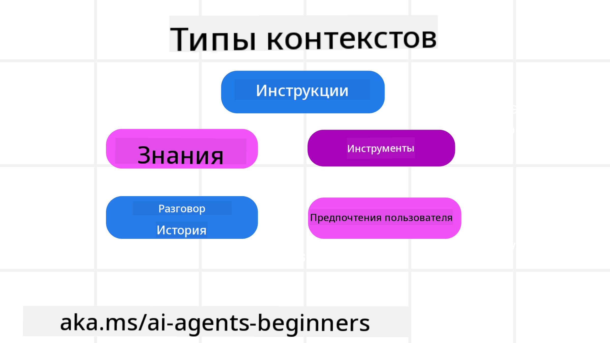
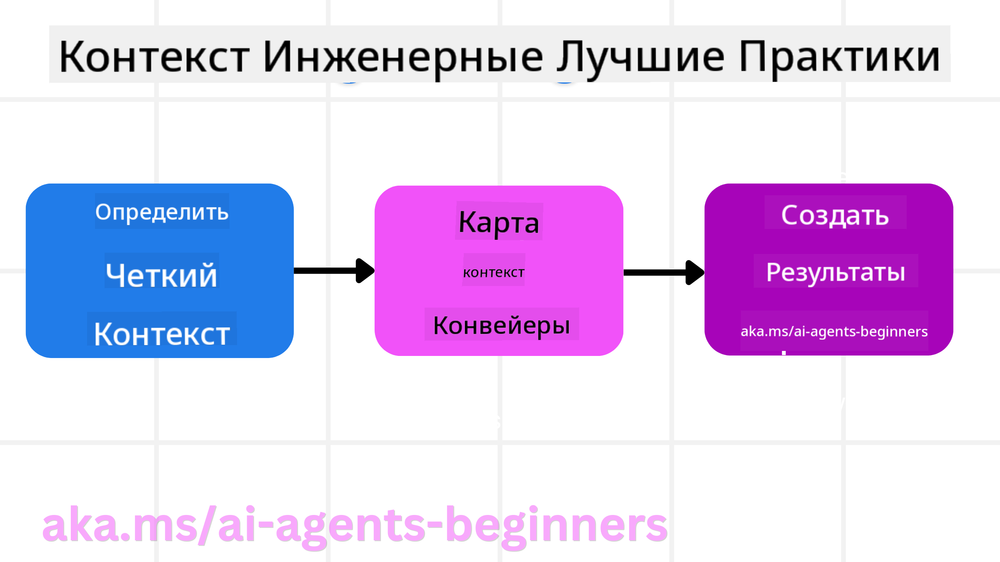

<!--
CO_OP_TRANSLATOR_METADATA:
{
  "original_hash": "cb7e50f471905ce6fdb92a30269a7a98",
  "translation_date": "2025-09-04T09:43:20+00:00",
  "source_file": "12-context-engineering/README.md",
  "language_code": "ru"
}
-->
# Инженерия контекста для ИИ-агентов

> _(Нажмите на изображение выше, чтобы посмотреть видео к этому уроку)_

Понимание сложности приложения, для которого вы создаете ИИ-агента, важно для создания надежного решения. Нам нужно разрабатывать ИИ-агентов, которые эффективно управляют информацией, чтобы справляться со сложными задачами, выходящими за рамки инженерии подсказок.

В этом уроке мы рассмотрим, что такое инженерия контекста и какова ее роль в создании ИИ-агентов.

## Введение

В этом уроке мы разберем:

• **Что такое инженерия контекста** и чем она отличается от инженерии подсказок.

• **Стратегии эффективной инженерии контекста**, включая написание, выбор, сжатие и изоляцию информации.

• **Распространенные ошибки в контексте**, которые могут помешать работе вашего ИИ-агента, и способы их устранения.

## Цели обучения

После завершения этого урока вы сможете:

• **Определить, что такое инженерия контекста**, и отличить ее от инженерии подсказок.

• **Выделить ключевые компоненты контекста** в приложениях на основе больших языковых моделей (LLM).

• **Применять стратегии написания, выбора, сжатия и изоляции контекста**, чтобы улучшить производительность агентов.

• **Распознавать распространенные ошибки в контексте**, такие как отравление, отвлечение, путаница и конфликты, и внедрять методы их устранения.

## Что такое инженерия контекста?

Для ИИ-агентов контекст определяет, какие действия агент будет планировать и выполнять. Инженерия контекста — это практика обеспечения того, чтобы у ИИ-агента была правильная информация для выполнения следующего шага задачи. Окно контекста имеет ограниченный размер, поэтому разработчикам агентов необходимо создавать системы и процессы для управления добавлением, удалением и сжатием информации в этом окне.

### Инженерия подсказок vs Инженерия контекста

Инженерия подсказок сосредоточена на создании единого набора статичных инструкций, чтобы эффективно направлять ИИ-агентов с помощью правил. Инженерия контекста, напротив, занимается управлением динамическим набором информации, включая начальную подсказку, чтобы гарантировать, что у ИИ-агента есть все необходимое на протяжении времени. Основная идея инженерии контекста — сделать этот процесс повторяемым и надежным.

### Типы контекста

Важно помнить, что контекст — это нечто многогранное. Информация, необходимая ИИ-агенту, может поступать из различных источников, и наша задача — обеспечить доступ агента к этим источникам.

Типы контекста, которыми может управлять ИИ-агент, включают:

• **Инструкции:** Это своего рода "правила" агента — подсказки, системные сообщения, примеры few-shot (показывающие ИИ, как выполнять задачу) и описания инструментов, которые он может использовать. Здесь инженерия подсказок пересекается с инженерией контекста.

• **Знания:** Это факты, информация, извлеченная из баз данных, или долгосрочные воспоминания, накопленные агентом. Это включает интеграцию системы Retrieval Augmented Generation (RAG), если агенту нужен доступ к различным хранилищам знаний и базам данных.

• **Инструменты:** Это определения внешних функций, API и MCP-серверов, которые агент может вызывать, а также обратная связь (результаты) от их использования.

• **История диалога:** Текущий диалог с пользователем. Со временем эти беседы становятся длиннее и сложнее, занимая больше места в окне контекста.

• **Предпочтения пользователя:** Информация о предпочтениях пользователя, накопленная со временем. Это может быть использовано для принятия ключевых решений, чтобы помочь пользователю.

## Стратегии эффективной инженерии контекста

### Стратегии планирования

Хорошая инженерия контекста начинается с хорошего планирования. Вот подход, который поможет вам начать применять концепцию инженерии контекста:

1. **Определите четкие результаты** — Результаты задач, которые будут назначены ИИ-агенту, должны быть четко определены. Ответьте на вопрос: "Как будет выглядеть мир, когда ИИ-агент выполнит свою задачу?" Другими словами, какое изменение, информацию или ответ должен получить пользователь после взаимодействия с ИИ-агентом.

2. **Составьте карту контекста** — После того как вы определили результаты работы ИИ-агента, нужно ответить на вопрос: "Какая информация нужна ИИ-агенту для выполнения этой задачи?" Таким образом, вы сможете начать составлять карту контекста, указывая, где находится эта информация.

3. **Создайте конвейеры контекста** — Теперь, когда вы знаете, где находится информация, нужно ответить на вопрос: "Как агент получит эту информацию?" Это можно сделать различными способами, включая RAG, использование MCP-серверов и других инструментов.

### Практические стратегии

Планирование важно, но как только информация начинает поступать в окно контекста агента, необходимо применять практические стратегии для ее управления:

#### Управление контекстом

Хотя некоторая информация будет добавляться в окно контекста автоматически, инженерия контекста предполагает более активное управление этой информацией, что можно сделать с помощью следующих стратегий:

1. **Черновик агента**  
   Это позволяет ИИ-агенту делать заметки о важной информации, связанной с текущими задачами и взаимодействиями с пользователем в рамках одной сессии. Эти заметки должны храниться вне окна контекста в файле или объекте времени выполнения, чтобы агент мог позже их использовать в рамках этой сессии.

2. **Воспоминания**  
   Черновики хороши для управления информацией в рамках одной сессии. Воспоминания позволяют агентам сохранять и извлекать важную информацию между сессиями. Это может включать резюме, предпочтения пользователя и отзывы для улучшений в будущем.

3. **Сжатие контекста**  
   Когда окно контекста заполняется и приближается к своему пределу, можно использовать такие техники, как суммаризация и обрезка. Это включает сохранение только самой важной информации или удаление старых сообщений.

4. **Системы с несколькими агентами**  
   Разработка системы с несколькими агентами является формой инженерии контекста, так как у каждого агента есть свое окно контекста. Планирование того, как этот контекст будет передаваться между агентами, — еще один важный аспект.

5. **Песочницы**  
   Если агенту нужно выполнить код или обработать большой объем информации из документа, это может занять много токенов. Вместо того чтобы хранить все это в окне контекста, агент может использовать песочницу, где выполняется код, а затем извлекаются только результаты и другая важная информация.

6. **Объекты состояния времени выполнения**  
   Это создание контейнеров информации для управления ситуациями, когда агенту нужен доступ к определенной информации. Для сложной задачи это позволяет агенту сохранять результаты каждого подшага, чтобы контекст оставался связанным только с этим подшагом.

### Пример инженерии контекста

Допустим, мы хотим, чтобы ИИ-агент **"забронировал поездку в Париж."**

• Простой агент, использующий только инженерию подсказок, может просто ответить: **"Хорошо, когда вы хотите поехать в Париж?"** Он обработает только ваш прямой запрос в момент его получения.

• Агент, использующий стратегии инженерии контекста, сделает гораздо больше. Прежде чем ответить, его система может:

  ◦ **Проверить ваш календарь** на наличие свободных дат (извлекая данные в реальном времени).

  ◦ **Вспомнить прошлые предпочтения в путешествиях** (из долгосрочной памяти), такие как предпочтительная авиакомпания, бюджет или предпочтение прямых рейсов.

  ◦ **Определить доступные инструменты** для бронирования рейсов и отелей.

- Затем пример ответа может быть таким: **"Привет, [Ваше имя]! Я вижу, что вы свободны на первой неделе октября. Посмотреть прямые рейсы в Париж на [Предпочтительная авиакомпания] в рамках вашего обычного бюджета [Бюджет]?"** Этот более богатый, контекстно-осведомленный ответ демонстрирует силу инженерии контекста.

## Распространенные ошибки в контексте

### Отравление контекста

**Что это:** Когда галлюцинация (ложная информация, сгенерированная LLM) или ошибка попадает в контекст и многократно используется, это может привести к невозможным целям или бессмысленным стратегиям.

**Что делать:** Внедрить **валидацию контекста** и **карантин**. Проверяйте информацию перед добавлением в долгосрочную память. Если обнаружено потенциальное отравление, начните новую ветку контекста, чтобы предотвратить распространение ложной информации.

**Пример бронирования поездки:** Ваш агент "придумал" **прямой рейс из небольшого местного аэропорта в отдаленный международный город**, хотя такие рейсы не существуют. Эта ложная информация сохраняется в контексте. Позже, когда вы просите забронировать билет, агент продолжает искать билеты на этот невозможный маршрут, что приводит к повторяющимся ошибкам.

**Решение:** Внедрите шаг, который **проверяет существование рейсов и маршрутов через API в реальном времени** _до_ добавления информации о рейсе в рабочий контекст агента. Если проверка не проходит, ложная информация помещается в "карантин" и больше не используется.

### Отвлечение контекста

**Что это:** Когда контекст становится настолько большим, что модель слишком сильно фокусируется на накопленной истории, а не на том, что она узнала во время обучения, что приводит к повторяющимся или бесполезным действиям. Модели могут начинать ошибаться еще до заполнения окна контекста.

**Что делать:** Использовать **суммаризацию контекста**. Периодически сжимайте накопленную информацию в более короткие резюме, сохраняя важные детали и удаляя избыточную историю. Это помогает "перезагрузить" фокус.

**Пример бронирования поездки:** Вы долго обсуждали различные мечты о путешествиях, включая подробный рассказ о вашем походе двухлетней давности. Когда вы наконец просите **"найти дешевый рейс на следующий месяц"**, агент зацикливается на старых, неактуальных деталях и продолжает спрашивать о вашем походном снаряжении или прошлых маршрутах, игнорируя ваш текущий запрос.

**Решение:** После определенного количества шагов или при увеличении контекста агент должен **суммировать самые последние и актуальные части беседы** — сосредоточившись на ваших текущих датах и месте назначения — и использовать это сжатое резюме для следующего вызова LLM, отбрасывая менее актуальную историю.

### Путаница в контексте

**Что это:** Когда избыточный контекст, часто в виде слишком большого количества доступных инструментов, приводит к тому, что модель генерирует плохие ответы или вызывает нерелевантные инструменты. Особенно подвержены этому меньшие модели.

**Что делать:** Внедрить **управление набором инструментов** с использованием техник RAG. Храните описания инструментов в векторной базе данных и выбирайте _только_ самые релевантные инструменты для каждой конкретной задачи. Исследования показывают, что ограничение выбора инструментов до менее чем 30 улучшает результаты.

**Пример бронирования поездки:** У вашего агента есть доступ к десяткам инструментов: `book_flight`, `book_hotel`, `rent_car`, `find_tours`, `currency_converter`, `weather_forecast`, `restaurant_reservations` и т.д. Вы спрашиваете: **"Как лучше передвигаться по Парижу?"** Из-за большого количества инструментов агент путается и пытается вызвать `book_flight` _внутри_ Парижа или `rent_car`, хотя вы предпочитаете общественный транспорт, потому что описания инструментов могут пересекаться или агент просто не может выбрать лучший.

**Решение:** Используйте **RAG для описаний инструментов**. Когда вы спрашиваете о передвижении по Парижу, система динамически извлекает _только_ самые релевантные инструменты, такие как `rent_car` или `public_transport_info`, на основе вашего запроса, предоставляя LLM ограниченный "набор" инструментов.

### Конфликт контекста

**Что это:** Когда в контексте присутствует противоречивая информация, это приводит к несогласованным рассуждениям или плохим итоговым ответам. Это часто происходит, когда информация поступает поэтапно, и ранние, неверные предположения остаются в контексте.

**Что делать:** Использовать **очистку контекста** и **выгрузку**. Очистка означает удаление устаревшей или противоречивой информации по мере поступления новых данных. Выгрузка позволяет модели использовать отдельное "рабочее пространство" для обработки информации без засорения основного контекста.

**Пример бронирования поездки:** Вы сначала говорите агенту: **"Я хочу лететь эконом-классом."** Позже в разговоре вы меняете мнение и говорите: **"На этот раз давайте выберем бизнес-класс."** Если обе инструкции остаются в контексте, агент может получить противоречивые результаты поиска или запутаться, какое предпочтение учитывать.

**Решение:** Внедрите **очистку контекста**. Когда новая инструкция противоречит старой, старая удаляется или явно заменяется в контексте. Альтернативно, агент может использовать **рабочее пространство**, чтобы примирить противоречивые предпочтения перед принятием решения, гарантируя, что только финальная, согласованная инструкция будет направлять его действия.

## Остались вопросы по инженерии контекста?

Присоединяйтесь к [Azure AI Foundry Discord](https://aka.ms/ai-agents/discord), чтобы встретиться с другими учащимися, посетить часы консультаций и получить ответы на свои вопросы об ИИ-агентах.

---

**Отказ от ответственности**:  
Этот документ был переведен с помощью сервиса автоматического перевода [Co-op Translator](https://github.com/Azure/co-op-translator). Несмотря на наши усилия обеспечить точность, автоматические переводы могут содержать ошибки или неточности. Оригинальный документ на его родном языке следует считать авторитетным источником. Для получения критически важной информации рекомендуется профессиональный перевод человеком. Мы не несем ответственности за любые недоразумения или неправильные интерпретации, возникшие в результате использования данного перевода.