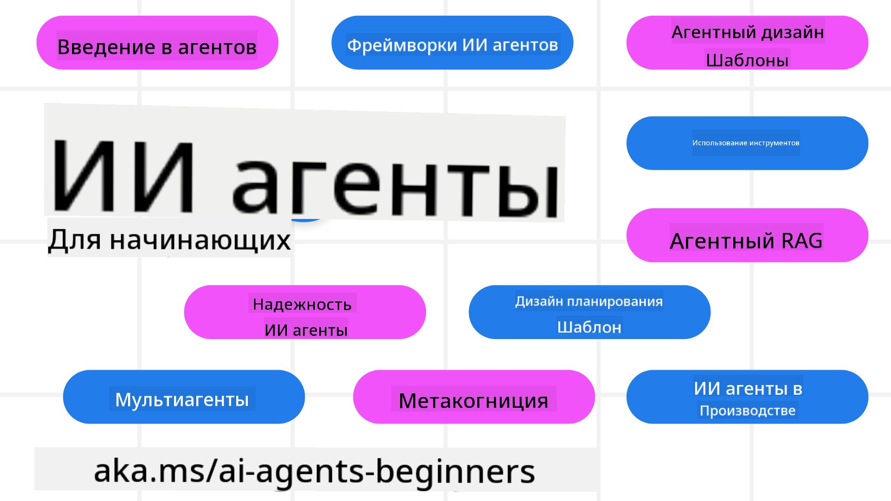

<!--
CO_OP_TRANSLATOR_METADATA:
{
  "original_hash": "6b07046397366e6f6f4524c9ddeba1e1",
  "translation_date": "2025-07-12T14:41:07+00:00",
  "source_file": "README.md",
  "language_code": "ru"
}
-->
# AI-агенты для начинающих — Курс

## 11 уроков, которые научат всему необходимому для создания AI-агентов

  
  
  
  

### 🌐 Поддержка нескольких языков

#### Поддерживается через GitHub Action (автоматически и всегда актуально)

[Французский](../fr/README.md) | [Испанский](../es/README.md) | [Немецкий](../de/README.md) | [Русский](./README.md) | [Арабский](../ar/README.md) | [Персидский (фарси)](../fa/README.md) | [Урду](../ur/README.md) | [Китайский (упрощённый)](../zh/README.md) | [Китайский (традиционный, Макао)](../mo/README.md) | [Китайский (традиционный, Гонконг)](../hk/README.md) | [Китайский (традиционный, Тайвань)](../tw/README.md) | [Японский](../ja/README.md) | [Корейский](../ko/README.md) | [Хинди](../hi/README.md) | [Бенгальский](../bn/README.md) | [Маратхи](../mr/README.md) | [Непальский](../ne/README.md) | [Пенджаби (гурмукхи)](../pa/README.md) | [Португальский (Португалия)](../pt/README.md) | [Португальский (Бразилия)](../br/README.md) | [Итальянский](../it/README.md) | [Польский](../pl/README.md) | [Турецкий](../tr/README.md) | [Греческий](../el/README.md) | [Тайский](../th/README.md) | [Шведский](../sv/README.md) | [Датский](../da/README.md) | [Норвежский](../no/README.md) | [Финский](../fi/README.md) | [Нидерландский](../nl/README.md) | [Иврит](../he/README.md) | [Вьетнамский](../vi/README.md) | [Индонезийский](../id/README.md) | [Малайский](../ms/README.md) | [Тагальский (филиппинский)](../tl/README.md) | [Суахили](../sw/README.md) | [Венгерский](../hu/README.md) | [Чешский](../cs/README.md) | [Словацкий](../sk/README.md) | [Румынский](../ro/README.md) | [Болгарский](../bg/README.md) | [Сербский (кириллица)](../sr/README.md) | [Хорватский](../hr/README.md) | [Словенский](../sl/README.md) | [Украинский](../uk/README.md) | [Бирманский (Мьянма)](../my/README.md)

**Если вы хотите добавить поддержку других языков, список доступных языков можно найти [здесь](https://github.com/Azure/co-op-translator/blob/main/getting_started/supported-languages.md)**

  
  

## 🌱 Начало работы

Этот курс состоит из 11 уроков, охватывающих основы создания AI-агентов. Каждый урок посвящён отдельной теме, так что начинайте с любого!

Курс поддерживает несколько языков. Ознакомьтесь с [доступными языками здесь](../..).

Если вы впервые работаете с генеративными моделями ИИ, рекомендуем пройти курс [Generative AI For Beginners](https://aka.ms/genai-beginners), который включает 21 урок по созданию решений с GenAI.

Не забудьте [поставить звезду (🌟) этому репозиторию](https://docs.github.com/en/get-started/exploring-projects-on-github/saving-repositories-with-stars?WT.mc_id=academic-105485-koreyst) и [форкнуть репозиторий](https://github.com/microsoft/ai-agents-for-beginners/fork), чтобы запускать код.

### Что понадобится

Каждый урок содержит примеры кода, которые находятся в папке code_samples. Вы можете [форкнуть этот репозиторий](https://github.com/microsoft/ai-agents-for-beginners/fork), чтобы создать свою копию.

Примеры кода в этих упражнениях используют Azure AI Foundry и GitHub Model Catalogs для взаимодействия с языковыми моделями:

- [Github Models](https://aka.ms/ai-agents-beginners/github-models) — бесплатно / с ограничениями  
- [Azure AI Foundry](https://aka.ms/ai-agents-beginners/ai-foundry) — требуется аккаунт Azure

В курсе также используются следующие фреймворки и сервисы AI-агентов от Microsoft:

- [Azure AI Agent Service](https://aka.ms/ai-agents-beginners/ai-agent-service)  
- [Semantic Kernel](https://aka.ms/ai-agents-beginners/semantic-kernel)  
- [AutoGen](https://aka.ms/ai-agents/autogen)

Для получения дополнительной информации о запуске кода курса смотрите раздел [Course Setup](./00-course-setup/README.md).

## 🙏 Хотите помочь?

Есть предложения или нашли ошибки в тексте или коде? [Создайте issue](https://github.com/microsoft/ai-agents-for-beginners/issues?WT.mc_id=academic-105485-koreyst) или [отправьте pull request](https://github.com/microsoft/ai-agents-for-beginners/pulls?WT.mc_id=academic-105485-koreyst).

Если возникли трудности или есть вопросы по созданию AI-агентов, присоединяйтесь к нашему [сообществу Azure AI Foundry в Discord](https://discord.gg/kzRShWzttr).

Если у вас есть отзывы о продукте или ошибки при разработке, посетите [форум разработчиков Azure AI Foundry](https://aka.ms/azureaifoundry/forum).

## 📂 В каждом уроке есть

- Текстовый урок в README и короткое видео  
- Примеры кода на Python с поддержкой Azure AI Foundry и Github Models (бесплатно)  
- Ссылки на дополнительные материалы для дальнейшего обучения

## 🗃️ Уроки

| **Урок**                                | **Текст и код**                                    | **Видео**                                                  | **Дополнительное обучение**                                                          |
|----------------------------------------|----------------------------------------------------|------------------------------------------------------------|--------------------------------------------------------------------------------------|
| Введение в AI-агентов и их применение  | [Ссылка](./01-intro-to-ai-agents/README.md)        | [Видео](https://youtu.be/3zgm60bXmQk?si=z8QygFvYQv-9WtO1)  | [Ссылка](https://aka.ms/ai-agents-beginners/collection?WT.mc_id=academic-105485-koreyst) |
| Изучение AI Agentic Frameworks         | [Ссылка](./02-explore-agentic-frameworks/README.md)| [Видео](https://youtu.be/ODwF-EZo_O8?si=Vawth4hzVaHv-u0H)  | [Ссылка](https://aka.ms/ai-agents-beginners/collection?WT.mc_id=academic-105485-koreyst) |
| Понимание паттернов проектирования AI-агентов | [Ссылка](./03-agentic-design-patterns/README.md)   | [Видео](https://youtu.be/m9lM8qqoOEA?si=BIzHwzstTPL8o9GF)  | [Ссылка](https://aka.ms/ai-agents-beginners/collection?WT.mc_id=academic-105485-koreyst) |
| Паттерн использования инструментов    | [Ссылка](./04-tool-use/README.md)                   | [Видео](https://youtu.be/vieRiPRx-gI?si=2z6O2Xu2cu_Jz46N)  | [Ссылка](https://aka.ms/ai-agents-beginners/collection?WT.mc_id=academic-105485-koreyst) |
| Agentic RAG                           | [Ссылка](./05-agentic-rag/README.md)                | [Видео](https://youtu.be/WcjAARvdL7I?si=gKPWsQpKiIlDH9A3)  | [Ссылка](https://aka.ms/ai-agents-beginners/collection?WT.mc_id=academic-105485-koreyst) |
| Создание надёжных AI-агентов           | [Ссылка](./06-building-trustworthy-agents/README.md)| [Видео](https://youtu.be/iZKkMEGBCUQ?si=jZjpiMnGFOE9L8OK ) | [Ссылка](https://aka.ms/ai-agents-beginners/collection?WT.mc_id=academic-105485-koreyst) |
| Паттерн проектирования планирования    | [Ссылка](./07-planning-design/README.md)            | [Видео](https://youtu.be/kPfJ2BrBCMY?si=6SC_iv_E5-mzucnC)  | [Ссылка](https://aka.ms/ai-agents-beginners/collection?WT.mc_id=academic-105485-koreyst) |
| Паттерн мультиагентной системы         | [Ссылка](./08-multi-agent/README.md)                | [Видео](https://youtu.be/V6HpE9hZEx0?si=rMgDhEu7wXo2uo6g)  | [Ссылка](https://aka.ms/ai-agents-beginners/collection?WT.mc_id=academic-105485-koreyst) |
| Паттерн метакогниции                   | [Ссылка](./09-metacognition/README.md)              | [Видео](https://youtu.be/His9R6gw6Ec?si=8gck6vvdSNCt6OcF)  | [Ссылка](https://aka.ms/ai-agents-beginners/collection?WT.mc_id=academic-105485-koreyst) |
| AI-агенты в продакшене                 | [Ссылка](./10-ai-agents-production/README.md)       | [Видео](https://youtu.be/l4TP6IyJxmQ?si=31dnhexRo6yLRJDl)  | [Ссылка](https://aka.ms/ai-agents-beginners/collection?WT.mc_id=academic-105485-koreyst) |
| AI-агенты с MCP                       | [Ссылка](./11-mcp/README.md)                         |                                                            | [Ссылка](https://aka.ms/mcp-for-beginners)                                           |

## 🎒 Другие курсы

Наша команда выпускает и другие курсы! Ознакомьтесь с ними:
- [**НОВЫЙ** Протокол контекста модели (MCP) для начинающих](https://github.com/microsoft/mcp-for-beginners?WT.mc_id=academic-105485-koreyst)
- [Генеративный ИИ для начинающих с использованием .NET](https://github.com/microsoft/Generative-AI-for-beginners-dotnet?WT.mc_id=academic-105485-koreyst)
- [Генеративный ИИ для начинающих](https://github.com/microsoft/generative-ai-for-beginners?WT.mc_id=academic-105485-koreyst)
- [Машинное обучение для начинающих](https://aka.ms/ml-beginners?WT.mc_id=academic-105485-koreyst)
- [Наука о данных для начинающих](https://aka.ms/datascience-beginners?WT.mc_id=academic-105485-koreyst)
- [ИИ для начинающих](https://aka.ms/ai-beginners?WT.mc_id=academic-105485-koreyst)
- [Кибербезопасность для начинающих](https://github.com/microsoft/Security-101??WT.mc_id=academic-96948-sayoung)
- [Веб-разработка для начинающих](https://aka.ms/webdev-beginners?WT.mc_id=academic-105485-koreyst)
- [Интернет вещей для начинающих](https://aka.ms/iot-beginners?WT.mc_id=academic-105485-koreyst)
- [Разработка XR для начинающих](https://github.com/microsoft/xr-development-for-beginners?WT.mc_id=academic-105485-koreyst)
- [Осваиваем GitHub Copilot для совместного программирования с ИИ](https://aka.ms/GitHubCopilotAI?WT.mc_id=academic-105485-koreyst)
- [Осваиваем GitHub Copilot для разработчиков C#/.NET](https://github.com/microsoft/mastering-github-copilot-for-dotnet-csharp-developers?WT.mc_id=academic-105485-koreyst)
- [Выбери своё приключение с Copilot](https://github.com/microsoft/CopilotAdventures?WT.mc_id=academic-105485-koreyst)

## 🌟 Благодарности сообществу

Спасибо [Shivam Goyal](https://www.linkedin.com/in/shivam2003/) за вклад важнейших примеров кода, демонстрирующих Agentic RAG.

## Вклад в проект

Этот проект приветствует ваши предложения и вклад. Большинство вкладов требуют согласия с
Contributor License Agreement (CLA), подтверждающим, что вы имеете право и действительно предоставляете нам
права на использование вашего вклада. Подробнее на 
<https://cla.opensource.microsoft.com>.

При отправке pull request, бот CLA автоматически определит, нужно ли вам предоставить
CLA, и отметит PR соответствующим образом (например, проверка статуса, комментарий). Просто следуйте
инструкциям бота. Это нужно сделать только один раз для всех репозиториев, использующих наш CLA.

В этом проекте принят [Microsoft Open Source Code of Conduct](https://opensource.microsoft.com/codeofconduct/).
Подробнее смотрите в [FAQ по Кодексу поведения](https://opensource.microsoft.com/codeofconduct/faq/) или
пишите на [opencode@microsoft.com](mailto:opencode@microsoft.com) с любыми вопросами или комментариями.

## Торговые марки

В этом проекте могут использоваться торговые марки или логотипы проектов, продуктов или услуг. Авторизованное использование торговых марок или логотипов Microsoft регулируется и должно соответствовать
[Руководству по торговым маркам и брендам Microsoft](https://www.microsoft.com/legal/intellectualproperty/trademarks/usage/general).
Использование торговых марок или логотипов Microsoft в изменённых версиях проекта не должно вводить в заблуждение или создавать впечатление спонсорства со стороны Microsoft.
Использование торговых марок или логотипов третьих сторон подчиняется политикам этих третьих сторон.

**Отказ от ответственности**:  
Этот документ был переведен с помощью сервиса автоматического перевода [Co-op Translator](https://github.com/Azure/co-op-translator). Несмотря на наши усилия по обеспечению точности, просим учитывать, что автоматический перевод может содержать ошибки или неточности. Оригинальный документ на его исходном языке следует считать авторитетным источником. Для получения критически важной информации рекомендуется обращаться к профессиональному переводу, выполненному человеком. Мы не несем ответственности за любые недоразумения или неправильные толкования, возникшие в результате использования данного перевода.