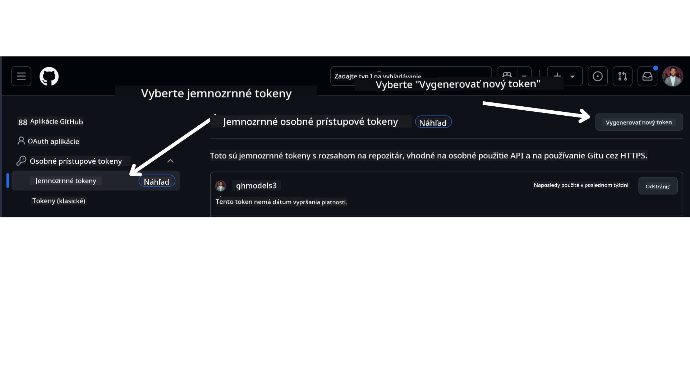

<!--
CO_OP_TRANSLATOR_METADATA:
{
  "original_hash": "76945069b52a49cd0432ae3e0b0ba22e",
  "translation_date": "2025-07-12T07:56:30+00:00",
  "source_file": "00-course-setup/README.md",
  "language_code": "sk"
}
-->
Teraz by ste mali mať svoju vlastnú verziu tohto kurzu, ktorú ste si vytvorili pomocou forku, na nasledujúcom odkaze:


## Spustenie kódu

Tento kurz ponúka sériu Jupyter Notebookov, ktoré môžete spustiť a získať tak praktické skúsenosti s tvorbou AI agentov.

Ukážky kódu používajú buď:

**Vyžaduje GitHub účet - zadarmo**:

1) Semantic Kernel Agent Framework + GitHub Models Marketplace. Označené ako (semantic-kernel.ipynb)  
2) AutoGen Framework + GitHub Models Marketplace. Označené ako (autogen.ipynb)

**Vyžaduje Azure predplatné**:  
3) Azure AI Foundry + Azure AI Agent Service. Označené ako (azureaiagent.ipynb)

Odporúčame vyskúšať všetky tri typy príkladov, aby ste zistili, ktorý vám najviac vyhovuje.

Ktorúkoľvek možnosť si vyberiete, určí to, ktoré kroky nastavenia nižšie budete musieť nasledovať:

## Požiadavky

- Python 3.12+  
  - **POZNÁMKA**: Ak nemáte nainštalovaný Python 3.12, uistite sa, že ho nainštalujete. Potom vytvorte svoje virtuálne prostredie pomocou python3.12, aby sa nainštalovali správne verzie z requirements.txt súboru.  
- GitHub účet - pre prístup k GitHub Models Marketplace  
- Azure predplatné - pre prístup k Azure AI Foundry  
- Azure AI Foundry účet - pre prístup k Azure AI Agent Service  

V koreňovom adresári tohto repozitára nájdete súbor `requirements.txt`, ktorý obsahuje všetky potrebné Python balíky na spustenie ukážok kódu.

Nainštalujete ich spustením nasledujúceho príkazu v termináli v koreňovom adresári repozitára:

```bash
pip install -r requirements.txt
```  
Odporúčame vytvoriť si Python virtuálne prostredie, aby ste predišli konfliktom a problémom.

## Nastavenie VSCode  
Uistite sa, že vo VSCode používate správnu verziu Pythonu.


## Nastavenie pre ukážky používajúce GitHub Models

### Krok 1: Získajte svoj GitHub Personal Access Token (PAT)

V súčasnosti tento kurz používa GitHub Models Marketplace na bezplatný prístup k veľkým jazykovým modelom (LLM), ktoré sa používajú na tvorbu AI agentov.

Na prístup k tejto službe si musíte vytvoriť GitHub Personal Access Token.

To urobíte tak, že sa prihlásite do svojho GitHub účtu.

Vyberte možnosť `Fine-grained tokens` na ľavej strane obrazovky.

Potom vyberte `Generate new token`.



Budete vyzvaní zadať názov tokenu, vybrať dátum vypršania platnosti (odporúčané: 30 dní) a vybrať rozsahy oprávnení pre token (verejné repozitáre).

Je tiež potrebné upraviť povolenia tohto tokenu: Permissions -> Models -> Umožniť prístup k GitHub Models

Skopírujte si nový token, ktorý ste práve vytvorili. Teraz ho pridáte do súboru `.env`, ktorý je súčasťou tohto kurzu.

### Krok 2: Vytvorte si súbor `.env`

Na vytvorenie súboru `.env` spustite v termináli nasledujúci príkaz:

```bash
cp .env.example .env
```

Tým sa skopíruje príkladový súbor a vytvorí sa `.env` vo vašom adresári, kde vyplníte hodnoty pre premenné prostredia.

Keď máte token skopírovaný, otvorte súbor `.env` vo svojom obľúbenom textovom editore a vložte token do poľa `GITHUB_TOKEN`.

Teraz by ste mali byť schopní spustiť ukážky kódu tohto kurzu.

## Nastavenie pre ukážky používajúce Azure AI Foundry a Azure AI Agent Service

### Krok 1: Získajte koncový bod svojho Azure projektu

Postupujte podľa krokov na vytvorenie hubu a projektu v Azure AI Foundry, ktoré nájdete tu: [Hub resources overview](https://learn.microsoft.com/en-us/azure/ai-foundry/concepts/ai-resources)

Keď vytvoríte svoj projekt, budete potrebovať získať pripojovací reťazec pre váš projekt.

To urobíte tak, že prejdete na stránku **Overview** vášho projektu v portáli Azure AI Foundry.


### Krok 2: Vytvorte si súbor `.env`

Na vytvorenie súboru `.env` spustite v termináli nasledujúci príkaz:

```bash
cp .env.example .env
```

Tým sa skopíruje príkladový súbor a vytvorí sa `.env` vo vašom adresári, kde vyplníte hodnoty pre premenné prostredia.

Keď máte token skopírovaný, otvorte súbor `.env` vo svojom obľúbenom textovom editore a vložte token do poľa `PROJECT_ENDPOINT`.

### Krok 3: Prihláste sa do Azure

Ako bezpečnostnú prax použijeme [keyless authentication](https://learn.microsoft.com/azure/developer/ai/keyless-connections?tabs=csharp%2Cazure-cli?WT.mc_id=academic-105485-koreyst) na autentifikáciu do Azure OpenAI pomocou Microsoft Entra ID. Predtým, než to budete môcť urobiť, musíte si najprv nainštalovať **Azure CLI** podľa [inštrukcií na inštaláciu](https://learn.microsoft.com/cli/azure/install-azure-cli?WT.mc_id=academic-105485-koreyst) pre váš operačný systém.

Potom otvorte terminál a spustite `az login --use-device-code` na prihlásenie do svojho Azure účtu.

Po prihlásení vyberte svoje predplatné v termináli.

## Ďalšie premenné prostredia - Azure Search a Azure OpenAI

Pre lekciu Agentic RAG - Lekcia 5 - sú ukážky, ktoré používajú Azure Search a Azure OpenAI.

Ak chcete tieto ukážky spustiť, musíte pridať nasledujúce premenné prostredia do svojho súboru `.env`:

### Stránka prehľadu (projekt)

- `AZURE_SUBSCRIPTION_ID` - Skontrolujte **Project details** na stránke **Overview** vášho projektu.

- `AZURE_AI_PROJECT_NAME` - Pozrite sa hore na stránke **Overview** vášho projektu.

- `AZURE_OPENAI_SERVICE` - Nájdete v záložke **Included capabilities** pre **Azure OpenAI Service** na stránke **Overview**.

### Management Center

- `AZURE_OPENAI_RESOURCE_GROUP` - Prejdite do **Project properties** na stránke **Overview** v **Management Center**.

- `GLOBAL_LLM_SERVICE` - V sekcii **Connected resources** nájdite názov pripojenia **Azure AI Services**. Ak tam nie je, skontrolujte v **Azure portáli** vo vašej skupine zdrojov názov služby AI Services.

### Stránka modelov + koncových bodov

- `AZURE_OPENAI_EMBEDDING_DEPLOYMENT_NAME` - Vyberte svoj embedding model (napr. `text-embedding-ada-002`) a zapíšte si **Deployment name** z detailov modelu.

- `AZURE_OPENAI_CHAT_DEPLOYMENT_NAME` - Vyberte svoj chat model (napr. `gpt-4o-mini`) a zapíšte si **Deployment name** z detailov modelu.

### Azure portál

- `AZURE_OPENAI_ENDPOINT` - Nájdite **Azure AI services**, kliknite naň, potom prejdite do **Resource Management**, **Keys and Endpoint**, posuňte sa dole na "Azure OpenAI endpoints" a skopírujte ten, ktorý je označený ako "Language APIs".

- `AZURE_OPENAI_API_KEY` - Na tej istej obrazovke skopírujte KĽÚČ 1 alebo KĽÚČ 2.

- `AZURE_SEARCH_SERVICE_ENDPOINT` - Nájdite svoj zdroj **Azure AI Search**, kliknite naň a pozrite si **Overview**.

- `AZURE_SEARCH_API_KEY` - Potom prejdite do **Settings** a následne do **Keys**, kde skopírujete primárny alebo sekundárny administrátorský kľúč.

### Externá webová stránka

- `AZURE_OPENAI_API_VERSION` - Navštívte stránku [API version lifecycle](https://learn.microsoft.com/en-us/azure/ai-services/openai/api-version-deprecation#latest-ga-api-release) pod sekciou **Latest GA API release**.

### Nastavenie keyless autentifikácie

Namiesto pevného zakódovania prihlasovacích údajov použijeme keyless pripojenie s Azure OpenAI. Na to importujeme `DefaultAzureCredential` a neskôr zavoláme funkciu `DefaultAzureCredential` na získanie poverení.

```python
from azure.identity import DefaultAzureCredential, InteractiveBrowserCredential
```

## Máte problém?

Ak máte nejaké problémy so spustením tohto nastavenia, pridajte sa do nášho

alebo

.

## Ďalšia lekcia

Teraz ste pripravení spustiť kód tohto kurzu. Prajeme veľa úspechov pri spoznávaní sveta AI agentov!

[Úvod do AI agentov a prípadov použitia agentov](../01-intro-to-ai-agents/README.md)

**Vyhlásenie o zodpovednosti**:  
Tento dokument bol preložený pomocou AI prekladateľskej služby [Co-op Translator](https://github.com/Azure/co-op-translator). Aj keď sa snažíme o presnosť, prosím, majte na pamäti, že automatizované preklady môžu obsahovať chyby alebo nepresnosti. Pôvodný dokument v jeho rodnom jazyku by mal byť považovaný za autoritatívny zdroj. Pre kritické informácie sa odporúča profesionálny ľudský preklad. Nie sme zodpovední za akékoľvek nedorozumenia alebo nesprávne interpretácie vyplývajúce z použitia tohto prekladu.