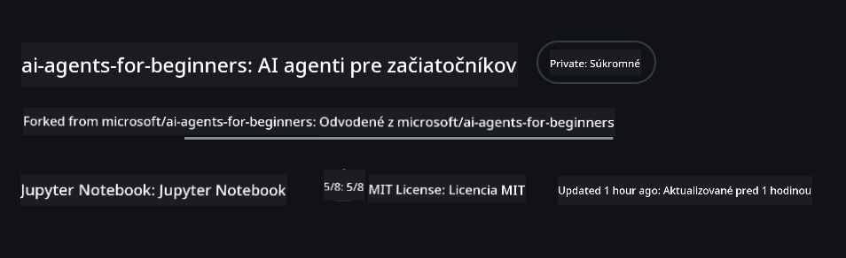
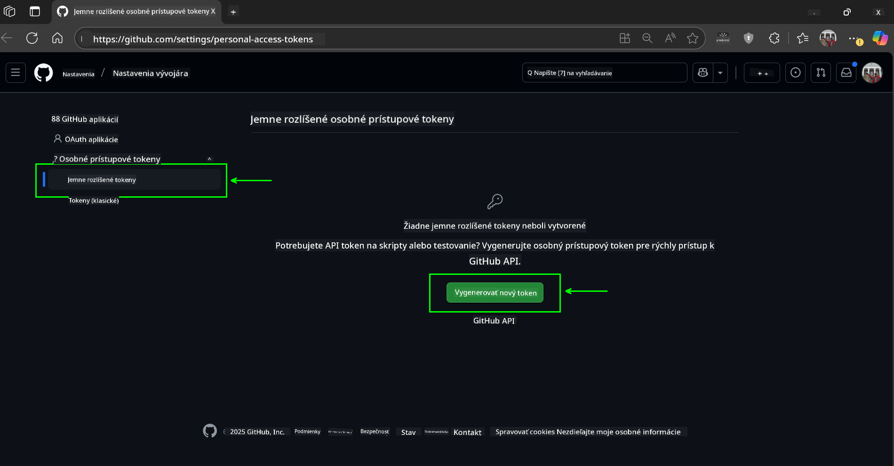
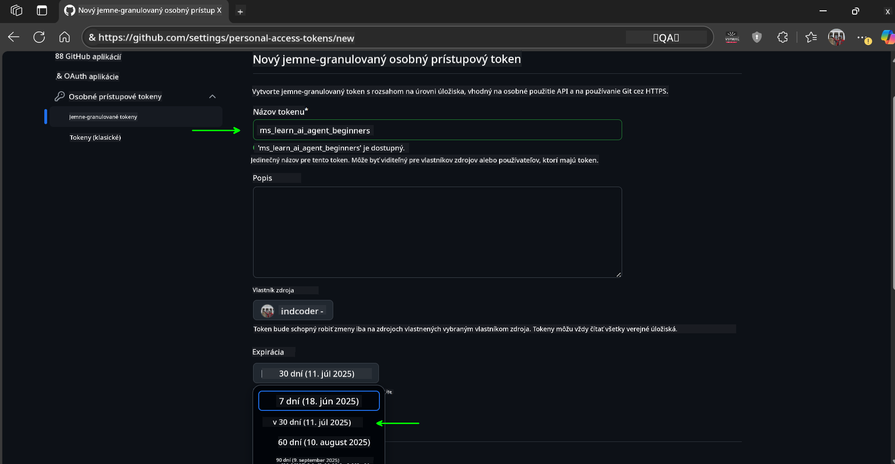
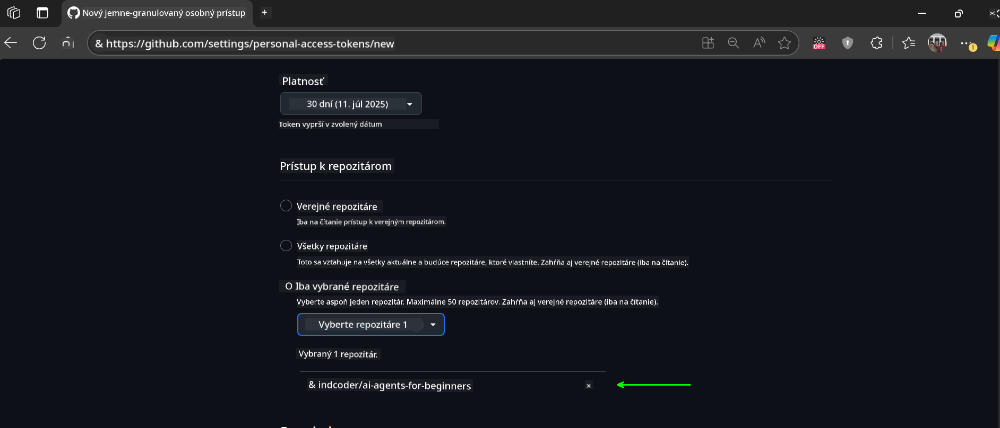
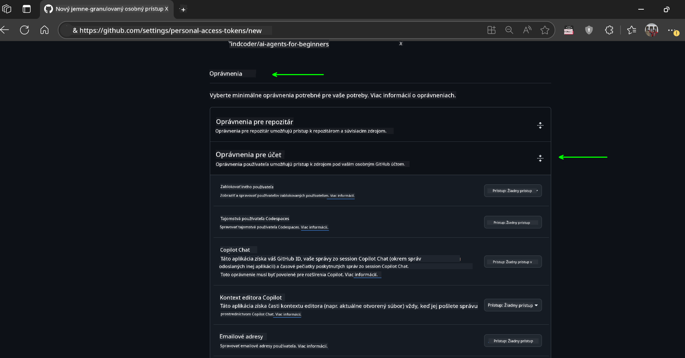
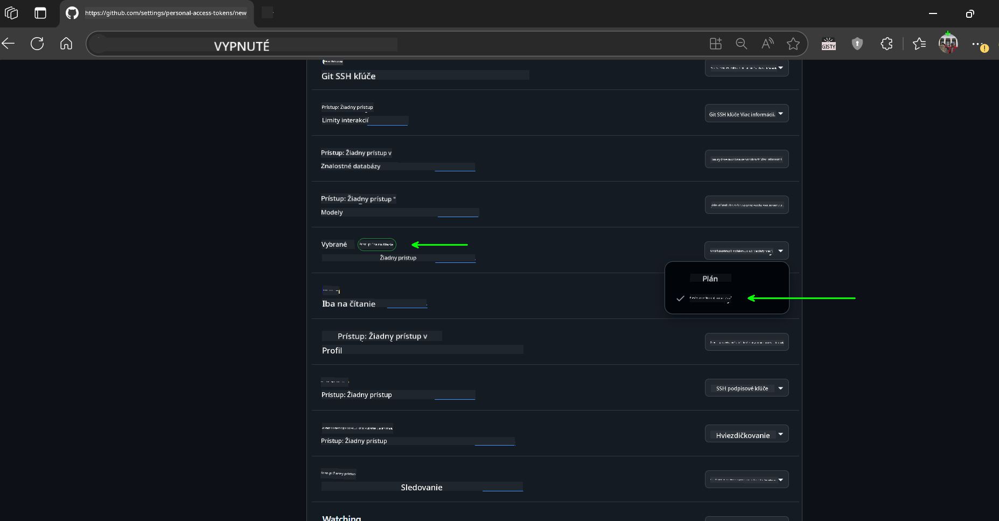
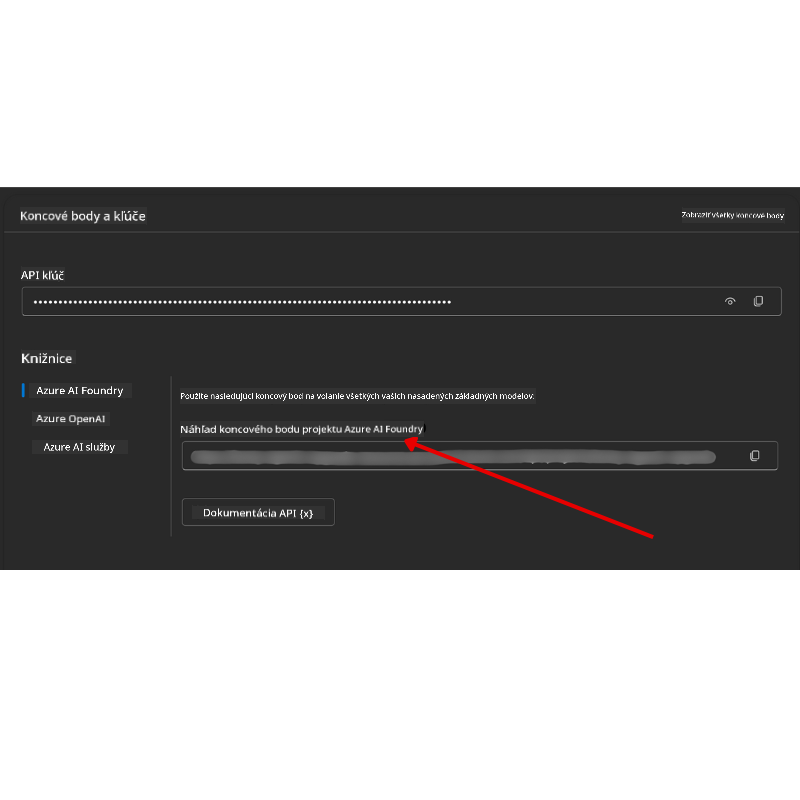

<!--
CO_OP_TRANSLATOR_METADATA:
{
  "original_hash": "c6a79c8f2b56a80370ff7e447765524f",
  "translation_date": "2025-07-23T09:09:50+00:00",
  "source_file": "00-course-setup/README.md",
  "language_code": "sk"
}
-->
# Nastavenie kurzu

## Úvod

Táto lekcia sa zaoberá tým, ako spustiť ukážky kódu z tohto kurzu.

## Klonovanie alebo Forkovanie tohto repozitára

Na začiatok si prosím klonujte alebo forknite GitHub repozitár. Týmto si vytvoríte vlastnú verziu materiálov kurzu, aby ste mohli spúšťať, testovať a upravovať kód!

Toto môžete urobiť kliknutím na odkaz na

Mali by ste mať vlastnú forknutú verziu tohto kurzu na nasledujúcom odkaze:



## Spúšťanie kódu

Tento kurz ponúka sériu Jupyter Notebookov, ktoré môžete spustiť, aby ste získali praktické skúsenosti s budovaním AI agentov.

Ukážky kódu využívajú:

**Vyžaduje GitHub účet - Zadarmo**:

1) Semantic Kernel Agent Framework + GitHub Models Marketplace. Označené ako (semantic-kernel.ipynb)  
2) AutoGen Framework + GitHub Models Marketplace. Označené ako (autogen.ipynb)  

**Vyžaduje Azure predplatné**:  
3) Azure AI Foundry + Azure AI Agent Service. Označené ako (azureaiagent.ipynb)  

Odporúčame vám vyskúšať všetky tri typy príkladov, aby ste zistili, ktorý vám najviac vyhovuje.

Podľa toho, ktorú možnosť si vyberiete, budete musieť postupovať podľa príslušných krokov nastavenia uvedených nižšie:

## Požiadavky

- Python 3.12+  
  - **POZNÁMKA**: Ak nemáte nainštalovaný Python 3.12, uistite sa, že ho nainštalujete. Potom vytvorte svoj virtuálny environment pomocou python3.12, aby ste zabezpečili správne verzie z requirements.txt súboru.
- GitHub účet - Pre prístup k GitHub Models Marketplace
- Azure predplatné - Pre prístup k Azure AI Foundry
- Azure AI Foundry účet - Pre prístup k Azure AI Agent Service

V koreňovom adresári tohto repozitára sme zahrnuli súbor `requirements.txt`, ktorý obsahuje všetky potrebné Python balíčky na spustenie ukážok kódu.

Môžete ich nainštalovať spustením nasledujúceho príkazu vo vašom termináli v koreňovom adresári repozitára:

```bash
pip install -r requirements.txt
```  
Odporúčame vytvoriť Python virtuálne prostredie, aby ste sa vyhli konfliktom a problémom.

## Nastavenie VSCode
Uistite sa, že používate správnu verziu Pythonu vo VSCode.


## Nastavenie pre ukážky s GitHub modelmi

### Krok 1: Získajte svoj GitHub Personal Access Token (PAT)

Tento kurz využíva GitHub Models Marketplace, ktorý poskytuje bezplatný prístup k veľkým jazykovým modelom (LLM), ktoré budete používať na budovanie AI agentov.

Na použitie GitHub modelov budete potrebovať vytvoriť [GitHub Personal Access Token](https://docs.github.com/en/authentication/keeping-your-account-and-data-secure/managing-your-personal-access-tokens).

Toto môžete urobiť vo svojom GitHub účte.

Prosím, postupujte podľa [Princípu minimálnych oprávnení](https://docs.github.com/en/get-started/learning-to-code/storing-your-secrets-safely) pri vytváraní vášho tokenu. To znamená, že by ste mali tokenu prideliť iba tie oprávnenia, ktoré sú potrebné na spustenie ukážok kódu v tomto kurze.

1. Na ľavej strane obrazovky vyberte možnosť `Fine-grained tokens`.

    Potom vyberte `Generate new token`.

    

1. Zadajte popisný názov pre váš token, ktorý odráža jeho účel, aby ste ho neskôr ľahko identifikovali. Nastavte dátum vypršania platnosti (odporúčané: 30 dní; môžete si zvoliť kratšie obdobie, napríklad 7 dní, ak preferujete vyššiu bezpečnosť).

    

1. Obmedzte rozsah tokenu na váš fork tohto repozitára.

    

1. Obmedzte oprávnenia tokenu: V časti **Permissions** prepnite na **Account Permissions**, prejdite na **Models** a povoľte iba prístup na čítanie potrebný pre GitHub Models.

    

    

Skopírujte svoj nový token, ktorý ste práve vytvorili. Teraz ho pridáte do svojho `.env` súboru zahrnutého v tomto kurze.

### Krok 2: Vytvorte svoj `.env` súbor

Na vytvorenie `.env` súboru spustite nasledujúci príkaz vo vašom termináli.

```bash
cp .env.example .env
```

Týmto sa skopíruje príklad súboru a vytvorí `.env` vo vašom adresári, kde vyplníte hodnoty pre premenné prostredia.

So skopírovaným tokenom otvorte `.env` súbor vo svojom obľúbenom textovom editore a vložte svoj token do poľa `GITHUB_TOKEN`.

Teraz by ste mali byť schopní spustiť ukážky kódu z tohto kurzu.

## Nastavenie pre ukážky s Azure AI Foundry a Azure AI Agent Service

### Krok 1: Získajte svoj Azure Project Endpoint

Postupujte podľa krokov na vytvorenie hubu a projektu v Azure AI Foundry, ktoré nájdete tu: [Prehľad hub zdrojov](https://learn.microsoft.com/en-us/azure/ai-foundry/concepts/ai-resources)

Keď vytvoríte svoj projekt, budete musieť získať reťazec pripojenia pre váš projekt.

Toto môžete urobiť na stránke **Overview** vášho projektu v Azure AI Foundry portáli.



### Krok 2: Vytvorte svoj `.env` súbor

Na vytvorenie `.env` súboru spustite nasledujúci príkaz vo vašom termináli.

```bash
cp .env.example .env
```

Týmto sa skopíruje príklad súboru a vytvorí `.env` vo vašom adresári, kde vyplníte hodnoty pre premenné prostredia.

So skopírovaným tokenom otvorte `.env` súbor vo svojom obľúbenom textovom editore a vložte svoj token do poľa `PROJECT_ENDPOINT`.

### Krok 3: Prihláste sa do Azure

Ako bezpečnostné najlepšie praktiky použijeme [autentifikáciu bez kľúčov](https://learn.microsoft.com/azure/developer/ai/keyless-connections?tabs=csharp%2Cazure-cli?WT.mc_id=academic-105485-koreyst) na autentifikáciu do Azure OpenAI pomocou Microsoft Entra ID.

Ďalej otvorte terminál a spustite `az login --use-device-code`, aby ste sa prihlásili do svojho Azure účtu.

Po prihlásení vyberte svoje predplatné v termináli.

## Ďalšie premenné prostredia - Azure Search a Azure OpenAI

Pre lekciu Agentic RAG - Lekcia 5 - sú k dispozícii ukážky, ktoré využívajú Azure Search a Azure OpenAI.

Ak chcete spustiť tieto ukážky, budete musieť pridať nasledujúce premenné prostredia do svojho `.env` súboru:

### Stránka Prehľad (Projekt)

- `AZURE_SUBSCRIPTION_ID` - Skontrolujte **Project details** na stránke **Overview** vášho projektu.

- `AZURE_AI_PROJECT_NAME` - Pozrite sa na vrch stránky **Overview** vášho projektu.

- `AZURE_OPENAI_SERVICE` - Nájdite to na karte **Included capabilities** pre **Azure OpenAI Service** na stránke **Overview**.

### Centrum správy

- `AZURE_OPENAI_RESOURCE_GROUP` - Prejdite na **Project properties** na stránke **Overview** v **Management Center**.

- `GLOBAL_LLM_SERVICE` - Pod **Connected resources**, nájdite názov pripojenia **Azure AI Services**. Ak nie je uvedené, skontrolujte **Azure portal** vo vašej skupine zdrojov pre názov zdroja AI Services.

### Stránka Modely + Koncové body

- `AZURE_OPENAI_EMBEDDING_DEPLOYMENT_NAME` - Vyberte svoj embedding model (napr. `text-embedding-ada-002`) a poznačte si **Deployment name** z detailov modelu.

- `AZURE_OPENAI_CHAT_DEPLOYMENT_NAME` - Vyberte svoj chat model (napr. `gpt-4o-mini`) a poznačte si **Deployment name** z detailov modelu.

### Azure portál

- `AZURE_OPENAI_ENDPOINT` - Nájdite **Azure AI services**, kliknite na to, potom prejdite na **Resource Management**, **Keys and Endpoint**, posuňte sa nadol na "Azure OpenAI endpoints" a skopírujte ten, ktorý hovorí "Language APIs".

- `AZURE_OPENAI_API_KEY` - Z tej istej obrazovky skopírujte KEY 1 alebo KEY 2.

- `AZURE_SEARCH_SERVICE_ENDPOINT` - Nájdite svoj **Azure AI Search** zdroj, kliknite naň a pozrite si **Overview**.

- `AZURE_SEARCH_API_KEY` - Potom prejdite na **Settings** a potom **Keys**, aby ste skopírovali primárny alebo sekundárny admin kľúč.

### Externá webová stránka

- `AZURE_OPENAI_API_VERSION` - Navštívte stránku [API version lifecycle](https://learn.microsoft.com/en-us/azure/ai-services/openai/api-version-deprecation#latest-ga-api-release) pod **Latest GA API release**.

### Nastavenie autentifikácie bez kľúčov

Namiesto pevného zakódovania vašich poverení použijeme pripojenie bez kľúčov s Azure OpenAI. Na to importujeme `DefaultAzureCredential` a neskôr zavoláme funkciu `DefaultAzureCredential`, aby sme získali poverenie.

```python
from azure.identity import DefaultAzureCredential, InteractiveBrowserCredential
```

## Niečo nefunguje?

Ak máte akékoľvek problémy s týmto nastavením, pripojte sa do nášho

## Ďalšia lekcia

Teraz ste pripravení spustiť kód pre tento kurz. Prajeme vám veľa zábavy pri objavovaní sveta AI agentov!

[Úvod do AI agentov a ich využitia](../01-intro-to-ai-agents/README.md)

**Upozornenie**:  
Tento dokument bol preložený pomocou služby AI prekladu [Co-op Translator](https://github.com/Azure/co-op-translator). Aj keď sa snažíme o presnosť, prosím, berte na vedomie, že automatizované preklady môžu obsahovať chyby alebo nepresnosti. Pôvodný dokument v jeho rodnom jazyku by mal byť považovaný za autoritatívny zdroj. Pre kritické informácie sa odporúča profesionálny ľudský preklad. Nenesieme zodpovednosť za akékoľvek nedorozumenia alebo nesprávne interpretácie vyplývajúce z použitia tohto prekladu.