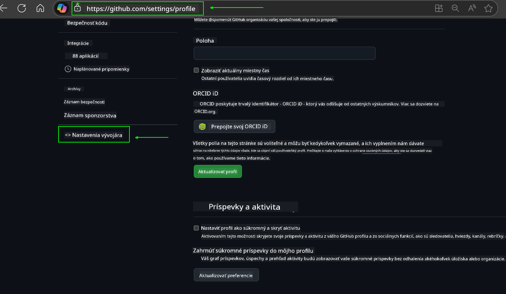
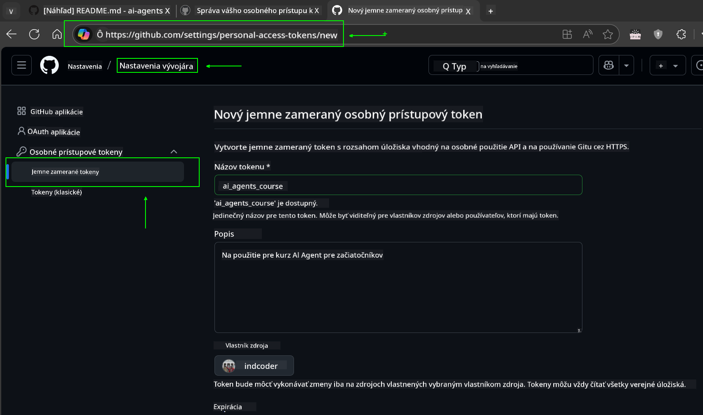
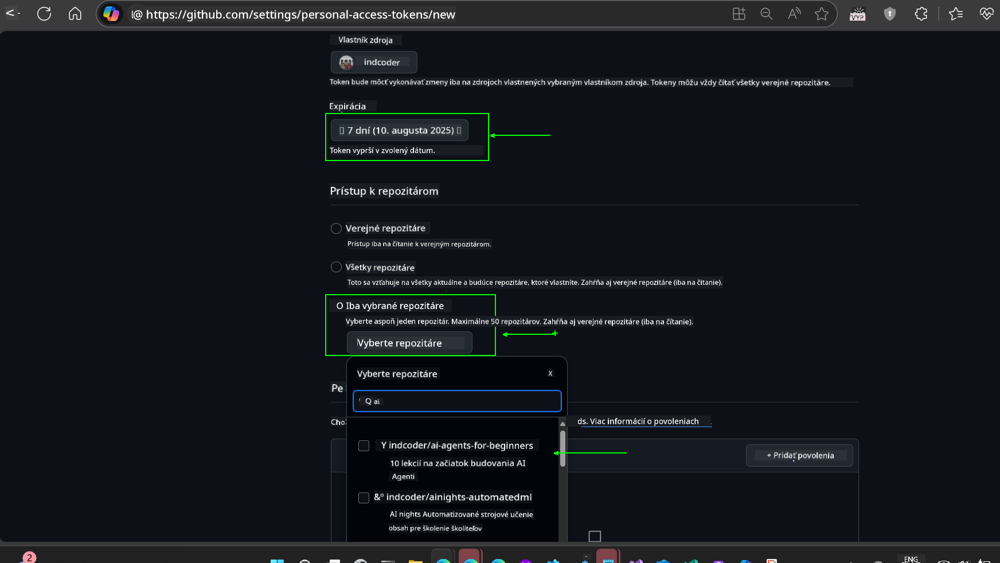
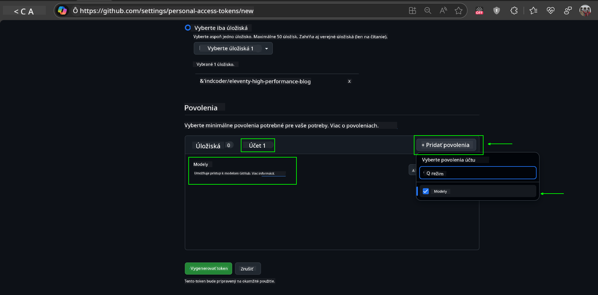
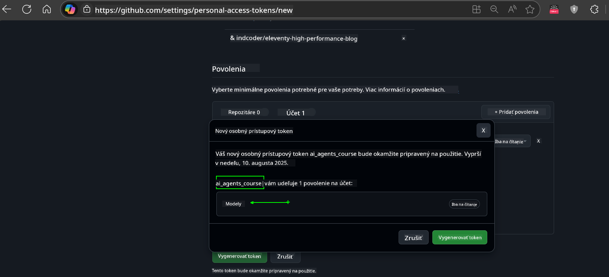
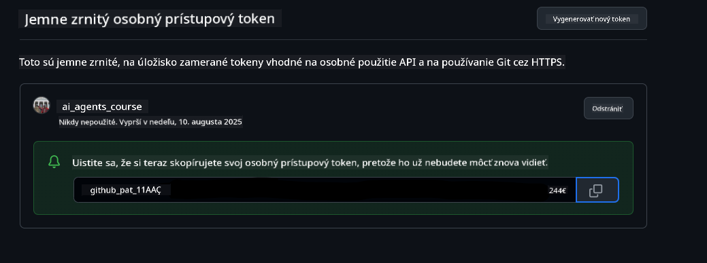
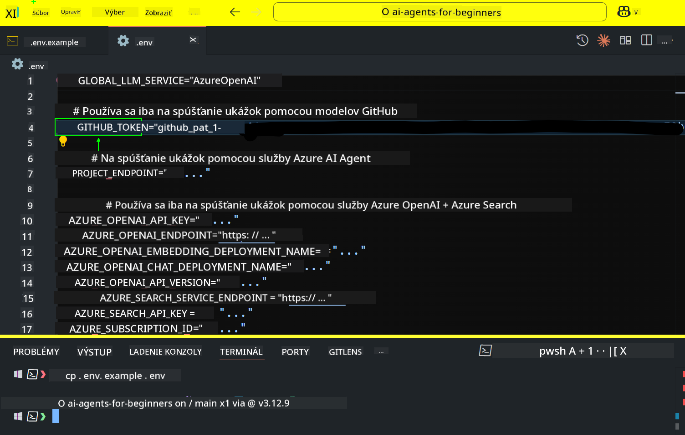

<!--
CO_OP_TRANSLATOR_METADATA:
{
  "original_hash": "c55b973b1562abf5aadf6a4028265ac5",
  "translation_date": "2025-08-29T20:38:23+00:00",
  "source_file": "00-course-setup/README.md",
  "language_code": "sk"
}
-->
# Nastavenie kurzu

## Úvod

Táto lekcia pokrýva, ako spustiť ukážky kódu tohto kurzu.

## Pripojte sa k ostatným študentom a získajte pomoc

Predtým, ako začnete klonovať svoje úložisko, pripojte sa k [AI Agents For Beginners Discord kanálu](https://aka.ms/ai-agents/discord), kde môžete získať pomoc s nastavením, odpovede na otázky o kurze alebo sa spojiť s ostatnými študentmi.

## Klonujte alebo forknite toto úložisko

Na začiatok prosím klonujte alebo forknite GitHub úložisko. Týmto si vytvoríte vlastnú verziu materiálov kurzu, aby ste mohli spúšťať, testovať a upravovať kód!

Toto môžete urobiť kliknutím na odkaz na


## Spúšťanie kódu

Tento kurz ponúka sériu Jupyter Notebookov, ktoré môžete spustiť, aby ste získali praktické skúsenosti s budovaním AI agentov.

Ukážky kódu používajú buď:

**Vyžaduje GitHub účet - zadarmo**:

1) Semantic Kernel Agent Framework + GitHub Models Marketplace. Označené ako (semantic-kernel.ipynb)  
2) AutoGen Framework + GitHub Models Marketplace. Označené ako (autogen.ipynb)  

**Vyžaduje Azure predplatné**:  
3) Azure AI Foundry + Azure AI Agent Service. Označené ako (azureaiagent.ipynb)  

Odporúčame vám vyskúšať všetky tri typy príkladov, aby ste zistili, ktorý vám najviac vyhovuje.

Nech si vyberiete ktorúkoľvek možnosť, určí to, ktoré kroky nastavenia musíte nasledovať nižšie:

## Požiadavky

- Python 3.12+  
  - **POZNÁMKA**: Ak nemáte nainštalovaný Python 3.12, uistite sa, že ho nainštalujete. Potom vytvorte svoj venv pomocou python3.12, aby ste zabezpečili správne verzie nainštalované zo súboru requirements.txt.  
- GitHub účet - pre prístup k GitHub Models Marketplace  
- Azure predplatné - pre prístup k Azure AI Foundry  
- Azure AI Foundry účet - pre prístup k Azure AI Agent Service  

V koreňovom adresári tohto úložiska sme zahrnuli súbor `requirements.txt`, ktorý obsahuje všetky potrebné Python balíčky na spustenie ukážok kódu.

Môžete ich nainštalovať spustením nasledujúceho príkazu vo vašom termináli v koreňovom adresári úložiska:

```bash
pip install -r requirements.txt
```  
Odporúčame vytvoriť Python virtuálne prostredie, aby ste sa vyhli akýmkoľvek konfliktom a problémom.

## Nastavenie VSCode
Uistite sa, že používate správnu verziu Pythonu vo VSCode.


## Nastavenie pre ukážky s použitím GitHub Models 

### Krok 1: Získajte svoj GitHub Personal Access Token (PAT)

Tento kurz využíva GitHub Models Marketplace, ktorý poskytuje bezplatný prístup k Large Language Models (LLMs), ktoré budete používať na budovanie AI agentov.

Na použitie GitHub Models budete musieť vytvoriť [GitHub Personal Access Token](https://docs.github.com/en/authentication/keeping-your-account-and-data-secure/managing-your-personal-access-tokens).

Toto môžete urobiť vo svojom GitHub účte.

Prosím, postupujte podľa [Princípu minimálnych oprávnení](https://docs.github.com/en/get-started/learning-to-code/storing-your-secrets-safely) pri vytváraní vášho tokenu. To znamená, že by ste mali tokenu prideliť iba tie oprávnenia, ktoré sú potrebné na spustenie ukážok kódu v tomto kurze.

1. Vyberte možnosť `Fine-grained tokens` na ľavej strane obrazovky prechodom do **Developer settings**  
   

   Potom vyberte `Generate new token`.

   

2. Zadajte popisný názov pre váš token, ktorý odráža jeho účel, aby ste ho neskôr ľahko identifikovali.

    🔐 Odporúčanie pre trvanie tokenu

    Odporúčané trvanie: 30 dní  
    Pre bezpečnejší prístup môžete zvoliť kratšie obdobie—napríklad 7 dní 🛡️  
    Je to skvelý spôsob, ako si stanoviť osobný cieľ a dokončiť kurz, kým je vaša motivácia vysoká 🚀.

    

3. Obmedzte rozsah tokenu na váš fork tohto úložiska.

    

4. Obmedzte oprávnenia tokenu: V časti **Permissions** kliknite na kartu **Account** a potom na tlačidlo "+ Add permissions". Zobrazí sa rozbaľovacie menu. Vyhľadajte **Models** a zaškrtnite políčko.  
    

5. Overte požadované oprávnenia pred generovaním tokenu. 

6. Pred generovaním tokenu sa uistite, že ste pripravení uložiť token na bezpečné miesto, ako je trezor správcu hesiel, pretože po jeho vytvorení už nebude zobrazený. 

Skopírujte svoj nový token, ktorý ste práve vytvorili. Teraz ho pridáte do svojho `.env` súboru zahrnutého v tomto kurze.

### Krok 2: Vytvorte svoj `.env` súbor

Na vytvorenie `.env` súboru spustite nasledujúci príkaz vo svojom termináli.

```bash
cp .env.example .env
```

Týmto sa skopíruje príklad súboru a vytvorí `.env` vo vašom adresári, kde vyplníte hodnoty pre premenné prostredia.

So skopírovaným tokenom otvorte `.env` súbor vo svojom obľúbenom textovom editore a vložte svoj token do poľa `GITHUB_TOKEN`.  


Teraz by ste mali byť schopní spustiť ukážky kódu tohto kurzu.

## Nastavenie pre ukážky s použitím Azure AI Foundry a Azure AI Agent Service

### Krok 1: Získajte svoj Azure Project Endpoint

Postupujte podľa krokov na vytvorenie hubu a projektu v Azure AI Foundry, ktoré nájdete tu: [Hub resources overview](https://learn.microsoft.com/en-us/azure/ai-foundry/concepts/ai-resources)

Keď vytvoríte svoj projekt, budete musieť získať reťazec pripojenia pre váš projekt.

Toto môžete urobiť na stránke **Overview** vášho projektu v Azure AI Foundry portáli.


### Krok 2: Vytvorte svoj `.env` súbor

Na vytvorenie `.env` súboru spustite nasledujúci príkaz vo svojom termináli.

```bash
cp .env.example .env
```

Týmto sa skopíruje príklad súboru a vytvorí `.env` vo vašom adresári, kde vyplníte hodnoty pre premenné prostredia.

So skopírovaným tokenom otvorte `.env` súbor vo svojom obľúbenom textovom editore a vložte svoj token do poľa `PROJECT_ENDPOINT`.

### Krok 3: Prihláste sa do Azure

Ako bezpečnostnú najlepšiu prax použijeme [keyless authentication](https://learn.microsoft.com/azure/developer/ai/keyless-connections?tabs=csharp%2Cazure-cli?WT.mc_id=academic-105485-koreyst) na autentifikáciu do Azure OpenAI pomocou Microsoft Entra ID.

Ďalej otvorte terminál a spustite `az login --use-device-code`, aby ste sa prihlásili do svojho Azure účtu.

Po prihlásení vyberte svoje predplatné v termináli.

## Ďalšie premenné prostredia - Azure Search a Azure OpenAI 

Pre lekciu Agentic RAG - Lekcia 5 - sú k dispozícii ukážky, ktoré používajú Azure Search a Azure OpenAI.

Ak chcete spustiť tieto ukážky, budete musieť pridať nasledujúce premenné prostredia do svojho `.env` súboru:

### Stránka prehľadu (Projekt)

- `AZURE_SUBSCRIPTION_ID` - Skontrolujte **Project details** na stránke **Overview** vášho projektu.

- `AZURE_AI_PROJECT_NAME` - Pozrite sa na vrch stránky **Overview** vášho projektu.

- `AZURE_OPENAI_SERVICE` - Nájdite to na karte **Included capabilities** pre **Azure OpenAI Service** na stránke **Overview**.

### Centrum správy

- `AZURE_OPENAI_RESOURCE_GROUP` - Prejdite na **Project properties** na stránke **Overview** v **Management Center**.

- `GLOBAL_LLM_SERVICE` - Pod **Connected resources** nájdite názov pripojenia **Azure AI Services**. Ak nie je uvedené, skontrolujte **Azure portal** vo vašej skupine zdrojov pre názov zdroja AI Services.

### Stránka Models + Endpoints

- `AZURE_OPENAI_EMBEDDING_DEPLOYMENT_NAME` - Vyberte svoj embedding model (napr. `text-embedding-ada-002`) a poznačte si **Deployment name** z detailov modelu.

- `AZURE_OPENAI_CHAT_DEPLOYMENT_NAME` - Vyberte svoj chat model (napr. `gpt-4o-mini`) a poznačte si **Deployment name** z detailov modelu.

### Azure portál

- `AZURE_OPENAI_ENDPOINT` - Vyhľadajte **Azure AI services**, kliknite na to, potom prejdite na **Resource Management**, **Keys and Endpoint**, posuňte sa nadol na "Azure OpenAI endpoints" a skopírujte ten, ktorý hovorí "Language APIs".

- `AZURE_OPENAI_API_KEY` - Z tej istej obrazovky skopírujte KEY 1 alebo KEY 2.

- `AZURE_SEARCH_SERVICE_ENDPOINT` - Nájdite svoj **Azure AI Search** zdroj, kliknite naň a pozrite si **Overview**.

- `AZURE_SEARCH_API_KEY` - Potom prejdite na **Settings** a potom **Keys**, aby ste skopírovali primárny alebo sekundárny admin kľúč.

### Externá webová stránka

- `AZURE_OPENAI_API_VERSION` - Navštívte stránku [API version lifecycle](https://learn.microsoft.com/en-us/azure/ai-services/openai/api-version-deprecation#latest-ga-api-release) pod **Latest GA API release**.

### Nastavenie keyless autentifikácie

Namiesto pevného zakódovania vašich poverení použijeme keyless pripojenie s Azure OpenAI. Na to importujeme `DefaultAzureCredential` a neskôr zavoláme funkciu `DefaultAzureCredential`, aby sme získali poverenie.

```python
from azure.identity import DefaultAzureCredential, InteractiveBrowserCredential
```

## Niečo nefunguje?

Ak máte akékoľvek problémy s týmto nastavením, pripojte sa do nášho

## Ďalšia lekcia

Teraz ste pripravení spustiť kód tohto kurzu. Prajeme vám veľa zábavy pri objavovaní sveta AI agentov!

[Úvod do AI agentov a ich využitia](../01-intro-to-ai-agents/README.md)

---

**Upozornenie**:  
Tento dokument bol preložený pomocou služby AI prekladu [Co-op Translator](https://github.com/Azure/co-op-translator). Aj keď sa snažíme o presnosť, prosím, berte na vedomie, že automatizované preklady môžu obsahovať chyby alebo nepresnosti. Pôvodný dokument v jeho rodnom jazyku by mal byť považovaný za autoritatívny zdroj. Pre kritické informácie sa odporúča profesionálny ľudský preklad. Nie sme zodpovední za akékoľvek nedorozumenia alebo nesprávne interpretácie vyplývajúce z použitia tohto prekladu.