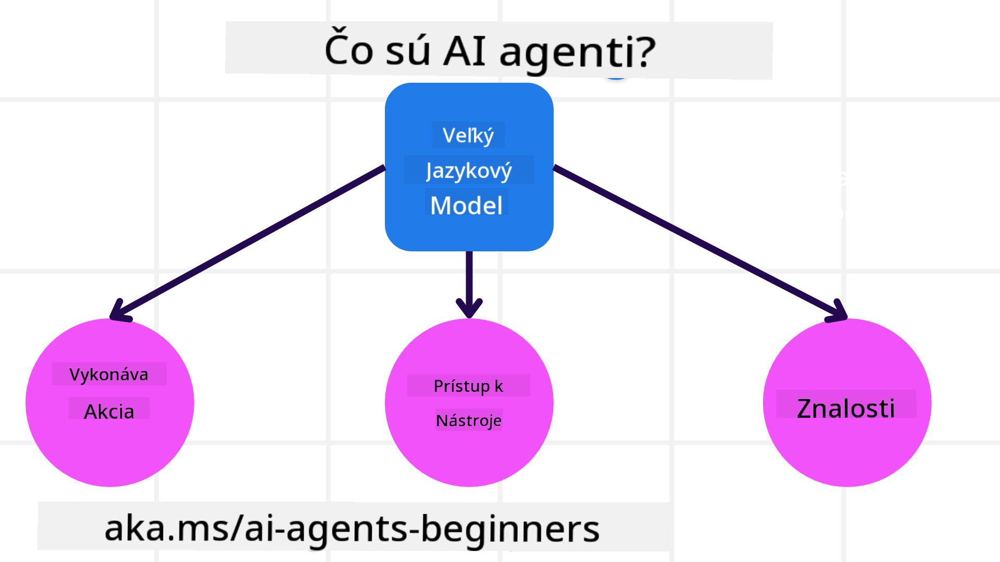
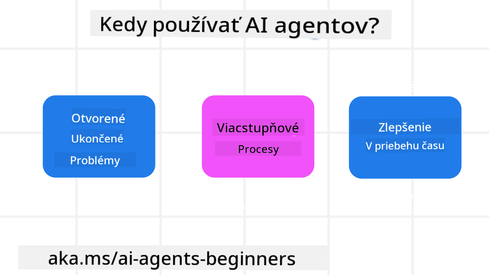

<!--
CO_OP_TRANSLATOR_METADATA:
{
  "original_hash": "d84943abc8f001ad4670418d32c2d899",
  "translation_date": "2025-07-12T08:11:43+00:00",
  "source_file": "01-intro-to-ai-agents/README.md",
  "language_code": "sk"
}
-->
stretnúť sa s ostatnými študentmi a tvorcami AI agentov a položiť akékoľvek otázky týkajúce sa tohto kurzu.

Na začiatok tohto kurzu si najprv lepšie vysvetlíme, čo sú AI agenti a ako ich môžeme využiť v aplikáciách a pracovných postupoch, ktoré vytvárame.

## Úvod

Táto lekcia pokrýva:

- Čo sú AI agenti a aké sú rôzne typy agentov?
- Pre aké prípady použitia sú AI agenti najvhodnejší a ako nám môžu pomôcť?
- Aké sú základné stavebné kamene pri navrhovaní agentických riešení?

## Ciele učenia
Po dokončení tejto lekcie by ste mali byť schopní:

- Pochopiť koncepty AI agentov a ako sa líšia od iných AI riešení.
- Efektívne aplikovať AI agentov.
- Produktívne navrhovať agentické riešenia pre používateľov aj zákazníkov.

## Definovanie AI agentov a typy AI agentov

### Čo sú AI agenti?

AI agenti sú **systémy**, ktoré umožňujú **veľkým jazykovým modelom (LLM)** **vykonávať akcie** tým, že rozširujú ich schopnosti tým, že LLM poskytujú **prístup k nástrojom** a **vedomostiam**.

Rozoberme si túto definíciu na menšie časti:

- **Systém** – Je dôležité myslieť na agentov nie len ako na jeden komponent, ale ako na systém viacerých komponentov. Na základnej úrovni sú komponenty AI agenta:
  - **Prostredie** – Definovaný priestor, v ktorom AI agent pôsobí. Napríklad, ak by sme mali AI agenta na rezerváciu ciest, prostredím by mohol byť rezervačný systém, ktorý agent používa na dokončenie úloh.
  - **Senzory** – Prostredia obsahujú informácie a poskytujú spätnú väzbu. AI agenti používajú senzory na zhromažďovanie a interpretáciu týchto informácií o aktuálnom stave prostredia. V príklade cestovného agenta môže rezervačný systém poskytovať informácie ako dostupnosť hotelov alebo ceny leteniek.
  - **Aktuátory** – Keď AI agent získa aktuálny stav prostredia, pre danú úlohu určí, akú akciu vykonať na zmenu prostredia. Pre cestovného agenta to môže byť rezervácia dostupnej izby pre používateľa.

**Veľké jazykové modely** – Koncept agentov existoval už pred vznikom LLM. Výhodou budovania AI agentov s LLM je ich schopnosť interpretovať ľudský jazyk a dáta. Táto schopnosť umožňuje LLM interpretovať informácie z prostredia a definovať plán na zmenu prostredia.

**Vykonávanie akcií** – Mimo systémov AI agentov sú LLM obmedzené na situácie, kde akcia spočíva vo vytváraní obsahu alebo informácií na základe požiadavky používateľa. V systémoch AI agentov môžu LLM plniť úlohy tým, že interpretujú požiadavku používateľa a používajú nástroje dostupné v ich prostredí.

**Prístup k nástrojom** – To, ku ktorým nástrojom má LLM prístup, je definované 1) prostredím, v ktorom pôsobí, a 2) vývojárom AI agenta. V našom príklade cestovného agenta sú nástroje agenta obmedzené operáciami dostupnými v rezervačnom systéme, a/alebo vývojár môže obmedziť prístup agenta k nástrojom len na lety.

**Pamäť + vedomosti** – Pamäť môže byť krátkodobá v kontexte rozhovoru medzi používateľom a agentom. Dlhodobo, okrem informácií poskytovaných prostredím, môžu AI agenti tiež získavať vedomosti z iných systémov, služieb, nástrojov a dokonca aj iných agentov. V príklade cestovného agenta by tieto vedomosti mohli byť informácie o preferenciách používateľa uložené v databáze zákazníkov.

### Rôzne typy agentov

Teraz, keď máme všeobecnú definíciu AI agentov, pozrime sa na niektoré konkrétne typy agentov a ako by sa aplikovali na cestovného AI agenta.

| **Typ agenta**                | **Popis**                                                                                                                           | **Príklad**                                                                                                                                                                                                                   |
| ----------------------------- | ----------------------------------------------------------------------------------------------------------------------------------- | ----------------------------------------------------------------------------------------------------------------------------------------------------------------------------------------------------------------------------- |
| **Jednoduchí reflexní agenti**      | Vykonávajú okamžité akcie na základe preddefinovaných pravidiel.                                                                   | Cestovný agent interpretuje kontext e-mailu a posiela sťažnosti na cestovanie zákazníckemu servisu.                                                                                                                          |
| **Modelovo založení reflexní agenti** | Vykonávajú akcie na základe modelu sveta a zmien v tomto modeli.                                                                   | Cestovný agent uprednostňuje trasy s výraznými zmenami cien na základe prístupu k historickým cenovým údajom.                                                                                                             |
| **Agent založený na cieľoch**         | Vytvára plány na dosiahnutie konkrétnych cieľov tým, že interpretuje cieľ a určuje akcie na jeho dosiahnutie.                      | Cestovný agent rezervuje cestu tým, že určí potrebné cestovné usporiadania (auto, verejná doprava, lety) z aktuálnej lokality do cieľa.                                                                                      |
| **Agent založený na užitočnosti**      | Zohľadňuje preferencie a numericky vyvažuje kompromisy na určenie, ako dosiahnuť ciele.                                            | Cestovný agent maximalizuje užitočnosť tým, že vyvažuje pohodlie a cenu pri rezervácii cesty.                                                                                                                                 |
| **Učiaci sa agenti**           | Zlepšujú sa v priebehu času reagovaním na spätnú väzbu a prispôsobovaním akcií.                                                    | Cestovný agent sa zlepšuje pomocou spätnej väzby od zákazníkov z prieskumov po ceste a upravuje budúce rezervácie.                                                                                                           |
| **Hierarchickí agenti**       | Obsahujú viacerých agentov v hierarchickom systéme, kde vyšší agent rozdeľuje úlohy na podúlohy pre nižších agentov.              | Cestovný agent zruší cestu rozdelením úlohy na podúlohy (napríklad zrušenie konkrétnych rezervácií) a nižší agenti ich vykonajú, pričom podávajú správy vyššiemu agentovi.                                                     |
| **Systémy viacerých agentov (MAS)** | Agenti dokončujú úlohy nezávisle, buď kooperatívne alebo konkurenčne.                                                              | Kooperatívne: Viacerí agenti rezervujú konkrétne cestovné služby ako hotely, lety a zábavu. Konkurenčné: Viacerí agenti spravujú a súťažia o spoločný kalendár hotelových rezervácií, aby zákazníkov ubytovali v hoteli.         |

## Kedy používať AI agentov

V predchádzajúcej časti sme použili prípad použitia cestovného agenta na vysvetlenie, ako sa rôzne typy agentov môžu použiť v rôznych scenároch rezervácie ciest. Tento príklad budeme používať aj naďalej počas celého kurzu.

Pozrime sa na typy prípadov použitia, pre ktoré sú AI agenti najvhodnejší:

- **Otvorené problémy** – umožniť LLM určiť potrebné kroky na dokončenie úlohy, pretože nie vždy je možné ich pevne zakódovať do pracovného postupu.
- **Viacstupňové procesy** – úlohy, ktoré vyžadujú určitú úroveň zložitosti, kde AI agent potrebuje používať nástroje alebo informácie počas viacerých krokov namiesto jednorazového získania.
- **Zlepšovanie v čase** – úlohy, kde sa agent môže zlepšovať v priebehu času prijímaním spätnej väzby buď zo svojho prostredia alebo od používateľov, aby poskytoval lepšiu užitočnosť.

Viac úvah o používaní AI agentov nájdete v lekcii Budovanie dôveryhodných AI agentov.

## Základy agentických riešení

### Vývoj agenta

Prvým krokom pri navrhovaní systému AI agenta je definovať nástroje, akcie a správanie. V tomto kurze sa zameriavame na použitie **Azure AI Agent Service** na definovanie našich agentov. Ponúka funkcie ako:

- Výber otvorených modelov ako OpenAI, Mistral a Llama
- Použitie licencovaných dát od poskytovateľov ako Tripadvisor
- Použitie štandardizovaných nástrojov OpenAPI 3.0

### Agentické vzory

Komunikácia s LLM prebieha cez promptovanie. Vzhľadom na čiastočne autonómnu povahu AI agentov nie je vždy možné alebo potrebné manuálne opätovne promptovať LLM po zmene v prostredí. Používame **agentické vzory**, ktoré nám umožňujú promptovať LLM cez viacero krokov škálovateľnejším spôsobom.

Tento kurz je rozdelený podľa niektorých aktuálne populárnych agentických vzorov.

### Agentické rámce

Agentické rámce umožňujú vývojárom implementovať agentické vzory cez kód. Tieto rámce ponúkajú šablóny, pluginy a nástroje pre lepšiu spoluprácu AI agentov. Tieto výhody poskytujú lepšiu pozorovateľnosť a riešenie problémov v systémoch AI agentov.

V tomto kurze preskúmame výskumom podporovaný rámec AutoGen a produkčne pripravený rámec Agent od Semantic Kernel.

## Predchádzajúca lekcia

[Course Setup](../00-course-setup/README.md)

## Nasledujúca lekcia

[Exploring Agentic Frameworks](../02-explore-agentic-frameworks/README.md)

**Vyhlásenie o zodpovednosti**:  
Tento dokument bol preložený pomocou AI prekladateľskej služby [Co-op Translator](https://github.com/Azure/co-op-translator). Hoci sa snažíme o presnosť, prosím, majte na pamäti, že automatizované preklady môžu obsahovať chyby alebo nepresnosti. Originálny dokument v jeho pôvodnom jazyku by mal byť považovaný za autoritatívny zdroj. Pre kritické informácie sa odporúča profesionálny ľudský preklad. Nie sme zodpovední za akékoľvek nedorozumenia alebo nesprávne interpretácie vyplývajúce z použitia tohto prekladu.