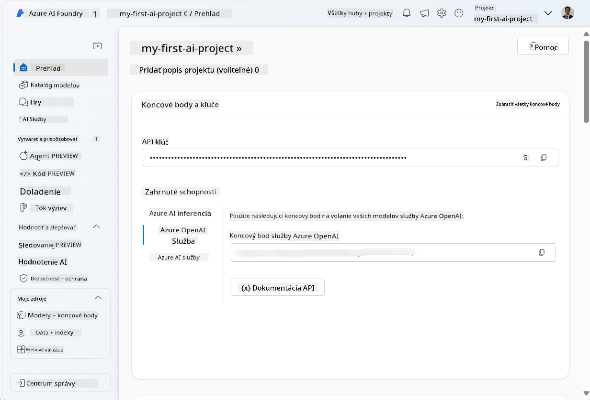
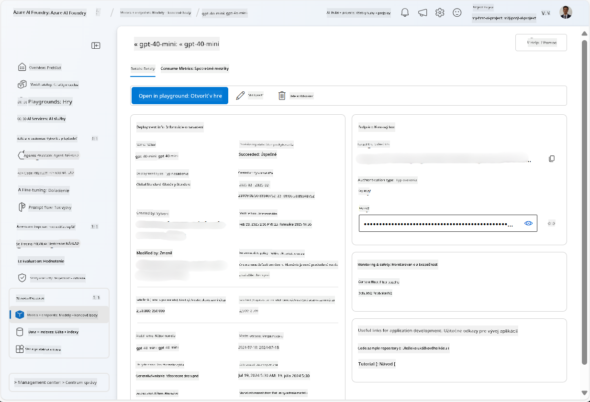
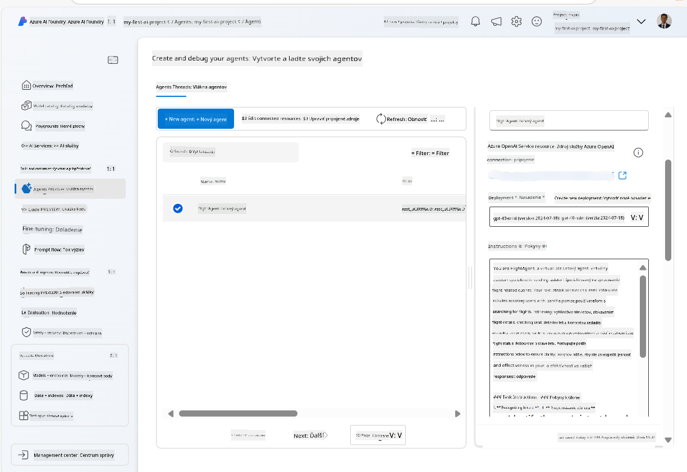
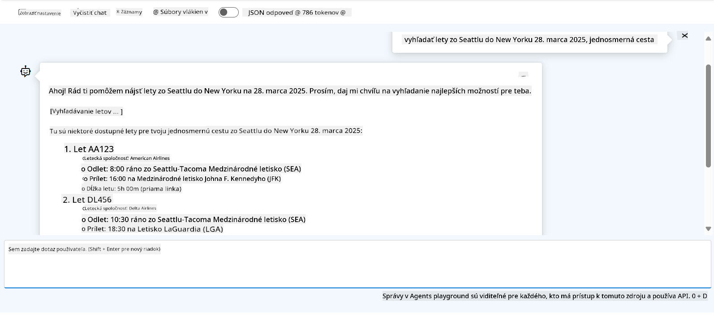

<!--
CO_OP_TRANSLATOR_METADATA:
{
  "original_hash": "7e92870dc0843e13d4dabc620c09d2d9",
  "translation_date": "2025-07-12T08:22:13+00:00",
  "source_file": "02-explore-agentic-frameworks/azure-ai-foundry-agent-creation.md",
  "language_code": "sk"
}
-->
# Vývoj služby Azure AI Agent

V tomto cvičení použijete nástroje služby Azure AI Agent v [portáli Azure AI Foundry](https://ai.azure.com/?WT.mc_id=academic-105485-koreyst) na vytvorenie agenta pre rezerváciu letov. Agent bude schopný komunikovať s používateľmi a poskytovať informácie o letoch.

## Požiadavky

Na dokončenie tohto cvičenia potrebujete:
1. Azure účet s aktívnym predplatným. [Vytvorte si účet zadarmo](https://azure.microsoft.com/free/?WT.mc_id=academic-105485-koreyst).
2. Povolenia na vytvorenie Azure AI Foundry hubu alebo mať jeden vytvorený pre vás.
    - Ak máte rolu Contributor alebo Owner, môžete postupovať podľa krokov v tomto návode.

## Vytvorenie Azure AI Foundry hubu

> **Note:** Azure AI Foundry bola predtým známa ako Azure AI Studio.

1. Postupujte podľa pokynov z [blogového príspevku Azure AI Foundry](https://learn.microsoft.com/en-us/azure/ai-studio/?WT.mc_id=academic-105485-koreyst) na vytvorenie Azure AI Foundry hubu.
2. Keď je váš projekt vytvorený, zatvorte všetky zobrazené tipy a prezrite si stránku projektu v portáli Azure AI Foundry, ktorá by mala vyzerať podobne ako na nasledujúcom obrázku:

    

## Nasadenie modelu

1. V ľavom paneli vášho projektu v sekcii **My assets** vyberte stránku **Models + endpoints**.
2. Na stránke **Models + endpoints**, v záložke **Model deployments**, v menu **+ Deploy model** vyberte **Deploy base model**.
3. Vyhľadajte model `gpt-4o-mini` v zozname, vyberte ho a potvrďte.

    > **Note**: Zníženie TPM pomáha predísť nadmernému využívaniu kvóty dostupnej vo vašom predplatnom.

    

## Vytvorenie agenta

Keď máte model nasadený, môžete vytvoriť agenta. Agent je konverzačný AI model, ktorý slúži na interakciu s používateľmi.

1. V ľavom paneli vášho projektu v sekcii **Build & Customize** vyberte stránku **Agents**.
2. Kliknite na **+ Create agent** pre vytvorenie nového agenta. V dialógovom okne **Agent Setup**:
    - Zadajte meno agenta, napríklad `FlightAgent`.
    - Uistite sa, že je vybrané nasadenie modelu `gpt-4o-mini`, ktoré ste predtým vytvorili.
    - Nastavte **Instructions** podľa promptu, ktorý chcete, aby agent nasledoval. Tu je príklad:
    ```
    You are FlightAgent, a virtual assistant specialized in handling flight-related queries. Your role includes assisting users with searching for flights, retrieving flight details, checking seat availability, and providing real-time flight status. Follow the instructions below to ensure clarity and effectiveness in your responses:

    ### Task Instructions:
    1. **Recognizing Intent**:
       - Identify the user's intent based on their request, focusing on one of the following categories:
         - Searching for flights
         - Retrieving flight details using a flight ID
         - Checking seat availability for a specified flight
         - Providing real-time flight status using a flight number
       - If the intent is unclear, politely ask users to clarify or provide more details.
        
    2. **Processing Requests**:
        - Depending on the identified intent, perform the required task:
        - For flight searches: Request details such as origin, destination, departure date, and optionally return date.
        - For flight details: Request a valid flight ID.
        - For seat availability: Request the flight ID and date and validate inputs.
        - For flight status: Request a valid flight number.
        - Perform validations on provided data (e.g., formats of dates, flight numbers, or IDs). If the information is incomplete or invalid, return a friendly request for clarification.

    3. **Generating Responses**:
    - Use a tone that is friendly, concise, and supportive.
    - Provide clear and actionable suggestions based on the output of each task.
    - If no data is found or an error occurs, explain it to the user gently and offer alternative actions (e.g., refine search, try another query).
    
    ```
> [!NOTE]
> Pre podrobný prompt si môžete pozrieť [tento repozitár](https://github.com/ShivamGoyal03/RoamMind) pre viac informácií.
    
> Okrem toho môžete pridať **Knowledge Base** a **Actions** na rozšírenie schopností agenta poskytovať viac informácií a vykonávať automatizované úlohy na základe požiadaviek používateľa. Pre toto cvičenie môžete tieto kroky preskočiť.
    


3. Ak chcete vytvoriť nového multi-AI agenta, jednoducho kliknite na **New Agent**. Novovytvorený agent sa potom zobrazí na stránke Agents.

## Testovanie agenta

Po vytvorení agenta ho môžete otestovať, aby ste videli, ako reaguje na používateľské otázky v prostredí Azure AI Foundry portálu.

1. V hornej časti panela **Setup** pre vášho agenta vyberte **Try in playground**.
2. V paneli **Playground** môžete komunikovať s agentom písaním otázok do chatovacieho okna. Napríklad môžete požiadať agenta, aby vyhľadal lety zo Seattlu do New Yorku na 28. deň.

    > **Note**: Agent nemusí poskytovať presné odpovede, pretože v tomto cvičení sa nepoužívajú žiadne aktuálne dáta. Cieľom je otestovať schopnosť agenta porozumieť a reagovať na používateľské otázky na základe poskytnutých inštrukcií.

    

3. Po otestovaní agenta ho môžete ďalej prispôsobiť pridaním ďalších zámerov, tréningových dát a akcií na rozšírenie jeho schopností.

## Vyčistenie zdrojov

Keď dokončíte testovanie agenta, môžete ho odstrániť, aby ste predišli ďalším nákladom.
1. Otvorte [Azure portál](https://portal.azure.com) a zobrazte obsah skupiny zdrojov, kde ste nasadili hubové zdroje použité v tomto cvičení.
2. Na paneli nástrojov vyberte **Delete resource group**.
3. Zadajte názov skupiny zdrojov a potvrďte jej odstránenie.

## Zdroje

- [Dokumentácia Azure AI Foundry](https://learn.microsoft.com/en-us/azure/ai-studio/?WT.mc_id=academic-105485-koreyst)
- [Portál Azure AI Foundry](https://ai.azure.com/?WT.mc_id=academic-105485-koreyst)
- [Začíname s Azure AI Studio](https://techcommunity.microsoft.com/blog/educatordeveloperblog/getting-started-with-azure-ai-studio/4095602?WT.mc_id=academic-105485-koreyst)
- [Základy AI agentov na Azure](https://learn.microsoft.com/en-us/training/modules/ai-agent-fundamentals/?WT.mc_id=academic-105485-koreyst)
- [Azure AI Discord](https://aka.ms/AzureAI/Discord)

**Vyhlásenie o zodpovednosti**:  
Tento dokument bol preložený pomocou AI prekladateľskej služby [Co-op Translator](https://github.com/Azure/co-op-translator). Aj keď sa snažíme o presnosť, prosím, majte na pamäti, že automatizované preklady môžu obsahovať chyby alebo nepresnosti. Originálny dokument v jeho pôvodnom jazyku by mal byť považovaný za autoritatívny zdroj. Pre kritické informácie sa odporúča profesionálny ľudský preklad. Nie sme zodpovední za akékoľvek nedorozumenia alebo nesprávne interpretácie vyplývajúce z použitia tohto prekladu.