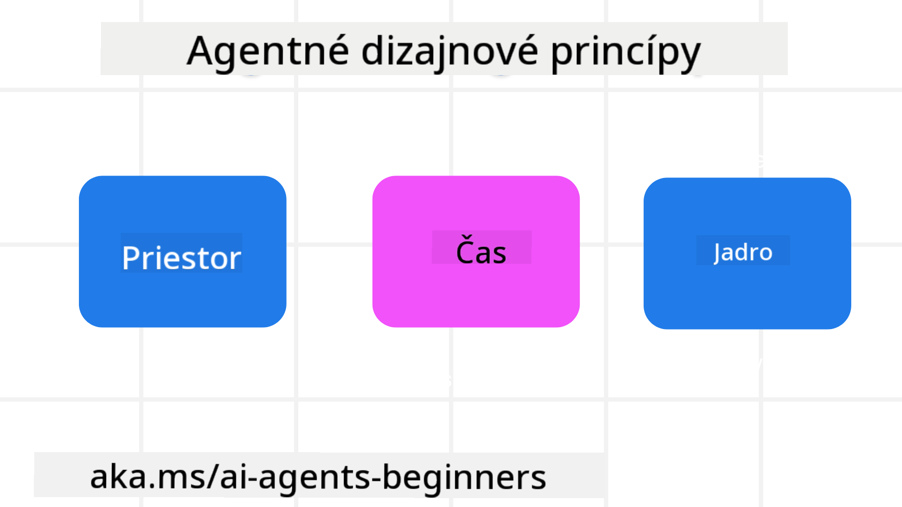

<!--
CO_OP_TRANSLATOR_METADATA:
{
  "original_hash": "4c46e4ff9e349c521e2b0b17f51afa64",
  "translation_date": "2025-08-29T20:43:30+00:00",
  "source_file": "03-agentic-design-patterns/README.md",
  "language_code": "sk"
}
-->

> _(Kliknite na obrázok vyššie pre zobrazenie videa k tejto lekcii)_
# Princípy dizajnu agentov AI

## Úvod

Existuje mnoho spôsobov, ako premýšľať o budovaní agentických systémov AI. Keďže nejednoznačnosť je v dizajne generatívnej AI skôr vlastnosťou než chybou, inžinieri často nevedia, kde začať. Vytvorili sme súbor princípov dizajnu zameraných na používateľa, ktoré umožňujú vývojárom vytvárať systémy agentov orientované na zákazníka, aby splnili ich obchodné potreby. Tieto princípy dizajnu nie sú predpísanou architektúrou, ale skôr východiskovým bodom pre tímy, ktoré definujú a budujú skúsenosti s agentmi.

Všeobecne by agenti mali:

- Rozširovať a škálovať ľudské schopnosti (napríklad brainstorming, riešenie problémov, automatizácia atď.)
- Vyplniť medzery v znalostiach (napríklad oboznámenie sa s novými oblasťami, preklad atď.)
- Uľahčovať a podporovať spoluprácu spôsobmi, ktoré nám ako jednotlivcom vyhovujú
- Pomáhať nám stať sa lepšími verziami seba samých (napríklad ako životný kouč/organizátor úloh, pomoc pri učení sa emocionálnej regulácie a zručností všímavosti, budovanie odolnosti atď.)

## Táto lekcia pokryje

- Čo sú princípy dizajnu agentov
- Aké sú niektoré pokyny na implementáciu týchto princípov
- Príklady použitia týchto princípov dizajnu

## Ciele učenia

Po absolvovaní tejto lekcie budete schopní:

1. Vysvetliť, čo sú princípy dizajnu agentov
2. Vysvetliť pokyny na používanie princípov dizajnu agentov
3. Pochopiť, ako vytvoriť agenta pomocou princípov dizajnu agentov

## Princípy dizajnu agentov

### Agent (Priestor)

Toto je prostredie, v ktorom agent funguje. Tieto princípy informujú, ako navrhujeme agentov pre interakciu vo fyzických a digitálnych svetoch.

- **Spojovať, nie nahrádzať** – pomáhať spájať ľudí s inými ľuďmi, udalosťami a použiteľnými znalosťami na podporu spolupráce a prepojenia.
- Agenti pomáhajú spájať udalosti, znalosti a ľudí.
- Agenti približujú ľudí k sebe. Nie sú navrhnutí na to, aby nahrádzali alebo znevažovali ľudí.
- **Ľahko dostupní, no občas neviditeľní** – agent funguje prevažne na pozadí a upozorňuje nás len vtedy, keď je to relevantné a vhodné.
  - Agent je ľahko objaviteľný a dostupný pre autorizovaných používateľov na akomkoľvek zariadení alebo platforme.
  - Agent podporuje multimodálne vstupy a výstupy (zvuk, hlas, text atď.).
  - Agent dokáže plynulo prechádzať medzi popredím a pozadím; medzi proaktívnym a reaktívnym, v závislosti od vnímania potrieb používateľa.
  - Agent môže fungovať v neviditeľnej forme, no jeho procesy na pozadí a spolupráca s inými agentmi sú pre používateľa transparentné a kontrolovateľné.

### Agent (Čas)

Toto je spôsob, akým agent funguje v priebehu času. Tieto princípy informujú, ako navrhujeme agentov interagujúcich v minulosti, prítomnosti a budúcnosti.

- **Minulosť**: Reflexia histórie, ktorá zahŕňa stav aj kontext.
  - Agent poskytuje relevantnejšie výsledky na základe analýzy bohatších historických údajov, nielen udalostí, ľudí alebo stavov.
  - Agent vytvára spojenia z minulých udalostí a aktívne reflektuje pamäť, aby sa zapojil do aktuálnych situácií.
- **Prítomnosť**: Naliehanie namiesto notifikácií.
  - Agent stelesňuje komplexný prístup k interakcii s ľuďmi. Keď sa stane udalosť, agent ide nad rámec statického upozornenia alebo inej formality. Agent dokáže zjednodušiť procesy alebo dynamicky generovať podnety na nasmerovanie pozornosti používateľa v správnom momente.
  - Agent poskytuje informácie na základe kontextového prostredia, sociálnych a kultúrnych zmien a prispôsobené zámeru používateľa.
  - Interakcia s agentom môže byť postupná, vyvíjajúca sa v komplexnosti, aby dlhodobo posilnila používateľov.
- **Budúcnosť**: Prispôsobovanie a vývoj.
  - Agent sa prispôsobuje rôznym zariadeniam, platformám a modalitám.
  - Agent sa prispôsobuje správaniu používateľa, potrebám prístupnosti a je voľne prispôsobiteľný.
  - Agent je formovaný a vyvíja sa prostredníctvom neustálej interakcie s používateľom.

### Agent (Jadro)

Toto sú kľúčové prvky v jadre dizajnu agenta.

- **Prijímajte neistotu, ale budujte dôveru**.
  - Určitá úroveň neistoty agenta je očakávaná. Neistota je kľúčovým prvkom dizajnu agenta.
  - Dôvera a transparentnosť sú základnými vrstvami dizajnu agenta.
  - Ľudia majú kontrolu nad tým, kedy je agent zapnutý/vypnutý, a stav agenta je vždy jasne viditeľný.

## Pokyny na implementáciu týchto princípov

Pri používaní vyššie uvedených princípov dizajnu postupujte podľa týchto pokynov:

1. **Transparentnosť**: Informujte používateľa, že je zapojená AI, ako funguje (vrátane minulých akcií) a ako poskytnúť spätnú väzbu a upraviť systém.
2. **Kontrola**: Umožnite používateľovi prispôsobiť, špecifikovať preferencie a personalizovať, a mať kontrolu nad systémom a jeho atribútmi (vrátane možnosti zabudnutia).
3. **Konzistentnosť**: Snažte sa o konzistentné, multimodálne skúsenosti naprieč zariadeniami a koncovými bodmi. Používajte známe prvky UI/UX, kde je to možné (napríklad ikona mikrofónu pre hlasovú interakciu) a čo najviac znižujte kognitívnu záťaž používateľa (napríklad stručné odpovede, vizuálne pomôcky a obsah „Zistiť viac“).

## Ako navrhnúť cestovného agenta pomocou týchto princípov a pokynov

Predstavte si, že navrhujete cestovného agenta. Tu je, ako by ste mohli uvažovať o použití princípov a pokynov dizajnu:

1. **Transparentnosť** – Informujte používateľa, že cestovný agent je agent s podporou AI. Poskytnite základné pokyny, ako začať (napríklad správu „Ahoj“, ukážkové výzvy). Jasne to zdokumentujte na produktovej stránke. Zobrazte zoznam výziev, ktoré používateľ v minulosti zadal. Urobte jasným, ako poskytnúť spätnú väzbu (palec hore a dole, tlačidlo „Poslať spätnú väzbu“ atď.). Jasne formulujte, či má agent obmedzenia v používaní alebo témach.
2. **Kontrola** – Uistite sa, že je jasné, ako môže používateľ upraviť agenta po jeho vytvorení, napríklad pomocou systémovej výzvy. Umožnite používateľovi zvoliť, aký podrobný má byť agent, jeho štýl písania a akékoľvek obmedzenia na témy, o ktorých by agent nemal hovoriť. Umožnite používateľovi zobraziť a vymazať akékoľvek súbory alebo údaje, výzvy a minulé konverzácie.
3. **Konzistentnosť** – Uistite sa, že ikony pre zdieľanie výzvy, pridanie súboru alebo fotografie a označenie niekoho alebo niečoho sú štandardné a rozpoznateľné. Použite ikonu kancelárskej sponky na označenie nahrávania/zdieľania súborov s agentom a ikonu obrázka na označenie nahrávania grafiky.

### Máte ďalšie otázky o vzoroch dizajnu agentov AI?

Pridajte sa na [Azure AI Foundry Discord](https://aka.ms/ai-agents/discord), kde sa môžete stretnúť s ďalšími študentmi, zúčastniť sa konzultačných hodín a získať odpovede na vaše otázky o agentoch AI.

## Ďalšie zdroje

## Predchádzajúca lekcia

[Preskúmanie agentických rámcov](../02-explore-agentic-frameworks/README.md)

## Nasledujúca lekcia

[Vzor dizajnu používania nástrojov](../04-tool-use/README.md)

---

**Upozornenie**:  
Tento dokument bol preložený pomocou služby AI prekladu [Co-op Translator](https://github.com/Azure/co-op-translator). Aj keď sa snažíme o presnosť, upozorňujeme, že automatizované preklady môžu obsahovať chyby alebo nepresnosti. Pôvodný dokument v jeho pôvodnom jazyku by mal byť považovaný za autoritatívny zdroj. Pre kritické informácie sa odporúča profesionálny ľudský preklad. Nezodpovedáme za akékoľvek nedorozumenia alebo nesprávne interpretácie vyplývajúce z použitia tohto prekladu.