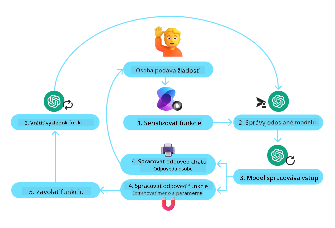
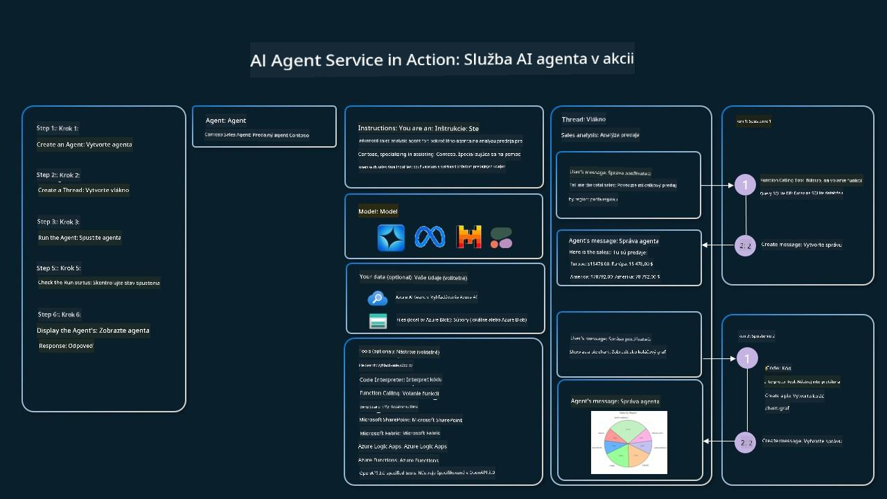

<!--
CO_OP_TRANSLATOR_METADATA:
{
  "original_hash": "88258b03f2893aa2e69eb8fb24baabbc",
  "translation_date": "2025-07-12T09:43:26+00:00",
  "source_file": "04-tool-use/README.md",
  "language_code": "sk"
}
-->
[](https://youtu.be/vieRiPRx-gI?si=cEZ8ApnT6Sus9rhn)

> _(Kliknite na obrázok vyššie pre zobrazenie videa tejto lekcie)_

# Návrhový vzor používania nástrojov

Nástroje sú zaujímavé, pretože umožňujú AI agentom mať širší rozsah schopností. Namiesto toho, aby agent mal obmedzený súbor akcií, ktoré môže vykonať, pridaním nástroja môže agent teraz vykonávať širokú škálu akcií. V tejto kapitole sa pozrieme na návrhový vzor používania nástrojov, ktorý popisuje, ako môžu AI agenti používať konkrétne nástroje na dosiahnutie svojich cieľov.

## Úvod

V tejto lekcii sa pokúsime odpovedať na nasledujúce otázky:

- Čo je to návrhový vzor používania nástrojov?
- Na aké prípady použitia sa dá aplikovať?
- Aké prvky/stavebné bloky sú potrebné na implementáciu tohto návrhového vzoru?
- Aké sú špeciálne úvahy pri používaní návrhového vzoru používania nástrojov na vytváranie dôveryhodných AI agentov?

## Ciele učenia

Po dokončení tejto lekcie budete schopní:

- Definovať návrhový vzor používania nástrojov a jeho účel.
- Identifikovať prípady použitia, kde je tento návrhový vzor vhodný.
- Pochopiť kľúčové prvky potrebné na implementáciu tohto vzoru.
- Rozpoznať úvahy potrebné na zabezpečenie dôveryhodnosti AI agentov používajúcich tento návrhový vzor.

## Čo je to návrhový vzor používania nástrojov?

**Návrhový vzor používania nástrojov** sa zameriava na to, aby LLM mali schopnosť interagovať s externými nástrojmi na dosiahnutie konkrétnych cieľov. Nástroje sú kód, ktorý môže agent vykonať na realizáciu akcií. Nástroj môže byť jednoduchá funkcia, napríklad kalkulačka, alebo volanie API tretej strany, ako napríklad vyhľadávanie cien akcií alebo predpoveď počasia. V kontexte AI agentov sú nástroje navrhnuté tak, aby ich agenti vykonávali v reakcii na **funkčné volania generované modelom**.

## Na aké prípady použitia sa dá aplikovať?

AI agenti môžu využiť nástroje na dokončenie zložitých úloh, získavanie informácií alebo prijímanie rozhodnutí. Návrhový vzor používania nástrojov sa často používa v situáciách, ktoré vyžadujú dynamickú interakciu s externými systémami, ako sú databázy, webové služby alebo interpretery kódu. Táto schopnosť je užitočná pre rôzne prípady použitia vrátane:

- **Dynamické získavanie informácií:** Agenti môžu dotazovať externé API alebo databázy, aby získali aktuálne údaje (napr. dotazovanie SQLite databázy na analýzu dát, získavanie cien akcií alebo informácií o počasí).
- **Vykonávanie a interpretácia kódu:** Agenti môžu spúšťať kód alebo skripty na riešenie matematických problémov, generovanie správ alebo vykonávanie simulácií.
- **Automatizácia pracovných tokov:** Automatizácia opakujúcich sa alebo viacstupňových pracovných tokov integráciou nástrojov ako plánovače úloh, e-mailové služby alebo dátové pipeline.
- **Zákaznícka podpora:** Agenti môžu komunikovať so CRM systémami, ticketovacími platformami alebo vedomostnými databázami na riešenie používateľských otázok.
- **Generovanie a úprava obsahu:** Agenti môžu využiť nástroje ako kontrola gramatiky, zhrňovače textu alebo hodnotiace nástroje bezpečnosti obsahu na pomoc pri tvorbe obsahu.

## Aké prvky/stavebné bloky sú potrebné na implementáciu návrhového vzoru používania nástrojov?

Tieto stavebné bloky umožňujú AI agentovi vykonávať širokú škálu úloh. Pozrime sa na kľúčové prvky potrebné na implementáciu návrhového vzoru používania nástrojov:

- **Schémy funkcií/nástrojov**: Podrobné definície dostupných nástrojov, vrátane názvu funkcie, účelu, požadovaných parametrov a očakávaných výstupov. Tieto schémy umožňujú LLM pochopiť, aké nástroje sú k dispozícii a ako zostaviť platné požiadavky.

- **Logika vykonávania funkcií**: Riadi, ako a kedy sa nástroje vyvolávajú na základe zámeru používateľa a kontextu konverzácie. Môže zahŕňať plánovacie moduly, mechanizmy smerovania alebo podmienené toky, ktoré dynamicky určujú použitie nástrojov.

- **Systém spracovania správ**: Komponenty, ktoré riadia tok konverzácie medzi vstupmi používateľa, odpoveďami LLM, volaniami nástrojov a ich výstupmi.

- **Rámec integrácie nástrojov**: Infraštuktúra, ktorá prepája agenta s rôznymi nástrojmi, či už ide o jednoduché funkcie alebo komplexné externé služby.

- **Spracovanie chýb a validácia**: Mechanizmy na riešenie zlyhaní pri vykonávaní nástrojov, overovanie parametrov a spravovanie neočakávaných odpovedí.

- **Správa stavu**: Sleduje kontext konverzácie, predchádzajúce interakcie s nástrojmi a perzistentné dáta, aby zabezpečila konzistenciu počas viackolových interakcií.

Ďalej sa pozrieme podrobnejšie na volanie funkcií/nástrojov.

### Volanie funkcií/nástrojov

Volanie funkcií je primárny spôsob, akým umožňujeme veľkým jazykovým modelom (LLM) interagovať s nástrojmi. Často uvidíte, že pojmy „funkcia“ a „nástroj“ sa používajú zameniteľne, pretože „funkcie“ (bloky znovupoužiteľného kódu) sú „nástroje“, ktoré agenti používajú na vykonávanie úloh. Aby sa mohol kód funkcie vyvolať, musí LLM porovnať požiadavku používateľa s popisom funkcie. Na to sa LLM posiela schéma obsahujúca popisy všetkých dostupných funkcií. LLM potom vyberie najvhodnejšiu funkciu pre danú úlohu a vráti jej názov a argumenty. Vybraná funkcia sa spustí, jej odpoveď sa pošle späť LLM, ktoré použije tieto informácie na odpoveď používateľovi.

Pre vývojárov, ktorí chcú implementovať volanie funkcií pre agentov, budete potrebovať:

1. LLM model, ktorý podporuje volanie funkcií
2. Schému obsahujúcu popisy funkcií
3. Kód pre každú popísanú funkciu

Použime príklad získania aktuálneho času v meste na ilustráciu:

1. **Inicializujte LLM, ktorý podporuje volanie funkcií:**

    Nie všetky modely podporujú volanie funkcií, preto je dôležité overiť, či model, ktorý používate, túto funkciu má. <a href="https://learn.microsoft.com/azure/ai-services/openai/how-to/function-calling" target="_blank">Azure OpenAI</a> podporuje volanie funkcií. Môžeme začať inicializáciou klienta Azure OpenAI.

    ```python
    # Initialize the Azure OpenAI client
    client = AzureOpenAI(
        azure_endpoint = os.getenv("AZURE_OPENAI_ENDPOINT"), 
        api_key=os.getenv("AZURE_OPENAI_API_KEY"),  
        api_version="2024-05-01-preview"
    )
    ```

1. **Vytvorte schému funkcie:**

    Ďalej definujeme JSON schému, ktorá obsahuje názov funkcie, popis toho, čo funkcia robí, a názvy a popisy parametrov funkcie. Túto schému potom odovzdáme klientovi vytvorenému predtým spolu s požiadavkou používateľa na zistenie času v San Franciscu. Dôležité je poznamenať, že **výsledkom je volanie nástroja**, **nie** konečná odpoveď na otázku. Ako už bolo spomenuté, LLM vráti názov funkcie, ktorú vybral pre úlohu, a argumenty, ktoré sa jej odovzdajú.

    ```python
    # Function description for the model to read
    tools = [
        {
            "type": "function",
            "function": {
                "name": "get_current_time",
                "description": "Get the current time in a given location",
                "parameters": {
                    "type": "object",
                    "properties": {
                        "location": {
                            "type": "string",
                            "description": "The city name, e.g. San Francisco",
                        },
                    },
                    "required": ["location"],
                },
            }
        }
    ]
    ```
   
    ```python
  
    # Initial user message
    messages = [{"role": "user", "content": "What's the current time in San Francisco"}] 
  
    # First API call: Ask the model to use the function
      response = client.chat.completions.create(
          model=deployment_name,
          messages=messages,
          tools=tools,
          tool_choice="auto",
      )
  
      # Process the model's response
      response_message = response.choices[0].message
      messages.append(response_message)
  
      print("Model's response:")  

      print(response_message)
  
    ```

    ```bash
    Model's response:
    ChatCompletionMessage(content=None, role='assistant', function_call=None, tool_calls=[ChatCompletionMessageToolCall(id='call_pOsKdUlqvdyttYB67MOj434b', function=Function(arguments='{"location":"San Francisco"}', name='get_current_time'), type='function')])
    ```
  
1. **Kód funkcie potrebný na vykonanie úlohy:**

    Keď LLM vyberie, ktorá funkcia sa má spustiť, je potrebné implementovať a vykonať kód, ktorý úlohu splní. Môžeme implementovať kód na získanie aktuálneho času v Pythone. Tiež budeme potrebovať kód na extrahovanie názvu a argumentov z response_message, aby sme získali konečný výsledok.

    ```python
      def get_current_time(location):
        """Get the current time for a given location"""
        print(f"get_current_time called with location: {location}")  
        location_lower = location.lower()
        
        for key, timezone in TIMEZONE_DATA.items():
            if key in location_lower:
                print(f"Timezone found for {key}")  
                current_time = datetime.now(ZoneInfo(timezone)).strftime("%I:%M %p")
                return json.dumps({
                    "location": location,
                    "current_time": current_time
                })
      
        print(f"No timezone data found for {location_lower}")  
        return json.dumps({"location": location, "current_time": "unknown"})
    ```

    ```python
     # Handle function calls
      if response_message.tool_calls:
          for tool_call in response_message.tool_calls:
              if tool_call.function.name == "get_current_time":
     
                  function_args = json.loads(tool_call.function.arguments)
     
                  time_response = get_current_time(
                      location=function_args.get("location")
                  )
     
                  messages.append({
                      "tool_call_id": tool_call.id,
                      "role": "tool",
                      "name": "get_current_time",
                      "content": time_response,
                  })
      else:
          print("No tool calls were made by the model.")  
  
      # Second API call: Get the final response from the model
      final_response = client.chat.completions.create(
          model=deployment_name,
          messages=messages,
      )
  
      return final_response.choices[0].message.content
     ```

    ```bash
      get_current_time called with location: San Francisco
      Timezone found for san francisco
      The current time in San Francisco is 09:24 AM.
     ```

Volanie funkcií je jadrom väčšiny, ak nie všetkých, návrhov používania nástrojov agentov, avšak jeho implementácia od základov môže byť niekedy náročná. Ako sme sa naučili v [Lekcii 2](../../../02-explore-agentic-frameworks), agentné rámce nám poskytujú predpripravené stavebné bloky na implementáciu používania nástrojov.

## Príklady používania nástrojov s agentnými rámcami

Tu je niekoľko príkladov, ako môžete implementovať návrhový vzor používania nástrojov pomocou rôznych agentných rámcov:

### Semantic Kernel

<a href="https://learn.microsoft.com/azure/ai-services/agents/overview" target="_blank">Semantic Kernel</a> je open-source AI rámec pre vývojárov .NET, Python a Java pracujúcich s veľkými jazykovými modelmi (LLM). Zjednodušuje proces používania volania funkcií tým, že automaticky popisuje vaše funkcie a ich parametre modelu prostredníctvom procesu nazývaného <a href="https://learn.microsoft.com/semantic-kernel/concepts/ai-services/chat-completion/function-calling/?pivots=programming-language-python#1-serializing-the-functions" target="_blank">serializácia</a>. Tiež zabezpečuje obojsmernú komunikáciu medzi modelom a vaším kódom. Ďalšou výhodou použitia agentného rámca ako Semantic Kernel je, že umožňuje prístup k predpripraveným nástrojom ako <a href="https://github.com/microsoft/semantic-kernel/blob/main/python/samples/getting_started_with_agents/openai_assistant/step4_assistant_tool_file_search.py" target="_blank">File Search</a> a <a href="https://github.com/microsoft/semantic-kernel/blob/main/python/samples/getting_started_with_agents/openai_assistant/step3_assistant_tool_code_interpreter.py" target="_blank">Code Interpreter</a>.

Nasledujúci diagram znázorňuje proces volania funkcií so Semantic Kernel:



V Semantic Kernel sa funkcie/nástroje nazývajú <a href="https://learn.microsoft.com/semantic-kernel/concepts/plugins/?pivots=programming-language-python" target="_blank">Pluginy</a>. Môžeme previesť funkciu `get_current_time`, ktorú sme videli skôr, na plugin tým, že ju zabalíme do triedy s touto funkciou. Môžeme tiež importovať dekorátor `kernel_function`, ktorý prijíma popis funkcie. Keď potom vytvoríte kernel s GetCurrentTimePlugin, kernel automaticky serializuje funkciu a jej parametre, čím vytvorí schému na odoslanie do LLM.

```python
from semantic_kernel.functions import kernel_function

class GetCurrentTimePlugin:
    async def __init__(self, location):
        self.location = location

    @kernel_function(
        description="Get the current time for a given location"
    )
    def get_current_time(location: str = ""):
        ...

```

```python 
from semantic_kernel import Kernel

# Create the kernel
kernel = Kernel()

# Create the plugin
get_current_time_plugin = GetCurrentTimePlugin(location)

# Add the plugin to the kernel
kernel.add_plugin(get_current_time_plugin)
```
  
### Azure AI Agent Service

<a href="https://learn.microsoft.com/azure/ai-services/agents/overview" target="_blank">Azure AI Agent Service</a> je novší agentný rámec navrhnutý tak, aby umožnil vývojárom bezpečne vytvárať, nasadzovať a škálovať vysoko kvalitných a rozšíriteľných AI agentov bez potreby spravovať základné výpočtové a úložné zdroje. Je obzvlášť užitočný pre podnikové aplikácie, pretože ide o plne spravovanú službu s bezpečnosťou na úrovni podniku.

V porovnaní s priamym vývojom pomocou LLM API poskytuje Azure AI Agent Service niekoľko výhod, vrátane:

- Automatické volanie nástrojov – nie je potrebné analyzovať volanie nástroja, vyvolávať nástroj a spracovávať odpoveď; všetko sa teraz deje na strane servera
- Bezpečne spravované dáta – namiesto správy vlastného stavu konverzácie môžete spoľahnúť na vlákna, ktoré ukladajú všetky potrebné informácie
- Nástroje pripravené na použitie – nástroje, ktoré môžete použiť na interakciu s vašimi zdrojmi dát, ako sú Bing, Azure AI Search a Azure Functions.

Nástroje dostupné v Azure AI Agent Service možno rozdeliť do dvoch kategórií:

1. Nástroje na získavanie znalostí:
    - <a href="https://learn.microsoft.com/azure/ai-services/agents/how-to/tools/bing-grounding?tabs=python&pivots=overview" target="_blank">Základné vyhľadávanie cez Bing</a>
    - <a href="https://learn.microsoft.com/azure/ai-services/agents/how-to/tools/file-search?tabs=python&pivots=overview" target="_blank">File Search</a>
    - <a href="https://learn.microsoft.com/azure/ai-services/agents/how-to/tools/azure-ai-search?tabs=azurecli%2Cpython&pivots=overview-azure-ai-search" target="_blank">Azure AI Search</a>

2. Akčné nástroje:
    - <a href="https://learn.microsoft.com/azure/ai-services/agents/how-to/tools/function-calling?tabs=python&pivots=overview" target="_blank">Volanie funkcií</a>
    - <a href="https://learn.microsoft.com/azure/ai-services/agents/how-to/tools/code-interpreter?tabs=python&pivots=overview" target="_blank">Code Interpreter</a>
    - <a href="https://learn.microsoft.com/azure/ai-services/agents/how-to/tools/openapi-spec?tabs=python&pivots=overview" target="_blank">Nástroje definované OpenAI</a>
    - <a href="https://learn.microsoft.com/azure/ai-services/agents/how-to/tools/azure-functions?pivots=overview" target="_blank">Azure Functions</a>

Agent Service nám umožňuje používať tieto nástroje spoločne ako `toolset`. Tiež využíva `vlákna`, ktoré sledujú históriu správ z konkrétnej konverzácie.

Predstavte si, že ste obchodný zástupca v spoločnosti Contoso. Chcete vyvinúť konverzačného agenta, ktorý dokáže odpovedať na otázky o vašich predajných dátach.

Nasledujúci obrázok znázorňuje, ako by ste mohli použiť Azure AI Agent Service na analýzu vašich predajných dát:



Na použitie ktoréhokoľvek z týchto nástrojov so službou môžeme vytvoriť klienta a definovať nástroj alebo toolset. Na praktickú implementáciu môžeme použiť nasledujúci Python kód. LLM bude schopný pozrieť sa na toolset a rozhodnúť, či použije používateľom vytvorenú funkciu `fetch_sales_data_using_sqlite_query`, alebo predpripravený Code Interpreter podľa požiadavky používateľa.

```python 
import os
from azure.ai.projects import AIProjectClient
from azure.identity import DefaultAzureCredential
from fecth_sales_data_functions import fetch_sales_data_using_sqlite_query # fetch_sales_data_using_sqlite_query function which can be found in a fetch_sales_data_functions.py file.
from azure.ai.projects.models import ToolSet, FunctionTool, CodeInterpreterTool

project_client = AIProjectClient.from_connection_string(
    credential=DefaultAzureCredential(),
    conn_str=os.environ["PROJECT_CONNECTION_STRING"],
)

# Initialize function calling agent with the fetch_sales_data_using_sqlite_query function and adding it to the toolset
fetch_data_function = FunctionTool(fetch_sales_data_using_sqlite_query)
toolset = ToolSet()
toolset.add(fetch_data_function)

# Initialize Code Interpreter tool and adding it to the toolset. 
code_interpreter = code_interpreter = CodeInterpreterTool()
toolset = ToolSet()
toolset.add(code_interpreter)

agent = project_client.agents.create_agent(
    model="gpt-4o-mini", name="my-agent", instructions="You are helpful agent", 
    toolset=toolset
)
```

## Aké sú špeciálne úvahy pri používaní návrhového vzoru používania nástrojov na vytváranie dôveryhodných AI agentov?

Bežnou obavou pri dynamicky generovanom SQL od LLM je bezpečnosť, najmä riziko SQL injekcie alebo škodlivých akcií, ako je vymazanie alebo manipulácia s databázou. Hoci sú tieto obavy oprávnené, dajú sa efektívne zmierniť správnym nastavením prístupových práv k databáze. Pre väčšinu databáz to znamená nastavenie databázy do režimu iba na čítanie. Pre databázové služby ako PostgreSQL alebo Azure SQL by mala aplikácia mať pridelenú rolu iba na čítanie (SELECT).

Spustenie aplikácie v bezpečnom prostredí ďalej zvyšuje ochranu. V podnikových scenároch sa dáta zvyčajne extrahujú a transformujú z operačných systémov do databázy alebo dátového skladu s režim

Azure AI Agents Service Workshop</a>
- <a href="https://github.com/Azure-Samples/contoso-creative-writer/tree/main/docs/workshop" target="_blank">Contoso Creative Writer Workshop s viacerými agentmi</a>
- <a href="https://learn.microsoft.com/semantic-kernel/concepts/ai-services/chat-completion/function-calling/?pivots=programming-language-python#1-serializing-the-functions" target="_blank">Návod na volanie funkcií v Semantic Kernel</a>
- <a href="https://github.com/microsoft/semantic-kernel/blob/main/python/samples/getting_started_with_agents/openai_assistant/step3_assistant_tool_code_interpreter.py" target="_blank">Semantic Kernel Code Interpreter</a>
- <a href="https://microsoft.github.io/autogen/dev/user-guide/core-user-guide/components/tools.html" target="_blank">Autogen Nástroje</a>

## Predchádzajúca lekcia

[Porozumenie agentným dizajnovým vzorom](../03-agentic-design-patterns/README.md)

## Nasledujúca lekcia

[Agentic RAG](../05-agentic-rag/README.md)

**Vyhlásenie o zodpovednosti**:  
Tento dokument bol preložený pomocou AI prekladateľskej služby [Co-op Translator](https://github.com/Azure/co-op-translator). Hoci sa snažíme o presnosť, prosím, majte na pamäti, že automatizované preklady môžu obsahovať chyby alebo nepresnosti. Originálny dokument v jeho pôvodnom jazyku by mal byť považovaný za autoritatívny zdroj. Pre kritické informácie sa odporúča profesionálny ľudský preklad. Nie sme zodpovední za akékoľvek nedorozumenia alebo nesprávne interpretácie vyplývajúce z použitia tohto prekladu.