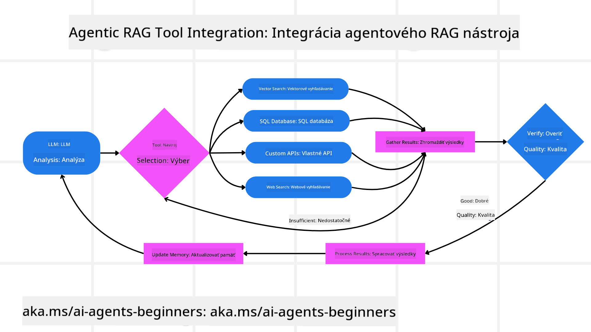
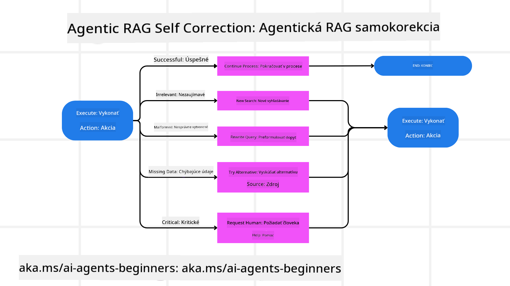

<!--
CO_OP_TRANSLATOR_METADATA:
{
  "original_hash": "7622aa72f9e676e593339f5f694ecd7d",
  "translation_date": "2025-07-12T10:11:41+00:00",
  "source_file": "05-agentic-rag/README.md",
  "language_code": "sk"
}
-->

> _(Kliknite na obrázok vyššie pre zobrazenie videa tejto lekcie)_

# Agentic RAG

Táto lekcia poskytuje komplexný prehľad o Agentic Retrieval-Augmented Generation (Agentic RAG), novom paradigme v oblasti AI, kde veľké jazykové modely (LLM) samostatne plánujú svoje ďalšie kroky a zároveň získavajú informácie z externých zdrojov. Na rozdiel od statických vzorov „vyhľadávanie a potom čítanie“ Agentic RAG zahŕňa iteratívne volania LLM, ktoré sú prerušované volaniami nástrojov alebo funkcií a štruktúrovanými výstupmi. Systém vyhodnocuje výsledky, upravuje dopyty, v prípade potreby vyvoláva ďalšie nástroje a tento cyklus opakuje, kým nedosiahne uspokojivé riešenie.

## Úvod

V tejto lekcii sa naučíte

- **Pochopiť Agentic RAG:** Zoznámite sa s novým paradigmatom v AI, kde veľké jazykové modely (LLM) samostatne plánujú svoje ďalšie kroky a získavajú informácie z externých dátových zdrojov.
- **Pochopiť iteratívny štýl Maker-Checker:** Porozumiete cyklu iteratívnych volaní LLM, prerušovaných volaniami nástrojov alebo funkcií a štruktúrovanými výstupmi, ktoré zlepšujú správnosť a zvládajú nesprávne dopyty.
- **Preskúmať praktické použitia:** Identifikujete situácie, kde Agentic RAG vyniká, napríklad v prostrediach kladúcich dôraz na správnosť, pri zložitých databázových interakciách a rozšírených pracovných postupoch.

## Ciele učenia

Po absolvovaní tejto lekcie budete vedieť/pochopíte:

- **Pochopenie Agentic RAG:** Naučíte sa o novom paradigmate v AI, kde veľké jazykové modely (LLM) samostatne plánujú svoje ďalšie kroky a získavajú informácie z externých dátových zdrojov.
- **Iteratívny štýl Maker-Checker:** Pochopíte koncept cyklu iteratívnych volaní LLM, prerušovaných volaniami nástrojov alebo funkcií a štruktúrovanými výstupmi, ktoré zlepšujú správnosť a zvládajú nesprávne dopyty.
- **Vlastnenie procesu uvažovania:** Porozumiete schopnosti systému vlastniť svoj proces uvažovania, rozhodovať o prístupe k riešeniu problémov bez spoliehania sa na vopred definované cesty.
- **Pracovný tok:** Pochopíte, ako agentný model samostatne rozhoduje o získavaní správ o trendoch na trhu, identifikácii údajov o konkurencii, korelácii interných predajných metrík, syntéze zistení a hodnotení stratégie.
- **Iteratívne slučky, integrácia nástrojov a pamäť:** Naučíte sa o spôsobe, akým systém využíva opakujúci sa vzorec interakcie, udržiava stav a pamäť medzi krokmi, aby sa vyhol opakovaniu a robil informované rozhodnutia.
- **Riešenie chýb a samokorekcia:** Preskúmate robustné mechanizmy samokorekcie systému, vrátane iterácií a opätovných dopytov, používania diagnostických nástrojov a zálohovania na ľudský dohľad.
- **Hranice agentnosti:** Pochopíte obmedzenia Agentic RAG, zamerané na autonómiu v rámci domény, závislosť na infraštruktúre a rešpektovanie bezpečnostných opatrení.
- **Praktické prípady použitia a hodnota:** Identifikujete situácie, kde Agentic RAG vyniká, napríklad v prostrediach kladúcich dôraz na správnosť, pri zložitých databázových interakciách a rozšírených pracovných postupoch.
- **Správa, transparentnosť a dôvera:** Naučíte sa o dôležitosti správy a transparentnosti, vrátane vysvetliteľného uvažovania, kontroly zaujatosti a ľudského dohľadu.

## Čo je Agentic RAG?

Agentic Retrieval-Augmented Generation (Agentic RAG) je nový paradigmat v AI, kde veľké jazykové modely (LLM) samostatne plánujú svoje ďalšie kroky a zároveň získavajú informácie z externých zdrojov. Na rozdiel od statických vzorov „vyhľadávanie a potom čítanie“ Agentic RAG zahŕňa iteratívne volania LLM, prerušované volaniami nástrojov alebo funkcií a štruktúrovanými výstupmi. Systém vyhodnocuje výsledky, upravuje dopyty, v prípade potreby vyvoláva ďalšie nástroje a tento cyklus opakuje, kým nedosiahne uspokojivé riešenie. Tento iteratívny „maker-checker“ štýl zlepšuje správnosť, zvláda nesprávne dopyty a zabezpečuje vysokú kvalitu výsledkov.

Systém aktívne vlastní svoj proces uvažovania, prepíše neúspešné dopyty, vyberá rôzne metódy vyhľadávania a integruje viacero nástrojov – ako napríklad vektorové vyhľadávanie v Azure AI Search, SQL databázy alebo vlastné API – predtým, než finalizuje svoju odpoveď. Rozlišujúcou vlastnosťou agentného systému je jeho schopnosť vlastniť svoj proces uvažovania. Tradičné implementácie RAG sa spoliehajú na vopred definované cesty, no agentný systém autonómne určuje postupnosť krokov na základe kvality nájdených informácií.

## Definovanie Agentic Retrieval-Augmented Generation (Agentic RAG)

Agentic Retrieval-Augmented Generation (Agentic RAG) je nový paradigmat vo vývoji AI, kde LLM nielen získavajú informácie z externých dátových zdrojov, ale aj samostatne plánujú svoje ďalšie kroky. Na rozdiel od statických vzorov „vyhľadávanie a potom čítanie“ alebo starostlivo napísaných sekvencií promptov, Agentic RAG zahŕňa cyklus iteratívnych volaní LLM, prerušovaných volaniami nástrojov alebo funkcií a štruktúrovanými výstupmi. Pri každom kroku systém vyhodnocuje získané výsledky, rozhoduje, či má upraviť dopyty, v prípade potreby vyvoláva ďalšie nástroje a pokračuje v tomto cykle, kým nedosiahne uspokojivé riešenie.

Tento iteratívny „maker-checker“ štýl fungovania je navrhnutý na zlepšenie správnosti, zvládanie nesprávnych dopytov do štruktúrovaných databáz (napr. NL2SQL) a zabezpečenie vyvážených, kvalitných výsledkov. Namiesto spoliehania sa výlučne na starostlivo navrhnuté reťazce promptov systém aktívne vlastní svoj proces uvažovania. Môže prepísať neúspešné dopyty, vybrať iné metódy vyhľadávania a integrovať viacero nástrojov – ako napríklad vektorové vyhľadávanie v Azure AI Search, SQL databázy alebo vlastné API – predtým, než finalizuje odpoveď. Tým sa odstraňuje potreba zložitejších orchestrácií. Namiesto toho relatívne jednoduchý cyklus „volanie LLM → použitie nástroja → volanie LLM → …“ môže priniesť sofistikované a dobre podložené výstupy.

## Vlastnenie procesu uvažovania

Rozlišujúcou vlastnosťou, ktorá robí systém „agentným“, je jeho schopnosť vlastniť svoj proces uvažovania. Tradičné implementácie RAG často závisia od ľudí, ktorí vopred definujú cestu pre model: reťazec myšlienok, ktorý určuje, čo a kedy vyhľadávať.  
Keď je však systém skutočne agentný, rozhoduje sa interne, ako pristúpiť k problému. Nevykonáva len skript, ale autonómne určuje postupnosť krokov na základe kvality nájdených informácií.  
Napríklad, ak je požiadaný vytvoriť stratégiu uvedenia produktu na trh, nespolieha sa len na prompt, ktorý popisuje celý výskumný a rozhodovací proces. Namiesto toho agentný model samostatne rozhodne:

1. Získať aktuálne správy o trendoch na trhu pomocou Bing Web Grounding  
2. Identifikovať relevantné údaje o konkurencii pomocou Azure AI Search  
3. Korelovať historické interné predajné metriky pomocou Azure SQL Database  
4. Syntetizovať zistenia do ucelenej stratégie orchestrujúcej cez Azure OpenAI Service  
5. Vyhodnotiť stratégiu na medzery alebo nezrovnalosti a v prípade potreby spustiť ďalšie vyhľadávanie  

Všetky tieto kroky – úprava dopytov, výber zdrojov, iterovanie až do „uspokojivého“ výsledku – sú rozhodnutia modelu, nie vopred napísaný skript človekom.

## Iteratívne slučky, integrácia nástrojov a pamäť

Agentný systém sa spolieha na vzorec opakovaných interakcií:

- **Počiatočné volanie:** Cieľ používateľa (t.j. prompt) je predložený LLM.  
- **Volanie nástroja:** Ak model identifikuje chýbajúce informácie alebo nejasné inštrukcie, vyberie nástroj alebo metódu vyhľadávania – napríklad dotaz do vektorovej databázy (napr. Azure AI Search Hybrid search nad súkromnými dátami) alebo štruktúrovaný SQL dotaz – aby získal viac kontextu.  
- **Hodnotenie a úprava:** Po preskúmaní vrátených dát model rozhodne, či sú informácie dostatočné. Ak nie, upraví dopyt, vyskúša iný nástroj alebo zmení prístup.  
- **Opakovanie, kým nie je spokojný:** Tento cyklus pokračuje, kým model nerozhodne, že má dostatočnú jasnosť a dôkazy na poskytnutie finálnej, dobre odôvodnenej odpovede.  
- **Pamäť a stav:** Pretože systém udržiava stav a pamäť medzi krokmi, dokáže si zapamätať predchádzajúce pokusy a ich výsledky, čím sa vyhýba opakovaniu a robí informovanejšie rozhodnutia počas postupu.

Postupom času to vytvára pocit vyvíjajúceho sa porozumenia, čo umožňuje modelu zvládať zložité, viacstupňové úlohy bez potreby neustáleho zásahu človeka alebo preformulovania promptu.

## Riešenie chýb a samokorekcia

Autonómia Agentic RAG zahŕňa aj robustné mechanizmy samokorekcie. Keď systém narazí na slepé uličky – napríklad získa nerelevantné dokumenty alebo narazí na nesprávne dopyty – môže:

- **Iterovať a opätovne dopytovať:** Namiesto vrátenia málo hodnotných odpovedí model skúša nové vyhľadávacie stratégie, prepíše databázové dopyty alebo preskúma alternatívne dátové sady.  
- **Použiť diagnostické nástroje:** Systém môže vyvolať ďalšie funkcie navrhnuté na pomoc s ladením krokov uvažovania alebo overením správnosti získaných dát. Nástroje ako Azure AI Tracing budú dôležité pre zabezpečenie robustnej pozorovateľnosti a monitoringu.  
- **Záloha na ľudský dohľad:** Pri vysoko rizikových alebo opakovane zlyhávajúcich scenároch môže model označiť neistotu a požiadať o ľudské usmernenie. Po poskytnutí korektívnej spätnej väzby od človeka môže model túto lekciu zapracovať do ďalšieho fungovania.

Tento iteratívny a dynamický prístup umožňuje modelu neustále sa zlepšovať, čím sa nestáva len jednorazovým systémom, ale takým, ktorý sa učí zo svojich chýb počas jednej relácie.

## Hranice agentnosti

Napriek svojej autonómii v rámci úlohy nie je Agentic RAG ekvivalentom všeobecnej umelej inteligencie. Jeho „agentné“ schopnosti sú obmedzené na nástroje, dátové zdroje a pravidlá poskytnuté ľudskými vývojármi. Nemôže si vymýšľať vlastné nástroje ani prekročiť hranice domény, ktoré boli nastavené. Namiesto toho vyniká v dynamickej orchestrácii dostupných zdrojov.  
Kľúčové rozdiely oproti pokročilejším formám AI zahŕňajú:

1. **Autonómia špecifická pre doménu:** Agentic RAG systémy sa zameriavajú na dosahovanie používateľom definovaných cieľov v známej doméne, využívajúc stratégie ako prepísanie dopytov alebo výber nástrojov na zlepšenie výsledkov.  
2. **Závislosť na infraštruktúre:** Schopnosti systému závisia od nástrojov a dát integrovaných vývojármi. Bez ľudského zásahu nemôže prekročiť tieto hranice.  
3. **Rešpektovanie bezpečnostných opatrení:** Etické smernice, pravidlá súladu a obchodné politiky zostávajú veľmi dôležité. Sloboda agenta je vždy obmedzená bezpečnostnými opatreniami a dohľadovými mechanizmami (dúfajme).

## Praktické prípady použitia a hodnota

Agentic RAG vyniká v situáciách vyžadujúcich iteratívne dolaďovanie a presnosť:

1. **Prostredia kladúce dôraz na správnosť:** Pri kontrolách súladu, regulačných analýzach alebo právnom výskume môže agentný model opakovane overovať fakty, konzultovať viaceré zdroje a prepísať dopyty, kým nevytvorí dôkladne overenú odpoveď.  
2. **Zložité databázové interakcie:** Pri práci so štruktúrovanými dátami, kde dopyty často zlyhávajú alebo vyžadujú úpravy, môže systém autonómne dolaďovať dopyty pomocou Azure SQL alebo Microsoft Fabric OneLake, čím zabezpečí, že konečné vyhľadávanie zodpovedá zámeru používateľa.  
3. **Rozšírené pracovné postupy:** Dlhšie relácie sa môžu vyvíjať s pribúdajúcimi informáciami. Agentic RAG môže neustále začleňovať nové dáta a meniť stratégie podľa toho, ako sa dozvedá viac o probléme.

## Správa, transparentnosť a dôvera

Ako sa tieto systémy stávajú autonómnejšími vo svojom uvažovaní, správa a transparentnosť sú kľúčové:

- **Vysvetliteľné uvažovanie:** Model môže poskytnúť auditovateľnú stopu dopytov, ktoré vykonal, zdrojov, ktoré konzultoval, a krokov uvažovania, ktoré podnikol na dosiahnutie záveru. Nástroje ako Azure AI Content Safety a Azure AI Tracing / GenAIOps pomáhajú udržiavať transparentnosť a zmierňovať riziká.  
- **Kontrola zaujatosti a vyvážené vyhľadávanie:** Vývojári môžu dolaďovať vyhľadávacie stratégie tak, aby sa zohľadnili vyvážené a reprezentatívne dátové zdroje, a pravidelne auditovať výstupy na odhalenie zaujatosti alebo skreslených vzorcov pomocou vlastných modelov pre pokročilé dátové vedecké organizácie využívajúce Azure Machine Learning.  
- **Ľudský dohľad a súlad:** Pri citlivých úlohách zostáva ľudský prehľad nevyhnutný. Agentic RAG nenahrádza ľudský úsudok pri rozhodnutiach s vysokou záťažou – dopĺňa ho tým, že poskytuje dôkladnejšie overené možnosti.

Mať ná

- <a href="https://learn.microsoft.com/azure/ai-studio/concepts/evaluation-approach-gen-ai" target="_blank">Hodnotenie aplikácií generatívnej AI s Azure AI Foundry: Tento článok sa zaoberá hodnotením a porovnaním modelov na verejne dostupných dátových súboroch, vrátane Agentic AI aplikácií a RAG architektúr</a>
- <a href="https://weaviate.io/blog/what-is-agentic-rag" target="_blank">Čo je Agentic RAG | Weaviate</a>
- <a href="https://ragaboutit.com/agentic-rag-a-complete-guide-to-agent-based-retrieval-augmented-generation/" target="_blank">Agentic RAG: Kompletný sprievodca agentovo založenou generáciou s rozšíreným vyhľadávaním – Novinky z generácie RAG</a>
- <a href="https://huggingface.co/learn/cookbook/agent_rag" target="_blank">Agentic RAG: zrýchlite svoj RAG pomocou reformulácie dopytov a samodopytovania! Hugging Face Open-Source AI Cookbook</a>
- <a href="https://youtu.be/aQ4yQXeB1Ss?si=2HUqBzHoeB5tR04U" target="_blank">Pridanie agentových vrstiev do RAG</a>
- <a href="https://www.youtube.com/watch?v=zeAyuLc_f3Q&t=244s" target="_blank">Budúcnosť znalostných asistentov: Jerry Liu</a>
- <a href="https://www.youtube.com/watch?v=AOSjiXP1jmQ" target="_blank">Ako vytvoriť Agentic RAG systémy</a>
- <a href="https://ignite.microsoft.com/sessions/BRK102?source=sessions" target="_blank">Použitie Azure AI Foundry Agent Service na škálovanie vašich AI agentov</a>

### Akademické články

- <a href="https://arxiv.org/abs/2303.17651" target="_blank">2303.17651 Self-Refine: Iteratívne zdokonaľovanie so spätnou väzbou od seba samého</a>
- <a href="https://arxiv.org/abs/2303.11366" target="_blank">2303.11366 Reflexion: Jazykoví agenti s verbálnym posilňovacím učením</a>
- <a href="https://arxiv.org/abs/2305.11738" target="_blank">2305.11738 CRITIC: Veľké jazykové modely sa môžu samokorigovať pomocou nástrojovo interaktívnej kritiky</a>
- <a href="https://arxiv.org/abs/2501.09136" target="_blank">2501.09136 Agentic Retrieval-Augmented Generation: Prehľad Agentic RAG</a>

## Predchádzajúca lekcia

[Tool Use Design Pattern](../04-tool-use/README.md)

## Nasledujúca lekcia

[Building Trustworthy AI Agents](../06-building-trustworthy-agents/README.md)

**Vyhlásenie o zodpovednosti**:  
Tento dokument bol preložený pomocou AI prekladateľskej služby [Co-op Translator](https://github.com/Azure/co-op-translator). Hoci sa snažíme o presnosť, prosím, majte na pamäti, že automatizované preklady môžu obsahovať chyby alebo nepresnosti. Originálny dokument v jeho pôvodnom jazyku by mal byť považovaný za autoritatívny zdroj. Pre kritické informácie sa odporúča profesionálny ľudský preklad. Nie sme zodpovední za akékoľvek nedorozumenia alebo nesprávne interpretácie vyplývajúce z použitia tohto prekladu.