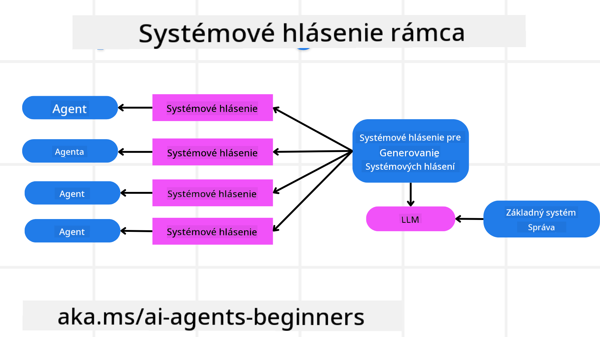
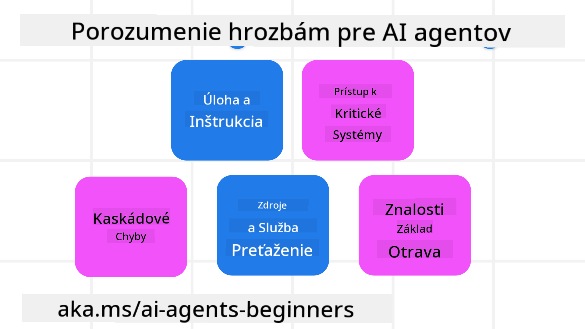
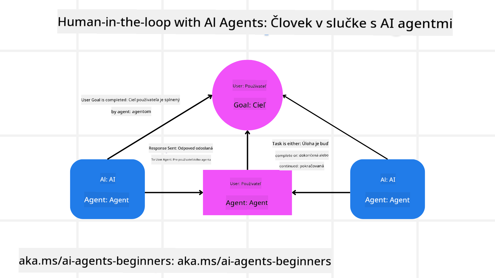

<!--
CO_OP_TRANSLATOR_METADATA:
{
  "original_hash": "f57852cac3a86c4a5ef47f793cc12178",
  "translation_date": "2025-07-12T10:31:53+00:00",
  "source_file": "06-building-trustworthy-agents/README.md",
  "language_code": "sk"
}
-->
[](https://youtu.be/iZKkMEGBCUQ?si=Q-kEbcyHUMPoHp8L)

> _(Kliknite na obrázok vyššie pre zobrazenie videa tejto lekcie)_

# Budovanie dôveryhodných AI agentov

## Úvod

V tejto lekcii sa dozviete:

- Ako vytvoriť a nasadiť bezpečných a efektívnych AI agentov
- Dôležité bezpečnostné aspekty pri vývoji AI agentov
- Ako zabezpečiť ochranu údajov a súkromia používateľov pri vývoji AI agentov

## Ciele učenia

Po absolvovaní tejto lekcie budete vedieť:

- Identifikovať a zmierniť riziká pri tvorbe AI agentov
- Implementovať bezpečnostné opatrenia na správu údajov a prístupov
- Vytvárať AI agentov, ktorí zachovávajú ochranu údajov a poskytujú kvalitný používateľský zážitok

## Bezpečnosť

Najskôr sa pozrime na budovanie bezpečných agentných aplikácií. Bezpečnosť znamená, že AI agent funguje podľa navrhnutých špecifikácií. Ako tvorcovia agentných aplikácií máme k dispozícii metódy a nástroje na maximalizáciu bezpečnosti:

### Vytvorenie rámca systémových správ

Ak ste už niekedy vytvárali AI aplikáciu pomocou veľkých jazykových modelov (LLM), viete, aké dôležité je navrhnúť robustný systémový prompt alebo systémovú správu. Tieto prompty stanovujú meta pravidlá, inštrukcie a usmernenia, ako bude LLM komunikovať s používateľom a údajmi.

Pre AI agentov je systémový prompt ešte dôležitejší, pretože AI agenti potrebujú veľmi špecifické inštrukcie na splnenie úloh, ktoré sme pre nich navrhli.

Na vytvorenie škálovateľných systémových promptov môžeme použiť rámec systémových správ na tvorbu jedného alebo viacerých agentov v našej aplikácii:



#### Krok 1: Vytvorte meta systémovú správu

Meta prompt bude použitý LLM na generovanie systémových promptov pre agentov, ktorých vytvoríme. Navrhujeme ho ako šablónu, aby sme mohli efektívne vytvárať viacerých agentov podľa potreby.

Tu je príklad meta systémovej správy, ktorú by sme poskytli LLM:

```plaintext
You are an expert at creating AI agent assistants. 
You will be provided a company name, role, responsibilities and other
information that you will use to provide a system prompt for.
To create the system prompt, be descriptive as possible and provide a structure that a system using an LLM can better understand the role and responsibilities of the AI assistant. 
```

#### Krok 2: Vytvorte základný prompt

Ďalším krokom je vytvoriť základný prompt, ktorý popisuje AI agenta. Mali by ste zahrnúť rolu agenta, úlohy, ktoré agent vykoná, a ďalšie zodpovednosti agenta.

Tu je príklad:

```plaintext
You are a travel agent for Contoso Travel that is great at booking flights for customers. To help customers you can perform the following tasks: lookup available flights, book flights, ask for preferences in seating and times for flights, cancel any previously booked flights and alert customers on any delays or cancellations of flights.  
```

#### Krok 3: Poskytnite základnú systémovú správu LLM

Teraz môžeme optimalizovať túto systémovú správu tým, že poskytneme meta systémovú správu ako systémovú správu a našu základnú systémovú správu.

Tým vznikne systémová správa lepšie navrhnutá na usmerňovanie našich AI agentov:

```markdown
**Company Name:** Contoso Travel  
**Role:** Travel Agent Assistant

**Objective:**  
You are an AI-powered travel agent assistant for Contoso Travel, specializing in booking flights and providing exceptional customer service. Your main goal is to assist customers in finding, booking, and managing their flights, all while ensuring that their preferences and needs are met efficiently.

**Key Responsibilities:**

1. **Flight Lookup:**
    
    - Assist customers in searching for available flights based on their specified destination, dates, and any other relevant preferences.
    - Provide a list of options, including flight times, airlines, layovers, and pricing.
2. **Flight Booking:**
    
    - Facilitate the booking of flights for customers, ensuring that all details are correctly entered into the system.
    - Confirm bookings and provide customers with their itinerary, including confirmation numbers and any other pertinent information.
3. **Customer Preference Inquiry:**
    
    - Actively ask customers for their preferences regarding seating (e.g., aisle, window, extra legroom) and preferred times for flights (e.g., morning, afternoon, evening).
    - Record these preferences for future reference and tailor suggestions accordingly.
4. **Flight Cancellation:**
    
    - Assist customers in canceling previously booked flights if needed, following company policies and procedures.
    - Notify customers of any necessary refunds or additional steps that may be required for cancellations.
5. **Flight Monitoring:**
    
    - Monitor the status of booked flights and alert customers in real-time about any delays, cancellations, or changes to their flight schedule.
    - Provide updates through preferred communication channels (e.g., email, SMS) as needed.

**Tone and Style:**

- Maintain a friendly, professional, and approachable demeanor in all interactions with customers.
- Ensure that all communication is clear, informative, and tailored to the customer's specific needs and inquiries.

**User Interaction Instructions:**

- Respond to customer queries promptly and accurately.
- Use a conversational style while ensuring professionalism.
- Prioritize customer satisfaction by being attentive, empathetic, and proactive in all assistance provided.

**Additional Notes:**

- Stay updated on any changes to airline policies, travel restrictions, and other relevant information that could impact flight bookings and customer experience.
- Use clear and concise language to explain options and processes, avoiding jargon where possible for better customer understanding.

This AI assistant is designed to streamline the flight booking process for customers of Contoso Travel, ensuring that all their travel needs are met efficiently and effectively.

```

#### Krok 4: Iterujte a zlepšujte

Hodnota tohto rámca systémových správ spočíva v možnosti ľahšie škálovať tvorbu systémových správ pre viacerých agentov a zároveň zlepšovať vaše systémové správy v priebehu času. Je zriedkavé, že systémová správa bude fungovať dokonale hneď na prvý pokus pre celý váš prípad použitia. Možnosť robiť malé úpravy a zlepšenia zmenou základnej systémovej správy a jej opätovným spracovaním vám umožní porovnávať a vyhodnocovať výsledky.

## Pochopenie hrozieb

Na vytvorenie dôveryhodných AI agentov je dôležité pochopiť a zmierniť riziká a hrozby, ktorým môžu agenti čeliť. Pozrime sa na niektoré z rôznych hrozieb pre AI agentov a ako sa na ne lepšie pripraviť.



### Úloha a inštrukcie

**Popis:** Útočníci sa snažia zmeniť inštrukcie alebo ciele AI agenta pomocou promptov alebo manipuláciou vstupov.

**Zmiernenie:** Vykonávajte validačné kontroly a filtre vstupov na detekciu potenciálne nebezpečných promptov pred ich spracovaním AI agentom. Keďže tieto útoky zvyčajne vyžadujú častú interakciu s agentom, obmedzenie počtu výmen v konverzácii je ďalším spôsobom, ako predísť týmto útokom.

### Prístup ku kritickým systémom

**Popis:** Ak má AI agent prístup k systémom a službám, ktoré uchovávajú citlivé údaje, útočníci môžu kompromitovať komunikáciu medzi agentom a týmito službami. Môžu ísť o priame útoky alebo nepriame pokusy získať informácie o týchto systémoch cez agenta.

**Zmiernenie:** AI agenti by mali mať prístup k systémom len na základe potreby, aby sa predišlo týmto útokom. Komunikácia medzi agentom a systémom by mala byť zabezpečená. Implementácia autentifikácie a kontroly prístupu je ďalším spôsobom ochrany týchto informácií.

### Preťaženie zdrojov a služieb

**Popis:** AI agenti môžu pristupovať k rôznym nástrojom a službám na vykonávanie úloh. Útočníci môžu využiť túto schopnosť na útok na tieto služby zasielaním veľkého množstva požiadaviek cez AI agenta, čo môže viesť k zlyhaniu systému alebo vysokým nákladom.

**Zmiernenie:** Zavedenie politík na obmedzenie počtu požiadaviek, ktoré môže AI agent poslať službe. Obmedzenie počtu výmen v konverzácii a požiadaviek na AI agenta je ďalším spôsobom, ako predísť týmto útokom.

### Otrava znalostnej databázy

**Popis:** Tento typ útoku cieli nie priamo na AI agenta, ale na znalostnú databázu a iné služby, ktoré AI agent používa. Môže ísť o poškodenie údajov alebo informácií, ktoré AI agent využíva na splnenie úlohy, čo vedie k zaujatým alebo nežiadaným odpovediam používateľovi.

**Zmiernenie:** Pravidelne overujte údaje, ktoré AI agent používa vo svojich pracovných postupoch. Zabezpečte, aby prístup k týmto údajom bol bezpečný a menili ich iba dôveryhodné osoby, aby ste predišli tomuto typu útoku.

### Kaskádové chyby

**Popis:** AI agenti pristupujú k rôznym nástrojom a službám na vykonávanie úloh. Chyby spôsobené útočníkmi môžu viesť k zlyhaniu ďalších systémov, ku ktorým je AI agent pripojený, čím sa útok rozšíri a jeho riešenie sa stane náročnejším.

**Zmiernenie:** Jednou z metód, ako tomu predísť, je nechať AI agenta pracovať v obmedzenom prostredí, napríklad vykonávať úlohy v Docker kontejnery, aby sa zabránilo priamym útokom na systém. Vytvorenie záložných mechanizmov a logiky opakovaných pokusov pri chybových odpovediach systémov je ďalším spôsobom, ako predísť väčším zlyhaniam systému.

## Human-in-the-Loop

Ďalším efektívnym spôsobom, ako vytvoriť dôveryhodné systémy AI agentov, je použitie konceptu Human-in-the-loop. Tento prístup vytvára tok, kde môžu používatelia počas behu procesu poskytovať spätnú väzbu agentom. Používatelia v podstate pôsobia ako agenti v multi-agentnom systéme a môžu schvaľovať alebo ukončovať bežiaci proces.



Tu je ukážka kódu využívajúca AutoGen, ktorá demonštruje implementáciu tohto konceptu:

```python

# Create the agents.
model_client = OpenAIChatCompletionClient(model="gpt-4o-mini")
assistant = AssistantAgent("assistant", model_client=model_client)
user_proxy = UserProxyAgent("user_proxy", input_func=input)  # Use input() to get user input from console.

# Create the termination condition which will end the conversation when the user says "APPROVE".
termination = TextMentionTermination("APPROVE")

# Create the team.
team = RoundRobinGroupChat([assistant, user_proxy], termination_condition=termination)

# Run the conversation and stream to the console.
stream = team.run_stream(task="Write a 4-line poem about the ocean.")
# Use asyncio.run(...) when running in a script.
await Console(stream)

```

## Záver

Budovanie dôveryhodných AI agentov vyžaduje starostlivý návrh, robustné bezpečnostné opatrenia a neustálu iteráciu. Implementáciou štruktúrovaných meta promptov, pochopením potenciálnych hrozieb a aplikovaním stratégií zmiernenia môžu vývojári vytvárať AI agentov, ktorí sú bezpeční a efektívni. Navyše začlenenie prístupu human-in-the-loop zabezpečuje, že AI agenti zostanú v súlade s potrebami používateľov a zároveň minimalizujú riziká. Ako sa AI naďalej vyvíja, udržiavanie proaktívneho prístupu k bezpečnosti, ochrane súkromia a etickým otázkam bude kľúčové pre budovanie dôvery a spoľahlivosti v systémoch riadených AI.

## Ďalšie zdroje

- <a href="https://learn.microsoft.com/azure/ai-studio/responsible-use-of-ai-overview" target="_blank">Prehľad zodpovedného používania AI</a>
- <a href="https://learn.microsoft.com/azure/ai-studio/concepts/evaluation-approach-gen-ai" target="_blank">Hodnotenie generatívnych AI modelov a AI aplikácií</a>
- <a href="https://learn.microsoft.com/azure/ai-services/openai/concepts/system-message?context=%2Fazure%2Fai-studio%2Fcontext%2Fcontext&tabs=top-techniques" target="_blank">Bezpečnostné systémové správy</a>
- <a href="https://blogs.microsoft.com/wp-content/uploads/prod/sites/5/2022/06/Microsoft-RAI-Impact-Assessment-Template.pdf?culture=en-us&country=us" target="_blank">Šablóna hodnotenia rizík</a>

## Predchádzajúca lekcia

[Agentic RAG](../05-agentic-rag/README.md)

## Nasledujúca lekcia

[Plánovací dizajnový vzor](../07-planning-design/README.md)

**Vyhlásenie o zodpovednosti**:  
Tento dokument bol preložený pomocou AI prekladateľskej služby [Co-op Translator](https://github.com/Azure/co-op-translator). Hoci sa snažíme o presnosť, prosím, majte na pamäti, že automatizované preklady môžu obsahovať chyby alebo nepresnosti. Originálny dokument v jeho pôvodnom jazyku by mal byť považovaný za autoritatívny zdroj. Pre kritické informácie sa odporúča profesionálny ľudský preklad. Nie sme zodpovední za akékoľvek nedorozumenia alebo nesprávne interpretácie vyplývajúce z použitia tohto prekladu.