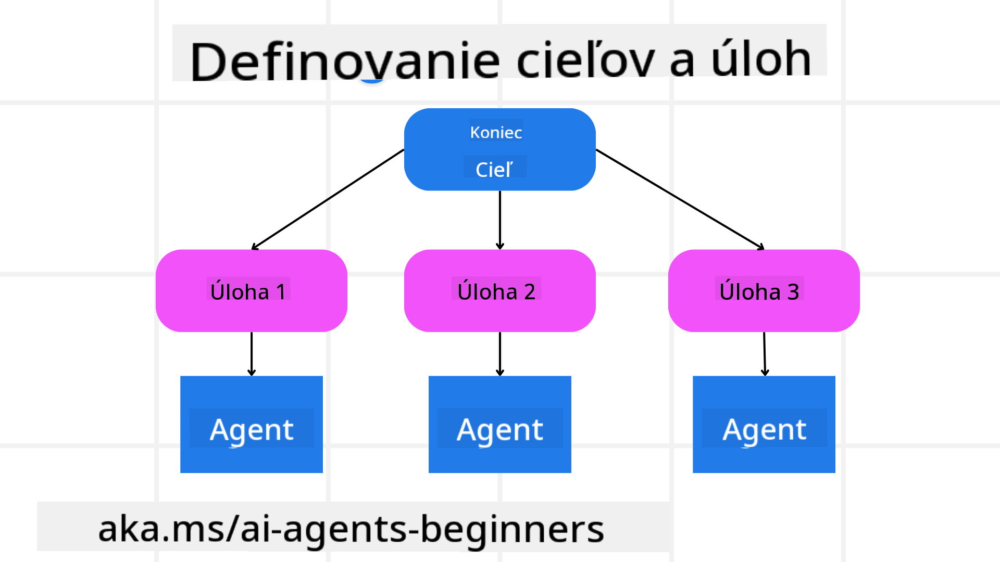

<!--
CO_OP_TRANSLATOR_METADATA:
{
  "original_hash": "a28d30590704ea13b6a08d4793cf9c2b",
  "translation_date": "2025-08-29T20:43:04+00:00",
  "source_file": "07-planning-design/README.md",
  "language_code": "sk"
}
-->
[](https://youtu.be/kPfJ2BrBCMY?si=9pYpPXp0sSbK91Dr)

> _(Kliknite na obrázok vyššie pre zobrazenie videa k tejto lekcii)_

# Plánovanie návrhu

## Úvod

Táto lekcia pokrýva:

* Definovanie jasného celkového cieľa a rozdelenie zložitej úlohy na zvládnuteľné časti.
* Využitie štruktúrovaného výstupu pre spoľahlivejšie a strojovo čitateľné odpovede.
* Použitie prístupu založeného na udalostiach na riešenie dynamických úloh a neočakávaných vstupov.

## Ciele učenia

Po absolvovaní tejto lekcie budete rozumieť:

* Ako identifikovať a nastaviť celkový cieľ pre AI agenta, aby jasne vedel, čo má dosiahnuť.
* Ako rozložiť zložitú úlohu na zvládnuteľné podúlohy a usporiadať ich do logickej postupnosti.
* Ako vybaviť agentov správnymi nástrojmi (napr. vyhľadávacími alebo analytickými nástrojmi), rozhodnúť, kedy a ako ich použiť, a zvládnuť neočakávané situácie.
* Ako vyhodnotiť výsledky podúloh, merať výkon a iterovať akcie na zlepšenie konečného výstupu.

## Definovanie celkového cieľa a rozdelenie úlohy



Väčšina úloh v reálnom svete je príliš zložitá na to, aby sa dala vyriešiť jedným krokom. AI agent potrebuje stručný cieľ, ktorý bude riadiť jeho plánovanie a akcie. Napríklad cieľ:

    "Vytvoriť 3-dňový cestovný itinerár."

Aj keď je jednoduché ho formulovať, stále potrebuje spresnenie. Čím jasnejší je cieľ, tým lepšie sa agent (a akíkoľvek ľudskí spolupracovníci) môžu sústrediť na dosiahnutie správneho výsledku, ako je vytvorenie komplexného itinerára s možnosťami letov, odporúčaniami hotelov a návrhmi aktivít.

### Rozklad úlohy

Veľké alebo zložité úlohy sa stávajú zvládnuteľnejšími, keď sa rozdelia na menšie, cielené podúlohy. 
Pre príklad cestovného itinerára by ste mohli cieľ rozdeliť na:

* Rezervácia letu
* Rezervácia hotela
* Prenájom auta
* Personalizácia

Každú podúlohu potom môžu riešiť špecializovaní agenti alebo procesy. Jeden agent sa môže špecializovať na vyhľadávanie najlepších ponúk letov, iný sa zameriava na rezervácie hotelov a podobne. Koordinujúci alebo „downstream“ agent potom môže tieto výsledky skombinovať do jedného súdržného itinerára pre koncového používateľa.

Tento modulárny prístup tiež umožňuje postupné vylepšenia. Napríklad môžete pridať špecializovaných agentov na odporúčania jedál alebo návrhy miestnych aktivít a itinerár časom zdokonaľovať.

### Štruktúrovaný výstup

Veľké jazykové modely (LLM) môžu generovať štruktúrovaný výstup (napr. JSON), ktorý je jednoduchšie analyzovať a spracovať pre downstream agentov alebo služby. To je obzvlášť užitočné v kontexte viacerých agentov, kde môžeme tieto úlohy vykonať po prijatí výstupu z plánovania. Pre rýchly prehľad si pozrite:

Nasledujúci Python kód ukazuje jednoduchého plánovacieho agenta, ktorý rozkladá cieľ na podúlohy a generuje štruktúrovaný plán:

```python
from pydantic import BaseModel
from enum import Enum
from typing import List, Optional, Union
import json
import os
from typing import Optional
from pprint import pprint
from autogen_core.models import UserMessage, SystemMessage, AssistantMessage
from autogen_ext.models.azure import AzureAIChatCompletionClient
from azure.core.credentials import AzureKeyCredential

class AgentEnum(str, Enum):
    FlightBooking = "flight_booking"
    HotelBooking = "hotel_booking"
    CarRental = "car_rental"
    ActivitiesBooking = "activities_booking"
    DestinationInfo = "destination_info"
    DefaultAgent = "default_agent"
    GroupChatManager = "group_chat_manager"

# Travel SubTask Model
class TravelSubTask(BaseModel):
    task_details: str
    assigned_agent: AgentEnum  # we want to assign the task to the agent

class TravelPlan(BaseModel):
    main_task: str
    subtasks: List[TravelSubTask]
    is_greeting: bool

client = AzureAIChatCompletionClient(
    model="gpt-4o-mini",
    endpoint="https://models.inference.ai.azure.com",
    # To authenticate with the model you will need to generate a personal access token (PAT) in your GitHub settings.
    # Create your PAT token by following instructions here: https://docs.github.com/en/authentication/keeping-your-account-and-data-secure/managing-your-personal-access-tokens
    credential=AzureKeyCredential(os.environ["GITHUB_TOKEN"]),
    model_info={
        "json_output": False,
        "function_calling": True,
        "vision": True,
        "family": "unknown",
    },
)

# Define the user message
messages = [
    SystemMessage(content="""You are an planner agent.
    Your job is to decide which agents to run based on the user's request.
                      Provide your response in JSON format with the following structure:
{'main_task': 'Plan a family trip from Singapore to Melbourne.',
 'subtasks': [{'assigned_agent': 'flight_booking',
               'task_details': 'Book round-trip flights from Singapore to '
                               'Melbourne.'}
    Below are the available agents specialised in different tasks:
    - FlightBooking: For booking flights and providing flight information
    - HotelBooking: For booking hotels and providing hotel information
    - CarRental: For booking cars and providing car rental information
    - ActivitiesBooking: For booking activities and providing activity information
    - DestinationInfo: For providing information about destinations
    - DefaultAgent: For handling general requests""", source="system"),
    UserMessage(
        content="Create a travel plan for a family of 2 kids from Singapore to Melboune", source="user"),
]

response = await client.create(messages=messages, extra_create_args={"response_format": 'json_object'})

response_content: Optional[str] = response.content if isinstance(
    response.content, str) else None
if response_content is None:
    raise ValueError("Response content is not a valid JSON string" )

pprint(json.loads(response_content))

# # Ensure the response content is a valid JSON string before loading it
# response_content: Optional[str] = response.content if isinstance(
#     response.content, str) else None
# if response_content is None:
#     raise ValueError("Response content is not a valid JSON string")

# # Print the response content after loading it as JSON
# pprint(json.loads(response_content))

# Validate the response content with the MathReasoning model
# TravelPlan.model_validate(json.loads(response_content))
```

### Plánovací agent s orchestráciou viacerých agentov

V tomto príklade Semantic Router Agent prijíma požiadavku používateľa (napr. "Potrebujem plán hotela pre svoju cestu.").

Plánovač potom:

* Prijíma plán hotela: Plánovač vezme správu používateľa a na základe systémového promptu (vrátane podrobností o dostupných agentoch) generuje štruktúrovaný cestovný plán.
* Zoznam agentov a ich nástrojov: Register agentov obsahuje zoznam agentov (napr. pre lety, hotely, prenájom áut a aktivity) spolu s funkciami alebo nástrojmi, ktoré ponúkajú.
* Presmeruje plán na príslušných agentov: V závislosti od počtu podúloh plánovač buď pošle správu priamo špecializovanému agentovi (pre scenáre s jednou úlohou), alebo koordinuje cez správcu skupinového chatu pre spoluprácu viacerých agentov.
* Zhrnie výsledok: Nakoniec plánovač zhrnie vygenerovaný plán pre prehľadnosť.

Nasledujúci Python kód ukazuje tieto kroky:

```python

from pydantic import BaseModel

from enum import Enum
from typing import List, Optional, Union

class AgentEnum(str, Enum):
    FlightBooking = "flight_booking"
    HotelBooking = "hotel_booking"
    CarRental = "car_rental"
    ActivitiesBooking = "activities_booking"
    DestinationInfo = "destination_info"
    DefaultAgent = "default_agent"
    GroupChatManager = "group_chat_manager"

# Travel SubTask Model

class TravelSubTask(BaseModel):
    task_details: str
    assigned_agent: AgentEnum # we want to assign the task to the agent

class TravelPlan(BaseModel):
    main_task: str
    subtasks: List[TravelSubTask]
    is_greeting: bool
import json
import os
from typing import Optional

from autogen_core.models import UserMessage, SystemMessage, AssistantMessage
from autogen_ext.models.openai import AzureOpenAIChatCompletionClient

# Create the client with type-checked environment variables

client = AzureOpenAIChatCompletionClient(
    azure_deployment=os.getenv("AZURE_OPENAI_DEPLOYMENT_NAME"),
    model=os.getenv("AZURE_OPENAI_DEPLOYMENT_NAME"),
    api_version=os.getenv("AZURE_OPENAI_API_VERSION"),
    azure_endpoint=os.getenv("AZURE_OPENAI_ENDPOINT"),
    api_key=os.getenv("AZURE_OPENAI_API_KEY"),
)

from pprint import pprint

# Define the user message

messages = [
    SystemMessage(content="""You are an planner agent.
    Your job is to decide which agents to run based on the user's request.
    Below are the available agents specialized in different tasks:
    - FlightBooking: For booking flights and providing flight information
    - HotelBooking: For booking hotels and providing hotel information
    - CarRental: For booking cars and providing car rental information
    - ActivitiesBooking: For booking activities and providing activity information
    - DestinationInfo: For providing information about destinations
    - DefaultAgent: For handling general requests""", source="system"),
    UserMessage(content="Create a travel plan for a family of 2 kids from Singapore to Melbourne", source="user"),
]

response = await client.create(messages=messages, extra_create_args={"response_format": TravelPlan})

# Ensure the response content is a valid JSON string before loading it

response_content: Optional[str] = response.content if isinstance(response.content, str) else None
if response_content is None:
    raise ValueError("Response content is not a valid JSON string")

# Print the response content after loading it as JSON

pprint(json.loads(response_content))
```

Nasleduje výstup z predchádzajúceho kódu, ktorý môžete použiť na presmerovanie na `assigned_agent` a zhrnutie cestovného plánu pre koncového používateľa.

```json
{
    "is_greeting": "False",
    "main_task": "Plan a family trip from Singapore to Melbourne.",
    "subtasks": [
        {
            "assigned_agent": "flight_booking",
            "task_details": "Book round-trip flights from Singapore to Melbourne."
        },
        {
            "assigned_agent": "hotel_booking",
            "task_details": "Find family-friendly hotels in Melbourne."
        },
        {
            "assigned_agent": "car_rental",
            "task_details": "Arrange a car rental suitable for a family of four in Melbourne."
        },
        {
            "assigned_agent": "activities_booking",
            "task_details": "List family-friendly activities in Melbourne."
        },
        {
            "assigned_agent": "destination_info",
            "task_details": "Provide information about Melbourne as a travel destination."
        }
    ]
}
```

Príklad notebooku s predchádzajúcim kódom je dostupný [tu](07-autogen.ipynb).

### Iteratívne plánovanie

Niektoré úlohy vyžadujú spätnú väzbu alebo preplánovanie, kde výsledok jednej podúlohy ovplyvňuje ďalšiu. Napríklad, ak agent objaví neočakávaný formát dát pri rezervácii letov, môže byť potrebné prispôsobiť stratégiu pred pokračovaním na rezerváciu hotela.

Okrem toho spätná väzba od používateľa (napr. ak sa človek rozhodne pre skorší let) môže spustiť čiastočné preplánovanie. Tento dynamický, iteratívny prístup zaisťuje, že konečné riešenie zodpovedá reálnym obmedzeniam a meniacim sa preferenciám používateľa.

Príklad kódu:

```python
from autogen_core.models import UserMessage, SystemMessage, AssistantMessage
#.. same as previous code and pass on the user history, current plan
messages = [
    SystemMessage(content="""You are a planner agent to optimize the
    Your job is to decide which agents to run based on the user's request.
    Below are the available agents specialized in different tasks:
    - FlightBooking: For booking flights and providing flight information
    - HotelBooking: For booking hotels and providing hotel information
    - CarRental: For booking cars and providing car rental information
    - ActivitiesBooking: For booking activities and providing activity information
    - DestinationInfo: For providing information about destinations
    - DefaultAgent: For handling general requests""", source="system"),
    UserMessage(content="Create a travel plan for a family of 2 kids from Singapore to Melbourne", source="user"),
    AssistantMessage(content=f"Previous travel plan - {TravelPlan}", source="assistant")
]
# .. re-plan and send the tasks to respective agents
```

Pre komplexnejšie plánovanie si pozrite Magnetic One na riešenie zložitých úloh.

## Zhrnutie

V tomto článku sme sa pozreli na príklad, ako môžeme vytvoriť plánovač, ktorý dokáže dynamicky vybrať dostupných agentov. Výstup plánovača rozkladá úlohy a priraďuje agentov, aby ich mohli vykonať. Predpokladá sa, že agenti majú prístup k funkciám/nástrojom potrebným na vykonanie úlohy. Okrem agentov môžete zahrnúť aj iné vzory, ako je reflexia, sumarizácia a round robin chat, na ďalšie prispôsobenie.

## Dodatočné zdroje

* AutoGen Magnetic One - Generalistický multi-agentový systém na riešenie zložitých úloh, ktorý dosiahol pôsobivé výsledky na viacerých náročných benchmarkoch agentov. Referencia:

V tejto implementácii orchestrátor vytvára plán špecifický pre úlohu a deleguje tieto úlohy dostupným agentom. Okrem plánovania orchestrátor využíva aj mechanizmus sledovania na monitorovanie pokroku úlohy a preplánovanie podľa potreby.

### Máte ďalšie otázky o návrhovom vzore plánovania?

Pripojte sa k [Azure AI Foundry Discord](https://aka.ms/ai-agents/discord), kde sa môžete stretnúť s ďalšími študentmi, zúčastniť sa konzultačných hodín a získať odpovede na svoje otázky o AI agentoch.

## Predchádzajúca lekcia

[Budovanie dôveryhodných AI agentov](../06-building-trustworthy-agents/README.md)

## Nasledujúca lekcia

[Viacagentový návrhový vzor](../08-multi-agent/README.md)

---

**Upozornenie**:  
Tento dokument bol preložený pomocou služby AI prekladu [Co-op Translator](https://github.com/Azure/co-op-translator). Hoci sa snažíme o presnosť, prosím, berte na vedomie, že automatizované preklady môžu obsahovať chyby alebo nepresnosti. Pôvodný dokument v jeho rodnom jazyku by mal byť považovaný za autoritatívny zdroj. Pre kritické informácie sa odporúča profesionálny ľudský preklad. Nie sme zodpovední za žiadne nedorozumenia alebo nesprávne interpretácie vyplývajúce z použitia tohto prekladu.