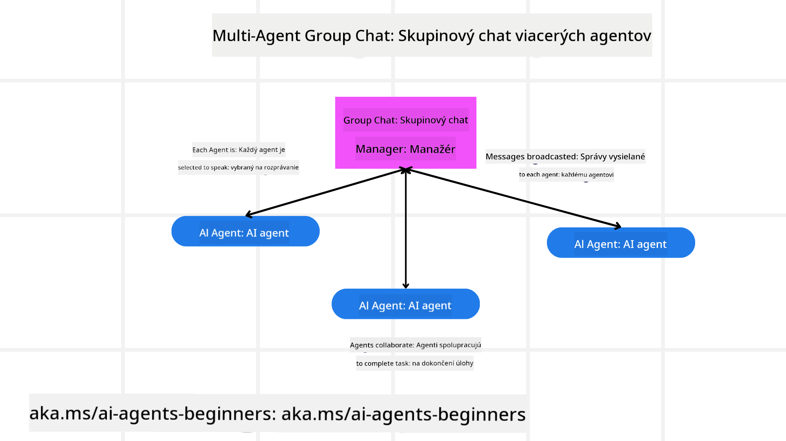
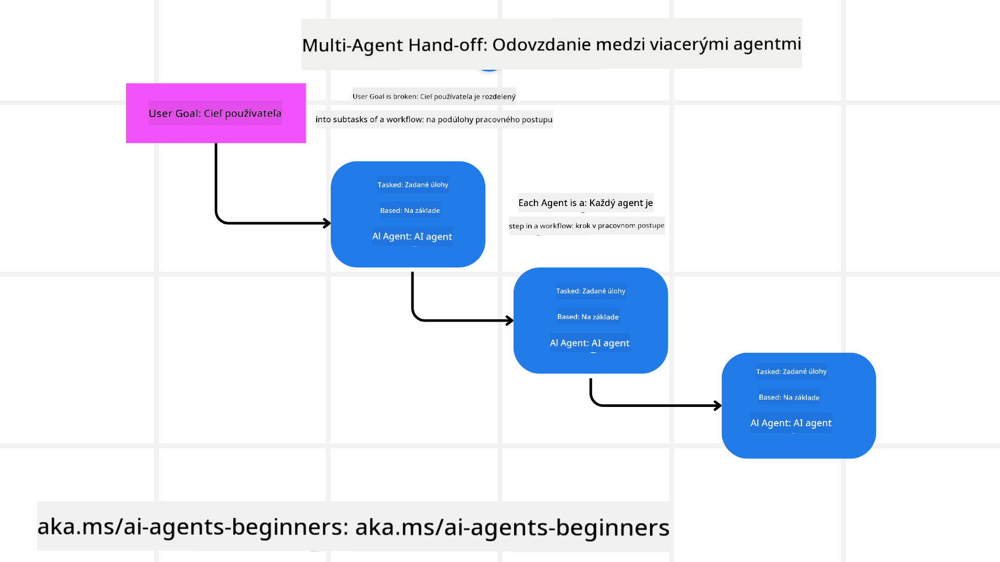
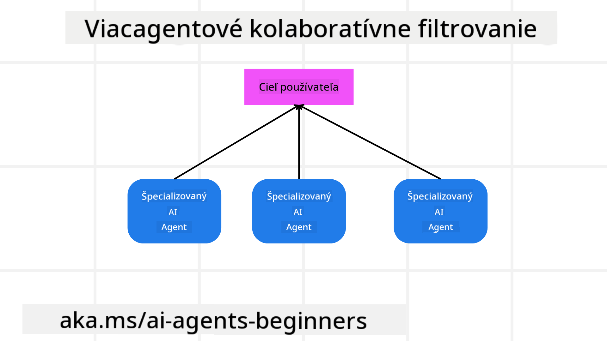

<!--
CO_OP_TRANSLATOR_METADATA:
{
  "original_hash": "c692a8975d7d5b99575a553de1c5e8a7",
  "translation_date": "2025-07-12T11:25:16+00:00",
  "source_file": "08-multi-agent/README.md",
  "language_code": "sk"
}
-->

> _(Kliknite na obrázok vyššie pre zobrazenie videa tejto lekcie)_

# Multi-agent dizajnové vzory

Hneď ako začnete pracovať na projekte, ktorý zahŕňa viacerých agentov, budete musieť zvážiť multi-agent dizajnový vzor. Môže však byť na prvý pohľad nejasné, kedy prejsť na multi-agentov a aké sú výhody.

## Úvod

V tejto lekcii sa pokúsime odpovedať na nasledujúce otázky:

- V akých situáciách je použitie multi-agentov vhodné?
- Aké sú výhody použitia multi-agentov oproti jednému agentovi, ktorý vykonáva viacero úloh?
- Aké sú základné stavebné kamene implementácie multi-agent dizajnového vzoru?
- Ako môžeme získať prehľad o tom, ako viacerí agenti navzájom interagujú?

## Ciele učenia

Po tejto lekcii by ste mali byť schopní:

- Identifikovať situácie, kde je použitie multi-agentov vhodné
- Rozpoznať výhody použitia multi-agentov oproti jednému agentovi
- Pochopiť základné stavebné kamene implementácie multi-agent dizajnového vzoru

Aký je širší kontext?

*Multi-agent je dizajnový vzor, ktorý umožňuje viacerým agentom spolupracovať na dosiahnutí spoločného cieľa*.

Tento vzor sa široko využíva v rôznych oblastiach, vrátane robotiky, autonómnych systémov a distribuovaného výpočtu.

## Situácie, kde je použitie multi-agentov vhodné

Kedy je teda použitie multi-agentov dobrým riešením? Odpoveď je, že existuje mnoho situácií, kde je výhodné nasadiť viacerých agentov, najmä v týchto prípadoch:

- **Veľké pracovné zaťaženie**: Veľké úlohy je možné rozdeliť na menšie časti a priradiť ich rôznym agentom, čo umožňuje paralelné spracovanie a rýchlejšie dokončenie. Príkladom je spracovanie veľkého množstva dát.
- **Zložité úlohy**: Zložité úlohy, podobne ako veľké pracovné zaťaženie, môžu byť rozdelené na menšie podúlohy a priradené rôznym agentom, z ktorých každý sa špecializuje na určitý aspekt úlohy. Dobrým príkladom sú autonómne vozidlá, kde rôzni agenti riadia navigáciu, detekciu prekážok a komunikáciu s inými vozidlami.
- **Rôznorodé odborné znalosti**: Rôzni agenti môžu mať rôzne odborné znalosti, čo im umožňuje efektívnejšie riešiť rôzne aspekty úlohy než jeden agent. Príkladom je zdravotná starostlivosť, kde agenti môžu spravovať diagnostiku, liečebné plány a monitorovanie pacientov.

## Výhody použitia multi-agentov oproti jednému agentovi

Jednoagentový systém môže fungovať dobre pri jednoduchých úlohách, ale pri zložitejších úlohách prináša použitie viacerých agentov niekoľko výhod:

- **Špecializácia**: Každý agent môže byť špecializovaný na konkrétnu úlohu. Nedostatok špecializácie u jedného agenta znamená, že agent môže robiť všetko, ale môže sa stratiť pri riešení zložitej úlohy. Môže napríklad skončiť pri vykonávaní úlohy, na ktorú nie je najvhodnejší.
- **Škálovateľnosť**: Je jednoduchšie škálovať systém pridaním ďalších agentov než preťažovaním jedného agenta.
- **Odolnosť voči chybám**: Ak jeden agent zlyhá, ostatní môžu pokračovať v činnosti, čím sa zabezpečuje spoľahlivosť systému.

Pozrime sa na príklad – rezervácia cesty pre používateľa. Jednoagentový systém by musel zvládnuť všetky aspekty rezervácie, od hľadania letov až po rezerváciu hotelov a prenájom áut. Aby to zvládol, musel by mať nástroje na všetky tieto úlohy, čo by mohlo viesť k zložitému a monolitickému systému, ktorý je ťažko udržiavateľný a škálovateľný. Multi-agentový systém by naopak mohol mať rôznych agentov špecializovaných na hľadanie letov, rezerváciu hotelov a prenájom áut. To by systém spravilo modulárnejším, ľahšie udržiavateľným a škálovateľným.

Porovnajte to s cestovnou kanceláriou prevádzkovanou ako malý rodinný podnik oproti franšíze. Rodinný podnik by mal jedného agenta, ktorý rieši všetky aspekty rezervácie, zatiaľ čo franšíza by mala rôznych agentov pre rôzne časti procesu.

## Základné stavebné kamene implementácie multi-agent dizajnového vzoru

Predtým, než môžete implementovať multi-agent dizajnový vzor, musíte pochopiť jeho základné stavebné kamene.

Opäť si vezmime príklad rezervácie cesty pre používateľa. V tomto prípade by základné stavebné kamene zahŕňali:

- **Komunikácia agentov**: Agenti pre hľadanie letov, rezerváciu hotelov a prenájom áut musia komunikovať a zdieľať informácie o preferenciách a obmedzeniach používateľa. Musíte rozhodnúť o protokoloch a metódach tejto komunikácie. Konkrétne to znamená, že agent pre hľadanie letov musí komunikovať s agentom pre rezerváciu hotelov, aby zabezpečil, že hotel je rezervovaný na rovnaké dátumy ako let. To znamená, že agenti musia zdieľať informácie o dátumoch cesty používateľa, teda musíte rozhodnúť *ktorí agenti si informácie zdieľajú a ako*.
- **Koordinačné mechanizmy**: Agenti musia koordinovať svoje činnosti, aby boli splnené preferencie a obmedzenia používateľa. Napríklad používateľ môže preferovať hotel blízko letiska, zatiaľ čo obmedzenie môže byť, že prenájom áut je možný len na letisku. To znamená, že agent pre rezerváciu hotelov musí koordinovať s agentom pre prenájom áut, aby sa zabezpečilo splnenie preferencií a obmedzení používateľa. Musíte teda rozhodnúť *ako agenti koordinujú svoje činnosti*.
- **Architektúra agenta**: Agenti musia mať vnútornú štruktúru na rozhodovanie a učenie sa z interakcií s používateľom. To znamená, že agent pre hľadanie letov musí mať vnútornú štruktúru na rozhodovanie o tom, ktoré lety odporučiť používateľovi. Musíte rozhodnúť *ako agenti robia rozhodnutia a učia sa z interakcií s používateľom*. Príkladom učenia môže byť, že agent pre hľadanie letov využíva model strojového učenia na odporúčanie letov na základe predchádzajúcich preferencií používateľa.
- **Prehľad o interakciách multi-agentov**: Musíte mať prehľad o tom, ako viacerí agenti navzájom interagujú. To znamená, že potrebujete nástroje a techniky na sledovanie aktivít a interakcií agentov. Môže to byť vo forme nástrojov na logovanie a monitorovanie, vizualizačných nástrojov a metrík výkonu.
- **Multi-agent vzory**: Existujú rôzne vzory pre implementáciu multi-agentových systémov, ako sú centralizované, decentralizované a hybridné architektúry. Musíte si vybrať vzor, ktorý najlepšie vyhovuje vášmu prípadu použitia.
- **Človek v slučke**: Vo väčšine prípadov bude v procese zapojený človek a musíte určiť, kedy majú agenti požiadať o ľudský zásah. Môže to byť napríklad vtedy, keď používateľ žiada o konkrétny hotel alebo let, ktorý agenti neodporučili, alebo keď je potrebné potvrdenie pred rezerváciou letu či hotela.

## Prehľad o interakciách multi-agentov

Je dôležité mať prehľad o tom, ako viacerí agenti navzájom interagujú. Tento prehľad je nevyhnutný pre ladenie, optimalizáciu a zabezpečenie efektívnosti celého systému. Na dosiahnutie tohto cieľa potrebujete nástroje a techniky na sledovanie aktivít a interakcií agentov. Môže to byť vo forme nástrojov na logovanie a monitorovanie, vizualizačných nástrojov a metrík výkonu.

Napríklad pri rezervácii cesty pre používateľa by ste mohli mať dashboard, ktorý zobrazuje stav každého agenta, preferencie a obmedzenia používateľa a interakcie medzi agentmi. Tento dashboard by mohol zobrazovať dátumy cesty používateľa, lety odporúčané agentom pre lety, hotely odporúčané agentom pre hotely a prenájom áut odporúčaný agentom pre prenájom áut. To by vám poskytlo jasný prehľad o tom, ako agenti spolupracujú a či sú splnené preferencie a obmedzenia používateľa.

Pozrime sa na tieto aspekty podrobnejšie.

- **Nástroje na logovanie a monitorovanie**: Chcete mať zaznamenané každé vykonané opatrenie agenta. Záznam v logu môže obsahovať informácie o agentovi, ktorý akciu vykonal, o samotnej akcii, čase vykonania a výsledku akcie. Tieto informácie potom môžete využiť na ladenie, optimalizáciu a ďalšie účely.
- **Vizualizačné nástroje**: Vizualizačné nástroje vám pomôžu lepšie vidieť interakcie medzi agentmi. Napríklad môžete mať graf, ktorý zobrazuje tok informácií medzi agentmi. To vám môže pomôcť identifikovať úzke miesta, neefektívnosti a ďalšie problémy v systéme.
- **Metriky výkonu**: Metriky výkonu vám pomôžu sledovať efektívnosť multi-agentového systému. Môžete sledovať napríklad čas potrebný na dokončenie úlohy, počet dokončených úloh za jednotku času alebo presnosť odporúčaní agentov. Tieto informácie vám pomôžu identifikovať oblasti na zlepšenie a optimalizovať systém.

## Multi-agent vzory

Pozrime sa na niektoré konkrétne vzory, ktoré môžeme použiť na vytvorenie multi-agent aplikácií. Tu je niekoľko zaujímavých vzorov, ktoré stojí za zváženie:

### Skupinový chat

Tento vzor je užitočný, keď chcete vytvoriť aplikáciu skupinového chatu, kde viacerí agenti môžu medzi sebou komunikovať. Typické použitia tohto vzoru zahŕňajú tímovú spoluprácu, zákaznícku podporu a sociálne siete.

V tomto vzore každý agent predstavuje používateľa v skupinovom chate a správy sa medzi agentmi vymieňajú pomocou komunikačného protokolu. Agenti môžu posielať správy do skupinového chatu, prijímať správy zo skupinového chatu a odpovedať na správy od iných agentov.

Tento vzor môže byť implementovaný pomocou centralizovanej architektúry, kde všetky správy prechádzajú cez centrálny server, alebo decentralizovanej architektúry, kde sa správy vymieňajú priamo medzi agentmi.

### Odovzdávanie úloh

Tento vzor je užitočný, keď chcete vytvoriť aplikáciu, kde viacerí agenti môžu odovzdávať úlohy medzi sebou.

Typické použitia tohto vzoru zahŕňajú zákaznícku podporu, riadenie úloh a automatizáciu pracovných tokov.

V tomto vzore každý agent predstavuje úlohu alebo krok v pracovnom toku a agenti môžu odovzdávať úlohy iným agentom na základe vopred definovaných pravidiel.

### Spolupracujúce filtrovanie

Tento vzor je užitočný, keď chcete vytvoriť aplikáciu, kde viacerí agenti môžu spolupracovať na odporúčaniach pre používateľov.

Dôvod, prečo chcete, aby agenti spolupracovali, je ten, že každý agent môže mať inú odbornosť a môže prispieť k odporúčaciemu procesu rôznymi spôsobmi.

Pozrime sa na príklad, kde používateľ chce odporúčanie na najlepšiu akciu na nákup na burze.

- **Odborník na odvetvie**: Jeden agent môže byť expertom na konkrétne odvetvie.
- **Technická analýza**: Ďalší agent môže byť expertom na technickú analýzu.
- **Fundamentálna analýza**: A ďalší agent môže byť expertom na fundamentálnu analýzu. Spoluprácou môžu títo agenti poskytnúť používateľovi komplexnejšie odporúčanie.

## Scenár: Proces vrátenia peňazí

Predstavte si situáciu, kde zákazník žiada o vrátenie peňazí za produkt. V tomto procese môže byť zapojených niekoľko agentov, ale rozdelíme ich na agentov špecifických pre tento proces a všeobecných agentov, ktorí môžu byť použiteľní aj v iných procesoch.

**Agenti špecifickí pre proces vrátenia peňazí**:

Nasledujúci zoznam obsahuje agentov, ktorí by mohli byť zapojení do procesu vrátenia peňazí:

- **Agent zákazníka**: Tento agent reprezentuje zákazníka a je zodpovedný za iniciovanie procesu vrátenia peňazí.
- **Agent predajcu**: Tento agent reprezentuje predajcu a je zodpovedný za spracovanie vrátenia peňazí.
- **Agent platby**: Tento agent reprezentuje platobný proces a je zodpovedný za vrátenie platby zákazníkovi.
- **Agent riešenia**: Tento agent reprezentuje proces riešenia a je zodpovedný za vyriešenie akýchkoľvek problémov, ktoré vzniknú počas procesu vrátenia peňazí.
- **Agent súladu**: Tento agent reprezentuje proces súladu a zabezpečuje, že proces vrátenia peňazí je v súlade s predpismi a politikami.

**Všeobecní agenti**:

Títo agenti môžu byť použiteľní aj v iných častiach vášho podnikania.

- **Agent dopravy**: Tento agent reprezentuje proces dopravy a je zodpovedný za zaslanie produktu späť predajcovi. Tento agent môže byť použitý nielen v procese vrátenia peňazí, ale aj pri bežnej doprave produktu pri nákupe.
- **Agent spätnej väzby**: Tento agent reprezentuje proces spätnej väzby a zodpovedá za zbieranie spätnej väzby od zákazníka. Spätná väzba môže byť získavaná kedykoľvek, nielen počas procesu vrátenia peňazí.
- **Agent eskalácie**: Tento agent reprezentuje proces eskalácie a je zodpovedný za eskaláciu problémov na vyššiu úroveň podpory. Tento typ agenta môžete použiť v akomkoľvek procese, kde je potrebné eskalovať problém.
- **Agent notifikácií**: Tento agent reprezentuje proces notifikácií a zodpovedá za zasielanie upozornení zákazníkovi v rôznych fázach procesu vrátenia peňazí.
- **Agent analytiky**: Tento agent reprezentuje analytický proces a zodpovedá za analýzu dát súvisiacich s procesom vrátenia peňazí.
- **Agent auditu**: Tento agent reprezentuje auditný proces a zodpovedá za kontrolu správnosti vykonávania procesu vrátenia peňazí.
- **Agent reportingu**: Tento agent reprezentuje proces reportovania a zodpovedá za generovanie správ o procese vrátenia peňazí.
- **Agent znalostí**: Tento agent reprezentuje proces správy znalostí a zodpovedá za udržiavanie databázy informácií súvisiacich s procesom vrátenia peňazí. Tento agent môže mať znalosti nielen o vrátení peňazí, ale aj o iných častiach vášho podnikania.
- **Agent bezpečnosti**: Tento agent reprezent
## Predchádzajúca lekcia

[Plánovanie dizajnu](../07-planning-design/README.md)

## Nasledujúca lekcia

[Metakognícia v AI agentoch](../09-metacognition/README.md)

**Vyhlásenie o zodpovednosti**:  
Tento dokument bol preložený pomocou AI prekladateľskej služby [Co-op Translator](https://github.com/Azure/co-op-translator). Hoci sa snažíme o presnosť, prosím, majte na pamäti, že automatizované preklady môžu obsahovať chyby alebo nepresnosti. Originálny dokument v jeho pôvodnom jazyku by mal byť považovaný za autoritatívny zdroj. Pre kritické informácie sa odporúča profesionálny ľudský preklad. Nie sme zodpovední za akékoľvek nedorozumenia alebo nesprávne interpretácie vyplývajúce z použitia tohto prekladu.