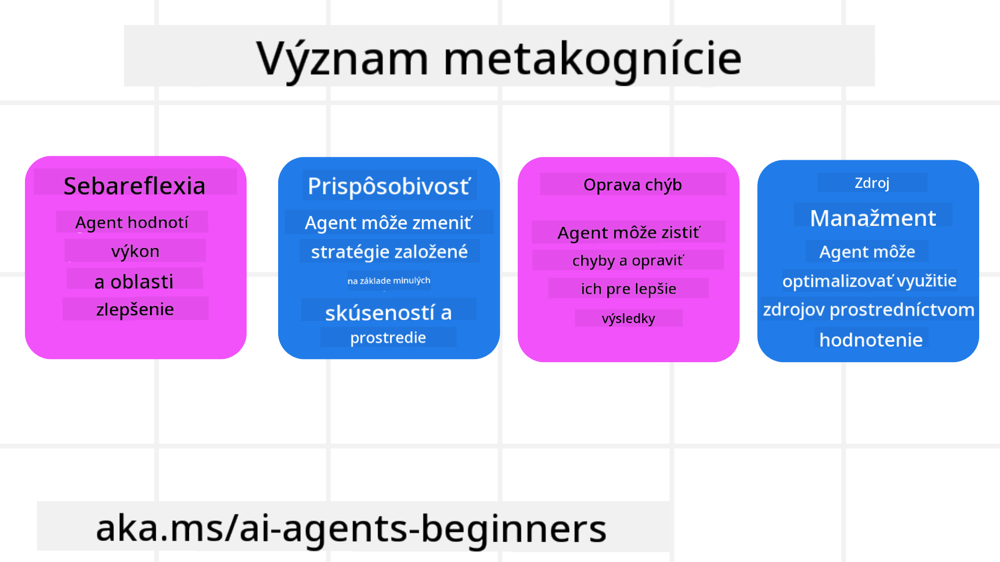
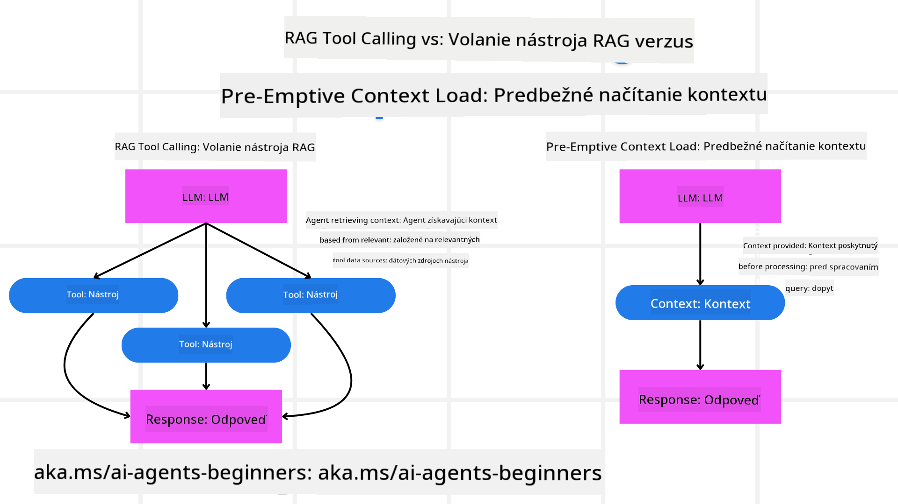

<!--
CO_OP_TRANSLATOR_METADATA:
{
  "original_hash": "8cbf460468c802c7994aa62e0e0779c9",
  "translation_date": "2025-07-12T13:14:22+00:00",
  "source_file": "09-metacognition/README.md",
  "language_code": "sk"
}
-->
[](https://youtu.be/His9R6gw6Ec?si=3_RMb8VprNvdLRhX)

> _(Kliknite na obrázok vyššie pre zobrazenie videa tejto lekcie)_
# Metakognícia v AI agentoch

## Úvod

Vitajte v lekcii o metakognícii v AI agentoch! Táto kapitola je určená pre začiatočníkov, ktorí sa zaujímajú o to, ako môžu AI agenti premýšľať o svojich vlastných procesoch myslenia. Na konci tejto lekcie pochopíte kľúčové koncepty a budete vybavení praktickými príkladmi, ako aplikovať metakogníciu v dizajne AI agentov.

## Ciele učenia

Po dokončení tejto lekcie budete schopní:

1. Pochopiť dôsledky slučiek uvažovania v definíciách agentov.
2. Použiť plánovacie a hodnotiace techniky na podporu samokorigujúcich sa agentov.
3. Vytvoriť vlastných agentov schopných manipulovať s kódom na splnenie úloh.

## Úvod do metakognície

Metakognícia označuje vyššie kognitívne procesy, ktoré zahŕňajú premýšľanie o vlastnom myslení. Pre AI agentov to znamená schopnosť hodnotiť a upravovať svoje činnosti na základe sebauvedomenia a minulých skúseností. Metakognícia, alebo „premýšľanie o myslení“, je dôležitý koncept vo vývoji agentických AI systémov. Zahŕňa, že AI systémy sú si vedomé svojich vnútorných procesov a dokážu monitorovať, regulovať a prispôsobovať svoje správanie. Podobne ako my, keď čítame situáciu alebo sa pozeráme na problém. Toto sebauvedomenie môže AI systémom pomôcť robiť lepšie rozhodnutia, identifikovať chyby a zlepšovať svoj výkon v priebehu času – čo opäť súvisí s Turingovým testom a debatou o tom, či AI prevezme kontrolu.

V kontexte agentických AI systémov môže metakognícia pomôcť riešiť niekoľko výziev, ako napríklad:
- Transparentnosť: Zabezpečiť, aby AI systémy vedeli vysvetliť svoje uvažovanie a rozhodnutia.
- Uvažovanie: Zlepšiť schopnosť AI systémov syntetizovať informácie a robiť rozumné rozhodnutia.
- Adaptácia: Umožniť AI systémom prispôsobiť sa novým prostrediam a meniacim sa podmienkam.
- Vnímanie: Zlepšiť presnosť AI systémov pri rozpoznávaní a interpretácii dát zo svojho okolia.

### Čo je metakognícia?

Metakognícia, alebo „premýšľanie o myslení“, je vyšší kognitívny proces, ktorý zahŕňa sebauvedomenie a sebareguláciu vlastných kognitívnych procesov. V oblasti AI metakognícia umožňuje agentom hodnotiť a prispôsobovať svoje stratégie a činnosti, čo vedie k lepšiemu riešeniu problémov a rozhodovacím schopnostiam. Pochopením metakognície môžete navrhnúť AI agentov, ktorí sú nielen inteligentnejší, ale aj prispôsobivejší a efektívnejší. V skutočnej metakognícii by ste videli, ako AI explicitne uvažuje o svojom vlastnom uvažovaní.

Príklad: „Uprednostnil som lacnejšie lety, pretože... Možno však prichádzam o priame lety, tak si to skontrolujem znova.“
Sledovanie, ako alebo prečo si vybral určitú trasu.
- Všimnutie si, že urobil chyby, pretože príliš dôveroval preferenciám používateľa z minulosti, a preto upravuje svoju stratégiu rozhodovania, nie len konečné odporúčanie.
- Diagnostikovanie vzorcov ako: „Kedykoľvek používateľ spomenie ‚príliš preplnené‘, nemal by som len vynechať určité atrakcie, ale aj zvážiť, že moja metóda výberu ‚top atrakcií‘ je chybná, ak vždy hodnotím podľa popularity.“

### Význam metakognície v AI agentoch

Metakognícia zohráva kľúčovú úlohu v dizajne AI agentov z niekoľkých dôvodov:



- Sebareflexia: Agenti môžu hodnotiť svoj vlastný výkon a identifikovať oblasti na zlepšenie.
- Prispôsobivosť: Agenti môžu meniť svoje stratégie na základe minulých skúseností a meniacich sa podmienok.
- Korekcia chýb: Agenti môžu samostatne odhaliť a opraviť chyby, čo vedie k presnejším výsledkom.
- Manažment zdrojov: Agenti môžu optimalizovať využitie zdrojov, ako je čas a výpočtový výkon, plánovaním a hodnotením svojich činností.

## Komponenty AI agenta

Predtým, než sa pustíme do metakognitívnych procesov, je dôležité pochopiť základné komponenty AI agenta. AI agent zvyčajne pozostáva z:

- Persona: Osobnosť a charakteristiky agenta, ktoré definujú, ako komunikuje s používateľmi.
- Nástroje: Schopnosti a funkcie, ktoré agent dokáže vykonávať.
- Zručnosti: Vedomosti a odborné znalosti, ktoré agent vlastní.

Tieto komponenty spolupracujú na vytvorení „jednotky odbornosti“, ktorá dokáže vykonávať konkrétne úlohy.

**Príklad**:
Predstavte si cestovného agenta, ktorý nielen plánuje vašu dovolenku, ale aj upravuje trasu na základe aktuálnych dát a skúseností z predchádzajúcich ciest zákazníkov.

### Príklad: Metakognícia v cestovnej agentúre

Predstavte si, že navrhujete cestovnú agentúru poháňanú AI. Tento agent, „Travel Agent“, pomáha používateľom plánovať dovolenky. Aby ste do nej zakomponovali metakogníciu, Travel Agent musí hodnotiť a upravovať svoje činnosti na základe sebauvedomenia a minulých skúseností. Takto môže metakognícia hrať úlohu:

#### Aktuálna úloha

Aktuálnou úlohou je pomôcť používateľovi naplánovať výlet do Paríža.

#### Kroky na dokončenie úlohy

1. **Získať preferencie používateľa**: Opýtať sa používateľa na dátumy cesty, rozpočet, záujmy (napr. múzeá, kuchyňa, nakupovanie) a špecifické požiadavky.
2. **Získať informácie**: Vyhľadať možnosti letov, ubytovania, atrakcií a reštaurácií, ktoré zodpovedajú preferenciám používateľa.
3. **Vytvoriť odporúčania**: Poskytnúť personalizovaný itinerár s detailmi o letoch, rezerváciách hotelov a navrhovaných aktivitách.
4. **Upraviť na základe spätnej väzby**: Požiadať používateľa o spätnú väzbu k odporúčaniam a vykonať potrebné úpravy.

#### Potrebné zdroje

- Prístup k databázam letov a hotelových rezervácií.
- Informácie o parížskych atrakciách a reštauráciách.
- Dáta spätnej väzby od používateľov z predchádzajúcich interakcií.

#### Skúsenosti a sebareflexia

Travel Agent využíva metakogníciu na hodnotenie svojho výkonu a učenie sa z minulých skúseností. Napríklad:

1. **Analýza spätnej väzby používateľa**: Travel Agent prehodnocuje spätnú väzbu, aby zistil, ktoré odporúčania boli prijaté pozitívne a ktoré nie. Podľa toho upravuje svoje budúce návrhy.
2. **Prispôsobivosť**: Ak používateľ predtým spomenul, že nemá rád preplnené miesta, Travel Agent sa v budúcnosti vyhne odporúčaniu populárnych turistických lokalít počas špičky.
3. **Korekcia chýb**: Ak Travel Agent urobil chybu v minulom rezervovaní, napríklad navrhol hotel, ktorý bol plne obsadený, naučí sa dôkladnejšie kontrolovať dostupnosť pred odporúčaním.

#### Praktický príklad pre vývojárov

Tu je zjednodušený príklad kódu Travel Agent, ktorý zahŕňa metakogníciu:

```python
class Travel_Agent:
    def __init__(self):
        self.user_preferences = {}
        self.experience_data = []

    def gather_preferences(self, preferences):
        self.user_preferences = preferences

    def retrieve_information(self):
        # Search for flights, hotels, and attractions based on preferences
        flights = search_flights(self.user_preferences)
        hotels = search_hotels(self.user_preferences)
        attractions = search_attractions(self.user_preferences)
        return flights, hotels, attractions

    def generate_recommendations(self):
        flights, hotels, attractions = self.retrieve_information()
        itinerary = create_itinerary(flights, hotels, attractions)
        return itinerary

    def adjust_based_on_feedback(self, feedback):
        self.experience_data.append(feedback)
        # Analyze feedback and adjust future recommendations
        self.user_preferences = adjust_preferences(self.user_preferences, feedback)

# Example usage
travel_agent = Travel_Agent()
preferences = {
    "destination": "Paris",
    "dates": "2025-04-01 to 2025-04-10",
    "budget": "moderate",
    "interests": ["museums", "cuisine"]
}
travel_agent.gather_preferences(preferences)
itinerary = travel_agent.generate_recommendations()
print("Suggested Itinerary:", itinerary)
feedback = {"liked": ["Louvre Museum"], "disliked": ["Eiffel Tower (too crowded)"]}
travel_agent.adjust_based_on_feedback(feedback)
```

#### Prečo je metakognícia dôležitá

- **Sebareflexia**: Agenti môžu analyzovať svoj výkon a identifikovať oblasti na zlepšenie.
- **Prispôsobivosť**: Agenti môžu meniť stratégie na základe spätnej väzby a meniacich sa podmienok.
- **Korekcia chýb**: Agenti môžu samostatne odhaliť a opraviť chyby.
- **Manažment zdrojov**: Agenti môžu optimalizovať využitie zdrojov, ako je čas a výpočtový výkon.

Zakomponovaním metakognície môže Travel Agent poskytovať personalizovanejšie a presnejšie cestovné odporúčania, čím zlepší celkový používateľský zážitok.

---

## 2. Plánovanie v agentoch

Plánovanie je kľúčovou súčasťou správania AI agenta. Zahŕňa načrtnutie krokov potrebných na dosiahnutie cieľa, pričom zohľadňuje aktuálny stav, zdroje a možné prekážky.

### Prvky plánovania

- **Aktuálna úloha**: Jasne definovať úlohu.
- **Kroky na dokončenie úlohy**: Rozložiť úlohu na zvládnuteľné kroky.
- **Potrebné zdroje**: Identifikovať potrebné zdroje.
- **Skúsenosti**: Využiť minulé skúsenosti na informovanie plánovania.

**Príklad**:
Tu sú kroky, ktoré musí Travel Agent vykonať, aby efektívne pomohol používateľovi s plánovaním cesty:

### Kroky pre Travel Agent

1. **Získať preferencie používateľa**
   - Opýtať sa používateľa na detaily o dátumoch cesty, rozpočte, záujmoch a špecifických požiadavkách.
   - Príklady: „Kedy plánujete cestovať?“ „Aký máte rozpočet?“ „Aké aktivity si užívate na dovolenke?“

2. **Získať informácie**
   - Vyhľadať relevantné možnosti na základe preferencií používateľa.
   - **Lety**: Nájsť dostupné lety v rámci rozpočtu a preferovaných dátumov.
   - **Ubytovanie**: Nájsť hotely alebo prenájmy, ktoré zodpovedajú preferenciám ohľadom lokality, ceny a vybavenia.
   - **Atrakcie a reštaurácie**: Identifikovať populárne atrakcie, aktivity a stravovacie možnosti, ktoré zodpovedajú záujmom používateľa.

3. **Vytvoriť odporúčania**
   - Zostaviť získané informácie do personalizovaného itinerára.
   - Poskytnúť detaily ako možnosti letov, rezervácie hotelov a navrhované aktivity, pričom odporúčania prispôsobiť preferenciám používateľa.

4. **Predložiť itinerár používateľovi**
   - Zdieľať navrhovaný itinerár na prehodnotenie.
   - Príklad: „Tu je navrhovaný itinerár pre vašu cestu do Paríža. Obsahuje detaily o letoch, rezervácie hotelov a zoznam odporúčaných aktivít a reštaurácií. Dajte mi vedieť, čo si o tom myslíte!“

5. **Získať spätnú väzbu**
   - Požiadať používateľa o spätnú väzbu k navrhovanému itineráru.
   - Príklady: „Páčia sa vám možnosti letov?“ „Je hotel vhodný pre vaše potreby?“ „Chceli by ste pridať alebo odstrániť nejaké aktivity?“

6. **Upraviť na základe spätnej väzby**
   - Upraviť itinerár podľa spätnej väzby používateľa.
   - Vykonať potrebné zmeny v odporúčaniach letov, ubytovania a aktivít, aby lepšie vyhovovali preferenciám používateľa.

7. **Konečné potvrdenie**
   - Predložiť aktualizovaný itinerár na konečné potvrdenie.
   - Príklad: „Urobil som úpravy podľa vašej spätnej väzby. Tu je aktualizovaný itinerár. Vyzerá to pre vás dobre?“

8. **Rezervovať a potvrdiť rezervácie**
   - Po schválení itinerára používateľom pokračovať v rezervácii letov, ubytovania a predplánovaných aktivít.
   - Poslať používateľovi potvrdenia.

9. **Poskytovať priebežnú podporu**
   - Byť k dispozícii na pomoc s akýmikoľvek zmenami alebo ďalšími požiadavkami pred a počas cesty.
   - Príklad: „Ak budete počas cesty potrebovať ďalšiu pomoc, neváhajte ma kedykoľvek kontaktovať!“

### Príklad interakcie

```python
class Travel_Agent:
    def __init__(self):
        self.user_preferences = {}
        self.experience_data = []

    def gather_preferences(self, preferences):
        self.user_preferences = preferences

    def retrieve_information(self):
        flights = search_flights(self.user_preferences)
        hotels = search_hotels(self.user_preferences)
        attractions = search_attractions(self.user_preferences)
        return flights, hotels, attractions

    def generate_recommendations(self):
        flights, hotels, attractions = self.retrieve_information()
        itinerary = create_itinerary(flights, hotels, attractions)
        return itinerary

    def adjust_based_on_feedback(self, feedback):
        self.experience_data.append(feedback)
        self.user_preferences = adjust_preferences(self.user_preferences, feedback)

# Example usage within a booing request
travel_agent = Travel_Agent()
preferences = {
    "destination": "Paris",
    "dates": "2025-04-01 to 2025-04-10",
    "budget": "moderate",
    "interests": ["museums", "cuisine"]
}
travel_agent.gather_preferences(preferences)
itinerary = travel_agent.generate_recommendations()
print("Suggested Itinerary:", itinerary)
feedback = {"liked": ["Louvre Museum"], "disliked": ["Eiffel Tower (too crowded)"]}
travel_agent.adjust_based_on_feedback(feedback)
```

## 3. Korektívny RAG systém

Najprv si vysvetlime rozdiel medzi RAG nástrojom a predbežným načítaním kontextu.



### Retrieval-Augmented Generation (RAG)

RAG kombinuje systém vyhľadávania s generatívnym modelom. Keď je položená otázka, vyhľadávací systém získava relevantné dokumenty alebo dáta z externého zdroja a tieto získané informácie sa používajú na doplnenie vstupu pre generatívny model. To pomáha modelu generovať presnejšie a kontextovo relevantné odpovede.

V RAG systéme agent vyhľadáva relevantné informácie v databáze znalostí a používa ich na generovanie vhodných odpovedí alebo akcií.

### Korektívny RAG prístup

Korektívny RAG prístup sa zameriava na využitie RAG techník na opravu chýb a zlepšenie presnosti AI agentov. Zahŕňa to:

1. **Techniku promptovania**: Použitie špecifických promptov na nasmerovanie agenta pri vyhľadávaní relevantných informácií.
2. **Nástroj**: Implementáciu algoritmov a mechanizmov, ktoré umožňujú agentovi hodnotiť relevantnosť získaných informácií a generovať presné odpovede.
3. **Hodnotenie**: Neustále hodnotenie výkonu agenta a vykonávanie úprav na zlepšenie presnosti a efektivity.

#### Príklad: Korektívny RAG v vyhľadávacom agentovi

Predstavte si vyhľadávacieho agenta, ktorý získava informácie z webu na odpovedanie na otázky používateľov. Korektívny RAG prístup môže zahŕňať:

1. **Techniku promptovania**: Formulovanie vyhľadávacích dopytov na základe vstupu používateľa.
2. **Nástroj**: Použitie spracovania prirodzeného jazyka a strojového učenia na zoradenie a filtrovanie výsledkov vyhľadávania.
3. **Hodnotenie**: Analýzu spätnej väzby používateľa na identifikáciu a opravu nepresností v získaných informáciách.

### Korektívny RAG v Travel Agent

Korektívny RAG (Retrieval-Augmented Generation) zlepšuje schopnosť AI získavať a generovať informácie a zároveň opravovať nepresnosti. Pozrime sa, ako môže Travel Agent využiť korektívny RAG prístup na poskytovanie presnejších a relevantnejších cestovných odporúčaní.

Toto zahŕňa:

- **Techniku promptovania:** Použitie špecifických promptov na nasmerovanie agenta pri vyhľadávaní relevantných informácií.
- **Nástroj:** Implementáciu algoritmov a mechanizmov, ktoré umožňujú agentovi hodnotiť relevantnosť získaných informácií a generovať presné odpovede.
- **Hodnotenie:** Neustále hodnotenie výkonu agenta a vykonávanie úprav na zlepšenie presnosti a efektivity.

#### Kroky implementácie korektívneho RAG v Travel Agent

1. **Počiatočná interakcia s používateľom**
   - Travel Agent zhromažďuje základné preferencie používateľa, ako sú cieľová destinácia, dátumy c
### Predbežné načítanie kontextu

Predbežné načítanie kontextu znamená, že sa do modelu načíta relevantný kontext alebo základné informácie ešte pred spracovaním dotazu. Model tak má tieto informácie k dispozícii od začiatku, čo mu pomáha generovať lepšie a informovanejšie odpovede bez potreby dodatočného získavania dát počas spracovania.

Tu je zjednodušený príklad, ako by mohlo vyzerať predbežné načítanie kontextu pre aplikáciu cestovnej kancelárie v Pythone:

```python
class TravelAgent:
    def __init__(self):
        # Pre-load popular destinations and their information
        self.context = {
            "Paris": {"country": "France", "currency": "Euro", "language": "French", "attractions": ["Eiffel Tower", "Louvre Museum"]},
            "Tokyo": {"country": "Japan", "currency": "Yen", "language": "Japanese", "attractions": ["Tokyo Tower", "Shibuya Crossing"]},
            "New York": {"country": "USA", "currency": "Dollar", "language": "English", "attractions": ["Statue of Liberty", "Times Square"]},
            "Sydney": {"country": "Australia", "currency": "Dollar", "language": "English", "attractions": ["Sydney Opera House", "Bondi Beach"]}
        }

    def get_destination_info(self, destination):
        # Fetch destination information from pre-loaded context
        info = self.context.get(destination)
        if info:
            return f"{destination}:\nCountry: {info['country']}\nCurrency: {info['currency']}\nLanguage: {info['language']}\nAttractions: {', '.join(info['attractions'])}"
        else:
            return f"Sorry, we don't have information on {destination}."

# Example usage
travel_agent = TravelAgent()
print(travel_agent.get_destination_info("Paris"))
print(travel_agent.get_destination_info("Tokyo"))
```

#### Vysvetlenie

1. **Inicializácia (`__init__` metóda)**: Trieda `TravelAgent` prednačíta slovník obsahujúci informácie o populárnych destináciách ako Paríž, Tokio, New York a Sydney. Tento slovník obsahuje detaily ako krajina, mena, jazyk a hlavné atrakcie každej destinácie.

2. **Získavanie informácií (`get_destination_info` metóda)**: Keď používateľ položí otázku o konkrétnej destinácii, metóda `get_destination_info` vyhľadá príslušné informácie v prednačítanom slovníku kontextu.

Vďaka prednačítaniu kontextu môže aplikácia cestovnej kancelárie rýchlo odpovedať na otázky používateľov bez potreby získavania informácií z externých zdrojov v reálnom čase. To zvyšuje efektivitu a rýchlosť aplikácie.

### Spustenie plánu s cieľom pred iteráciou

Spustenie plánu s cieľom znamená začať s jasne definovaným cieľom alebo požadovaným výsledkom. Definovaním cieľa na začiatku môže model použiť tento cieľ ako vodítko počas celého iteratívneho procesu. To zabezpečuje, že každá iterácia posúva plán bližšie k dosiahnutiu želaného výsledku, čím sa proces stáva efektívnejším a zameraným.

Tu je príklad, ako môžete spustiť cestovný plán s cieľom pred iteráciou pre cestovnú kanceláriu v Pythone:

### Scenár

Cestovná kancelária chce naplánovať prispôsobenú dovolenku pre klienta. Cieľom je vytvoriť cestovný itinerár, ktorý maximalizuje spokojnosť klienta na základe jeho preferencií a rozpočtu.

### Kroky

1. Definovať preferencie klienta a rozpočet.
2. Spustiť počiatočný plán na základe týchto preferencií.
3. Iterovať a vylepšovať plán s cieľom optimalizovať spokojnosť klienta.

#### Python kód

```python
class TravelAgent:
    def __init__(self, destinations):
        self.destinations = destinations

    def bootstrap_plan(self, preferences, budget):
        plan = []
        total_cost = 0

        for destination in self.destinations:
            if total_cost + destination['cost'] <= budget and self.match_preferences(destination, preferences):
                plan.append(destination)
                total_cost += destination['cost']

        return plan

    def match_preferences(self, destination, preferences):
        for key, value in preferences.items():
            if destination.get(key) != value:
                return False
        return True

    def iterate_plan(self, plan, preferences, budget):
        for i in range(len(plan)):
            for destination in self.destinations:
                if destination not in plan and self.match_preferences(destination, preferences) and self.calculate_cost(plan, destination) <= budget:
                    plan[i] = destination
                    break
        return plan

    def calculate_cost(self, plan, new_destination):
        return sum(destination['cost'] for destination in plan) + new_destination['cost']

# Example usage
destinations = [
    {"name": "Paris", "cost": 1000, "activity": "sightseeing"},
    {"name": "Tokyo", "cost": 1200, "activity": "shopping"},
    {"name": "New York", "cost": 900, "activity": "sightseeing"},
    {"name": "Sydney", "cost": 1100, "activity": "beach"},
]

preferences = {"activity": "sightseeing"}
budget = 2000

travel_agent = TravelAgent(destinations)
initial_plan = travel_agent.bootstrap_plan(preferences, budget)
print("Initial Plan:", initial_plan)

refined_plan = travel_agent.iterate_plan(initial_plan, preferences, budget)
print("Refined Plan:", refined_plan)
```

#### Vysvetlenie kódu

1. **Inicializácia (`__init__` metóda)**: Trieda `TravelAgent` je inicializovaná so zoznamom potenciálnych destinácií, z ktorých každá má atribúty ako názov, cena a typ aktivity.

2. **Spustenie plánu (`bootstrap_plan` metóda)**: Táto metóda vytvorí počiatočný cestovný plán na základe preferencií klienta a rozpočtu. Prechádza zoznam destinácií a pridáva ich do plánu, ak zodpovedajú preferenciám klienta a zmestia sa do rozpočtu.

3. **Zladenie preferencií (`match_preferences` metóda)**: Táto metóda kontroluje, či destinácia zodpovedá preferenciám klienta.

4. **Iterovanie plánu (`iterate_plan` metóda)**: Táto metóda vylepšuje počiatočný plán tým, že sa snaží nahradiť každú destináciu v pláne lepšou voľbou, berúc do úvahy preferencie klienta a rozpočtové obmedzenia.

5. **Výpočet nákladov (`calculate_cost` metóda)**: Táto metóda vypočíta celkové náklady aktuálneho plánu vrátane potenciálnej novej destinácie.

#### Príklad použitia

- **Počiatočný plán**: Cestovná kancelária vytvorí počiatočný plán na základe klientových preferencií pre turistiku a rozpočtu 2000 dolárov.
- **Vylepšený plán**: Cestovná kancelária iteruje plán, optimalizujúc ho podľa preferencií a rozpočtu klienta.

Spustením plánu s jasným cieľom (napr. maximalizácia spokojnosti klienta) a jeho iteratívnym vylepšovaním môže cestovná kancelária vytvoriť prispôsobený a optimalizovaný cestovný itinerár. Tento prístup zabezpečuje, že plán od začiatku zodpovedá preferenciám a rozpočtu klienta a s každou iteráciou sa zlepšuje.

### Využitie LLM na pretriedenie a hodnotenie

Veľké jazykové modely (LLM) môžu byť použité na pretriedenie a hodnotenie tým, že vyhodnocujú relevantnosť a kvalitu získaných dokumentov alebo generovaných odpovedí. Funguje to takto:

**Získavanie:** Počiatočný krok získava množinu kandidátskych dokumentov alebo odpovedí na základe dotazu.

**Pretriedenie:** LLM vyhodnotí týchto kandidátov a pretriedi ich podľa relevantnosti a kvality. Tento krok zabezpečuje, že najrelevantnejšie a najkvalitnejšie informácie sú zobrazené ako prvé.

**Hodnotenie:** LLM priradí skóre každému kandidátovi, ktoré odráža jeho relevantnosť a kvalitu. To pomáha vybrať najlepšiu odpoveď alebo dokument pre používateľa.

Vďaka využitiu LLM na pretriedenie a hodnotenie môže systém poskytovať presnejšie a kontextovo relevantnejšie informácie, čím sa zlepšuje celkový používateľský zážitok.

Tu je príklad, ako by cestovná kancelária mohla použiť veľký jazykový model (LLM) na pretriedenie a hodnotenie cestovných destinácií podľa preferencií používateľa v Pythone:

#### Scenár – Cestovanie podľa preferencií

Cestovná kancelária chce odporučiť najlepšie cestovné destinácie klientovi na základe jeho preferencií. LLM pomôže pretriediť a ohodnotiť destinácie tak, aby sa zobrazili najrelevantnejšie možnosti.

#### Kroky:

1. Získať preferencie používateľa.
2. Získať zoznam potenciálnych cestovných destinácií.
3. Použiť LLM na pretriedenie a hodnotenie destinácií podľa preferencií používateľa.

Tu je, ako môžete aktualizovať predchádzajúci príklad na použitie Azure OpenAI služieb:

#### Požiadavky

1. Musíte mať predplatné Azure.
2. Vytvorte Azure OpenAI zdroj a získajte svoj API kľúč.

#### Príklad Python kódu

```python
import requests
import json

class TravelAgent:
    def __init__(self, destinations):
        self.destinations = destinations

    def get_recommendations(self, preferences, api_key, endpoint):
        # Generate a prompt for the Azure OpenAI
        prompt = self.generate_prompt(preferences)
        
        # Define headers and payload for the request
        headers = {
            'Content-Type': 'application/json',
            'Authorization': f'Bearer {api_key}'
        }
        payload = {
            "prompt": prompt,
            "max_tokens": 150,
            "temperature": 0.7
        }
        
        # Call the Azure OpenAI API to get the re-ranked and scored destinations
        response = requests.post(endpoint, headers=headers, json=payload)
        response_data = response.json()
        
        # Extract and return the recommendations
        recommendations = response_data['choices'][0]['text'].strip().split('\n')
        return recommendations

    def generate_prompt(self, preferences):
        prompt = "Here are the travel destinations ranked and scored based on the following user preferences:\n"
        for key, value in preferences.items():
            prompt += f"{key}: {value}\n"
        prompt += "\nDestinations:\n"
        for destination in self.destinations:
            prompt += f"- {destination['name']}: {destination['description']}\n"
        return prompt

# Example usage
destinations = [
    {"name": "Paris", "description": "City of lights, known for its art, fashion, and culture."},
    {"name": "Tokyo", "description": "Vibrant city, famous for its modernity and traditional temples."},
    {"name": "New York", "description": "The city that never sleeps, with iconic landmarks and diverse culture."},
    {"name": "Sydney", "description": "Beautiful harbour city, known for its opera house and stunning beaches."},
]

preferences = {"activity": "sightseeing", "culture": "diverse"}
api_key = 'your_azure_openai_api_key'
endpoint = 'https://your-endpoint.com/openai/deployments/your-deployment-name/completions?api-version=2022-12-01'

travel_agent = TravelAgent(destinations)
recommendations = travel_agent.get_recommendations(preferences, api_key, endpoint)
print("Recommended Destinations:")
for rec in recommendations:
    print(rec)
```

#### Vysvetlenie kódu – Preference Booker

1. **Inicializácia**: Trieda `TravelAgent` je inicializovaná so zoznamom potenciálnych cestovných destinácií, z ktorých každá má atribúty ako názov a popis.

2. **Získavanie odporúčaní (`get_recommendations` metóda)**: Táto metóda vytvára prompt pre Azure OpenAI službu na základe preferencií používateľa a vykonáva HTTP POST požiadavku na Azure OpenAI API, aby získala pretriedené a ohodnotené destinácie.

3. **Generovanie promptu (`generate_prompt` metóda)**: Táto metóda konštruuje prompt pre Azure OpenAI, ktorý obsahuje preferencie používateľa a zoznam destinácií. Prompt usmerňuje model, aby pretriedil a ohodnotil destinácie podľa zadaných preferencií.

4. **Volanie API**: Knižnica `requests` sa používa na vykonanie HTTP POST požiadavky na endpoint Azure OpenAI API. Odpoveď obsahuje pretriedené a ohodnotené destinácie.

5. **Príklad použitia**: Cestovná kancelária získa preferencie používateľa (napr. záujem o turistiku a rôznorodú kultúru) a použije Azure OpenAI službu na získanie pretriedených a ohodnotených odporúčaní cestovných destinácií.

Nezabudnite nahradiť `your_azure_openai_api_key` vaším skutočným API kľúčom Azure OpenAI a `https://your-endpoint.com/...` skutočnou URL adresou vášho Azure OpenAI nasadenia.

Vďaka využitiu LLM na pretriedenie a hodnotenie môže cestovná kancelária poskytovať klientom personalizovanejšie a relevantnejšie cestovné odporúčania, čím zlepšuje ich celkový zážitok.

### RAG: Technika promptovania vs Nástroj

Retrieval-Augmented Generation (RAG) môže byť použitý ako technika promptovania aj ako nástroj pri vývoji AI agentov. Pochopenie rozdielu medzi týmito dvoma prístupmi vám pomôže efektívnejšie využiť RAG vo vašich projektoch.

#### RAG ako technika promptovania

**Čo to je?**

- Ako technika promptovania RAG zahŕňa formulovanie konkrétnych dotazov alebo promptov na získanie relevantných informácií z veľkého korpusu alebo databázy. Tieto informácie sa potom používajú na generovanie odpovedí alebo akcií.

**Ako to funguje:**

1. **Formulovanie promptov**: Vytvorte dobre štruktúrované prompty alebo dotazy na základe úlohy alebo vstupu používateľa.
2. **Získavanie informácií**: Použite prompty na vyhľadanie relevantných dát z existujúcej databázy alebo datasetu.
3. **Generovanie odpovede**: Kombinujte získané informácie s generatívnymi AI modelmi na vytvorenie komplexnej a zrozumiteľnej odpovede.

**Príklad v cestovnej kancelárii**:

- Vstup používateľa: „Chcem navštíviť múzeá v Paríži.“
- Prompt: „Nájdi najlepšie múzeá v Paríži.“
- Získané informácie: Detaily o Louvri, Musée d'Orsay a pod.
- Generovaná odpoveď: „Tu sú niektoré z najlepších múzeí v Paríži: Louvre, Musée d'Orsay a Centre Pompidou.“

#### RAG ako nástroj

**Čo to je?**

- Ako nástroj je RAG integrovaný systém, ktorý automatizuje proces získavania a generovania, čo uľahčuje vývojárom implementovať komplexné AI funkcie bez manuálneho tvorenia promptov pre každý dotaz.

**Ako to funguje:**

1. **Integrácia**: RAG sa vloží do architektúry AI agenta, ktorý automaticky spracováva získavanie a generovanie.
2. **Automatizácia**: Nástroj riadi celý proces od prijatia vstupu používateľa až po generovanie finálnej odpovede bez potreby explicitných promptov pre každý krok.
3. **Efektivita**: Zvyšuje výkon agenta zjednodušením procesu získavania a generovania, čo umožňuje rýchlejšie a presnejšie odpovede.

**Príklad v cestovnej kancelárii**:

- Vstup používateľa: „Chcem navštíviť múzeá v Paríži.“
- RAG nástroj: Automaticky získa informácie o múzeách a vygeneruje odpoveď.
- Generovaná odpoveď: „Tu sú niektoré z najlepších múzeí v Paríži: Louvre, Musée d'Orsay a Centre Pompidou.“

### Porovnanie

| Aspekt                 | Technika promptovania                                    | Nástroj                                               |
|------------------------|----------------------------------------------------------|-------------------------------------------------------|
| **Manuálne vs Automatické** | Manuálne tvorenie promptov pre každý dotaz.             | Automatizovaný proces získavania a generovania.       |
| **Kontrola**            | Väčšia kontrola nad procesom získavania.                 | Zjednodušuje a automatizuje získavanie a generovanie.|
| **Flexibilita**         | Umožňuje prispôsobené prompty podľa konkrétnych potrieb.| Efektívnejšie pre rozsiahle implementácie.           |
| **Zložitosť**           | Vyžaduje tvorbu a ladenie promptov.                      | Jednoduchšie integrovať do architektúry AI agenta.   |

### Praktické príklady

**Príklad techniky promptovania:**

```python
def search_museums_in_paris():
    prompt = "Find top museums in Paris"
    search_results = search_web(prompt)
    return search_results

museums = search_museums_in_paris()
print("Top Museums in Paris:", museums)
```

**Príklad nástroja:**

```python
class Travel_Agent:
    def __init__(self):
        self.rag_tool = RAGTool()

    def get_museums_in_paris(self):
        user_input = "I want to visit museums in Paris."
        response = self.rag_tool.retrieve_and_generate(user_input)
        return response

travel_agent = Travel_Agent()
museums = travel_agent.get_museums_in_paris()
print("Top Museums in Paris:", museums)
```

### Hodnotenie relevantnosti

Hodnotenie relevantnosti je kľúčovým aspektom výkonu AI agenta. Zabezpečuje, že informácie získané a generované agentom sú vhodné, presné a užitočné pre používateľa. Pozrime sa, ako hodnotiť relevantnosť v AI agentoch vrátane praktických príkladov a techník.

#### Kľúčové koncepty hodnotenia relevantnosti

1. **Pochopenie kontextu**:
   - Agent musí rozumieť kontextu používateľovho dotazu, aby získal a generoval relevantné informácie.
   - Príklad: Ak používateľ pýta „najlepšie reštaurácie v Paríži“, agent by mal zohľadniť preferencie používateľa, ako typ kuchyne a rozpočet.

2. **Presnosť**:
   - Informácie poskytnuté agentom by mali byť fakticky správne a aktuálne.
   - Príklad: Odporúčanie reštaurácií, ktoré sú momentálne otvorené a majú dobré recenzie, namiesto zastaraných alebo zatvorených.

3. **Úmysel používateľa**:
   - Agent by mal vyvodiť úmysel používateľa za dotazom, aby poskytol najrelevantnejšie informácie.
   - Príklad: Ak používateľ pýta „lacné hotely“, agent by mal uprednostniť cenovo dostupné možnosti.

4. **Spätná väzba**:
   - Neustále zbieranie a analýza spätnej väzby od používateľov pomáha agentovi zlepšovať hodnotenie relevantnosti.
   - Príklad: Zahrnutie hodnotení a spätnej väzby na predchádzajúce odporúčania na zlepšenie budúcich odpovedí.

#### Praktické techniky hodnotenia relevantnosti

1. **Skórovanie relevantnosti**:
   - Priraďte každému získanému prvku skóre podľa toho, ako dobre zodpovedá dotazu a preferenciám používateľa.
   - Príklad:

     ```python
     def relevance_score(item, query):
         score = 0
         if item['category'] in query['interests']:
             score += 1
         if item['price'] <= query['budget']:
             score += 1
         if item['location'] == query['destination']:
             score += 1
         return score
     ```

2. **Filtrovanie a radenie**:
   - Odstráňte nerelevantné položky a zoradte zostávajúce podľa skóre relevantnosti.
   - Príklad:

     ```python
     def filter_and_rank(items, query):
         ranked_items = sorted(items, key=lambda item: relevance_score(item, query), reverse=True)
         return ranked_items[:10]  # Return top 10 relevant items
     ```

3. **Spracovanie prirodzeného jazyka (NLP)**:
   - Použite NLP techniky na pochopenie dotazu používateľa a získanie relevantných informácií.
   - Príklad:

     ```python
     def process_query(query):
         # Use NLP to extract key information from the user's query
         processed_query = nlp(query)
         return processed_query
     ```

4. **Integrácia spätnej väzby používateľa**:
   - Zbierajte spätnú väzbu na poskytnuté odporúčania a používajte ju na úpravu budúcich hodnotení relevantnosti.
   - Príklad:

     ```python
     def adjust_based_on_feedback(feedback, items):
         for item in items:
             if item['name'] in feedback['liked']:
                 item['relevance'] += 1
             if item['name'] in feedback['disliked']:
                 item['relevance'] -= 1
         return items
     ```

#### Príklad: Hodnotenie relevantnosti v cestovnej kancelárii

Tu je praktický príklad, ako môže Travel Agent hodnotiť relevantnosť cestovných odporúčaní:

```python
class Travel_Agent:
    def __init__(self):
        self.user_preferences = {}
        self.experience_data = []

    def gather_preferences(self, preferences):
        self.user_preferences = preferences

    def retrieve_information(self):
        flights = search_flights(self.user_preferences)
        hotels = search_hotels(self.user_preferences)
        attractions = search_attractions(self.user_preferences)
        return flights, hotels, attractions

    def generate_recommendations(self):
        flights, hotels, attractions = self.retrieve_information()
        ranked_hotels = self.filter_and_rank(hotels, self.user_preferences)
        itinerary = create_itinerary(flights, ranked_hotels, attractions)
        return itinerary

    def filter_and_rank(self, items, query):
        ranked_items = sorted(items, key=lambda item: self.relevance_score(item, query), reverse=True)
        return ranked_items[:10]  # Return top 10 relevant items

    def relevance_score(self, item, query):
        score = 0
        if item['category'] in query['interests']:
            score += 1
        if item['price'] <= query['budget']:
            score += 1
        if item['location'] == query['destination']:
            score += 1
        return score

    def adjust_based_on_feedback(self, feedback, items):
        for item in items:
            if item['name'] in feedback['liked']:
                item['relevance'] += 1
            if item['name'] in feedback['disliked']:
                item['relevance'] -= 1
        return items

# Example usage
travel_agent = Travel_Agent()
preferences = {
    "destination": "Paris",
    "dates": "2025-04-01 to 2025-04-10",
    "budget": "moderate",
    "interests": ["museums", "cuisine"]
}
travel_agent.gather_preferences(preferences)
itinerary = travel_agent.generate_recommendations()
print("Suggested Itinerary:", itinerary)
feedback = {"liked": ["Louvre Museum"], "disliked": ["Eiffel Tower (too crowded)"]}
updated_items = travel_agent.adjust_based_on_feedback(feedback, itinerary['hotels'])
print("Updated Itinerary with Feedback:", updated_items)
```

### Vyhľadávanie s úmyslom

Vyhľadávanie s úmyslom znamená pochopenie a interpretáciu skrytého cieľa alebo zámeru používateľa za jeho dotazom, aby sa získali a vygenerovali najrelevantnejšie a najpoužiteľnejšie informácie. Tento prístup ide ďalej než len zhodu kľúčových slov a zameriava sa na pochopenie skutočných potrieb a kontextu používateľa.

#### Kľúčové koncepty vyhľadávania s úmyslom

1. **Pochopenie úmyslu používateľa**:
   - Úmysel používateľa možno rozdeliť do troch hlavných typov: informačný, navigačný a transakčný.
     - **Informačný úmysel**: Používateľ hľadá informácie o téme (napr. „Aké sú najlepšie múzeá v Paríži?“).
     - **Navigačný úmysel**: Používateľ chce prejsť na konkrétnu webovú stránku alebo stránku (napr. „Oficiálna stránka Louvru“).
     - **Transakčný úmysel**: Používateľ chce vykonať transakciu, napríklad rezervovať let alebo uskutočniť nákup (napr. „Rezervovať let do Paríža“).

2. **Pochopenie kontextu**
#### Praktický príklad: Vyhľadávanie s úmyslom v Travel Agent

Pozrime sa na Travel Agent ako príklad, ako možno implementovať vyhľadávanie s úmyslom.

1. **Zber preferencií používateľa**

   ```python
   class Travel_Agent:
       def __init__(self):
           self.user_preferences = {}

       def gather_preferences(self, preferences):
           self.user_preferences = preferences
   ```

2. **Pochopenie úmyslu používateľa**

   ```python
   def identify_intent(query):
       if "book" in query or "purchase" in query:
           return "transactional"
       elif "website" in query or "official" in query:
           return "navigational"
       else:
           return "informational"
   ```

3. **Povedomie o kontexte**

   ```python
   def analyze_context(query, user_history):
       # Combine current query with user history to understand context
       context = {
           "current_query": query,
           "user_history": user_history
       }
       return context
   ```

4. **Vyhľadávanie a personalizácia výsledkov**

   ```python
   def search_with_intent(query, preferences, user_history):
       intent = identify_intent(query)
       context = analyze_context(query, user_history)
       if intent == "informational":
           search_results = search_information(query, preferences)
       elif intent == "navigational":
           search_results = search_navigation(query)
       elif intent == "transactional":
           search_results = search_transaction(query, preferences)
       personalized_results = personalize_results(search_results, user_history)
       return personalized_results

   def search_information(query, preferences):
       # Example search logic for informational intent
       results = search_web(f"best {preferences['interests']} in {preferences['destination']}")
       return results

   def search_navigation(query):
       # Example search logic for navigational intent
       results = search_web(query)
       return results

   def search_transaction(query, preferences):
       # Example search logic for transactional intent
       results = search_web(f"book {query} to {preferences['destination']}")
       return results

   def personalize_results(results, user_history):
       # Example personalization logic
       personalized = [result for result in results if result not in user_history]
       return personalized[:10]  # Return top 10 personalized results
   ```

5. **Príklad použitia**

   ```python
   travel_agent = Travel_Agent()
   preferences = {
       "destination": "Paris",
       "interests": ["museums", "cuisine"]
   }
   travel_agent.gather_preferences(preferences)
   user_history = ["Louvre Museum website", "Book flight to Paris"]
   query = "best museums in Paris"
   results = search_with_intent(query, preferences, user_history)
   print("Search Results:", results)
   ```

---

## 4. Generovanie kódu ako nástroj

Agenti generujúci kód využívajú AI modely na písanie a spúšťanie kódu, riešenie zložitých problémov a automatizáciu úloh.

### Agenti generujúci kód

Agenti generujúci kód používajú generatívne AI modely na písanie a spúšťanie kódu. Títo agenti dokážu riešiť zložité problémy, automatizovať úlohy a poskytovať cenné poznatky generovaním a spúšťaním kódu v rôznych programovacích jazykoch.

#### Praktické využitie

1. **Automatizované generovanie kódu**: Vytváranie kódových útržkov pre konkrétne úlohy, ako je analýza dát, web scraping alebo strojové učenie.
2. **SQL ako RAG**: Použitie SQL dotazov na získavanie a manipuláciu s dátami z databáz.
3. **Riešenie problémov**: Vytváranie a spúšťanie kódu na riešenie špecifických problémov, napríklad optimalizácia algoritmov alebo analýza dát.

#### Príklad: Agent generujúci kód pre analýzu dát

Predstavte si, že navrhujete agenta generujúceho kód. Takto by mohol fungovať:

1. **Úloha**: Analyzovať dataset a identifikovať trendy a vzory.
2. **Kroky**:
   - Načítať dataset do nástroja na analýzu dát.
   - Vygenerovať SQL dotazy na filtrovanie a agregáciu dát.
   - Spustiť dotazy a získať výsledky.
   - Použiť výsledky na vytvorenie vizualizácií a poznatkov.
3. **Potrebné zdroje**: Prístup k datasetu, nástroje na analýzu dát a SQL schopnosti.
4. **Skúsenosti**: Využiť predchádzajúce výsledky analýz na zlepšenie presnosti a relevantnosti budúcich analýz.

### Príklad: Agent generujúci kód pre Travel Agent

V tomto príklade navrhneme agenta generujúceho kód, Travel Agent, ktorý pomáha používateľom plánovať cestovanie generovaním a spúšťaním kódu. Tento agent zvládne úlohy ako získavanie cestovných možností, filtrovanie výsledkov a zostavenie itinerára pomocou generatívnej AI.

#### Prehľad agenta generujúceho kód

1. **Zber preferencií používateľa**: Zhromažďuje vstupy od používateľa, ako sú cieľová destinácia, dátumy cesty, rozpočet a záujmy.
2. **Generovanie kódu na získavanie dát**: Vytvára kódové útržky na získavanie informácií o letoch, hoteloch a atrakciách.
3. **Spúšťanie vygenerovaného kódu**: Spúšťa vygenerovaný kód na získanie aktuálnych informácií.
4. **Generovanie itinerára**: Zostavuje získané dáta do personalizovaného cestovného plánu.
5. **Úprava na základe spätnej väzby**: Prijíma spätnú väzbu od používateľa a podľa potreby znovu generuje kód na doladenie výsledkov.

#### Implementácia krok za krokom

1. **Zber preferencií používateľa**

   ```python
   class Travel_Agent:
       def __init__(self):
           self.user_preferences = {}

       def gather_preferences(self, preferences):
           self.user_preferences = preferences
   ```

2. **Generovanie kódu na získavanie dát**

   ```python
   def generate_code_to_fetch_data(preferences):
       # Example: Generate code to search for flights based on user preferences
       code = f"""
       def search_flights():
           import requests
           response = requests.get('https://api.example.com/flights', params={preferences})
           return response.json()
       """
       return code

   def generate_code_to_fetch_hotels(preferences):
       # Example: Generate code to search for hotels
       code = f"""
       def search_hotels():
           import requests
           response = requests.get('https://api.example.com/hotels', params={preferences})
           return response.json()
       """
       return code
   ```

3. **Spúšťanie vygenerovaného kódu**

   ```python
   def execute_code(code):
       # Execute the generated code using exec
       exec(code)
       result = locals()
       return result

   travel_agent = Travel_Agent()
   preferences = {
       "destination": "Paris",
       "dates": "2025-04-01 to 2025-04-10",
       "budget": "moderate",
       "interests": ["museums", "cuisine"]
   }
   travel_agent.gather_preferences(preferences)
   
   flight_code = generate_code_to_fetch_data(preferences)
   hotel_code = generate_code_to_fetch_hotels(preferences)
   
   flights = execute_code(flight_code)
   hotels = execute_code(hotel_code)

   print("Flight Options:", flights)
   print("Hotel Options:", hotels)
   ```

4. **Generovanie itinerára**

   ```python
   def generate_itinerary(flights, hotels, attractions):
       itinerary = {
           "flights": flights,
           "hotels": hotels,
           "attractions": attractions
       }
       return itinerary

   attractions = search_attractions(preferences)
   itinerary = generate_itinerary(flights, hotels, attractions)
   print("Suggested Itinerary:", itinerary)
   ```

5. **Úprava na základe spätnej väzby**

   ```python
   def adjust_based_on_feedback(feedback, preferences):
       # Adjust preferences based on user feedback
       if "liked" in feedback:
           preferences["favorites"] = feedback["liked"]
       if "disliked" in feedback:
           preferences["avoid"] = feedback["disliked"]
       return preferences

   feedback = {"liked": ["Louvre Museum"], "disliked": ["Eiffel Tower (too crowded)"]}
   updated_preferences = adjust_based_on_feedback(feedback, preferences)
   
   # Regenerate and execute code with updated preferences
   updated_flight_code = generate_code_to_fetch_data(updated_preferences)
   updated_hotel_code = generate_code_to_fetch_hotels(updated_preferences)
   
   updated_flights = execute_code(updated_flight_code)
   updated_hotels = execute_code(updated_hotel_code)
   
   updated_itinerary = generate_itinerary(updated_flights, updated_hotels, attractions)
   print("Updated Itinerary:", updated_itinerary)
   ```

### Využitie povedomia o prostredí a uvažovania

Na základe schémy tabuľky je možné zlepšiť proces generovania dotazov využitím povedomia o prostredí a uvažovania.

Tu je príklad, ako sa to dá urobiť:

1. **Pochopenie schémy**: Systém pochopí schému tabuľky a použije tieto informácie na zakotvenie generovania dotazov.
2. **Úprava na základe spätnej väzby**: Systém upraví používateľské preferencie podľa spätnej väzby a uvažuje, ktoré polia v schéme je potrebné aktualizovať.
3. **Generovanie a spúšťanie dotazov**: Systém vygeneruje a spustí dotazy na získanie aktualizovaných údajov o letoch a hoteloch podľa nových preferencií.

Tu je aktualizovaný príklad Python kódu, ktorý tieto koncepty zahŕňa:

```python
def adjust_based_on_feedback(feedback, preferences, schema):
    # Adjust preferences based on user feedback
    if "liked" in feedback:
        preferences["favorites"] = feedback["liked"]
    if "disliked" in feedback:
        preferences["avoid"] = feedback["disliked"]
    # Reasoning based on schema to adjust other related preferences
    for field in schema:
        if field in preferences:
            preferences[field] = adjust_based_on_environment(feedback, field, schema)
    return preferences

def adjust_based_on_environment(feedback, field, schema):
    # Custom logic to adjust preferences based on schema and feedback
    if field in feedback["liked"]:
        return schema[field]["positive_adjustment"]
    elif field in feedback["disliked"]:
        return schema[field]["negative_adjustment"]
    return schema[field]["default"]

def generate_code_to_fetch_data(preferences):
    # Generate code to fetch flight data based on updated preferences
    return f"fetch_flights(preferences={preferences})"

def generate_code_to_fetch_hotels(preferences):
    # Generate code to fetch hotel data based on updated preferences
    return f"fetch_hotels(preferences={preferences})"

def execute_code(code):
    # Simulate execution of code and return mock data
    return {"data": f"Executed: {code}"}

def generate_itinerary(flights, hotels, attractions):
    # Generate itinerary based on flights, hotels, and attractions
    return {"flights": flights, "hotels": hotels, "attractions": attractions}

# Example schema
schema = {
    "favorites": {"positive_adjustment": "increase", "negative_adjustment": "decrease", "default": "neutral"},
    "avoid": {"positive_adjustment": "decrease", "negative_adjustment": "increase", "default": "neutral"}
}

# Example usage
preferences = {"favorites": "sightseeing", "avoid": "crowded places"}
feedback = {"liked": ["Louvre Museum"], "disliked": ["Eiffel Tower (too crowded)"]}
updated_preferences = adjust_based_on_feedback(feedback, preferences, schema)

# Regenerate and execute code with updated preferences
updated_flight_code = generate_code_to_fetch_data(updated_preferences)
updated_hotel_code = generate_code_to_fetch_hotels(updated_preferences)

updated_flights = execute_code(updated_flight_code)
updated_hotels = execute_code(updated_hotel_code)

updated_itinerary = generate_itinerary(updated_flights, updated_hotels, feedback["liked"])
print("Updated Itinerary:", updated_itinerary)
```

#### Vysvetlenie - Rezervácia na základe spätnej väzby

1. **Povedomie o schéme**: Slovník `schema` definuje, ako by sa mali preferencie upravovať na základe spätnej väzby. Obsahuje polia ako `favorites` a `avoid` s príslušnými úpravami.
2. **Úprava preferencií (metóda `adjust_based_on_feedback`)**: Táto metóda upravuje preferencie na základe spätnej väzby používateľa a schémy.
3. **Úpravy na základe prostredia (metóda `adjust_based_on_environment`)**: Táto metóda prispôsobuje úpravy podľa schémy a spätnej väzby.
4. **Generovanie a spúšťanie dotazov**: Systém generuje kód na získanie aktualizovaných údajov o letoch a hoteloch podľa upravených preferencií a simuluje spustenie týchto dotazov.
5. **Generovanie itinerára**: Systém vytvorí aktualizovaný itinerár na základe nových údajov o letoch, hoteloch a atrakciách.

Vďaka tomu, že je systém povedomý o prostredí a uvažuje na základe schémy, dokáže generovať presnejšie a relevantnejšie dotazy, čo vedie k lepším cestovným odporúčaniam a personalizovanejšiemu používateľskému zážitku.

### Použitie SQL ako techniky Retrieval-Augmented Generation (RAG)

SQL (Structured Query Language) je silný nástroj na prácu s databázami. Keď sa používa ako súčasť prístupu Retrieval-Augmented Generation (RAG), SQL dokáže získavať relevantné dáta z databáz na informovanie a generovanie odpovedí alebo akcií v AI agentoch. Pozrime sa, ako možno SQL využiť ako RAG techniku v kontexte Travel Agent.

#### Kľúčové koncepty

1. **Interakcia s databázou**:
   - SQL sa používa na dotazovanie databáz, získavanie relevantných informácií a manipuláciu s dátami.
   - Príklad: Získavanie informácií o letoch, hoteloch a atrakciách z cestovnej databázy.

2. **Integrácia s RAG**:
   - SQL dotazy sa generujú na základe vstupov a preferencií používateľa.
   - Získané dáta sa potom používajú na generovanie personalizovaných odporúčaní alebo akcií.

3. **Dynamické generovanie dotazov**:
   - AI agent generuje dynamické SQL dotazy podľa kontextu a potrieb používateľa.
   - Príklad: Prispôsobenie SQL dotazov na filtrovanie výsledkov podľa rozpočtu, dátumov a záujmov.

#### Použitie

- **Automatizované generovanie kódu**: Vytváranie kódových útržkov pre konkrétne úlohy.
- **SQL ako RAG**: Použitie SQL dotazov na manipuláciu s dátami.
- **Riešenie problémov**: Vytváranie a spúšťanie kódu na riešenie problémov.

**Príklad**: Agent na analýzu dát:

1. **Úloha**: Analyzovať dataset a nájsť trendy.
2. **Kroky**:
   - Načítať dataset.
   - Vygenerovať SQL dotazy na filtrovanie dát.
   - Spustiť dotazy a získať výsledky.
   - Vytvoriť vizualizácie a poznatky.
3. **Zdroje**: Prístup k datasetu, SQL schopnosti.
4. **Skúsenosti**: Využiť predchádzajúce výsledky na zlepšenie budúcich analýz.

#### Praktický príklad: Použitie SQL v Travel Agent

1. **Zber preferencií používateľa**

   ```python
   class Travel_Agent:
       def __init__(self):
           self.user_preferences = {}

       def gather_preferences(self, preferences):
           self.user_preferences = preferences
   ```

2. **Generovanie SQL dotazov**

   ```python
   def generate_sql_query(table, preferences):
       query = f"SELECT * FROM {table} WHERE "
       conditions = []
       for key, value in preferences.items():
           conditions.append(f"{key}='{value}'")
       query += " AND ".join(conditions)
       return query
   ```

3. **Spúšťanie SQL dotazov**

   ```python
   import sqlite3

   def execute_sql_query(query, database="travel.db"):
       connection = sqlite3.connect(database)
       cursor = connection.cursor()
       cursor.execute(query)
       results = cursor.fetchall()
       connection.close()
       return results
   ```

4. **Generovanie odporúčaní**

   ```python
   def generate_recommendations(preferences):
       flight_query = generate_sql_query("flights", preferences)
       hotel_query = generate_sql_query("hotels", preferences)
       attraction_query = generate_sql_query("attractions", preferences)
       
       flights = execute_sql_query(flight_query)
       hotels = execute_sql_query(hotel_query)
       attractions = execute_sql_query(attraction_query)
       
       itinerary = {
           "flights": flights,
           "hotels": hotels,
           "attractions": attractions
       }
       return itinerary

   travel_agent = Travel_Agent()
   preferences = {
       "destination": "Paris",
       "dates": "2025-04-01 to 2025-04-10",
       "budget": "moderate",
       "interests": ["museums", "cuisine"]
   }
   travel_agent.gather_preferences(preferences)
   itinerary = generate_recommendations(preferences)
   print("Suggested Itinerary:", itinerary)
   ```

#### Príklady SQL dotazov

1. **Dotaz na lety**

   ```sql
   SELECT * FROM flights WHERE destination='Paris' AND dates='2025-04-01 to 2025-04-10' AND budget='moderate';
   ```

2. **Dotaz na hotely**

   ```sql
   SELECT * FROM hotels WHERE destination='Paris' AND budget='moderate';
   ```

3. **Dotaz na atrakcie**

   ```sql
   SELECT * FROM attractions WHERE destination='Paris' AND interests='museums, cuisine';
   ```

Vďaka využitiu SQL ako súčasti techniky Retrieval-Augmented Generation (RAG) môžu AI agenti ako Travel Agent dynamicky získavať a využívať relevantné dáta na poskytovanie presných a personalizovaných odporúčaní.

### Príklad metakognície

Aby sme demonštrovali implementáciu metakognície, vytvorme jednoduchého agenta, ktorý *reflektuje svoj rozhodovací proces* počas riešenia problému. V tomto príklade postavíme systém, kde agent optimalizuje výber hotela, ale zároveň hodnotí svoje uvažovanie a upravuje stratégiu, keď urobí chyby alebo neoptimálne rozhodnutia.

Simulujeme to na jednoduchom príklade, kde agent vyberá hotely na základe kombinácie ceny a kvality, ale „reflektuje“ svoje rozhodnutia a podľa toho sa prispôsobuje.

#### Ako to ilustruje metakogníciu:

1. **Počiatočné rozhodnutie**: Agent vyberie najlacnejší hotel bez ohľadu na kvalitu.
2. **Reflexia a hodnotenie**: Po počiatočnom výbere agent skontroluje, či hotel nebol „zlou“ voľbou na základe spätnej väzby používateľa. Ak zistí, že kvalita hotela bola príliš nízka, reflektuje svoje uvažovanie.
3. **Úprava stratégie**: Agent upraví stratégiu na základe reflexie a prejde z výberu „najlacnejšieho“ na „najkvalitnejší“, čím zlepší svoje rozhodovanie v budúcich iteráciách.

Tu je príklad:

```python
class HotelRecommendationAgent:
    def __init__(self):
        self.previous_choices = []  # Stores the hotels chosen previously
        self.corrected_choices = []  # Stores the corrected choices
        self.recommendation_strategies = ['cheapest', 'highest_quality']  # Available strategies

    def recommend_hotel(self, hotels, strategy):
        """
        Recommend a hotel based on the chosen strategy.
        The strategy can either be 'cheapest' or 'highest_quality'.
        """
        if strategy == 'cheapest':
            recommended = min(hotels, key=lambda x: x['price'])
        elif strategy == 'highest_quality':
            recommended = max(hotels, key=lambda x: x['quality'])
        else:
            recommended = None
        self.previous_choices.append((strategy, recommended))
        return recommended

    def reflect_on_choice(self):
        """
        Reflect on the last choice made and decide if the agent should adjust its strategy.
        The agent considers if the previous choice led to a poor outcome.
        """
        if not self.previous_choices:
            return "No choices made yet."

        last_choice_strategy, last_choice = self.previous_choices[-1]
        # Let's assume we have some user feedback that tells us whether the last choice was good or not
        user_feedback = self.get_user_feedback(last_choice)

        if user_feedback == "bad":
            # Adjust strategy if the previous choice was unsatisfactory
            new_strategy = 'highest_quality' if last_choice_strategy == 'cheapest' else 'cheapest'
            self.corrected_choices.append((new_strategy, last_choice))
            return f"Reflecting on choice. Adjusting strategy to {new_strategy}."
        else:
            return "The choice was good. No need to adjust."

    def get_user_feedback(self, hotel):
        """
        Simulate user feedback based on hotel attributes.
        For simplicity, assume if the hotel is too cheap, the feedback is "bad".
        If the hotel has quality less than 7, feedback is "bad".
        """
        if hotel['price'] < 100 or hotel['quality'] < 7:
            return "bad"
        return "good"

# Simulate a list of hotels (price and quality)
hotels = [
    {'name': 'Budget Inn', 'price': 80, 'quality': 6},
    {'name': 'Comfort Suites', 'price': 120, 'quality': 8},
    {'name': 'Luxury Stay', 'price': 200, 'quality': 9}
]

# Create an agent
agent = HotelRecommendationAgent()

# Step 1: The agent recommends a hotel using the "cheapest" strategy
recommended_hotel = agent.recommend_hotel(hotels, 'cheapest')
print(f"Recommended hotel (cheapest): {recommended_hotel['name']}")

# Step 2: The agent reflects on the choice and adjusts strategy if necessary
reflection_result = agent.reflect_on_choice()
print(reflection_result)

# Step 3: The agent recommends again, this time using the adjusted strategy
adjusted_recommendation = agent.recommend_hotel(hotels, 'highest_quality')
print(f"Adjusted hotel recommendation (highest_quality): {adjusted_recommendation['name']}")
```

#### Schopnosti metakognície agenta

Kľúčové je, že agent dokáže:
- Hodnotiť svoje predchádzajúce rozhodnutia a proces rozhodovania.
- Upraviť svoju stratégiu na základe tejto reflexie, teda metakognícia v praxi.

Ide o jednoduchú formu metakognície, kde systém dokáže prispôsobiť svoje uvažovanie na základe vnútornej spätnej väzby.

### Záver

Metakognícia je silný nástroj, ktorý môže výrazne zlepšiť schopnosti AI agentov. Vďaka začleneniu metakognitívnych procesov môžete navrhovať agentov, ktorí sú inteligentnejší, prispôsobivejší a efektívnejší. Využite ďalšie zdroje na hlbšie preskúmanie fascinujúceho sveta metakognície v AI agentoch.

## Predchádzajúca lekcia

[Multi-Agent Design Pattern](../08-multi-agent/README.md)

## Nasledujúca lekcia

[AI Agents in Production](../10-ai-agents-production/README.md)

**Vyhlásenie o zodpovednosti**:  
Tento dokument bol preložený pomocou AI prekladateľskej služby [Co-op Translator](https://github.com/Azure/co-op-translator). Aj keď sa snažíme o presnosť, prosím, majte na pamäti, že automatizované preklady môžu obsahovať chyby alebo nepresnosti. Originálny dokument v jeho pôvodnom jazyku by mal byť považovaný za autoritatívny zdroj. Pre kritické informácie sa odporúča profesionálny ľudský preklad. Nie sme zodpovední za akékoľvek nedorozumenia alebo nesprávne interpretácie vyplývajúce z použitia tohto prekladu.