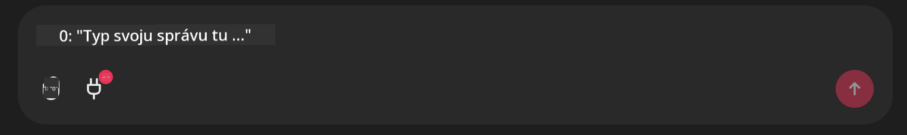

<!--
CO_OP_TRANSLATOR_METADATA:
{
  "original_hash": "9bf0395cbc541ce8db2a9699c8678dfc",
  "translation_date": "2025-07-12T14:24:32+00:00",
  "source_file": "11-mcp/code_samples/github-mcp/README.md",
  "language_code": "sk"
}
-->
# Github MCP Server Príklad

## Popis

Toto bolo demo vytvorené pre AI Agents Hackathon organizovaný prostredníctvom Microsoft Reactor.

Nástroj slúži na odporúčanie hackathon projektov na základe používateľových Github repozitárov.  
Toto sa dosahuje pomocou:

1. **Github Agent** – Používa Github MCP Server na získavanie repozitárov a informácií o týchto repozitároch.  
2. **Hackathon Agent** – Spracuje dáta od Github Agenta a navrhne kreatívne nápady na hackathon projekty na základe projektov, jazykov používaných používateľom a tém hackathonu AI Agents.  
3. **Events Agent** – Na základe návrhov hackathon agenta odporučí relevantné podujatia zo série AI Agent Hackathon.

## Spustenie kódu

### Premenné prostredia

Toto demo využíva Azure Open AI Service, Semantic Kernel, Github MCP Server a Azure AI Search.

Uistite sa, že máte správne nastavené premenné prostredia pre použitie týchto nástrojov:

```python
AZURE_OPENAI_CHAT_DEPLOYMENT_NAME=""
AZURE_OPENAI_EMBEDDING_DEPLOYMENT_NAME=""
AZURE_OPENAI_ENDPOINT=""
AZURE_OPENAI_API_KEY=""
AZURE_OPENAI_API_VERSION=""
AZURE_SEARCH_SERVICE_ENDPOINT=""
AZURE_SEARCH_API_KEY=""
```

## Spustenie Chainlit Servera

Na pripojenie k MCP serveru toto demo používa Chainlit ako chat rozhranie.

Na spustenie servera použite v termináli nasledujúci príkaz:

```bash
chainlit run app.py -w
```

Týmto sa spustí váš Chainlit server na `localhost:8000` a zároveň sa naplní váš Azure AI Search Index obsahom súboru `event-descriptions.md`.

## Pripojenie k MCP Serveru

Na pripojenie k Github MCP Serveru vyberte ikonu "zásuvky" pod chatovacím oknom "Type your message here..":



Odtiaľ môžete kliknúť na "Connect an MCP" a pridať príkaz na pripojenie k Github MCP Serveru:

```bash
npx -y @modelcontextprotocol/server-github --env GITHUB_PERSONAL_ACCESS_TOKEN=[YOUR PERSONAL ACCESS TOKEN]
```

Nahraďte "[YOUR PERSONAL ACCESS TOKEN]" vaším skutočným Personal Access Token.

Po pripojení by ste mali vidieť (1) vedľa ikony zásuvky, čo potvrdzuje pripojenie. Ak nie, skúste reštartovať chainlit server príkazom `chainlit run app.py -w`.

## Použitie Dema

Na spustenie pracovného postupu agenta, ktorý odporúča hackathon projekty, môžete napísať správu napríklad:

"Recommend hackathon projects for the Github user koreyspace"

Router Agent analyzuje vašu požiadavku a rozhodne, ktorá kombinácia agentov (GitHub, Hackathon a Events) je najvhodnejšia na spracovanie vášho dotazu. Agenti spolupracujú, aby poskytli komplexné odporúčania založené na analýze Github repozitárov, tvorbe nápadov na projekty a relevantných technologických podujatiach.

**Vyhlásenie o zodpovednosti**:  
Tento dokument bol preložený pomocou AI prekladateľskej služby [Co-op Translator](https://github.com/Azure/co-op-translator). Aj keď sa snažíme o presnosť, prosím, majte na pamäti, že automatizované preklady môžu obsahovať chyby alebo nepresnosti. Originálny dokument v jeho pôvodnom jazyku by mal byť považovaný za autoritatívny zdroj. Pre kritické informácie sa odporúča profesionálny ľudský preklad. Nie sme zodpovední za akékoľvek nedorozumenia alebo nesprávne interpretácie vyplývajúce z použitia tohto prekladu.