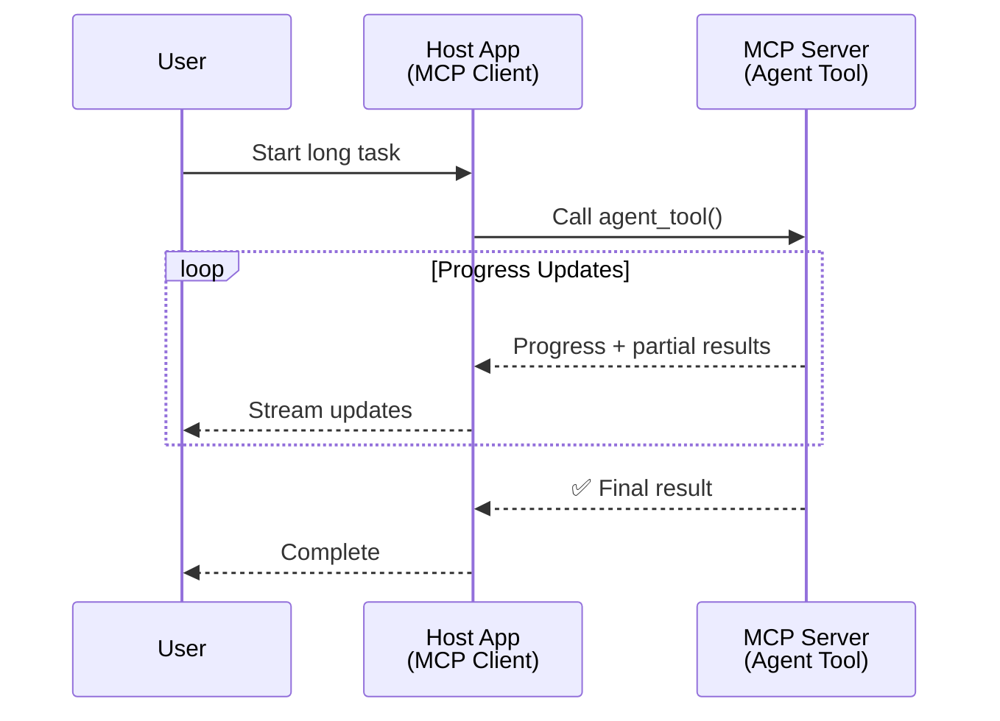
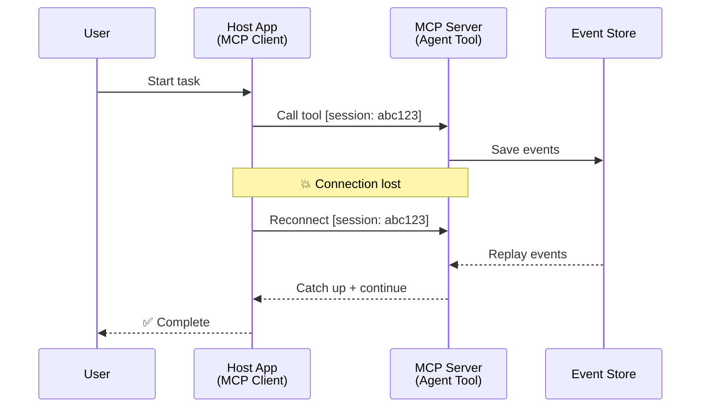
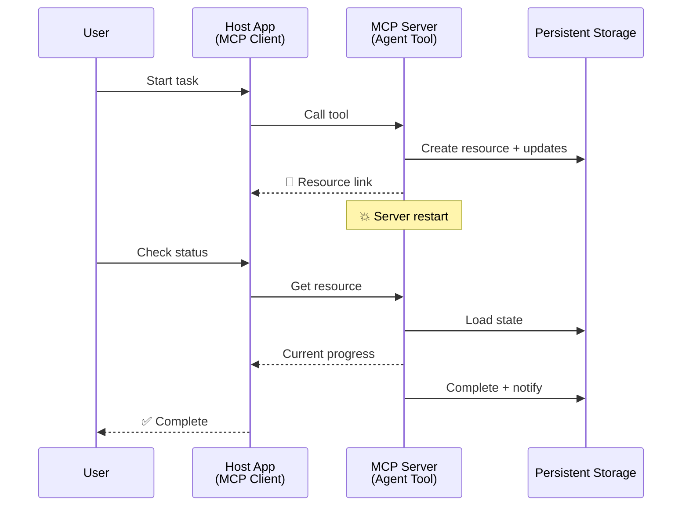
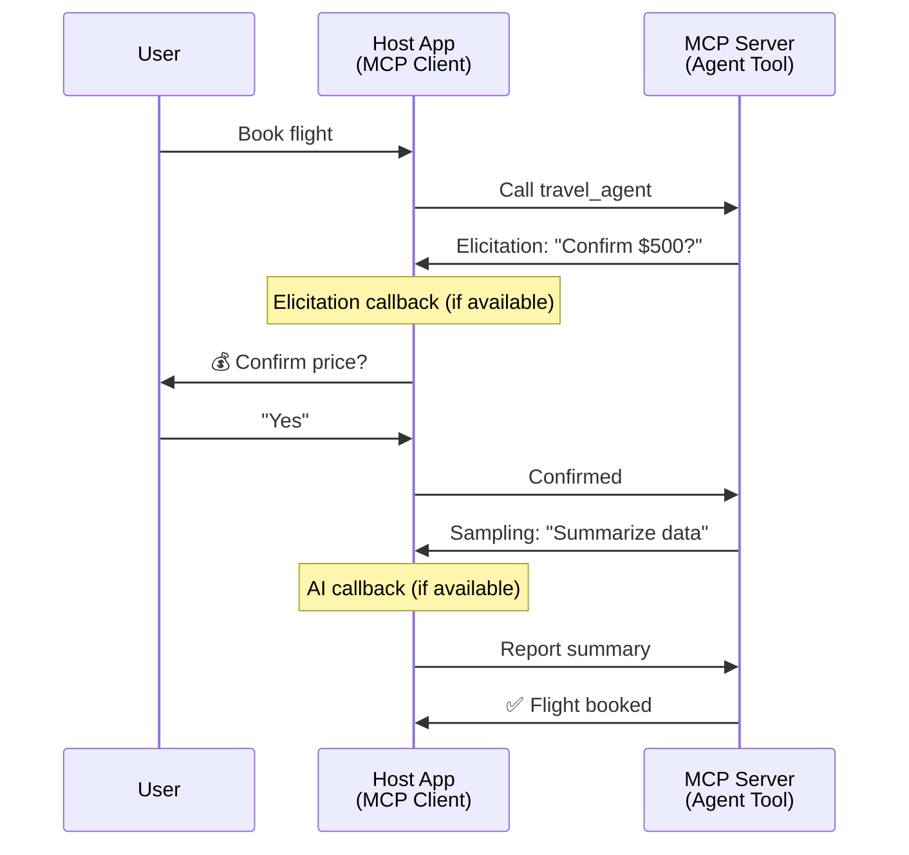
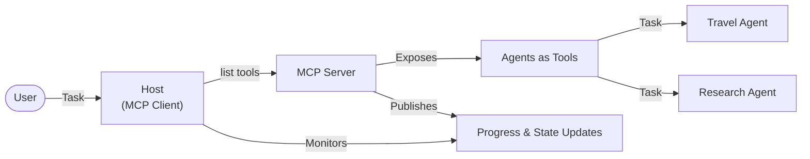

<!--
CO_OP_TRANSLATOR_METADATA:
{
  "original_hash": "5cc6836626047aa055e8960c8484a7d0",
  "translation_date": "2025-08-21T14:53:33+00:00",
  "source_file": "11-mcp/code_samples/mcp-agents/README.md",
  "language_code": "sk"
}
-->
# Budovanie systémov komunikácie medzi agentmi pomocou MCP

> Stručne - Môžete vytvoriť komunikáciu Agent2Agent na MCP? Áno!

MCP sa výrazne vyvinul nad rámec svojho pôvodného cieľa „poskytovať kontext pre LLM“. S nedávnymi vylepšeniami, ako sú [obnoviteľné prúdy](https://modelcontextprotocol.io/docs/concepts/transports#resumability-and-redelivery), [elicitation](https://modelcontextprotocol.io/specification/2025-06-18/client/elicitation), [sampling](https://modelcontextprotocol.io/specification/2025-06-18/client/sampling) a notifikácie ([progress](https://modelcontextprotocol.io/specification/2025-06-18/basic/utilities/progress) a [resources](https://modelcontextprotocol.io/specification/2025-06-18/schema#resourceupdatednotification)), MCP teraz poskytuje robustný základ pre budovanie komplexných systémov komunikácie medzi agentmi.

## Mýtus o agentoch a nástrojoch

Ako viac vývojárov skúma nástroje s agentickým správaním (dlhodobé spúšťanie, potreba dodatočného vstupu počas vykonávania atď.), často sa mylne predpokladá, že MCP nie je vhodný, pretože skoré príklady jeho primitívnych nástrojov sa zameriavali na jednoduché vzory požiadavka-odpoveď.

Tento pohľad je zastaraný. Špecifikácia MCP bola za posledné mesiace výrazne vylepšená schopnosťami, ktoré umožňujú budovanie dlhodobého agentického správania:

- **Streamovanie a čiastočné výsledky**: Aktualizácie priebehu v reálnom čase počas vykonávania
- **Obnoviteľnosť**: Klienti sa môžu po odpojení znova pripojiť a pokračovať
- **Trvácnosť**: Výsledky prežijú reštarty servera (napr. prostredníctvom odkazov na zdroje)
- **Viacnásobné interakcie**: Interaktívny vstup počas vykonávania prostredníctvom elicitation a sampling

Tieto funkcie môžu byť skombinované na umožnenie komplexných agentických a multi-agentových aplikácií, všetko nasadené na protokole MCP.

Pre referenciu budeme označovať agenta ako „nástroj“, ktorý je dostupný na MCP serveri. To implikuje existenciu hostiteľskej aplikácie, ktorá implementuje MCP klienta, vytvára reláciu s MCP serverom a môže volať agenta.

## Čo robí MCP nástroj „agentickým“?

Predtým, než sa pustíme do implementácie, definujme, aké infraštruktúrne schopnosti sú potrebné na podporu dlhodobých agentov.

> Definujeme agenta ako entitu, ktorá dokáže autonómne fungovať počas dlhších období, schopnú zvládať komplexné úlohy, ktoré môžu vyžadovať viacnásobné interakcie alebo úpravy na základe spätnej väzby v reálnom čase.

### 1. Streamovanie a čiastočné výsledky

Tradičné vzory požiadavka-odpoveď nefungujú pre dlhodobé úlohy. Agenti potrebujú poskytovať:

- Aktualizácie priebehu v reálnom čase
- Medzivýsledky

**Podpora MCP**: Notifikácie o aktualizácii zdrojov umožňujú streamovanie čiastočných výsledkov, hoci to vyžaduje starostlivý návrh, aby sa predišlo konfliktom s modelom 1:1 požiadavka/odpoveď JSON-RPC.

| Funkcia                   | Prípad použitia                                                                                                                                                                       | Podpora MCP                                                                                |
| ------------------------- | ------------------------------------------------------------------------------------------------------------------------------------------------------------------------------------- | ------------------------------------------------------------------------------------------ |
| Aktualizácie priebehu     | Používateľ požiada o úlohu migrácie kódu. Agent streamuje priebeh: „10 % - Analyzovanie závislostí... 25 % - Konvertovanie TypeScript súborov... 50 % - Aktualizácia importov...“     | ✅ Notifikácie o priebehu                                                                  |
| Čiastočné výsledky        | Úloha „Generovať knihu“ streamuje čiastočné výsledky, napr. 1) Náčrt príbehu, 2) Zoznam kapitol, 3) Každú dokončenú kapitolu. Hostiteľ môže kontrolovať, zrušiť alebo presmerovať. | ✅ Notifikácie môžu byť „rozšírené“ o čiastočné výsledky, pozri návrhy na PR 383, 776       |

<div align="center" style="font-style: italic; font-size: 0.95em; margin-bottom: 0.5em;">
<strong>Obrázok 1:</strong> Tento diagram ilustruje, ako MCP agent streamuje aktualizácie priebehu v reálnom čase a čiastočné výsledky do hostiteľskej aplikácie počas dlhodobej úlohy, čo umožňuje používateľovi monitorovať vykonávanie v reálnom čase.
</div>



### 2. Obnoviteľnosť

Agenti musia zvládať prerušenia siete bez problémov:

- Znovu sa pripojiť po odpojení klienta
- Pokračovať tam, kde skončili (opätovné doručenie správ)

**Podpora MCP**: MCP StreamableHTTP transport dnes podporuje obnovu relácie a opätovné doručenie správ pomocou ID relácie a ID poslednej udalosti. Dôležité je, že server musí implementovať EventStore, ktorý umožňuje prehrávanie udalostí pri opätovnom pripojení klienta.  
Poznámka: Existuje komunitný návrh (PR #975), ktorý skúma transportovo-agnostické obnoviteľné prúdy.

| Funkcia      | Prípad použitia                                                                                                                                                   | Podpora MCP                                                                |
| ------------ | ---------------------------------------------------------------------------------------------------------------------------------------------------------- | -------------------------------------------------------------------------- |
| Obnoviteľnosť | Klient sa odpojí počas dlhodobej úlohy. Po opätovnom pripojení sa relácia obnoví s prehratými udalosťami, pokračujúc plynulo tam, kde skončila. | ✅ StreamableHTTP transport s ID relácie, prehrávaním udalostí a EventStore |

<div align="center" style="font-style: italic; font-size: 0.95em; margin-bottom: 0.5em;">
<strong>Obrázok 2:</strong> Tento diagram ukazuje, ako MCP StreamableHTTP transport a EventStore umožňujú bezproblémovú obnovu relácie: ak sa klient odpojí, môže sa znovu pripojiť a prehrať zmeškané udalosti, pokračujúc v úlohe bez straty pokroku.
</div>



### 3. Trvácnosť

Dlhodobí agenti potrebujú perzistentný stav:

- Výsledky prežijú reštarty servera
- Stav môže byť získaný mimo relácie
- Sledovanie priebehu medzi reláciami

**Podpora MCP**: MCP teraz podporuje typ návratu Resource link pre volania nástrojov. Dnes je možným vzorom navrhnúť nástroj, ktorý vytvorí zdroj a okamžite vráti odkaz na zdroj. Nástroj môže pokračovať v riešení úlohy na pozadí a aktualizovať zdroj. Klient môže zvoliť, či bude stav tohto zdroja kontrolovať (polling) alebo sa prihlási na odber aktualizácií zdroja.

Jedným obmedzením je, že polling zdrojov alebo odber aktualizácií môže spotrebovať zdroje s dôsledkami pri škálovaní. Existuje otvorený komunitný návrh (vrátane #992), ktorý skúma možnosť zahrnutia webhookov alebo spúšťačov, ktoré server môže volať na notifikáciu klienta/hostiteľskej aplikácie o aktualizáciách.

| Funkcia    | Prípad použitia                                                                                                                                        | Podpora MCP                                                        |
| ---------- | ----------------------------------------------------------------------------------------------------------------------------------------------- | ------------------------------------------------------------------ |
| Trvácnosť | Server sa zrúti počas úlohy migrácie dát. Výsledky a priebeh prežijú reštart, klient môže skontrolovať stav a pokračovať z perzistentného zdroja. | ✅ Odkazy na zdroje s perzistentným úložiskom a notifikáciami stavu |

Dnes je bežným vzorom navrhnúť nástroj, ktorý vytvorí zdroj a okamžite vráti odkaz na zdroj. Nástroj môže na pozadí riešiť úlohu, vydávať notifikácie o zdroji, ktoré slúžia ako aktualizácie priebehu alebo obsahujú čiastočné výsledky, a aktualizovať obsah v zdroji podľa potreby.

<div align="center" style="font-style: italic; font-size: 0.95em; margin-bottom: 0.5em;">
<strong>Obrázok 3:</strong> Tento diagram demonštruje, ako MCP agenti používajú perzistentné zdroje a notifikácie stavu na zabezpečenie, že dlhodobé úlohy prežijú reštarty servera, umožňujúc klientom kontrolovať priebeh a získavať výsledky aj po zlyhaniach.
</div>



### 4. Viacnásobné interakcie

Agenti často potrebujú dodatočný vstup počas vykonávania:

- Ľudské objasnenie alebo schválenie
- AI pomoc pri komplexných rozhodnutiach
- Dynamické úpravy parametrov

**Podpora MCP**: Plne podporované prostredníctvom sampling (pre AI vstup) a elicitation (pre ľudský vstup).

| Funkcia                 | Prípad použitia                                                                                                                                     | Podpora MCP                                           |
| ----------------------- | -------------------------------------------------------------------------------------------------------------------------------------------- | ----------------------------------------------------- |
| Viacnásobné interakcie | Agent na rezerváciu cestovania žiada potvrdenie ceny od používateľa, potom požiada AI o zhrnutie cestovných údajov pred dokončením transakcie. | ✅ Elicitation pre ľudský vstup, sampling pre AI vstup |

<div align="center" style="font-style: italic; font-size: 0.95em; margin-bottom: 0.5em;">
<strong>Obrázok 4:</strong> Tento diagram zobrazuje, ako MCP agenti môžu interaktívne vyžadovať ľudský vstup alebo požiadať o AI pomoc počas vykonávania, podporujúc komplexné, viacnásobné pracovné postupy, ako sú potvrdenia a dynamické rozhodovanie.
</div>



## Implementácia dlhodobých agentov na MCP - Prehľad kódu

Ako súčasť tohto článku poskytujeme [repozitár kódu](https://github.com/victordibia/ai-tutorials/tree/main/MCP%20Agents), ktorý obsahuje kompletnú implementáciu dlhodobých agentov pomocou MCP Python SDK so StreamableHTTP transportom na obnovu relácie a opätovné doručenie správ. Implementácia demonštruje, ako môžu byť schopnosti MCP skombinované na umožnenie sofistikovaného agentického správania.

Konkrétne implementujeme server s dvoma hlavnými agentickými nástrojmi:

- **Cestovný agent** - Simuluje službu rezervácie cestovania s potvrdením ceny prostredníctvom elicitation
- **Výskumný agent** - Vykonáva výskumné úlohy s AI-asistovanými zhrnutiami prostredníctvom sampling

Obaja agenti demonštrujú aktualizácie priebehu v reálnom čase, interaktívne potvrdenia a plné schopnosti obnovy relácie.

### Kľúčové koncepty implementácie

Nasledujúce sekcie ukazujú implementáciu na strane servera a spracovanie na strane klienta pre každú schopnosť:

#### Streamovanie a aktualizácie priebehu - Stav úlohy v reálnom čase

Streamovanie umožňuje agentom poskytovať aktualizácie priebehu v reálnom čase počas dlhodobých úloh, čím udržiava používateľov informovaných o stave úlohy a medzivýsledkoch.

**Implementácia na strane servera (agent posiela notifikácie o priebehu):**

```python
# From server/server.py - Travel agent sending progress updates
for i, step in enumerate(steps):
    await ctx.session.send_progress_notification(
        progress_token=ctx.request_id,
        progress=i * 25,
        total=100,
        message=step,
        related_request_id=str(ctx.request_id)
    )
    await anyio.sleep(2)  # Simulate work

# Alternative: Log messages for detailed step-by-step updates
await ctx.session.send_log_message(
    level="info",
    data=f"Processing step {current_step}/{steps} ({progress_percent}%)",
    logger="long_running_agent",
    related_request_id=ctx.request_id,
)
```

**Implementácia na strane klienta (hostiteľ prijíma aktualizácie priebehu):**

```python
# From client/client.py - Client handling real-time notifications
async def message_handler(message) -> None:
    if isinstance(message, types.ServerNotification):
        if isinstance(message.root, types.LoggingMessageNotification):
            console.print(f"📡 [dim]{message.root.params.data}[/dim]")
        elif isinstance(message.root, types.ProgressNotification):
            progress = message.root.params
            console.print(f"🔄 [yellow]{progress.message} ({progress.progress}/{progress.total})[/yellow]")

# Register message handler when creating session
async with ClientSession(
    read_stream, write_stream,
    message_handler=message_handler
) as session:
```

#### Elicitation - Požiadanie o vstup používateľa

Elicitation umožňuje agentom požiadať o vstup používateľa počas vykonávania. To je nevyhnutné pre potvrdenia, objasnenia alebo schválenia počas dlhodobých úloh.

**Implementácia na strane servera (agent žiada potvrdenie):**

```python
# From server/server.py - Travel agent requesting price confirmation
elicit_result = await ctx.session.elicit(
    message=f"Please confirm the estimated price of $1200 for your trip to {destination}",
    requestedSchema=PriceConfirmationSchema.model_json_schema(),
    related_request_id=ctx.request_id,
)

if elicit_result and elicit_result.action == "accept":
    # Continue with booking
    logger.info(f"User confirmed price: {elicit_result.content}")
elif elicit_result and elicit_result.action == "decline":
    # Cancel the booking
    booking_cancelled = True
```

**Implementácia na strane klienta (hostiteľ poskytuje callback pre elicitation):**

```python
# From client/client.py - Client handling elicitation requests
async def elicitation_callback(context, params):
    console.print(f"💬 Server is asking for confirmation:")
    console.print(f"   {params.message}")

    response = console.input("Do you accept? (y/n): ").strip().lower()

    if response in ['y', 'yes']:
        return types.ElicitResult(
            action="accept",
            content={"confirm": True, "notes": "Confirmed by user"}
        )
    else:
        return types.ElicitResult(
            action="decline",
            content={"confirm": False, "notes": "Declined by user"}
        )

# Register the callback when creating the session
async with ClientSession(
    read_stream, write_stream,
    elicitation_callback=elicitation_callback
) as session:
```

#### Sampling - Požiadanie o AI pomoc

Sampling umožňuje agentom požiadať o pomoc LLM pri komplexných rozhodnutiach alebo generovaní obsahu počas vykonávania. To umožňuje hybridné pracovné postupy človek-AI.

**Implementácia na strane servera (agent žiada AI pomoc):**

```python
# From server/server.py - Research agent requesting AI summary
sampling_result = await ctx.session.create_message(
    messages=[
        SamplingMessage(
            role="user",
            content=TextContent(type="text", text=f"Please summarize the key findings for research on: {topic}")
        )
    ],
    max_tokens=100,
    related_request_id=ctx.request_id,
)

if sampling_result and sampling_result.content:
    if sampling_result.content.type == "text":
        sampling_summary = sampling_result.content.text
        logger.info(f"Received sampling summary: {sampling_summary}")
```

**Implementácia na strane klienta (hostiteľ poskytuje callback pre sampling):**

```python
# From client/client.py - Client handling sampling requests
async def sampling_callback(context, params):
    message_text = params.messages[0].content.text if params.messages else 'No message'
    console.print(f"🧠 Server requested sampling: {message_text}")

    # In a real application, this could call an LLM API
    # For demo purposes, we provide a mock response
    mock_response = "Based on current research, MCP has evolved significantly..."

    return types.CreateMessageResult(
        role="assistant",
        content=types.TextContent(type="text", text=mock_response),
        model="interactive-client",
        stopReason="endTurn"
    )

# Register the callback when creating the session
async with ClientSession(
    read_stream, write_stream,
    sampling_callback=sampling_callback,
    elicitation_callback=elicitation_callback
) as session:
```

#### Obnoviteľnosť - Kontinuita relácie pri odpojeniach

Obnoviteľnosť zabezpečuje, že dlhodobé úlohy agentov môžu prežiť odpojenia klienta a pokračovať bez problémov po opätovnom pripojení. To je implementované prostredníctvom EventStore a tokenov obnovy.

**Implementácia EventStore (server uchováva stav relácie):**

```python
# From server/event_store.py - Simple in-memory event store
class SimpleEventStore(EventStore):
    def __init__(self):
        self._events: list[tuple[StreamId, EventId, JSONRPCMessage]] = []
        self._event_id_counter = 0

    async def store_event(self, stream_id: StreamId, message: JSONRPCMessage) -> EventId:
        """Store an event and return its ID."""
        self._event_id_counter += 1
        event_id = str(self._event_id_counter)
        self._events.append((stream_id, event_id, message))
        return event_id

    async def replay_events_after(self, last_event_id: EventId, send_callback: EventCallback) -> StreamId | None:
        """Replay events after the specified ID for resumption."""
        # Find events after the last known event and replay them
        for _, event_id, message in self._events[start_index:]:
            await send_callback(EventMessage(message, event_id))

# From server/server.py - Passing event store to session manager
def create_server_app(event_store: Optional[EventStore] = None) -> Starlette:
    server = ResumableServer()

    # Create session manager with event store for resumption
    session_manager = StreamableHTTPSessionManager(
        app=server,
        event_store=event_store,  # Event store enables session resumption
        json_response=False,
        security_settings=security_settings,
    )

    return Starlette(routes=[Mount("/mcp", app=session_manager.handle_request)])

# Usage: Initialize with event store
event_store = SimpleEventStore()
app = create_server_app(event_store)
```

**Metadáta klienta s tokenom obnovy (klient sa znovu pripojí pomocou uloženého stavu):**

```python
# From client/client.py - Client resumption with metadata
if existing_tokens and existing_tokens.get("resumption_token"):
    # Use existing resumption token to continue where we left off
    metadata = ClientMessageMetadata(
        resumption_token=existing_tokens["resumption_token"],
    )
else:
    # Create callback to save resumption token when received
    def enhanced_callback(token: str):
        protocol_version = getattr(session, 'protocol_version', None)
        token_manager.save_tokens(session_id, token, protocol_version, command, args)

    metadata = ClientMessageMetadata(
        on_resumption_token_update=enhanced_callback,
    )

# Send request with resumption metadata
result = await session.send_request(
    types.ClientRequest(
        types.CallToolRequest(
            method="tools/call",
            params=types.CallToolRequestParams(name=command, arguments=args)
        )
    ),
    types.CallToolResult,
    metadata=metadata,
)
```

Hostiteľská aplikácia uchováva ID relácie a tokeny obnovy lokálne, čo jej umožňuje znovu sa pripojiť k existujúcim reláciám bez straty pokroku alebo stavu.

### Organizácia kódu

<div align="center" style="font-style: italic; font-size: 0.95em; margin-bottom: 0.5em;">
<strong>Obrázok 5:</strong> Architektúra systému agentov založeného na MCP
</div>



**Kľúčové súbory:**

- **`server/server.py`** - Obnoviteľný MCP server s cestovnými a výskumnými agentmi, ktorí demonštrujú elicitation, sampling a aktualizácie priebehu
- **`client/client.py`** - Interaktívna hostiteľská aplikácia s podporou obnovy, callbackmi a správou tokenov
- **`server/event_store.py`** - Implementácia EventStore umožňujúca obnovu relácie a opätovné doručenie správ

## Rozšírenie na komunikáciu medzi viacerými agentmi na MCP

Vyššie uvedená implementácia môže byť rozšírená na systémy s viacerými agentmi vylepšením inteligencie a rozsahu hostiteľskej aplikácie:

- **Inteligentná dekompozícia úloh**: Hostiteľ analyzuje komplexné požiadavky používateľa a rozkladá ich na podúlohy pre rôznych špecializovaných agentov
- **Koordinácia viacerých serverov**: Hostiteľ udržiava spojenia s viacerými MCP servermi, z ktorých každý poskytuje rôzne schopnosti agentov
- **Správa stavu úloh**: Hostiteľ sleduje priebeh viacerých súbežných úloh agentov, spracováva závislosti a sekvencovanie
- **Odolnosť a opakovania**: Hostiteľ spravuje zlyhania, implementuje logiku opakovania a presmerováva úlohy, keď agenti nie sú dostupní
- **Syntéza výsledkov**: Hostiteľ kombinuje výstupy od viacerých agentov do koherentných konečných výsledkov

Hostiteľ sa vyvíja z jednoduchého klienta na inteligentného orchestrátora, ktorý koordinuje distribuované schopnosti agentov pri zachovaní rovnakého základu protokolu MCP.

## Záver

Vylepšené schopnosti MCP - notifikácie o zdrojoch, elicitation/sampling, obnoviteľné prúdy a perzistentné zdroje - umožňujú komplexné interakcie medzi agentmi pri zachovaní jednoduchosti protokolu.

## Začíname

Pripravení vytvoriť vlastný systém agent2agent? Postupujte podľa týchto krokov:

### 1. Spustite demo

```bash
# Start the server with event store for resumption
python -m server.server --port 8006

# In another terminal, run the interactive client
python -m client.client --url http://127.0.0.1:8006/mcp
```

**Dostupné príkazy v interaktívnom režime:**

- `travel_agent` - Rezervácia cestovania s potvrdením ceny prostredníctvom elicitation
- `research_agent` - Výskum tém s AI-asistovanými zhrnutiami prostredníctvom sampling
- `list` - Zobraziť všetky dostupné nástroje
- `clean-tokens` - Vymazať tokeny obnovy
- `help` - Zobraziť podrobnú pomoc k príkazom
- `quit` - Ukončiť klienta

### 2. Otestujte schopnosti obnovy

- Spustite dlhodobého

**Upozornenie**:  
Tento dokument bol preložený pomocou služby na automatický preklad [Co-op Translator](https://github.com/Azure/co-op-translator). Hoci sa snažíme o presnosť, upozorňujeme, že automatické preklady môžu obsahovať chyby alebo nepresnosti. Pôvodný dokument v jeho pôvodnom jazyku by mal byť považovaný za autoritatívny zdroj. Pre dôležité informácie odporúčame profesionálny preklad vykonaný človekom. Nezodpovedáme za žiadne nedorozumenia alebo nesprávne interpretácie vyplývajúce z použitia tohto prekladu.