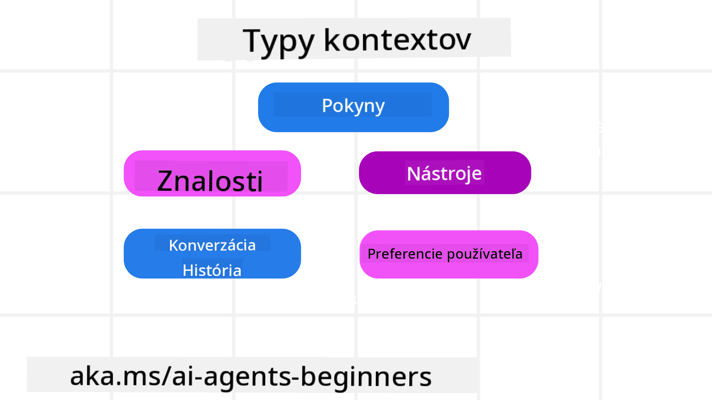

<!--
CO_OP_TRANSLATOR_METADATA:
{
  "original_hash": "cb7e50f471905ce6fdb92a30269a7a98",
  "translation_date": "2025-09-04T10:25:50+00:00",
  "source_file": "12-context-engineering/README.md",
  "language_code": "sk"
}
-->
# Kontextové inžinierstvo pre AI agentov

> _(Kliknite na obrázok vyššie pre zobrazenie videa k tejto lekcii)_

Porozumenie komplexnosti aplikácie, pre ktorú vytvárate AI agenta, je dôležité pre jeho spoľahlivosť. Potrebujeme vytvárať AI agentov, ktorí efektívne spravujú informácie na riešenie zložitých potrieb, ktoré presahujú rámec promptového inžinierstva.

V tejto lekcii sa pozrieme na to, čo je kontextové inžinierstvo a akú úlohu zohráva pri tvorbe AI agentov.

## Úvod

Táto lekcia pokryje:

• **Čo je kontextové inžinierstvo** a prečo sa líši od promptového inžinierstva.

• **Stratégie pre efektívne kontextové inžinierstvo**, vrátane písania, výberu, kompresie a izolácie informácií.

• **Bežné zlyhania kontextu**, ktoré môžu narušiť vášho AI agenta, a ako ich opraviť.

## Ciele učenia

Po absolvovaní tejto lekcie budete vedieť:

• **Definovať kontextové inžinierstvo** a odlíšiť ho od promptového inžinierstva.

• **Identifikovať kľúčové komponenty kontextu** v aplikáciách s veľkými jazykovými modelmi (LLM).

• **Aplikovať stratégie na písanie, výber, kompresiu a izoláciu kontextu**, aby ste zlepšili výkon agenta.

• **Rozpoznať bežné zlyhania kontextu**, ako sú otrava, rozptýlenie, zmätok a konflikt, a implementovať techniky na ich zmiernenie.

## Čo je kontextové inžinierstvo?

Pre AI agentov je kontext tým, čo riadi plánovanie ich akcií. Kontextové inžinierstvo je prax zabezpečenia, že AI agent má správne informácie na dokončenie ďalšieho kroku úlohy. Kontextové okno je obmedzené svojou veľkosťou, takže ako tvorcovia agentov musíme vytvárať systémy a procesy na správu pridávania, odstraňovania a kondenzácie informácií v kontextovom okne.

### Promptové inžinierstvo vs Kontextové inžinierstvo

Promptové inžinierstvo sa zameriava na jednu sadu statických inštrukcií na efektívne usmernenie AI agentov pomocou pravidiel. Kontextové inžinierstvo sa zaoberá správou dynamickej sady informácií, vrátane počiatočného promptu, aby sa zabezpečilo, že AI agent má potrebné informácie v priebehu času. Hlavnou myšlienkou kontextového inžinierstva je urobiť tento proces opakovateľným a spoľahlivým.

### Typy kontextu

Je dôležité si uvedomiť, že kontext nie je len jedna vec. Informácie, ktoré AI agent potrebuje, môžu pochádzať z rôznych zdrojov a je na nás, aby sme zabezpečili, že agent má prístup k týmto zdrojom:

Typy kontextu, ktoré AI agent môže potrebovať spravovať, zahŕňajú:

• **Inštrukcie:** Sú ako "pravidlá" agenta – prompty, systémové správy, príklady few-shot (ukazujúce AI, ako niečo urobiť) a popisy nástrojov, ktoré môže použiť. Tu sa promptové inžinierstvo spája s kontextovým inžinierstvom.

• **Znalosti:** Zahŕňajú fakty, informácie získané z databáz alebo dlhodobé spomienky, ktoré agent nahromadil. To zahŕňa integráciu systému Retrieval Augmented Generation (RAG), ak agent potrebuje prístup k rôznym zdrojom znalostí a databázam.

• **Nástroje:** Definície externých funkcií, API a MCP serverov, ktoré agent môže volať, spolu s výsledkami, ktoré z ich použitia získava.

• **História konverzácie:** Prebiehajúci dialóg s používateľom. Ako čas plynie, tieto konverzácie sa stávajú dlhšími a zložitejšími, čo znamená, že zaberajú miesto v kontextovom okne.

• **Preferencie používateľa:** Informácie naučené o preferenciách používateľa v priebehu času. Môžu byť uložené a použité pri rozhodovaní, aby pomohli používateľovi.

## Stratégie pre efektívne kontextové inžinierstvo

### Plánovacie stratégie

Dobré kontextové inžinierstvo začína dobrým plánovaním. Tu je prístup, ktorý vám pomôže začať uvažovať o tom, ako aplikovať koncept kontextového inžinierstva:

1. **Definujte jasné výsledky** - Výsledky úloh, ktoré budú AI agenti vykonávať, by mali byť jasne definované. Odpovedzte na otázku - "Ako bude svet vyzerať, keď AI agent dokončí svoju úlohu?" Inými slovami, akú zmenu, informáciu alebo odpoveď by mal používateľ mať po interakcii s AI agentom.

2. **Zmapujte kontext** - Keď ste definovali výsledky AI agenta, musíte odpovedať na otázku "Aké informácie potrebuje AI agent na dokončenie tejto úlohy?". Takto môžete začať mapovať kontext, kde sa tieto informácie nachádzajú.

3. **Vytvorte kontextové pipeline** - Teraz, keď viete, kde sa informácie nachádzajú, musíte odpovedať na otázku "Ako agent získa tieto informácie?". To sa dá urobiť rôznymi spôsobmi, vrátane RAG, použitia MCP serverov a iných nástrojov.

### Praktické stratégie

Plánovanie je dôležité, ale keď informácie začnú prúdiť do kontextového okna agenta, musíme mať praktické stratégie na ich správu:

#### Správa kontextu

Aj keď niektoré informácie budú do kontextového okna pridávané automaticky, kontextové inžinierstvo je o aktívnejšom prístupe k týmto informáciám, čo sa dá dosiahnuť niekoľkými stratégiami:

1. **Poznámkový blok agenta**  
Umožňuje AI agentovi robiť si poznámky o relevantných informáciách týkajúcich sa aktuálnych úloh a interakcií s používateľom počas jednej relácie. Mal by existovať mimo kontextového okna v súbore alebo runtime objekte, ktorý agent môže neskôr počas tejto relácie získať, ak je to potrebné.

2. **Spomienky**  
Poznámkové bloky sú dobré na správu informácií mimo kontextového okna jednej relácie. Spomienky umožňujú agentom ukladať a získavať relevantné informácie naprieč viacerými reláciami. To môže zahŕňať zhrnutia, preferencie používateľa a spätnú väzbu na zlepšenie v budúcnosti.

3. **Kompresia kontextu**  
Keď kontextové okno rastie a blíži sa k svojmu limitu, môžu sa použiť techniky ako sumarizácia a orezávanie. To zahŕňa buď ponechanie iba najrelevantnejších informácií alebo odstránenie starších správ.

4. **Systémy viacerých agentov**  
Vývoj systému viacerých agentov je formou kontextového inžinierstva, pretože každý agent má svoje vlastné kontextové okno. Ako sa tento kontext zdieľa a prenáša medzi rôznymi agentmi, je ďalšia vec, ktorú treba naplánovať pri budovaní týchto systémov.

5. **Sandboxové prostredia**  
Ak agent potrebuje spustiť nejaký kód alebo spracovať veľké množstvo informácií v dokumente, môže to zabrať veľké množstvo tokenov na spracovanie výsledkov. Namiesto toho, aby to všetko bolo uložené v kontextovom okne, agent môže použiť sandboxové prostredie, ktoré je schopné spustiť tento kód a čítať iba výsledky a ďalšie relevantné informácie.

6. **Runtime stavové objekty**  
To sa robí vytvorením kontajnerov informácií na správu situácií, keď agent potrebuje mať prístup k určitým informáciám. Pre komplexnú úlohu by to umožnilo agentovi ukladať výsledky každého podkroku krok za krokom, pričom kontext zostáva pripojený iba k tomuto konkrétnemu podkroku.

### Príklad kontextového inžinierstva

Povedzme, že chceme, aby AI agent **"Rezervoval mi výlet do Paríža."**

• Jednoduchý agent používajúci iba promptové inžinierstvo by mohol odpovedať: **"Dobre, kedy by ste chceli ísť do Paríža?"**. Spracoval by iba vašu priamu otázku v čase, keď ste ju položili.

• Agent používajúci stratégie kontextového inžinierstva, ktoré sme pokryli, by urobil oveľa viac. Predtým, než by odpovedal, jeho systém by mohol:

  ◦ **Skontrolovať váš kalendár** pre dostupné dátumy (získanie údajov v reálnom čase).

 ◦ **Pripomenúť si minulé cestovné preferencie** (z dlhodobej pamäte), ako vašu preferovanú leteckú spoločnosť, rozpočet alebo či preferujete priame lety.

 ◦ **Identifikovať dostupné nástroje** na rezerváciu letov a hotelov.

- Potom by mohla byť odpoveď: **"Ahoj [Vaše meno]! Vidím, že ste voľní prvý týždeň v októbri. Mám hľadať priame lety do Paríža na [Preferovaná letecká spoločnosť] v rámci vášho obvyklého rozpočtu [Rozpočet]?"**. Táto bohatšia, kontextovo uvedomelá odpoveď demonštruje silu kontextového inžinierstva.

## Bežné zlyhania kontextu

### Otrava kontextu

**Čo to je:** Keď halucinácia (nesprávne informácie generované LLM) alebo chyba vstúpi do kontextu a opakovane sa na ňu odkazuje, čo spôsobí, že agent sleduje nemožné ciele alebo vyvíja nezmyselné stratégie.

**Čo robiť:** Implementujte **validáciu kontextu** a **karanténu**. Validujte informácie predtým, než sa pridajú do dlhodobej pamäte. Ak sa zistí potenciálna otrava, začnite nové kontextové vlákna, aby sa zabránilo šíreniu nesprávnych informácií.

**Príklad rezervácie výletu:** Váš agent halucinuje **priamy let z malého miestneho letiska do vzdialeného medzinárodného mesta**, ktoré v skutočnosti neponúka medzinárodné lety. Tento neexistujúci detail letu sa uloží do kontextu. Neskôr, keď požiadate agenta o rezerváciu, stále sa snaží nájsť lístky na túto nemožnú trasu, čo vedie k opakovaným chybám.

**Riešenie:** Implementujte krok, ktorý **validuje existenciu letu a trasy pomocou API v reálnom čase** _predtým_, než sa detail letu pridá do pracovného kontextu agenta. Ak validácia zlyhá, nesprávne informácie sa "dajú do karantény" a ďalej sa nepoužívajú.

### Rozptýlenie kontextu

**Čo to je:** Keď sa kontext stane tak veľkým, že model sa príliš sústredí na nahromadenú históriu namiesto toho, aby využíval to, čo sa naučil počas tréningu, čo vedie k opakovaným alebo neefektívnym akciám. Modely môžu začať robiť chyby ešte predtým, než sa kontextové okno naplní.

**Čo robiť:** Použite **sumarizáciu kontextu**. Pravidelne komprimujte nahromadené informácie do kratších zhrnutí, pričom zachováte dôležité detaily a odstránite redundantnú históriu. To pomáha "resetovať" zameranie.

**Príklad rezervácie výletu:** Dlhodobo diskutujete o rôznych vysnívaných cestovných destináciách, vrátane podrobného rozprávania o vašom backpackingovom výlete spred dvoch rokov. Keď nakoniec požiadate o **"nájdenie lacného letu na budúci mesiac"**, agent sa zamotá do starých, nerelevantných detailov a stále sa pýta na vaše backpackingové vybavenie alebo minulé itineráre, pričom zanedbáva vašu aktuálnu požiadavku.

**Riešenie:** Po určitom počte krokov alebo keď kontext narastie príliš veľký, agent by mal **zhrnúť najnovšie a najrelevantnejšie časti konverzácie** – zameriavajúc sa na vaše aktuálne cestovné dátumy a destináciu – a použiť toto kondenzované zhrnutie pre ďalší LLM hovor, pričom menej relevantnú historickú konverzáciu zahodí.

### Zmätok kontextu

**Čo to je:** Keď zbytočný kontext, často vo forme príliš veľkého množstva dostupných nástrojov, spôsobí, že model generuje nesprávne odpovede alebo volá nerelevantné nástroje. Menšie modely sú na to obzvlášť náchylné.

**Čo robiť:** Implementujte **správu nástrojového vybavenia** pomocou techník RAG. Ukladajte popisy nástrojov do vektorovej databázy a vyberajte _iba_ najrelevantnejšie nástroje pre konkrétnu úlohu. Výskum ukazuje, že obmedzenie výberu nástrojov na menej ako 30 je efektívne.

**Príklad rezervácie výletu:** Váš agent má prístup k desiatkam nástrojov: `book_flight`, `book_hotel`, `rent_car`, `find_tours`, `currency_converter`, `weather_forecast`, `restaurant_reservations`, atď. Požiadate, **"Aký je najlepší spôsob, ako sa pohybovať po Paríži?"** Kvôli veľkému množstvu nástrojov sa agent zmätie a pokúša sa volať `book_flight` _v rámci_ Paríža, alebo `rent_car`, aj keď preferujete verejnú dopravu, pretože popisy nástrojov sa môžu prekrývať alebo jednoducho nedokáže rozlíšiť najlepší.

**Riešenie:** Použite **RAG nad popismi nástrojov**. Keď sa pýtate na pohyb po Paríži, systém dynamicky získava _iba_ najrelevantnejšie nástroje ako `rent_car` alebo `public_transport_info` na základe vašej otázky, čím prezentuje zameraný "výber" nástrojov pre LLM.

### Konflikt kontextu

**Čo to je:** Keď v kontexte existujú protichodné informácie, čo vedie k nekonzistentnému uvažovaniu alebo zlým konečným odpovediam. To sa často stáva, keď informácie prichádzajú v etapách a skoré, nesprávne predpoklady zostávajú v kontexte.

**Čo robiť:** Použite **prerezávanie kontextu** a **odkladanie**. Prerezávanie znamená odstránenie zastaraných alebo protichodných informácií, keď prichádzajú nové detaily. Odkladanie dáva modelu samostatný "poznámkový blok" na spracovanie informácií bez zahltenia hlavného kontextu.

**Príklad rezervácie výletu:** Najprv poviete agentovi, **"Chcem letieť ekonomickou triedou."** Neskôr v konverzácii zmeníte názor a poviete, **"Vlastne, na tento výlet poďme biznis triedou."** Ak obe inštrukcie zostanú v kontexte, agent môže dostať protichodné výsledky vyhľadávania alebo sa zmätie, ktorú preferenciu uprednostniť.

**Riešenie:** Implementujte **prerezávanie kontextu**

---

**Upozornenie**:  
Tento dokument bol preložený pomocou služby AI prekladu [Co-op Translator](https://github.com/Azure/co-op-translator). Hoci sa snažíme o presnosť, prosím, berte na vedomie, že automatizované preklady môžu obsahovať chyby alebo nepresnosti. Pôvodný dokument v jeho rodnom jazyku by mal byť považovaný za autoritatívny zdroj. Pre kritické informácie sa odporúča profesionálny ľudský preklad. Nie sme zodpovední za žiadne nedorozumenia alebo nesprávne interpretácie vyplývajúce z použitia tohto prekladu.