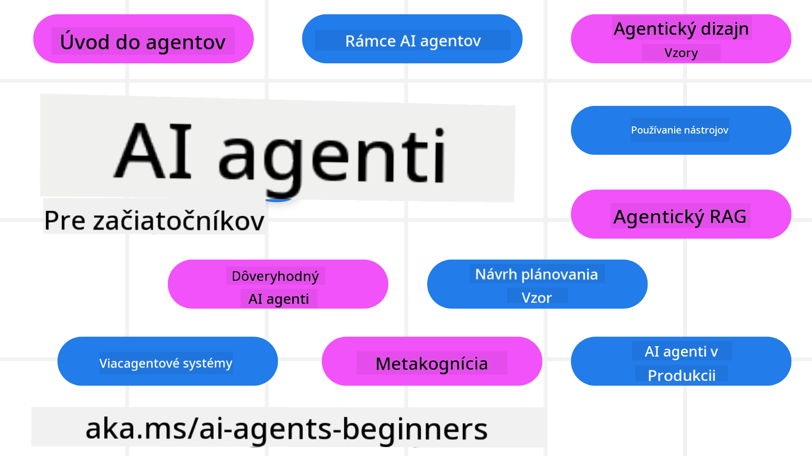

<!--
CO_OP_TRANSLATOR_METADATA:
{
  "original_hash": "6b07046397366e6f6f4524c9ddeba1e1",
  "translation_date": "2025-07-12T14:59:20+00:00",
  "source_file": "README.md",
  "language_code": "sk"
}
-->
# AI Agenti pre Začiatočníkov - Kurz

## 11 Lekcií, ktoré vás naučia všetko potrebné na začatie tvorby AI Agentov

  
  
  
  

### 🌐 Podpora viacerých jazykov

#### Podporované cez GitHub Action (automatizované a vždy aktuálne)

[Francúzština](../fr/README.md) | [Španielčina](../es/README.md) | [Nemčina](../de/README.md) | [Ruština](../ru/README.md) | [Arabčina](../ar/README.md) | [Perzština (Farsi)](../fa/README.md) | [Urdu](../ur/README.md) | [Čínština (zjednodušená)](../zh/README.md) | [Čínština (tradičná, Macau)](../mo/README.md) | [Čínština (tradičná, Hong Kong)](../hk/README.md) | [Čínština (tradičná, Taiwan)](../tw/README.md) | [Japončina](../ja/README.md) | [Kórejčina](../ko/README.md) | [Hindčina](../hi/README.md) | [Bengálčina](../bn/README.md) | [Maráthčina](../mr/README.md) | [Nepálčina](../ne/README.md) | [Pandžábčina (Gurmukhi)](../pa/README.md) | [Portugalčina (Portugalsko)](../pt/README.md) | [Portugalčina (Brazília)](../br/README.md) | [Taliančina](../it/README.md) | [Poľština](../pl/README.md) | [Turečtina](../tr/README.md) | [Gréčtina](../el/README.md) | [Thajčina](../th/README.md) | [Švédčina](../sv/README.md) | [Dánčina](../da/README.md) | [Nórčina](../no/README.md) | [Fínčina](../fi/README.md) | [Holandčina](../nl/README.md) | [Hebrejčina](../he/README.md) | [Vietnamčina](../vi/README.md) | [Indonézština](../id/README.md) | [Malajčina](../ms/README.md) | [Tagalog (Filipínčina)](../tl/README.md) | [Swahilčina](../sw/README.md) | [Maďarčina](../hu/README.md) | [Čeština](../cs/README.md) | [Slovenčina](./README.md) | [Rumunčina](../ro/README.md) | [Bulharčina](../bg/README.md) | [Srbčina (cyrilika)](../sr/README.md) | [Chorvátčina](../hr/README.md) | [Slovinčina](../sl/README.md) | [Ukrajinčina](../uk/README.md) | [Barmčina (Myanmar)](../my/README.md)

**Ak máte záujem o ďalšie podporované jazyky, nájdete ich [tu](https://github.com/Azure/co-op-translator/blob/main/getting_started/supported-languages.md)**

  
  

## 🌱 Začíname

Tento kurz obsahuje 11 lekcií, ktoré pokrývajú základy tvorby AI Agentov. Každá lekcia sa venuje samostatnej téme, takže začnite kdekoľvek chcete!

Kurz podporuje viacero jazykov. Pozrite si dostupné jazyky [tu](../..).

Ak je toto váš prvý kontakt s tvorbou pomocou generatívnych AI modelov, odporúčame náš kurz [Generatívna AI pre Začiatočníkov](https://aka.ms/genai-beginners), ktorý obsahuje 21 lekcií o práci s GenAI.

Nezabudnite [ohviezdičkovať (🌟) tento repozitár](https://docs.github.com/en/get-started/exploring-projects-on-github/saving-repositories-with-stars?WT.mc_id=academic-105485-koreyst) a [forknúť tento repozitár](https://github.com/microsoft/ai-agents-for-beginners/fork), aby ste mohli spustiť kód.

### Čo potrebujete

Každá lekcia v tomto kurze obsahuje príklady kódu, ktoré nájdete v priečinku code_samples. Môžete si [forknúť tento repozitár](https://github.com/microsoft/ai-agents-for-beginners/fork) a vytvoriť si tak vlastnú kópiu.

Príklady kódu v týchto cvičeniach využívajú Azure AI Foundry a GitHub Model Catalogs na prácu s jazykovými modelmi:

- [Github Models](https://aka.ms/ai-agents-beginners/github-models) - zadarmo / obmedzené  
- [Azure AI Foundry](https://aka.ms/ai-agents-beginners/ai-foundry) - vyžaduje Azure účet

Kurz tiež používa nasledujúce AI Agent frameworky a služby od Microsoftu:

- [Azure AI Agent Service](https://aka.ms/ai-agents-beginners/ai-agent-service)  
- [Semantic Kernel](https://aka.ms/ai-agents-beginners/semantic-kernel)  
- [AutoGen](https://aka.ms/ai-agents/autogen)

Pre viac informácií o spustení kódu ku kurzu navštívte [Course Setup](./00-course-setup/README.md).

## 🙏 Chcete pomôcť?

Máte návrhy alebo ste našli chyby v pravopise či kóde? [Vytvorte issue](https://github.com/microsoft/ai-agents-for-beginners/issues?WT.mc_id=academic-105485-koreyst) alebo [pull request](https://github.com/microsoft/ai-agents-for-beginners/pulls?WT.mc_id=academic-105485-koreyst).

Ak narazíte na problémy alebo máte otázky ohľadom tvorby AI Agentov, pridajte sa k nášmu [Azure AI Foundry Community Discord](https://discord.gg/kzRShWzttr).

Ak máte spätnú väzbu alebo hlásite chyby počas tvorby, navštívte náš [Azure AI Foundry Developer Forum](https://aka.ms/azureaifoundry/forum).

## 📂 Každá lekcia obsahuje

- Písanú lekciu v README a krátke video  
- Príklady Python kódu podporujúce Azure AI Foundry a Github Models (zadarmo)  
- Odkazy na ďalšie zdroje pre pokračovanie vo vzdelávaní  

## 🗃️ Lekcie

| **Lekcia**                               | **Text & Kód**                                     | **Video**                                                  | **Dodatočné učenie**                                                                   |
|------------------------------------------|----------------------------------------------------|------------------------------------------------------------|----------------------------------------------------------------------------------------|
| Úvod do AI Agentov a ich použitia        | [Odkaz](./01-intro-to-ai-agents/README.md)         | [Video](https://youtu.be/3zgm60bXmQk?si=z8QygFvYQv-9WtO1)  | [Odkaz](https://aka.ms/ai-agents-beginners/collection?WT.mc_id=academic-105485-koreyst) |
| Preskúmanie AI Agentic Frameworkov       | [Odkaz](./02-explore-agentic-frameworks/README.md) | [Video](https://youtu.be/ODwF-EZo_O8?si=Vawth4hzVaHv-u0H)  | [Odkaz](https://aka.ms/ai-agents-beginners/collection?WT.mc_id=academic-105485-koreyst) |
| Pochopenie AI Agentic Dizajnových Vzorov | [Odkaz](./03-agentic-design-patterns/README.md)    | [Video](https://youtu.be/m9lM8qqoOEA?si=BIzHwzstTPL8o9GF)  | [Odkaz](https://aka.ms/ai-agents-beginners/collection?WT.mc_id=academic-105485-koreyst) |
| Dizajnový Vzor Použitia Nástrojov        | [Odkaz](./04-tool-use/README.md)                   | [Video](https://youtu.be/vieRiPRx-gI?si=2z6O2Xu2cu_Jz46N)  | [Odkaz](https://aka.ms/ai-agents-beginners/collection?WT.mc_id=academic-105485-koreyst) |
| Agentic RAG                             | [Odkaz](./05-agentic-rag/README.md)                | [Video](https://youtu.be/WcjAARvdL7I?si=gKPWsQpKiIlDH9A3)  | [Odkaz](https://aka.ms/ai-agents-beginners/collection?WT.mc_id=academic-105485-koreyst) |
| Budovanie dôveryhodných AI Agentov       | [Odkaz](./06-building-trustworthy-agents/README.md) | [Video](https://youtu.be/iZKkMEGBCUQ?si=jZjpiMnGFOE9L8OK)  | [Odkaz](https://aka.ms/ai-agents-beginners/collection?WT.mc_id=academic-105485-koreyst) |
| Dizajnový Vzor Plánovania                 | [Odkaz](./07-planning-design/README.md)            | [Video](https://youtu.be/kPfJ2BrBCMY?si=6SC_iv_E5-mzucnC)  | [Odkaz](https://aka.ms/ai-agents-beginners/collection?WT.mc_id=academic-105485-koreyst) |
| Dizajnový Vzor Viacagentového Systému    | [Odkaz](./08-multi-agent/README.md)                | [Video](https://youtu.be/V6HpE9hZEx0?si=rMgDhEu7wXo2uo6g)  | [Odkaz](https://aka.ms/ai-agents-beginners/collection?WT.mc_id=academic-105485-koreyst) |
| Dizajnový Vzor Metakognície               | [Odkaz](./09-metacognition/README.md)              | [Video](https://youtu.be/His9R6gw6Ec?si=8gck6vvdSNCt6OcF)  | [Odkaz](https://aka.ms/ai-agents-beginners/collection?WT.mc_id=academic-105485-koreyst) |
| AI Agenti v Produkcii                     | [Odkaz](./10-ai-agents-production/README.md)       | [Video](https://youtu.be/l4TP6IyJxmQ?si=31dnhexRo6yLRJDl)  | [Odkaz](https://aka.ms/ai-agents-beginners/collection?WT.mc_id=academic-105485-koreyst) |
| AI Agenti s MCP                          | [Odkaz](./11-mcp/README.md)                        |                                                            | [Odkaz](https://aka.ms/mcp-for-beginners)                                               |

## 🎒 Ďalšie kurzy

Náš tím pripravuje aj ďalšie kurzy! Pozrite si:
- [**NOVÝ** Model Context Protocol (MCP) pre začiatočníkov](https://github.com/microsoft/mcp-for-beginners?WT.mc_id=academic-105485-koreyst)
- [Generatívna AI pre začiatočníkov pomocou .NET](https://github.com/microsoft/Generative-AI-for-beginners-dotnet?WT.mc_id=academic-105485-koreyst)
- [Generatívna AI pre začiatočníkov](https://github.com/microsoft/generative-ai-for-beginners?WT.mc_id=academic-105485-koreyst)
- [Strojové učenie pre začiatočníkov](https://aka.ms/ml-beginners?WT.mc_id=academic-105485-koreyst)
- [Dátová veda pre začiatočníkov](https://aka.ms/datascience-beginners?WT.mc_id=academic-105485-koreyst)
- [AI pre začiatočníkov](https://aka.ms/ai-beginners?WT.mc_id=academic-105485-koreyst)
- [Kybernetická bezpečnosť pre začiatočníkov](https://github.com/microsoft/Security-101??WT.mc_id=academic-96948-sayoung)
- [Webový vývoj pre začiatočníkov](https://aka.ms/webdev-beginners?WT.mc_id=academic-105485-koreyst)
- [IoT pre začiatočníkov](https://aka.ms/iot-beginners?WT.mc_id=academic-105485-koreyst)
- [Vývoj XR pre začiatočníkov](https://github.com/microsoft/xr-development-for-beginners?WT.mc_id=academic-105485-koreyst)
- [Ovládnutie GitHub Copilot pre AI párové programovanie](https://aka.ms/GitHubCopilotAI?WT.mc_id=academic-105485-koreyst)
- [Ovládnutie GitHub Copilot pre C#/.NET vývojárov](https://github.com/microsoft/mastering-github-copilot-for-dotnet-csharp-developers?WT.mc_id=academic-105485-koreyst)
- [Vyberte si vlastné dobrodružstvo s Copilotom](https://github.com/microsoft/CopilotAdventures?WT.mc_id=academic-105485-koreyst)

## 🌟 Poďakovanie komunite

Ďakujeme [Shivam Goyal](https://www.linkedin.com/in/shivam2003/) za príspevok dôležitých ukážok kódu demonštrujúcich Agentic RAG.

## Príspevky

Tento projekt vítá príspevky a návrhy. Väčšina príspevkov vyžaduje, aby ste súhlasili s
Contributor License Agreement (CLA), ktorý potvrdzuje, že máte právo a skutočne nám udeľujete
práva na použitie vášho príspevku. Pre podrobnosti navštívte
<https://cla.opensource.microsoft.com>.

Keď odošlete pull request, CLA bot automaticky zistí, či je potrebné poskytnúť
CLA a príslušne označí PR (napr. kontrola stavu, komentár). Jednoducho postupujte podľa pokynov
bota. Toto bude potrebné urobiť iba raz pre všetky repozitáre používajúce náš CLA.

Tento projekt prijal [Microsoft Open Source Code of Conduct](https://opensource.microsoft.com/codeofconduct/).
Pre viac informácií si pozrite [Code of Conduct FAQ](https://opensource.microsoft.com/codeofconduct/faq/) alebo
kontaktujte [opencode@microsoft.com](mailto:opencode@microsoft.com) s ďalšími otázkami či pripomienkami.

## Ochranné známky

Tento projekt môže obsahovať ochranné známky alebo logá projektov, produktov či služieb. Autorizované používanie ochranných známok alebo log Microsoftu podlieha a musí dodržiavať
[Microsoft's Trademark & Brand Guidelines](https://www.microsoft.com/legal/intellectualproperty/trademarks/usage/general).
Použitie ochranných známok alebo log Microsoftu v upravených verziách tohto projektu nesmie spôsobovať zmätok ani naznačovať sponzorstvo Microsoftom.
Použitie ochranných známok alebo log tretích strán podlieha pravidlám týchto tretích strán.

**Vyhlásenie o zodpovednosti**:  
Tento dokument bol preložený pomocou AI prekladateľskej služby [Co-op Translator](https://github.com/Azure/co-op-translator). Hoci sa snažíme o presnosť, prosím, majte na pamäti, že automatizované preklady môžu obsahovať chyby alebo nepresnosti. Originálny dokument v jeho pôvodnom jazyku by mal byť považovaný za autoritatívny zdroj. Pre kritické informácie sa odporúča profesionálny ľudský preklad. Nie sme zodpovední za akékoľvek nedorozumenia alebo nesprávne interpretácie vyplývajúce z použitia tohto prekladu.