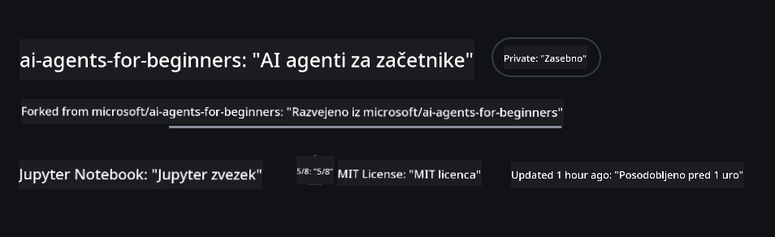
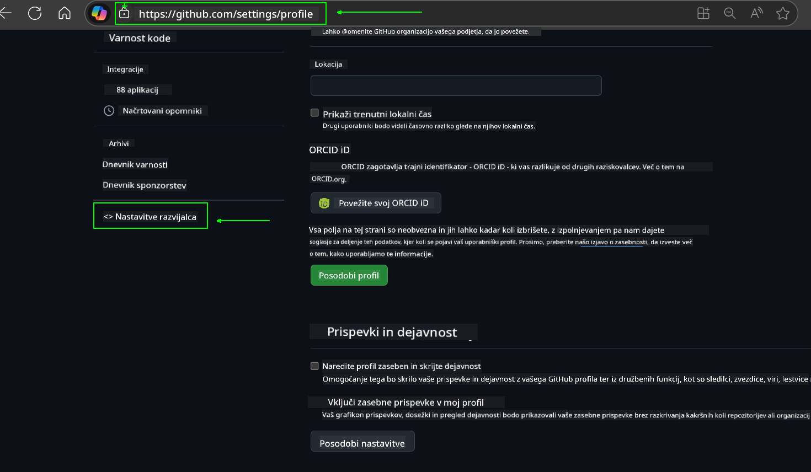
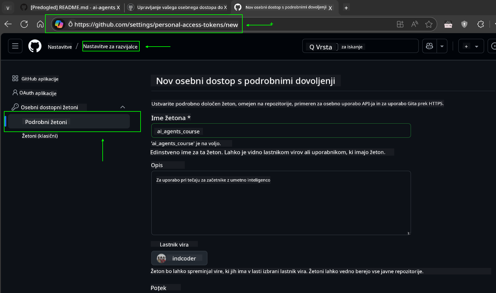
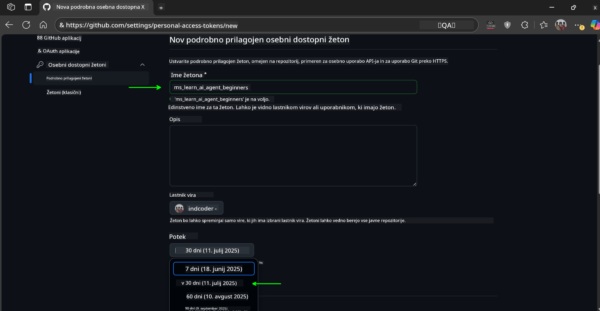
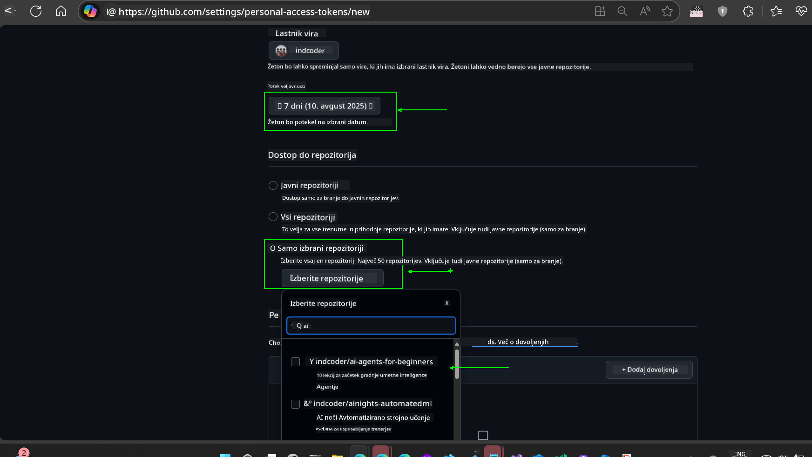
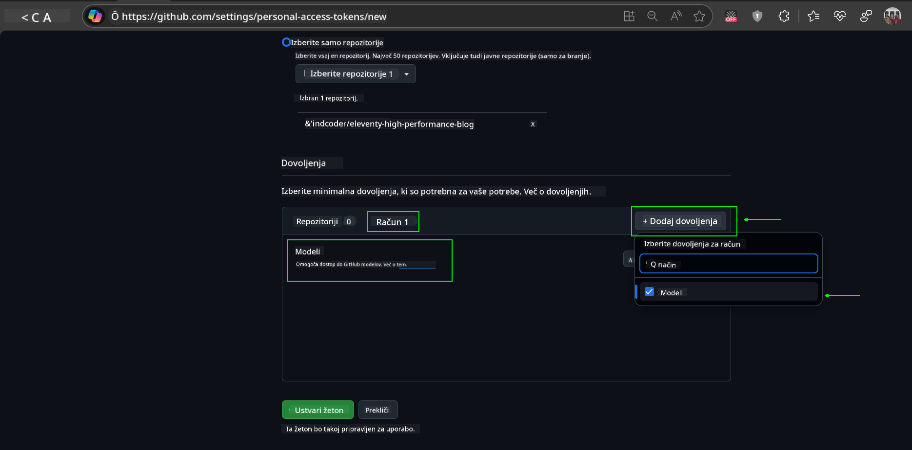
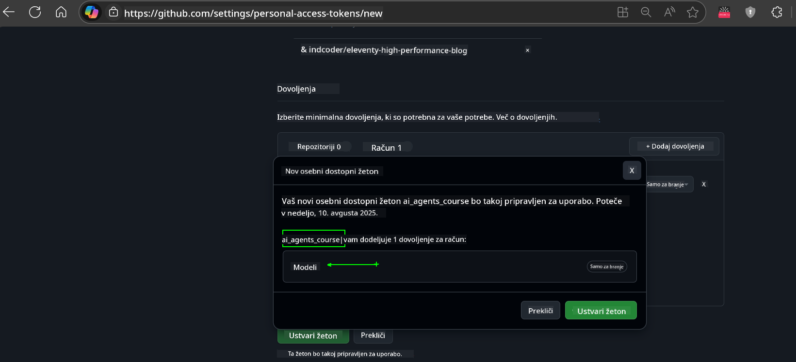
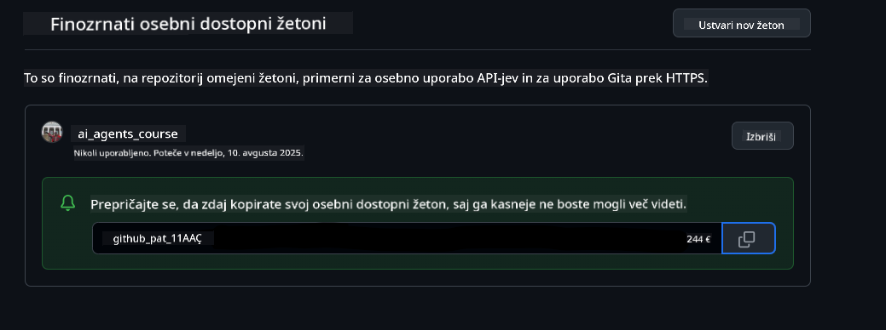
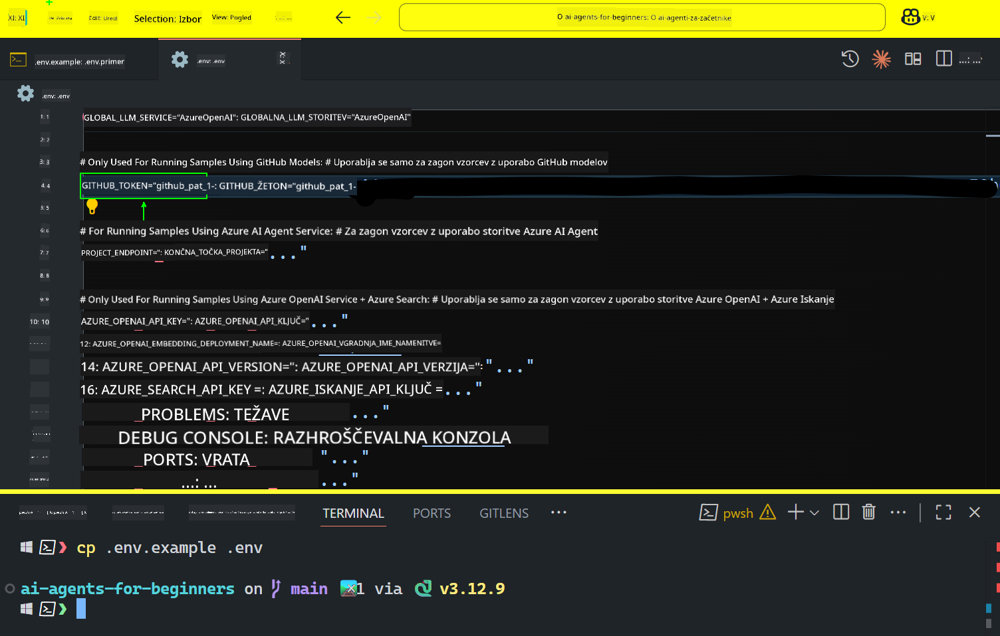
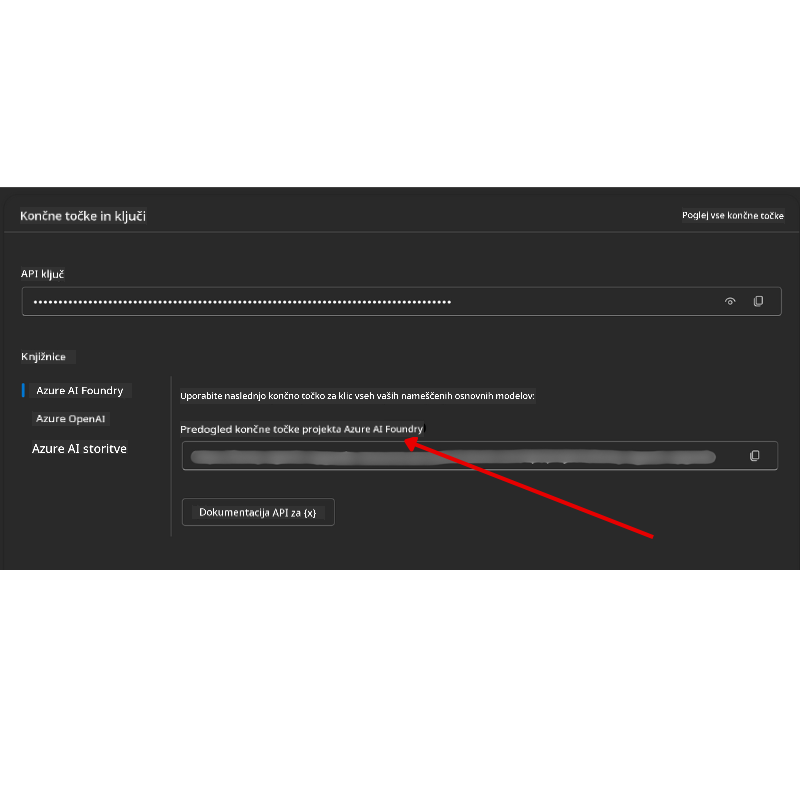

<!--
CO_OP_TRANSLATOR_METADATA:
{
  "original_hash": "c55b973b1562abf5aadf6a4028265ac5",
  "translation_date": "2025-08-29T23:16:10+00:00",
  "source_file": "00-course-setup/README.md",
  "language_code": "sl"
}
-->
# Nastavitev tečaja

## Uvod

Ta lekcija bo zajemala, kako zagnati vzorčne kode tega tečaja.

## Pridružite se drugim udeležencem in pridobite pomoč

Preden začnete klonirati svoj repozitorij, se pridružite [Discord kanalu AI Agents For Beginners](https://aka.ms/ai-agents/discord), kjer lahko dobite pomoč pri nastavitvi, postavite vprašanja o tečaju ali se povežete z drugimi udeleženci.

## Klonirajte ali razvejite ta repozitorij

Za začetek prosimo, da klonirate ali razvejite GitHub repozitorij. Tako boste ustvarili svojo različico gradiva tečaja, da boste lahko zagnali, testirali in prilagodili kodo!

To lahko storite s klikom na povezavo do

Imeti bi morali svojo razvejano različico tega tečaja na naslednji povezavi:



## Zagon kode

Ta tečaj ponuja serijo Jupyter Notebookov, ki jih lahko zaženete za praktično izkušnjo pri gradnji AI agentov.

Vzorčne kode uporabljajo:

**Zahteva GitHub račun - Brezplačno**:

1) Semantic Kernel Agent Framework + GitHub Models Marketplace. Označeno kot (semantic-kernel.ipynb)
2) AutoGen Framework + GitHub Models Marketplace. Označeno kot (autogen.ipynb)

**Zahteva naročnino na Azure**:
3) Azure AI Foundry + Azure AI Agent Service. Označeno kot (azureaiagent.ipynb)

Spodbujamo vas, da preizkusite vse tri vrste primerov, da vidite, kateri vam najbolj ustreza.

Ne glede na to, katero možnost izberete, bo to določilo, katere korake za nastavitev morate slediti spodaj:

## Zahteve

- Python 3.12+
  - **NOTE**: Če nimate nameščenega Python3.12, ga namestite. Nato ustvarite svoj venv z uporabo python3.12, da zagotovite, da so pravilne različice nameščene iz datoteke requirements.txt.
- GitHub račun - Za dostop do GitHub Models Marketplace
- Naročnina na Azure - Za dostop do Azure AI Foundry
- Azure AI Foundry račun - Za dostop do Azure AI Agent Service

V korenskem imeniku tega repozitorija smo vključili datoteko `requirements.txt`, ki vsebuje vse potrebne Python pakete za zagon vzorčnih kod.

Namestite jih lahko z naslednjim ukazom v terminalu v korenskem imeniku repozitorija:

```bash
pip install -r requirements.txt
```
Priporočamo, da ustvarite Python virtualno okolje, da se izognete morebitnim konfliktom in težavam.

## Nastavitev VSCode
Prepričajte se, da uporabljate pravilno različico Pythona v VSCode.


## Nastavitev za vzorce z uporabo GitHub modelov

### Korak 1: Pridobite svoj GitHub osebni dostopni žeton (PAT)

Ta tečaj uporablja GitHub Models Marketplace, ki omogoča brezplačen dostop do velikih jezikovnih modelov (LLM), ki jih boste uporabili za gradnjo AI agentov.

Za uporabo GitHub modelov boste morali ustvariti [GitHub osebni dostopni žeton](https://docs.github.com/en/authentication/keeping-your-account-and-data-secure/managing-your-personal-access-tokens).

To lahko storite tako, da obiščete svoj GitHub račun.

Prosimo, da sledite [načelu najmanjše privilegiranosti](https://docs.github.com/en/get-started/learning-to-code/storing-your-secrets-safely) pri ustvarjanju žetona. To pomeni, da žetonu dodelite le tista dovoljenja, ki jih potrebuje za zagon vzorčnih kod v tem tečaju.

1. Na levi strani zaslona izberite možnost `Fine-grained tokens` tako, da se pomaknete do **Developer settings**.
   

    Nato izberite `Generate new token`.

    

2. Vnesite opisno ime za svoj žeton, ki odraža njegov namen, da ga boste kasneje lažje prepoznali.

    🔐 Priporočilo za trajanje žetona

    Priporočeno trajanje: 30 dni
    Za bolj varno držo lahko izberete krajše obdobje—na primer 7 dni 🛡️
    To je odličen način, da si postavite osebni cilj in dokončate tečaj, medtem ko je vaš učni zagon visok 🚀.

    

3. Omejite obseg žetona na svojo razvejano različico tega repozitorija.

    

4. Omejite dovoljenja žetona: Pod **Permissions** kliknite zavihek **Account** in nato gumb "+ Add permissions". Prikaže se spustni meni. Prosimo, poiščite **Models** in označite polje zanj.
    

5. Preden ustvarite žeton, preverite zahtevana dovoljenja. 

6. Preden ustvarite žeton, se prepričajte, da ste pripravljeni shraniti žeton na varno mesto, kot je trezor za upravljanje gesel, saj ga po ustvarjanju ne boste več videli. 

Kopirajte svoj novi žeton, ki ste ga pravkar ustvarili. Zdaj ga boste dodali v svojo `.env` datoteko, ki je vključena v ta tečaj.

### Korak 2: Ustvarite svojo `.env` datoteko

Za ustvarjanje `.env` datoteke zaženite naslednji ukaz v terminalu.

```bash
cp .env.example .env
```

To bo kopiralo primer datoteke in ustvarilo `.env` v vašem imeniku, kjer boste izpolnili vrednosti za okoljske spremenljivke.

S kopiranim žetonom odprite `.env` datoteko v svojem najljubšem urejevalniku besedila in prilepite žeton v polje `GITHUB_TOKEN`.


Zdaj bi morali biti sposobni zagnati vzorčne kode tega tečaja.

## Nastavitev za vzorce z uporabo Azure AI Foundry in Azure AI Agent Service

### Korak 1: Pridobite končno točko svojega Azure projekta

Sledite korakom za ustvarjanje vozlišča in projekta v Azure AI Foundry, ki jih najdete tukaj: [Pregled virov vozlišča](https://learn.microsoft.com/en-us/azure/ai-foundry/concepts/ai-resources)

Ko ustvarite svoj projekt, boste morali pridobiti povezovalni niz za svoj projekt.

To lahko storite tako, da obiščete stran **Overview** svojega projekta v portalu Azure AI Foundry.



### Korak 2: Ustvarite svojo `.env` datoteko

Za ustvarjanje `.env` datoteke zaženite naslednji ukaz v terminalu.

```bash
cp .env.example .env
```

To bo kopiralo primer datoteke in ustvarilo `.env` v vašem imeniku, kjer boste izpolnili vrednosti za okoljske spremenljivke.

S kopiranim žetonom odprite `.env` datoteko v svojem najljubšem urejevalniku besedila in prilepite žeton v polje `PROJECT_ENDPOINT`.

### Korak 3: Prijavite se v Azure

Kot najboljšo prakso za varnost bomo uporabili [avtentikacijo brez ključa](https://learn.microsoft.com/azure/developer/ai/keyless-connections?tabs=csharp%2Cazure-cli?WT.mc_id=academic-105485-koreyst) za avtentikacijo v Azure OpenAI z Microsoft Entra ID.

Nato odprite terminal in zaženite `az login --use-device-code`, da se prijavite v svoj Azure račun.

Ko se prijavite, v terminalu izberite svojo naročnino.

## Dodatne okoljske spremenljivke - Azure Search in Azure OpenAI

Za lekcijo Agentic RAG - Lekcija 5 - so na voljo vzorci, ki uporabljajo Azure Search in Azure OpenAI.

Če želite zagnati te vzorce, boste morali dodati naslednje okoljske spremenljivke v svojo `.env` datoteko:

### Pregledna stran (Projekt)

- `AZURE_SUBSCRIPTION_ID` - Preverite **Project details** na strani **Overview** svojega projekta.

- `AZURE_AI_PROJECT_NAME` - Poglejte na vrh strani **Overview** svojega projekta.

- `AZURE_OPENAI_SERVICE` - Najdite to na zavihku **Included capabilities** za **Azure OpenAI Service** na strani **Overview**.

### Center za upravljanje

- `AZURE_OPENAI_RESOURCE_GROUP` - Pojdite na **Project properties** na strani **Overview** v **Management Center**.

- `GLOBAL_LLM_SERVICE` - Pod **Connected resources** poiščite ime povezave **Azure AI Services**. Če ni navedeno, preverite **Azure portal** pod svojo skupino virov za ime vira AI Services.

### Stran Modeli + Končne točke

- `AZURE_OPENAI_EMBEDDING_DEPLOYMENT_NAME` - Izberite svoj model za vdelavo (npr. `text-embedding-ada-002`) in zabeležite **Deployment name** iz podrobnosti modela.

- `AZURE_OPENAI_CHAT_DEPLOYMENT_NAME` - Izberite svoj model za klepet (npr. `gpt-4o-mini`) in zabeležite **Deployment name** iz podrobnosti modela.

### Azure portal

- `AZURE_OPENAI_ENDPOINT` - Poiščite **Azure AI services**, kliknite nanj, nato pojdite na **Resource Management**, **Keys and Endpoint**, pomaknite se navzdol do "Azure OpenAI endpoints" in kopirajte tistega, ki pravi "Language APIs".

- `AZURE_OPENAI_API_KEY` - Na istem zaslonu kopirajte KLJUČ 1 ali KLJUČ 2.

- `AZURE_SEARCH_SERVICE_ENDPOINT` - Poiščite svoj **Azure AI Search** vir, kliknite nanj in si oglejte **Overview**.

- `AZURE_SEARCH_API_KEY` - Nato pojdite na **Settings** in nato **Keys**, da kopirate primarni ali sekundarni skrbniški ključ.

### Zunanja spletna stran

- `AZURE_OPENAI_API_VERSION` - Obiščite stran [API version lifecycle](https://learn.microsoft.com/en-us/azure/ai-services/openai/api-version-deprecation#latest-ga-api-release) pod **Latest GA API release**.

### Nastavitev avtentikacije brez ključa

Namesto da bi svoje poverilnice kodirali, bomo uporabili povezavo brez ključa z Azure OpenAI. Za to bomo uvozili `DefaultAzureCredential` in kasneje poklicali funkcijo `DefaultAzureCredential`, da pridobimo poverilnico.

```python
from azure.identity import DefaultAzureCredential, InteractiveBrowserCredential
```

## Težave?

Če imate kakršne koli težave pri izvajanju te nastavitve, se pridružite našemu

## Naslednja lekcija

Zdaj ste pripravljeni zagnati kodo za ta tečaj. Veselo učenje o svetu AI agentov!

[Uvod v AI agente in primere uporabe agentov](../01-intro-to-ai-agents/README.md)

---

**Omejitev odgovornosti**:  
Ta dokument je bil preveden z uporabo storitve za prevajanje z umetno inteligenco [Co-op Translator](https://github.com/Azure/co-op-translator). Čeprav si prizadevamo za natančnost, vas prosimo, da upoštevate, da lahko avtomatizirani prevodi vsebujejo napake ali netočnosti. Izvirni dokument v njegovem maternem jeziku je treba obravnavati kot avtoritativni vir. Za ključne informacije priporočamo profesionalni človeški prevod. Ne prevzemamo odgovornosti za morebitna napačna razumevanja ali napačne interpretacije, ki bi nastale zaradi uporabe tega prevoda.