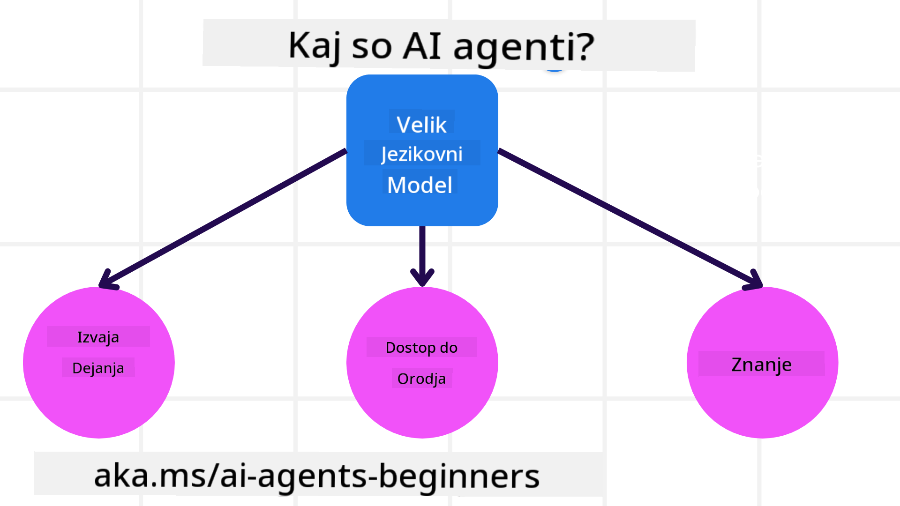
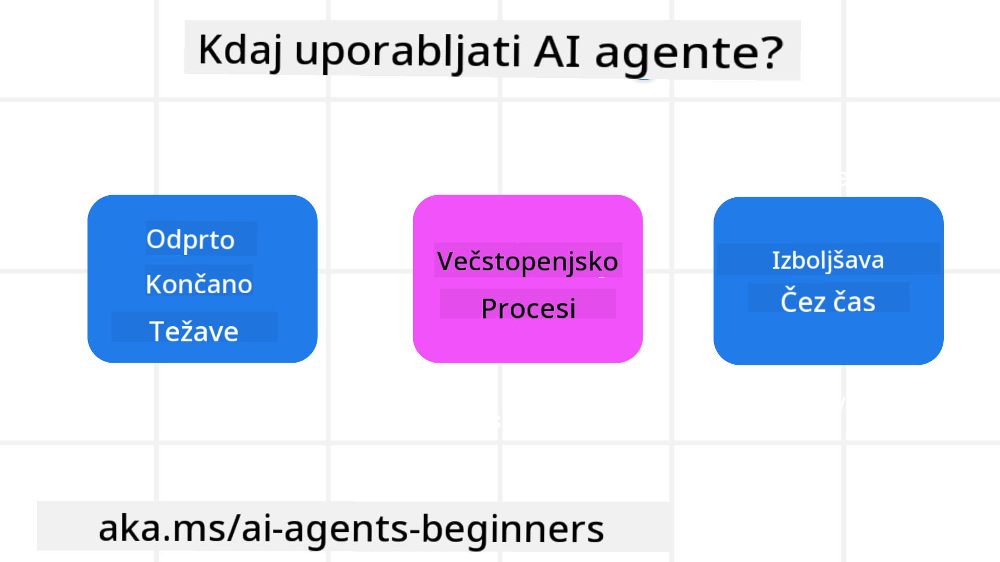

<!--
CO_OP_TRANSLATOR_METADATA:
{
  "original_hash": "d84943abc8f001ad4670418d32c2d899",
  "translation_date": "2025-07-12T08:13:22+00:00",
  "source_file": "01-intro-to-ai-agents/README.md",
  "language_code": "sl"
}
-->
da se srečate z drugimi udeleženci in graditelji AI agentov ter postavite vsa vprašanja, ki jih imate o tem tečaju.

Za začetek tega tečaja bomo najprej bolje razumeli, kaj so AI agenti in kako jih lahko uporabimo v aplikacijah in delovnih procesih, ki jih ustvarjamo.

## Uvod

Ta lekcija zajema:

- Kaj so AI agenti in kakšne so različne vrste agentov?
- Za katere primere uporabe so AI agenti najbolj primerni in kako nam lahko pomagajo?
- Kateri so osnovni gradniki pri oblikovanju agentnih rešitev?

## Cilji učenja
Po zaključku te lekcije boste znali:

- Razumeti pojme AI agentov in kako se razlikujejo od drugih AI rešitev.
- Najbolje uporabiti AI agente.
- Produktivno oblikovati agentne rešitve za uporabnike in stranke.

## Definicija AI agentov in vrste AI agentov

### Kaj so AI agenti?

AI agenti so **sistemi**, ki omogočajo **velikim jezikovnim modelom (LLM)**, da **izvedejo dejanja** tako, da razširijo njihove zmogljivosti z zagotavljanjem **dostopa do orodij** in **znanja**.

Razdelimo to definicijo na manjše dele:

- **Sistem** – Pomembno je, da agente ne obravnavamo kot en sam sestavni del, ampak kot sistem več komponent. Na osnovni ravni so sestavni deli AI agenta:
  - **Okolje** – Določen prostor, v katerem AI agent deluje. Na primer, če imamo AI agenta za rezervacijo potovanj, je okolje lahko sistem za rezervacijo potovanj, ki ga agent uporablja za opravljanje nalog.
  - **Senzorji** – Okolja vsebujejo informacije in zagotavljajo povratne informacije. AI agenti uporabljajo senzorje za zbiranje in interpretacijo teh informacij o trenutnem stanju okolja. V primeru agenta za rezervacijo potovanj lahko sistem za rezervacijo zagotovi informacije, kot so razpoložljivost hotelov ali cene letov.
  - **Aktuatorji** – Ko AI agent prejme trenutno stanje okolja, za trenutno nalogo določi, katero dejanje izvesti za spremembo okolja. Pri agentu za rezervacijo potovanj je to lahko rezervacija razpoložljive sobe za uporabnika.

**Veliki jezikovni modeli** – Koncept agentov je obstajal že pred nastankom LLM-jev. Prednost gradnje AI agentov z LLM-ji je njihova sposobnost interpretacije človeškega jezika in podatkov. Ta sposobnost omogoča LLM-jem interpretacijo informacij iz okolja in določanje načrta za spremembo okolja.

**Izvajanje dejanj** – Izven sistemov AI agentov so LLM-ji omejeni na situacije, kjer je dejanje ustvarjanje vsebine ali informacij na podlagi uporabnikovega poziva. Znotraj sistemov AI agentov lahko LLM-ji opravijo naloge tako, da interpretirajo uporabnikov zahtevek in uporabljajo orodja, ki so na voljo v njihovem okolju.

**Dostop do orodij** – Do katerih orodij ima LLM dostop, določa 1) okolje, v katerem deluje, in 2) razvijalec AI agenta. V primeru našega agenta za potovanja so orodja agenta omejena z operacijami, ki so na voljo v sistemu za rezervacijo, in/ali razvijalec lahko omeji dostop agenta do orodij, na primer le na lete.

**Spomin in znanje** – Spomin je lahko kratkoročen v kontekstu pogovora med uporabnikom in agentom. Dolgoročno, poleg informacij, ki jih zagotavlja okolje, lahko AI agenti pridobivajo znanje iz drugih sistemov, storitev, orodij in celo drugih agentov. V primeru agenta za potovanja je to lahko informacija o uporabnikovih potovalnih preferencah, shranjena v bazi podatkov strank.

### Različne vrste agentov

Zdaj, ko imamo splošno definicijo AI agentov, si poglejmo nekatere specifične vrste agentov in kako bi jih uporabili pri agentu za rezervacijo potovanj.

| **Vrsta agenta**             | **Opis**                                                                                                                            | **Primer**                                                                                                                                                                                                                   |
| ---------------------------- | ---------------------------------------------------------------------------------------------------------------------------------- | --------------------------------------------------------------------------------------------------------------------------------------------------------------------------------------------------------------------------- |
| **Preprosti refleksni agenti** | Izvajajo takojšnja dejanja na podlagi vnaprej določenih pravil.                                                                    | Agent za potovanja interpretira vsebino e-pošte in posreduje pritožbe glede potovanj službi za pomoč strankam.                                                                                                              |
| **Modelno osnovani refleksni agenti** | Izvajajo dejanja na podlagi modela sveta in sprememb tega modela.                                                                | Agent za potovanja daje prednost potovanjem z velikimi spremembami cen na podlagi dostopa do zgodovinskih podatkov o cenah.                                                                                                  |
| **Agenti, usmerjeni k ciljem** | Ustvarjajo načrte za dosego določenih ciljev z interpretacijo cilja in določanjem dejanj za njegovo dosego.                         | Agent za potovanja rezervira potovanje tako, da določi potrebne potovalne aranžmaje (avto, javni prevoz, leti) od trenutne lokacije do cilja.                                                                                 |
| **Agenti, usmerjeni k uporabnosti** | Upoštevajo preference in tehtajo kompromise numerično, da določijo, kako doseči cilje.                                            | Agent za potovanja maksimira uporabnost z tehtanjem udobja proti stroškom pri rezervaciji potovanja.                                                                                                                        |
| **Učeči se agenti**           | Izboljšujejo se skozi čas z odzivanjem na povratne informacije in prilagajanjem dejanj.                                            | Agent za potovanja se izboljšuje z uporabo povratnih informacij strank iz anket po potovanju za prilagoditve prihodnjih rezervacij.                                                                                         |
| **Hierarhični agenti**        | Vključujejo več agentov v večnivojskem sistemu, kjer višji agenti razdelijo naloge na podnaloge za nižje agente.                   | Agent za potovanja prekliče potovanje tako, da razdeli nalogo na podnaloge (npr. preklic posameznih rezervacij) in nižji agenti jih izvedejo ter poročajo višjemu agentu.                                                    |
| **Sistemi več agentov (MAS)** | Agenti opravljajo naloge neodvisno, bodisi sodelovalno ali tekmovalno.                                                             | Sodelovanje: Več agentov rezervira različne storitve, kot so hoteli, leti in zabava. Tekmovanje: Več agentov upravlja in tekmuje za skupni koledar rezervacij hotela, da stranke namesti v hotel.                            |

## Kdaj uporabljati AI agente

V prejšnjem razdelku smo uporabili primer agenta za potovanja, da pojasnimo, kako se različne vrste agentov uporabljajo v različnih scenarijih rezervacije potovanj. Ta aplikacija bo uporabljena skozi celoten tečaj.

Poglejmo vrste primerov uporabe, za katere so AI agenti najbolj primerni:

- **Odprte težave** – omogočanje LLM-ju, da določi potrebne korake za dokončanje naloge, saj jih ni vedno mogoče vnaprej kodirati v delovni proces.
- **Večstopenjski procesi** – naloge, ki zahtevajo določeno stopnjo kompleksnosti, kjer AI agent potrebuje uporabo orodij ali informacij skozi več korakov namesto enkratnega pridobivanja.
- **Izboljšave skozi čas** – naloge, kjer se agent lahko izboljšuje skozi čas z zbiranjem povratnih informacij iz okolja ali od uporabnikov, da zagotovi boljšo uporabnost.

Več o premislekih pri uporabi AI agentov bomo obravnavali v lekciji Gradnja zaupanja vrednih AI agentov.

## Osnove agentnih rešitev

### Razvoj agentov

Prvi korak pri oblikovanju sistema AI agenta je določitev orodij, dejanj in vedenj. V tem tečaju se osredotočamo na uporabo **Azure AI Agent Service** za definiranje naših agentov. Ponuja funkcije, kot so:

- Izbira odprtih modelov, kot so OpenAI, Mistral in Llama
- Uporaba licenciranih podatkov prek ponudnikov, kot je Tripadvisor
- Uporaba standardiziranih orodij OpenAPI 3.0

### Agentni vzorci

Komunikacija z LLM-ji poteka preko pozivov (prompts). Glede na polavtonomno naravo AI agentov ni vedno mogoče ali potrebno ročno ponovno pozivati LLM po spremembi v okolju. Uporabljamo **agentne vzorce**, ki nam omogočajo, da LLM pozivamo skozi več korakov na bolj razširljiv način.

Ta tečaj je razdeljen na nekatere trenutno priljubljene agentne vzorce.

### Agentni ogrodji

Agentni ogrodji razvijalcem omogočata implementacijo agentnih vzorcev preko kode. Ta ogrodja ponujajo predloge, vtičnike in orodja za boljše sodelovanje AI agentov. Te prednosti omogočajo boljšo opazljivost in odpravljanje težav v sistemih AI agentov.

V tem tečaju bomo raziskali raziskovalno usmerjeno ogrodje AutoGen in produkcijsko pripravljeno ogrodje Agent iz Semantic Kernel.

## Prejšnja lekcija

[Course Setup](../00-course-setup/README.md)

## Naslednja lekcija

[Exploring Agentic Frameworks](../02-explore-agentic-frameworks/README.md)

**Omejitev odgovornosti**:  
Ta dokument je bil preveden z uporabo AI prevajalske storitve [Co-op Translator](https://github.com/Azure/co-op-translator). Čeprav si prizadevamo za natančnost, vas opozarjamo, da avtomatizirani prevodi lahko vsebujejo napake ali netočnosti. Izvirni dokument v njegovem izvirnem jeziku velja za avtoritativni vir. Za ključne informacije priporočamo strokovni človeški prevod. Za morebitna nesporazume ali napačne interpretacije, ki izhajajo iz uporabe tega prevoda, ne odgovarjamo.