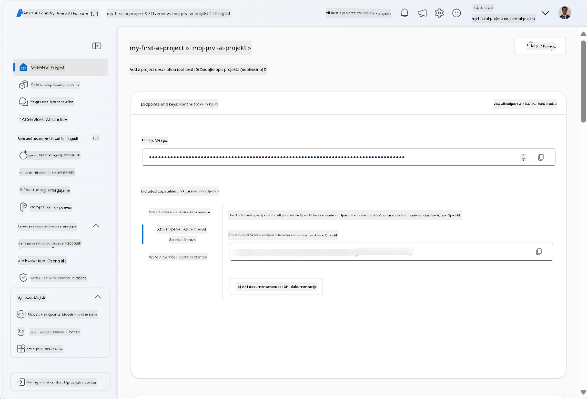
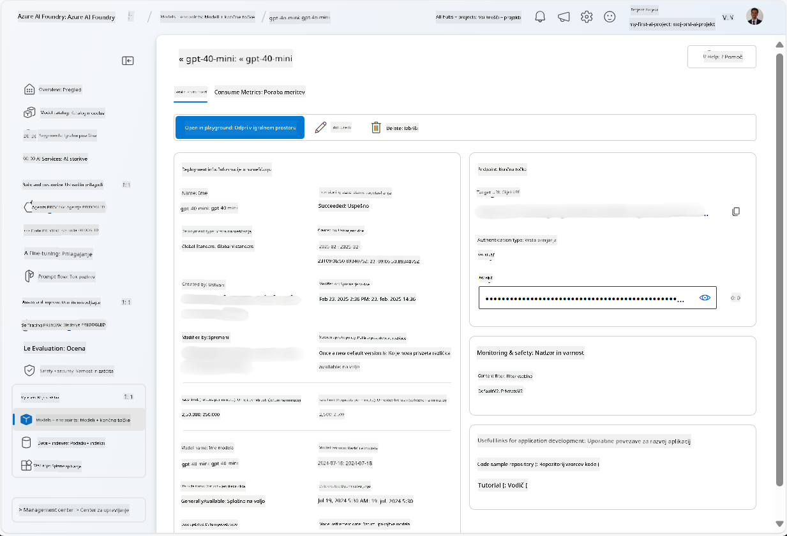
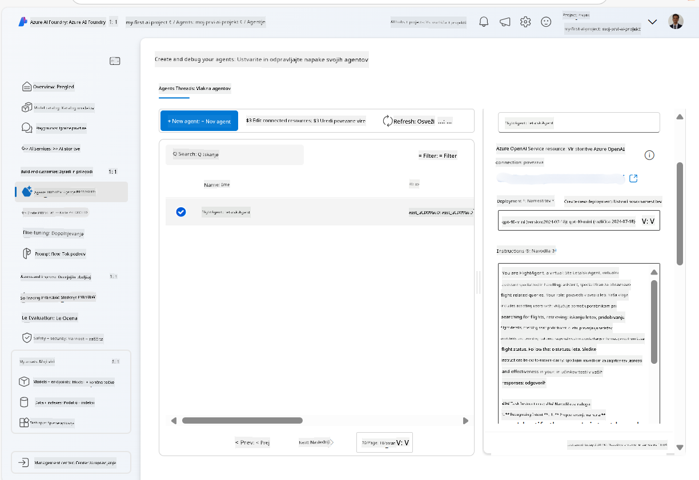
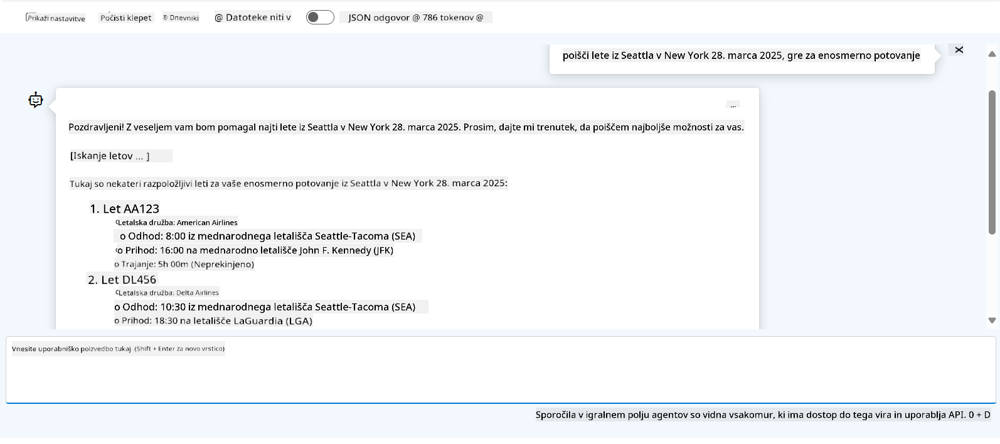

<!--
CO_OP_TRANSLATOR_METADATA:
{
  "original_hash": "7e92870dc0843e13d4dabc620c09d2d9",
  "translation_date": "2025-07-12T08:23:14+00:00",
  "source_file": "02-explore-agentic-frameworks/azure-ai-foundry-agent-creation.md",
  "language_code": "sl"
}
-->
# Razvoj storitve Azure AI Agent

V tej vaji boste uporabili orodja storitve Azure AI Agent v [Azure AI Foundry portalu](https://ai.azure.com/?WT.mc_id=academic-105485-koreyst) za ustvarjanje agenta za rezervacijo letov. Agent bo lahko komuniciral z uporabniki in zagotavljal informacije o letih.

## Predpogoji

Za dokončanje te vaje potrebujete naslednje:
1. Azure račun z aktivno naročnino. [Ustvarite brezplačen račun](https://azure.microsoft.com/free/?WT.mc_id=academic-105485-koreyst).
2. Potrebna so dovoljenja za ustvarjanje Azure AI Foundry huba ali pa naj vam ga nekdo ustvari.
    - Če imate vlogo Contributor ali Owner, lahko sledite korakom v tem vodiču.

## Ustvarjanje Azure AI Foundry huba

> **Note:** Azure AI Foundry je bil prej znan kot Azure AI Studio.

1. Sledite navodilom iz [Azure AI Foundry](https://learn.microsoft.com/en-us/azure/ai-studio/?WT.mc_id=academic-105485-koreyst) blog objave za ustvarjanje Azure AI Foundry huba.
2. Ko je vaš projekt ustvarjen, zaprite vse prikazane nasvete in si oglejte stran projekta v Azure AI Foundry portalu, ki naj bi izgledala podobno kot na spodnji sliki:

    

## Namestitev modela

1. V levem meniju vašega projekta, v razdelku **My assets**, izberite stran **Models + endpoints**.
2. Na strani **Models + endpoints**, v zavihku **Model deployments**, v meniju **+ Deploy model** izberite **Deploy base model**.
3. Poiščite model `gpt-4o-mini` na seznamu, ga izberite in potrdite.

    > **Note**: Zmanjšanje TPM pomaga preprečiti prekomerno porabo kvote, ki je na voljo v vaši naročnini.

    

## Ustvarjanje agenta

Ko ste namestili model, lahko ustvarite agenta. Agent je pogovorni AI model, ki se uporablja za interakcijo z uporabniki.

1. V levem meniju vašega projekta, v razdelku **Build & Customize**, izberite stran **Agents**.
2. Kliknite **+ Create agent** za ustvarjanje novega agenta. V pogovornem oknu **Agent Setup**:
    - Vnesite ime agenta, na primer `FlightAgent`.
    - Prepričajte se, da je izbran model `gpt-4o-mini`, ki ste ga prej namestili.
    - Nastavite **Instructions** glede na navodila, ki jih želite, da agent sledi. Tukaj je primer:
    ```
    You are FlightAgent, a virtual assistant specialized in handling flight-related queries. Your role includes assisting users with searching for flights, retrieving flight details, checking seat availability, and providing real-time flight status. Follow the instructions below to ensure clarity and effectiveness in your responses:

    ### Task Instructions:
    1. **Recognizing Intent**:
       - Identify the user's intent based on their request, focusing on one of the following categories:
         - Searching for flights
         - Retrieving flight details using a flight ID
         - Checking seat availability for a specified flight
         - Providing real-time flight status using a flight number
       - If the intent is unclear, politely ask users to clarify or provide more details.
        
    2. **Processing Requests**:
        - Depending on the identified intent, perform the required task:
        - For flight searches: Request details such as origin, destination, departure date, and optionally return date.
        - For flight details: Request a valid flight ID.
        - For seat availability: Request the flight ID and date and validate inputs.
        - For flight status: Request a valid flight number.
        - Perform validations on provided data (e.g., formats of dates, flight numbers, or IDs). If the information is incomplete or invalid, return a friendly request for clarification.

    3. **Generating Responses**:
    - Use a tone that is friendly, concise, and supportive.
    - Provide clear and actionable suggestions based on the output of each task.
    - If no data is found or an error occurs, explain it to the user gently and offer alternative actions (e.g., refine search, try another query).
    
    ```
> [!NOTE]
> Za podrobnejši prompt si lahko ogledate [to repozitorij](https://github.com/ShivamGoyal03/RoamMind) za več informacij.
    
> Poleg tega lahko dodate **Knowledge Base** in **Actions**, da izboljšate zmogljivosti agenta za zagotavljanje dodatnih informacij in izvajanje avtomatiziranih nalog na podlagi uporabniških zahtev. Za to vajo lahko te korake preskočite.
    


3. Če želite ustvariti novega multi-AI agenta, preprosto kliknite **New Agent**. Novoustanovljeni agent bo nato prikazan na strani Agents.

## Preizkus agenta

Po ustvarjanju agenta ga lahko preizkusite, da vidite, kako odgovarja na uporabniške poizvedbe v Azure AI Foundry portalu v okolju za preizkušanje.

1. Na vrhu **Setup** panela za vašega agenta izberite **Try in playground**.
2. V **Playground** panelu lahko komunicirate z agentom tako, da v klepetalno okno vnesete poizvedbe. Na primer, lahko agenta vprašate, naj poišče lete iz Seattla v New York 28. v mesecu.

    > **Note**: Agent morda ne bo dajal natančnih odgovorov, saj v tej vaji ne uporabljamo podatkov v realnem času. Namen je preizkusiti sposobnost agenta, da razume in odgovori na uporabniške poizvedbe glede na podana navodila.

    

3. Po preizkusu agenta ga lahko dodatno prilagodite z dodajanjem več namenov, učnih podatkov in dejanj za izboljšanje njegovih zmogljivosti.

## Čiščenje virov

Ko končate s preizkušanjem agenta, ga lahko izbrišete, da se izognete dodatnim stroškom.
1. Odprite [Azure portal](https://portal.azure.com) in si oglejte vsebino skupine virov, kjer ste namestili hub vire, uporabljene v tej vaji.
2. Na orodni vrstici izberite **Delete resource group**.
3. Vnesite ime skupine virov in potrdite, da jo želite izbrisati.

## Viri

- [Azure AI Foundry dokumentacija](https://learn.microsoft.com/en-us/azure/ai-studio/?WT.mc_id=academic-105485-koreyst)
- [Azure AI Foundry portal](https://ai.azure.com/?WT.mc_id=academic-105485-koreyst)
- [Začetek z Azure AI Studio](https://techcommunity.microsoft.com/blog/educatordeveloperblog/getting-started-with-azure-ai-studio/4095602?WT.mc_id=academic-105485-koreyst)
- [Osnove AI agentov na Azure](https://learn.microsoft.com/en-us/training/modules/ai-agent-fundamentals/?WT.mc_id=academic-105485-koreyst)
- [Azure AI Discord](https://aka.ms/AzureAI/Discord)

**Omejitev odgovornosti**:  
Ta dokument je bil preveden z uporabo AI prevajalske storitve [Co-op Translator](https://github.com/Azure/co-op-translator). Čeprav si prizadevamo za natančnost, vas opozarjamo, da avtomatizirani prevodi lahko vsebujejo napake ali netočnosti. Izvirni dokument v njegovem izvirnem jeziku velja za avtoritativni vir. Za ključne informacije priporočamo strokovni človeški prevod. Za morebitna nesporazume ali napačne interpretacije, ki izhajajo iz uporabe tega prevoda, ne odgovarjamo.