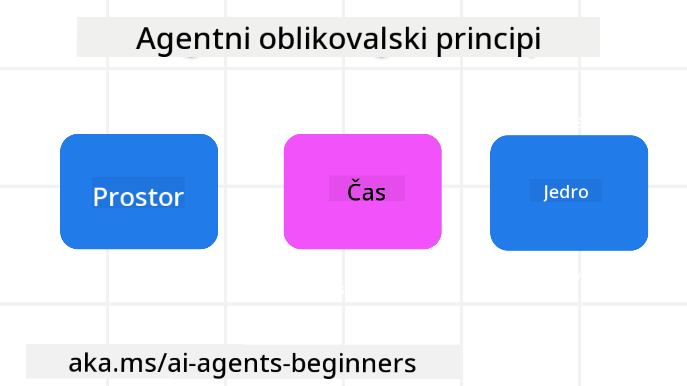

<!--
CO_OP_TRANSLATOR_METADATA:
{
  "original_hash": "4c46e4ff9e349c521e2b0b17f51afa64",
  "translation_date": "2025-08-29T23:20:33+00:00",
  "source_file": "03-agentic-design-patterns/README.md",
  "language_code": "sl"
}
-->

> _(Kliknite na zgornjo sliko za ogled videa te lekcije)_
# Načela oblikovanja agentov AI

## Uvod

Obstaja veliko načinov razmišljanja o gradnji sistemov AI agentov. Glede na to, da je dvoumnost značilnost in ne napaka pri oblikovanju generativne umetne inteligence, je včasih težko za inženirje ugotoviti, kje sploh začeti. Ustvarili smo niz načel oblikovanja uporabniške izkušnje, osredotočenih na človeka, da bi razvijalcem omogočili gradnjo sistemov agentov, osredotočenih na stranke, za reševanje njihovih poslovnih potreb. Ta načela oblikovanja niso predpisana arhitektura, temveč izhodišče za ekipe, ki definirajo in gradijo izkušnje z agenti.

Na splošno bi morali agenti:

- Razširiti in povečati človeške sposobnosti (možganska nevihta, reševanje problemov, avtomatizacija itd.)
- Zapolniti vrzeli v znanju (pridobivanje informacij o področjih znanja, prevajanje itd.)
- Omogočiti in podpirati sodelovanje na način, ki nam kot posameznikom ustreza pri delu z drugimi
- Narediti nas boljše različice samih sebe (npr. življenjski trener/nadzornik nalog, pomoč pri učenju čustvene regulacije in veščin čuječnosti, gradnja odpornosti itd.)

## Ta lekcija bo obravnavala

- Kaj so načela oblikovanja agentov
- Katere smernice je treba upoštevati pri izvajanju teh načel oblikovanja
- Nekaj primerov uporabe teh načel oblikovanja

## Cilji učenja

Po zaključku te lekcije boste lahko:

1. Razložili, kaj so načela oblikovanja agentov
2. Razložili smernice za uporabo načel oblikovanja agentov
3. Razumeli, kako zgraditi agenta z uporabo načel oblikovanja agentov

## Načela oblikovanja agentov

### Agent (Prostor)

To je okolje, v katerem agent deluje. Ta načela usmerjajo, kako oblikujemo agente za delovanje v fizičnih in digitalnih svetovih.

- **Povezovanje, ne razpadanje** – pomagajte povezovati ljudi z drugimi ljudmi, dogodki in uporabnim znanjem za omogočanje sodelovanja in povezovanja.
- Agenti pomagajo povezovati dogodke, znanje in ljudi.
- Agenti približujejo ljudi. Niso zasnovani za nadomeščanje ali omalovaževanje ljudi.
- **Enostavno dostopni, a občasno nevidni** – agent večinoma deluje v ozadju in nas opozori le, ko je to relevantno in primerno.
  - Agent je enostavno odkriti in dostopen za pooblaščene uporabnike na katerikoli napravi ali platformi.
  - Agent podpira večmodalne vnose in izhode (zvok, glas, besedilo itd.).
  - Agent lahko brez težav prehaja med ospredjem in ozadjem; med proaktivnim in reaktivnim, odvisno od zaznavanja potreb uporabnika.
  - Agent lahko deluje v nevidni obliki, vendar je njegova pot ozadnih procesov in sodelovanje z drugimi agenti uporabniku transparentna in nadzorljiva.

### Agent (Čas)

To je način, kako agent deluje skozi čas. Ta načela usmerjajo, kako oblikujemo agente za interakcijo skozi preteklost, sedanjost in prihodnost.

- **Preteklost**: Razmislek o zgodovini, ki vključuje tako stanje kot kontekst.
  - Agent zagotavlja bolj relevantne rezultate na podlagi analize bogatejših zgodovinskih podatkov, ne le dogodkov, ljudi ali stanj.
  - Agent ustvarja povezave iz preteklih dogodkov in aktivno razmišlja o spominu za vključitev v trenutne situacije.
- **Sedaj**: Spodbujanje bolj kot obveščanje.
  - Agent uteleša celovit pristop k interakciji z ljudmi. Ko se zgodi dogodek, agent presega statično obvestilo ali drugo statično formalnost. Agent lahko poenostavi tokove ali dinamično ustvari namige za usmerjanje pozornosti uporabnika ob pravem trenutku.
  - Agent dostavlja informacije na podlagi kontekstualnega okolja, socialnih in kulturnih sprememb ter prilagojene namenu uporabnika.
  - Interakcija z agentom je lahko postopna, razvijajoča se v kompleksnosti, da dolgoročno opolnomoči uporabnike.
- **Prihodnost**: Prilagajanje in evolucija.
  - Agent se prilagaja različnim napravam, platformam in modalnostim.
  - Agent se prilagaja vedenju uporabnika, potrebam po dostopnosti in je prosto prilagodljiv.
  - Agent se oblikuje in razvija skozi neprekinjeno interakcijo z uporabnikom.

### Agent (Jedro)

To so ključni elementi v jedru oblikovanja agenta.

- **Sprejemanje negotovosti, a vzpostavljanje zaupanja**.
  - Določena stopnja negotovosti agenta je pričakovana. Negotovost je ključni element oblikovanja agenta.
  - Zaupanje in transparentnost sta temeljni plasti oblikovanja agenta.
  - Ljudje nadzorujejo, kdaj je agent vklopljen/izklopljen, in status agenta je ves čas jasno viden.

## Smernice za izvajanje teh načel

Ko uporabljate prejšnja načela oblikovanja, upoštevajte naslednje smernice:

1. **Transparentnost**: Obvestite uporabnika, da je vključen AI, kako deluje (vključno s preteklimi dejanji) in kako podati povratne informacije ter spremeniti sistem.
2. **Nadzor**: Omogočite uporabniku prilagoditev, določanje preferenc in personalizacijo ter nadzor nad sistemom in njegovimi atributi (vključno z možnostjo pozabe).
3. **Doslednost**: Ciljajte na dosledne, večmodalne izkušnje na različnih napravah in končnih točkah. Uporabite znane elemente UI/UX, kjer je to mogoče (npr. ikona mikrofona za glasovno interakcijo) in čim bolj zmanjšajte kognitivno obremenitev stranke (npr. ciljte na jedrnate odgovore, vizualne pripomočke in vsebino »Več o tem«).

## Kako oblikovati potovalnega agenta z uporabo teh načel in smernic

Predstavljajte si, da oblikujete potovalnega agenta, tukaj je, kako bi lahko razmišljali o uporabi načel oblikovanja in smernic:

1. **Transparentnost** – Obvestite uporabnika, da je potovalni agent agent, ki temelji na AI. Zagotovite nekaj osnovnih navodil za začetek (npr. sporočilo »Pozdravljeni«, primeri pozivov). Jasno dokumentirajte to na strani izdelka. Prikažite seznam pozivov, ki jih je uporabnik podal v preteklosti. Jasno pokažite, kako podati povratne informacije (gumb za všečkanje in nevšečkanje, gumb Pošlji povratne informacije itd.). Jasno navedite, ali ima agent omejitve uporabe ali tem.
2. **Nadzor** – Poskrbite, da bo jasno, kako lahko uporabnik spremeni agenta po tem, ko je bil ustvarjen, z elementi, kot je sistemski poziv. Omogočite uporabniku izbiro, kako obširen je agent, njegov slog pisanja in morebitne omejitve glede tem, o katerih agent ne sme govoriti. Dovolite uporabniku ogled in brisanje povezanih datotek ali podatkov, pozivov in preteklih pogovorov.
3. **Doslednost** – Poskrbite, da bodo ikone za deljenje poziva, dodajanje datoteke ali fotografije ter označevanje nekoga ali nečesa standardne in prepoznavne. Uporabite ikono s sponko za papir za označevanje nalaganja/deljenja datotek z agentom in ikono slike za označevanje nalaganja grafike.

### Imate več vprašanj o vzorcih oblikovanja agentov AI?

Pridružite se [Azure AI Foundry Discord](https://aka.ms/ai-agents/discord), da se povežete z drugimi učenci, udeležite uradnih ur in dobite odgovore na svoja vprašanja o agentih AI.

## Dodatni viri

## Prejšnja lekcija

[Raziskovanje okvirjev agentov](../02-explore-agentic-frameworks/README.md)

## Naslednja lekcija

[Vzorec oblikovanja uporabe orodij](../04-tool-use/README.md)

---

**Omejitev odgovornosti**:  
Ta dokument je bil preveden z uporabo storitve za prevajanje z umetno inteligenco [Co-op Translator](https://github.com/Azure/co-op-translator). Čeprav si prizadevamo za natančnost, vas prosimo, da upoštevate, da lahko avtomatizirani prevodi vsebujejo napake ali netočnosti. Izvirni dokument v njegovem maternem jeziku je treba obravnavati kot avtoritativni vir. Za ključne informacije priporočamo profesionalni človeški prevod. Ne prevzemamo odgovornosti za morebitna napačna razumevanja ali napačne interpretacije, ki bi nastale zaradi uporabe tega prevoda.