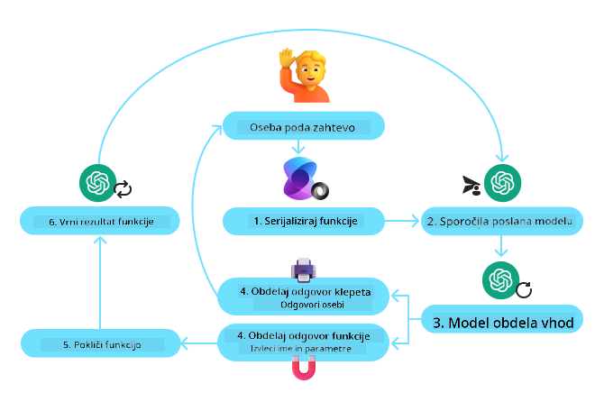
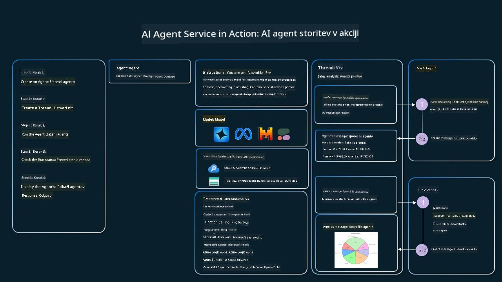

<!--
CO_OP_TRANSLATOR_METADATA:
{
  "original_hash": "88258b03f2893aa2e69eb8fb24baabbc",
  "translation_date": "2025-07-12T09:46:11+00:00",
  "source_file": "04-tool-use/README.md",
  "language_code": "sl"
}
-->
[](https://youtu.be/vieRiPRx-gI?si=cEZ8ApnT6Sus9rhn)

> _(Kliknite na zgornjo sliko za ogled videa te lekcije)_

# Vzorec oblikovanja uporabe orodij

Orodja so zanimiva, ker AI agentom omogočajo širši nabor zmožnosti. Namesto da bi imel agent omejen nabor dejanj, ki jih lahko izvede, lahko z dodajanjem orodja agent zdaj opravi širok spekter dejanj. V tem poglavju bomo pogledali vzorec oblikovanja uporabe orodij, ki opisuje, kako lahko AI agenti uporabljajo specifična orodja za dosego svojih ciljev.

## Uvod

V tej lekciji želimo odgovoriti na naslednja vprašanja:

- Kaj je vzorec oblikovanja uporabe orodij?
- Za katere primere uporabe ga lahko uporabimo?
- Kateri elementi/gradniki so potrebni za implementacijo tega vzorca?
- Katere posebne vidike je treba upoštevati pri uporabi vzorca uporabe orodij za gradnjo zaupanja vrednih AI agentov?

## Cilji učenja

Po zaključku te lekcije boste znali:

- Opredeliti vzorec oblikovanja uporabe orodij in njegov namen.
- Prepoznati primere uporabe, kjer je vzorec uporabe orodij primeren.
- Razumeti ključne elemente, potrebne za implementacijo vzorca.
- Prepoznati vidike za zagotavljanje zaupanja vrednosti AI agentov, ki uporabljajo ta vzorec.

## Kaj je vzorec oblikovanja uporabe orodij?

**Vzorec oblikovanja uporabe orodij** se osredotoča na to, da LLM-jem omogoči interakcijo z zunanjimi orodji za dosego specifičnih ciljev. Orodja so koda, ki jo agent lahko izvede za opravljanje dejanj. Orodje je lahko preprosta funkcija, kot je kalkulator, ali klic API-ja do storitve tretje osebe, na primer za iskanje cen delnic ali vremensko napoved. V kontekstu AI agentov so orodja zasnovana tako, da jih agenti izvajajo kot odgovor na **funkcijske klice, ki jih generira model**.

## Za katere primere uporabe ga lahko uporabimo?

AI agenti lahko izkoristijo orodja za dokončanje zahtevnih nalog, pridobivanje informacij ali sprejemanje odločitev. Vzorec uporabe orodij se pogosto uporablja v scenarijih, ki zahtevajo dinamično interakcijo z zunanjimi sistemi, kot so baze podatkov, spletne storitve ali interpretatorji kode. Ta zmožnost je uporabna za različne primere uporabe, med drugim:

- **Dinamično pridobivanje informacij:** Agenti lahko poizvedujejo zunanje API-je ali baze podatkov za pridobitev ažurnih podatkov (npr. poizvedba SQLite baze za analizo podatkov, pridobivanje cen delnic ali vremenskih informacij).
- **Izvajanje in interpretacija kode:** Agenti lahko izvajajo kodo ali skripte za reševanje matematičnih problemov, generiranje poročil ali izvajanje simulacij.
- **Avtomatizacija delovnih tokov:** Avtomatizacija ponavljajočih se ali večstopenjskih delovnih procesov z integracijo orodij, kot so načrtovalci opravil, e-poštne storitve ali podatkovni tokovi.
- **Podpora strankam:** Agenti lahko komunicirajo s CRM sistemi, platformami za upravljanje zahtevkov ali bazami znanja za reševanje uporabniških vprašanj.
- **Generiranje in urejanje vsebin:** Agenti lahko uporabljajo orodja, kot so preverjevalniki slovnice, povzemalniki besedil ali ocenjevalci varnosti vsebin, za pomoč pri ustvarjanju vsebin.

## Kateri elementi/gradniki so potrebni za implementacijo vzorca uporabe orodij?

Ti gradniki omogočajo AI agentu izvajanje širokega spektra nalog. Poglejmo ključne elemente, potrebne za implementacijo vzorca uporabe orodij:

- **Sheme funkcij/orodij**: Podrobne definicije razpoložljivih orodij, vključno z imenom funkcije, namenom, zahtevanimi parametri in pričakovanimi izhodi. Te sheme omogočajo LLM-ju razumevanje, katera orodja so na voljo in kako sestaviti veljavne zahteve.

- **Logika izvajanja funkcij**: Določa, kako in kdaj se orodja kličejo glede na uporabnikovo namero in kontekst pogovora. To lahko vključuje module za načrtovanje, mehanizme usmerjanja ali pogojne tokove, ki dinamično določajo uporabo orodij.

- **Sistem za upravljanje sporočil**: Komponente, ki upravljajo potek pogovora med uporabniškimi vnosi, odgovori LLM-ja, klici orodij in njihovimi izhodi.

- **Okvir za integracijo orodij**: Infrastruktura, ki povezuje agenta z različnimi orodji, bodisi preprostimi funkcijami ali kompleksnimi zunanjimi storitvami.

- **Ravnanje z napakami in validacija**: Mehanizmi za obvladovanje napak pri izvajanju orodij, preverjanje parametrov in upravljanje nepričakovanih odzivov.

- **Upravljanje stanja**: Sledenje kontekstu pogovora, prejšnjim interakcijam z orodji in trajnim podatkom za zagotavljanje konsistence v večkrožnih interakcijah.

Nato si podrobneje poglejmo klicanje funkcij/orodij.

### Klicanje funkcij/orodij

Klicanje funkcij je glavni način, kako omogočimo velikim jezikovnim modelom (LLM) interakcijo z orodji. Pogosto boste videli, da se 'funkcija' in 'orodje' uporabljata izmenično, saj so 'funkcije' (bloki ponovno uporabne kode) pravzaprav 'orodja', ki jih agenti uporabljajo za opravljanje nalog. Da se koda funkcije lahko izvede, mora LLM primerjati uporabnikovo zahtevo z opisom funkcije. Za to se LLM-ju pošlje shema, ki vsebuje opise vseh razpoložljivih funkcij. LLM nato izbere najbolj primerno funkcijo za nalogo in vrne njeno ime ter argumente. Izbrana funkcija se nato izvede, njen odgovor pa se pošlje nazaj LLM-ju, ki uporabi informacije za odgovor uporabniku.

Za razvijalce, ki želijo implementirati klicanje funkcij za agente, potrebujete:

1. LLM model, ki podpira klicanje funkcij
2. Shemo, ki vsebuje opise funkcij
3. Kodo za vsako opisano funkcijo

Uporabimo primer pridobivanja trenutnega časa v mestu za ilustracijo:

1. **Inicializirajte LLM, ki podpira klicanje funkcij:**

    Ne vsi modeli podpirajo klicanje funkcij, zato je pomembno preveriti, ali vaš LLM to omogoča. <a href="https://learn.microsoft.com/azure/ai-services/openai/how-to/function-calling" target="_blank">Azure OpenAI</a> podpira klicanje funkcij. Začnemo lahko z inicializacijo Azure OpenAI klienta.

    ```python
    # Initialize the Azure OpenAI client
    client = AzureOpenAI(
        azure_endpoint = os.getenv("AZURE_OPENAI_ENDPOINT"), 
        api_key=os.getenv("AZURE_OPENAI_API_KEY"),  
        api_version="2024-05-01-preview"
    )
    ```

1. **Ustvarite shemo funkcije:**

    Nato definiramo JSON shemo, ki vsebuje ime funkcije, opis, kaj funkcija počne, ter imena in opise parametrov funkcije. To shemo nato posredujemo prej ustvarjenemu klientu skupaj z uporabnikovo zahtevo za čas v San Franciscu. Pomembno je poudariti, da je vrnjen rezultat **klic orodja**, **ne** končni odgovor na vprašanje. Kot smo že omenili, LLM vrne ime funkcije, ki jo je izbral za nalogo, in argumente, ki ji bodo posredovani.

    ```python
    # Function description for the model to read
    tools = [
        {
            "type": "function",
            "function": {
                "name": "get_current_time",
                "description": "Get the current time in a given location",
                "parameters": {
                    "type": "object",
                    "properties": {
                        "location": {
                            "type": "string",
                            "description": "The city name, e.g. San Francisco",
                        },
                    },
                    "required": ["location"],
                },
            }
        }
    ]
    ```
   
    ```python
  
    # Initial user message
    messages = [{"role": "user", "content": "What's the current time in San Francisco"}] 
  
    # First API call: Ask the model to use the function
      response = client.chat.completions.create(
          model=deployment_name,
          messages=messages,
          tools=tools,
          tool_choice="auto",
      )
  
      # Process the model's response
      response_message = response.choices[0].message
      messages.append(response_message)
  
      print("Model's response:")  

      print(response_message)
  
    ```

    ```bash
    Model's response:
    ChatCompletionMessage(content=None, role='assistant', function_call=None, tool_calls=[ChatCompletionMessageToolCall(id='call_pOsKdUlqvdyttYB67MOj434b', function=Function(arguments='{"location":"San Francisco"}', name='get_current_time'), type='function')])
    ```
  
1. **Koda funkcije, potrebna za izvedbo naloge:**

    Ko LLM izbere funkcijo, ki jo je treba zagnati, je potrebno implementirati in izvesti kodo, ki opravi nalogo. Kodo za pridobitev trenutnega časa lahko napišemo v Pythonu. Prav tako moramo napisati kodo za izvleček imena in argumentov iz response_message, da dobimo končni rezultat.

    ```python
      def get_current_time(location):
        """Get the current time for a given location"""
        print(f"get_current_time called with location: {location}")  
        location_lower = location.lower()
        
        for key, timezone in TIMEZONE_DATA.items():
            if key in location_lower:
                print(f"Timezone found for {key}")  
                current_time = datetime.now(ZoneInfo(timezone)).strftime("%I:%M %p")
                return json.dumps({
                    "location": location,
                    "current_time": current_time
                })
      
        print(f"No timezone data found for {location_lower}")  
        return json.dumps({"location": location, "current_time": "unknown"})
    ```

    ```python
     # Handle function calls
      if response_message.tool_calls:
          for tool_call in response_message.tool_calls:
              if tool_call.function.name == "get_current_time":
     
                  function_args = json.loads(tool_call.function.arguments)
     
                  time_response = get_current_time(
                      location=function_args.get("location")
                  )
     
                  messages.append({
                      "tool_call_id": tool_call.id,
                      "role": "tool",
                      "name": "get_current_time",
                      "content": time_response,
                  })
      else:
          print("No tool calls were made by the model.")  
  
      # Second API call: Get the final response from the model
      final_response = client.chat.completions.create(
          model=deployment_name,
          messages=messages,
      )
  
      return final_response.choices[0].message.content
     ```

    ```bash
      get_current_time called with location: San Francisco
      Timezone found for san francisco
      The current time in San Francisco is 09:24 AM.
     ```

Klicanje funkcij je srce večine, če ne vseh, vzorcev uporabe orodij za agente, vendar je njegova implementacija od začetka lahko včasih zahtevna. Kot smo se naučili v [Lekcija 2](../../../02-explore-agentic-frameworks), nam agentni okviri nudijo vnaprej pripravljene gradnike za implementacijo uporabe orodij.

## Primeri uporabe orodij z agentnimi okviri

Tukaj je nekaj primerov, kako lahko implementirate vzorec uporabe orodij z različnimi agentnimi okviri:

### Semantic Kernel

<a href="https://learn.microsoft.com/azure/ai-services/agents/overview" target="_blank">Semantic Kernel</a> je odprtokodni AI okvir za razvijalce .NET, Python in Java, ki delajo z velikimi jezikovnimi modeli (LLM). Poenostavlja postopek klicanja funkcij tako, da samodejno opisuje vaše funkcije in njihove parametre modelu preko procesa, imenovanega <a href="https://learn.microsoft.com/semantic-kernel/concepts/ai-services/chat-completion/function-calling/?pivots=programming-language-python#1-serializing-the-functions" target="_blank">serializacija</a>. Prav tako upravlja komunikacijo med modelom in vašo kodo. Ena od prednosti uporabe agentnega okvira, kot je Semantic Kernel, je tudi dostop do vnaprej pripravljenih orodij, kot sta <a href="https://github.com/microsoft/semantic-kernel/blob/main/python/samples/getting_started_with_agents/openai_assistant/step4_assistant_tool_file_search.py" target="_blank">Iskanje datotek</a> in <a href="https://github.com/microsoft/semantic-kernel/blob/main/python/samples/getting_started_with_agents/openai_assistant/step3_assistant_tool_code_interpreter.py" target="_blank">Interpretator kode</a>.

Naslednji diagram prikazuje postopek klicanja funkcij s Semantic Kernel:



V Semantic Kernel so funkcije/orodja imenovane <a href="https://learn.microsoft.com/semantic-kernel/concepts/plugins/?pivots=programming-language-python" target="_blank">vtičniki</a>. Funkcijo `get_current_time`, ki smo jo videli prej, lahko spremenimo v vtičnik tako, da jo naredimo v razred s funkcijo znotraj. Prav tako lahko uvozimo dekorator `kernel_function`, ki sprejme opis funkcije. Ko nato ustvarite kernel z GetCurrentTimePlugin, bo kernel samodejno serializiral funkcijo in njene parametre ter ustvaril shemo za pošiljanje LLM-ju.

```python
from semantic_kernel.functions import kernel_function

class GetCurrentTimePlugin:
    async def __init__(self, location):
        self.location = location

    @kernel_function(
        description="Get the current time for a given location"
    )
    def get_current_time(location: str = ""):
        ...

```

```python 
from semantic_kernel import Kernel

# Create the kernel
kernel = Kernel()

# Create the plugin
get_current_time_plugin = GetCurrentTimePlugin(location)

# Add the plugin to the kernel
kernel.add_plugin(get_current_time_plugin)
```
  
### Azure AI Agent Service

<a href="https://learn.microsoft.com/azure/ai-services/agents/overview" target="_blank">Azure AI Agent Service</a> je novejši agentni okvir, zasnovan za omogočanje razvijalcem, da varno gradijo, uvajajo in skalirajo kakovostne in razširljive AI agente, brez potrebe po upravljanju osnovnih računalniških in shranjevalnih virov. Še posebej je uporaben za poslovne aplikacije, saj gre za popolnoma upravljano storitev z varnostjo na ravni podjetja.

V primerjavi z razvojem neposredno z LLM API-jem, Azure AI Agent Service ponuja nekatere prednosti, med drugim:

- Samodejno klicanje orodij – ni potrebe po ročnem razčlenjevanju klica orodja, izvajanju orodja in upravljanju odziva; vse to se zdaj izvaja na strežniški strani
- Varnostno upravljani podatki – namesto upravljanja lastnega stanja pogovora lahko zanesete na niti, ki shranjujejo vse potrebne informacije
- Orodja, pripravljena za uporabo – orodja, s katerimi lahko komunicirate z vašimi podatkovnimi viri, kot so Bing, Azure AI Search in Azure Functions.

Orodja, ki so na voljo v Azure AI Agent Service, lahko razdelimo v dve kategoriji:

1. Orodja za znanje:
    - <a href="https://learn.microsoft.com/azure/ai-services/agents/how-to/tools/bing-grounding?tabs=python&pivots=overview" target="_blank">Povezava z Bing Search</a>
    - <a href="https://learn.microsoft.com/azure/ai-services/agents/how-to/tools/file-search?tabs=python&pivots=overview" target="_blank">Iskanje datotek</a>
    - <a href="https://learn.microsoft.com/azure/ai-services/agents/how-to/tools/azure-ai-search?tabs=azurecli%2Cpython&pivots=overview-azure-ai-search" target="_blank">Azure AI Search</a>

2. Orodja za dejanja:
    - <a href="https://learn.microsoft.com/azure/ai-services/agents/how-to/tools/function-calling?tabs=python&pivots=overview" target="_blank">Klicanje funkcij</a>
    - <a href="https://learn.microsoft.com/azure/ai-services/agents/how-to/tools/code-interpreter?tabs=python&pivots=overview" target="_blank">Interpretator kode</a>
    - <a href="https://learn.microsoft.com/azure/ai-services/agents/how-to/tools/openapi-spec?tabs=python&pivots=overview" target="_blank">Orodja, definirana z OpenAPI</a>
    - <a href="https://learn.microsoft.com/azure/ai-services/agents/how-to/tools/azure-functions?pivots=overview" target="_blank">Azure Functions</a>

Agent Service nam omogoča uporabo teh orodij skupaj kot `toolset`. Prav tako uporablja `niti`, ki sledijo zgodovini sporočil v določenem pogovoru.

Predstavljajte si, da ste prodajni agent v podjetju Contoso. Želite razviti pogovornega agenta, ki lahko odgovarja na vprašanja o vaših prodajnih podatkih.

Naslednja slika prikazuje, kako bi lahko uporabili Azure AI Agent Service za analizo vaših prodajnih podatkov:



Za uporabo katerega koli od teh orodij s storitvijo lahko ustvarimo klienta in definiramo orodje ali nabor orodij. Za praktično implementacijo lahko uporabimo naslednjo Python kodo. LLM bo lahko pogledal nabor orodij in se odločil, ali bo uporabil uporabniško ustvarjeno funkcijo `fetch_sales_data_using_sqlite_query` ali vnaprej pripravljeni Interpretator kode, odvisno od uporabnikove zahteve.

```python 
import os
from azure.ai.projects import AIProjectClient
from azure.identity import DefaultAzureCredential
from fecth_sales_data_functions import fetch_sales_data_using_sqlite_query # fetch_sales_data_using_sqlite_query function which can be found in a fetch_sales_data_functions.py file.
from azure.ai.projects.models import ToolSet, FunctionTool, CodeInterpreterTool

project_client = AIProjectClient.from_connection_string(
    credential=DefaultAzureCredential(),
    conn_str=os.environ["PROJECT_CONNECTION_STRING"],
)

# Initialize function calling agent with the fetch_sales_data_using_sqlite_query function and adding it to the toolset
fetch_data_function = FunctionTool(fetch_sales_data_using_sqlite_query)
toolset = ToolSet()
toolset.add(fetch_data_function)

# Initialize Code Interpreter tool and adding it to the toolset. 
code_interpreter = code_interpreter = CodeInterpreterTool()
toolset = ToolSet()
toolset.add(code_interpreter)

agent = project_client.agents.create_agent(
    model="gpt-4o-mini", name="my-agent", instructions="You are helpful agent", 
    toolset=toolset
)
```

## Katere posebne vidike je treba upoštevati pri uporabi vzorca uporabe orodij za gradnjo zaupanja vrednih AI agentov?

Pogosta skrb pri dinamično generiranem SQL-ju s strani LLM-jev je varnost, zlasti tveganje SQL injekcij ali zlonamernih dejanj, kot so brisanje ali spreminjanje baze podatkov. Čeprav so te skrbi upravičene, jih je mogoče učinkovito omiliti z ustrezno konfiguracijo dovoljenj za dostop do baze podatkov. Za večino baz podatkov to pomeni nastavitev baze kot samo za branje. Za podatkovne storitve, kot so PostgreSQL ali Azure SQL, naj bo aplikaciji dodeljena vloga samo za branje (SELECT).

Zagon aplikacije v varnem okolju dodatno poveča zaščito. V poslovnih scenarijih se podatki običajno izločijo in transformirajo iz operativnih sistemov v bazo podatkov ali skladišče podatkov, ki je samo za branje in ima uporabniku prijazno shemo. Ta pristop zagotavlja, da so podatki varni, optimizirani za zmogljivost in dostopnost ter da ima aplikacija omejen, samo za branje dostop.

## Dodatni viri

-
<a href="https://microsoft.github.io/build-your-first-agent-with-azure-ai-agent-service-workshop/" target="_blank">
Azure AI Agents Service delavnica</a>
- <a href="https://github.com/Azure-Samples/contoso-creative-writer/tree/main/docs/workshop" target="_blank">Contoso Creative Writer delavnica z več agenti</a>
- <a href="https://learn.microsoft.com/semantic-kernel/concepts/ai-services/chat-completion/function-calling/?pivots=programming-language-python#1-serializing-the-functions" target="_blank">Vodič za klic funkcij v Semantic Kernel</a>
- <a href="https://github.com/microsoft/semantic-kernel/blob/main/python/samples/getting_started_with_agents/openai_assistant/step3_assistant_tool_code_interpreter.py" target="_blank">Semantic Kernel interpretator kode</a>
- <a href="https://microsoft.github.io/autogen/dev/user-guide/core-user-guide/components/tools.html" target="_blank">Autogen orodja</a>

## Prejšnja lekcija

[Razumevanje agentnih oblikovalskih vzorcev](../03-agentic-design-patterns/README.md)

## Naslednja lekcija

[Agentic RAG](../05-agentic-rag/README.md)

**Omejitev odgovornosti**:  
Ta dokument je bil preveden z uporabo AI prevajalske storitve [Co-op Translator](https://github.com/Azure/co-op-translator). Čeprav si prizadevamo za natančnost, vas opozarjamo, da avtomatizirani prevodi lahko vsebujejo napake ali netočnosti. Izvirni dokument v njegovem izvirnem jeziku velja za avtoritativni vir. Za ključne informacije priporočamo strokovni človeški prevod. Za morebitna nesporazume ali napačne interpretacije, ki izhajajo iz uporabe tega prevoda, ne odgovarjamo.