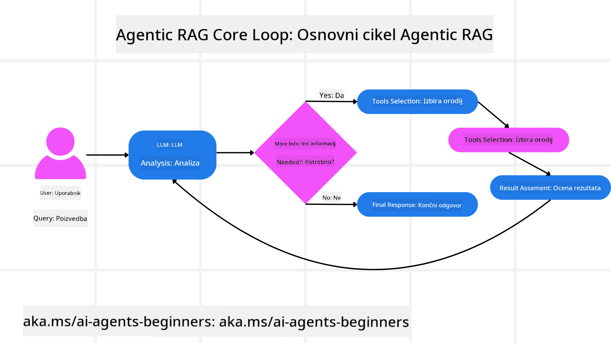
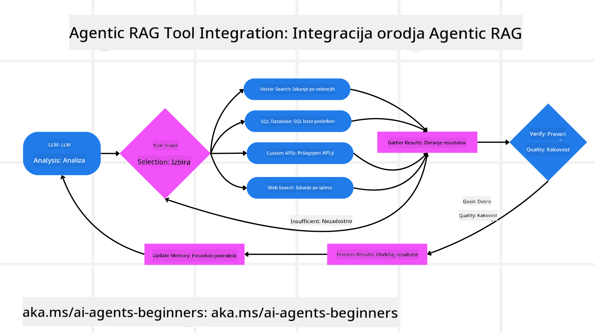
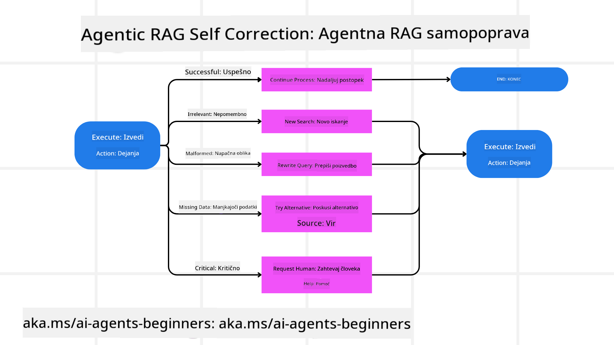
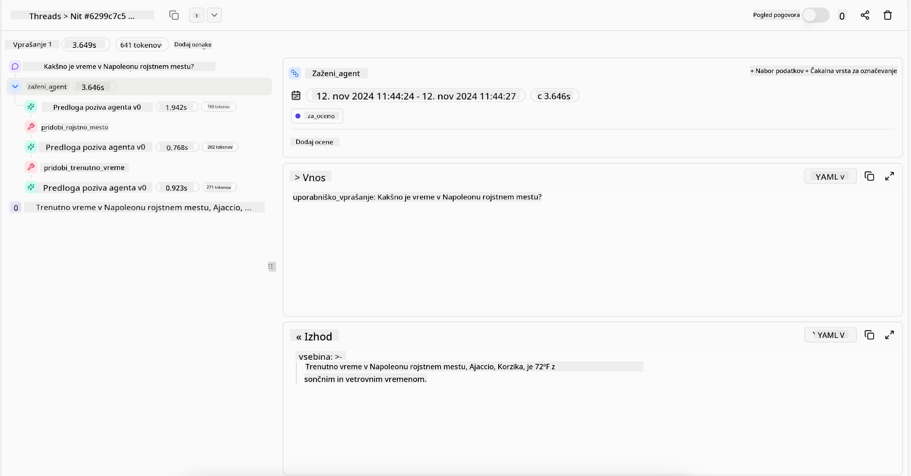
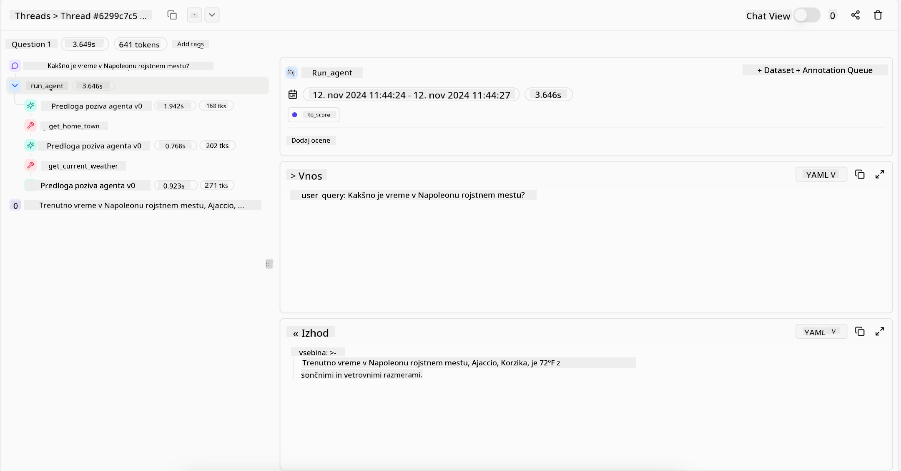

<!--
CO_OP_TRANSLATOR_METADATA:
{
  "original_hash": "7622aa72f9e676e593339f5f694ecd7d",
  "translation_date": "2025-07-12T10:14:38+00:00",
  "source_file": "05-agentic-rag/README.md",
  "language_code": "sl"
}
-->

> _(Kliknite na zgornjo sliko za ogled videa te lekcije)_

# Agentic RAG

Ta lekcija ponuja celovit pregled Agentic Retrieval-Augmented Generation (Agentic RAG), novega AI pristopa, kjer veliki jezikovni modeli (LLM) samostojno načrtujejo svoje naslednje korake, hkrati pa pridobivajo informacije iz zunanjih virov. V nasprotju s statičnimi vzorci pridobivanja in nato branja, Agentic RAG vključuje iterativne klice LLM, prepletene z uporabo orodij ali funkcij ter strukturiranimi izhodi. Sistem ocenjuje rezultate, izboljšuje poizvedbe, po potrebi kliče dodatna orodja in ta cikel ponavlja, dokler ne doseže zadovoljive rešitve.

## Uvod

V tej lekciji boste spoznali

- **Razumevanje Agentic RAG:** Spoznajte nov AI pristop, kjer veliki jezikovni modeli (LLM) samostojno načrtujejo naslednje korake, medtem ko pridobivajo informacije iz zunanjih podatkovnih virov.
- **Razumevanje iterativnega maker-checker sloga:** Razumite zanko iterativnih klicev LLM, prepletenih z uporabo orodij ali funkcij in strukturiranih izhodov, ki izboljšujejo pravilnost in obvladujejo nepravilne poizvedbe.
- **Raziskovanje praktičnih uporab:** Prepoznajte primere, kjer Agentic RAG izstopa, kot so okolja, ki dajejo prednost pravilnosti, kompleksne interakcije z bazami podatkov in daljši delovni procesi.

## Cilji učenja

Po zaključku te lekcije boste znali/razumeli:

- **Razumevanje Agentic RAG:** Spoznajte nov AI pristop, kjer veliki jezikovni modeli (LLM) samostojno načrtujejo naslednje korake, medtem ko pridobivajo informacije iz zunanjih podatkovnih virov.
- **Iterativni maker-checker slog:** Razumite koncept zanke iterativnih klicev LLM, prepletenih z uporabo orodij ali funkcij in strukturiranih izhodov, ki izboljšujejo pravilnost in obvladujejo nepravilne poizvedbe.
- **Obvladovanje procesa razmišljanja:** Razumite, kako sistem sam prevzame nadzor nad svojim procesom razmišljanja in odloča, kako pristopiti k problemom brez vnaprej določenih poti.
- **Delovni proces:** Razumite, kako agentni model samostojno odloča o pridobivanju poročil o tržnih trendih, identifikaciji podatkov o konkurenci, korelaciji notranjih prodajnih metrik, sintezi ugotovitev in oceni strategije.
- **Iterativne zanke, integracija orodij in pomnjenje:** Spoznajte, kako sistem temelji na zanki interakcij, ki ohranja stanje in pomnjenje skozi korake, da se izogne ponavljajočim zankam in sprejema premišljene odločitve.
- **Obvladovanje napak in samopopravljanje:** Raziskujte robustne mehanizme samopopravljanja sistema, vključno z iteriranjem in ponovnim poizvedovanjem, uporabo diagnostičnih orodij in zanašanjem na človeški nadzor.
- **Meje avtonomije:** Razumite omejitve Agentic RAG, osredotočene na domeno specifično avtonomijo, odvisnost od infrastrukture in spoštovanje varnostnih omejitev.
- **Praktični primeri uporabe in vrednost:** Prepoznajte primere, kjer Agentic RAG izstopa, kot so okolja, ki dajejo prednost pravilnosti, kompleksne interakcije z bazami podatkov in daljši delovni procesi.
- **Upravljanje, preglednost in zaupanje:** Spoznajte pomen upravljanja in preglednosti, vključno z razložljivim razmišljanjem, nadzorom pristranskosti in človeškim nadzorom.

## Kaj je Agentic RAG?

Agentic Retrieval-Augmented Generation (Agentic RAG) je nov AI pristop, kjer veliki jezikovni modeli (LLM) samostojno načrtujejo svoje naslednje korake, hkrati pa pridobivajo informacije iz zunanjih virov. V nasprotju s statičnimi vzorci pridobivanja in nato branja, Agentic RAG vključuje iterativne klice LLM, prepletene z uporabo orodij ali funkcij ter strukturiranimi izhodi. Sistem ocenjuje rezultate, izboljšuje poizvedbe, po potrebi kliče dodatna orodja in ta cikel ponavlja, dokler ne doseže zadovoljive rešitve. Ta iterativni “maker-checker” slog izboljšuje pravilnost, obvladuje nepravilne poizvedbe in zagotavlja visokokakovostne rezultate.

Sistem aktivno prevzame nadzor nad svojim procesom razmišljanja, preoblikuje neuspešne poizvedbe, izbira različne metode pridobivanja in integrira več orodij — kot so vektorsko iskanje v Azure AI Search, SQL baze podatkov ali prilagojeni API-ji — preden dokončno poda odgovor. Ključna lastnost agentnega sistema je njegova sposobnost, da samostojno upravlja svoj proces razmišljanja. Tradicionalne RAG implementacije se zanašajo na vnaprej določene poti, medtem ko agentni sistem sam določa zaporedje korakov glede na kakovost najdenih informacij.

## Definicija Agentic Retrieval-Augmented Generation (Agentic RAG)

Agentic Retrieval-Augmented Generation (Agentic RAG) je nov AI pristop, kjer LLM ne le pridobivajo informacije iz zunanjih podatkovnih virov, ampak tudi samostojno načrtujejo svoje naslednje korake. V nasprotju s statičnimi vzorci pridobivanja in nato branja ali skrbno pripravljenimi zaporedji pozivov, Agentic RAG vključuje zanko iterativnih klicev LLM, prepletenih z uporabo orodij ali funkcij ter strukturiranih izhodov. Vsakokrat sistem oceni pridobljene rezultate, odloči, ali je treba izboljšati poizvedbe, po potrebi kliče dodatna orodja in ta cikel ponavlja, dokler ne doseže zadovoljive rešitve.

Ta iterativni “maker-checker” način delovanja je zasnovan za izboljšanje pravilnosti, obvladovanje nepravilnih poizvedb v strukturiranih bazah podatkov (npr. NL2SQL) in zagotavljanje uravnoteženih, visokokakovostnih rezultatov. Namesto da bi se zanašal zgolj na skrbno zasnovane verige pozivov, sistem aktivno prevzame nadzor nad svojim procesom razmišljanja. Lahko preoblikuje neuspešne poizvedbe, izbere različne metode pridobivanja in integrira več orodij — kot so vektorsko iskanje v Azure AI Search, SQL baze podatkov ali prilagojeni API-ji — preden dokončno poda odgovor. To odpravlja potrebo po zapletenih orkestracijskih okvirjih. Namesto tega lahko razmeroma preprosta zanka “klic LLM → uporaba orodja → klic LLM → …” prinese sofisticirane in dobro utemeljene izhode.

## Prevzemanje nadzora nad procesom razmišljanja

Ključna lastnost, ki sistem naredi “agentnega”, je njegova sposobnost, da sam prevzame nadzor nad svojim procesom razmišljanja. Tradicionalne RAG implementacije pogosto temeljijo na tem, da ljudje vnaprej določijo pot za model: verigo razmišljanja, ki določa, kaj in kdaj pridobiti.
Ko pa je sistem resnično agenten, sam odloča, kako pristopiti k problemu. Ne izvaja zgolj skripte, ampak samostojno določa zaporedje korakov glede na kakovost najdenih informacij.
Na primer, če je sistem pozvan, naj ustvari strategijo lansiranja izdelka, se ne zanaša zgolj na poziv, ki opisuje celoten raziskovalni in odločilni proces. Namesto tega agentni model samostojno odloči, da bo:

1. Pridobil aktualna poročila o tržnih trendih z uporabo Bing Web Grounding
2. Identificiral relevantne podatke o konkurenci z uporabo Azure AI Search
3. Koreliral zgodovinske notranje prodajne metrike z uporabo Azure SQL Database
4. Sintetiziral ugotovitve v celovito strategijo, orkestrirano prek Azure OpenAI Service
5. Ocenil strategijo glede vrzeli ali neskladnosti in po potrebi sprožil nov krog pridobivanja informacij
Vsi ti koraki — izboljševanje poizvedb, izbira virov, iteriranje dokler ni “zadovoljen” z odgovorom — so odločitve modela, ne vnaprej napisane s strani človeka.

## Iterativne zanke, integracija orodij in pomnjenje

Agentni sistem temelji na vzorcu zanke interakcij:

- **Začetni klic:** Cilj uporabnika (t.j. uporabniški poziv) se predstavi LLM.
- **Klic orodja:** Če model zazna manjkajoče informacije ali nejasna navodila, izbere orodje ali metodo pridobivanja — na primer poizvedbo v vektorski bazi (npr. Azure AI Search Hybrid iskanje po zasebnih podatkih) ali strukturiran SQL klic — za zbiranje dodatnega konteksta.
- **Ocena in izboljšava:** Po pregledu vrnjenih podatkov model odloči, ali so informacije zadostne. Če ne, izboljša poizvedbo, preizkusi drugo orodje ali prilagodi pristop.
- **Ponavljanje dokler ni zadovoljstvo:** Ta cikel se nadaljuje, dokler model ne ugotovi, da ima dovolj jasnosti in dokazov za podajo končnega, dobro utemeljenega odgovora.
- **Pomnjenje in stanje:** Ker sistem ohranja stanje in pomnjenje skozi korake, si lahko zapomni prejšnje poskuse in njihove rezultate, s čimer se izogne ponavljajočim zankam in sprejema bolj premišljene odločitve med postopkom.

Sčasoma to ustvarja občutek razvijajočega se razumevanja, ki modelu omogoča, da obvladuje kompleksne, večstopenjske naloge brez stalnega človeškega posredovanja ali spreminjanja poziva.

## Obvladovanje napak in samopopravljanje

Avtonomija Agentic RAG vključuje tudi robustne mehanizme samopopravljanja. Ko sistem naleti na slepe ulice — na primer pridobivanje nerelevantnih dokumentov ali nepravilne poizvedbe — lahko:

- **Iterira in ponovno poizveduje:** Namesto da bi vrnil nizko vredne odgovore, model preizkusi nove strategije iskanja, preoblikuje poizvedbe v bazi podatkov ali pregleda alternativne podatkovne nize.
- **Uporablja diagnostična orodja:** Sistem lahko kliče dodatne funkcije, namenjene pomoči pri odpravljanju napak v korakih razmišljanja ali potrditvi pravilnosti pridobljenih podatkov. Orodja, kot je Azure AI Tracing, bodo pomembna za omogočanje robustne opaznosti in nadzora.
- **Zanaša se na človeški nadzor:** Pri pomembnih ali ponavljajoče neuspešnih scenarijih lahko model označi negotovost in zahteva človeško pomoč. Ko človek poda korektivne povratne informacije, jih model lahko upošteva v nadaljnjem delu.

Ta iterativni in dinamični pristop omogoča modelu stalno izboljševanje, kar zagotavlja, da ni le enkratni sistem, ampak se uči iz svojih napak med posamezno sejo.

## Meje avtonomije

Kljub svoji avtonomiji znotraj naloge Agentic RAG ni enakovreden umetni splošni inteligenci. Njegove “agentne” sposobnosti so omejene na orodja, podatkovne vire in politike, ki jih določijo ljudje razvijalci. Ne more si izumiti lastnih orodij ali preseči domen, ki so mu določene. Namesto tega odlično upravlja z razpoložljivimi viri.
Ključne razlike v primerjavi z bolj naprednimi oblikami AI so:

1. **Domeno specifična avtonomija:** Agentic RAG sistemi so osredotočeni na doseganje uporabniško določenih ciljev znotraj znane domene, z uporabo strategij, kot so preoblikovanje poizvedb ali izbira orodij za izboljšanje rezultatov.
2. **Odvisnost od infrastrukture:** Zmožnosti sistema so odvisne od orodij in podatkov, ki jih integrirajo razvijalci. Brez človeškega posredovanja ne more preseči teh meja.
3. **Spoštovanje varnostnih omejitev:** Etična pravila, skladnost in poslovne politike ostajajo zelo pomembne. Svoboda agenta je vedno omejena z varnostnimi ukrepi in nadzornimi mehanizmi (upajmo).

## Praktični primeri uporabe in vrednost

Agentic RAG izstopa v primerih, ki zahtevajo iterativno izboljševanje in natančnost:

1. **Okolja, ki dajejo prednost pravilnosti:** Pri preverjanju skladnosti, regulativnih analizah ali pravnih raziskavah lahko agentni model večkrat preverja dejstva, se posvetuje z več viri in preoblikuje poizvedbe, dokler ne ustvari temeljito preverjenega odgovora.
2. **Kompleksne interakcije z bazami podatkov:** Pri delu s strukturiranimi podatki, kjer poizvedbe pogosto ne uspejo ali jih je treba prilagoditi, lahko sistem samostojno izboljšuje poizvedbe z uporabo Azure SQL ali Microsoft Fabric OneLake, s čimer zagotovi, da končni rezultat ustreza uporabnikovim namenom.
3. **Daljši delovni procesi:** Daljše seje se lahko razvijajo, ko se pojavijo nove informacije. Agentic RAG lahko stalno vključuje nove podatke in prilagaja strategije, ko se uči več o problematiki.

## Upravljanje, preglednost in zaupanje

Ker ti sistemi postajajo vse bolj avtonomni v svojem razmišljanju, sta upravljanje in preglednost ključnega pomena:

- **Razložljivo razmišljanje:** Model lahko zagotovi sled poizvedb, ki jih je izvedel, virov, ki jih je uporabil, in korakov razmišljanja, ki jih je naredil, da pride do zaključka. Orodja, kot so Azure AI Content Safety in Azure AI Tracing / GenAIOps, pomagajo ohranjati preglednost in zmanjševati tveganja.
- **Nadzor pristranskosti in uravnoteženo pridobivanje:** Razvijalci lahko prilagajajo strategije pridobivanja, da zagotovijo uravnotežene in reprezentativne podatkovne vire ter redno preverjajo izhode za zaznavanje pristranskosti ali izkrivljenih vzorcev z uporabo prilagojenih modelov za napredne podatkovne znanstvene organizacije, ki uporabljajo Azure Machine Learning.
- **Človeški nadzor in skladnost:** Pri občutljivih nalogah je človeški pregled še vedno nujen. Agentic RAG ne nadomešča človeške presoje pri pomembnih odločitvah, temveč jo dopolnjuje z zagotavljanjem bolj temeljito preverjenih možnosti.

Imeti orodja, ki zagotavljajo jasen zapis dejanj, je bistvenega pomena. Brez njih je odpravljanje napak v večstopenjskem procesu zelo zahtevno. Spodaj je primer iz Literal AI (podjetje za Chainlit) za zagon agenta:

## Zaključek

Agentic RAG predstavlja naraven razvoj v načinu, kako AI sistemi obvladujejo kompleksne, podatkovno intenzivne naloge. Z uporabo vzorca zanke interakcij, samostojno izbiro orodij in izboljševanjem poizvedb do doseganja visokokakovostnih rezultatov sistem presega statično sledenje pozivom in postane bolj prilagodljiv, kontekstno zavedajoč se odločevalec. Čeprav je še vedno omejen z infrastrukturo in etičnimi smernicami, te agentne sposobnosti omogočajo bogatejše, bolj dinamične in na koncu bolj uporabne AI interakcije tako za podjetja kot končne uporabnike.

## Dodatni viri

- <a href="https://learn.microsoft.com/training/modules/use-own-data-azure-openai" target="_blank">Implement Retrieval Augmented Generation (RAG) with Azure OpenAI Service: Learn how to use your own data with the Azure OpenAI Service. This Microsoft Learn module provides a comprehensive guide on implementing RAG
</a>
- <a href="https://learn.microsoft.com/azure/ai-studio/concepts/evaluation-approach-gen-ai" target="_blank">Ocena generativnih AI aplikacij z Azure AI Foundry: Ta članek obravnava ocenjevanje in primerjavo modelov na javno dostopnih podatkih, vključno z Agentic AI aplikacijami in RAG arhitekturami</a>
- <a href="https://weaviate.io/blog/what-is-agentic-rag" target="_blank">Kaj je Agentic RAG | Weaviate</a>
- <a href="https://ragaboutit.com/agentic-rag-a-complete-guide-to-agent-based-retrieval-augmented-generation/" target="_blank">Agentic RAG: Celovit vodič po agentno osnovani generaciji z iskanjem – Novice iz generacije RAG</a>
- <a href="https://huggingface.co/learn/cookbook/agent_rag" target="_blank">Agentic RAG: pospešite svoj RAG z reformulacijo poizvedb in samopreiskovanjem! Hugging Face odprtokodna AI kuharica</a>
- <a href="https://youtu.be/aQ4yQXeB1Ss?si=2HUqBzHoeB5tR04U" target="_blank">Dodajanje agentnih plasti k RAG</a>
- <a href="https://www.youtube.com/watch?v=zeAyuLc_f3Q&t=244s" target="_blank">Prihodnost znanstvenih pomočnikov: Jerry Liu</a>
- <a href="https://www.youtube.com/watch?v=AOSjiXP1jmQ" target="_blank">Kako zgraditi agentne RAG sisteme</a>
- <a href="https://ignite.microsoft.com/sessions/BRK102?source=sessions" target="_blank">Uporaba Azure AI Foundry Agent Service za razširitev vaših AI agentov</a>

### Akademski članki

- <a href="https://arxiv.org/abs/2303.17651" target="_blank">2303.17651 Self-Refine: Iterativno izboljševanje s samopovratno informacijo</a>
- <a href="https://arxiv.org/abs/2303.11366" target="_blank">2303.11366 Reflexion: Jezikovni agenti z verbalnim učenjem s krepitvijo</a>
- <a href="https://arxiv.org/abs/2305.11738" target="_blank">2305.11738 CRITIC: Veliki jezikovni modeli se lahko samopopravijo z interaktivnim orodjem za kritiko</a>
- <a href="https://arxiv.org/abs/2501.09136" target="_blank">2501.09136 Agentic Retrieval-Augmented Generation: Pregled agentnega RAG</a>

## Prejšnja lekcija

[Oblika uporabe orodij](../04-tool-use/README.md)

## Naslednja lekcija

[Gradnja zaupanja vrednih AI agentov](../06-building-trustworthy-agents/README.md)

**Omejitev odgovornosti**:  
Ta dokument je bil preveden z uporabo storitve za avtomatski prevod AI [Co-op Translator](https://github.com/Azure/co-op-translator). Čeprav si prizadevamo za natančnost, vas opozarjamo, da lahko avtomatizirani prevodi vsebujejo napake ali netočnosti. Izvirni dokument v njegovem izvirnem jeziku velja za avtoritativni vir. Za ključne informacije priporočamo strokovni človeški prevod. Za morebitna nesporazume ali napačne interpretacije, ki izhajajo iz uporabe tega prevoda, ne odgovarjamo.