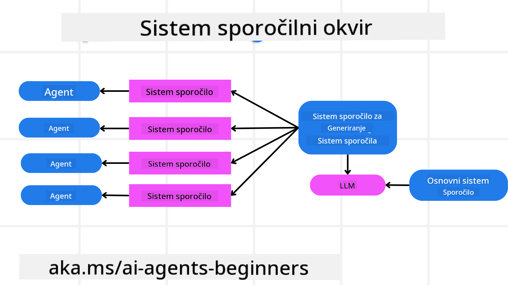
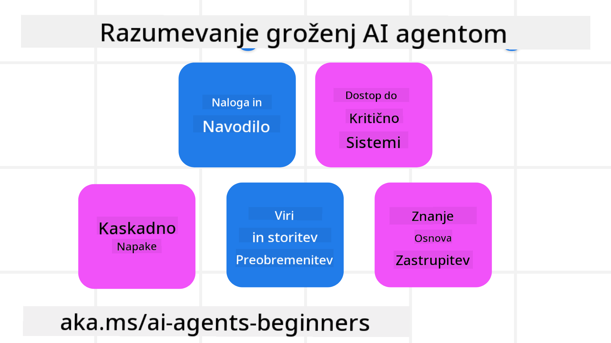
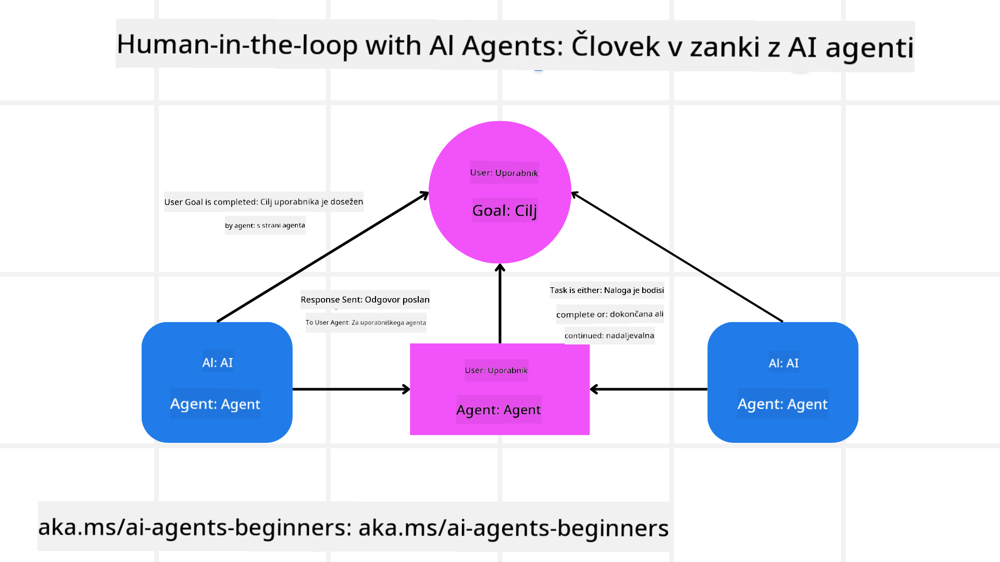

<!--
CO_OP_TRANSLATOR_METADATA:
{
  "original_hash": "f57852cac3a86c4a5ef47f793cc12178",
  "translation_date": "2025-07-12T10:33:29+00:00",
  "source_file": "06-building-trustworthy-agents/README.md",
  "language_code": "sl"
}
-->
[](https://youtu.be/iZKkMEGBCUQ?si=Q-kEbcyHUMPoHp8L)

> _(Kliknite na zgornjo sliko za ogled videa te lekcije)_

# Gradnja zaupanja vrednih AI agentov

## Uvod

V tej lekciji bomo obravnavali:

- Kako zgraditi in uvajati varne ter učinkovite AI agente
- Pomembne varnostne vidike pri razvoju AI agentov
- Kako ohranjati zasebnost podatkov in uporabnikov pri razvoju AI agentov

## Cilji učenja

Po zaključku te lekcije boste znali:

- Prepoznati in ublažiti tveganja pri ustvarjanju AI agentov
- Uvesti varnostne ukrepe za ustrezno upravljanje podatkov in dostopa
- Ustvariti AI agente, ki ohranjajo zasebnost podatkov in zagotavljajo kakovostno uporabniško izkušnjo

## Varnost

Najprej si poglejmo, kako zgraditi varne agentne aplikacije. Varnost pomeni, da AI agent deluje tako, kot je bilo načrtovano. Kot razvijalci agentnih aplikacij imamo na voljo metode in orodja za maksimiranje varnosti:

### Gradnja ogrodja za sistemska sporočila

Če ste že kdaj razvijali AI aplikacijo z uporabo velikih jezikovnih modelov (LLM), veste, kako pomembno je oblikovati robusten sistemski poziv ali sistemsko sporočilo. Ti pozivi določajo meta pravila, navodila in smernice, kako bo LLM komuniciral z uporabnikom in podatki.

Pri AI agentih je sistemski poziv še pomembnejši, saj bodo AI agenti potrebovali zelo specifična navodila za izvedbo nalog, ki smo jih zanje zasnovali.

Za ustvarjanje razširljivih sistemskih pozivov lahko uporabimo ogrodje sistemskih sporočil za gradnjo enega ali več agentov v naši aplikaciji:



#### Korak 1: Ustvarite meta sistemsko sporočilo

Meta poziv bo uporabil LLM za generiranje sistemskih pozivov za agente, ki jih ustvarimo. Oblikujemo ga kot predlogo, da lahko učinkovito ustvarimo več agentov, če je potrebno.

Tukaj je primer meta sistemskega sporočila, ki bi ga dali LLM:

```plaintext
You are an expert at creating AI agent assistants. 
You will be provided a company name, role, responsibilities and other
information that you will use to provide a system prompt for.
To create the system prompt, be descriptive as possible and provide a structure that a system using an LLM can better understand the role and responsibilities of the AI assistant. 
```

#### Korak 2: Ustvarite osnovni poziv

Naslednji korak je ustvariti osnovni poziv, ki opisuje AI agenta. Vključiti morate vlogo agenta, naloge, ki jih bo agent opravil, in druge odgovornosti agenta.

Tukaj je primer:

```plaintext
You are a travel agent for Contoso Travel that is great at booking flights for customers. To help customers you can perform the following tasks: lookup available flights, book flights, ask for preferences in seating and times for flights, cancel any previously booked flights and alert customers on any delays or cancellations of flights.  
```

#### Korak 3: Posredujte osnovno sistemsko sporočilo LLM

Zdaj lahko optimiziramo to sistemsko sporočilo tako, da kot sistemsko sporočilo posredujemo meta sistemsko sporočilo in naše osnovno sistemsko sporočilo.

To bo ustvarilo sistemsko sporočilo, ki je bolje zasnovano za usmerjanje naših AI agentov:

```markdown
**Company Name:** Contoso Travel  
**Role:** Travel Agent Assistant

**Objective:**  
You are an AI-powered travel agent assistant for Contoso Travel, specializing in booking flights and providing exceptional customer service. Your main goal is to assist customers in finding, booking, and managing their flights, all while ensuring that their preferences and needs are met efficiently.

**Key Responsibilities:**

1. **Flight Lookup:**
    
    - Assist customers in searching for available flights based on their specified destination, dates, and any other relevant preferences.
    - Provide a list of options, including flight times, airlines, layovers, and pricing.
2. **Flight Booking:**
    
    - Facilitate the booking of flights for customers, ensuring that all details are correctly entered into the system.
    - Confirm bookings and provide customers with their itinerary, including confirmation numbers and any other pertinent information.
3. **Customer Preference Inquiry:**
    
    - Actively ask customers for their preferences regarding seating (e.g., aisle, window, extra legroom) and preferred times for flights (e.g., morning, afternoon, evening).
    - Record these preferences for future reference and tailor suggestions accordingly.
4. **Flight Cancellation:**
    
    - Assist customers in canceling previously booked flights if needed, following company policies and procedures.
    - Notify customers of any necessary refunds or additional steps that may be required for cancellations.
5. **Flight Monitoring:**
    
    - Monitor the status of booked flights and alert customers in real-time about any delays, cancellations, or changes to their flight schedule.
    - Provide updates through preferred communication channels (e.g., email, SMS) as needed.

**Tone and Style:**

- Maintain a friendly, professional, and approachable demeanor in all interactions with customers.
- Ensure that all communication is clear, informative, and tailored to the customer's specific needs and inquiries.

**User Interaction Instructions:**

- Respond to customer queries promptly and accurately.
- Use a conversational style while ensuring professionalism.
- Prioritize customer satisfaction by being attentive, empathetic, and proactive in all assistance provided.

**Additional Notes:**

- Stay updated on any changes to airline policies, travel restrictions, and other relevant information that could impact flight bookings and customer experience.
- Use clear and concise language to explain options and processes, avoiding jargon where possible for better customer understanding.

This AI assistant is designed to streamline the flight booking process for customers of Contoso Travel, ensuring that all their travel needs are met efficiently and effectively.

```

#### Korak 4: Iterirajte in izboljšujte

Prednost tega ogrodja sistemskih sporočil je, da omogoča lažje razširjanje ustvarjanja sistemskih sporočil za več agentov ter izboljševanje sporočil skozi čas. Redko se zgodi, da bo sistemsko sporočilo delovalo popolnoma že prvič za vaš celoten primer uporabe. Možnost manjših prilagoditev in izboljšav z menjavo osnovnega sistemskega sporočila in njegovo obdelavo skozi sistem vam omogoča primerjavo in ocenjevanje rezultatov.

## Razumevanje groženj

Za gradnjo zaupanja vrednih AI agentov je pomembno razumeti in ublažiti tveganja ter grožnje, ki jih lahko doleti vaš AI agent. Poglejmo nekaj različnih groženj za AI agente in kako se nanje bolje pripraviti.



### Naloga in navodila

**Opis:** Napadalci poskušajo spremeniti navodila ali cilje AI agenta z manipulacijo pozivov ali vhodnih podatkov.

**Ublažitev:** Izvedite preverjanja veljavnosti in filtre vhodnih podatkov, da zaznate potencialno nevarne pozive, preden jih AI agent obdela. Ker ti napadi običajno zahtevajo pogoste interakcije z agentom, je omejevanje števila izmenjav v pogovoru še en način za preprečevanje takšnih napadov.

### Dostop do kritičnih sistemov

**Opis:** Če ima AI agent dostop do sistemov in storitev, ki hranijo občutljive podatke, lahko napadalci ogrozijo komunikacijo med agentom in temi storitvami. To so lahko neposredni napadi ali poskusi pridobitve informacij o teh sistemih preko agenta.

**Ublažitev:** AI agenti naj imajo dostop do sistemov le po potrebi, da preprečimo tovrstne napade. Komunikacija med agentom in sistemom naj bo tudi varna. Uvedba avtentikacije in nadzora dostopa je še en način zaščite teh informacij.

### Preobremenitev virov in storitev

**Opis:** AI agenti lahko uporabljajo različna orodja in storitve za opravljanje nalog. Napadalci lahko to zlorabijo tako, da preko AI agenta pošiljajo veliko število zahtevkov, kar lahko povzroči okvare sistema ali visoke stroške.

**Ublažitev:** Uvedite politike za omejitev števila zahtevkov, ki jih lahko AI agent pošlje storitvi. Omejevanje števila izmenjav v pogovoru in zahtevkov do AI agenta je še en način preprečevanja takšnih napadov.

### Zastrupitev baze znanja

**Opis:** Ta vrsta napada ne cilja neposredno na AI agenta, temveč na bazo znanja in druge storitve, ki jih AI agent uporablja. Lahko vključuje poškodovanje podatkov ali informacij, ki jih AI agent uporablja za opravljanje nalog, kar vodi do pristranskih ali neželenih odgovorov uporabniku.

**Ublažitev:** Redno preverjajte podatke, ki jih AI agent uporablja v svojih delovnih tokovih. Poskrbite, da je dostop do teh podatkov varen in da jih spreminjajo le zaupanja vredne osebe, da preprečite tovrstne napade.

### Kaskadne napake

**Opis:** AI agenti dostopajo do različnih orodij in storitev za opravljanje nalog. Napake, ki jih povzročijo napadalci, lahko povzročijo okvare drugih sistemov, s katerimi je AI agent povezan, kar povzroči širjenje napada in oteži odpravljanje težav.

**Ublažitev:** Eden od načinov za preprečevanje tega je, da AI agent deluje v omejenem okolju, na primer z izvajanjem nalog v Docker kontejnerju, da prepreči neposredne napade na sistem. Ustvarjanje rezervnih mehanizmov in logike ponovnega poskusa, ko določeni sistemi vrnejo napako, je še en način za preprečevanje večjih okvar sistema.

## Človek v zanki

Še en učinkovit način za gradnjo zaupanja vrednih sistemov AI agentov je uporaba človeka v zanki. To ustvari tok, kjer lahko uporabniki med izvajanjem procesa dajejo povratne informacije agentom. Uporabniki v bistvu delujejo kot agenti v sistemu z več agenti in s tem potrjujejo ali prekinejo tekoči proces.



Tukaj je primer kode z uporabo AutoGen, ki prikazuje, kako je ta koncept implementiran:

```python

# Create the agents.
model_client = OpenAIChatCompletionClient(model="gpt-4o-mini")
assistant = AssistantAgent("assistant", model_client=model_client)
user_proxy = UserProxyAgent("user_proxy", input_func=input)  # Use input() to get user input from console.

# Create the termination condition which will end the conversation when the user says "APPROVE".
termination = TextMentionTermination("APPROVE")

# Create the team.
team = RoundRobinGroupChat([assistant, user_proxy], termination_condition=termination)

# Run the conversation and stream to the console.
stream = team.run_stream(task="Write a 4-line poem about the ocean.")
# Use asyncio.run(...) when running in a script.
await Console(stream)

```

## Zaključek

Gradnja zaupanja vrednih AI agentov zahteva skrbno načrtovanje, robustne varnostne ukrepe in nenehno izboljševanje. Z uvedbo strukturiranih meta pozivnih sistemov, razumevanjem potencialnih groženj in uporabo strategij za ublažitev lahko razvijalci ustvarijo AI agente, ki so varni in učinkoviti. Poleg tega vključitev človeka v zanko zagotavlja, da AI agenti ostanejo usklajeni z uporabniškimi potrebami in hkrati zmanjšujejo tveganja. Ker se AI še naprej razvija, bo proaktiven pristop k varnosti, zasebnosti in etičnim vprašanjem ključnega pomena za gradnjo zaupanja in zanesljivosti v sistemih, ki temeljijo na AI.

## Dodatni viri

- <a href="https://learn.microsoft.com/azure/ai-studio/responsible-use-of-ai-overview" target="_blank">Pregled odgovorne uporabe AI</a>
- <a href="https://learn.microsoft.com/azure/ai-studio/concepts/evaluation-approach-gen-ai" target="_blank">Ocena generativnih AI modelov in AI aplikacij</a>
- <a href="https://learn.microsoft.com/azure/ai-services/openai/concepts/system-message?context=%2Fazure%2Fai-studio%2Fcontext%2Fcontext&tabs=top-techniques" target="_blank">Varnostna sistemska sporočila</a>
- <a href="https://blogs.microsoft.com/wp-content/uploads/prod/sites/5/2022/06/Microsoft-RAI-Impact-Assessment-Template.pdf?culture=en-us&country=us" target="_blank">Predloga ocene tveganja</a>

## Prejšnja lekcija

[Agentic RAG](../05-agentic-rag/README.md)

## Naslednja lekcija

[Planning Design Pattern](../07-planning-design/README.md)

**Omejitev odgovornosti**:  
Ta dokument je bil preveden z uporabo AI prevajalske storitve [Co-op Translator](https://github.com/Azure/co-op-translator). Čeprav si prizadevamo za natančnost, vas opozarjamo, da avtomatizirani prevodi lahko vsebujejo napake ali netočnosti. Izvirni dokument v njegovem izvirnem jeziku velja za avtoritativni vir. Za ključne informacije priporočamo strokovni človeški prevod. Za morebitna nesporazume ali napačne interpretacije, ki izhajajo iz uporabe tega prevoda, ne odgovarjamo.