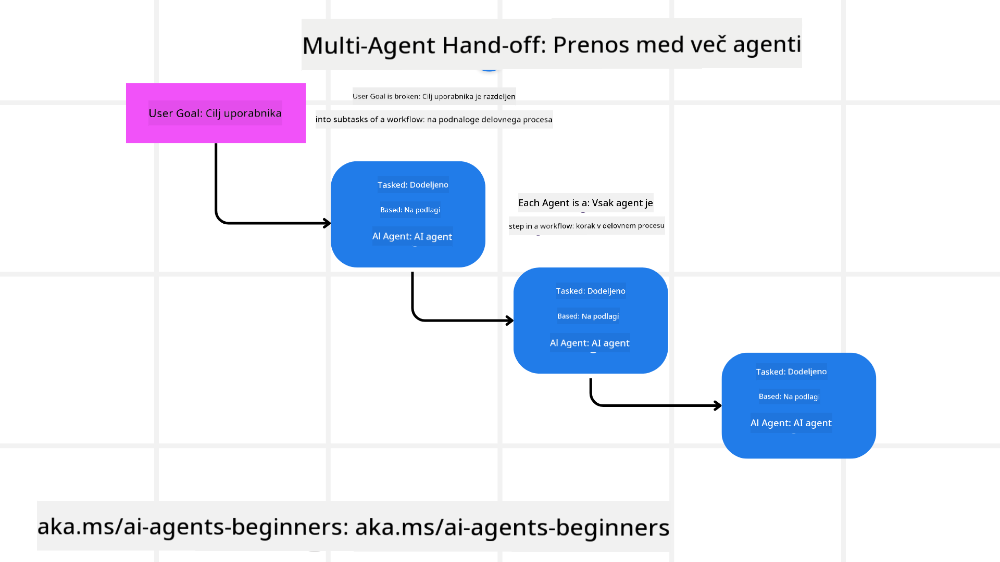
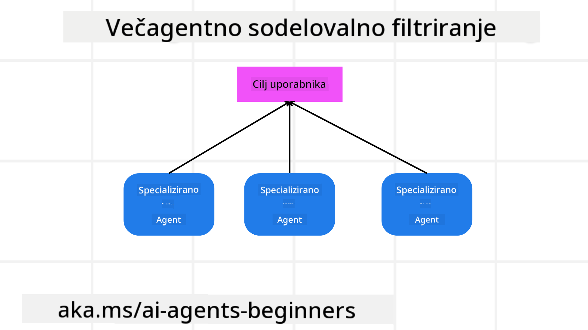

<!--
CO_OP_TRANSLATOR_METADATA:
{
  "original_hash": "c692a8975d7d5b99575a553de1c5e8a7",
  "translation_date": "2025-07-12T11:30:36+00:00",
  "source_file": "08-multi-agent/README.md",
  "language_code": "sl"
}
-->

> _(Kliknite na zgornjo sliko za ogled videa te lekcije)_

# Vzorce večagentnega oblikovanja

Ko začnete delati na projektu, ki vključuje več agentov, boste morali upoštevati vzorec večagentnega oblikovanja. Vendar morda ni takoj jasno, kdaj preiti na več agentov in kakšne so prednosti.

## Uvod

V tej lekciji bomo poskušali odgovoriti na naslednja vprašanja:

- V katerih scenarijih je uporaba več agentov smiselna?
- Kakšne so prednosti uporabe več agentov v primerjavi z enim samim agentom, ki opravlja več nalog?
- Kateri so gradniki za implementacijo vzorca večagentnega oblikovanja?
- Kako lahko vidimo, kako medsebojno delujejo različni agenti?

## Cilji učenja

Po tej lekciji boste znali:

- Prepoznati scenarije, kjer je uporaba več agentov primerna
- Prepoznati prednosti uporabe več agentov v primerjavi z enim samim agentom
- Razumeti gradnike za implementacijo vzorca večagentnega oblikovanja

Kaj je širša slika?

*Več agentov je vzorec oblikovanja, ki omogoča sodelovanje več agentov za dosego skupnega cilja*.

Ta vzorec se pogosto uporablja na različnih področjih, vključno z robotiko, avtonomnimi sistemi in distribuiranim računalništvom.

## Scenariji, kjer je uporaba več agentov smiselna

Kateri scenariji so torej primerni za uporabo več agentov? Odgovor je, da je veliko takih scenarijev, še posebej v naslednjih primerih:

- **Velike obremenitve**: Velike naloge lahko razdelimo na manjše in jih dodelimo različnim agentom, kar omogoča vzporedno obdelavo in hitrejše dokončanje. Primer tega je obdelava velikih količin podatkov.
- **Kompleksne naloge**: Kompleksne naloge, podobno kot velike obremenitve, lahko razdelimo na manjše podnaloge in jih dodelimo različnim agentom, ki so specializirani za določen vidik naloge. Dober primer so avtonomna vozila, kjer različni agenti upravljajo navigacijo, zaznavanje ovir in komunikacijo z drugimi vozili.
- **Raznolike strokovne veščine**: Različni agenti imajo lahko različna strokovna znanja, kar jim omogoča učinkovitejše reševanje različnih vidikov naloge kot en sam agent. Dober primer je zdravstvo, kjer agenti upravljajo diagnostiko, načrte zdravljenja in spremljanje pacientov.

## Prednosti uporabe več agentov v primerjavi z enim samim agentom

Sistem z enim agentom lahko deluje dobro za preproste naloge, vendar pri bolj kompleksnih nalogah uporaba več agentov prinaša več prednosti:

- **Specializacija**: Vsak agent je lahko specializiran za določeno nalogo. Pomanjkanje specializacije pri enem agentu pomeni, da agent lahko počne vse, a se lahko zmede pri kompleksnih nalogah. Na primer, lahko opravlja nalogo, za katero ni najbolj primeren.
- **Razširljivost**: Lažje je razširiti sistem z dodajanjem več agentov, kot pa preobremeniti enega samega.
- **Odpornost na napake**: Če en agent odpove, drugi lahko nadaljujejo z delovanjem, kar zagotavlja zanesljivost sistema.

Vzemimo primer: rezervirajmo potovanje za uporabnika. Sistem z enim agentom bi moral upravljati vse vidike rezervacije, od iskanja letov do rezervacije hotelov in najema avtomobilov. Da bi to dosegli z enim agentom, bi moral imeti orodja za vse te naloge, kar bi lahko privedlo do kompleksnega in monolitnega sistema, ki je težko vzdrževati in razširjati. Sistem z več agenti pa bi lahko imel različne agente, specializirane za iskanje letov, rezervacijo hotelov in najem avtomobilov. To bi sistem naredilo bolj modularen, lažji za vzdrževanje in razširljiv.

Primerjajmo to z turistično agencijo, ki deluje kot družinski lokal, v primerjavi s franšizo. Družinski lokal bi imel enega agenta, ki upravlja vse vidike rezervacije, medtem ko bi franšiza imela različne agente za različne vidike rezervacije.

## Gradniki za implementacijo vzorca večagentnega oblikovanja

Preden lahko implementirate vzorec večagentnega oblikovanja, morate razumeti gradnike, ki sestavljajo ta vzorec.

Ponovno si poglejmo primer rezervacije potovanja za uporabnika. V tem primeru gradniki vključujejo:

- **Komunikacija med agenti**: Agenti za iskanje letov, rezervacijo hotelov in najem avtomobilov morajo komunicirati in deliti informacije o uporabnikovih željah in omejitvah. Treba je določiti protokole in metode za to komunikacijo. Konkretno to pomeni, da mora agent za iskanje letov komunicirati z agentom za rezervacijo hotelov, da zagotovita, da je hotel rezerviran za iste datume kot let. To pomeni, da morajo agenti deliti informacije o uporabnikovih datumih potovanja, kar pomeni, da morate določiti *kateri agenti delijo informacije in kako jih delijo*.
- **Mehanizmi koordinacije**: Agenti morajo usklajevati svoja dejanja, da zagotovijo, da so upoštevane uporabnikove želje in omejitve. Uporabnikova želja je lahko, da želi hotel blizu letališča, medtem ko je omejitev, da so najemni avtomobili na voljo samo na letališču. To pomeni, da mora agent za rezervacijo hotelov koordinirati z agentom za najem avtomobilov, da zagotovita, da so želje in omejitve uporabnika izpolnjene. To pomeni, da morate določiti *kako agenti usklajujejo svoja dejanja*.
- **Arhitektura agentov**: Agenti morajo imeti notranjo strukturo za sprejemanje odločitev in učenje iz interakcij z uporabnikom. To pomeni, da mora agent za iskanje letov imeti notranjo strukturo za odločanje o tem, katere lete priporočiti uporabniku. To pomeni, da morate določiti *kako agenti sprejemajo odločitve in se učijo iz interakcij z uporabnikom*. Primer, kako se agent uči in izboljšuje, je, da agent za iskanje letov lahko uporablja model strojnega učenja za priporočanje letov na podlagi preteklih uporabnikovih preferenc.
- **Vidnost interakcij med več agenti**: Potrebno je imeti vpogled v to, kako medsebojno delujejo različni agenti. To pomeni, da potrebujete orodja in tehnike za sledenje dejavnostim in interakcijam agentov. To je lahko v obliki orodij za beleženje in nadzor, orodij za vizualizacijo in meritev uspešnosti.
- **Vzorce večagentnih sistemov**: Obstajajo različni vzorci za implementacijo večagentnih sistemov, kot so centralizirane, decentralizirane in hibridne arhitekture. Potrebno je izbrati vzorec, ki najbolj ustreza vašemu primeru uporabe.
- **Človek v zanki**: V večini primerov bo v zanki prisoten človek, zato morate agentom določiti, kdaj naj zahtevajo človeško posredovanje. To je lahko v obliki uporabnika, ki zahteva določen hotel ali let, ki ga agenti niso priporočili, ali pa zahteva potrditev pred rezervacijo leta ali hotela.

## Vidnost interakcij med več agenti

Pomembno je, da imate vpogled v to, kako medsebojno delujejo različni agenti. Ta vidnost je ključna za odpravljanje napak, optimizacijo in zagotavljanje učinkovitosti celotnega sistema. Za to potrebujete orodja in tehnike za sledenje dejavnostim in interakcijam agentov. To je lahko v obliki orodij za beleženje in nadzor, orodij za vizualizacijo in meritev uspešnosti.

Na primer, pri rezervaciji potovanja za uporabnika bi lahko imeli nadzorno ploščo, ki prikazuje stanje vsakega agenta, uporabnikove želje in omejitve ter interakcije med agenti. Ta nadzorna plošča bi prikazovala uporabnikove datume potovanja, lete, ki jih priporoča agent za lete, hotele, ki jih priporoča agent za hotele, in najemne avtomobile, ki jih priporoča agent za najem avtomobilov. Tako bi dobili jasen vpogled v to, kako agenti sodelujejo in ali so uporabnikove želje in omejitve izpolnjene.

Poglejmo si te vidike podrobneje.

- **Orodja za beleženje in nadzor**: Želite beležiti vsako dejanje, ki ga izvede agent. Vnos v dnevnik lahko shrani informacije o agentu, ki je izvedel dejanje, o samem dejanju, času izvedbe in izidu. Te informacije se nato lahko uporabijo za odpravljanje napak, optimizacijo in drugo.
- **Orodja za vizualizacijo**: Vizualizacijska orodja vam lahko pomagajo videti interakcije med agenti na bolj intuitiven način. Na primer, lahko imate graf, ki prikazuje pretok informacij med agenti. To vam lahko pomaga prepoznati ozka grla, neučinkovitosti in druge težave v sistemu.
- **Meritve uspešnosti**: Merjenje uspešnosti vam pomaga spremljati učinkovitost večagentnega sistema. Na primer, lahko spremljate čas, potreben za dokončanje naloge, število opravljenih nalog na enoto časa in natančnost priporočil agentov. Te informacije vam pomagajo prepoznati področja za izboljšave in optimizirati sistem.

## Vzorce večagentnih sistemov

Poglejmo nekaj konkretnih vzorcev, ki jih lahko uporabimo za ustvarjanje večagentnih aplikacij. Tukaj je nekaj zanimivih vzorcev, ki jih je vredno upoštevati:

### Skupinski klepet

Ta vzorec je uporaben, ko želite ustvariti aplikacijo za skupinski klepet, kjer lahko več agentov medsebojno komunicira. Tipični primeri uporabe so sodelovanje v timu, podpora strankam in družbena omrežja.

V tem vzorcu vsak agent predstavlja uporabnika v skupinskem klepetu, sporočila pa se izmenjujejo med agenti z uporabo protokola za sporočanje. Agenti lahko pošiljajo sporočila v skupinski klepet, prejemajo sporočila iz skupinskega klepeta in odgovarjajo na sporočila drugih agentov.

Ta vzorec je mogoče implementirati z centralizirano arhitekturo, kjer so vsa sporočila usmerjena prek osrednjega strežnika, ali z decentralizirano arhitekturo, kjer se sporočila izmenjujejo neposredno.

### Predaja nalog

Ta vzorec je uporaben, ko želite ustvariti aplikacijo, kjer lahko več agentov medsebojno predaja naloge.

Tipični primeri uporabe so podpora strankam, upravljanje nalog in avtomatizacija delovnih tokov.

V tem vzorcu vsak agent predstavlja nalogo ali korak v delovnem toku, agenti pa lahko naloge predajajo drugim agentom na podlagi vnaprej določenih pravil.

### Sodelovalno filtriranje

Ta vzorec je uporaben, ko želite ustvariti aplikacijo, kjer lahko več agentov sodeluje pri podajanju priporočil uporabnikom.

Razlog, da želite, da več agentov sodeluje, je, da ima vsak agent različne strokovne veščine in lahko na različne načine prispeva k procesu priporočanja.

Vzemimo primer, kjer uporabnik želi priporočilo za najboljšo delnico za nakup na borzi.

- **Strokovnjak za industrijo**: En agent je lahko strokovnjak za določeno industrijo.
- **Tehnična analiza**: Drugi agent je lahko strokovnjak za tehnično analizo.
- **Temeljna analiza**: Tretji agent je lahko strokovnjak za temeljno analizo. S sodelovanjem lahko ti agenti uporabniku ponudijo bolj celovito priporočilo.

## Scenarij: Postopek vračila denarja

Predstavljajte si scenarij, kjer kupec želi dobiti vračilo za izdelek. V tem procesu je lahko vključenih kar nekaj agentov, vendar jih razdelimo na agente, specifične za ta postopek, in splošne agente, ki jih lahko uporabimo tudi v drugih procesih.

**Agenti specifični za postopek vračila denarja**:

Nekateri agenti, ki bi lahko sodelovali v postopku vračila:

- **Agent kupca**: Ta agent predstavlja kupca in je odgovoren za začetek postopka vračila.
- **Agent prodajalca**: Ta agent predstavlja prodajalca in je odgovoren za obdelavo vračila.
- **Agent plačila**: Ta agent predstavlja plačilni proces in je odgovoren za vračilo denarja kupcu.
- **Agent reševanja**: Ta agent predstavlja postopek reševanja in je odgovoren za reševanje morebitnih težav med postopkom vračila.
- **Agent skladnosti**: Ta agent predstavlja postopek skladnosti in zagotavlja, da postopek vračila ustreza predpisom in pravilnikom.

**Splošni agenti**:

Ti agenti se lahko uporabljajo tudi v drugih delih vašega poslovanja.

- **Agent za dostavo**: Ta agent predstavlja postopek dostave in je odgovoren za vračilo izdelka prodajalcu. Ta agent se lahko uporablja tako za postopek vračila kot za splošno dostavo izdelka ob nakupu.
- **Agent za povratne informacije**: Ta agent predstavlja postopek zbiranja povratnih informacij od kupca. Povratne informacije se lahko zbirajo kadarkoli, ne samo med postopkom vračila.
- **Agent za eskalacijo**: Ta agent predstavlja postopek eskalacije in je odgovoren za prenos težav na višjo raven podpore. Takšnega agenta lahko uporabite v katerem koli procesu, kjer je potrebna eskalacija težav.
- **Agent za obveščanje**: Ta agent predstavlja postopek obveščanja in je odgovoren za pošiljanje obvestil kupcu v različnih fazah postopka vračila.
- **Agent za analitiko**: Ta agent predstavlja postopek analize podatkov, povezanih s postopkom vračila.
- **Agent za revizijo**: Ta agent predstavlja postopek revizije in zagotavlja, da se postopek vračila izvaja pravilno.
- **Agent za poročanje**: Ta agent je odgovoren za pripravo poročil o postopku vračila.
- **Agent za znanje**: Ta agent upravlja bazo znanja, povezano s postopkom vračila. Lahko je strokovnjak tako za vračila kot za druge dele vašega poslovanja.
- **Agent za varnost**: Ta agent zagotavlja varnost postopka vračila.
- **Agent za kakovost**: Ta agent skrbi za zagotavljanje kakovosti postopka vračila.

Naštetih je kar nekaj agentov, tako specifičnih za postopek vračila kot tudi splošnih, ki jih lahko uporabite v drugih delih vašega poslovanja. Upamo, da vam to daje predstavo, kako se odločiti, katere agente uporabiti v vašem večagentnem sistemu.

## Naloga
## Prejšnja lekcija

[Načrtovanje oblikovanja](../07-planning-design/README.md)

## Naslednja lekcija

[Metakognicija v AI agentih](../09-metacognition/README.md)

**Omejitev odgovornosti**:  
Ta dokument je bil preveden z uporabo storitve za avtomatski prevod AI [Co-op Translator](https://github.com/Azure/co-op-translator). Čeprav si prizadevamo za natančnost, vas opozarjamo, da lahko avtomatski prevodi vsebujejo napake ali netočnosti. Izvirni dokument v njegovem izvirnem jeziku velja za avtoritativni vir. Za pomembne informacije priporočamo strokovni človeški prevod. Za morebitna nesporazume ali napačne interpretacije, ki izhajajo iz uporabe tega prevoda, ne odgovarjamo.