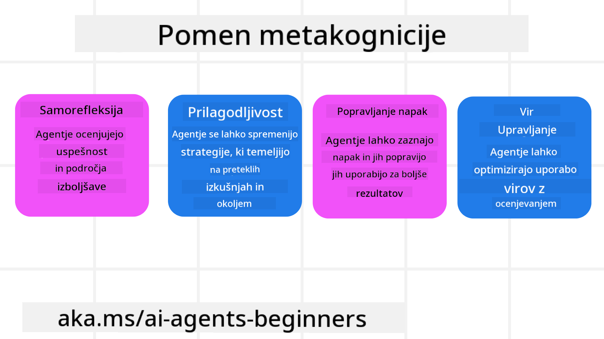
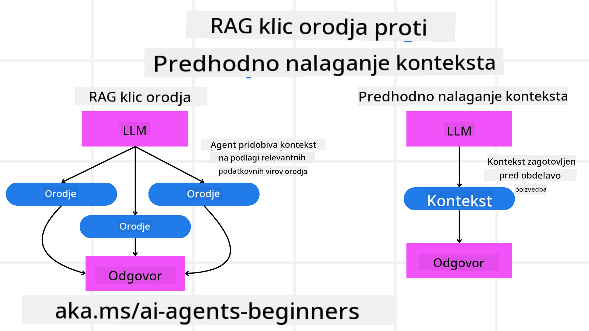

<!--
CO_OP_TRANSLATOR_METADATA:
{
  "original_hash": "8cbf460468c802c7994aa62e0e0779c9",
  "translation_date": "2025-07-12T13:27:29+00:00",
  "source_file": "09-metacognition/README.md",
  "language_code": "sl"
}
-->
[](https://youtu.be/His9R6gw6Ec?si=3_RMb8VprNvdLRhX)

> _(Kliknite na zgornjo sliko za ogled videa te lekcije)_
# Metakognicija pri AI agentih

## Uvod

Dobrodošli v lekciji o metakogniciji pri AI agentih! Ta poglavje je namenjeno začetnikom, ki jih zanima, kako lahko AI agenti razmišljajo o lastnih miselnih procesih. Ob koncu te lekcije boste razumeli ključne pojme in imeli praktične primere za uporabo metakognicije pri oblikovanju AI agentov.

## Cilji učenja

Po zaključku te lekcije boste znali:

1. Razumeti posledice zank razmišljanja v definicijah agentov.
2. Uporabiti tehnike načrtovanja in ocenjevanja za pomoč samopopravnim agentom.
3. Ustvariti lastne agente, ki znajo manipulirati s kodo za opravljanje nalog.

## Uvod v metakognicijo

Metakognicija se nanaša na višje kognitivne procese, ki vključujejo razmišljanje o lastnem razmišljanju. Za AI agente to pomeni, da lahko ocenjujejo in prilagajajo svoja dejanja na podlagi samospoznanja in preteklih izkušenj. Metakognicija ali "razmišljanje o razmišljanju" je pomemben koncept pri razvoju agentnih AI sistemov. Vključuje zavedanje AI sistemov o lastnih notranjih procesih ter sposobnost spremljanja, regulacije in prilagajanja svojega vedenja. Podobno kot mi, ko "beremo prostor" ali razmišljamo o problemu. To samospoznanje lahko AI sistemom pomaga sprejemati boljše odločitve, prepoznavati napake in izboljševati svojo učinkovitost skozi čas – kar nas spet povezuje s Turingovim testom in razpravo o tem, ali bo AI prevzel nadzor.

V kontekstu agentnih AI sistemov metakognicija pomaga reševati več izzivov, kot so:
- Transparentnost: Zagotavljanje, da AI sistemi lahko pojasnijo svoje razloge in odločitve.
- Razmišljanje: Izboljšanje sposobnosti AI sistemov za sintezo informacij in sprejemanje utemeljenih odločitev.
- Prilagodljivost: Omogočanje AI sistemom, da se prilagajajo novim okoljem in spreminjajočim se pogojem.
- Percepcija: Izboljšanje natančnosti AI sistemov pri prepoznavanju in interpretaciji podatkov iz okolja.

### Kaj je metakognicija?

Metakognicija ali "razmišljanje o razmišljanju" je višji kognitivni proces, ki vključuje samospoznanje in samoregulacijo lastnih kognitivnih procesov. Na področju AI metakognicija omogoča agentom, da ocenjujejo in prilagajajo svoje strategije in dejanja, kar vodi do izboljšanih sposobnosti reševanja problemov in sprejemanja odločitev. Z razumevanjem metakognicije lahko oblikujete AI agente, ki niso le bolj inteligentni, ampak tudi bolj prilagodljivi in učinkoviti. V pravi metakogniciji bi AI eksplicitno razmišljal o lastnem razmišljanju.

Primer: "Prednost sem dal cenejšim letom, ker... morda zamujam na neposredne lete, zato bom ponovno preveril."
Spremljanje, kako ali zakaj je izbral določeno pot.
- Opazovanje, da je naredil napake, ker se je preveč zanašal na uporabnikove preference iz prejšnjega časa, zato spremeni svojo strategijo odločanja, ne le končnega priporočila.
- Diagnosticiranje vzorcev, kot je: "Kadarkoli uporabnik omeni 'preveč gneče', ne smem le odstraniti določenih znamenitosti, ampak tudi premisliti, da je moja metoda izbire 'top znamenitosti' napačna, če vedno rangiram po priljubljenosti."

### Pomen metakognicije pri AI agentih

Metakognicija ima ključno vlogo pri oblikovanju AI agentov iz več razlogov:



- Samorefleksija: Agenti lahko ocenijo svoje delovanje in prepoznajo področja za izboljšave.
- Prilagodljivost: Agenti lahko spreminjajo svoje strategije na podlagi preteklih izkušenj in spreminjajočih se okolij.
- Popravljanje napak: Agenti lahko samostojno zaznavajo in popravljajo napake, kar vodi do natančnejših rezultatov.
- Upravljanje virov: Agenti lahko optimizirajo uporabo virov, kot sta čas in računalniška moč, z načrtovanjem in ocenjevanjem svojih dejanj.

## Komponente AI agenta

Preden se poglobimo v metakognitivne procese, je pomembno razumeti osnovne komponente AI agenta. AI agent običajno sestavljajo:

- Persona: Osebnost in značilnosti agenta, ki določajo, kako komunicira z uporabniki.
- Orodja: Zmožnosti in funkcije, ki jih agent lahko izvaja.
- Spretnosti: Znanje in strokovnost, ki jih agent poseduje.

Te komponente skupaj tvorijo "enoto strokovnosti", ki lahko opravlja določene naloge.

**Primer**:
Predstavljajte si potovalnega agenta, storitev agenta, ki ne le načrtuje vaše počitnice, ampak tudi prilagaja svojo pot glede na podatke v realnem času in pretekle izkušnje strank.

### Primer: Metakognicija v storitvi potovalnega agenta

Predstavljajte si, da oblikujete storitev potovalnega agenta, ki jo poganja AI. Ta agent, "Travel Agent", pomaga uporabnikom pri načrtovanju počitnic. Za vključitev metakognicije mora Travel Agent ocenjevati in prilagajati svoja dejanja na podlagi samospoznanja in preteklih izkušenj. Tako lahko metakognicija igra vlogo:

#### Trenutna naloga

Trenutna naloga je pomagati uporabniku načrtovati potovanje v Pariz.

#### Koraki za dokončanje naloge

1. **Zbiranje uporabnikovih preferenc**: Vprašajte uporabnika o datumih potovanja, proračunu, interesih (npr. muzeji, kulinarika, nakupovanje) in morebitnih posebnih zahtevah.
2. **Pridobivanje informacij**: Poiščite možnosti letov, nastanitev, znamenitosti in restavracij, ki ustrezajo uporabnikovim željam.
3. **Generiranje priporočil**: Ponudite personaliziran načrt poti z informacijami o letih, rezervacijah hotelov in predlaganih aktivnostih.
4. **Prilagoditev na podlagi povratnih informacij**: Vprašajte uporabnika za mnenje o priporočilih in naredite potrebne prilagoditve.

#### Potrebni viri

- Dostop do baz podatkov o letih in hotelih.
- Informacije o pariških znamenitostih in restavracijah.
- Podatki o povratnih informacijah uporabnikov iz prejšnjih interakcij.

#### Izkušnje in samorefleksija

Travel Agent uporablja metakognicijo za ocenjevanje svojega delovanja in učenje iz preteklih izkušenj. Na primer:

1. **Analiza povratnih informacij uporabnikov**: Travel Agent pregleda povratne informacije, da ugotovi, katera priporočila so bila dobro sprejeta in katera ne. Na podlagi tega prilagodi prihodnje predloge.
2. **Prilagodljivost**: Če je uporabnik prej omenil, da ne mara gneče, bo Travel Agent v prihodnje izogibal priporočanju priljubljenih turističnih točk v najbolj obremenjenih urah.
3. **Popravljanje napak**: Če je Travel Agent v preteklosti naredil napako, na primer predlagal hotel, ki je bil polno zaseden, se nauči bolj temeljito preverjati razpoložljivost pred podajanjem priporočil.

#### Praktični primer za razvijalce

Tukaj je poenostavljen primer kode Travel Agent, ki vključuje metakognicijo:

```python
class Travel_Agent:
    def __init__(self):
        self.user_preferences = {}
        self.experience_data = []

    def gather_preferences(self, preferences):
        self.user_preferences = preferences

    def retrieve_information(self):
        # Search for flights, hotels, and attractions based on preferences
        flights = search_flights(self.user_preferences)
        hotels = search_hotels(self.user_preferences)
        attractions = search_attractions(self.user_preferences)
        return flights, hotels, attractions

    def generate_recommendations(self):
        flights, hotels, attractions = self.retrieve_information()
        itinerary = create_itinerary(flights, hotels, attractions)
        return itinerary

    def adjust_based_on_feedback(self, feedback):
        self.experience_data.append(feedback)
        # Analyze feedback and adjust future recommendations
        self.user_preferences = adjust_preferences(self.user_preferences, feedback)

# Example usage
travel_agent = Travel_Agent()
preferences = {
    "destination": "Paris",
    "dates": "2025-04-01 to 2025-04-10",
    "budget": "moderate",
    "interests": ["museums", "cuisine"]
}
travel_agent.gather_preferences(preferences)
itinerary = travel_agent.generate_recommendations()
print("Suggested Itinerary:", itinerary)
feedback = {"liked": ["Louvre Museum"], "disliked": ["Eiffel Tower (too crowded)"]}
travel_agent.adjust_based_on_feedback(feedback)
```

#### Zakaj je metakognicija pomembna

- **Samorefleksija**: Agenti lahko analizirajo svoje delovanje in prepoznajo področja za izboljšave.
- **Prilagodljivost**: Agenti lahko spreminjajo strategije na podlagi povratnih informacij in spreminjajočih se pogojev.
- **Popravljanje napak**: Agenti lahko samostojno zaznavajo in popravljajo napake.
- **Upravljanje virov**: Agenti lahko optimizirajo uporabo virov, kot sta čas in računalniška moč.

Z vključitvijo metakognicije lahko Travel Agent ponudi bolj personalizirana in natančna potovalna priporočila ter izboljša celotno uporabniško izkušnjo.

---

## 2. Načrtovanje pri agentih

Načrtovanje je ključna komponenta vedenja AI agenta. Vključuje opredelitev korakov, potrebnih za dosego cilja, ob upoštevanju trenutnega stanja, virov in možnih ovir.

### Elementi načrtovanja

- **Trenutna naloga**: Jasno opredelite nalogo.
- **Koraki za dokončanje naloge**: Razdelite nalogo na obvladljive korake.
- **Potrebni viri**: Določite potrebne vire.
- **Izkušnje**: Uporabite pretekle izkušnje za načrtovanje.

**Primer**:
Tukaj so koraki, ki jih mora Travel Agent izvesti, da učinkovito pomaga uporabniku pri načrtovanju potovanja:

### Koraki za Travel Agent

1. **Zbiranje uporabnikovih preferenc**
   - Vprašajte uporabnika za podrobnosti o datumih potovanja, proračunu, interesih in morebitnih posebnih zahtevah.
   - Primeri: "Kdaj načrtujete potovanje?" "Kakšen je vaš proračun?" "Katere aktivnosti vam ustrezajo na počitnicah?"

2. **Pridobivanje informacij**
   - Poiščite ustrezne možnosti potovanja glede na uporabnikove preference.
   - **Leti**: Poiščite razpoložljive lete znotraj uporabnikovega proračuna in želenih datumov.
   - **Nastanitve**: Najdite hotele ali najemne objekte, ki ustrezajo uporabnikovim željam glede lokacije, cene in udobja.
   - **Znamenitosti in restavracije**: Prepoznajte priljubljene znamenitosti, aktivnosti in restavracije, ki ustrezajo interesom uporabnika.

3. **Generiranje priporočil**
   - Združite pridobljene informacije v personaliziran načrt poti.
   - Ponudite podrobnosti, kot so možnosti letov, rezervacije hotelov in predlagane aktivnosti, prilagojene uporabnikovim željam.

4. **Predstavitev načrta uporabniku**
   - Predstavite predlagani načrt poti uporabniku v pregled.
   - Primer: "Tukaj je predlagan načrt za vaše potovanje v Pariz. Vključuje podatke o letih, rezervacijah hotelov in seznam priporočil za aktivnosti ter restavracije. Sporočite mi svoje mnenje!"

5. **Zbiranje povratnih informacij**
   - Vprašajte uporabnika za mnenje o predlaganem načrtu.
   - Primeri: "Vam ustrezajo možnosti letov?" "Je hotel primeren za vaše potrebe?" "Bi želeli dodati ali odstraniti kakšne aktivnosti?"

6. **Prilagoditev na podlagi povratnih informacij**
   - Spremenite načrt glede na uporabnikove povratne informacije.
   - Naredite potrebne spremembe pri letih, nastanitvah in aktivnostih, da bolje ustrezajo željam uporabnika.

7. **Končna potrditev**
   - Predstavite posodobljen načrt uporabniku za končno potrditev.
   - Primer: "Naredil sem prilagoditve glede na vaše povratne informacije. Tukaj je posodobljen načrt. Ali je vse v redu?"

8. **Rezervacija in potrditev**
   - Ko uporabnik potrdi načrt, izvedite rezervacije letov, nastanitev in predhodno načrtovanih aktivnosti.
   - Pošljite uporabniku potrditvene podatke.

9. **Nadaljnja podpora**
   - Bodite na voljo za pomoč uporabniku pri morebitnih spremembah ali dodatnih zahtevah pred in med potovanjem.
   - Primer: "Če potrebujete dodatno pomoč med potovanjem, me lahko kadarkoli kontaktirate!"

### Primer interakcije

```python
class Travel_Agent:
    def __init__(self):
        self.user_preferences = {}
        self.experience_data = []

    def gather_preferences(self, preferences):
        self.user_preferences = preferences

    def retrieve_information(self):
        flights = search_flights(self.user_preferences)
        hotels = search_hotels(self.user_preferences)
        attractions = search_attractions(self.user_preferences)
        return flights, hotels, attractions

    def generate_recommendations(self):
        flights, hotels, attractions = self.retrieve_information()
        itinerary = create_itinerary(flights, hotels, attractions)
        return itinerary

    def adjust_based_on_feedback(self, feedback):
        self.experience_data.append(feedback)
        self.user_preferences = adjust_preferences(self.user_preferences, feedback)

# Example usage within a booing request
travel_agent = Travel_Agent()
preferences = {
    "destination": "Paris",
    "dates": "2025-04-01 to 2025-04-10",
    "budget": "moderate",
    "interests": ["museums", "cuisine"]
}
travel_agent.gather_preferences(preferences)
itinerary = travel_agent.generate_recommendations()
print("Suggested Itinerary:", itinerary)
feedback = {"liked": ["Louvre Museum"], "disliked": ["Eiffel Tower (too crowded)"]}
travel_agent.adjust_based_on_feedback(feedback)
```

## 3. Korektivni RAG sistem

Najprej začnimo z razumevanjem razlike med RAG orodjem in pre-emptive Context Load



### Retrieval-Augmented Generation (RAG)

RAG združuje sistem za iskanje informacij z generativnim modelom. Ko je postavljeno vprašanje, sistem za iskanje pridobi relevantne dokumente ali podatke iz zunanjega vira, te pridobljene informacije pa se uporabijo za izboljšanje vhodnih podatkov generativnemu modelu. To pomaga modelu ustvariti natančnejše in kontekstualno ustrezne odgovore.

V RAG sistemu agent pridobiva relevantne informacije iz baze znanja in jih uporablja za generiranje ustreznih odgovorov ali dejanj.

### Korektivni RAG pristop

Korektivni RAG pristop se osredotoča na uporabo RAG tehnik za popravljanje napak in izboljšanje natančnosti AI agentov. To vključuje:

1. **Tehniko spodbujanja (prompting)**: Uporaba specifičnih pozivov za usmerjanje agenta pri iskanju relevantnih informacij.
2. **Orodje**: Implementacija algoritmov in mehanizmov, ki agentu omogočajo ocenjevanje relevantnosti pridobljenih informacij in generiranje natančnih odgovorov.
3. **Ocenjevanje**: Neprestano spremljanje delovanja agenta in prilagajanje za izboljšanje natančnosti in učinkovitosti.

#### Primer: Korektivni RAG v iskalnem agentu

Predstavljajte si iskalnega agenta, ki pridobiva informacije z interneta za odgovarjanje na uporabnikova vprašanja. Korektivni RAG pristop lahko vključuje:

1. **Tehniko spodbujanja**: Oblikovanje iskalnih poizvedb na podlagi uporabnikovega vnosa.
2. **Orodje**: Uporaba algoritmov za obdelavo naravnega jezika in strojnega učenja za razvrščanje in filtriranje rezultatov iskanja.
3. **Ocenjevanje**: Analiza povratnih informacij uporabnikov za prepoznavanje in popravljanje netočnosti v pridobljenih informacijah.

### Korektivni RAG v Travel Agent

Korektivni RAG (Retrieval-Augmented Generation) izboljšuje sposobnost AI za pridobivanje in generiranje informacij ter hkrati popravlja morebitne netočnosti. Poglejmo, kako lahko Travel Agent uporabi korektivni RAG pristop za zagotavljanje natančnejših in bolj relevantnih potovalnih priporočil.

To vključuje:

- **Tehniko spodbujanja:** Uporaba specifičnih pozivov za usmerjanje agenta pri iskanju relevantnih informacij.
- **Orodje:** Implementacija algoritmov in mehanizmov, ki agentu omogočajo ocenjevanje relevantnosti pridobljenih informacij in generiranje natančnih odgovorov.
- **Ocenjevanje:** Neprestano spremljanje delovanja agenta in prilagajanje za izboljšanje natančnosti in učinkovitosti.

#### Koraki za implementacijo korektivnega RAG v Travel Agent

1. **Začetna interakcija z uporabnikom**
   - Travel Agent zbere začetne preference uporabnika, kot so destinacija, datumi potovanja, proračun in interesi.
   - Primer:

     ```python
     preferences = {
         "destination": "Paris",
         "dates": "2025-04-01 to 2025-04-10",
         "budget": "moderate",
         "interests": ["museums", "cuisine"]
     }
     ```

2. **Pridobivanje informacij**
   - Travel Agent pridobi podatke o letih, nastanitvah, znamenitostih in restavracijah glede na uporabnikove preference.
   - Primer:

     ```python
     flights = search_flights(preferences)
     hotels = search_hotels(preferences)
     attractions = search_attractions(preferences)
     ```

3. **Generiranje začetnih priporočil**
   - Travel Agent uporabi pridobljene informacije za ustvarjanje personaliziranega načrta poti.
   - Primer:

     ```python
     itinerary = create_itinerary(flights, hotels, attractions)
     print("Suggested Itinerary:", itinerary)
     ```

4. **Zbiranje povratnih informacij uporabnika**
   - Travel Agent vpraša uporabnika za mnenje o začetnih priporočilih.
   - Primer:

     ```python
     feedback = {
         "liked": ["Louvre Museum"],
         "disliked": ["Eiffel Tower (too crowded)"]
     }
     ```

5. **Korektivni RAG proces**
   - **Tehnika spodbujanja**: Travel Agent oblikuje nove iskalne poizvedbe na podlagi povratnih informacij uporabnika.
     - Primer:

       ```python
       if "disliked" in feedback:
           preferences["avoid"] = feedback["disliked"]
       ```

   - **Orodje**: Travel Agent uporablja algoritme za razvrščanje in filtriranje novih rezultatov iskanja, pri čemer poudarja relevantnost glede na povratne informacije.
     - Primer:

       ```python
       new_attractions = search_attractions(preferences)
       new_itinerary = create_itinerary(flights, hotels, new_attractions)
       print("Updated Itinerary:", new_itinerary)
       ```

   - **Ocenjevanje**: Travel Agent neprestano ocenjuje relevantnost in natančnost svojih priporočil z analizo povratnih informacij uporabnikov ter izvaja potrebne prilagoditve.
     - Primer:

       ```python
       def adjust_preferences(preferences, feedback):
           if "liked" in feedback:
               preferences["favorites"] = feedback["liked"]
           if "disliked" in feedback:
               preferences["avoid"] = feedback["disliked"]
           return preferences

       preferences = adjust_preferences(preferences, feedback)
       ```

#### Praktični primer

Tukaj je poenost
### Predhodno nalaganje konteksta

Predhodno nalaganje konteksta pomeni, da se modelu pred obdelavo poizvedbe naloži ustrezne informacije ali ozadje. To omogoča, da ima model dostop do teh podatkov že na začetku, kar mu pomaga ustvariti bolj informirane odgovore, ne da bi med procesom moral iskati dodatne podatke.

Tukaj je poenostavljen primer, kako bi lahko izgledalo predhodno nalaganje konteksta za aplikacijo potovalnega agenta v Pythonu:

```python
class TravelAgent:
    def __init__(self):
        # Pre-load popular destinations and their information
        self.context = {
            "Paris": {"country": "France", "currency": "Euro", "language": "French", "attractions": ["Eiffel Tower", "Louvre Museum"]},
            "Tokyo": {"country": "Japan", "currency": "Yen", "language": "Japanese", "attractions": ["Tokyo Tower", "Shibuya Crossing"]},
            "New York": {"country": "USA", "currency": "Dollar", "language": "English", "attractions": ["Statue of Liberty", "Times Square"]},
            "Sydney": {"country": "Australia", "currency": "Dollar", "language": "English", "attractions": ["Sydney Opera House", "Bondi Beach"]}
        }

    def get_destination_info(self, destination):
        # Fetch destination information from pre-loaded context
        info = self.context.get(destination)
        if info:
            return f"{destination}:\nCountry: {info['country']}\nCurrency: {info['currency']}\nLanguage: {info['language']}\nAttractions: {', '.join(info['attractions'])}"
        else:
            return f"Sorry, we don't have information on {destination}."

# Example usage
travel_agent = TravelAgent()
print(travel_agent.get_destination_info("Paris"))
print(travel_agent.get_destination_info("Tokyo"))
```

#### Razlaga

1. **Inicializacija (`__init__` metoda)**: Razred `TravelAgent` predhodno naloži slovar z informacijami o priljubljenih destinacijah, kot so Pariz, Tokio, New York in Sydney. Ta slovar vsebuje podatke, kot so država, valuta, jezik in glavne znamenitosti za vsako destinacijo.

2. **Pridobivanje informacij (`get_destination_info` metoda)**: Ko uporabnik vpraša za določeno destinacijo, metoda `get_destination_info` poišče ustrezne informacije v predhodno naloženem slovarju konteksta.

S predhodnim nalaganjem konteksta lahko aplikacija potovalnega agenta hitro odgovori na uporabnikove poizvedbe, ne da bi morala v realnem času iskati informacije iz zunanjih virov. To naredi aplikacijo bolj učinkovito in odzivno.

### Zagon načrta z določenim ciljem pred iteracijo

Zagon načrta z določenim ciljem pomeni, da se začne z jasno zastavljenim ciljem ali želenim izidom. Z opredelitvijo tega cilja na začetku lahko model uporablja ta cilj kot vodilo skozi celoten iterativni proces. To zagotavlja, da se vsaka iteracija približa doseganju želenega rezultata, kar naredi proces bolj učinkovit in osredotočen.

Tukaj je primer, kako lahko za potovalnega agenta v Pythonu zaženete načrt z določenim ciljem pred iteracijo:

### Scenarij

Potovalni agent želi načrtovati prilagojene počitnice za stranko. Cilj je ustvariti potovalni načrt, ki maksimira zadovoljstvo stranke glede na njene preference in proračun.

### Koraki

1. Določite preference in proračun stranke.
2. Zaženite začetni načrt na podlagi teh preferenc.
3. Iterirajte in izboljšujte načrt, da optimizirate zadovoljstvo stranke.

#### Python koda

```python
class TravelAgent:
    def __init__(self, destinations):
        self.destinations = destinations

    def bootstrap_plan(self, preferences, budget):
        plan = []
        total_cost = 0

        for destination in self.destinations:
            if total_cost + destination['cost'] <= budget and self.match_preferences(destination, preferences):
                plan.append(destination)
                total_cost += destination['cost']

        return plan

    def match_preferences(self, destination, preferences):
        for key, value in preferences.items():
            if destination.get(key) != value:
                return False
        return True

    def iterate_plan(self, plan, preferences, budget):
        for i in range(len(plan)):
            for destination in self.destinations:
                if destination not in plan and self.match_preferences(destination, preferences) and self.calculate_cost(plan, destination) <= budget:
                    plan[i] = destination
                    break
        return plan

    def calculate_cost(self, plan, new_destination):
        return sum(destination['cost'] for destination in plan) + new_destination['cost']

# Example usage
destinations = [
    {"name": "Paris", "cost": 1000, "activity": "sightseeing"},
    {"name": "Tokyo", "cost": 1200, "activity": "shopping"},
    {"name": "New York", "cost": 900, "activity": "sightseeing"},
    {"name": "Sydney", "cost": 1100, "activity": "beach"},
]

preferences = {"activity": "sightseeing"}
budget = 2000

travel_agent = TravelAgent(destinations)
initial_plan = travel_agent.bootstrap_plan(preferences, budget)
print("Initial Plan:", initial_plan)

refined_plan = travel_agent.iterate_plan(initial_plan, preferences, budget)
print("Refined Plan:", refined_plan)
```

#### Razlaga kode

1. **Inicializacija (`__init__` metoda)**: Razred `TravelAgent` je inicializiran z seznamom potencialnih destinacij, ki imajo lastnosti, kot so ime, stroški in vrsta aktivnosti.

2. **Zagon načrta (`bootstrap_plan` metoda)**: Ta metoda ustvari začetni potovalni načrt na podlagi preferenc in proračuna stranke. Pregleda seznam destinacij in jih doda v načrt, če ustrezajo preferencam in so znotraj proračuna.

3. **Ujemanje preferenc (`match_preferences` metoda)**: Ta metoda preveri, ali destinacija ustreza preferencam stranke.

4. **Iteracija načrta (`iterate_plan` metoda)**: Ta metoda izboljša začetni načrt tako, da poskuša zamenjati vsako destinacijo z bolj primerno, ob upoštevanju preferenc in proračunskih omejitev.

5. **Izračun stroškov (`calculate_cost` metoda)**: Ta metoda izračuna skupne stroške trenutnega načrta, vključno z morebitno novo destinacijo.

#### Primer uporabe

- **Začetni načrt**: Potovalni agent ustvari začetni načrt na podlagi strankinih preferenc za ogled znamenitosti in proračuna 2000 $.
- **Izboljšan načrt**: Potovalni agent iterira načrt, optimizirajoč ga glede na preference in proračun stranke.

Z zagonom načrta z jasnim ciljem (npr. maksimiranje zadovoljstva stranke) in iterativnim izboljševanjem lahko potovalni agent ustvari prilagojen in optimiziran potovalni načrt za stranko. Ta pristop zagotavlja, da je načrt že od začetka usklajen s strankinimi željami in proračunom ter se z vsako iteracijo izboljšuje.

### Izraba LLM za ponovno razvrščanje in ocenjevanje

Veliki jezikovni modeli (LLM) se lahko uporabljajo za ponovno razvrščanje in ocenjevanje tako, da ocenjujejo relevantnost in kakovost pridobljenih dokumentov ali ustvarjenih odgovorov. Tako deluje:

**Pridobivanje:** Začetni korak pridobi nabor kandidatnih dokumentov ali odgovorov na podlagi poizvedbe.

**Ponovno razvrščanje:** LLM oceni te kandidate in jih ponovno razvrsti glede na njihovo relevantnost in kakovost. Ta korak zagotavlja, da so najpomembnejše in najbolj kakovostne informacije prikazane prve.

**Ocenjevanje:** LLM dodeli ocene vsakemu kandidatu, ki odražajo njihovo relevantnost in kakovost. To pomaga izbrati najboljši odgovor ali dokument za uporabnika.

Z uporabo LLM za ponovno razvrščanje in ocenjevanje lahko sistem zagotovi natančnejše in kontekstualno ustreznejše informacije, kar izboljša uporabniško izkušnjo.

Tukaj je primer, kako bi potovalni agent lahko uporabil velik jezikovni model (LLM) za ponovno razvrščanje in ocenjevanje potovalnih destinacij glede na uporabnikove preference v Pythonu:

#### Scenarij – Potovanje glede na preference

Potovalni agent želi stranki priporočiti najboljše potovalne destinacije glede na njene preference. LLM bo pomagal ponovno razvrstiti in oceniti destinacije, da se prikažejo najbolj ustrezne možnosti.

#### Koraki:

1. Zberite uporabnikove preference.
2. Pridobite seznam potencialnih potovalnih destinacij.
3. Uporabite LLM za ponovno razvrščanje in ocenjevanje destinacij glede na uporabnikove preference.

Tukaj je, kako lahko posodobite prejšnji primer za uporabo Azure OpenAI storitev:

#### Zahteve

1. Potrebujete Azure naročnino.
2. Ustvarite Azure OpenAI vir in pridobite svoj API ključ.

#### Primer Python kode

```python
import requests
import json

class TravelAgent:
    def __init__(self, destinations):
        self.destinations = destinations

    def get_recommendations(self, preferences, api_key, endpoint):
        # Generate a prompt for the Azure OpenAI
        prompt = self.generate_prompt(preferences)
        
        # Define headers and payload for the request
        headers = {
            'Content-Type': 'application/json',
            'Authorization': f'Bearer {api_key}'
        }
        payload = {
            "prompt": prompt,
            "max_tokens": 150,
            "temperature": 0.7
        }
        
        # Call the Azure OpenAI API to get the re-ranked and scored destinations
        response = requests.post(endpoint, headers=headers, json=payload)
        response_data = response.json()
        
        # Extract and return the recommendations
        recommendations = response_data['choices'][0]['text'].strip().split('\n')
        return recommendations

    def generate_prompt(self, preferences):
        prompt = "Here are the travel destinations ranked and scored based on the following user preferences:\n"
        for key, value in preferences.items():
            prompt += f"{key}: {value}\n"
        prompt += "\nDestinations:\n"
        for destination in self.destinations:
            prompt += f"- {destination['name']}: {destination['description']}\n"
        return prompt

# Example usage
destinations = [
    {"name": "Paris", "description": "City of lights, known for its art, fashion, and culture."},
    {"name": "Tokyo", "description": "Vibrant city, famous for its modernity and traditional temples."},
    {"name": "New York", "description": "The city that never sleeps, with iconic landmarks and diverse culture."},
    {"name": "Sydney", "description": "Beautiful harbour city, known for its opera house and stunning beaches."},
]

preferences = {"activity": "sightseeing", "culture": "diverse"}
api_key = 'your_azure_openai_api_key'
endpoint = 'https://your-endpoint.com/openai/deployments/your-deployment-name/completions?api-version=2022-12-01'

travel_agent = TravelAgent(destinations)
recommendations = travel_agent.get_recommendations(preferences, api_key, endpoint)
print("Recommended Destinations:")
for rec in recommendations:
    print(rec)
```

#### Razlaga kode – Preference Booker

1. **Inicializacija**: Razred `TravelAgent` je inicializiran z seznamom potencialnih potovalnih destinacij, ki imajo lastnosti, kot so ime in opis.

2. **Pridobivanje priporočil (`get_recommendations` metoda)**: Ta metoda ustvari poziv za Azure OpenAI storitev na podlagi uporabnikovih preferenc in pošlje HTTP POST zahtevo na Azure OpenAI API, da pridobi ponovno razvrščene in ocenjene destinacije.

3. **Generiranje poziva (`generate_prompt` metoda)**: Ta metoda sestavi poziv za Azure OpenAI, ki vključuje uporabnikove preference in seznam destinacij. Poziv usmerja model, da ponovno razvrsti in oceni destinacije glede na podane preference.

4. **Klic API-ja**: Za pošiljanje HTTP POST zahteve na Azure OpenAI API se uporablja knjižnica `requests`. Odgovor vsebuje ponovno razvrščene in ocenjene destinacije.

5. **Primer uporabe**: Potovalni agent zbere uporabnikove preference (npr. zanimanje za ogled znamenitosti in raznoliko kulturo) in uporabi Azure OpenAI storitev za pridobitev ponovno razvrščenih in ocenjenih priporočil za potovalne destinacije.

Ne pozabite zamenjati `your_azure_openai_api_key` z vašim dejanskim Azure OpenAI API ključem in `https://your-endpoint.com/...` z dejanskim URL-jem končne točke vaše Azure OpenAI namestitve.

Z uporabo LLM za ponovno razvrščanje in ocenjevanje lahko potovalni agent strankam ponudi bolj personalizirana in relevantna potovalna priporočila, kar izboljša njihovo celotno izkušnjo.

### RAG: tehnika pozivanja proti orodju

Retrieval-Augmented Generation (RAG) je lahko tako tehnika pozivanja kot orodje pri razvoju AI agentov. Razumevanje razlike med obema vam lahko pomaga bolje izkoristiti RAG v vaših projektih.

#### RAG kot tehnika pozivanja

**Kaj je to?**

- Kot tehnika pozivanja RAG vključuje oblikovanje specifičnih poizvedb ali pozivov za usmerjanje pridobivanja relevantnih informacij iz velikega korpusa ali baze podatkov. Te informacije se nato uporabijo za generiranje odgovorov ali dejanj.

**Kako deluje:**

1. **Oblikovanje pozivov**: Ustvarite dobro strukturirane pozive ali poizvedbe glede na nalogo ali uporabnikov vnos.
2. **Pridobivanje informacij**: Uporabite pozive za iskanje relevantnih podatkov iz obstoječe baze znanja ali podatkovnega skladišča.
3. **Generiranje odgovora**: Združite pridobljene informacije z generativnimi AI modeli, da ustvarite celovit in koherenten odgovor.

**Primer pri potovalnem agentu**:

- Uporabnikov vnos: "Rad bi obiskal muzeje v Parizu."
- Poziv: "Poišči najboljše muzeje v Parizu."
- Pridobljene informacije: Podatki o muzeju Louvre, Musée d'Orsay itd.
- Generirani odgovor: "Tukaj so nekateri najboljši muzeji v Parizu: Louvre, Musée d'Orsay in Centre Pompidou."

#### RAG kot orodje

**Kaj je to?**

- Kot orodje je RAG integriran sistem, ki avtomatizira proces pridobivanja in generiranja, kar razvijalcem olajša implementacijo kompleksnih AI funkcionalnosti brez ročnega oblikovanja pozivov za vsako poizvedbo.

**Kako deluje:**

1. **Integracija**: Vgradi RAG v arhitekturo AI agenta, ki samodejno upravlja pridobivanje in generiranje.
2. **Avtomatizacija**: Orodje upravlja celoten proces, od prejema uporabnikovega vnosa do generiranja končnega odgovora, brez potrebe po eksplicitnih pozivih za vsak korak.
3. **Učinkovitost**: Izboljša zmogljivost agenta z optimizacijo procesa pridobivanja in generiranja, kar omogoča hitrejše in natančnejše odgovore.

**Primer pri potovalnem agentu**:

- Uporabnikov vnos: "Rad bi obiskal muzeje v Parizu."
- RAG orodje: Samodejno pridobi informacije o muzejih in generira odgovor.
- Generirani odgovor: "Tukaj so nekateri najboljši muzeji v Parizu: Louvre, Musée d'Orsay in Centre Pompidou."

### Primerjava

| Vidik                  | Tehnika pozivanja                                         | Orodje                                               |
|------------------------|-----------------------------------------------------------|-----------------------------------------------------|
| **Ročno proti avtomatsko** | Ročno oblikovanje pozivov za vsako poizvedbo.             | Avtomatiziran proces pridobivanja in generiranja.   |
| **Nadzor**             | Večji nadzor nad procesom pridobivanja.                   | Poenostavi in avtomatizira pridobivanje in generiranje. |
| **Prilagodljivost**    | Omogoča prilagojene pozive glede na specifične potrebe.   | Bolj učinkovito za obsežne implementacije.          |
| **Kompleksnost**       | Zahteva oblikovanje in prilagajanje pozivov.              | Lažje integrirati v arhitekturo AI agenta.           |

### Praktični primeri

**Primer tehnike pozivanja:**

```python
def search_museums_in_paris():
    prompt = "Find top museums in Paris"
    search_results = search_web(prompt)
    return search_results

museums = search_museums_in_paris()
print("Top Museums in Paris:", museums)
```

**Primer orodja:**

```python
class Travel_Agent:
    def __init__(self):
        self.rag_tool = RAGTool()

    def get_museums_in_paris(self):
        user_input = "I want to visit museums in Paris."
        response = self.rag_tool.retrieve_and_generate(user_input)
        return response

travel_agent = Travel_Agent()
museums = travel_agent.get_museums_in_paris()
print("Top Museums in Paris:", museums)
```

### Vrednotenje relevantnosti

Vrednotenje relevantnosti je ključni vidik zmogljivosti AI agenta. Zagotavlja, da so informacije, ki jih agent pridobi in ustvari, primerne, točne in uporabne za uporabnika. Oglejmo si, kako vrednotiti relevantnost v AI agentih, vključno s praktičnimi primeri in tehnikami.

#### Ključni pojmi pri vrednotenju relevantnosti

1. **Zavedanje konteksta**:
   - Agent mora razumeti kontekst uporabnikove poizvedbe, da pridobi in ustvari relevantne informacije.
   - Primer: Če uporabnik vpraša za "najboljše restavracije v Parizu", mora agent upoštevati uporabnikove preference, kot so vrsta kuhinje in proračun.

2. **Natančnost**:
   - Informacije, ki jih agent poda, morajo biti dejansko pravilne in ažurne.
   - Primer: Priporočanje trenutno odprtih restavracij z dobrimi ocenami, ne zastarelih ali zaprtih možnosti.

3. **Namen uporabnika**:
   - Agent mora razbrati namen uporabnika za poizvedbo, da zagotovi najbolj relevantne informacije.
   - Primer: Če uporabnik išče "cenovno ugodne hotele", naj agent prednostno ponudi dostopne možnosti.

4. **Povratna zanka**:
   - Neprestano zbiranje in analiza povratnih informacij uporabnikov pomaga agentu izboljšati proces vrednotenja relevantnosti.
   - Primer: Vključevanje ocen in povratnih informacij uporabnikov o prejšnjih priporočilih za izboljšanje prihodnjih odgovorov.

#### Praktične tehnike za vrednotenje relevantnosti

1. **Ocena relevantnosti**:
   - Dodelite oceno relevantnosti vsakemu pridobljenemu elementu glede na to, kako dobro ustreza uporabnikovi poizvedbi in preferencam.
   - Primer:

     ```python
     def relevance_score(item, query):
         score = 0
         if item['category'] in query['interests']:
             score += 1
         if item['price'] <= query['budget']:
             score += 1
         if item['location'] == query['destination']:
             score += 1
         return score
     ```

2. **Filtriranje in razvrščanje**:
   - Odstranite nerelevantne elemente in preostale razvrstite glede na njihove ocene relevantnosti.
   - Primer:

     ```python
     def filter_and_rank(items, query):
         ranked_items = sorted(items, key=lambda item: relevance_score(item, query), reverse=True)
         return ranked_items[:10]  # Return top 10 relevant items
     ```

3. **Obdelava naravnega jezika (NLP)**:
   - Uporabite NLP tehnike za razumevanje uporabnikove poizvedbe in pridobivanje relevantnih informacij.
   - Primer:

     ```python
     def process_query(query):
         # Use NLP to extract key information from the user's query
         processed_query = nlp(query)
         return processed_query
     ```

4. **Integracija povratnih informacij uporabnikov**:
   - Zbirajte povratne informacije o danih priporočilih in jih uporabite za prilagoditev prihodnjih ocen relevantnosti.
   - Primer:

     ```python
     def adjust_based_on_feedback(feedback, items):
         for item in items:
             if item['name'] in feedback['liked']:
                 item['relevance'] += 1
             if item['name'] in feedback['disliked']:
                 item['relevance'] -= 1
         return items
     ```

#### Primer: Vrednotenje relevantnosti pri potovalnem agentu

Tukaj je praktičen primer, kako lahko potovalni agent oceni relevantnost potovalnih priporočil:

```python
class Travel_Agent:
    def __init__(self):
        self.user_preferences = {}
        self.experience_data = []

    def gather_preferences(self, preferences):
        self.user_preferences = preferences

    def retrieve_information(self):
        flights = search_flights(self.user_preferences)
        hotels = search_hotels(self.user_preferences)
        attractions = search_attractions(self.user_preferences)
        return flights, hotels, attractions

    def generate_recommendations(self):
        flights, hotels, attractions = self.retrieve_information()
        ranked_hotels = self.filter_and_rank(hotels, self.user_preferences)
        itinerary = create_itinerary(flights, ranked_hotels, attractions)
        return itinerary

    def filter_and_rank(self, items, query):
        ranked_items = sorted(items, key=lambda item: self.relevance_score(item, query), reverse=True)
        return ranked_items[:10]  # Return top 10 relevant items

    def relevance_score(self, item, query):
        score = 0
        if item['category'] in query['interests']:
            score += 1
        if item['price'] <= query['budget']:
            score += 1
        if item['location'] == query['destination']:
            score += 1
        return score

    def adjust_based_on_feedback(self, feedback, items):
        for item in items:
            if item['name'] in feedback['liked']:
                item['relevance'] += 1
            if item['name'] in feedback['disliked']:
                item['relevance'] -= 1
        return items

# Example usage
travel_agent = Travel_Agent()
preferences = {
    "destination": "Paris",
    "dates": "2025-04-01 to 2025-04-10",
    "budget": "moderate",
    "interests": ["museums", "cuisine"]
}
travel_agent.gather_preferences(preferences)
itinerary = travel_agent.generate_recommendations()
print("Suggested Itinerary:", itinerary)
feedback = {"liked": ["Louvre Museum"], "disliked": ["Eiffel Tower (too crowded)"]}
updated_items = travel_agent.adjust_based_on_feedback(feedback, itinerary['hotels'])
print("Updated Itinerary with Feedback:", updated_items)
```

### Iskanje z namenom

Iskanje z namenom pomeni razumevanje in interpretacijo osnovnega cilja ali namena uporabnikove poizvedbe, da se pridobijo in ustvarijo najbolj relevantne in uporabne informacije. Ta pristop presega zgolj ujemanje ključnih besed in se osredotoča na razumevanje dejanskih potreb in konteksta uporabnika.

#### Ključni pojmi pri iskanju z namenom

1. **Razumevanje uporabnikovega namena**:
   - Namen uporabnika lahko razdelimo v tri glavne vrste: informacijski, navigacijski in transakcijski.
     - **Informacijski namen**: uporabnik išče informacije o določeni temi (npr. "Kateri so najboljši muzeji v Parizu?").
     - **Navigacijski namen**: uporabnik želi dostopati do določene spletne strani ali strani (npr. "Uradna spletna stran muzeja Louvre").
     - **Transakcijski namen**: uporabnik želi izvesti transakcijo, kot je rezervacija leta ali nakup (npr. "Rezerviraj let v Pariz").

2. **Zavedanje konteksta**:
   - Analiza konteksta uporabnikove poizvedbe pomaga natančno določiti njihov namen. To vključuje upoštevanje prejšnjih interakcij, uporabniških preferenc in specifičnih podrobnosti trenutne poizvedbe.

3. **Obdelava naravnega jezika (NLP)**:
   - NLP tehnike se uporabljajo za razumevanje in interpretacijo naravnih jezikovnih poizvedb uporabnikov. To vključuje naloge, kot so prepoznavanje entitet, analiza sentimenta in razčlenjevanje poizvedb.

4. **Personalizacija**:
   - Personalizacija rezultatov iskanja na podlagi uporabnikove zgodovine, preferenc in povratnih informacij izboljša relevantnost pridobljenih informacij.
#### Praktičen primer: Iskanje z namenom v Travel Agent

Vzemimo Travel Agent kot primer, da pokažemo, kako lahko implementiramo iskanje z namenom.

1. **Zbiranje uporabniških preferenc**

   ```python
   class Travel_Agent:
       def __init__(self):
           self.user_preferences = {}

       def gather_preferences(self, preferences):
           self.user_preferences = preferences
   ```

2. **Razumevanje uporabniške namere**

   ```python
   def identify_intent(query):
       if "book" in query or "purchase" in query:
           return "transactional"
       elif "website" in query or "official" in query:
           return "navigational"
       else:
           return "informational"
   ```

3. **Zavedanje konteksta**

   ```python
   def analyze_context(query, user_history):
       # Combine current query with user history to understand context
       context = {
           "current_query": query,
           "user_history": user_history
       }
       return context
   ```

4. **Iskanje in personalizacija rezultatov**

   ```python
   def search_with_intent(query, preferences, user_history):
       intent = identify_intent(query)
       context = analyze_context(query, user_history)
       if intent == "informational":
           search_results = search_information(query, preferences)
       elif intent == "navigational":
           search_results = search_navigation(query)
       elif intent == "transactional":
           search_results = search_transaction(query, preferences)
       personalized_results = personalize_results(search_results, user_history)
       return personalized_results

   def search_information(query, preferences):
       # Example search logic for informational intent
       results = search_web(f"best {preferences['interests']} in {preferences['destination']}")
       return results

   def search_navigation(query):
       # Example search logic for navigational intent
       results = search_web(query)
       return results

   def search_transaction(query, preferences):
       # Example search logic for transactional intent
       results = search_web(f"book {query} to {preferences['destination']}")
       return results

   def personalize_results(results, user_history):
       # Example personalization logic
       personalized = [result for result in results if result not in user_history]
       return personalized[:10]  # Return top 10 personalized results
   ```

5. **Primer uporabe**

   ```python
   travel_agent = Travel_Agent()
   preferences = {
       "destination": "Paris",
       "interests": ["museums", "cuisine"]
   }
   travel_agent.gather_preferences(preferences)
   user_history = ["Louvre Museum website", "Book flight to Paris"]
   query = "best museums in Paris"
   results = search_with_intent(query, preferences, user_history)
   print("Search Results:", results)
   ```

---

## 4. Generiranje kode kot orodje

Agenti za generiranje kode uporabljajo AI modele za pisanje in izvajanje kode, s čimer rešujejo kompleksne probleme in avtomatizirajo naloge.

### Agenti za generiranje kode

Agenti za generiranje kode uporabljajo generativne AI modele za pisanje in izvajanje kode. Ti agenti lahko rešujejo zahtevne probleme, avtomatizirajo naloge in nudijo dragocene vpoglede z generiranjem in izvajanjem kode v različnih programskih jezikih.

#### Praktične uporabe

1. **Avtomatizirano generiranje kode**: Generiranje kodnih odlomkov za specifične naloge, kot so analiza podatkov, spletno strganje ali strojno učenje.
2. **SQL kot RAG**: Uporaba SQL poizvedb za pridobivanje in manipulacijo podatkov iz baz.
3. **Reševanje problemov**: Ustvarjanje in izvajanje kode za reševanje specifičnih problemov, kot je optimizacija algoritmov ali analiza podatkov.

#### Primer: Agent za generiranje kode za analizo podatkov

Predstavljajte si, da oblikujete agenta za generiranje kode. Tako bi lahko deloval:

1. **Naloga**: Analizirati nabor podatkov za prepoznavanje trendov in vzorcev.
2. **Koraki**:
   - Naložiti nabor podatkov v orodje za analizo podatkov.
   - Generirati SQL poizvedbe za filtriranje in agregacijo podatkov.
   - Izvesti poizvedbe in pridobiti rezultate.
   - Uporabiti rezultate za generiranje vizualizacij in vpogledov.
3. **Potrebni viri**: Dostop do nabora podatkov, orodja za analizo podatkov in SQL zmogljivosti.
4. **Izkušnje**: Uporabiti pretekle rezultate analiz za izboljšanje natančnosti in relevantnosti prihodnjih analiz.

### Primer: Agent za generiranje kode za Travel Agent

V tem primeru bomo oblikovali agenta za generiranje kode, Travel Agent, ki uporabnikom pomaga pri načrtovanju potovanja z generiranjem in izvajanjem kode. Ta agent lahko opravlja naloge, kot so iskanje možnosti potovanja, filtriranje rezultatov in sestavljanje itinerarja z uporabo generativne AI.

#### Pregled agenta za generiranje kode

1. **Zbiranje uporabniških preferenc**: Zbira uporabniške podatke, kot so destinacija, datumi potovanja, proračun in interesi.
2. **Generiranje kode za pridobivanje podatkov**: Generira kodne odlomke za pridobivanje podatkov o letih, hotelih in znamenitostih.
3. **Izvajanje generirane kode**: Izvaja generirano kodo za pridobitev informacij v realnem času.
4. **Generiranje itinerarja**: Združi pridobljene podatke v personaliziran načrt potovanja.
5. **Prilagajanje na podlagi povratnih informacij**: Sprejema povratne informacije uporabnika in po potrebi ponovno generira kodo za izboljšanje rezultatov.

#### Korak za korakom implementacija

1. **Zbiranje uporabniških preferenc**

   ```python
   class Travel_Agent:
       def __init__(self):
           self.user_preferences = {}

       def gather_preferences(self, preferences):
           self.user_preferences = preferences
   ```

2. **Generiranje kode za pridobivanje podatkov**

   ```python
   def generate_code_to_fetch_data(preferences):
       # Example: Generate code to search for flights based on user preferences
       code = f"""
       def search_flights():
           import requests
           response = requests.get('https://api.example.com/flights', params={preferences})
           return response.json()
       """
       return code

   def generate_code_to_fetch_hotels(preferences):
       # Example: Generate code to search for hotels
       code = f"""
       def search_hotels():
           import requests
           response = requests.get('https://api.example.com/hotels', params={preferences})
           return response.json()
       """
       return code
   ```

3. **Izvajanje generirane kode**

   ```python
   def execute_code(code):
       # Execute the generated code using exec
       exec(code)
       result = locals()
       return result

   travel_agent = Travel_Agent()
   preferences = {
       "destination": "Paris",
       "dates": "2025-04-01 to 2025-04-10",
       "budget": "moderate",
       "interests": ["museums", "cuisine"]
   }
   travel_agent.gather_preferences(preferences)
   
   flight_code = generate_code_to_fetch_data(preferences)
   hotel_code = generate_code_to_fetch_hotels(preferences)
   
   flights = execute_code(flight_code)
   hotels = execute_code(hotel_code)

   print("Flight Options:", flights)
   print("Hotel Options:", hotels)
   ```

4. **Generiranje itinerarja**

   ```python
   def generate_itinerary(flights, hotels, attractions):
       itinerary = {
           "flights": flights,
           "hotels": hotels,
           "attractions": attractions
       }
       return itinerary

   attractions = search_attractions(preferences)
   itinerary = generate_itinerary(flights, hotels, attractions)
   print("Suggested Itinerary:", itinerary)
   ```

5. **Prilagajanje na podlagi povratnih informacij**

   ```python
   def adjust_based_on_feedback(feedback, preferences):
       # Adjust preferences based on user feedback
       if "liked" in feedback:
           preferences["favorites"] = feedback["liked"]
       if "disliked" in feedback:
           preferences["avoid"] = feedback["disliked"]
       return preferences

   feedback = {"liked": ["Louvre Museum"], "disliked": ["Eiffel Tower (too crowded)"]}
   updated_preferences = adjust_based_on_feedback(feedback, preferences)
   
   # Regenerate and execute code with updated preferences
   updated_flight_code = generate_code_to_fetch_data(updated_preferences)
   updated_hotel_code = generate_code_to_fetch_hotels(updated_preferences)
   
   updated_flights = execute_code(updated_flight_code)
   updated_hotels = execute_code(updated_hotel_code)
   
   updated_itinerary = generate_itinerary(updated_flights, updated_hotels, attractions)
   print("Updated Itinerary:", updated_itinerary)
   ```

### Izkoriščanje zavedanja okolja in sklepanja

Na podlagi sheme tabele lahko izboljšamo proces generiranja poizvedb z uporabo zavedanja okolja in sklepanja.

Tukaj je primer, kako to lahko izvedemo:

1. **Razumevanje sheme**: Sistem bo razumel shemo tabele in to informacijo uporabil za utemeljitev generiranja poizvedb.
2. **Prilagajanje na podlagi povratnih informacij**: Sistem bo prilagodil uporabniške preference glede na povratne informacije in presodil, katera polja v shemi je treba posodobiti.
3. **Generiranje in izvajanje poizvedb**: Sistem bo generiral in izvajal poizvedbe za pridobitev posodobljenih podatkov o letih in hotelih glede na nove preference.

Tukaj je posodobljen primer Python kode, ki vključuje te koncepte:

```python
def adjust_based_on_feedback(feedback, preferences, schema):
    # Adjust preferences based on user feedback
    if "liked" in feedback:
        preferences["favorites"] = feedback["liked"]
    if "disliked" in feedback:
        preferences["avoid"] = feedback["disliked"]
    # Reasoning based on schema to adjust other related preferences
    for field in schema:
        if field in preferences:
            preferences[field] = adjust_based_on_environment(feedback, field, schema)
    return preferences

def adjust_based_on_environment(feedback, field, schema):
    # Custom logic to adjust preferences based on schema and feedback
    if field in feedback["liked"]:
        return schema[field]["positive_adjustment"]
    elif field in feedback["disliked"]:
        return schema[field]["negative_adjustment"]
    return schema[field]["default"]

def generate_code_to_fetch_data(preferences):
    # Generate code to fetch flight data based on updated preferences
    return f"fetch_flights(preferences={preferences})"

def generate_code_to_fetch_hotels(preferences):
    # Generate code to fetch hotel data based on updated preferences
    return f"fetch_hotels(preferences={preferences})"

def execute_code(code):
    # Simulate execution of code and return mock data
    return {"data": f"Executed: {code}"}

def generate_itinerary(flights, hotels, attractions):
    # Generate itinerary based on flights, hotels, and attractions
    return {"flights": flights, "hotels": hotels, "attractions": attractions}

# Example schema
schema = {
    "favorites": {"positive_adjustment": "increase", "negative_adjustment": "decrease", "default": "neutral"},
    "avoid": {"positive_adjustment": "decrease", "negative_adjustment": "increase", "default": "neutral"}
}

# Example usage
preferences = {"favorites": "sightseeing", "avoid": "crowded places"}
feedback = {"liked": ["Louvre Museum"], "disliked": ["Eiffel Tower (too crowded)"]}
updated_preferences = adjust_based_on_feedback(feedback, preferences, schema)

# Regenerate and execute code with updated preferences
updated_flight_code = generate_code_to_fetch_data(updated_preferences)
updated_hotel_code = generate_code_to_fetch_hotels(updated_preferences)

updated_flights = execute_code(updated_flight_code)
updated_hotels = execute_code(updated_hotel_code)

updated_itinerary = generate_itinerary(updated_flights, updated_hotels, feedback["liked"])
print("Updated Itinerary:", updated_itinerary)
```

#### Razlaga - Rezervacija na podlagi povratnih informacij

1. **Zavedanje sheme**: Slovar `schema` določa, kako naj se preference prilagodijo glede na povratne informacije. Vključuje polja, kot so `favorites` in `avoid`, z ustreznimi prilagoditvami.
2. **Prilagajanje preferenc (`adjust_based_on_feedback` metoda)**: Ta metoda prilagodi preference na podlagi uporabniških povratnih informacij in sheme.
3. **Prilagoditve glede na okolje (`adjust_based_on_environment` metoda)**: Ta metoda prilagodi spremembe glede na shemo in povratne informacije.
4. **Generiranje in izvajanje poizvedb**: Sistem generira kodo za pridobitev posodobljenih podatkov o letih in hotelih glede na prilagojene preference ter simulira izvajanje teh poizvedb.
5. **Generiranje itinerarja**: Sistem ustvari posodobljen načrt potovanja na podlagi novih podatkov o letih, hotelih in znamenitostih.

S tem, ko sistem postane okoljsko zavedajoč in sklepa na podlagi sheme, lahko generira natančnejše in bolj relevantne poizvedbe, kar vodi do boljših priporočil za potovanje in bolj personalizirane uporabniške izkušnje.

### Uporaba SQL kot tehnike Retrieval-Augmented Generation (RAG)

SQL (Structured Query Language) je močno orodje za delo z bazami podatkov. Ko se uporablja kot del pristopa Retrieval-Augmented Generation (RAG), lahko SQL pridobi relevantne podatke iz baz, ki služijo za informiranje in generiranje odgovorov ali dejanj v AI agentih. Oglejmo si, kako se SQL lahko uporablja kot RAG tehnika v kontekstu Travel Agent.

#### Ključni koncepti

1. **Interakcija z bazo podatkov**:
   - SQL se uporablja za poizvedovanje baz, pridobivanje relevantnih informacij in manipulacijo podatkov.
   - Primer: Pridobivanje podatkov o letih, hotelih in znamenitostih iz potovalne baze.

2. **Integracija z RAG**:
   - SQL poizvedbe se generirajo na podlagi uporabniškega vnosa in preferenc.
   - Pridobljeni podatki se nato uporabijo za generiranje personaliziranih priporočil ali dejanj.

3. **Dinamično generiranje poizvedb**:
   - AI agent generira dinamične SQL poizvedbe glede na kontekst in potrebe uporabnika.
   - Primer: Prilagajanje SQL poizvedb za filtriranje rezultatov glede na proračun, datume in interese.

#### Uporabe

- **Avtomatizirano generiranje kode**: Generiranje kodnih odlomkov za specifične naloge.
- **SQL kot RAG**: Uporaba SQL poizvedb za manipulacijo podatkov.
- **Reševanje problemov**: Ustvarjanje in izvajanje kode za reševanje problemov.

**Primer**: Agent za analizo podatkov:

1. **Naloga**: Analizirati nabor podatkov za iskanje trendov.
2. **Koraki**:
   - Naložiti nabor podatkov.
   - Generirati SQL poizvedbe za filtriranje podatkov.
   - Izvesti poizvedbe in pridobiti rezultate.
   - Generirati vizualizacije in vpoglede.
3. **Viri**: Dostop do nabora podatkov, SQL zmogljivosti.
4. **Izkušnje**: Uporabiti pretekle rezultate za izboljšanje prihodnjih analiz.

#### Praktičen primer: Uporaba SQL v Travel Agent

1. **Zbiranje uporabniških preferenc**

   ```python
   class Travel_Agent:
       def __init__(self):
           self.user_preferences = {}

       def gather_preferences(self, preferences):
           self.user_preferences = preferences
   ```

2. **Generiranje SQL poizvedb**

   ```python
   def generate_sql_query(table, preferences):
       query = f"SELECT * FROM {table} WHERE "
       conditions = []
       for key, value in preferences.items():
           conditions.append(f"{key}='{value}'")
       query += " AND ".join(conditions)
       return query
   ```

3. **Izvajanje SQL poizvedb**

   ```python
   import sqlite3

   def execute_sql_query(query, database="travel.db"):
       connection = sqlite3.connect(database)
       cursor = connection.cursor()
       cursor.execute(query)
       results = cursor.fetchall()
       connection.close()
       return results
   ```

4. **Generiranje priporočil**

   ```python
   def generate_recommendations(preferences):
       flight_query = generate_sql_query("flights", preferences)
       hotel_query = generate_sql_query("hotels", preferences)
       attraction_query = generate_sql_query("attractions", preferences)
       
       flights = execute_sql_query(flight_query)
       hotels = execute_sql_query(hotel_query)
       attractions = execute_sql_query(attraction_query)
       
       itinerary = {
           "flights": flights,
           "hotels": hotels,
           "attractions": attractions
       }
       return itinerary

   travel_agent = Travel_Agent()
   preferences = {
       "destination": "Paris",
       "dates": "2025-04-01 to 2025-04-10",
       "budget": "moderate",
       "interests": ["museums", "cuisine"]
   }
   travel_agent.gather_preferences(preferences)
   itinerary = generate_recommendations(preferences)
   print("Suggested Itinerary:", itinerary)
   ```

#### Primeri SQL poizvedb

1. **Poizvedba za let**

   ```sql
   SELECT * FROM flights WHERE destination='Paris' AND dates='2025-04-01 to 2025-04-10' AND budget='moderate';
   ```

2. **Poizvedba za hotel**

   ```sql
   SELECT * FROM hotels WHERE destination='Paris' AND budget='moderate';
   ```

3. **Poizvedba za znamenitost**

   ```sql
   SELECT * FROM attractions WHERE destination='Paris' AND interests='museums, cuisine';
   ```

Z uporabo SQL kot dela tehnike Retrieval-Augmented Generation (RAG) lahko AI agenti, kot je Travel Agent, dinamično pridobivajo in uporabljajo relevantne podatke za zagotavljanje natančnih in personaliziranih priporočil.

### Primer metakognicije

Da pokažemo implementacijo metakognicije, ustvarimo preprostega agenta, ki *razmišlja o svojem procesu odločanja* med reševanjem problema. V tem primeru bomo zgradili sistem, kjer agent poskuša optimizirati izbiro hotela, nato pa oceni svoje sklepe in prilagodi strategijo, če naredi napake ali podoptimalne odločitve.

To simuliramo s preprostim primerom, kjer agent izbira hotele na podlagi kombinacije cene in kakovosti, hkrati pa "razmišlja" o svojih odločitvah in se temu prilagaja.

#### Kako to ilustrira metakognicijo:

1. **Začetna odločitev**: Agent izbere najcenejši hotel, ne da bi razumel vpliv kakovosti.
2. **Refleksija in ocena**: Po začetni izbiri agent preveri, ali je hotel "slaba" izbira na podlagi uporabniških povratnih informacij. Če ugotovi, da je bila kakovost hotela prenizka, razmisli o svojem sklepanju.
3. **Prilagoditev strategije**: Agent prilagodi svojo strategijo na podlagi refleksije in preklopi z "najcenejšega" na "najvišjo kakovost", s čimer izboljša svoj proces odločanja v prihodnjih iteracijah.

Tukaj je primer:

```python
class HotelRecommendationAgent:
    def __init__(self):
        self.previous_choices = []  # Stores the hotels chosen previously
        self.corrected_choices = []  # Stores the corrected choices
        self.recommendation_strategies = ['cheapest', 'highest_quality']  # Available strategies

    def recommend_hotel(self, hotels, strategy):
        """
        Recommend a hotel based on the chosen strategy.
        The strategy can either be 'cheapest' or 'highest_quality'.
        """
        if strategy == 'cheapest':
            recommended = min(hotels, key=lambda x: x['price'])
        elif strategy == 'highest_quality':
            recommended = max(hotels, key=lambda x: x['quality'])
        else:
            recommended = None
        self.previous_choices.append((strategy, recommended))
        return recommended

    def reflect_on_choice(self):
        """
        Reflect on the last choice made and decide if the agent should adjust its strategy.
        The agent considers if the previous choice led to a poor outcome.
        """
        if not self.previous_choices:
            return "No choices made yet."

        last_choice_strategy, last_choice = self.previous_choices[-1]
        # Let's assume we have some user feedback that tells us whether the last choice was good or not
        user_feedback = self.get_user_feedback(last_choice)

        if user_feedback == "bad":
            # Adjust strategy if the previous choice was unsatisfactory
            new_strategy = 'highest_quality' if last_choice_strategy == 'cheapest' else 'cheapest'
            self.corrected_choices.append((new_strategy, last_choice))
            return f"Reflecting on choice. Adjusting strategy to {new_strategy}."
        else:
            return "The choice was good. No need to adjust."

    def get_user_feedback(self, hotel):
        """
        Simulate user feedback based on hotel attributes.
        For simplicity, assume if the hotel is too cheap, the feedback is "bad".
        If the hotel has quality less than 7, feedback is "bad".
        """
        if hotel['price'] < 100 or hotel['quality'] < 7:
            return "bad"
        return "good"

# Simulate a list of hotels (price and quality)
hotels = [
    {'name': 'Budget Inn', 'price': 80, 'quality': 6},
    {'name': 'Comfort Suites', 'price': 120, 'quality': 8},
    {'name': 'Luxury Stay', 'price': 200, 'quality': 9}
]

# Create an agent
agent = HotelRecommendationAgent()

# Step 1: The agent recommends a hotel using the "cheapest" strategy
recommended_hotel = agent.recommend_hotel(hotels, 'cheapest')
print(f"Recommended hotel (cheapest): {recommended_hotel['name']}")

# Step 2: The agent reflects on the choice and adjusts strategy if necessary
reflection_result = agent.reflect_on_choice()
print(reflection_result)

# Step 3: The agent recommends again, this time using the adjusted strategy
adjusted_recommendation = agent.recommend_hotel(hotels, 'highest_quality')
print(f"Adjusted hotel recommendation (highest_quality): {adjusted_recommendation['name']}")
```

#### Metakognitivne sposobnosti agenta

Ključno tukaj je agentova sposobnost, da:
- Ocenjuje svoje pretekle odločitve in proces odločanja.
- Prilagaja svojo strategijo na podlagi te refleksije, torej metakognicija v praksi.

To je preprosta oblika metakognicije, kjer sistem lahko prilagodi svoj proces sklepanja na podlagi notranjih povratnih informacij.

### Zaključek

Metakognicija je močno orodje, ki lahko bistveno izboljša zmogljivosti AI agentov. Z vključitvijo metakognitivnih procesov lahko oblikujete agente, ki so bolj inteligentni, prilagodljivi in učinkoviti. Uporabite dodatne vire za nadaljnje raziskovanje fascinantnega sveta metakognicije v AI agentih.

## Prejšnja lekcija

[Multi-Agent Design Pattern](../08-multi-agent/README.md)

## Naslednja lekcija

[AI Agents in Production](../10-ai-agents-production/README.md)

**Omejitev odgovornosti**:  
Ta dokument je bil preveden z uporabo storitve za avtomatski prevod AI [Co-op Translator](https://github.com/Azure/co-op-translator). Čeprav si prizadevamo za natančnost, vas opozarjamo, da lahko avtomatski prevodi vsebujejo napake ali netočnosti. Izvirni dokument v njegovem izvirnem jeziku velja za avtoritativni vir. Za pomembne informacije priporočamo strokovni človeški prevod. Za morebitne nesporazume ali napačne interpretacije, ki izhajajo iz uporabe tega prevoda, ne odgovarjamo.