<!--
CO_OP_TRANSLATOR_METADATA:
{
  "original_hash": "5cc6836626047aa055e8960c8484a7d0",
  "translation_date": "2025-08-30T00:13:00+00:00",
  "source_file": "11-agentic-protocols/code_samples/mcp-agents/README.md",
  "language_code": "sl"
}
-->
# Gradnja sistemov za komunikacijo med agenti z MCP

> Na kratko - Ali lahko zgradite komunikacijo Agent2Agent na MCP? Da!

MCP se je močno razvil onkraj svojega prvotnega cilja "zagotavljanja konteksta za LLM-je". Z nedavnimi izboljšavami, kot so [ponovno vzpostavljivi tokovi](https://modelcontextprotocol.io/docs/concepts/transports#resumability-and-redelivery), [elicitation](https://modelcontextprotocol.io/specification/2025-06-18/client/elicitation), [sampling](https://modelcontextprotocol.io/specification/2025-06-18/client/sampling) in obvestila ([napredek](https://modelcontextprotocol.io/specification/2025-06-18/basic/utilities/progress) in [viri](https://modelcontextprotocol.io/specification/2025-06-18/schema#resourceupdatednotification)), MCP zdaj ponuja robustno osnovo za gradnjo kompleksnih sistemov za komunikacijo med agenti.

## Napačno razumevanje agentov in orodij

Ko vedno več razvijalcev raziskuje orodja z agentnimi vedenji (dolgotrajno delovanje, potreba po dodatnih vnosih med izvajanjem itd.), se pogosto pojavi napačno prepričanje, da MCP ni primeren, predvsem zato, ker so se zgodnji primeri njegovega orodja osredotočali na preproste vzorce zahteva-odgovor.

To prepričanje je zastarelo. Specifikacija MCP je bila v zadnjih mesecih bistveno izboljšana z zmogljivostmi, ki zapolnjujejo vrzel za gradnjo dolgotrajnih agentnih vedenj:

- **Tokovi in delni rezultati**: Posodobitve napredka v realnem času med izvajanjem
- **Ponovna vzpostavitev**: Odjemalci se lahko ponovno povežejo in nadaljujejo po prekinitvi
- **Trajnost**: Rezultati preživijo ponovni zagon strežnika (npr. prek povezav do virov)
- **Večkratni obrati**: Interaktivni vnosi med izvajanjem prek elicitation in sampling

Te funkcije je mogoče sestaviti za omogočanje kompleksnih agentnih in večagentnih aplikacij, vse na MCP protokolu.

Za referenco bomo agenta imenovali "orodje", ki je na voljo na MCP strežniku. To pomeni obstoj gostiteljske aplikacije, ki implementira MCP odjemalca, vzpostavi sejo z MCP strežnikom in lahko kliče agenta.

## Kaj naredi MCP orodje "agentno"?

Preden se poglobimo v implementacijo, opredelimo, katere infrastrukturne zmogljivosti so potrebne za podporo dolgotrajnih agentov.

> Agenta bomo opredelili kot entiteto, ki lahko deluje avtonomno daljše obdobje in je sposobna obravnavati kompleksne naloge, ki lahko zahtevajo več interakcij ali prilagoditev na podlagi povratnih informacij v realnem času.

### 1. Tokovi in delni rezultati

Tradicionalni vzorci zahteva-odgovor ne delujejo za dolgotrajne naloge. Agenti morajo zagotoviti:

- Posodobitve napredka v realnem času
- Vmesne rezultate

**Podpora MCP**: Obvestila o posodobitvah virov omogočajo tokove delnih rezultatov, čeprav to zahteva skrbno načrtovanje, da se izognemo konfliktom z modelom 1:1 zahteva/odgovor JSON-RPC.

| Funkcija                  | Primer uporabe                                                                                                                                                                       | Podpora MCP                                                                                |
| ------------------------- | ------------------------------------------------------------------------------------------------------------------------------------------------------------------------------------ | ------------------------------------------------------------------------------------------ |
| Posodobitve napredka v realnem času | Uporabnik zahteva nalogo migracije kode. Agent posreduje napredek: "10% - Analiziranje odvisnosti... 25% - Pretvarjanje TypeScript datotek... 50% - Posodabljanje uvozov..."          | ✅ Obvestila o napredku                                                                  |
| Delni rezultati           | Naloga "Ustvari knjigo" posreduje delne rezultate, npr. 1) Oris zgodbe, 2) Seznam poglavij, 3) Vsako dokončano poglavje. Gostitelj lahko pregleda, prekliče ali preusmeri na kateri koli stopnji. | ✅ Obvestila je mogoče "razširiti", da vključujejo delne rezultate, glej predloge na PR 383, 776 |

<div align="center" style="font-style: italic; font-size: 0.95em; margin-bottom: 0.5em;">
<strong>Slika 1:</strong> Ta diagram prikazuje, kako MCP agent posreduje posodobitve napredka v realnem času in delne rezultate gostiteljski aplikaciji med dolgotrajno nalogo, kar omogoča uporabniku spremljanje izvajanja v realnem času.
</div>


### 2. Ponovna vzpostavitev

Agenti morajo obvladovati prekinitve omrežja brez težav:

- Ponovna povezava po prekinitvi (odjemalca)
- Nadaljevanje tam, kjer so končali (ponovna dostava sporočil)

**Podpora MCP**: MCP StreamableHTTP transport danes podpira ponovno vzpostavitev sej in ponovno dostavo sporočil z ID-ji sej in ID-ji zadnjih dogodkov. Pomembno je, da mora strežnik implementirati EventStore, ki omogoča ponovitve dogodkov ob ponovni povezavi odjemalca.  
Omeniti velja, da obstaja predlog skupnosti (PR #975), ki raziskuje transportno neodvisne ponovno vzpostavljive tokove.

| Funkcija      | Primer uporabe                                                                                                                                                   | Podpora MCP                                                                |
| ------------- | ---------------------------------------------------------------------------------------------------------------------------------------------------------------- | -------------------------------------------------------------------------- |
| Ponovna vzpostavitev | Odjemalec se prekine med dolgotrajno nalogo. Ob ponovni povezavi se seja nadaljuje z ponovitvijo zamujenih dogodkov, brezhibno nadaljuje tam, kjer je končala. | ✅ StreamableHTTP transport z ID-ji sej, ponovitvijo dogodkov in EventStore |

```mermaid
sequenceDiagram
    participant User
    participant Host as Host App<br/>(MCP Client)
    participant Server as MCP Server<br/>(Agent Tool)
    participant Store as Event Store

    User->>Host: Start task
    Host->>Server: Call tool [session: abc123]
    Server->>Store: Save events

    Note over Host,Server: 💥 Connection lost

    Host->>Server: Reconnect [session: abc123]
    Store-->>Server: Replay events
    Server-->>Host: Catch up + continue
    Host-->>User: ✅ Complete
```

<div align="center" style="font-style: italic; font-size: 0.95em; margin-bottom: 0.5em;">
<strong>Slika 2:</strong> Ta diagram prikazuje, kako MCP-jev StreamableHTTP transport in EventStore omogočata brezhibno ponovno vzpostavitev sej: če se odjemalec prekine, se lahko ponovno poveže in ponovi zamujene dogodke, nadaljuje nalogo brez izgube napredka.
</div>



### 3. Trajnost

Dolgotrajni agenti potrebujejo trajno stanje:

- Rezultati preživijo ponovni zagon strežnika
- Stanje je mogoče pridobiti zunaj seje
- Sledenje napredku med sejami

**Podpora MCP**: MCP zdaj podpira vrsto vrnitve Resource link za klice orodij. Danes je možen vzorec zasnove orodja, ki ustvari vir in takoj vrne povezavo do vira. Orodje lahko nadaljuje z obravnavo naloge v ozadju in posodablja vir. Odjemalec lahko nato izbere, ali bo preverjal stanje tega vira za pridobitev delnih ali celotnih rezultatov (glede na to, katere posodobitve virov strežnik zagotavlja) ali se naročil na vir za obvestila o posodobitvah.

Ena omejitev tukaj je, da lahko preverjanje virov ali naročanje na posodobitve porabi vire, kar ima posledice pri večjem obsegu. Obstaja odprt predlog skupnosti (vključno z #992), ki raziskuje možnost vključitve webhookov ali sprožilcev, ki jih strežnik lahko pokliče za obveščanje odjemalca/gostiteljske aplikacije o posodobitvah.

| Funkcija    | Primer uporabe                                                                                                                                        | Podpora MCP                                                        |
| ----------- | ----------------------------------------------------------------------------------------------------------------------------------------------------- | ------------------------------------------------------------------ |
| Trajnost    | Strežnik se zruši med nalogo migracije podatkov. Rezultati in napredek preživijo ponovni zagon, odjemalec lahko preveri stanje in nadaljuje iz trajnega vira. | ✅ Povezave do virov s trajnim shranjevanjem in obvestili o stanju |

Danes je pogost vzorec zasnove orodja, ki ustvari vir in takoj vrne povezavo do vira. Orodje lahko v ozadju obravnava nalogo, izdaja obvestila o virih, ki služijo kot posodobitve napredka ali vključujejo delne rezultate, in po potrebi posodablja vsebino v viru.

```mermaid
sequenceDiagram
    participant User
    participant Host as Host App<br/>(MCP Client)
    participant Server as MCP Server<br/>(Agent Tool)
    participant DB as Persistent Storage

    User->>Host: Start task
    Host->>Server: Call tool
    Server->>DB: Create resource + updates
    Server-->>Host: 🔗 Resource link

    Note over Server: 💥 Server restart

    User->>Host: Check status
    Host->>Server: Get resource
    Server->>DB: Load state
    Server-->>Host: Current progress
    Server->>DB: Complete + notify
    Host-->>User: ✅ Complete
```

<div align="center" style="font-style: italic; font-size: 0.95em; margin-bottom: 0.5em;">
<strong>Slika 3:</strong> Ta diagram prikazuje, kako MCP agenti uporabljajo trajne vire in obvestila o stanju za zagotavljanje, da dolgotrajne naloge preživijo ponovne zagone strežnika, kar omogoča odjemalcem preverjanje napredka in pridobivanje rezultatov tudi po napakah.
</div>



### 4. Večkratne interakcije

Agenti pogosto potrebujejo dodatne vnose med izvajanjem:

- Človeška pojasnila ali odobritve
- AI pomoč pri kompleksnih odločitvah
- Dinamična prilagoditev parametrov

**Podpora MCP**: Popolnoma podprto prek sampling (za AI vnose) in elicitation (za človeške vnose).

| Funkcija                 | Primer uporabe                                                                                                                                     | Podpora MCP                                           |
| ------------------------ | -------------------------------------------------------------------------------------------------------------------------------------------------- | ----------------------------------------------------- |
| Večkratne interakcije    | Agent za rezervacijo potovanj zahteva potrditev cene od uporabnika, nato pa prosi AI za povzetek podatkov o potovanju, preden dokonča transakcijo. | ✅ Elicitation za človeške vnose, sampling za AI vnose |

```mermaid
sequenceDiagram
    participant User
    participant Host as Host App<br/>(MCP Client)
    participant Server as MCP Server<br/>(Agent Tool)

    User->>Host: Book flight
    Host->>Server: Call travel_agent

    Server->>Host: Elicitation: "Confirm $500?"
    Note over Host: Elicitation callback (if available)
    Host->>User: 💰 Confirm price?
    User->>Host: "Yes"
    Host->>Server: Confirmed

    Server->>Host: Sampling: "Summarize data"
    Note over Host: AI callback (if available)
    Host->>Server: Report summary

    Server->>Host: ✅ Flight booked
```

<div align="center" style="font-style: italic; font-size: 0.95em; margin-bottom: 0.5em;">
<strong>Slika 4:</strong> Ta diagram prikazuje, kako MCP agenti lahko interaktivno pridobijo človeške vnose ali zahtevajo AI pomoč med izvajanjem, kar podpira kompleksne, večkratne delovne tokove, kot so potrditve in dinamično odločanje.
</div>



## Implementacija dolgotrajnih agentov na MCP - Pregled kode

Kot del tega članka ponujamo [repozitorij kode](https://github.com/victordibia/ai-tutorials/tree/main/MCP%20Agents), ki vsebuje popolno implementacijo dolgotrajnih agentov z uporabo MCP Python SDK z StreamableHTTP transportom za ponovno vzpostavitev sej in ponovno dostavo sporočil. Implementacija prikazuje, kako je mogoče zmogljivosti MCP sestaviti za omogočanje sofisticiranih agentnih vedenj.

Specifično implementiramo strežnik z dvema glavnima agentnima orodjema:

- **Agent za potovanja** - Simulira storitev rezervacije potovanj s potrditvijo cene prek elicitation
- **Raziskovalni agent** - Izvaja raziskovalne naloge s povzetki, ki jih omogoča AI, prek sampling

Oba agenta prikazujeta posodobitve napredka v realnem času, interaktivne potrditve in popolne zmogljivosti ponovne vzpostavitve sej.

### Ključni koncepti implementacije

Naslednji odseki prikazujejo implementacijo agenta na strani strežnika in obravnavo gostitelja na strani odjemalca za vsako zmogljivost:

#### Tokovi in posodobitve napredka - Stanje naloge v realnem času

Tokovi omogočajo agentom, da med dolgotrajnimi nalogami posredujejo posodobitve napredka v realnem času, kar uporabnikom omogoča spremljanje stanja naloge in vmesnih rezultatov.

**Implementacija na strežniku (agent pošilja obvestila o napredku):**

```python
# From server/server.py - Travel agent sending progress updates
for i, step in enumerate(steps):
    await ctx.session.send_progress_notification(
        progress_token=ctx.request_id,
        progress=i * 25,
        total=100,
        message=step,
        related_request_id=str(ctx.request_id)
    )
    await anyio.sleep(2)  # Simulate work

# Alternative: Log messages for detailed step-by-step updates
await ctx.session.send_log_message(
    level="info",
    data=f"Processing step {current_step}/{steps} ({progress_percent}%)",
    logger="long_running_agent",
    related_request_id=ctx.request_id,
)
```

**Implementacija na odjemalcu (gostitelj prejema posodobitve napredka):**

```python
# From client/client.py - Client handling real-time notifications
async def message_handler(message) -> None:
    if isinstance(message, types.ServerNotification):
        if isinstance(message.root, types.LoggingMessageNotification):
            console.print(f"📡 [dim]{message.root.params.data}[/dim]")
        elif isinstance(message.root, types.ProgressNotification):
            progress = message.root.params
            console.print(f"🔄 [yellow]{progress.message} ({progress.progress}/{progress.total})[/yellow]")

# Register message handler when creating session
async with ClientSession(
    read_stream, write_stream,
    message_handler=message_handler
) as session:
```

#### Elicitation - Zahteva za uporabniški vnos

Elicitation omogoča agentom, da med izvajanjem zahtevajo uporabniški vnos. To je bistveno za potrditve, pojasnila ali odobritve med dolgotrajnimi nalogami.

**Implementacija na strežniku (agent zahteva potrditev):**

```python
# From server/server.py - Travel agent requesting price confirmation
elicit_result = await ctx.session.elicit(
    message=f"Please confirm the estimated price of $1200 for your trip to {destination}",
    requestedSchema=PriceConfirmationSchema.model_json_schema(),
    related_request_id=ctx.request_id,
)

if elicit_result and elicit_result.action == "accept":
    # Continue with booking
    logger.info(f"User confirmed price: {elicit_result.content}")
elif elicit_result and elicit_result.action == "decline":
    # Cancel the booking
    booking_cancelled = True
```

**Implementacija na odjemalcu (gostitelj zagotavlja povratni klic za elicitation):**

```python
# From client/client.py - Client handling elicitation requests
async def elicitation_callback(context, params):
    console.print(f"💬 Server is asking for confirmation:")
    console.print(f"   {params.message}")

    response = console.input("Do you accept? (y/n): ").strip().lower()

    if response in ['y', 'yes']:
        return types.ElicitResult(
            action="accept",
            content={"confirm": True, "notes": "Confirmed by user"}
        )
    else:
        return types.ElicitResult(
            action="decline",
            content={"confirm": False, "notes": "Declined by user"}
        )

# Register the callback when creating the session
async with ClientSession(
    read_stream, write_stream,
    elicitation_callback=elicitation_callback
) as session:
```

#### Sampling - Zahteva za AI pomoč

Sampling omogoča agentom, da med izvajanjem zahtevajo pomoč LLM za kompleksne odločitve ali generiranje vsebine. To omogoča hibridne delovne tokove človek-AI.

**Implementacija na strežniku (agent zahteva AI pomoč):**

```python
# From server/server.py - Research agent requesting AI summary
sampling_result = await ctx.session.create_message(
    messages=[
        SamplingMessage(
            role="user",
            content=TextContent(type="text", text=f"Please summarize the key findings for research on: {topic}")
        )
    ],
    max_tokens=100,
    related_request_id=ctx.request_id,
)

if sampling_result and sampling_result.content:
    if sampling_result.content.type == "text":
        sampling_summary = sampling_result.content.text
        logger.info(f"Received sampling summary: {sampling_summary}")
```

**Implementacija na odjemalcu (gostitelj zagotavlja povratni klic za sampling):**

```python
# From client/client.py - Client handling sampling requests
async def sampling_callback(context, params):
    message_text = params.messages[0].content.text if params.messages else 'No message'
    console.print(f"🧠 Server requested sampling: {message_text}")

    # In a real application, this could call an LLM API
    # For demo purposes, we provide a mock response
    mock_response = "Based on current research, MCP has evolved significantly..."

    return types.CreateMessageResult(
        role="assistant",
        content=types.TextContent(type="text", text=mock_response),
        model="interactive-client",
        stopReason="endTurn"
    )

# Register the callback when creating the session
async with ClientSession(
    read_stream, write_stream,
    sampling_callback=sampling_callback,
    elicitation_callback=elicitation_callback
) as session:
```

#### Ponovna vzpostavitev - Kontinuiteta sej ob prekinitvah

Ponovna vzpostavitev zagotavlja, da dolgotrajne naloge agentov preživijo prekinitve odjemalca in se brezhibno nadaljujejo ob ponovni povezavi. To je implementirano prek shranjevanja dogodkov in žetonov za ponovno vzpostavitev.

**Implementacija shranjevanja dogodkov (strežnik hrani stanje seje):**

```python
# From server/event_store.py - Simple in-memory event store
class SimpleEventStore(EventStore):
    def __init__(self):
        self._events: list[tuple[StreamId, EventId, JSONRPCMessage]] = []
        self._event_id_counter = 0

    async def store_event(self, stream_id: StreamId, message: JSONRPCMessage) -> EventId:
        """Store an event and return its ID."""
        self._event_id_counter += 1
        event_id = str(self._event_id_counter)
        self._events.append((stream_id, event_id, message))
        return event_id

    async def replay_events_after(self, last_event_id: EventId, send_callback: EventCallback) -> StreamId | None:
        """Replay events after the specified ID for resumption."""
        # Find events after the last known event and replay them
        for _, event_id, message in self._events[start_index:]:
            await send_callback(EventMessage(message, event_id))

# From server/server.py - Passing event store to session manager
def create_server_app(event_store: Optional[EventStore] = None) -> Starlette:
    server = ResumableServer()

    # Create session manager with event store for resumption
    session_manager = StreamableHTTPSessionManager(
        app=server,
        event_store=event_store,  # Event store enables session resumption
        json_response=False,
        security_settings=security_settings,
    )

    return Starlette(routes=[Mount("/mcp", app=session_manager.handle_request)])

# Usage: Initialize with event store
event_store = SimpleEventStore()
app = create_server_app(event_store)
```

**Metapodatki odjemalca z žetonom za ponovno vzpostavitev (odjemalec se ponovno poveže z uporabo shranjenega stanja):**

```python
# From client/client.py - Client resumption with metadata
if existing_tokens and existing_tokens.get("resumption_token"):
    # Use existing resumption token to continue where we left off
    metadata = ClientMessageMetadata(
        resumption_token=existing_tokens["resumption_token"],
    )
else:
    # Create callback to save resumption token when received
    def enhanced_callback(token: str):
        protocol_version = getattr(session, 'protocol_version', None)
        token_manager.save_tokens(session_id, token, protocol_version, command, args)

    metadata = ClientMessageMetadata(
        on_resumption_token_update=enhanced_callback,
    )

# Send request with resumption metadata
result = await session.send_request(
    types.ClientRequest(
        types.CallToolRequest(
            method="tools/call",
            params=types.CallToolRequestParams(name=command, arguments=args)
        )
    ),
    types.CallToolResult,
    metadata=metadata,
)
```

Gostiteljska aplikacija lokalno hrani ID-je sej in žetone za ponovno vzpostavitev, kar ji omogoča ponovno povezavo z obstoječimi sejami brez izgube napredka ali stanja.

### Organizacija kode

<div align="center" style="font-style: italic; font-size: 0.95em; margin-bottom: 0.5em;">
<strong>Slika 5:</strong> Arhitektura sistema agentov na osnovi MCP
</div>


**Ključne datoteke:**

- **`server/server.py`** - Ponovno vzpostavljiv MCP strežnik z agentoma za potovanja in raziskave, ki prikazujeta elicitation, sampling in posodobitve napredka
- **`client/client.py`** - Interaktivna gostiteljska aplikacija s podporo za ponovno vzpostavitev, povratnimi klici in upravljanjem žetonov
- **`server/event_store.py`** - Implementacija shranjevanja dogodkov, ki omogoča ponovno vzpostavitev sej in ponovno dostavo sporočil

## Razširitev na komunikacijo med več agenti na MCP

Zgornjo implementacijo je mogoče razširiti na sisteme z več agenti z izboljšanjem inteligence in obsega gostiteljske aplikacije:

- **Inteligentna razčlenitev nalog**: Gostitelj analizira kompleksne uporabniške zahteve in jih razdeli na podnaloge za različne specializirane agente
- **Koordinacija več strežnikov**: Gostitelj vzdržuje povezave z več MCP strežniki, od katerih vsak ponuja različne zmogljivosti agentov
- **Upravljanje stanja nalog**: Gostitelj sledi napredku več sočasnih nalog agentov, obravnava odvisnosti in zaporedja
- **Odpornost in ponovitve**: Gostitelj upravlja napake, implementira logiko ponovitev in preusmerja naloge, ko agenti postanejo nedosegljivi
- **Sinteza rezultatov**: Gostitelj združuje rezultate več agentov v koherentne končne rezultate

Gostitelj se razvije iz preprostega odjemalca v inteligentnega orkestratorja, ki koordinira zmogljivosti razpršenih agentov, hkrati pa ohranja isto osnovo MCP protokola.

## Zaključek

Izboljšane zmogljivosti MCP - obvestila o virih, elicitation/sampling, ponovno vzpostavljivi tokovi in trajni viri - omogočajo kompleksne interakcije med agenti, hkrati pa ohranjajo preprostost protokola.

## Začetek

Pripravljeni na gradnjo lastnega sistema agent2agent? Sledite tem korakom:

### 1. Zaženite demo

```bash
# Start the server with event store for resumption
python -m server.server --port 8006

# In another terminal, run the interactive client
python -m client.client --url http://127.0.0.1:8006/mcp
```

**Razpoložljivi ukazi v interaktivnem načinu:**

- `travel_agent` - Rezervirajte potovanje s potrditvijo cene prek elicitation
- `research_agent` - Raziskujte teme s povzetki, ki jih omogoča AI, prek sampling
- `list` - Prikaži vsa razpoložljiva orodja
- `clean-tokens` - Počisti žetone za ponovno vzpostavitev
- `help` - Prikaži podrobno pomoč za ukaze
- `quit` - Izhod iz odjemalca

### 2. Preizkusite zmogljivosti ponovne vzpostavitve

- Zaženite dolgotrajnega agenta (npr. `travel_agent`)
- Prekinite odjemalca med izvajanjem (Ctrl+C)
- Ponovno zaženite odjemalca - samodejno bo nadaljeval tam, kjer je končal

### 3. Raziskujte in razširjajte

- **Raziskujte primere**: Oglejte si ta [mcp-agents](

---

**Omejitev odgovornosti**:  
Ta dokument je bil preveden z uporabo storitve za prevajanje z umetno inteligenco [Co-op Translator](https://github.com/Azure/co-op-translator). Čeprav si prizadevamo za natančnost, vas prosimo, da upoštevate, da lahko avtomatizirani prevodi vsebujejo napake ali netočnosti. Izvirni dokument v njegovem izvirnem jeziku je treba obravnavati kot avtoritativni vir. Za ključne informacije priporočamo profesionalni človeški prevod. Ne prevzemamo odgovornosti za morebitna nesporazumevanja ali napačne razlage, ki bi nastale zaradi uporabe tega prevoda.