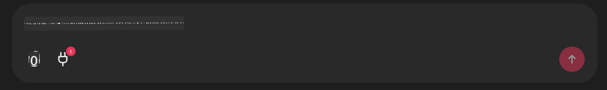

<!--
CO_OP_TRANSLATOR_METADATA:
{
  "original_hash": "9bf0395cbc541ce8db2a9699c8678dfc",
  "translation_date": "2025-07-12T14:25:15+00:00",
  "source_file": "11-mcp/code_samples/github-mcp/README.md",
  "language_code": "sl"
}
-->
# Github MCP strežnik primer

## Opis

To je bila predstavitvena različica, ustvarjena za AI Agents Hackathon, ki ga je gostil Microsoft Reactor.

Orodje se uporablja za priporočanje projektov za hackathon na podlagi uporabnikovih Github repozitorijev.  
To se izvaja z:

1. **Github Agent** - uporaba Github MCP strežnika za pridobivanje repozitorijev in informacij o teh repozitorijih.  
2. **Hackathon Agent** - prejme podatke od Github Agenta in ustvari kreativne ideje za hackathon projekte na podlagi projektov, programskih jezikov, ki jih uporabnik uporablja, in projektnih področij za AI Agents hackathon.  
3. **Events Agent** - na podlagi predlogov hackathon agenta priporoči ustrezne dogodke iz serije AI Agent Hackathon.

## Zagon kode

### Okoljske spremenljivke

Ta predstavitvena različica uporablja Azure Open AI Service, Semantic Kernel, Github MCP strežnik in Azure AI Search.

Poskrbite, da imate pravilno nastavljene okoljske spremenljivke za uporabo teh orodij:

```python
AZURE_OPENAI_CHAT_DEPLOYMENT_NAME=""
AZURE_OPENAI_EMBEDDING_DEPLOYMENT_NAME=""
AZURE_OPENAI_ENDPOINT=""
AZURE_OPENAI_API_KEY=""
AZURE_OPENAI_API_VERSION=""
AZURE_SEARCH_SERVICE_ENDPOINT=""
AZURE_SEARCH_API_KEY=""
```

## Zagon Chainlit strežnika

Za povezavo z MCP strežnikom ta predstavitvena različica uporablja Chainlit kot klepetalni vmesnik.

Za zagon strežnika uporabite naslednji ukaz v terminalu:

```bash
chainlit run app.py -w
```

To bo zagnalo vaš Chainlit strežnik na `localhost:8000` in hkrati napolnilo vaš Azure AI Search indeks z vsebino `event-descriptions.md`.

## Povezava z MCP strežnikom

Za povezavo z Github MCP strežnikom izberite ikono "vtičnice" pod poljem za vnos sporočila "Type your message here..":



Nato kliknite na "Connect an MCP", da dodate ukaz za povezavo z Github MCP strežnikom:

```bash
npx -y @modelcontextprotocol/server-github --env GITHUB_PERSONAL_ACCESS_TOKEN=[YOUR PERSONAL ACCESS TOKEN]
```

Zamenjajte "[YOUR PERSONAL ACCESS TOKEN]" z vašim dejanskim osebnim dostopnim žetonom.

Po povezavi bi morali ob ikoni vtičnice videti (1), kar potrjuje, da je povezava vzpostavljena. Če ne, poskusite znova zagnati chainlit strežnik z ukazom `chainlit run app.py -w`.

## Uporaba predstavitve

Za začetek delovnega toka agenta, ki priporoča hackathon projekte, lahko vnesete sporočilo, kot je:

"Recommend hackathon projects for the Github user koreyspace"

Router Agent bo analiziral vašo zahtevo in določil, katera kombinacija agentov (GitHub, Hackathon in Events) je najbolj primerna za obravnavo vašega poizvedovanja. Agenti sodelujejo, da zagotovijo celovite priporočila na podlagi analize Github repozitorijev, ustvarjanja idej za projekte in ustreznih tehnoloških dogodkov.

**Omejitev odgovornosti**:  
Ta dokument je bil preveden z uporabo AI prevajalske storitve [Co-op Translator](https://github.com/Azure/co-op-translator). Čeprav si prizadevamo za natančnost, vas opozarjamo, da avtomatizirani prevodi lahko vsebujejo napake ali netočnosti. Izvirni dokument v njegovem izvirnem jeziku velja za avtoritativni vir. Za ključne informacije priporočamo strokovni človeški prevod. Za morebitna nesporazume ali napačne interpretacije, ki izhajajo iz uporabe tega prevoda, ne odgovarjamo.