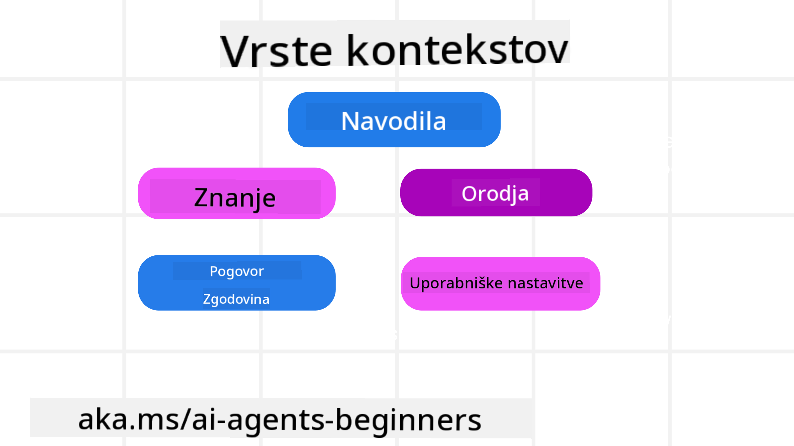
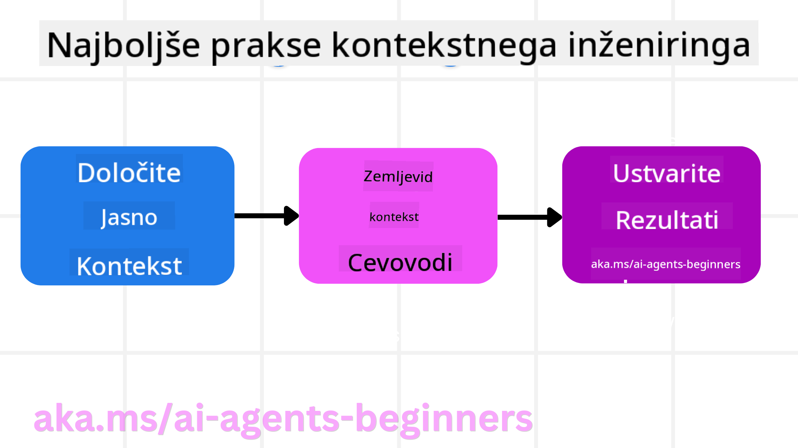

<!--
CO_OP_TRANSLATOR_METADATA:
{
  "original_hash": "cb7e50f471905ce6fdb92a30269a7a98",
  "translation_date": "2025-09-04T10:31:58+00:00",
  "source_file": "12-context-engineering/README.md",
  "language_code": "sl"
}
-->
# Inženiring konteksta za AI agente

> _(Kliknite zgornjo sliko za ogled videoposnetka te lekcije)_

Razumevanje kompleksnosti aplikacije, za katero gradite AI agenta, je ključno za ustvarjanje zanesljivega sistema. Graditi moramo AI agente, ki učinkovito upravljajo informacije za reševanje kompleksnih potreb, ki presegajo zgolj inženiring pozivov.

V tej lekciji bomo raziskali, kaj je inženiring konteksta in kakšno vlogo ima pri gradnji AI agentov.

## Uvod

Ta lekcija bo obravnavala:

• **Kaj je inženiring konteksta** in zakaj se razlikuje od inženiringa pozivov.

• **Strategije za učinkovit inženiring konteksta**, vključno s pisanjem, izbiranjem, stiskanjem in izolacijo informacij.

• **Pogoste napake pri delu s kontekstom**, ki lahko zmotijo vašega AI agenta, in kako jih odpraviti.

## Cilji učenja

Po zaključku te lekcije boste razumeli, kako:

• **Definirati inženiring konteksta** in ga razlikovati od inženiringa pozivov.

• **Prepoznati ključne komponente konteksta** v aplikacijah z velikimi jezikovnimi modeli (LLM).

• **Uporabiti strategije za pisanje, izbiro, stiskanje in izolacijo konteksta**, da izboljšate delovanje agenta.

• **Prepoznati pogoste napake pri delu s kontekstom**, kot so zastrupitev, motnje, zmeda in konflikti, ter implementirati tehnike za njihovo odpravo.

## Kaj je inženiring konteksta?

Za AI agente je kontekst tisti, ki usmerja načrtovanje agenta pri izvajanju določenih dejanj. Inženiring konteksta je praksa zagotavljanja, da ima AI agent prave informacije za izvedbo naslednjega koraka naloge. Ker je kontekstno okno omejeno po velikosti, moramo kot graditelji agentov razviti sisteme in procese za dodajanje, odstranjevanje in stiskanje informacij v kontekstnem oknu.

### Inženiring pozivov proti inženiringu konteksta

Inženiring pozivov se osredotoča na en sam nabor statičnih navodil za učinkovito usmerjanje AI agentov z določenimi pravili. Inženiring konteksta pa se ukvarja z upravljanjem dinamičnega nabora informacij, vključno z začetnim pozivom, da se zagotovi, da ima AI agent skozi čas vse potrebne informacije. Glavna ideja inženiringa konteksta je, da ta proces postane ponovljiv in zanesljiv.

### Vrste konteksta

Pomembno je vedeti, da kontekst ni le ena stvar. Informacije, ki jih AI agent potrebuje, lahko prihajajo iz različnih virov, in na nas je, da zagotovimo dostop do teh virov:

Vrste konteksta, ki jih AI agent morda potrebuje za upravljanje, vključujejo:

• **Navodila:** To so kot "pravila" agenta – pozivi, sistemska sporočila, primeri z malo poskusi (prikaz, kako nekaj narediti) in opisi orodij, ki jih lahko uporablja. Tukaj se osredotočenost inženiringa pozivov združuje z inženiringom konteksta.

• **Znanje:** To vključuje dejstva, informacije, pridobljene iz baz podatkov, ali dolgoročne spomine, ki jih je agent pridobil. To vključuje integracijo sistema za pridobivanje informacij (RAG), če agent potrebuje dostop do različnih virov znanja in baz podatkov.

• **Orodja:** To so definicije zunanjih funkcij, API-jev in MCP strežnikov, ki jih agent lahko pokliče, skupaj s povratnimi informacijami (rezultati), ki jih dobi z njihovo uporabo.

• **Zgodovina pogovorov:** Potekajoči dialog z uporabnikom. Sčasoma ti pogovori postanejo daljši in bolj zapleteni, kar pomeni, da zavzamejo več prostora v kontekstnem oknu.

• **Uporabniške preference:** Informacije, pridobljene o uporabnikovih željah ali neodobravanjih skozi čas. Te se lahko shranijo in uporabijo pri sprejemanju ključnih odločitev za pomoč uporabniku.

## Strategije za učinkovit inženiring konteksta

### Strategije načrtovanja

Dober inženiring konteksta se začne z dobrim načrtovanjem. Tukaj je pristop, ki vam bo pomagal začeti razmišljati o tem, kako uporabiti koncept inženiringa konteksta:

1. **Določite jasne rezultate** – Rezultati nalog, ki bodo dodeljene AI agentom, morajo biti jasno opredeljeni. Odgovorite na vprašanje: "Kako bo svet videti, ko bo AI agent končal svojo nalogo?" Z drugimi besedami, kakšno spremembo, informacijo ali odgovor naj uporabnik dobi po interakciji z AI agentom.

2. **Zemljevid konteksta** – Ko določite rezultate AI agenta, morate odgovoriti na vprašanje: "Katere informacije potrebuje AI agent za dokončanje te naloge?" Tako lahko začnete mapirati kontekst, kje se te informacije nahajajo.

3. **Ustvarite kontekstne tokove** – Ko veste, kje so informacije, morate odgovoriti na vprašanje: "Kako bo agent pridobil te informacije?" To lahko storite na različne načine, vključno z RAG, uporabo MCP strežnikov in drugih orodij.

### Praktične strategije

Načrtovanje je pomembno, vendar ko informacije začnejo pritekati v kontekstno okno agenta, moramo imeti praktične strategije za njihovo upravljanje:

#### Upravljanje konteksta

Medtem ko bodo nekatere informacije samodejno dodane v kontekstno okno, je inženiring konteksta bolj aktiven pristop k tem informacijam, kar lahko storimo z nekaj strategijami:

1. **Agentov beležnik**  
   To omogoča AI agentu, da si zapisuje pomembne informacije o trenutnih nalogah in interakcijah z uporabnikom med eno sejo. Beležnik naj obstaja zunaj kontekstnega okna v datoteki ali objektu izvajanja, ki ga lahko agent kasneje pridobi med to sejo, če je potrebno.

2. **Spomini**  
   Beležniki so dobri za upravljanje informacij zunaj kontekstnega okna ene seje. Spomini omogočajo agentom shranjevanje in pridobivanje pomembnih informacij skozi več sej. To lahko vključuje povzetke, uporabniške preference in povratne informacije za izboljšave v prihodnosti.

3. **Stiskanje konteksta**  
   Ko kontekstno okno raste in se približuje svoji meji, lahko uporabimo tehnike, kot sta povzemanje in obrezovanje. To vključuje ohranjanje le najpomembnejših informacij ali odstranjevanje starejših sporočil.

4. **Sistemi z več agenti**  
   Razvoj sistema z več agenti je oblika inženiringa konteksta, saj ima vsak agent svoje kontekstno okno. Načrtovanje, kako se ta kontekst deli in prenaša med različnimi agenti, je še ena pomembna naloga pri gradnji teh sistemov.

5. **Peskovniški okolji**  
   Če agent potrebuje zagon kode ali obdelavo velike količine informacij v dokumentu, to lahko zavzame veliko število žetonov za obdelavo rezultatov. Namesto da bi vse to shranili v kontekstnem oknu, lahko agent uporabi peskovniško okolje, ki lahko zažene to kodo in prebere le rezultate ter druge pomembne informacije.

6. **Objekti stanja izvajanja**  
   To se izvaja z ustvarjanjem vsebnikov informacij za upravljanje situacij, ko agent potrebuje dostop do določenih informacij. Pri kompleksni nalogi bi to omogočilo agentu shranjevanje rezultatov vsakega podkoraka, kar omogoča, da kontekst ostane povezan le s tem specifičnim podkorakom.

### Primer inženiringa konteksta

Recimo, da želimo, da AI agent **"Rezervira potovanje v Pariz."**

• Preprost agent, ki uporablja le inženiring pozivov, bi morda odgovoril: **"V redu, kdaj želite iti v Pariz?"**. Obdelal bi le vaše neposredno vprašanje v trenutku, ko ste ga postavili.

• Agent, ki uporablja strategije inženiringa konteksta, bi naredil veliko več. Preden bi sploh odgovoril, bi njegov sistem morda:

  ◦ **Preveril vaš koledar** za razpoložljive datume (pridobivanje podatkov v realnem času).

  ◦ **Priklical pretekle potovalne preference** (iz dolgoročnega spomina), kot so vaša najljubša letalska družba, proračun ali ali imate raje neposredne lete.

  ◦ **Prepoznal razpoložljiva orodja** za rezervacijo letov in hotelov.

- Nato bi lahko primer odgovora bil: "Hej [Vaše ime]! Vidim, da ste prosti prvi teden oktobra. Naj poiščem neposredne lete v Pariz z [Najljubša letalska družba] v okviru vašega običajnega proračuna [Proračun]?" Ta bogatejši, kontekstno zavedni odgovor prikazuje moč inženiringa konteksta.

## Pogoste napake pri delu s kontekstom

### Zastrupitev konteksta

**Kaj je to:** Ko halucinacija (napačne informacije, ki jih ustvari LLM) ali napaka vstopi v kontekst in se večkrat sklicuje nanjo, kar povzroči, da agent zasleduje nemogoče cilje ali razvije nesmiselne strategije.

**Kaj storiti:** Uvedite **validacijo konteksta** in **karanteno**. Validirajte informacije, preden jih dodate v dolgoročni spomin. Če zaznate morebitno zastrupitev, začnite nove kontekstne niti, da preprečite širjenje napačnih informacij.

**Primer rezervacije potovanja:** Vaš agent halucinira **neposreden let iz majhnega lokalnega letališča v oddaljeno mednarodno mesto**, ki dejansko ne ponuja mednarodnih letov. Ta neobstoječa podrobnost leta se shrani v kontekst. Kasneje, ko agenta prosite za rezervacijo, še naprej poskuša najti vozovnice za to nemogočo pot, kar vodi do ponavljajočih se napak.

**Rešitev:** Uvedite korak, ki **validira obstoj letov in poti z API-jem v realnem času** _preden_ dodate podrobnosti leta v delovni kontekst agenta. Če validacija ne uspe, se napačne informacije "dajo v karanteno" in se ne uporabljajo več.

### Motnje v kontekstu

**Kaj je to:** Ko kontekst postane tako obsežen, da se model preveč osredotoči na nakopičeno zgodovino namesto na to, kar se je naučil med usposabljanjem, kar vodi do ponavljajočih se ali neuporabnih dejanj. Modeli lahko začnejo delati napake, še preden je kontekstno okno polno.

**Kaj storiti:** Uporabite **povzemanje konteksta**. Občasno stisnite nakopičene informacije v krajše povzetke, pri čemer ohranite pomembne podrobnosti in odstranite odvečno zgodovino. To pomaga "ponastaviti" osredotočenost.

**Primer rezervacije potovanja:** Dolgo časa razpravljate o različnih sanjskih destinacijah, vključno s podrobnim opisom vašega pohodniškega potovanja pred dvema letoma. Ko končno rečete: **"Najdi mi poceni let za naslednji mesec,"** se agent zatakne v starih, nepomembnih podrobnostih in vas še naprej sprašuje o pohodniški opremi ali preteklih itinerarjih, namesto da bi se osredotočil na vašo trenutno zahtevo.

**Rešitev:** Po določenem številu korakov ali ko kontekst postane prevelik, naj agent **povzame najnovejše in najpomembnejše dele pogovora** – osredotočene na vaše trenutne datume potovanja in destinacijo – ter uporabi ta strnjen povzetek za naslednji klic LLM, pri čemer zavrže manj pomembno zgodovino pogovora.

### Zmeda v kontekstu

**Kaj je to:** Ko nepotreben kontekst, pogosto v obliki preveč razpoložljivih orodij, povzroči, da model generira napačne odgovore ali pokliče nepomembna orodja. Manjši modeli so še posebej dovzetni za to.

**Kaj storiti:** Uvedite **upravljanje nabora orodij** z uporabo tehnik RAG. Shranite opise orodij v vektorsko bazo podatkov in izberite _le_ najpomembnejša orodja za vsako specifično nalogo. Raziskave kažejo, da je omejitev izbire orodij na manj kot 30 učinkovita.

**Primer rezervacije potovanja:** Vaš agent ima dostop do ducatov orodij: `book_flight`, `book_hotel`, `rent_car`, `find_tours`, `currency_converter`, `weather_forecast`, `restaurant_reservations` itd. Ko vprašate, **"Kateri je najboljši način za premikanje po Parizu?"**, se agent zaradi velikega števila orodij zmede in poskuša poklicati `book_flight` _znotraj_ Pariza ali `rent_car`, čeprav imate raje javni prevoz, ker se opisi orodij lahko prekrivajo ali pa preprosto ne more razločiti najboljšega.

**Rešitev:** Uporabite **RAG za opise orodij**. Ko vprašate o premikanju po Parizu, sistem dinamično pridobi _le_ najpomembnejša orodja, kot sta `rent_car` ali `public_transport_info`, glede na vaše vprašanje, in predstavi osredotočen "nabor orodij" LLM-ju.

### Konflikt v kontekstu

**Kaj je to:** Ko v kontekstu obstajajo nasprotujoče si informacije, kar vodi do nedoslednega razmišljanja ali slabih končnih odgovorov. To se pogosto zgodi, ko informacije prispejo v fazah, starejše napačne predpostavke pa ostanejo v kontekstu.

**Kaj storiti:** Uporabite **obrezovanje konteksta** in **odlaganje**. Obrezovanje pomeni odstranjevanje zastarelih ali nasprotujočih si informacij, ko prispejo nove podrobnosti. Odlaganje omogoča modelu ločen "beležnik" za obdelavo informacij, ne da bi obremenjeval glavni kontekst.

**Primer rezervacije potovanja:** Sprva poveste agentu, **"Želim leteti v ekonomskem razredu."** Kasneje v pogovoru si premislite in rečete, **"Pravzaprav, za to potovanje želim poslovni razred."** Če obe navodili ostaneta v kontekstu, lahko agent prejme nasprotujoče si rezultate iskanja ali se zmede, katero željo naj upošteva.

**Rešitev:** Uvedite **obrezovanje konteksta**. Ko novo navodilo nasprotuje staremu, se starejše navodilo odstrani ali izrecno preglasi v kontekstu. Alternativno lahko agent uporabi **beležnik**, da uskladi nasprotujoče si preference, preden se odloči, s čimer zagotovi, da le končna, dosledna navodila usmerjajo njegova dejanja.

## Imate več vprašanj o inženiringu konteksta?

Pridružite se [Azure AI Foundry Discord](https://aka.ms/ai-agents/discord), da se povežete z drugimi učenci, obiščete uradne ure in dobite odgovore na svoja vprašanja o AI agentih.

---

**Omejitev odgovornosti**:  
Ta dokument je bil preveden z uporabo storitve za strojno prevajanje [Co-op Translator](https://github.com/Azure/co-op-translator). Čeprav si prizadevamo za natančnost, vas prosimo, da upoštevate, da lahko avtomatizirani prevodi vsebujejo napake ali netočnosti. Izvirni dokument v njegovem izvirnem jeziku je treba obravnavati kot avtoritativni vir. Za ključne informacije priporočamo strokovno človeško prevajanje. Ne prevzemamo odgovornosti za morebitna nesporazumevanja ali napačne razlage, ki izhajajo iz uporabe tega prevoda.