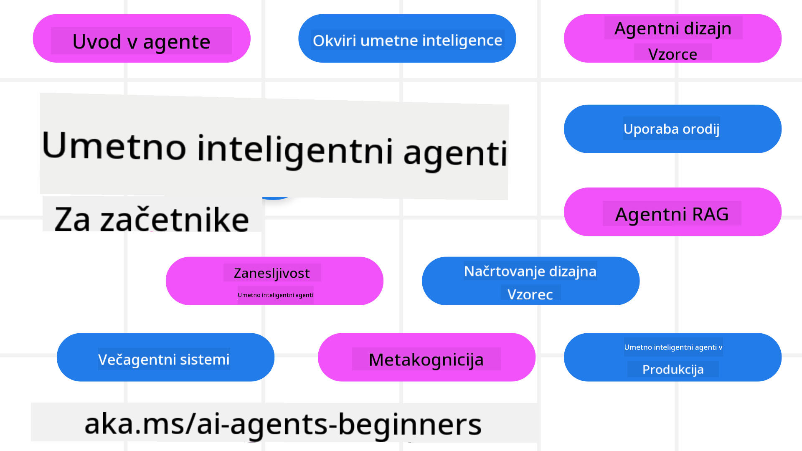

<!--
CO_OP_TRANSLATOR_METADATA:
{
  "original_hash": "b06f16d6944fab788df1db7638d0edaa",
  "translation_date": "2025-07-12T08:48:27+00:00",
  "source_file": "README.md",
  "language_code": "sl"
}
-->
# AI agenti za začetnike - tečaj

## 11 lekcij, ki te naučijo vsega, kar potrebuješ za začetek gradnje AI agentov

  
  
  
  

### 🌐 Podpora za več jezikov

#### Podprto preko GitHub Action (avtomatizirano in vedno posodobljeno)

[French](../fr/README.md) | [Spanish](../es/README.md) | [German](../de/README.md) | [Russian](../ru/README.md) | [Arabic](../ar/README.md) | [Persian (Farsi)](../fa/README.md) | [Urdu](../ur/README.md) | [Chinese (Simplified)](../zh/README.md) | [Chinese (Traditional, Macau)](../mo/README.md) | [Chinese (Traditional, Hong Kong)](../hk/README.md) | [Chinese (Traditional, Taiwan)](../tw/README.md) | [Japanese](../ja/README.md) | [Korean](../ko/README.md) | [Hindi](../hi/README.md) | [Bengali](../bn/README.md) | [Marathi](../mr/README.md) | [Nepali](../ne/README.md) | [Punjabi (Gurmukhi)](../pa/README.md) | [Portuguese (Portugal)](../pt/README.md) | [Portuguese (Brazil)](../br/README.md) | [Italian](../it/README.md) | [Polish](../pl/README.md) | [Turkish](../tr/README.md) | [Greek](../el/README.md) | [Thai](../th/README.md) | [Swedish](../sv/README.md) | [Danish](../da/README.md) | [Norwegian](../no/README.md) | [Finnish](../fi/README.md) | [Dutch](../nl/README.md) | [Hebrew](../he/README.md) | [Vietnamese](../vi/README.md) | [Indonesian](../id/README.md) | [Malay](../ms/README.md) | [Tagalog (Filipino)](../tl/README.md) | [Swahili](../sw/README.md) | [Hungarian](../hu/README.md) | [Czech](../cs/README.md) | [Slovak](../sk/README.md) | [Romanian](../ro/README.md) | [Bulgarian](../bg/README.md) | [Serbian (Cyrillic)](../sr/README.md) | [Croatian](../hr/README.md) | [Slovenian](./README.md)

**Če želite, da podpiramo dodatne jezike, so podprti jeziki navedeni [tukaj](https://github.com/Azure/co-op-translator/blob/main/getting_started/supported-languages.md)**

  
  

## 🌱 Začetek

Ta tečaj vsebuje 11 lekcij, ki pokrivajo osnove gradnje AI agentov. Vsaka lekcija obravnava svojo temo, zato začni kjerkoli želiš!

Za ta tečaj je na voljo podpora za več jezikov. Oglej si [razpoložljive jezike tukaj](../..).

Če je to tvoj prvič, da delaš z generativnimi AI modeli, si oglej naš tečaj [Generativna AI za začetnike](https://aka.ms/genai-beginners), ki vsebuje 21 lekcij o gradnji z GenAI.

Ne pozabi [ozvezditi (🌟) tega repozitorija](https://docs.github.com/en/get-started/exploring-projects-on-github/saving-repositories-with-stars?WT.mc_id=academic-105485-koreyst) in [forkati ta repozitorij](https://github.com/microsoft/ai-agents-for-beginners/fork), da lahko zaženeš kodo.

### Kaj potrebuješ

Vsaka lekcija v tem tečaju vsebuje primere kode, ki jih najdeš v mapi code_samples. Lahko [forkaš ta repozitorij](https://github.com/microsoft/ai-agents-for-beginners/fork), da ustvariš svojo kopijo.

Primeri kode v teh vajah uporabljajo Azure AI Foundry in GitHub Model Catalogs za delo z jezikovnimi modeli:

- [Github Models](https://aka.ms/ai-agents-beginners/github-models) - Brezplačno / Omejeno  
- [Azure AI Foundry](https://aka.ms/ai-agents-beginners/ai-foundry) - Potreben Azure račun

Ta tečaj uporablja tudi naslednje AI agentne ogrodja in storitve Microsofta:

- [Azure AI Agent Service](https://aka.ms/ai-agents-beginners/ai-agent-service)  
- [Semantic Kernel](https://aka.ms/ai-agents-beginners/semantic-kernel)  
- [AutoGen](https://aka.ms/ai-agents/autogen)

Za več informacij o zagonu kode za ta tečaj obišči [Course Setup](./00-course-setup/README.md).

## 🙏 Želiš pomagati?

Imaš predloge ali si našel napake v črkovanju ali kodi? [Odpri issue](https://github.com/microsoft/ai-agents-for-beginners/issues?WT.mc_id=academic-105485-koreyst) ali [ustvari pull request](https://github.com/microsoft/ai-agents-for-beginners/pulls?WT.mc_id=academic-105485-koreyst).

Če se zatakneš ali imaš vprašanja o gradnji AI agentov, se pridruži našemu [Azure AI Foundry Community Discord](https://discord.gg/kzRShWzttr).

Če imaš povratne informacije o izdelku ali napake med gradnjo, obišči naš [Azure AI Foundry Developer Forum](https://aka.ms/azureaifoundry/forum).

## 📂 Vsaka lekcija vsebuje

- Pisno lekcijo v README in kratek video  
- Python primere kode, ki podpirajo Azure AI Foundry in Github Models (brezplačno)  
- Povezave do dodatnih virov za nadaljnje učenje  

## 🗃️ Lekcije

| **Lekcija**                              | **Besedilo & Koda**                                | **Video**                                                  | **Dodatno učenje**                                                                     |
|-----------------------------------------|----------------------------------------------------|------------------------------------------------------------|----------------------------------------------------------------------------------------|
| Uvod v AI agente in primere uporabe     | [Povezava](./01-intro-to-ai-agents/README.md)      | [Video](https://youtu.be/3zgm60bXmQk?si=z8QygFvYQv-9WtO1)  | [Povezava](https://aka.ms/ai-agents-beginners/collection?WT.mc_id=academic-105485-koreyst) |
| Raziskovanje AI agentnih ogrodij        | [Povezava](./02-explore-agentic-frameworks/README.md) | [Video](https://youtu.be/ODwF-EZo_O8?si=Vawth4hzVaHv-u0H)  | [Povezava](https://aka.ms/ai-agents-beginners/collection?WT.mc_id=academic-105485-koreyst) |
| Razumevanje AI agentnih oblikovalskih vzorcev | [Povezava](./03-agentic-design-patterns/README.md) | [Video](https://youtu.be/m9lM8qqoOEA?si=BIzHwzstTPL8o9GF)  | [Povezava](https://aka.ms/ai-agents-beginners/collection?WT.mc_id=academic-105485-koreyst) |
| Vzorec uporabe orodij                   | [Povezava](./04-tool-use/README.md)                 | [Video](https://youtu.be/vieRiPRx-gI?si=2z6O2Xu2cu_Jz46N)  | [Povezava](https://aka.ms/ai-agents-beginners/collection?WT.mc_id=academic-105485-koreyst) |
| Agentic RAG                            | [Povezava](./05-agentic-rag/README.md)              | [Video](https://youtu.be/WcjAARvdL7I?si=gKPWsQpKiIlDH9A3)  | [Povezava](https://aka.ms/ai-agents-beginners/collection?WT.mc_id=academic-105485-koreyst) |
| Gradnja zaupanja vrednih AI agentov     | [Povezava](./06-building-trustworthy-agents/README.md) | [Video](https://youtu.be/iZKkMEGBCUQ?si=jZjpiMnGFOE9L8OK)  | [Povezava](https://aka.ms/ai-agents-beginners/collection?WT.mc_id=academic-105485-koreyst) |
| Vzorec načrtovanja                      | [Povezava](./07-planning-design/README.md)          | [Video](https://youtu.be/kPfJ2BrBCMY?si=6SC_iv_E5-mzucnC)  | [Povezava](https://aka.ms/ai-agents-beginners/collection?WT.mc_id=academic-105485-koreyst) |
| Vzorec večagentnega sistema             | [Povezava](./08-multi-agent/README.md)              | [Video](https://youtu.be/V6HpE9hZEx0?si=rMgDhEu7wXo2uo6g)  | [Povezava](https://aka.ms/ai-agents-beginners/collection?WT.mc_id=academic-105485-koreyst) |
| Vzorec metakognicije                    | [Povezava](./09-metacognition/README.md)            | [Video](https://youtu.be/His9R6gw6Ec?si=8gck6vvdSNCt6OcF)  | [Povezava](https://aka.ms/ai-agents-beginners/collection?WT.mc_id=academic-105485-koreyst) |
| AI agenti v produkciji                  | [Povezava](./10-ai-agents-production/README.md)     | [Video](https://youtu.be/l4TP6IyJxmQ?si=31dnhexRo6yLRJDl)  | [Povezava](https://aka.ms/ai-agents-beginners/collection?WT.mc_id=academic-105485-koreyst) |
| AI agenti z MCP                        | [Povezava](./11-mcp/README.md)                      |                                                            | [Povezava](https://aka.ms/mcp-for-beginners)                                           |

## 🎒 Drugi tečaji

Naša ekipa pripravlja tudi druge tečaje! Oglej si:

- [**NOVO** Model Context Protocol (MCP) za začetnike](https://github.com/microsoft/mcp-for-beginners?WT.mc_id=academic-105485-koreyst)
- [Generativna umetna inteligenca za začetnike z uporabo .NET](https://github.com/microsoft/Generative-AI-for-beginners-dotnet?WT.mc_id=academic-105485-koreyst)
- [Generativna umetna inteligenca za začetnike](https://github.com/microsoft/generative-ai-for-beginners?WT.mc_id=academic-105485-koreyst)
- [Strojno učenje za začetnike](https://aka.ms/ml-beginners?WT.mc_id=academic-105485-koreyst)
- [Podatkovna znanost za začetnike](https://aka.ms/datascience-beginners?WT.mc_id=academic-105485-koreyst)
- [Umetna inteligenca za začetnike](https://aka.ms/ai-beginners?WT.mc_id=academic-105485-koreyst)
- [Kibernetska varnost za začetnike](https://github.com/microsoft/Security-101??WT.mc_id=academic-96948-sayoung)
- [Spletni razvoj za začetnike](https://aka.ms/webdev-beginners?WT.mc_id=academic-105485-koreyst)
- [Internet stvari za začetnike](https://aka.ms/iot-beginners?WT.mc_id=academic-105485-koreyst)
- [Razvoj XR za začetnike](https://github.com/microsoft/xr-development-for-beginners?WT.mc_id=academic-105485-koreyst)
- [Obvladovanje GitHub Copilot za AI programiranje v paru](https://aka.ms/GitHubCopilotAI?WT.mc_id=academic-105485-koreyst)
- [Obvladovanje GitHub Copilot za C#/.NET razvijalce](https://github.com/microsoft/mastering-github-copilot-for-dotnet-csharp-developers?WT.mc_id=academic-105485-koreyst)
- [Izberi svojo Copilot pustolovščino](https://github.com/microsoft/CopilotAdventures?WT.mc_id=academic-105485-koreyst)

## 🌟 Zahvala skupnosti

Hvala [Shivam Goyal](https://www.linkedin.com/in/shivam2003/) za prispevek pomembnih primerov kode, ki prikazujejo Agentic RAG.

## Prispevanje

Ta projekt sprejema prispevke in predloge. Večina prispevkov zahteva, da se strinjate z
Contributor License Agreement (CLA), s katerim izjavljate, da imate pravico in dejansko dovolite,
da uporabljamo vaš prispevek. Za podrobnosti obiščite
<https://cla.opensource.microsoft.com>.

Ko oddate pull request, bo CLA bot samodejno preveril, ali morate predložiti
CLA in ustrezno označil PR (npr. statusni pregled, komentar). Preprosto sledite navodilom,
ki jih poda bot. To boste morali storiti le enkrat za vse repozitorije, ki uporabljajo naš CLA.

Ta projekt je sprejel [Microsoft Open Source Code of Conduct](https://opensource.microsoft.com/codeofconduct/).
Za več informacij si oglejte [Pogosta vprašanja o kodeksu ravnanja](https://opensource.microsoft.com/codeofconduct/faq/) ali
kontaktirajte [opencode@microsoft.com](mailto:opencode@microsoft.com) za dodatna vprašanja ali pripombe.

## Zaščitni znaki

Ta projekt lahko vsebuje zaščitne znake ali logotipe za projekte, izdelke ali storitve. Pooblaščena uporaba Microsoftovih
zaščitnih znakov ali logotipov je podvržena in mora slediti
[Microsoftovim smernicam za uporabo zaščitnih znakov in blagovnih znamk](https://www.microsoft.com/legal/intellectualproperty/trademarks/usage/general).
Uporaba Microsoftovih zaščitnih znakov ali logotipov v spremenjenih različicah tega projekta ne sme povzročati zmede ali nakazovati sponzorstva Microsofta.
Vsaka uporaba zaščitnih znakov ali logotipov tretjih oseb je podvržena pravilom teh tretjih oseb.

**Omejitev odgovornosti**:  
Ta dokument je bil preveden z uporabo AI prevajalske storitve [Co-op Translator](https://github.com/Azure/co-op-translator). Čeprav si prizadevamo za natančnost, vas opozarjamo, da avtomatizirani prevodi lahko vsebujejo napake ali netočnosti. Izvirni dokument v njegovem izvirnem jeziku velja za avtoritativni vir. Za pomembne informacije priporočamo strokovni človeški prevod. Za morebitna nesporazume ali napačne interpretacije, ki izhajajo iz uporabe tega prevoda, ne odgovarjamo.