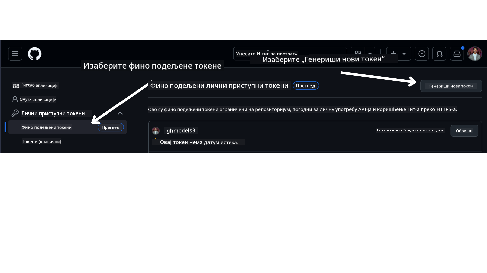

<!--
CO_OP_TRANSLATOR_METADATA:
{
  "original_hash": "76945069b52a49cd0432ae3e0b0ba22e",
  "translation_date": "2025-07-12T07:57:55+00:00",
  "source_file": "00-course-setup/README.md",
  "language_code": "sr"
}
-->
у вашем GitHub налогу.

Изаберите опцију `Fine-grained tokens` са леве стране екрана.

Затим изаберите `Generate new token`.



Бићете упитани да унесете име за ваш токен, изаберете датум истека (Препоручено: 30 дана) и изаберете опсеге за ваш токен (Јавни репозиторијуми).

Такође је неопходно изменити дозволе овог токена: Permissions -> Models -> Дозволи приступ GitHub моделима

Копирајте нови токен који сте управо креирали. Сада ћете га додати у ваш `.env` фајл који је укључен у овај курс.

### Корак 2: Креирајте ваш `.env` фајл

Да бисте креирали ваш `.env` фајл, покрените следећу команду у вашем терминалу.

```bash
cp .env.example .env
```

Ово ће копирати пример фајла и креирати `.env` у вашем директоријуму где ћете унети вредности за променљиве окружења.

Када копирате ваш токен, отворите `.env` фајл у вашем омиљеном уређивачу текста и налепите токен у поље `GITHUB_TOKEN`.

Сада би требало да можете да покренете примере кода из овог курса.

## Подешавање за примере који користе Azure AI Foundry и Azure AI Agent Service

### Корак 1: Преузмите Endpoint вашег Azure пројекта

Пратите кораке за креирање хаба и пројекта у Azure AI Foundry који се налазе овде: [Hub resources overview](https://learn.microsoft.com/en-us/azure/ai-foundry/concepts/ai-resources)

Када креирате пројекат, потребно је да преузмете конекциони низ за ваш пројекат.

Ово можете урадити тако што ћете отићи на страницу **Overview** вашег пројекта у Azure AI Foundry порталу.


### Корак 2: Креирајте ваш `.env` фајл

Да бисте креирали ваш `.env` фајл, покрените следећу команду у вашем терминалу.

```bash
cp .env.example .env
```

Ово ће копирати пример фајла и креирати `.env` у вашем директоријуму где ћете унети вредности за променљиве окружења.

Када копирате ваш токен, отворите `.env` фајл у вашем омиљеном уређивачу текста и налепите токен у поље `PROJECT_ENDPOINT`.

### Корак 3: Пријавите се у Azure

Као безбедносну добру праксу, користићемо [keyless authentication](https://learn.microsoft.com/azure/developer/ai/keyless-connections?tabs=csharp%2Cazure-cli?WT.mc_id=academic-105485-koreyst) за аутентификацију у Azure OpenAI помоћу Microsoft Entra ID. Пре него што то урадите, прво морате да инсталирате **Azure CLI** према [упутствима за инсталацију](https://learn.microsoft.com/cli/azure/install-azure-cli?WT.mc_id=academic-105485-koreyst) за ваш оперативни систем.

Затим отворите терминал и покрените `az login --use-device-code` да бисте се пријавили на ваш Azure налог.

Када се пријавите, изаберите вашу претплату у терминалу.

## Додатне променљиве окружења - Azure Search и Azure OpenAI

За лекцију Agentic RAG - Лекција 5 - постоје примери који користе Azure Search и Azure OpenAI.

Ако желите да покренете ове примере, потребно је да додате следеће променљиве окружења у ваш `.env` фајл:

### Страница прегледа (Пројекат)

- `AZURE_SUBSCRIPTION_ID` - Проверите **Project details** на страници **Overview** вашег пројекта.

- `AZURE_AI_PROJECT_NAME` - Погледајте на врху странице **Overview** вашег пројекта.

- `AZURE_OPENAI_SERVICE` - Пронађите ово у картици **Included capabilities** за **Azure OpenAI Service** на страници **Overview**.

### Центар за управљање

- `AZURE_OPENAI_RESOURCE_GROUP` - Идите на **Project properties** на страници **Overview** у **Management Center**.

- `GLOBAL_LLM_SERVICE` - Под **Connected resources**, пронађите име везе за **Azure AI Services**. Ако није наведено, проверите у **Azure порталу** унутар ваше групе ресурса за име ресурса AI Services.

### Страница модела и endpoint-ова

- `AZURE_OPENAI_EMBEDDING_DEPLOYMENT_NAME` - Изаберите ваш embedding модел (нпр. `text-embedding-ada-002`) и запишите **Deployment name** из детаља модела.

- `AZURE_OPENAI_CHAT_DEPLOYMENT_NAME` - Изаберите ваш chat модел (нпр. `gpt-4o-mini`) и запишите **Deployment name** из детаља модела.

### Azure портал

- `AZURE_OPENAI_ENDPOINT` - Потражите **Azure AI services**, кликните на њега, затим идите на **Resource Management**, **Keys and Endpoint**, скролујте до "Azure OpenAI endpoints" и копирајте онај који пише "Language APIs".

- `AZURE_OPENAI_API_KEY` - Са истог екрана, копирајте KEY 1 или KEY 2.

- `AZURE_SEARCH_SERVICE_ENDPOINT` - Пронађите ваш **Azure AI Search** ресурс, кликните на њега и погледајте **Overview**.

- `AZURE_SEARCH_API_KEY` - Затим идите на **Settings** и онда **Keys** да бисте копирали примарни или секундарни администраторски кључ.

### Спољна веб страница

- `AZURE_OPENAI_API_VERSION` - Посетите страницу [API version lifecycle](https://learn.microsoft.com/en-us/azure/ai-services/openai/api-version-deprecation#latest-ga-api-release) под **Latest GA API release**.

### Подешавање keyless аутентификације

Уместо да уносите ваше акредитиве директно у код, користићемо keyless конекцију са Azure OpenAI. За то ћемо импортовати `DefaultAzureCredential` и касније позвати функцију `DefaultAzureCredential` да добијемо акредитиве.

```python
from azure.identity import DefaultAzureCredential, InteractiveBrowserCredential
```

## Запели сте негде?

Ако имате било каквих проблема са покретањем овог подешавања, придружите се нашем

или

.

## Следећа лекција

Сада сте спремни да покренете код за овај курс. Срећно у учењу више о свету AI агената!

[Introduction to AI Agents and Agent Use Cases](../01-intro-to-ai-agents/README.md)

**Одрицање од одговорности**:  
Овај документ је преведен коришћењем AI сервиса за превођење [Co-op Translator](https://github.com/Azure/co-op-translator). Иако тежимо прецизности, молимо вас да имате у виду да аутоматски преводи могу садржати грешке или нетачности. Оригинални документ на његовом изворном језику треба сматрати ауторитетним извором. За критичне информације препоручује се професионални људски превод. Нисмо одговорни за било каква неспоразума или погрешна тумачења која произилазе из коришћења овог превода.