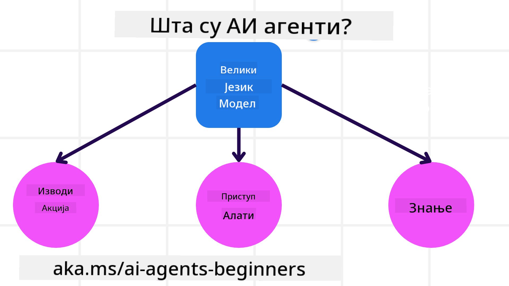
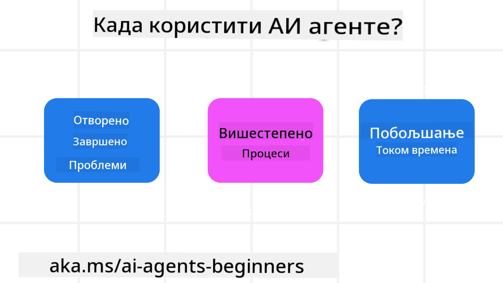

<!--
CO_OP_TRANSLATOR_METADATA:
{
  "original_hash": "d84943abc8f001ad4670418d32c2d899",
  "translation_date": "2025-07-12T08:12:44+00:00",
  "source_file": "01-intro-to-ai-agents/README.md",
  "language_code": "sr"
}
-->
да бисте упознали друге ученике и градитеље AI агената и поставили сва питања која имате у вези са овим курсом.

Да бисмо започели овај курс, почећемо бољим разумевањем шта су AI агенти и како их можемо користити у апликацијама и радним токовима које градимо.

## Увод

Ова лекција обухвата:

- Шта су AI агенти и који су различити типови агената?
- За које случајеве употребе су AI агенти најпогоднији и како нам могу помоћи?
- Који су неки од основних елемената при дизајнирању агентских решења?

## Циљеви учења
Након завршетка ове лекције, требало би да будете у стању да:

- Разумете концепте AI агената и како се разликују од других AI решења.
- Најефикасније примените AI агенте.
- Продуктивно дизајнирате агентска решења за кориснике и клијенте.

## Дефинисање AI агената и типови AI агената

### Шта су AI агенти?

AI агенти су **системи** који омогућавају **великим језичким моделима (LLM)** да **извршавају радње** проширујући њихове могућности тако што LLM-овима дају **приступ алатима** и **знању**.

Хајде да разложимо ову дефиницију на мање делове:

- **Систем** - Важно је размишљати о агентима не као о једном компонентом, већ као о систему састављеном од више компоненти. На основном нивоу, компоненте AI агента су:
  - **Окружење** - Дефинисани простор у коме AI агент функционише. На пример, ако имамо AI агента за резервацију путовања, окружење може бити систем за резервацију путовања који агент користи за обављање задатака.
  - **Сензори** - Окружења имају информације и пружају повратне информације. AI агенти користе сензоре да прикупе и тумаче ове информације о тренутном стању окружења. У примеру агента за резервацију путовања, систем за резервацију може пружити информације као што су доступност хотела или цене летова.
  - **Актуатори** - Када AI агент добије тренутно стање окружења, за тренутни задатак агент одређује коју радњу треба извршити да би променио окружење. За агента за резервацију путовања, то може бити резервација доступне собе за корисника.

**Велики језички модели** - Концепт агената постојао је и пре настанка LLM-ова. Предност изградње AI агената са LLM-овима је њихова способност тумачења људског језика и података. Ова способност омогућава LLM-овима да тумаче информације из окружења и дефинишу план за промену окружења.

**Извршавање радњи** - Изван AI агентских система, LLM-ови су ограничени на ситуације где је радња генерисање садржаја или информација на основу корисничког упита. Унутар AI агентских система, LLM-ови могу обављати задатке тумачењем корисничког захтева и коришћењем алата доступних у њиховом окружењу.

**Приступ алатима** - Које алате LLM има на располагању дефинисано је 1) окружењем у коме ради и 2) програмером AI агента. У примеру агента за путовања, алати агента су ограничени операцијама доступним у систему за резервацију, и/или програмер може ограничити приступ алатима агента само на летове.

**Меморија и знање** - Меморија може бити краткорочна у контексту разговора између корисника и агента. Дугорочно, осим информација које пружа окружење, AI агенти могу такође приступити знању из других система, сервиса, алата, па чак и других агената. У примеру агента за путовања, то знање може бити информација о корисничким преференцама смештена у бази података клијената.

### Различити типови агената

Сада када имамо општу дефиницију AI агената, погледајмо неке специфичне типове агената и како би се они применили на AI агента за резервацију путовања.

| **Тип агента**                | **Опис**                                                                                                                       | **Пример**                                                                                                                                                                                                                   |
| ----------------------------- | ------------------------------------------------------------------------------------------------------------------------------ | ----------------------------------------------------------------------------------------------------------------------------------------------------------------------------------------------------------------------------- |
| **Једноставни рефлексни агенти**      | Извршавају тренутне радње на основу унапред дефинисаних правила.                                                                                  | Агенат за путовања тумачи контекст е-поште и прослеђује жалбе на путовања служби за кориснике.                                                                                                                          |
| **Рефлексни агенти засновани на моделу** | Извршавају радње на основу модела света и промена у том моделу.                                                              | Агенат за путовања приоритизује руте са значајним променама цена на основу приступа историјским подацима о ценама.                                                                                                             |
| **Агенти засновани на циљевима**         | Креирају планове за постизање одређених циљева тумачењем циља и одређивањем радњи за његово остварење.                                  | Агенат за путовања резервише путовање одређујући неопходне аранжмане (аутомобил, јавни превоз, летови) од тренутне локације до одредишта.                                                                                |
| **Агенти засновани на корисности**      | Узимају у обзир преференције и бројчано процењују компромисе да би одредили како да постигну циљеве.                                               | Агенат за путовања максимизира корисност тако што у резервацији путовања балансира између погодности и цене.                                                                                                                                          |
| **Учени агенти**           | Побољшавају се током времена реагујући на повратне информације и прилагођавајући радње у складу са тим.                                                        | Агенат за путовања се побољшава коришћењем повратних информација корисника из анкета након путовања како би прилагодио будуће резервације.                                                                                                               |
| **Хијерархијски агенти**       | Садрже више агената у слојевитом систему, при чему виши нивои деле задатке на подзадатке које нижии нивои агенти извршавају. | Агенат за путовања отказује путовање делећи задатак на подзадатке (нпр. отказивање појединачних резервација) које извршавају нижии нивои агенти, а затим извештавају вишем нивоу.                                     |
| **Системи са више агената (MAS)** | Агенти обављају задатке независно, било кооперативно или конкурентно.                                                           | Кооперативно: Више агената резервише специфичне услуге као што су хотели, летови и забавни садржаји. Конкурентно: Више агената управља и такмичи се за резервације у заједничком календару хотела. |

## Када користити AI агенте

У претходном делу користили смо пример агента за путовања да објаснимо како се различити типови агената могу користити у различитим сценаријима резервације путовања. Наставићемо да користимо ову апликацију током целог курса.

Погледајмо типове случајева употребе за које су AI агенти најпогоднији:

- **Отворени проблеми** - омогућавају LLM-у да одреди потребне кораке за завршетак задатка јер се не могу увек унапред дефинисати у радном току.
- **Вишестепени процеси** - задаци који захтевају ниво сложености у којем AI агент треба да користи алате или информације током више корака, а не само једнократним приступом.  
- **Побољшање током времена** - задаци у којима агент може да се побољшава примајући повратне информације из окружења или од корисника како би пружио бољу корисност.

Више о разматрањима коришћења AI агената покривамо у лекцији Изградња поузданих AI агената.

## Основе агентских решења

### Развој агената

Први корак у дизајнирању AI агентског система је дефинисање алата, радњи и понашања. У овом курсу фокусирамо се на коришћење **Azure AI Agent Service** за дефинисање наших агената. Он нуди функције као што су:

- Избор отворених модела као што су OpenAI, Mistral и Llama
- Коришћење лиценцираних података преко провајдера као што је Tripadvisor
- Коришћење стандардизованих OpenAPI 3.0 алата

### Агентски обрасци

Комуникација са LLM-овима се обавља преко упита (промптова). С обзиром на полуаутономну природу AI агената, није увек могуће или потребно ручно поново слати упите LLM-у након промене у окружењу. Користимо **агентске обрасце** који нам омогућавају да шаљемо упите LLM-у кроз више корака на скалабилнији начин.

Овај курс је подељен према неким од тренутно популарних агентских образаца.

### Агентски оквири

Агентски оквири омогућавају програмерима да имплементирају агентске обрасце кроз код. Ови оквири нуде шаблоне, додатке и алате за бољу сарадњу AI агената. Ове предности пружају могућности за бољу посматрање и решавање проблема у AI агентским системима.

У овом курсу истражићемо истраживачки оријентисан AutoGen оквир и продукцијски спреман Agent оквир из Semantic Kernel-а.

## Претходна лекција

[Course Setup](../00-course-setup/README.md)

## Следећа лекција

[Exploring Agentic Frameworks](../02-explore-agentic-frameworks/README.md)

**Одрицање од одговорности**:  
Овај документ је преведен коришћењем AI услуге за превођење [Co-op Translator](https://github.com/Azure/co-op-translator). Иако се трудимо да превод буде тачан, молимо вас да имате у виду да аутоматски преводи могу садржати грешке или нетачности. Оригинални документ на његовом изворном језику треба сматрати ауторитетним извором. За критичне информације препоручује се професионални људски превод. Нисмо одговорни за било каква неспоразума или погрешна тумачења која произилазе из коришћења овог превода.