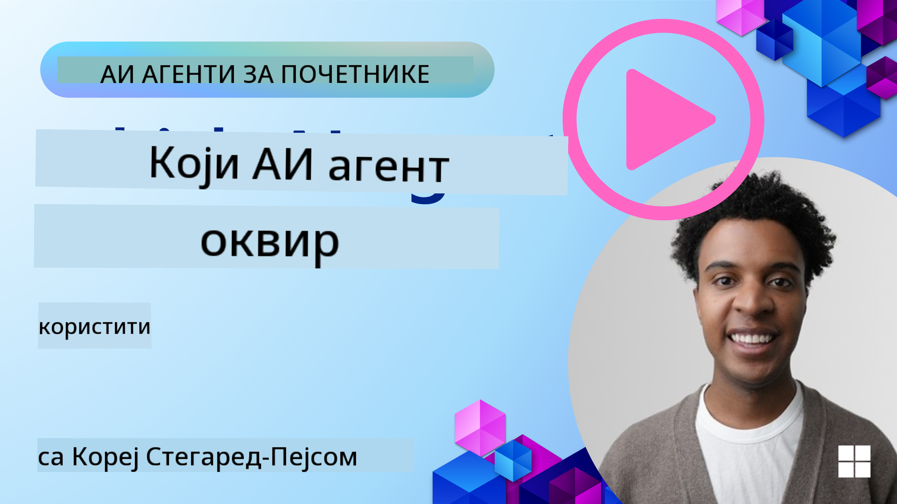

<!--
CO_OP_TRANSLATOR_METADATA:
{
  "original_hash": "a9631d0898fc3c6ecbb3a8a0da7aaba3",
  "translation_date": "2025-08-29T22:53:53+00:00",
  "source_file": "02-explore-agentic-frameworks/README.md",
  "language_code": "sr"
}
-->
[](https://youtu.be/ODwF-EZo_O8?si=1xoy_B9RNQfrYdF7)

> _(Кликните на слику изнад да бисте погледали видео лекције)_

# Истражите оквире за AI агенте

Оквири за AI агенте су софтверске платформе дизајниране да поједноставе креирање, примену и управљање AI агентима. Ови оквири пружају програмерима унапред изграђене компоненте, апстракције и алате који олакшавају развој сложених AI система.

Ови оквири помажу програмерима да се фокусирају на јединствене аспекте својих апликација пружајући стандардизоване приступе за уобичајене изазове у развоју AI агената. Они побољшавају скалабилност, приступачност и ефикасност у изградњи AI система.

## Увод

Ова лекција ће обухватити:

- Шта су оквири за AI агенте и шта омогућавају програмерима да постигну?
- Како тимови могу користити ове оквире за брзо прототипирање, итерацију и побољшање способности својих агената?
- Које су разлике између оквира и алата које је креирао Microsoft, и други?
- Могу ли директно интегрисати своје постојеће Azure алате или су ми потребна самостална решења?
- Шта је Azure AI Agents услуга и како ми она помаже?

## Циљеви учења

Циљеви ове лекције су да вам помогну да разумете:

- Улогу оквира за AI агенте у развоју AI.
- Како искористити оквире за AI агенте за изградњу интелигентних агената.
- Кључне могућности које омогућавају оквири за AI агенте.
- Разлике између AutoGen, Semantic Kernel и Azure AI Agent Service.

## Шта су оквири за AI агенте и шта омогућавају програмерима да ураде?

Традиционални AI оквири могу вам помоћи да интегришете AI у своје апликације и побољшате их на следеће начине:

- **Персонализација**: AI може анализирати понашање и преференције корисника како би пружио персонализоване препоруке, садржај и искуства.  
Пример: Стриминг услуге попут Netflix-а користе AI за предлоге филмова и серија на основу историје гледања, чиме повећавају ангажовање и задовољство корисника.
- **Аутоматизација и ефикасност**: AI може аутоматизовати понављајуће задатке, поједноставити радне токове и побољшати оперативну ефикасност.  
Пример: Апликације за корисничку подршку користе AI-омогућене чет-ботове за решавање уобичајених упита, смањујући време одговора и ослобађајући људске агенте за сложеније проблеме.
- **Побољшано корисничко искуство**: AI може побољшати укупно корисничко искуство пружањем интелигентних функција као што су препознавање гласа, обрада природног језика и предиктивни текст.  
Пример: Виртуелни асистенти попут Siri и Google Assistant користе AI за разумевање и одговарање на гласовне команде, олакшавајући корисницима интеракцију са уређајима.

### Звучи сјајно, зар не? Па зашто су нам потребни оквири за AI агенте?

Оквири за AI агенте представљају нешто више од обичних AI оквира. Они су дизајнирани да омогуће креирање интелигентних агената који могу да комуницирају са корисницима, другим агентима и окружењем како би постигли одређене циљеве. Ови агенти могу показивати аутономно понашање, доносити одлуке и прилагођавати се променљивим условима. Ево неких кључних могућности које омогућавају оквири за AI агенте:

- **Сарадња и координација агената**: Омогућавају креирање више AI агената који могу заједно радити, комуницирати и координирати се како би решили сложене задатке.
- **Аутоматизација и управљање задацима**: Пружају механизме за аутоматизацију вишестепених радних токова, делегирање задатака и динамично управљање задацима међу агентима.
- **Контекстуално разумевање и адаптација**: Опремају агенте способношћу разумевања контекста, прилагођавања променљивим окружењима и доношења одлука на основу информација у реалном времену.

Укратко, агенти вам омогућавају да урадите више, подигнете аутоматизацију на виши ниво и креирате интелигентније системе који могу да уче и прилагођавају се свом окружењу.

## Како брзо прототипирати, итеративно побољшавати и унапређивати способности агента?

Ово је брзо развијајуће подручје, али постоје неке заједничке ствари у већини оквира за AI агенте које вам могу помоћи да брзо прототипирате и итеративно радите, као што су модуларне компоненте, алати за сарадњу и учење у реалном времену. Хајде да их детаљније истражимо:

- **Користите модуларне компоненте**: AI SDK-ови нуде унапред изграђене компоненте као што су AI и Memory конектори, функције позивања помоћу природног језика или код плугина, шаблоне за промптове и друго.
- **Искористите алате за сарадњу**: Дизајнирајте агенте са специфичним улогама и задацима, омогућавајући им тестирање и усавршавање сарадничких радних токова.
- **Учите у реалном времену**: Примените повратне петље где агенти уче из интеракција и динамички прилагођавају своје понашање.

### Користите модуларне компоненте

SDK-ови попут Microsoft Semantic Kernel и LangChain нуде унапред изграђене компоненте као што су AI конектори, шаблони за промптове и управљање меморијом.

**Како тимови могу користити ово**: Тимови могу брзо саставити ове компоненте како би креирали функционални прототип без почетка од нуле, омогућавајући брзо експериментисање и итерацију.

**Како то функционише у пракси**: Можете користити унапред изграђени парсер за издвајање информација из корисничког уноса, модул меморије за чување и преузимање података и генератор промптова за интеракцију са корисницима, све без потребе за изградњом ових компоненти од нуле.

**Пример кода**. Погледајмо примере како можете користити унапред изграђени AI конектор са Semantic Kernel Python и .Net који користи аутоматско позивање функција како би модел одговорио на кориснички унос:

``` python
# Semantic Kernel Python Example

import asyncio
from typing import Annotated

from semantic_kernel.connectors.ai import FunctionChoiceBehavior
from semantic_kernel.connectors.ai.open_ai import AzureChatCompletion, AzureChatPromptExecutionSettings
from semantic_kernel.contents import ChatHistory
from semantic_kernel.functions import kernel_function
from semantic_kernel.kernel import Kernel

# Define a ChatHistory object to hold the conversation's context
chat_history = ChatHistory()
chat_history.add_user_message("I'd like to go to New York on January 1, 2025")


# Define a sample plugin that contains the function to book travel
class BookTravelPlugin:
    """A Sample Book Travel Plugin"""

    @kernel_function(name="book_flight", description="Book travel given location and date")
    async def book_flight(
        self, date: Annotated[str, "The date of travel"], location: Annotated[str, "The location to travel to"]
    ) -> str:
        return f"Travel was booked to {location} on {date}"

# Create the Kernel
kernel = Kernel()

# Add the sample plugin to the Kernel object
kernel.add_plugin(BookTravelPlugin(), plugin_name="book_travel")

# Define the Azure OpenAI AI Connector
chat_service = AzureChatCompletion(
    deployment_name="YOUR_DEPLOYMENT_NAME", 
    api_key="YOUR_API_KEY", 
    endpoint="https://<your-resource>.azure.openai.com/",
)

# Define the request settings to configure the model with auto-function calling
request_settings = AzureChatPromptExecutionSettings(function_choice_behavior=FunctionChoiceBehavior.Auto())


async def main():
    # Make the request to the model for the given chat history and request settings
    # The Kernel contains the sample that the model will request to invoke
    response = await chat_service.get_chat_message_content(
        chat_history=chat_history, settings=request_settings, kernel=kernel
    )
    assert response is not None

    """
    Note: In the auto function calling process, the model determines it can invoke the 
    `BookTravelPlugin` using the `book_flight` function, supplying the necessary arguments. 
    
    For example:

    "tool_calls": [
        {
            "id": "call_abc123",
            "type": "function",
            "function": {
                "name": "BookTravelPlugin-book_flight",
                "arguments": "{'location': 'New York', 'date': '2025-01-01'}"
            }
        }
    ]

    Since the location and date arguments are required (as defined by the kernel function), if the 
    model lacks either, it will prompt the user to provide them. For instance:

    User: Book me a flight to New York.
    Model: Sure, I'd love to help you book a flight. Could you please specify the date?
    User: I want to travel on January 1, 2025.
    Model: Your flight to New York on January 1, 2025, has been successfully booked. Safe travels!
    """

    print(f"`{response}`")
    # Example AI Model Response: `Your flight to New York on January 1, 2025, has been successfully booked. Safe travels! ✈️🗽`

    # Add the model's response to our chat history context
    chat_history.add_assistant_message(response.content)


if __name__ == "__main__":
    asyncio.run(main())
```  
```csharp
// Semantic Kernel C# example

using Microsoft.SemanticKernel;
using Microsoft.SemanticKernel.ChatCompletion;
using System.ComponentModel;
using Microsoft.SemanticKernel.Connectors.AzureOpenAI;

ChatHistory chatHistory = [];
chatHistory.AddUserMessage("I'd like to go to New York on January 1, 2025");

var kernelBuilder = Kernel.CreateBuilder();
kernelBuilder.AddAzureOpenAIChatCompletion(
    deploymentName: "NAME_OF_YOUR_DEPLOYMENT",
    apiKey: "YOUR_API_KEY",
    endpoint: "YOUR_AZURE_ENDPOINT"
);
kernelBuilder.Plugins.AddFromType<BookTravelPlugin>("BookTravel"); 
var kernel = kernelBuilder.Build();

var settings = new AzureOpenAIPromptExecutionSettings()
{
    FunctionChoiceBehavior = FunctionChoiceBehavior.Auto()
};

var chatCompletion = kernel.GetRequiredService<IChatCompletionService>();

var response = await chatCompletion.GetChatMessageContentAsync(chatHistory, settings, kernel);

/*
Behind the scenes, the model recognizes the tool to call, what arguments it already has (location) and (date)
{

"tool_calls": [
    {
        "id": "call_abc123",
        "type": "function",
        "function": {
            "name": "BookTravelPlugin-book_flight",
            "arguments": "{'location': 'New York', 'date': '2025-01-01'}"
        }
    }
]
*/

Console.WriteLine(response.Content);
chatHistory.AddMessage(response!.Role, response!.Content!);

// Example AI Model Response: Your flight to New York on January 1, 2025, has been successfully booked. Safe travels! ✈️🗽

// Define a plugin that contains the function to book travel
public class BookTravelPlugin
{
    [KernelFunction("book_flight")]
    [Description("Book travel given location and date")]
    public async Task<string> BookFlight(DateTime date, string location)
    {
        return await Task.FromResult( $"Travel was booked to {location} on {date}");
    }
}
```  

Из овог примера можете видети како можете искористити унапред изграђени парсер за издвајање кључних информација из корисничког уноса, као што су порекло, одредиште и датум захтева за резервацију лета. Овај модуларни приступ вам омогућава да се фокусирате на логику високог нивоа.

### Искористите алате за сарадњу

Оквири попут CrewAI, Microsoft AutoGen и Semantic Kernel олакшавају креирање више агената који могу заједно радити.

**Како тимови могу користити ово**: Тимови могу дизајнирати агенте са специфичним улогама и задацима, омогућавајући им тестирање и усавршавање сарадничких радних токова и побољшање укупне ефикасности система.

**Како то функционише у пракси**: Можете креирати тим агената где сваки агент има специјализовану функцију, као што су преузимање података, анализа или доношење одлука. Ови агенти могу комуницирати и делити информације како би постигли заједнички циљ, као што је одговарање на кориснички упит или завршавање задатка.

**Пример кода (AutoGen)**:

```python
# creating agents, then create a round robin schedule where they can work together, in this case in order

# Data Retrieval Agent
# Data Analysis Agent
# Decision Making Agent

agent_retrieve = AssistantAgent(
    name="dataretrieval",
    model_client=model_client,
    tools=[retrieve_tool],
    system_message="Use tools to solve tasks."
)

agent_analyze = AssistantAgent(
    name="dataanalysis",
    model_client=model_client,
    tools=[analyze_tool],
    system_message="Use tools to solve tasks."
)

# conversation ends when user says "APPROVE"
termination = TextMentionTermination("APPROVE")

user_proxy = UserProxyAgent("user_proxy", input_func=input)

team = RoundRobinGroupChat([agent_retrieve, agent_analyze, user_proxy], termination_condition=termination)

stream = team.run_stream(task="Analyze data", max_turns=10)
# Use asyncio.run(...) when running in a script.
await Console(stream)
```  

У претходном коду видите како можете креирати задатак који укључује више агената који заједно анализирају податке. Сваки агент обавља одређену функцију, а задатак се извршава координацијом агената како би се постигао жељени резултат. Креирањем посебних агената са специјализованим улогама можете побољшати ефикасност и перформансе задатка.

### Учите у реалном времену

Напредни оквири пружају могућности за разумевање контекста у реалном времену и адаптацију.

**Како тимови могу користити ово**: Тимови могу применити повратне петље где агенти уче из интеракција и динамички прилагођавају своје понашање, што доводи до континуираног побољшања и усавршавања способности.

**Како то функционише у пракси**: Агенти могу анализирати повратне информације корисника, податке из окружења и резултате задатака како би ажурирали своју базу знања, прилагодили алгоритме за доношење одлука и побољшали перформансе током времена. Овај итеративни процес учења омогућава агентима да се прилагоде променљивим условима и преференцијама корисника, побољшавајући укупну ефикасност система.

## Које су разлике између оквира AutoGen, Semantic Kernel и Azure AI Agent Service?

Постоји много начина за поређење ових оквира, али хајде да погледамо неке кључне разлике у погледу њиховог дизајна, могућности и циљаних случајева употребе:

## AutoGen

AutoGen је оквир отвореног кода који је развио Microsoft Research's AI Frontiers Lab. Фокусиран је на догађајима вођене, дистрибуиране *агентске* апликације, омогућавајући више LLM-ова и SLM-ова, алата и напредних дизајнерских образаца за више агената.

AutoGen је изграђен око основног концепта агената, који су аутономни ентитети који могу да перципирају своје окружење, доносе одлуке и предузимају акције како би постигли одређене циљеве. Агенти комуницирају асинхроним порукама, што им омогућава да раде независно и паралелно, побољшавајући скалабилност и одзивност система.
## Azure AI Agent Service

Azure AI Agent Service је новија услуга, представљена на Microsoft Ignite 2024. Омогућава развој и примену AI агената са флексибилнијим моделима, као што је директно позивање open-source LLM-ова као што су Llama 3, Mistral и Cohere.

Azure AI Agent Service пружа јаче механизме за безбедност у предузећима и методе за складиштење података, што га чини погодним за апликације у предузећима.

Ради без додатне конфигурације са оквирима за оркестрацију више агената као што су AutoGen и Semantic Kernel.

Ова услуга је тренутно у јавној пробној верзији и подржава Python и C# за креирање агената.

Користећи Semantic Kernel Python, можемо креирати Azure AI Agent са кориснички дефинисаним додатком:

```python
import asyncio
from typing import Annotated

from azure.identity.aio import DefaultAzureCredential

from semantic_kernel.agents import AzureAIAgent, AzureAIAgentSettings, AzureAIAgentThread
from semantic_kernel.contents import ChatMessageContent
from semantic_kernel.contents import AuthorRole
from semantic_kernel.functions import kernel_function


# Define a sample plugin for the sample
class MenuPlugin:
    """A sample Menu Plugin used for the concept sample."""

    @kernel_function(description="Provides a list of specials from the menu.")
    def get_specials(self) -> Annotated[str, "Returns the specials from the menu."]:
        return """
        Special Soup: Clam Chowder
        Special Salad: Cobb Salad
        Special Drink: Chai Tea
        """

    @kernel_function(description="Provides the price of the requested menu item.")
    def get_item_price(
        self, menu_item: Annotated[str, "The name of the menu item."]
    ) -> Annotated[str, "Returns the price of the menu item."]:
        return "$9.99"


async def main() -> None:
    ai_agent_settings = AzureAIAgentSettings.create()

    async with (
        DefaultAzureCredential() as creds,
        AzureAIAgent.create_client(
            credential=creds,
            conn_str=ai_agent_settings.project_connection_string.get_secret_value(),
        ) as client,
    ):
        # Create agent definition
        agent_definition = await client.agents.create_agent(
            model=ai_agent_settings.model_deployment_name,
            name="Host",
            instructions="Answer questions about the menu.",
        )

        # Create the AzureAI Agent using the defined client and agent definition
        agent = AzureAIAgent(
            client=client,
            definition=agent_definition,
            plugins=[MenuPlugin()],
        )

        # Create a thread to hold the conversation
        # If no thread is provided, a new thread will be
        # created and returned with the initial response
        thread: AzureAIAgentThread | None = None

        user_inputs = [
            "Hello",
            "What is the special soup?",
            "How much does that cost?",
            "Thank you",
        ]

        try:
            for user_input in user_inputs:
                print(f"# User: '{user_input}'")
                # Invoke the agent for the specified thread
                response = await agent.get_response(
                    messages=user_input,
                    thread_id=thread,
                )
                print(f"# {response.name}: {response.content}")
                thread = response.thread
        finally:
            await thread.delete() if thread else None
            await client.agents.delete_agent(agent.id)


if __name__ == "__main__":
    asyncio.run(main())
```

### Основни концепти

Azure AI Agent Service има следеће основне концепте:

- **Агент**. Azure AI Agent Service се интегрише са Azure AI Foundry. Унутар AI Foundry, AI агент делује као "паметна" микрослужба која може да одговара на питања (RAG), извршава радње или потпуно аутоматизује радне токове. Ово постиже комбиновањем снаге генеративних AI модела са алатима који му омогућавају приступ и интеракцију са изворима података из стварног света. Ево примера агента:

    ```python
    agent = project_client.agents.create_agent(
        model="gpt-4o-mini",
        name="my-agent",
        instructions="You are helpful agent",
        tools=code_interpreter.definitions,
        tool_resources=code_interpreter.resources,
    )
    ```

    У овом примеру, агент је креиран са моделом `gpt-4o-mini`, именом `my-agent` и инструкцијама `You are helpful agent`. Агент је опремљен алатима и ресурсима за извршавање задатака интерпретације кода.

- **Нит и поруке**. Нит представља разговор или интеракцију између агента и корисника. Нити се могу користити за праћење напретка разговора, складиштење контекстуалних информација и управљање стањем интеракције. Ево примера нити:

    ```python
    thread = project_client.agents.create_thread()
    message = project_client.agents.create_message(
        thread_id=thread.id,
        role="user",
        content="Could you please create a bar chart for the operating profit using the following data and provide the file to me? Company A: $1.2 million, Company B: $2.5 million, Company C: $3.0 million, Company D: $1.8 million",
    )
    
    # Ask the agent to perform work on the thread
    run = project_client.agents.create_and_process_run(thread_id=thread.id, agent_id=agent.id)
    
    # Fetch and log all messages to see the agent's response
    messages = project_client.agents.list_messages(thread_id=thread.id)
    print(f"Messages: {messages}")
    ```

    У претходном коду, креирана је нит. Након тога, порука је послата у нит. Позивањем `create_and_process_run`, агенту је затражено да обави рад на нити. На крају, поруке су преузете и забележене како би се видела реакција агента. Поруке указују на напредак разговора између корисника и агента. Такође је важно разумети да поруке могу бити различитих типова, као што су текст, слика или датотека, што значи да је рад агента резултирао, на пример, сликом или текстуалним одговором. Као програмер, можете користити ове информације за даљу обраду одговора или његово представљање кориснику.

- **Интеграција са другим AI оквирима**. Azure AI Agent Service може да комуницира са другим оквирима као што су AutoGen и Semantic Kernel, што значи да можете изградити део своје апликације у једном од ових оквира, а на пример користити Agent Service као оркестратор или изградити све у Agent Service.

**Примена**: Azure AI Agent Service је дизајниран за апликације у предузећима које захтевају сигурну, скалабилну и флексибилну примену AI агената.

## Која је разлика између ових оквира?

Иако изгледа да постоји доста преклапања између ових оквира, постоје кључне разлике у њиховом дизајну, могућностима и циљним случајевима употребе:

- **AutoGen**: Оквир за експериментисање који се фокусира на најновија истраживања о системима са више агената. Најбоље место за експериментисање и прототипирање сложених система са више агената.
- **Semantic Kernel**: Производно спремна библиотека за изградњу апликација са агенатима у предузећима. Фокусира се на апликације засноване на догађајима, дистрибуиране апликације са агенатима, омогућавајући више LLM-ова и SLM-ова, алата и дизајнерских образаца за једног или више агената.
- **Azure AI Agent Service**: Платформа и услуга за примену агената у Azure Foundry. Нуди изградњу повезаности са услугама које подржава Azure, као што су Azure OpenAI, Azure AI Search, Bing Search и извршавање кода.

Још увек нисте сигурни који да изаберете?

### Примена

Хајде да вам помогнемо проласком кроз неке уобичајене случајеве употребе:

> П: Експериментишем, учим и градим proof-of-concept апликације са агенатима, и желим да могу брзо да градим и експериментишем.

> О: AutoGen би био добар избор за овај сценарио, јер се фокусира на апликације засноване на догађајима, дистрибуиране апликације са агенатима и подржава напредне дизајнерске обрасце за више агената.

> П: Шта чини AutoGen бољим избором од Semantic Kernel и Azure AI Agent Service за овај случај употребе?

> О: AutoGen је посебно дизајниран за апликације засноване на догађајима, дистрибуиране апликације са агенатима, што га чини погодним за аутоматизацију задатака генерисања кода и анализе података. Пружа неопходне алате и могућности за ефикасно изградњу сложених система са више агената.

> П: Звучи као да Azure AI Agent Service може да ради овде такође, има алате за генерисање кода и више?

> О: Да, Azure AI Agent Service је платформа за агенате и додаје уграђене могућности за више модела, Azure AI Search, Bing Search и Azure Functions. Олакшава изградњу ваших агената у Foundry порталу и њихову примену у великом обиму.

> П: Још увек сам збуњен, само ми дајте једну опцију.

> О: Одличан избор је да прво изградите своју апликацију у Semantic Kernel, а затим користите Azure AI Agent Service за примену вашег агента. Овај приступ вам омогућава да лако задржите своје агенте док користите моћ изградње система са више агената у Semantic Kernel. Поред тога, Semantic Kernel има конектор у AutoGen, што олакшава коришћење оба оквира заједно.

Хајде да сумирамо кључне разлике у табели:

| Оквир | Фокус | Основни концепти | Примена |
| --- | --- | --- | --- |
| AutoGen | Апликације засноване на догађајима, дистрибуиране апликације са агенатима | Агенти, Личности, Функције, Подаци | Генерисање кода, задаци анализе података |
| Semantic Kernel | Разумевање и генерисање текста налик људском | Агенти, Модуларне компоненте, Сарадња | Разумевање природног језика, генерисање садржаја |
| Azure AI Agent Service | Флексибилни модели, безбедност у предузећима, Генерисање кода, Позивање алата | Модуларност, Сарадња, Оркестрација процеса | Сигурна, скалабилна и флексибилна примена AI агената |

Који је идеалан случај употребе за сваки од ових оквира?

## Могу ли директно интегрисати своје постојеће Azure алате или ми требају независна решења?

Одговор је да, можете директно интегрисати своје постојеће Azure алате са Azure AI Agent Service, посебно зато што је изграђен да ради беспрекорно са другим Azure услугама. На пример, могли бисте интегрисати Bing, Azure AI Search и Azure Functions. Постоји и дубока интеграција са Azure AI Foundry.

За AutoGen и Semantic Kernel, такође можете интегрисати Azure услуге, али можда ће бити потребно да позовете Azure услуге из вашег кода. Други начин интеграције је коришћење Azure SDK-ова за интеракцију са Azure услугама из ваших агената. Поред тога, као што је поменуто, можете користити Azure AI Agent Service као оркестратор за ваше агенте изграђене у AutoGen или Semantic Kernel, што би омогућило лак приступ Azure екосистему.

### Имате још питања о AI оквирима за агенте?

Придружите се [Azure AI Foundry Discord](https://aka.ms/ai-agents/discord) да се повежете са другим ученицима, присуствујете радним часовима и добијете одговоре на ваша питања о AI агентима.

## Референце

## Претходна лекција

[Увод у AI агенте и случајеве употребе агената](../01-intro-to-ai-agents/README.md)

## Следећа лекција

[Разумевање дизајнерских образаца за агенте](../03-agentic-design-patterns/README.md)

---

**Одрицање од одговорности**:  
Овај документ је преведен коришћењем услуге за превођење помоћу вештачке интелигенције [Co-op Translator](https://github.com/Azure/co-op-translator). Иако се трудимо да обезбедимо тачност, молимо вас да имате у виду да аутоматски преводи могу садржати грешке или нетачности. Оригинални документ на његовом изворном језику треба сматрати ауторитативним извором. За критичне информације препоручује се професионални превод од стране људи. Не преузимамо одговорност за било каква погрешна тумачења или неспоразуме који могу настати услед коришћења овог превода.