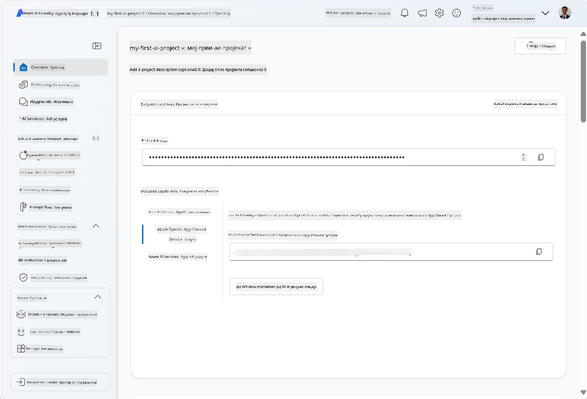
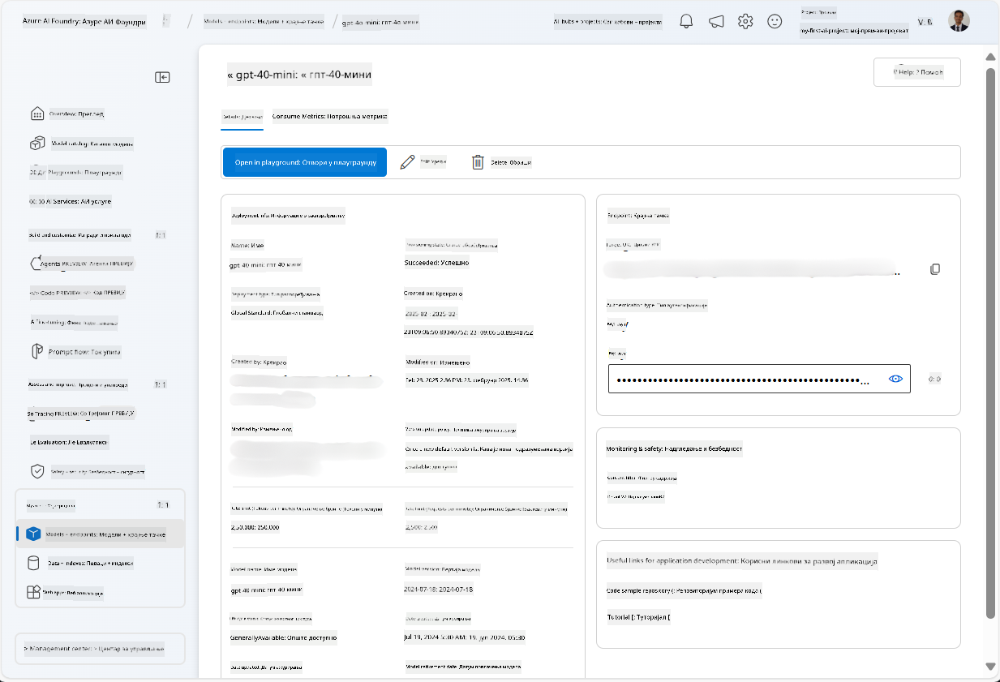
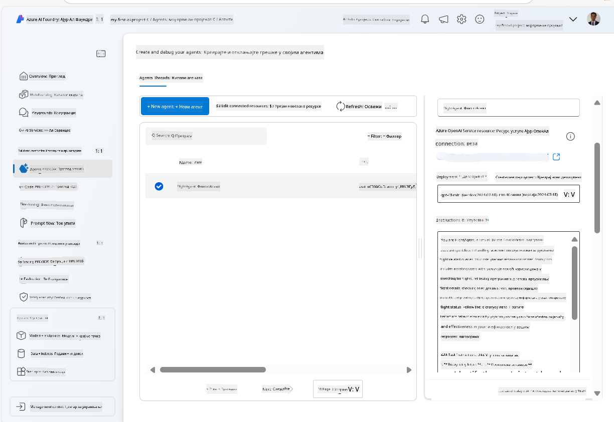
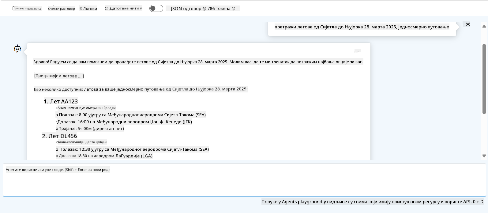

<!--
CO_OP_TRANSLATOR_METADATA:
{
  "original_hash": "7e92870dc0843e13d4dabc620c09d2d9",
  "translation_date": "2025-07-12T08:22:50+00:00",
  "source_file": "02-explore-agentic-frameworks/azure-ai-foundry-agent-creation.md",
  "language_code": "sr"
}
-->
# Azure AI Agent Service Development

У овом задатку користите алате Azure AI Agent сервиса у [Azure AI Foundry порталу](https://ai.azure.com/?WT.mc_id=academic-105485-koreyst) да бисте креирали агента за резервацију летова. Агент ће моћи да комуницира са корисницима и пружа информације о летовима.

## Претпоставке

Да бисте завршили овај задатак, потребно вам је следеће:
1. Azure налог са активном претплатом. [Креирајте налог бесплатно](https://azure.microsoft.com/free/?WT.mc_id=academic-105485-koreyst).
2. Потребне су вам дозволе за креирање Azure AI Foundry хаба или да вам неко други креира.
    - Ако вам је улога Contributor или Owner, можете пратити кораке у овом туторијалу.

## Креирање Azure AI Foundry хаба

> **Note:** Azure AI Foundry је раније био познат као Azure AI Studio.

1. Пратите упутства из [Azure AI Foundry](https://learn.microsoft.com/en-us/azure/ai-studio/?WT.mc_id=academic-105485-koreyst) блог поста за креирање Azure AI Foundry хаба.
2. Када је ваш пројекат креиран, затворите све савете који се појаве и прегледајте страницу пројекта у Azure AI Foundry порталу, која би требало да изгледа слично као на следећој слици:

    

## Деплојовање модела

1. У левом панелу за ваш пројекат, у одељку **My assets**, изаберите страницу **Models + endpoints**.
2. На страници **Models + endpoints**, у картици **Model deployments**, у менију **+ Deploy model**, изаберите **Deploy base model**.
3. Потражите модел `gpt-4o-mini` на листи, затим га изаберите и потврдите.

    > **Note**: Смањење TPM помаже да се избегне прекомерна употреба квоте доступне у претплати коју користите.

    

## Креирање агента

Сада када сте деплојовали модел, можете креирати агента. Агент је конверзациони AI модел који се користи за интеракцију са корисницима.

1. У левом панелу за ваш пројекат, у одељку **Build & Customize**, изаберите страницу **Agents**.
2. Кликните на **+ Create agent** да бисте креирали новог агента. У дијалогу **Agent Setup**:
    - Унесите име агента, на пример `FlightAgent`.
    - Проверите да је изабрано деплојовање модела `gpt-4o-mini` које сте раније креирали.
    - Поставите **Instructions** према упутствима која желите да агент прати. Ево примера:
    ```
    You are FlightAgent, a virtual assistant specialized in handling flight-related queries. Your role includes assisting users with searching for flights, retrieving flight details, checking seat availability, and providing real-time flight status. Follow the instructions below to ensure clarity and effectiveness in your responses:

    ### Task Instructions:
    1. **Recognizing Intent**:
       - Identify the user's intent based on their request, focusing on one of the following categories:
         - Searching for flights
         - Retrieving flight details using a flight ID
         - Checking seat availability for a specified flight
         - Providing real-time flight status using a flight number
       - If the intent is unclear, politely ask users to clarify or provide more details.
        
    2. **Processing Requests**:
        - Depending on the identified intent, perform the required task:
        - For flight searches: Request details such as origin, destination, departure date, and optionally return date.
        - For flight details: Request a valid flight ID.
        - For seat availability: Request the flight ID and date and validate inputs.
        - For flight status: Request a valid flight number.
        - Perform validations on provided data (e.g., formats of dates, flight numbers, or IDs). If the information is incomplete or invalid, return a friendly request for clarification.

    3. **Generating Responses**:
    - Use a tone that is friendly, concise, and supportive.
    - Provide clear and actionable suggestions based on the output of each task.
    - If no data is found or an error occurs, explain it to the user gently and offer alternative actions (e.g., refine search, try another query).
    
    ```
> [!NOTE]
> За детаљнији упит, можете погледати [овaj репозиторијум](https://github.com/ShivamGoyal03/RoamMind) за више информација.
    
> Поред тога, можете додати **Knowledge Base** и **Actions** да бисте побољшали могућности агента да пружа више информација и извршава аутоматизоване задатке на основу корисничких захтева. За овај задатак, ове кораке можете прескочити.
    


3. Да бисте креирали новог мулти-AI агента, једноставно кликните на **New Agent**. Новокреирани агент ће се појавити на страници Agents.

## Тестирање агента

Након креирања агента, можете га тестирати да видите како одговара на корисничке упите у Azure AI Foundry порталу у режиму playground.

1. На врху панела **Setup** за вашег агента, изаберите **Try in playground**.
2. У панелу **Playground** можете комуницирати са агентом тако што ћете уносити упите у прозор за ћаскање. На пример, можете питати агента да потражи летове од Сијетла до Њујорка 28. у месецу.

    > **Note**: Агент можда неће пружити тачне одговоре, јер се у овом задатку не користе подаци у реалном времену. Циљ је да се тестира способност агента да разуме и одговара на корисничке упите на основу датих упутстава.

    

3. Након тестирања агента, можете га додатно прилагодити додавањем више намера, података за обуку и акција како бисте побољшали његове могућности.

## Чишћење ресурса

Када завршите са тестирањем агента, можете га обрисати да бисте избегли додатне трошкове.
1. Отворите [Azure портал](https://portal.azure.com) и прегледајте садржај групе ресурса у којој сте деплојовали ресурсе хаба коришћене у овом задатку.
2. На траци са алаткама изаберите **Delete resource group**.
3. Унесите име групе ресурса и потврдите да желите да је избришете.

## Ресурси

- [Azure AI Foundry документација](https://learn.microsoft.com/en-us/azure/ai-studio/?WT.mc_id=academic-105485-koreyst)
- [Azure AI Foundry портал](https://ai.azure.com/?WT.mc_id=academic-105485-koreyst)
- [Почетак рада са Azure AI Studio](https://techcommunity.microsoft.com/blog/educatordeveloperblog/getting-started-with-azure-ai-studio/4095602?WT.mc_id=academic-105485-koreyst)
- [Основе AI агената на Azure](https://learn.microsoft.com/en-us/training/modules/ai-agent-fundamentals/?WT.mc_id=academic-105485-koreyst)
- [Azure AI Discord](https://aka.ms/AzureAI/Discord)

**Одрицање од одговорности**:  
Овај документ је преведен коришћењем AI услуге за превођење [Co-op Translator](https://github.com/Azure/co-op-translator). Иако се трудимо да превод буде тачан, молимо вас да имате у виду да аутоматски преводи могу садржати грешке или нетачности. Оригинални документ на његовом изворном језику треба сматрати ауторитетним извором. За критичне информације препоручује се професионални људски превод. Нисмо одговорни за било каква неспоразума или погрешна тумачења која произилазе из коришћења овог превода.