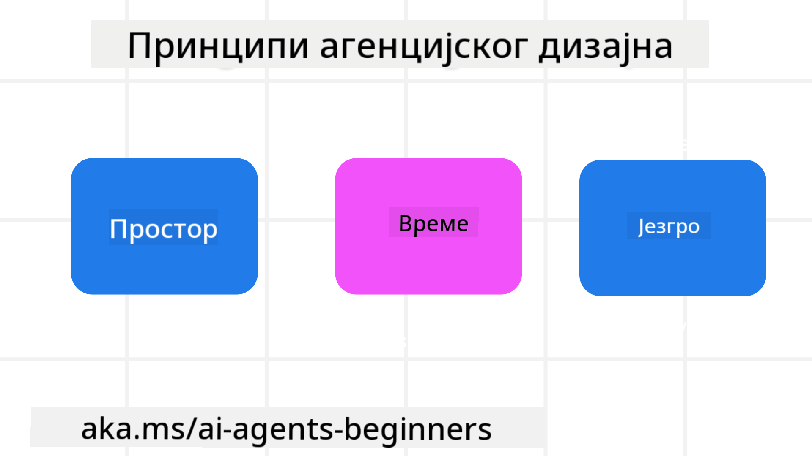

<!--
CO_OP_TRANSLATOR_METADATA:
{
  "original_hash": "4c46e4ff9e349c521e2b0b17f51afa64",
  "translation_date": "2025-08-29T22:55:20+00:00",
  "source_file": "03-agentic-design-patterns/README.md",
  "language_code": "sr"
}
-->

> _(Кликните на слику изнад да бисте погледали видео лекције)_
# Принципи дизајна агентских AI система

## Увод

Постоји много начина да се размишља о изградњи агентских AI система. С обзиром на то да је двосмисленост карактеристика, а не грешка у дизајну генеративне AI, понекад је инжењерима тешко да одреде одакле да почну. Направили смо сет принципа дизајна усмерених на корисника како бисмо омогућили програмерима да изграде агентске системе усмерене на купца који решавају њихове пословне потребе. Ови принципи дизајна нису прописана архитектура, већ почетна тачка за тимове који дефинишу и развијају искуства са агентима.

Уопштено, агенти би требало да:

- Прошире и унапреде људске способности (креативно размишљање, решавање проблема, аутоматизација итд.)
- Попуне празнине у знању (упознај ме са одређеним областима знања, превод итд.)
- Олакшају и подрже сарадњу на начин који нам као појединцима одговара
- Учине нас бољим верзијама самих себе (нпр. животни тренер/организатор задатака, помоћ у учењу емоционалне регулације и вештина свесности, изградња отпорности итд.)

## Ова лекција ће обухватити

- Шта су принципи дизајна агентских система
- Које смернице треба следити приликом примене ових принципа дизајна
- Примери коришћења принципа дизајна

## Циљеви учења

Након завршетка ове лекције, моћи ћете да:

1. Објасните шта су принципи дизајна агентских система
2. Објасните смернице за коришћење принципа дизајна агентских система
3. Разумете како да изградите агента користећи принципе дизајна агентских система

## Принципи дизајна агентских система

### Агент (Простор)

Ово је окружење у којем агент функционише. Ови принципи информишу како дизајнирамо агенте за ангажовање у физичком и дигиталном свету.

- **Повезивање, а не урушавање** – помозите људима да се повежу са другим људима, догађајима и применљивим знањем како би омогућили сарадњу и повезаност.
  - Агенти помажу у повезивању догађаја, знања и људи.
  - Агенти приближавају људе једне другима. Они нису дизајнирани да замене или умање људе.
- **Лако доступни, али понекад невидљиви** – агент углавном функционише у позадини и само нас подсећа када је то релевантно и прикладно.
  - Агент је лако открити и доступан је овлашћеним корисницима на било ком уређају или платформи.
  - Агент подржава мултимодалне улазе и излазе (звук, глас, текст итд.).
  - Агент може беспрекорно прелазити између предњег и позадинског плана; између проактивног и реактивног, у зависности од потреба корисника.
  - Агент може функционисати у невидљивом облику, али је његов процес у позадини и сарадња са другим агентима транспарентна и контролисана од стране корисника.

### Агент (Време)

Ово је начин на који агент функционише током времена. Ови принципи информишу како дизајнирамо агенте који интерагују кроз прошлост, садашњост и будућност.

- **Прошлост**: Разматрање историје која укључује и стање и контекст.
  - Агент пружа релевантније резултате на основу анализе богатијих историјских података, а не само догађаја, људи или стања.
  - Агент ствара везе из прошлих догађаја и активно разматра меморију како би се ангажовао у тренутним ситуацијама.
- **Сада**: Подстицање више него обавештавање.
  - Агент представља свеобухватан приступ интеракцији са људима. Када се догађај догоди, агент иде даље од статичног обавештења или друге формалности. Агент може поједноставити токове или динамички генерисати сигнале за усмеравање пажње корисника у правом тренутку.
  - Агент испоручује информације на основу контекстуалног окружења, друштвених и културних промена и прилагођава се намери корисника.
  - Интеракција са агентом може бити постепена, еволуирајући/растући у сложености како би оснажила кориснике на дугорочном нивоу.
- **Будућност**: Прилагођавање и еволуција.
  - Агент се прилагођава различитим уређајима, платформама и модалитетима.
  - Агент се прилагођава понашању корисника, потребама приступачности и слободно је прилагодљив.
  - Агент се обликује и еволуира кроз континуирану интеракцију са корисником.

### Агент (Језгро)

Ово су кључни елементи у језгру дизајна агента.

- **Прихватите неизвесност, али успоставите поверење**.
  - Одређени ниво неизвесности агента је очекиван. Неизвесност је кључни елемент дизајна агента.
  - Поверење и транспарентност су основни слојеви дизајна агента.
  - Људи контролишу када је агент укључен/искључен, а статус агента је јасно видљив у сваком тренутку.

## Смернице за примену ових принципа

Када користите претходне принципе дизајна, користите следеће смернице:

1. **Транспарентност**: Информишите корисника да је AI укључен, како функционише (укључујући прошле радње) и како да да повратне информације и модификује систем.
2. **Контрола**: Омогућите кориснику да прилагоди, одреди преференције и персонализује, и има контролу над системом и његовим атрибутима (укључујући могућност заборава).
3. **Конзистентност**: Тежите конзистентним, мултимодалним искуствима на различитим уређајима и тачкама. Користите познате UI/UX елементе где је могуће (нпр. икона микрофона за гласовну интеракцију) и смањите когнитивно оптерећење корисника што је више могуће (нпр. тежите концизним одговорима, визуелним помагалима и садржају „Сазнајте више“).

## Како дизајнирати туристичког агента користећи ове принципе и смернице

Замислите да дизајнирате туристичког агента, ево како можете размишљати о коришћењу принципа и смерница дизајна:

1. **Транспарентност** – Обавестите корисника да је туристички агент AI-омогућен агент. Пружите основна упутства о томе како започети (нпр. порука „Здраво“, пример упита). Јасно документујте ово на страници производа. Прикажите листу упита које је корисник поставио у прошлости. Учините јасним како дати повратне информације (палац горе и доле, дугме „Пошаљи повратну информацију“ итд.). Јасно артикулишите ако агент има ограничења у употреби или темама.
2. **Контрола** – Уверите се да је јасно како корисник може модификовати агента након што је креиран, са стварима као што је системски упит. Омогућите кориснику да изабере колико је агент детаљан, његов стил писања и било какве ограде о томе о чему агент не би требало да говори. Дозволите кориснику да прегледа и избрише било које повезане датотеке или податке, упите и претходне разговоре.
3. **Конзистентност** – Уверите се да су иконе за дељење упита, додавање датотеке или фотографије и означавање некога или нечега стандардне и препознатљиве. Користите икону спајалице за означавање отпремања/дељења датотека са агентом и икону слике за означавање отпремања графике.

### Имате још питања о обрасцима дизајна агентских AI система?

Придружите се [Azure AI Foundry Discord](https://aka.ms/ai-agents/discord) да бисте се повезали са другим ученицима, присуствовали консултацијама и добили одговоре на ваша питања о AI агентима.

## Додатни ресурси

## Претходна лекција

[Истраживање агентских оквира](../02-explore-agentic-frameworks/README.md)

## Наредна лекција

[Образац дизајна за коришћење алата](../04-tool-use/README.md)

---

**Одрицање од одговорности**:  
Овај документ је преведен коришћењем услуге за превођење помоћу вештачке интелигенције [Co-op Translator](https://github.com/Azure/co-op-translator). Иако се трудимо да превод буде тачан, молимо вас да имате у виду да аутоматизовани преводи могу садржати грешке или нетачности. Оригинални документ на његовом изворном језику треба сматрати меродавним извором. За критичне информације препоручује се професионални превод од стране људи. Не преузимамо одговорност за било каква погрешна тумачења или неспоразуме који могу настати услед коришћења овог превода.