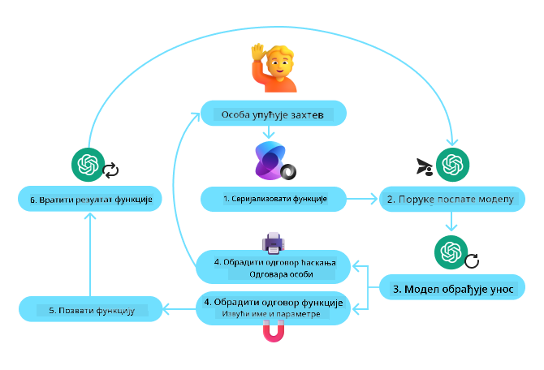
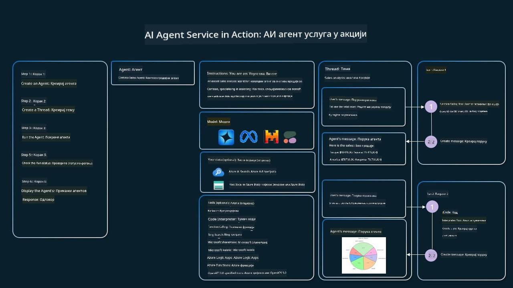

<!--
CO_OP_TRANSLATOR_METADATA:
{
  "original_hash": "88258b03f2893aa2e69eb8fb24baabbc",
  "translation_date": "2025-07-12T09:45:08+00:00",
  "source_file": "04-tool-use/README.md",
  "language_code": "sr"
}
-->
[](https://youtu.be/vieRiPRx-gI?si=cEZ8ApnT6Sus9rhn)

> _(Кликните на слику изнад да бисте погледали видео о овој лекцији)_

# Образац дизајна коришћења алата

Алатке су занимљиве јер омогућавају AI агентима да имају шире могућности. Уместо да агент има ограничен скуп радњи које може извршити, додавањем алатке агент сада може обављати широк спектар радњи. У овом поглављу ћемо погледати Образац дизајна коришћења алата, који описује како AI агенти могу користити одређене алатке да би постигли своје циљеве.

## Увод

У овој лекцији ћемо покушати да одговоримо на следећа питања:

- Шта је образац дизајна коришћења алата?
- За које случајеве употребе се може применити?
- Који су елементи/грађевни блокови потребни за имплементацију овог образца?
- Које су посебне напомене приликом коришћења Образца дизајна коришћења алата за изградњу поузданих AI агената?

## Циљеви учења

Након завршетка ове лекције, моћи ћете да:

- Дефинишете Образац дизајна коришћења алата и његову сврху.
- Препознате случајеве употребе где је овај образац применљив.
- Разумете кључне елементе потребне за имплементацију образца.
- Препознате важне аспекте за обезбеђивање поузданости AI агената који користе овај образац.

## Шта је Образац дизајна коришћења алата?

**Образац дизајна коришћења алата** фокусира се на то да LLM-овима пружи могућност интеракције са спољним алатима ради постизања одређених циљева. Алатке су код који агент може извршити да би обавио неку радњу. Алатка може бити једноставна функција као што је калкулатор, или позив API-ја треће стране као што је претрага цена акција или временска прогноза. У контексту AI агената, алатке су дизајниране да их агенти извршавају као одговор на **функцијске позиве генерисане моделом**.

## За које случајеве употребе се може применити?

AI агенти могу користити алатке да заврше сложене задатке, преузму информације или донесу одлуке. Образац дизајна коришћења алата често се користи у сценаријима који захтевају динамичку интеракцију са спољним системима, као што су базе података, веб сервиси или интерпретатори кода. Ова способност је корисна за бројне случајеве употребе, укључујући:

- **Динамичко преузимање информација:** Агенти могу упитати спољне API-је или базе података да би добили ажуриране податке (нпр. упит у SQLite базу за анализу података, преузимање цена акција или временске прогнозе).
- **Извршавање и тумачење кода:** Агенти могу извршавати код или скрипте за решавање математичких проблема, генерисање извештаја или извођење симулација.
- **Аутоматизација радних токова:** Аутоматизација понављајућих или вишестепених процеса интеграцијом алата као што су планери задатака, емаил сервиси или цевоводи података.
- **Корисничка подршка:** Агенти могу комуницирати са CRM системима, платформама за тикете или базама знања како би решили корисничке упите.
- **Генерисање и уређивање садржаја:** Агенти могу користити алате као што су провера граматике, резимирање текста или процена безбедности садржаја да помогну у креирању садржаја.

## Који су елементи/грађевни блокови потребни за имплементацију образца коришћења алата?

Ови грађевни блокови омогућавају AI агенту да обавља широк спектар задатака. Погледајмо кључне елементе потребне за имплементацију Образца дизајна коришћења алата:

- **Шеме функција/алата**: Детаљни описи доступних алата, укључујући име функције, сврху, потребне параметре и очекиване излазе. Ове шеме омогућавају LLM-у да разуме које су алатке доступне и како да конструише валидне захтеве.

- **Логика извршења функција**: Управља када и како се алатке позивају на основу намере корисника и контекста разговора. Ово може укључивати модуле за планирање, механизме усмеравања или условне токове који динамички одређују коришћење алата.

- **Систем за руковање порукама**: Компоненте које управљају током разговора између корисничких уноса, LLM одговора, позива алата и резултата алата.

- **Оквир за интеграцију алата**: Инфраструктура која повезује агента са различитим алатима, било да су то једноставне функције или сложени спољни сервиси.

- **Руковање грешкама и валидација**: Механизми за обраду неуспеха у извршењу алата, валидацију параметара и управљање неочекиваним одговорима.

- **Управљање стањем**: Праћење контекста разговора, претходних интеракција са алатима и упорних података како би се обезбедила конзистентност током вишеструких корака.

Следеће, детаљније ћемо погледати позив функција/алата.

### Позив функција/алата

Позив функција је основни начин на који омогућавамо великим језичким моделима (LLM) да интерагују са алатима. Често ћете видети да се „функција“ и „алат“ користе наизменично јер су „функције“ (блокови поновно употребљивог кода) алати које агенти користе за обављање задатака. Да би се код функције позвао, LLM мора упоредити кориснички захтев са описом функције. За то се шаље шема која садржи описе свих доступних функција LLM-у. LLM затим бира најприкладнију функцију за задатак и враћа њено име и аргументе. Изабрана функција се позива, њен одговор се шаље назад LLM-у, који користи те информације да одговори на кориснички захтев.

За програмере који желе да имплементирају позив функција за агенте, потребно је:

1. LLM модел који подржава позив функција
2. Шема која садржи описе функција
3. Код за сваку описану функцију

Погледајмо пример добијања тренутног времена у неком граду:

1. **Иницијализујте LLM који подржава позив функција:**

    Ни сви модели не подржавају позив функција, па је важно проверити да ли модел који користите то ради. <a href="https://learn.microsoft.com/azure/ai-services/openai/how-to/function-calling" target="_blank">Azure OpenAI</a> подржава позив функција. Можемо почети иницијализацијом Azure OpenAI клијента.

    ```python
    # Initialize the Azure OpenAI client
    client = AzureOpenAI(
        azure_endpoint = os.getenv("AZURE_OPENAI_ENDPOINT"), 
        api_key=os.getenv("AZURE_OPENAI_API_KEY"),  
        api_version="2024-05-01-preview"
    )
    ```

1. **Креирајте шему функције:**

    Следеће ћемо дефинисати JSON шему која садржи име функције, опис шта функција ради и имена и описе параметара функције. Затим ћемо ову шему проследити клијенту који смо раније креирали, заједно са корисничким захтевом да се пронађе време у Сан Франциску. Важно је напоменути да се као резултат враћа **позив алата**, а **не** коначни одговор на питање. Као што је раније речено, LLM враћа име функције коју је изабрао за задатак и аргументе који ће јој бити прослеђени.

    ```python
    # Function description for the model to read
    tools = [
        {
            "type": "function",
            "function": {
                "name": "get_current_time",
                "description": "Get the current time in a given location",
                "parameters": {
                    "type": "object",
                    "properties": {
                        "location": {
                            "type": "string",
                            "description": "The city name, e.g. San Francisco",
                        },
                    },
                    "required": ["location"],
                },
            }
        }
    ]
    ```
   
    ```python
  
    # Initial user message
    messages = [{"role": "user", "content": "What's the current time in San Francisco"}] 
  
    # First API call: Ask the model to use the function
      response = client.chat.completions.create(
          model=deployment_name,
          messages=messages,
          tools=tools,
          tool_choice="auto",
      )
  
      # Process the model's response
      response_message = response.choices[0].message
      messages.append(response_message)
  
      print("Model's response:")  

      print(response_message)
  
    ```

    ```bash
    Model's response:
    ChatCompletionMessage(content=None, role='assistant', function_call=None, tool_calls=[ChatCompletionMessageToolCall(id='call_pOsKdUlqvdyttYB67MOj434b', function=Function(arguments='{"location":"San Francisco"}', name='get_current_time'), type='function')])
    ```
  
1. **Код функције потребан за извршење задатка:**

    Сада када је LLM изабрао коју функцију треба покренути, потребно је имплементирати и извршити код који обавља задатак. Код за добијање тренутног времена можемо написати у Python-у. Такође ћемо морати написати код за извлачење имена и аргумената из response_message да бисмо добили коначни резултат.

    ```python
      def get_current_time(location):
        """Get the current time for a given location"""
        print(f"get_current_time called with location: {location}")  
        location_lower = location.lower()
        
        for key, timezone in TIMEZONE_DATA.items():
            if key in location_lower:
                print(f"Timezone found for {key}")  
                current_time = datetime.now(ZoneInfo(timezone)).strftime("%I:%M %p")
                return json.dumps({
                    "location": location,
                    "current_time": current_time
                })
      
        print(f"No timezone data found for {location_lower}")  
        return json.dumps({"location": location, "current_time": "unknown"})
    ```

    ```python
     # Handle function calls
      if response_message.tool_calls:
          for tool_call in response_message.tool_calls:
              if tool_call.function.name == "get_current_time":
     
                  function_args = json.loads(tool_call.function.arguments)
     
                  time_response = get_current_time(
                      location=function_args.get("location")
                  )
     
                  messages.append({
                      "tool_call_id": tool_call.id,
                      "role": "tool",
                      "name": "get_current_time",
                      "content": time_response,
                  })
      else:
          print("No tool calls were made by the model.")  
  
      # Second API call: Get the final response from the model
      final_response = client.chat.completions.create(
          model=deployment_name,
          messages=messages,
      )
  
      return final_response.choices[0].message.content
     ```

    ```bash
      get_current_time called with location: San Francisco
      Timezone found for san francisco
      The current time in San Francisco is 09:24 AM.
     ```

Позив функција је у срцу већине, ако не и свих, образаца коришћења алата за агенте, али његова имплементација од нуле понекад може бити изазовна. Као што смо научили у [Лекцији 2](../../../02-explore-agentic-frameworks), агентски оквири нам пружају унапред направљене грађевне блокове за имплементацију коришћења алата.

## Примери коришћења алата са агентским оквирима

Ево неколико примера како можете имплементирати Образац дизајна коришћења алата користећи различите агентске оквире:

### Semantic Kernel

<a href="https://learn.microsoft.com/azure/ai-services/agents/overview" target="_blank">Semantic Kernel</a> је open-source AI оквир за .NET, Python и Java програмере који раде са великим језичким моделима (LLM). Поједностављује процес коришћења позива функција аутоматским описивањем ваших функција и њихових параметара моделу кроз процес који се зове <a href="https://learn.microsoft.com/semantic-kernel/concepts/ai-services/chat-completion/function-calling/?pivots=programming-language-python#1-serializing-the-functions" target="_blank">серијализација</a>. Такође управља двосмерном комуникацијом између модела и вашег кода. Још једна предност коришћења агентског оквира као што је Semantic Kernel је што вам омогућава приступ унапред направљеним алатима као што су <a href="https://github.com/microsoft/semantic-kernel/blob/main/python/samples/getting_started_with_agents/openai_assistant/step4_assistant_tool_file_search.py" target="_blank">Претрага фајлова</a> и <a href="https://github.com/microsoft/semantic-kernel/blob/main/python/samples/getting_started_with_agents/openai_assistant/step3_assistant_tool_code_interpreter.py" target="_blank">Интерпретатор кода</a>.

Следећа шема илуструје процес позива функција са Semantic Kernel:



У Semantic Kernel функције/алати се зову <a href="https://learn.microsoft.com/semantic-kernel/concepts/plugins/?pivots=programming-language-python" target="_blank">плугинс</a>. Можемо претворити функцију `get_current_time` коју смо раније видели у плагин тако што ћемо је ставити у класу. Такође можемо увезти декоратор `kernel_function`, који прихвата опис функције. Када затим креирате kernel са GetCurrentTimePlugin, kernel ће аутоматски серијализовати функцију и њене параметре, креирајући шему која се шаље LLM-у.

```python
from semantic_kernel.functions import kernel_function

class GetCurrentTimePlugin:
    async def __init__(self, location):
        self.location = location

    @kernel_function(
        description="Get the current time for a given location"
    )
    def get_current_time(location: str = ""):
        ...

```

```python 
from semantic_kernel import Kernel

# Create the kernel
kernel = Kernel()

# Create the plugin
get_current_time_plugin = GetCurrentTimePlugin(location)

# Add the plugin to the kernel
kernel.add_plugin(get_current_time_plugin)
```
  
### Azure AI Agent Service

<a href="https://learn.microsoft.com/azure/ai-services/agents/overview" target="_blank">Azure AI Agent Service</a> је новији агентски оквир дизајниран да омогући програмерима да безбедно граде, развијају и скалирају квалитетне и прошириве AI агенте без потребе за управљањем основним рачунарским и складишним ресурсима. Посебно је користан за корпоративне апликације јер је потпуно управљана услуга са безбедношћу на нивоу предузећа.

У поређењу са развојем директно преко LLM API-ја, Azure AI Agent Service нуди неке предности, укључујући:

- Аутоматски позив алата – није потребно парсирати позив алата, извршавати алат и обрађивати одговор; све се сада ради на серверу
- Безбедно управљање подацима – уместо да управљате сопственим стањем разговора, можете се ослонити на `threads` који чувају све потребне информације
- Спремни алати – алати које можете користити за интеракцију са изворима података, као што су Bing, Azure AI Search и Azure Functions.

Алатке доступне у Azure AI Agent Service могу се поделити у две категорије:

1. Алатке за знање:
    - <a href="https://learn.microsoft.com/azure/ai-services/agents/how-to/tools/bing-grounding?tabs=python&pivots=overview" target="_blank">Повезивање са Bing претрагом</a>
    - <a href="https://learn.microsoft.com/azure/ai-services/agents/how-to/tools/file-search?tabs=python&pivots=overview" target="_blank">Претрага фајлова</a>
    - <a href="https://learn.microsoft.com/azure/ai-services/agents/how-to/tools/azure-ai-search?tabs=azurecli%2Cpython&pivots=overview-azure-ai-search" target="_blank">Azure AI претрага</a>

2. Алатке за акцију:
    - <a href="https://learn.microsoft.com/azure/ai-services/agents/how-to/tools/function-calling?tabs=python&pivots=overview" target="_blank">Позив функција</a>
    - <a href="https://learn.microsoft.com/azure/ai-services/agents/how-to/tools/code-interpreter?tabs=python&pivots=overview" target="_blank">Интерпретатор кода</a>
    - <a href="https://learn.microsoft.com/azure/ai-services/agents/how-to/tools/openapi-spec?tabs=python&pivots=overview" target="_blank">OpenAI дефинисани алати</a>
    - <a href="https://learn.microsoft.com/azure/ai-services/agents/how-to/tools/azure-functions?pivots=overview" target="_blank">Azure Functions</a>

Agent Service нам омогућава да користимо ове алате заједно као `toolset`. Такође користи `threads` који прате историју порука из одређеног разговора.

Замислите да сте продајни агент у компанији Contoso. Желите да развијете разговорног агента који може одговарати на питања о вашим продајним подацима.

Следећа слика илуструје како бисте могли користити Azure AI Agent Service за анализу ваших продајних података:



Да бисте користили било који од ових алата са сервисом, можете креирати клијента и дефинисати алат или скуп алата. За практичну имплементацију можемо користити следећи Python код. LLM ће моћи да погледа скуп алата и одлучи да ли ће користити кориснички креирану функцију `fetch_sales_data_using_sqlite_query` или унапред направљени Code Interpreter у зависности од корисничког захтева.

```python 
import os
from azure.ai.projects import AIProjectClient
from azure.identity import DefaultAzureCredential
from fecth_sales_data_functions import fetch_sales_data_using_sqlite_query # fetch_sales_data_using_sqlite_query function which can be found in a fetch_sales_data_functions.py file.
from azure.ai.projects.models import ToolSet, FunctionTool, CodeInterpreterTool

project_client = AIProjectClient.from_connection_string(
    credential=DefaultAzureCredential(),
    conn_str=os.environ["PROJECT_CONNECTION_STRING"],
)

# Initialize function calling agent with the fetch_sales_data_using_sqlite_query function and adding it to the toolset
fetch_data_function = FunctionTool(fetch_sales_data_using_sqlite_query)
toolset = ToolSet()
toolset.add(fetch_data_function)

# Initialize Code Interpreter tool and adding it to the toolset. 
code_interpreter = code_interpreter = CodeInterpreterTool()
toolset = ToolSet()
toolset.add(code_interpreter)

agent = project_client.agents.create_agent(
    model="gpt-4o-mini", name="my-agent", instructions="You are helpful agent", 
    toolset=toolset
)
```

## Које су посебне напомене приликом коришћења Образца дизајна коришћења алата за изградњу поузданих AI агената?

Честа брига у вези са SQL упитима динамички генерисаним од стране LLM-ова је безбедност, посебно ризик од SQL инјекције или злонамерних радњи, као што су брисање или нарушавање базе података. Иако су о
<a href="https://microsoft.github.io/build-your-first-agent-with-azure-ai-agent-service-workshop/" target="_blank">
Azure AI Agents Service Workshop</a>
- <a href="https://github.com/Azure-Samples/contoso-creative-writer/tree/main/docs/workshop" target="_blank">Contoso Creative Writer Воркшоп са више агената</a>
- <a href="https://learn.microsoft.com/semantic-kernel/concepts/ai-services/chat-completion/function-calling/?pivots=programming-language-python#1-serializing-the-functions" target="_blank">Туторијал за позивање функција у Semantic Kernel</a>
- <a href="https://github.com/microsoft/semantic-kernel/blob/main/python/samples/getting_started_with_agents/openai_assistant/step3_assistant_tool_code_interpreter.py" target="_blank">Semantic Kernel интерпретер кода</a>
- <a href="https://microsoft.github.io/autogen/dev/user-guide/core-user-guide/components/tools.html" target="_blank">Autogen алати</a>

## Претходна лекција

[Разумевање агентских дизајн образаца](../03-agentic-design-patterns/README.md)

## Следећа лекција

[Agentic RAG](../05-agentic-rag/README.md)

**Одрицање од одговорности**:  
Овај документ је преведен коришћењем AI преводилачке услуге [Co-op Translator](https://github.com/Azure/co-op-translator). Иако се трудимо да превод буде тачан, молимо вас да имате у виду да аутоматски преводи могу садржати грешке или нетачности. Оригинални документ на његовом изворном језику треба сматрати ауторитетним извором. За критичне информације препоручује се професионални људски превод. Нисмо одговорни за било каква неспоразума или погрешна тумачења која произилазе из коришћења овог превода.