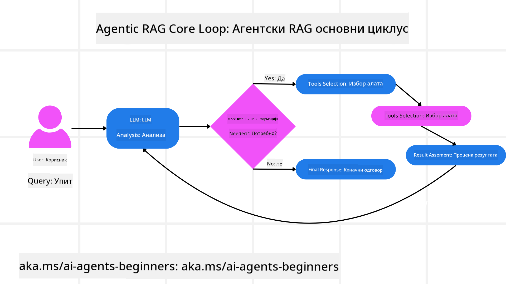
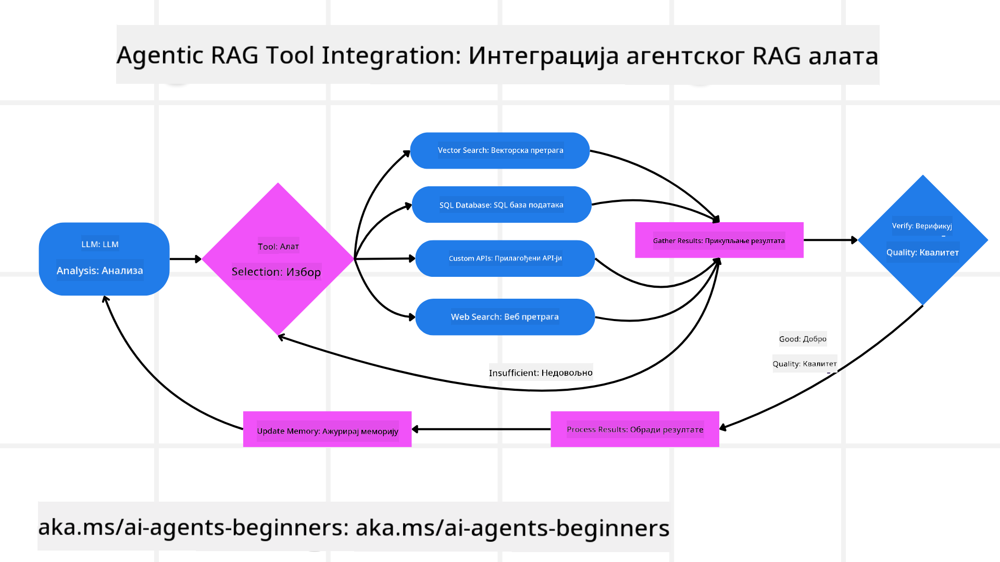
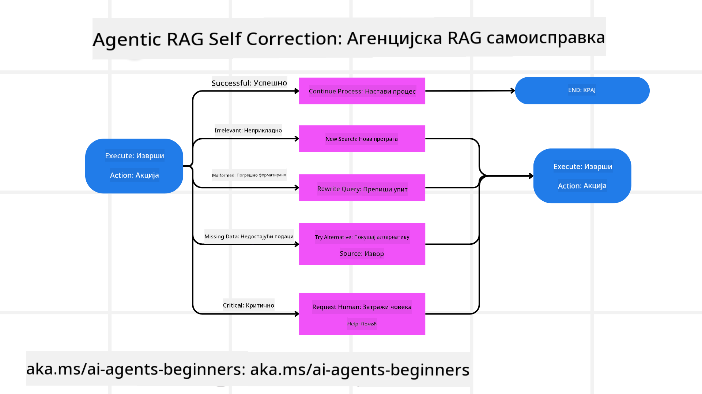

<!--
CO_OP_TRANSLATOR_METADATA:
{
  "original_hash": "7622aa72f9e676e593339f5f694ecd7d",
  "translation_date": "2025-07-12T10:13:31+00:00",
  "source_file": "05-agentic-rag/README.md",
  "language_code": "sr"
}
-->

> _(Кликните на слику изнад да бисте погледали видео о овој лекцији)_

# Agentic RAG

Ова лекција пружа свеобухватан преглед Agentic Retrieval-Augmented Generation (Agentic RAG), новог парадигма у вештачкој интелигенцији где велики језички модели (LLM) аутономно планирају своје следеће кораке док истовремено преузимају информације из спољних извора. За разлику од статичних образаца „преузми па прочитај“, Agentic RAG укључује итеративне позиве LLM-у, испреплетене позивима алата или функција и структурираним излазима. Систем процењује резултате, прецизира упите, позива додатне алате ако је потребно и наставља овај циклус док не постигне задовољавајуће решење.

## Увод

Ова лекција ће обухватити

- **Разумевање Agentic RAG:** Упознавање са новим парадигмом у AI где велики језички модели аутономно планирају своје следеће кораке док преузимају информације из спољних извора података.
- **Схватање итеративног Maker-Checker стила:** Разумевање петље итеративних позива LLM-у, испреплетених позивима алата или функција и структурираним излазима, дизајниране да побољша тачност и рукује неисправним упитима.
- **Истраживање практичних примена:** Идентификовање сценарија у којима Agentic RAG најбоље функционише, као што су окружења где је тачност на првом месту, сложене интеракције са базама података и продужени радни токови.

## Циљеви учења

Након завршетка ове лекције, знаћете како да/разумете:

- **Разумевање Agentic RAG:** Упознавање са новим парадигмом у AI где велики језички модели аутономно планирају своје следеће кораке док преузимају информације из спољних извора података.
- **Итеративни Maker-Checker стил:** Схватање концепта петље итеративних позива LLM-у, испреплетених позивима алата или функција и структурираним излазима, дизајниране да побољша тачност и рукује неисправним упитима.
- **Власништво над процесом размишљања:** Разумевање способности система да преузме контролу над својим процесом размишљања, доносећи одлуке о приступу проблему без ослањања на унапред дефинисане путеве.
- **Радни ток:** Разумевање како агентски модел самостално одлучује да преузме извештаје о тржишним трендовима, идентификује податке о конкурентима, корелира интерне продајне метрике, синтетише налазе и процењује стратегију.
- **Итеративне петље, интеграција алата и меморија:** Упознавање са ослањањем система на петљасти образац интеракције, одржавајући стање и меморију кроз кораке како би се избегле понављајуће петље и доносиле информисане одлуке.
- **Руковање режимима неуспеха и самокорекција:** Истраживање робусних механизама самокорекције система, укључујући итерације и поновне упите, коришћење дијагностичких алата и ослањање на људски надзор.
- **Границе агенције:** Разумевање ограничења Agentic RAG-а, са фокусом на доменску аутономију, зависност од инфраструктуре и поштовање безбедносних мера.
- **Практичне примене и вредност:** Идентификовање сценарија у којима Agentic RAG најбоље функционише, као што су окружења где је тачност на првом месту, сложене интеракције са базама података и продужени радни токови.
- **Управљање, транспарентност и поверење:** Упознавање са значајем управљања и транспарентности, укључујући објашњиво размишљање, контролу пристрасности и људски надзор.

## Шта је Agentic RAG?

Agentic Retrieval-Augmented Generation (Agentic RAG) је нови парадигма у AI где велики језички модели (LLM) аутономно планирају своје следеће кораке док преузимају информације из спољних извора. За разлику од статичних образаца „преузми па прочитај“, Agentic RAG укључује итеративне позиве LLM-у, испреплетене позивима алата или функција и структурираним излазима. Систем процењује резултате, прецизира упите, позива додатне алате ако је потребно и наставља овај циклус док не постигне задовољавајуће решење. Овај итеративни „maker-checker“ стил побољшава тачност, рукује неисправним упитима и обезбеђује висок квалитет резултата.

Систем активно преузима контролу над својим процесом размишљања, преписујући неуспеле упите, бирајући различите методе преузимања и интегришући више алата — као што су претрага вектора у Azure AI Search, SQL базе података или прилагођени API-ји — пре него што финализује свој одговор. Карактеристична особина агентског система је његова способност да преузме контролу над процесом размишљања. Традиционалне RAG имплементације се ослањају на унапред дефинисане путеве, док агентски систем аутономно одређује низ корака на основу квалитета пронађених информација.

## Дефинисање Agentic Retrieval-Augmented Generation (Agentic RAG)

Agentic Retrieval-Augmented Generation (Agentic RAG) је нови парадигма у развоју AI где LLM не само да преузима информације из спољних извора података, већ и аутономно планира своје следеће кораке. За разлику од статичних образаца „преузми па прочитај“ или пажљиво скриптованих секвенци упита, Agentic RAG укључује петљу итеративних позива LLM-у, испреплетених позивима алата или функција и структурираним излазима. На сваком кораку систем процењује добијене резултате, одлучује да ли треба прецизирати упите, позива додатне алате ако је потребно и наставља овај циклус док не постигне задовољавајуће решење.

Овај итеративни „maker-checker“ стил рада је дизајниран да побољша тачност, рукује неисправним упитима ка структурираним базама података (нпр. NL2SQL) и обезбеђује уравнотежене, квалитетне резултате. Уместо да се ослања искључиво на пажљиво осмишљене ланце упита, систем активно преузима контролу над својим процесом размишљања. Може преписивати упите који не успевају, бирати различите методе преузимања и интегрисати више алата — као што су претрага вектора у Azure AI Search, SQL базе података или прилагођени API-ји — пре него што финализује одговор. Ово уклања потребу за превише сложеним оквирима за оркестрацију. Уместо тога, релативно једноставна петља „LLM позив → коришћење алата → LLM позив → …“ може произвести софистициране и добро утемељене излазе.

## Преузимање контроле над процесом размишљања

Карактеристична особина која систем чини „агентским“ је његова способност да преузме контролу над својим процесом размишљања. Традиционалне RAG имплементације често зависе од људи који унапред дефинишу пут за модел: ланац размишљања који описује шта и када треба преузети.
Али када је систем заиста агентски, он унутрашње одлучује како да приступи проблему. Он не извршава само скрипту; аутономно одређује низ корака на основу квалитета пронађених информација.
На пример, ако му је задатак да креира стратегију лансирања производа, не ослања се само на упит који описује цео процес истраживања и доношења одлука. Уместо тога, агентски модел самостално одлучује да:

1. Преузме тренутне извештаје о тржишним трендовима користећи Bing Web Grounding
2. Идентификује релевантне податке о конкурентима користећи Azure AI Search.
3. Корелира историјске интерне продајне метрике користећи Azure SQL Database.
4. Синтетише налазе у кохерентну стратегију коју оркестрира Azure OpenAI Service.
5. Процени стратегију у потрази за празнинама или недоследностима, покрећући још један круг преузимања ако је потребно.
Све ове кораке — прецизирање упита, избор извора, итерација док не буде „задовољан“ одговором — доноси модел, а не човек који је унапред скриптовао.

## Итеративне петље, интеграција алата и меморија

Агентски систем се ослања на петљасти образац интеракције:

- **Почетни позив:** Кориснички циљ (тј. кориснички упит) се представља LLM-у.
- **Позив алата:** Ако модел препозна да недостају информације или су упутства нејасна, бира алат или метод преузимања — као што је упит у векторској бази података (нпр. Azure AI Search Hybrid претрага преко приватних података) или структурирани SQL позив — да би прикупио више контекста.
- **Процена и прецизирање:** Након прегледа добијених података, модел одлучује да ли су информације довољне. Ако нису, прецизира упит, покушава други алат или прилагођава приступ.
- **Понављање док не буде задовољан:** Овај циклус се наставља док модел не процени да има довољно јасноће и доказа да пружи коначни, добро образложен одговор.
- **Меморија и стање:** Пошто систем одржава стање и меморију кроз кораке, може се сетити претходних покушаја и њихових резултата, избегавајући понављајуће петље и доносећи информисаније одлуке током рада.

Временом, ово ствара осећај развијајућег разумевања, омогућавајући моделу да навигира кроз сложене, вишестепене задатке без потребе за сталном људском интервенцијом или преправљањем упита.

## Руковање режимима неуспеха и самокорекција

Аутономија Agentic RAG-а укључује и робусне механизме самокорекције. Када систем наиђе на ћорсокак — као што је преузимање неважних докумената или сусрет са неисправним упитима — може:

- **Итеративно поновити упит:** Уместо да врати одговоре ниске вредности, модел покушава нове стратегије претраге, преписује упите ка бази података или прегледа алтернативне скупове података.
- **Користити дијагностичке алате:** Систем може позвати додатне функције дизајниране да му помогну у отклањању грешака у корацима размишљања или потврди тачност преузетих података. Алати као што је Azure AI Tracing биће важни за омогућавање робусне посматрачкости и надзора.
- **Ослањање на људски надзор:** За сценарије са високим ризиком или понављајућим неуспесима, модел може означити неизвесност и затражити људско вођење. Када човек пружи корективне повратне информације, модел може укључити то искуство у даљем раду.

Овај итеративни и динамични приступ омогућава моделу да се континуирано побољшава, осигуравајући да није само систем за једнократну употребу, већ да учи из својих грешака током сесије.

## Границе агенције

Упркос својој аутономији у оквиру задатка, Agentic RAG није еквивалент вештачкој општој интелигенцији. Његове „агентске“ способности ограничене су на алате, изворе података и политике које обезбеђују људски развојни тимови. Не може да измишља сопствене алате нити да излази изван доменских граница које су постављене. Уместо тога, одличан је у динамичкој оркестрацији расположивих ресурса.
Кључне разлике у односу на напредније облике AI укључују:

1. **Доменски специфична аутономија:** Agentic RAG системи су фокусирани на постизање кориснички дефинисаних циљева у познатом домену, користећи стратегије као што су преписивање упита или избор алата за побољшање резултата.
2. **Зависност од инфраструктуре:** Способности система зависе од алата и података које интегришу развојни тимови. Не може прећи те границе без људске интервенције.
3. **Поштовање безбедносних мера:** Етичке смернице, правила усаглашености и пословне политике остају веома важни. Слобода агента је увек ограничена мерама безбедности и механизмима надзора (надамо се).

## Практичне примене и вредност

Agentic RAG се истиче у сценаријима који захтевају итеративно прецизирање и тачност:

1. **Окружења где је тачност на првом месту:** У проверама усаглашености, регулаторним анализама или правним истраживањима, агентски модел може више пута проверити чињенице, консултовати више извора и преписивати упите док не произведе темељно проверен одговор.
2. **Сложене интеракције са базама података:** Када се ради са структурираним подацима где упити често могу да не успеју или захтевају прилагођавање, систем може аутономно прецизирати упите користећи Azure SQL или Microsoft Fabric OneLake, осигуравајући да коначни резултат одговара корисничкој намери.
3. **Продужени радни токови:** Дуже сесије могу еволуирати како се појављују нове информације. Agentic RAG може континуирано укључивати нове податке, мењајући стратегије како учи више о проблемском простору.

## Управљање, транспарентност и поверење

Како ови системи постају све аутономнији у свом размишљању, управљање и транспарентност су кључни:

- **Објашњиво размишљање:** Модел може пружити записник упита које је направио, извора које је консултовао и корака размишљања које је предузео да дође до закључка. Алати као што су Azure AI Content Safety и Azure

- <a href="https://learn.microsoft.com/azure/ai-studio/concepts/evaluation-approach-gen-ai" target="_blank">Евалуација апликација генеративне вештачке интелигенције уз Azure AI Foundry: Овај чланак обухвата евалуацију и поређење модела на јавно доступним скупова података, укључујући Agentic AI апликације и RAG архитектуре</a>
- <a href="https://weaviate.io/blog/what-is-agentic-rag" target="_blank">Шта је Agentic RAG | Weaviate</a>
- <a href="https://ragaboutit.com/agentic-rag-a-complete-guide-to-agent-based-retrieval-augmented-generation/" target="_blank">Agentic RAG: Комплетан водич за агентски засновану генерацију уз претраживање – Вести из генерације RAG</a>
- <a href="https://huggingface.co/learn/cookbook/agent_rag" target="_blank">Agentic RAG: убрзајте свој RAG помоћу реформулације упита и самоупита! Hugging Face Open-Source AI Cookbook</a>
- <a href="https://youtu.be/aQ4yQXeB1Ss?si=2HUqBzHoeB5tR04U" target="_blank">Додавање Agentic слојева RAG-у</a>
- <a href="https://www.youtube.com/watch?v=zeAyuLc_f3Q&t=244s" target="_blank">Будућност асистената за знање: Џери Лиу</a>
- <a href="https://www.youtube.com/watch?v=AOSjiXP1jmQ" target="_blank">Како изградити Agentic RAG системе</a>
- <a href="https://ignite.microsoft.com/sessions/BRK102?source=sessions" target="_blank">Коришћење Azure AI Foundry Agent Service за скалирање ваших AI агената</a>

### Академски радови

- <a href="https://arxiv.org/abs/2303.17651" target="_blank">2303.17651 Self-Refine: Итеративно усавршавање уз самоповратну информацију</a>
- <a href="https://arxiv.org/abs/2303.11366" target="_blank">2303.11366 Reflexion: Језички агенти са вербалним учењем појачања</a>
- <a href="https://arxiv.org/abs/2305.11738" target="_blank">2305.11738 CRITIC: Велики језички модели могу сами исправљати грешке уз интерактивно критиковање алатима</a>
- <a href="https://arxiv.org/abs/2501.09136" target="_blank">2501.09136 Agentic Retrieval-Augmented Generation: Преглед Agentic RAG-а</a>

## Претходна лекција

[Tool Use Design Pattern](../04-tool-use/README.md)

## Следећа лекција

[Building Trustworthy AI Agents](../06-building-trustworthy-agents/README.md)

**Одрицање од одговорности**:  
Овај документ је преведен коришћењем AI услуге за превођење [Co-op Translator](https://github.com/Azure/co-op-translator). Иако се трудимо да превод буде тачан, молимо вас да имате у виду да аутоматски преводи могу садржати грешке или нетачности. Оригинални документ на његовом изворном језику треба сматрати ауторитетним извором. За критичне информације препоручује се професионални људски превод. Нисмо одговорни за било каква неспоразума или погрешна тумачења која произилазе из коришћења овог превода.