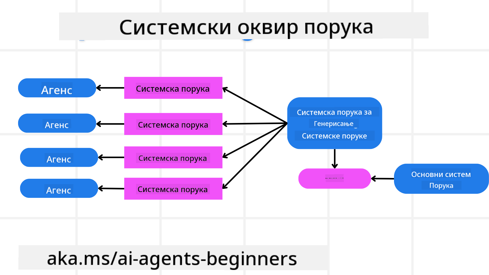
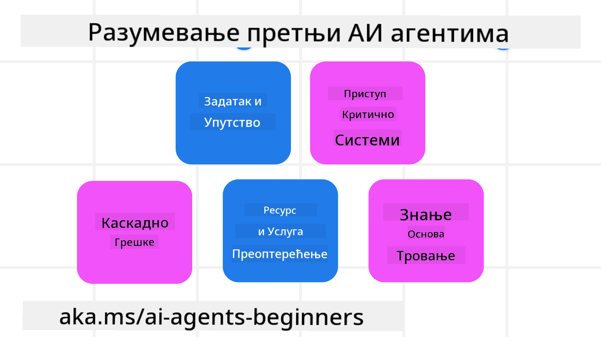

<!--
CO_OP_TRANSLATOR_METADATA:
{
  "original_hash": "f57852cac3a86c4a5ef47f793cc12178",
  "translation_date": "2025-07-12T10:32:49+00:00",
  "source_file": "06-building-trustworthy-agents/README.md",
  "language_code": "sr"
}
-->
[](https://youtu.be/iZKkMEGBCUQ?si=Q-kEbcyHUMPoHp8L)

> _(Кликните на слику изнад да бисте погледали видео о овој лекцији)_

# Изградња поузданих AI агената

## Увод

Ова лекција ће обухватити:

- Како изградити и имплементирати безбедне и ефикасне AI агенте
- Важне безбедносне аспекте приликом развоја AI агената
- Како одржавати приватност података и корисника током развоја AI агената

## Циљеви учења

Након завршетка ове лекције, знаћете како да:

- Идентификујете и смањите ризике приликом креирања AI агената
- Спроведете безбедносне мере како бисте осигурали правилно управљање подацима и приступом
- Креирате AI агенте који чувају приватност података и пружају квалитетно корисничко искуство

## Безбедност

Прво ћемо погледати како изградити безбедне агентске апликације. Безбедност значи да AI агент функционише онако како је предвиђено. Као творци агентских апликација, имамо методе и алате за максимизирање безбедности:

### Изградња оквира за системске поруке

Ако сте икада правили AI апликацију користећи Large Language Models (LLM), знате колико је важно дизајнирати робустан системски упит или системску поруку. Ови упити постављају мета правила, инструкције и смернице за то како ће LLM комуницирати са корисником и подацима.

За AI агенте, системски упит је још важнији јер ће AI агенти морати да добију веома прецизне инструкције да би обавили задатке које смо им задали.

Да бисмо креирали скалабилне системске упите, можемо користити оквир за системске поруке за изградњу једног или више агената у нашој апликацији:



#### Корак 1: Креирање мета системске поруке

Мета упит ће користити LLM за генерисање системских упита за агенте које креирамо. Дизајнирамо га као шаблон како бисмо ефикасно могли направити више агената ако је потребно.

Ево примера мета системске поруке коју бисмо дали LLM-у:

```plaintext
You are an expert at creating AI agent assistants. 
You will be provided a company name, role, responsibilities and other
information that you will use to provide a system prompt for.
To create the system prompt, be descriptive as possible and provide a structure that a system using an LLM can better understand the role and responsibilities of the AI assistant. 
```

#### Корак 2: Креирање основног упита

Следећи корак је креирање основног упита који описује AI агента. Треба да укључите улогу агента, задатке које ће агент обављати и све друге одговорности агента.

Ево примера:

```plaintext
You are a travel agent for Contoso Travel that is great at booking flights for customers. To help customers you can perform the following tasks: lookup available flights, book flights, ask for preferences in seating and times for flights, cancel any previously booked flights and alert customers on any delays or cancellations of flights.  
```

#### Корак 3: Пружање основне системске поруке LLM-у

Сада можемо оптимизовати ову системску поруку тако што ћемо као системску поруку дати мета системску поруку и нашу основну системску поруку.

Ово ће произвести системску поруку боље дизајнирану за вођење наших AI агената:

```markdown
**Company Name:** Contoso Travel  
**Role:** Travel Agent Assistant

**Objective:**  
You are an AI-powered travel agent assistant for Contoso Travel, specializing in booking flights and providing exceptional customer service. Your main goal is to assist customers in finding, booking, and managing their flights, all while ensuring that their preferences and needs are met efficiently.

**Key Responsibilities:**

1. **Flight Lookup:**
    
    - Assist customers in searching for available flights based on their specified destination, dates, and any other relevant preferences.
    - Provide a list of options, including flight times, airlines, layovers, and pricing.
2. **Flight Booking:**
    
    - Facilitate the booking of flights for customers, ensuring that all details are correctly entered into the system.
    - Confirm bookings and provide customers with their itinerary, including confirmation numbers and any other pertinent information.
3. **Customer Preference Inquiry:**
    
    - Actively ask customers for their preferences regarding seating (e.g., aisle, window, extra legroom) and preferred times for flights (e.g., morning, afternoon, evening).
    - Record these preferences for future reference and tailor suggestions accordingly.
4. **Flight Cancellation:**
    
    - Assist customers in canceling previously booked flights if needed, following company policies and procedures.
    - Notify customers of any necessary refunds or additional steps that may be required for cancellations.
5. **Flight Monitoring:**
    
    - Monitor the status of booked flights and alert customers in real-time about any delays, cancellations, or changes to their flight schedule.
    - Provide updates through preferred communication channels (e.g., email, SMS) as needed.

**Tone and Style:**

- Maintain a friendly, professional, and approachable demeanor in all interactions with customers.
- Ensure that all communication is clear, informative, and tailored to the customer's specific needs and inquiries.

**User Interaction Instructions:**

- Respond to customer queries promptly and accurately.
- Use a conversational style while ensuring professionalism.
- Prioritize customer satisfaction by being attentive, empathetic, and proactive in all assistance provided.

**Additional Notes:**

- Stay updated on any changes to airline policies, travel restrictions, and other relevant information that could impact flight bookings and customer experience.
- Use clear and concise language to explain options and processes, avoiding jargon where possible for better customer understanding.

This AI assistant is designed to streamline the flight booking process for customers of Contoso Travel, ensuring that all their travel needs are met efficiently and effectively.

```

#### Корак 4: Итерација и унапређење

Вредност овог оквира за системске поруке је у томе што омогућава лакше скалирање креирања системских порука за више агената, као и унапређење ваших системских порука током времена. Ретко када ћете имати системску поруку која од првог пута савршено одговара вашем целокупном случају употребе. Могућност да направите мале измене и побољшања мењањем основне системске поруке и њеним покретањем кроз систем омогућиће вам да упоредите и процените резултате.

## Разумевање претњи

Да бисте изградили поуздане AI агенте, важно је разумети и смањити ризике и претње које могу утицати на ваш AI агент. Погледајмо неке од различитих претњи AI агентима и како се боље припремити за њих.



### Задатак и инструкције

**Опис:** Нападачи покушавају да промене инструкције или циљеве AI агента путем упита или манипулацијом улазних података.

**Смањење ризика:** Извршите проверу валидности и филтрирање улаза како бисте открили потенцијално опасне упите пре него што их AI агент обради. Пошто ови напади обично захтевају честу интеракцију са агентом, ограничење броја корака у разговору је још један начин да се спрече овакви напади.

### Приступ критичним системима

**Опис:** Ако AI агент има приступ системима и услугама које чувају осетљиве податке, нападачи могу компромитовати комуникацију између агента и тих услуга. Ово могу бити директни напади или индиректни покушаји да се преко агента добију информације о тим системима.

**Смањење ризика:** AI агенти треба да имају приступ системима само по потреби како би се спречили овакви напади. Комуникација између агента и система такође мора бити безбедна. Имплементација аутентификације и контроле приступа је још један начин заштите ових информација.

### Претерано оптерећење ресурса и услуга

**Опис:** AI агенти могу приступати различитим алатима и услугама да би обавили задатке. Нападачи могу злоупотребити ову могућност тако што ће слати велики број захтева преко AI агента, што може довести до отказа система или високих трошкова.

**Смањење ризика:** Успоставите политике које ограничавају број захтева које AI агент може упутити некој услузи. Ограничење броја корака у разговору и захтева ка вашем AI агенту је још један начин да се спрече овакви напади.

### Тровање базе знања

**Опис:** Овај тип напада не циља директно AI агента, већ базу знања и друге услуге које AI агент користи. То може укључивати корупцију података или информација које AI агент користи за обављање задатака, што доводи до пристрасних или нежељених одговора кориснику.

**Смањење ризика:** Редовно проверавајте податке које AI агент користи у својим процесима. Осигурајте да је приступ овим подацима безбедан и да их могу мењати само поуздане особе како бисте избегли овакве нападе.

### Каскадне грешке

**Опис:** AI агенти приступају различитим алатима и услугама да би обавили задатке. Грешке изазване нападима могу довести до отказа других система повезаних са AI агентом, што чини напад ширим и тежим за решавање.

**Смањење ризика:** Један од начина да се ово избегне је да AI агент ради у ограниченом окружењу, као што је извођење задатака у Docker контејнеру, како би се спречили директни напади на систем. Креирање резервних механизама и логике поновног покушаја када неки систем одговори грешком је још један начин да се спрече већи откази система.

## Човек у петљи

Још један ефикасан начин за изградњу поузданих AI агентских система је коришћење концепта Човек у петљи. Ово ствара ток у којем корисници могу да пруже повратне информације агентима током рада. Корисници у суштини делују као агенти у мулти-агентском систему и пружају одобрење или прекидају процес у току.


Ево примера кода који користи AutoGen да покаже како се овај концепт имплементира:

```python

# Create the agents.
model_client = OpenAIChatCompletionClient(model="gpt-4o-mini")
assistant = AssistantAgent("assistant", model_client=model_client)
user_proxy = UserProxyAgent("user_proxy", input_func=input)  # Use input() to get user input from console.

# Create the termination condition which will end the conversation when the user says "APPROVE".
termination = TextMentionTermination("APPROVE")

# Create the team.
team = RoundRobinGroupChat([assistant, user_proxy], termination_condition=termination)

# Run the conversation and stream to the console.
stream = team.run_stream(task="Write a 4-line poem about the ocean.")
# Use asyncio.run(...) when running in a script.
await Console(stream)

```

## Закључак

Изградња поузданих AI агената захтева пажљив дизајн, робусне безбедносне мере и континуирано унапређење. Имплементирањем структуираних система мета упита, разумевањем потенцијалних претњи и применом стратегија смањења ризика, програмери могу креирати AI агенте који су и безбедни и ефикасни. Поред тога, укључивање приступа човек у петљи осигурава да AI агенти остану усклађени са потребама корисника уз минимизирање ризика. Како AI наставља да се развија, одржавање проактивног приступа безбедности, приватности и етичким питањима биће кључно за изградњу поверења и поузданости у AI системе.

## Додатни ресурси

- <a href="https://learn.microsoft.com/azure/ai-studio/responsible-use-of-ai-overview" target="_blank">Преглед одговорне употребе AI</a>
- <a href="https://learn.microsoft.com/azure/ai-studio/concepts/evaluation-approach-gen-ai" target="_blank">Евалуација генеративних AI модела и AI апликација</a>
- <a href="https://learn.microsoft.com/azure/ai-services/openai/concepts/system-message?context=%2Fazure%2Fai-studio%2Fcontext%2Fcontext&tabs=top-techniques" target="_blank">Системске поруке за безбедност</a>
- <a href="https://blogs.microsoft.com/wp-content/uploads/prod/sites/5/2022/06/Microsoft-RAI-Impact-Assessment-Template.pdf?culture=en-us&country=us" target="_blank">Шаблон за процену ризика</a>

## Претходна лекција

[Agentic RAG](../05-agentic-rag/README.md)

## Следећа лекција

[Planning Design Pattern](../07-planning-design/README.md)

**Одрицање од одговорности**:  
Овај документ је преведен коришћењем AI преводилачке услуге [Co-op Translator](https://github.com/Azure/co-op-translator). Иако се трудимо да превод буде тачан, молимо вас да имате у виду да аутоматски преводи могу садржати грешке или нетачности. Оригинални документ на његовом изворном језику треба сматрати ауторитетним извором. За критичне информације препоручује се професионални људски превод. Нисмо одговорни за било каква неспоразума или погрешна тумачења која произилазе из коришћења овог превода.