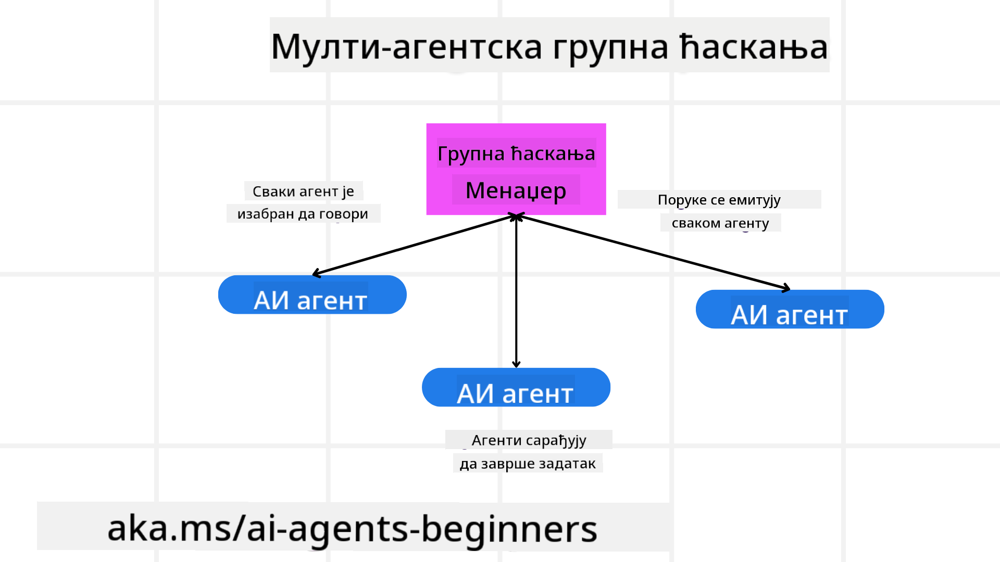
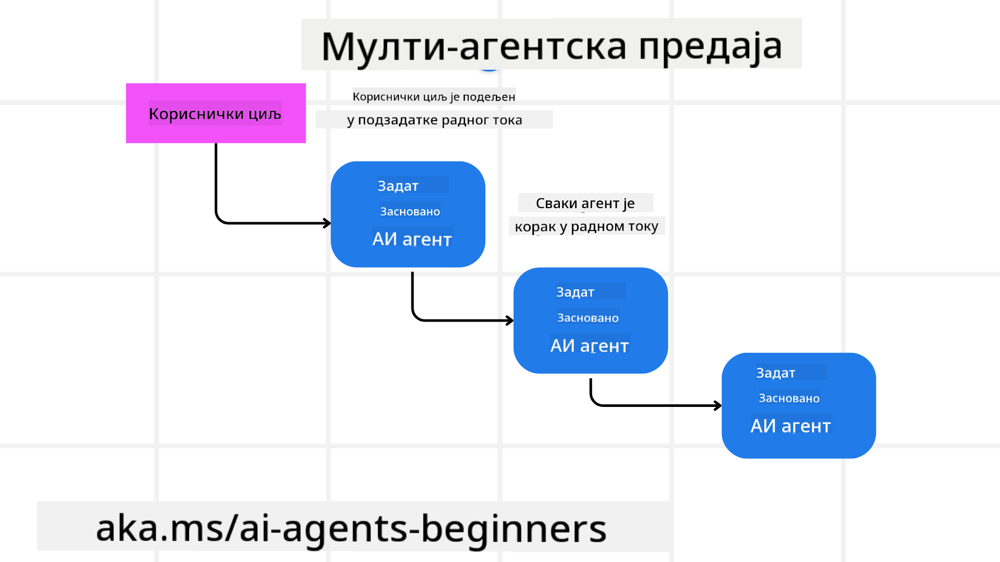
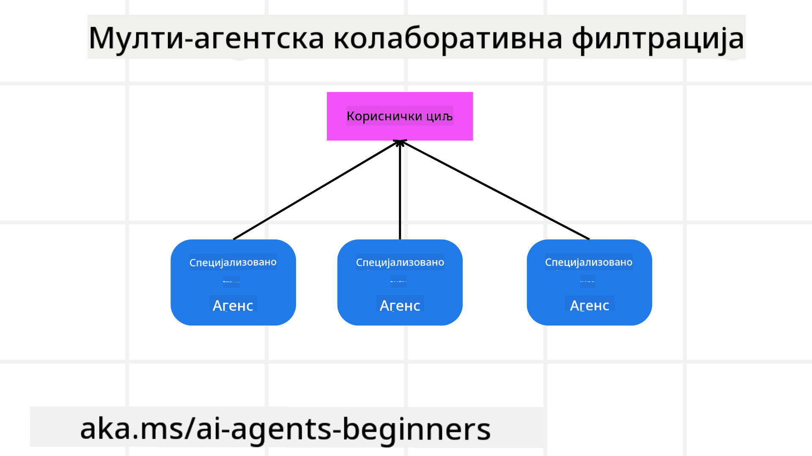

<!--
CO_OP_TRANSLATOR_METADATA:
{
  "original_hash": "c692a8975d7d5b99575a553de1c5e8a7",
  "translation_date": "2025-07-12T11:28:24+00:00",
  "source_file": "08-multi-agent/README.md",
  "language_code": "sr"
}
-->

> _(Кликните на слику изнад да бисте погледали видео о овој лекцији)_

# Обрасци дизајна за више агената

Чим почнете да радите на пројекту који укључује више агената, мораћете да размислите о обрасцима дизајна за више агената. Међутим, можда неће одмах бити јасно када је време да се пређе на више агената и које су предности таквог приступа.

## Увод

У овој лекцији ћемо покушати да одговоримо на следећа питања:

- У којим сценаријима је применљив приступ са више агената?
- Које су предности коришћења више агената у односу на једног агента који обавља више задатака?
- Који су основни елементи за имплементацију обрасца дизајна са више агената?
- Како имамо увид у то како више агената међусобно комуницирају?

## Циљеви учења

Након ове лекције требало би да будете у стању да:

- Препознате сценарије у којима је приступ са више агената применљив
- Уочите предности коришћења више агената у односу на једног агента
- Разумете основне елементе за имплементацију обрасца дизајна са више агената

Која је шира слика?

*Више агената је образац дизајна који омогућава да више агената заједно ради на постизању заједничког циља*.

Овај образац се широко користи у различитим областима, укључујући роботiku, аутономне системе и дистрибуирано рачунарство.

## Сценарији у којима је приступ са више агената применљив

Који су добри примери за коришћење више агената? Одговор је да постоји много сценарија у којима је коришћење више агената корисно, посебно у следећим случајевима:

- **Велики обим посла**: Велики задаци могу бити подељени на мање делове и додељени различитим агентима, што омогућава паралелну обраду и брже завршетак. Пример за то је обрада великих количина података.
- **Комплексни задаци**: Као и код великих обима посла, комплексни задаци могу бити разложени на мање подзадатке и додељени агентима који су специјализовани за одређене аспекте задатка. Добар пример су аутономна возила где различити агенти управљају навигацијом, детекцијом препрека и комуникацијом са другим возилима.
- **Разнолика стручност**: Различити агенти могу имати различите области стручности, што им омогућава да ефикасније обраде различите аспекте задатка него један агент. Пример за то је здравство, где агенти могу управљати дијагностиком, плановима лечења и праћењем пацијената.

## Предности коришћења више агената у односу на једног агента

Један агент може добро функционисати за једноставне задатке, али за сложеније задатке коришћење више агената доноси неколико предности:

- **Специјализација**: Сваки агент може бити специјализован за одређени задатак. Недостатак специјализације код једног агента значи да он може радити све, али може бити збуњен када се суочи са комплексним задацима. На пример, може завршити радећи задатак за који није најбоље оспособљен.
- **Скалабилност**: Лакше је проширивати систем додавањем више агената него преоптерећивати једног агента.
- **Отпорност на грешке**: Ако један агент не успе, други могу наставити са радом, што обезбеђује поузданост система.

Узмимо пример — резервисање путовања за корисника. Један агент би морао да обради све аспекте процеса резервације, од проналажења летова до резервације хотела и изнајмљивања аутомобила. Да би то урадио, агент би морао да има алате за све те задатке, што може довести до сложеног и монолитног система који је тежак за одржавање и проширење. Са друге стране, систем са више агената може имати различите агенте специјализоване за проналажење летова, резервацију хотела и изнајмљивање аутомобила. То чини систем модуларнијим, лакшим за одржавање и скалабилним.

Упоредите то са туристичком агенцијом вођеном као породични бизнис у односу на туристичку агенцију која ради као франшиза. Породични бизнис имао би једног агента који обрађује све аспекте резервације, док би франшиза имала различите агенте који се баве различитим деловима процеса.

## Основни елементи за имплементацију обрасца дизајна са више агената

Пре него што имплементирате образац дизајна са више агената, потребно је да разумете основне елементе који чине овај образац.

Хајде да то конкретније прикажемо поново на примеру резервације путовања за корисника. У овом случају, основни елементи укључују:

- **Комуникација између агената**: Агенти за проналажење летова, резервацију хотела и изнајмљивање аутомобила морају комуницирати и делити информације о корисничким преференцама и ограничењима. Потребно је одлучити о протоколима и методама те комуникације. Конкретно, агент за проналажење летова мора да комуницира са агентом за резервацију хотела како би се осигурало да је хотел резервисан за исте датуме као и лет. То значи да агенти морају делити информације о датумима путовања корисника, што подразумева да треба одлучити *који агенти деле информације и како то раде*.
- **Механизми координације**: Агенти морају координисати своје активности како би испунили корисничке преференце и ограничења. На пример, корисник може желети хотел близу аеродрома, док је ограничење да су аутомобили за изнајмљивање доступни само на аеродрому. То значи да агент за резервацију хотела мора координисати са агентом за изнајмљивање аутомобила како би се испуниле корисничке жеље и ограничења. Потребно је одлучити *како агенти координишу своје активности*.
- **Архитектура агената**: Агенти морају имати унутрашњу структуру која им омогућава доношење одлука и учење из интеракција са корисником. На пример, агент за проналажење летова мора имати структуру која му омогућава да одлучује које летове да препоручи кориснику. Потребно је одлучити *како агенти доносе одлуке и уче из интеракција са корисником*. Пример учења агента може бити коришћење модела машинског учења који препоручује летове на основу претходних преференци корисника.
- **Увид у интеракције више агената**: Потребно је имати увид у то како више агената међусобно комуницирају. То значи да треба имати алате и технике за праћење активности и интеракција агената. То може бити у виду алата за логовање и праћење, алата за визуализацију и метрика перформанси.
- **Обрасци за више агената**: Постоје различити обрасци за имплементацију система са више агената, као што су централизована, децентрализована и хибридна архитектура. Потребно је изабрати образац који најбоље одговара вашем случају употребе.
- **Човек у петљи**: У већини случајева постоји човек у петљи и потребно је упутити агенте када да затраже људску интервенцију. То може бити у виду корисника који тражи одређени хотел или лет који агенти нису препоручили или тражи потврду пре резервације лета или хотела.

## Увид у интеракције више агената

Веома је важно имати увид у то како више агената међусобно комуницирају. Тај увид је кључан за отклањање грешака, оптимизацију и обезбеђивање ефикасности целог система. Да бисте то постигли, потребно је имати алате и технике за праћење активности и интеракција агената. То може бити у виду алата за логовање и праћење, алата за визуализацију и метрика перформанси.

На пример, у случају резервације путовања за корисника, могли бисте имати контролни панел који приказује статус сваког агента, корисничке преференце и ограничења, као и интеракције између агената. Тај панел може приказивати датуме путовања корисника, летове које је препоручио агент за летове, хотеле које је препоручио агент за хотеле и аутомобиле које је препоручио агент за изнајмљивање. Ово вам пружа јасан увид у то како агенти комуницирају и да ли се испуњавају корисничке жеље и ограничења.

Погледајмо детаљније сваки од ових аспеката.

- **Алати за логовање и праћење**: Желите да се за сваку акцију коју агент изврши води евиденција. Запис у логу може садржати информације о агенту који је извршио акцију, о самој акцији, времену извршења и резултату акције. Ове информације се могу користити за отклањање грешака, оптимизацију и друге сврхе.
- **Алати за визуализацију**: Ови алати вам помажу да на интуитиван начин видите интеракције између агената. На пример, можете имати граф који приказује проток информација између агената. Ово може помоћи у идентификовању уских грла, неефикасности и других проблема у систему.
- **Метрике перформанси**: Метрике вам помажу да пратите ефикасност система са више агената. На пример, можете пратити време потребно за завршетак задатка, број завршених задатака по јединици времена и тачност препорука које агенти дају. Ове информације помажу у идентификовању области за побољшање и оптимизацију система.

## Обрасци за више агената

Хајде да погледамо неке конкретне обрасце које можемо користити за креирање апликација са више агената. Ево неколико занимљивих образаца које вреди размотрити:

### Групни чет

Овај образац је користан када желите да направите апликацију за групни чет у којој више агената може међусобно комуницирати. Типични случајеви употребе укључују тимску сарадњу, корисничку подршку и друштвене мреже.

У овом обрасцу, сваки агент представља корисника у групном чету, а поруке се размењују између агената коришћењем протокола за слање порука. Агенти могу слати поруке групи, примати поруке из групе и одговарати на поруке других агената.

Овај образац се може имплементирати коришћењем централизоване архитектуре у којој све поруке пролазе кроз централни сервер, или децентрализоване архитектуре у којој се поруке размењују директно.

### Пренос задатака (Hand-off)

Овај образац је користан када желите да направите апликацију у којој више агената може међусобно преносити задатке.

Типични случајеви употребе укључују корисничку подршку, управљање задацима и аутоматизацију радних токова.

У овом обрасцу, сваки агент представља задатак или корак у радном току, а агенти могу преносити задатке другим агентима на основу унапред дефинисаних правила.

### Колаборативно филтрирање

Овај образац је користан када желите да направите апликацију у којој више агената сарађује како би корисницима пружили препоруке.

Зашто бисте желели да више агената сарађује? Зато што сваки агент може имати различиту стручност и допринети процесу препорука на различите начине.

Узмимо пример где корисник жели препоруку за најбољу акцију за куповину на берзи.

- **Стручњак за индустрију**: Један агент може бити стручњак за одређену индустрију.
- **Техничка анализа**: Други агент може бити стручњак за техничку анализу.
- **Фундаментална анализа**: Трећи агент може бити стручњак за фундаменталну анализу. Сарадњом, ови агенти могу пружити свеобухватнију препоруку кориснику.

## Сценарио: Процес повраћаја новца

Размотримо сценарио у којем корисник покушава да добије повраћај новца за производ. У овом процесу може бити укључено доста агената, али хајде да их поделимо на агенте специфичне за овај процес и опште агенте који се могу користити у другим процесима.

**Агенти специфични за процес повраћаја новца**:

Следећи агенти могу бити укључени у процес повраћаја:

- **Агент корисника**: Представља корисника и одговоран је за покретање процеса повраћаја.
- **Агент продавца**: Представља продавца и одговоран је за обраду повраћаја.
- **Агент плаћања**: Представља процес плаћања и одговоран је за враћање новца кориснику.
- **Агент решавања спорова**: Представља процес решавања проблема и одговоран је за решавање свих питања која се појаве током процеса повраћаја.
- **Агент усаглашености**: Представља процес усаглашености и одговоран је за обезбеђивање да процес повраћаја буде у складу са прописима и политикама.

**Општи агенти**:

Ови агенти се могу користити у другим деловима вашег пословања.

- **Агент за испоруку**: Представља процес испоруке и одговоран је за слање производа назад продавцу. Овај агент се може користити и за процес повраћаја и за општу испоруку производа, на пример приликом куповине.
- **Агент за повратне информације**: Представља процес прикупљања повратних информација од корисника. Повратне информације могу се прикупљати у било ком тренутку, не само током процеса повраћаја.
- **Агент за ескалацију**: Представља процес ескалације и одговоран је за прослеђивање проблема на виши ниво подршке. Овај тип агента можете користити у било ком процесу где је потребна ескалација.
- **Агент за обавештења**: Представља процес слања обавештења кориснику у различитим фазама процеса повраћаја.
- **Агент за анализу**: Представља процес анализе под
## Претходна лекција

[Планирање дизајна](../07-planning-design/README.md)

## Следећа лекција

[Метакогниција у AI агентима](../09-metacognition/README.md)

**Одрицање од одговорности**:  
Овај документ је преведен коришћењем AI преводилачке услуге [Co-op Translator](https://github.com/Azure/co-op-translator). Иако се трудимо да превод буде тачан, молимо вас да имате у виду да аутоматизовани преводи могу садржати грешке или нетачности. Оригинални документ на његовом изворном језику треба сматрати ауторитетним извором. За критичне информације препоручује се професионални људски превод. Нисмо одговорни за било каква неспоразума или погрешна тумачења која произилазе из коришћења овог превода.