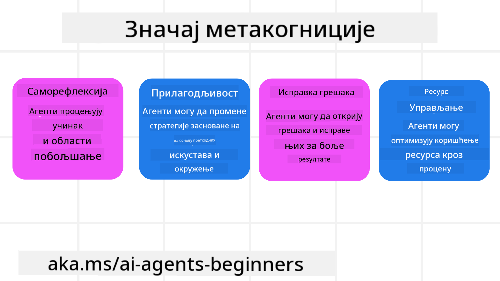
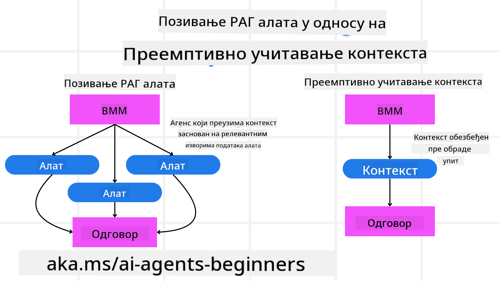

<!--
CO_OP_TRANSLATOR_METADATA:
{
  "original_hash": "8cbf460468c802c7994aa62e0e0779c9",
  "translation_date": "2025-07-12T13:22:05+00:00",
  "source_file": "09-metacognition/README.md",
  "language_code": "sr"
}
-->
[](https://youtu.be/His9R6gw6Ec?si=3_RMb8VprNvdLRhX)

> _(Кликните на слику изнад да бисте погледали видео о овој лекцији)_
# Метакогниција у AI агентима

## Увод

Добродошли у лекцију о метакогницији у AI агентима! Ово поглавље је намењено почетницима који су радознали како AI агенти могу размишљати о сопственим процесима размишљања. На крају ове лекције, разумећете кључне појмове и бићете опремљени практичним примерима за примену метакогниције у дизајну AI агената.

## Циљеви учења

Након завршетка ове лекције, моћи ћете да:

1. Разумете импликације петљи размишљања у дефиницијама агената.
2. Користите технике планирања и евалуације да помогнете агентима који се самокоригују.
3. Креирате своје агенте способне да манипулишу кодом како би обављали задатке.

## Увод у метакогницију

Метакогниција се односи на виши ниво когнитивних процеса који укључују размишљање о сопственом размишљању. За AI агенте, то значи способност да процене и прилагоде своје акције на основу самосвести и претходних искустава. Метакогниција, или „размишљање о размишљању“, важан је концепт у развоју агентских AI система. Она подразумева да AI системи буду свесни својих унутрашњих процеса и да могу да прате, регулишу и прилагођавају своје понашање у складу с тим. Баш као што ми то радимо када „читамо собу“ или посматрамо проблем. Ова самосвест може помоћи AI системима да доносе боље одлуке, идентификују грешке и временом побољшају свој учинак – што нас враћа на Тјурингов тест и дебату о томе да ли ће AI преузети контролу.

У контексту агентских AI система, метакогниција може помоћи у решавању неколико изазова, као што су:
- Транспарентност: Осигуравање да AI системи могу објаснити своје разлоге и одлуке.
- Размишљање: Побољшање способности AI система да синтетишу информације и доносе исправне одлуке.
- Прилагођавање: Омогућавање AI системима да се прилагођавају новим окружењима и променљивим условима.
- Перцепција: Побољшање тачности AI система у препознавању и тумачењу података из окружења.

### Шта је метакогниција?

Метакогниција, или „размишљање о размишљању“, је виши когнитивни процес који укључује самосвест и саморегулацију сопствених когнитивних процеса. У домену AI, метакогниција омогућава агентима да процењују и прилагођавају своје стратегије и акције, што води ка бољем решавању проблема и доношењу одлука. Разумевањем метакогниције, можете дизајнирати AI агенте који нису само интелигентнији, већ и прилагодљивији и ефикаснији. У правом смислу метакогниције, AI би јасно разматрао своје сопствено размишљање.

Пример: „Преферирао сам јефтиније летове јер... можда пропуштам директне летове, па ћу поново проверити.“
Праћење како и зашто је изабрао одређену руту.
- Уочавање да је направио грешке јер се превише ослањао на корисничке преференције из претходног пута, па мења стратегију доношења одлука, а не само коначну препоруку.
- Дијагностика образаца као што је: „Кад год корисник помене ‘превише гужве’, не треба само да уклоним одређене атракције, већ и да размислим да је мој метод избора ‘најбољих атракција’ погрешан ако увек рангирам по популарности.“

### Значај метакогниције у AI агентима

Метакогниција игра кључну улогу у дизајну AI агената из више разлога:



- Саморефлексија: Агенти могу проценити свој учинак и идентификовати области за побољшање.
- Прилагодљивост: Агенти могу мењати своје стратегије на основу претходних искустава и промењивих услова.
- Корекција грешака: Агенти могу аутономно откривати и исправљати грешке, што доводи до прецизнијих резултата.
- Управљање ресурсима: Агенти могу оптимизовати коришћење ресурса, као што су време и рачунарска снага, планирајући и процењујући своје акције.

## Компоненте AI агента

Пре него што уђемо у метакогнитивне процесе, важно је разумети основне компоненте AI агента. AI агент обично се састоји од:

- Личност: Личност и карактеристике агента које дефинишу како он комуницира са корисницима.
- Алати: Капацитети и функције које агент може извршавати.
- Вештине: Знање и експертиза које агент поседује.

Ове компоненте заједно чине „јединицу експертизе“ која може обављати специфичне задатке.

**Пример**:
Замислите туристичког агента, услугу агента која не само да планира ваш одмор већ и прилагођава свој пут на основу података у реалном времену и претходних искустава корисника.

### Пример: Метакогниција у услузи туристичког агента

Замислите да дизајнирате услугу туристичког агента покретану AI. Овај агент, „Туристички агент“, помаже корисницима у планирању одмора. Да би укључио метакогницију, Туристички агент треба да процењује и прилагођава своје акције на основу самосвести и претходних искустава. Ево како метакогниција може играти улогу:

#### Тренутни задатак

Тренутни задатак је помоћи кориснику да испланира путовање у Париз.

#### Кораци за завршетак задатка

1. **Прикупљање корисничких преференција**: Питајте корисника о датумима путовања, буџету, интересовањима (нпр. музеји, кухиња, шопинг) и специфичним захтевима.
2. **Проналажење информација**: Тражите опције летова, смештаја, атракција и ресторана који одговарају корисничким преференцама.
3. **Генерисање препорука**: Понудите персонализовани план путовања са детаљима о летовима, резервацијама хотела и предложеним активностима.
4. **Прилагођавање на основу повратних информација**: Питајте корисника за повратне информације о препорукама и направите потребне измене.

#### Потребни ресурси

- Приступ базама података за резервацију летова и хотела.
- Информације о париским атракцијама и ресторанима.
- Податке о повратним информацијама корисника из претходних интеракција.

#### Искуство и саморефлексија

Туристички агент користи метакогницију да процени свој учинак и учи из претходних искустава. На пример:

1. **Анализа повратних информација корисника**: Туристички агент прегледа повратне информације да утврди које су препоруке добро прихваћене, а које нису. Према томе прилагођава будуће предлоге.
2. **Прилагодљивост**: Ако је корисник раније помињао да не воли гужве, Туристички агент ће убудуће избегавати препоруке популарних туристичких места у време највеће посете.
3. **Корекција грешака**: Ако је Туристички агент направио грешку у претходној резервацији, као што је препорука хотела који је био пун, учи да темељније проверава доступност пре него што да препоруку.

#### Практичан пример за програмере

Ево поједностављеног примера кода како би код Туристичког агента могао изгледати када укључује метакогницију:

```python
class Travel_Agent:
    def __init__(self):
        self.user_preferences = {}
        self.experience_data = []

    def gather_preferences(self, preferences):
        self.user_preferences = preferences

    def retrieve_information(self):
        # Search for flights, hotels, and attractions based on preferences
        flights = search_flights(self.user_preferences)
        hotels = search_hotels(self.user_preferences)
        attractions = search_attractions(self.user_preferences)
        return flights, hotels, attractions

    def generate_recommendations(self):
        flights, hotels, attractions = self.retrieve_information()
        itinerary = create_itinerary(flights, hotels, attractions)
        return itinerary

    def adjust_based_on_feedback(self, feedback):
        self.experience_data.append(feedback)
        # Analyze feedback and adjust future recommendations
        self.user_preferences = adjust_preferences(self.user_preferences, feedback)

# Example usage
travel_agent = Travel_Agent()
preferences = {
    "destination": "Paris",
    "dates": "2025-04-01 to 2025-04-10",
    "budget": "moderate",
    "interests": ["museums", "cuisine"]
}
travel_agent.gather_preferences(preferences)
itinerary = travel_agent.generate_recommendations()
print("Suggested Itinerary:", itinerary)
feedback = {"liked": ["Louvre Museum"], "disliked": ["Eiffel Tower (too crowded)"]}
travel_agent.adjust_based_on_feedback(feedback)
```

#### Зашто је метакогниција важна

- **Саморефлексија**: Агенти могу анализирати свој учинак и идентификовати области за побољшање.
- **Прилагодљивост**: Агенти могу мењати стратегије на основу повратних информација и промењивих услова.
- **Корекција грешака**: Агенти могу аутономно откривати и исправљати грешке.
- **Управљање ресурсима**: Агенти могу оптимизовати коришћење ресурса, као што су време и рачунарска снага.

Укључивањем метакогниције, Туристички агент може пружити персонализованије и прецизније препоруке за путовања, побољшавајући укупно корисничко искуство.

---

## 2. Планирање у агентима

Планирање је кључна компонента понашања AI агената. Оно подразумева дефинисање корака потребних за постизање циља, узимајући у обзир тренутно стање, ресурсе и могуће препреке.

### Елементи планирања

- **Тренутни задатак**: Јасно дефинишите задатак.
- **Кораци за завршетак задатка**: Разложите задатак на управљиве кораке.
- **Потребни ресурси**: Идентификујте неопходне ресурсе.
- **Искуство**: Користите претходна искуства за информисање плана.

**Пример**:
Ево корака које Туристички агент треба да предузме да би ефикасно помогао кориснику у планирању путовања:

### Кораци за Туристичког агента

1. **Прикупљање корисничких преференција**
   - Питајте корисника за детаље о датумима путовања, буџету, интересовањима и специфичним захтевима.
   - Примери: „Када планирате путовање?“ „Који је ваш буџет?“ „Које активности волите на одмору?“

2. **Проналажење информација**
   - Тражите релевантне опције путовања на основу корисничких преференција.
   - **Летови**: Тражите доступне летове у оквиру буџета и жељених датума.
   - **Смештај**: Пронађите хотеле или изнајмљене објекте који одговарају локацији, цени и садржајима.
   - **Атракције и ресторани**: Идентификујте популарне атракције, активности и ресторане који одговарају интересовањима корисника.

3. **Генерисање препорука**
   - Саставите прилагођени план путовања.
   - Понудите детаље као што су опције летова, резервације хотела и предложене активности, прилагођавајући препоруке корисничким преференцама.

4. **Презентација плана кориснику**
   - Поделите предложени план са корисником ради прегледа.
   - Пример: „Ево предложеног плана за ваше путовање у Париз. Укључује детаље о летовима, резервације хотела и листу препоручених активности и ресторана. Јавите ми ваше мишљење!“

5. **Прикупљање повратних информација**
   - Питајте корисника за повратне информације о предложеном плану.
   - Примери: „Да ли вам се свиђају опције летова?“ „Да ли је хотел прикладан за ваше потребе?“ „Постоје ли активности које бисте желели да додате или уклоните?“

6. **Прилагођавање на основу повратних информација**
   - Измените план у складу са повратним информацијама корисника.
   - Направите потребне промене у препорукама за летове, смештај и активности да боље одговарају корисничким преференцама.

7. **Коначна потврда**
   - Представите ажурирани план кориснику ради коначне потврде.
   - Пример: „Направио сам измене на основу ваших повратних информација. Ево ажурираног плана. Да ли вам све одговара?“

8. **Резервација и потврда**
   - Када корисник одобри план, наставите са резервацијом летова, смештаја и планираних активности.
   - Пошаљите кориснику детаље о потврди.

9. **Континуирана подршка**
   - Будите доступни да помогнете кориснику са било каквим изменама или додатним захтевима пре и током путовања.
   - Пример: „Ако вам буде требала додатна помоћ током путовања, слободно ми се обратите у било које време!“

### Пример интеракције

```python
class Travel_Agent:
    def __init__(self):
        self.user_preferences = {}
        self.experience_data = []

    def gather_preferences(self, preferences):
        self.user_preferences = preferences

    def retrieve_information(self):
        flights = search_flights(self.user_preferences)
        hotels = search_hotels(self.user_preferences)
        attractions = search_attractions(self.user_preferences)
        return flights, hotels, attractions

    def generate_recommendations(self):
        flights, hotels, attractions = self.retrieve_information()
        itinerary = create_itinerary(flights, hotels, attractions)
        return itinerary

    def adjust_based_on_feedback(self, feedback):
        self.experience_data.append(feedback)
        self.user_preferences = adjust_preferences(self.user_preferences, feedback)

# Example usage within a booing request
travel_agent = Travel_Agent()
preferences = {
    "destination": "Paris",
    "dates": "2025-04-01 to 2025-04-10",
    "budget": "moderate",
    "interests": ["museums", "cuisine"]
}
travel_agent.gather_preferences(preferences)
itinerary = travel_agent.generate_recommendations()
print("Suggested Itinerary:", itinerary)
feedback = {"liked": ["Louvre Museum"], "disliked": ["Eiffel Tower (too crowded)"]}
travel_agent.adjust_based_on_feedback(feedback)
```

## 3. Корективни RAG систем

Прво, хајде да разумемо разлику између RAG алата и претходног учитавања контекста.



### Retrieval-Augmented Generation (RAG)

RAG комбинује систем за претрагу са генеративним моделом. Када се постави упит, систем за претрагу дохвата релевантне документе или податке из спољног извора, а те информације се користе за допуну улаза генеративном моделу. Ово помаже моделу да генерише прецизније и контекстуално релевантне одговоре.

У RAG систему, агент дохвата релевантне информације из базе знања и користи их за генерисање одговарајућих одговора или акција.

### Корективни RAG приступ

Корективни RAG приступ фокусира се на коришћење RAG техника за исправљање грешака и побољшање тачности AI агената. Ово укључује:

1. **Техника подстицања (prompting)**: Коришћење специфичних упита који воде агента у дохватању релевантних информација.
2. **Алат**: Имплементација алгоритама и механизама који омогућавају агенту да процени релевантност дохваћених информација и генерише прецизне одговоре.
3. **Евалуација**: Континуирано процењивање учинка агента и прављење прилагођавања ради побољшања тачности и ефикасности.

#### Пример: Корективни RAG у претраживачком агенту

Размотрите претраживачког агента који дохвата информације са интернета да би одговарао на корисничке упите. Корективни RAG приступ може укључивати:

1. **Техника подстицања**: Формулисање претраживачких упита на основу корисничког уноса.
2. **Алат**: Коришћење обраде природног језика и алгоритама машинског учења за рангирање и филтрирање резултата претраге.
3. **Евалуација**: Анализа повратних информација корисника ради идентификовања и исправљања нетачности у дохваћеним информацијама.

### Корективни R
### Преемптивно учитавање контекста

Преемптивно учитавање контекста подразумева уношење релевантних информација или позадинских података у модел пре обраде упита. То значи да модел од почетка има приступ тим информацијама, што му помаже да генерише боље и информисаније одговоре без потребе за додатним преузимањем података током процеса.

Ево поједностављеног примера како би преемптивно учитавање контекста могло изгледати у апликацији за туристичког агента написаној у Питону:

```python
class TravelAgent:
    def __init__(self):
        # Pre-load popular destinations and their information
        self.context = {
            "Paris": {"country": "France", "currency": "Euro", "language": "French", "attractions": ["Eiffel Tower", "Louvre Museum"]},
            "Tokyo": {"country": "Japan", "currency": "Yen", "language": "Japanese", "attractions": ["Tokyo Tower", "Shibuya Crossing"]},
            "New York": {"country": "USA", "currency": "Dollar", "language": "English", "attractions": ["Statue of Liberty", "Times Square"]},
            "Sydney": {"country": "Australia", "currency": "Dollar", "language": "English", "attractions": ["Sydney Opera House", "Bondi Beach"]}
        }

    def get_destination_info(self, destination):
        # Fetch destination information from pre-loaded context
        info = self.context.get(destination)
        if info:
            return f"{destination}:\nCountry: {info['country']}\nCurrency: {info['currency']}\nLanguage: {info['language']}\nAttractions: {', '.join(info['attractions'])}"
        else:
            return f"Sorry, we don't have information on {destination}."

# Example usage
travel_agent = TravelAgent()
print(travel_agent.get_destination_info("Paris"))
print(travel_agent.get_destination_info("Tokyo"))
```

#### Објашњење

1. **Иницијализација (`__init__` метод)**: Класа `TravelAgent` унапред учитава речник који садржи информације о популарним дестинацијама као што су Париз, Токио, Њујорк и Сиднеј. У речнику се налазе детаљи као што су земља, валута, језик и главне атракције за сваку дестинацију.

2. **Пребацивање информација (`get_destination_info` метод)**: Када корисник упита за одређену дестинацију, метод `get_destination_info` враћа релевантне информације из унапред учитаног речника.

Унапред учитавањем контекста, апликација туристичког агента може брзо одговарати на корисничке упите без потребе да у реалном времену преузима податке из спољног извора. Ово чини апликацију ефикаснијом и бржом.

### Покретање плана са циљем пре итерације

Покретање плана са јасним циљем подразумева почетак са дефинисаним циљем или жељеним исходом. Дефинисањем циља унапред, модел може користити тај циљ као водиљу током итеративног процеса. Ово помаже да свака итерација буде усмерена ка постизању жељеног резултата, чинећи процес ефикаснијим и фокусиранијим.

Ево примера како можете покренути план путовања са циљем пре итерације у апликацији туристичког агента написаној у Питону:

### Сценарио

Туристички агент жели да испланира прилагођени одмор за клијента. Циљ је направити план путовања који максимизира задовољство клијента на основу његових преференција и буџета.

### Кораци

1. Дефинисати преференције и буџет клијента.
2. Покренути почетни план на основу тих преференција.
3. Итеративно усавршавати план, оптимизујући га за задовољство клијента.

#### Питон код

```python
class TravelAgent:
    def __init__(self, destinations):
        self.destinations = destinations

    def bootstrap_plan(self, preferences, budget):
        plan = []
        total_cost = 0

        for destination in self.destinations:
            if total_cost + destination['cost'] <= budget and self.match_preferences(destination, preferences):
                plan.append(destination)
                total_cost += destination['cost']

        return plan

    def match_preferences(self, destination, preferences):
        for key, value in preferences.items():
            if destination.get(key) != value:
                return False
        return True

    def iterate_plan(self, plan, preferences, budget):
        for i in range(len(plan)):
            for destination in self.destinations:
                if destination not in plan and self.match_preferences(destination, preferences) and self.calculate_cost(plan, destination) <= budget:
                    plan[i] = destination
                    break
        return plan

    def calculate_cost(self, plan, new_destination):
        return sum(destination['cost'] for destination in plan) + new_destination['cost']

# Example usage
destinations = [
    {"name": "Paris", "cost": 1000, "activity": "sightseeing"},
    {"name": "Tokyo", "cost": 1200, "activity": "shopping"},
    {"name": "New York", "cost": 900, "activity": "sightseeing"},
    {"name": "Sydney", "cost": 1100, "activity": "beach"},
]

preferences = {"activity": "sightseeing"}
budget = 2000

travel_agent = TravelAgent(destinations)
initial_plan = travel_agent.bootstrap_plan(preferences, budget)
print("Initial Plan:", initial_plan)

refined_plan = travel_agent.iterate_plan(initial_plan, preferences, budget)
print("Refined Plan:", refined_plan)
```

#### Објашњење кода

1. **Иницијализација (`__init__` метод)**: Класа `TravelAgent` се иницијализује са списком потенцијалних дестинација, од којих свака има атрибуте као што су име, цена и тип активности.

2. **Покретање плана (`bootstrap_plan` метод)**: Овај метод креира почетни план путовања на основу преференција и буџета клијента. Пролази кроз листу дестинација и додаје их у план ако одговарају преференцијама и уклапају се у буџет.

3. **Провера преференција (`match_preferences` метод)**: Овај метод проверава да ли дестинација одговара преференцијама клијента.

4. **Итерација плана (`iterate_plan` метод)**: Овај метод усавршава почетни план тако што покушава да замени сваку дестинацију у плану бољом која боље одговара преференцијама и буџету клијента.

5. **Израчунавање трошкова (`calculate_cost` метод)**: Овај метод израчунава укупне трошкове тренутног плана, укључујући потенцијално нову дестинацију.

#### Пример коришћења

- **Почетни план**: Туристички агент креира почетни план на основу клијентових преференција за разгледање и буџета од 2000 долара.
- **Усавршени план**: Туристички агент итеративно усавршава план, оптимизујући га за преференције и буџет клијента.

Покретањем плана са јасним циљем (нпр. максимизовање задовољства клијента) и итерацијом за усавршавање, туристички агент може направити прилагођен и оптимизован план путовања. Овај приступ осигурава да план од почетка одговара преференцијама и буџету клијента и да се побољшава са сваком итерацијом.

### Коришћење LLM за поновно рангирање и оцењивање

Велики језички модели (LLM) могу се користити за поновно рангирање и оцењивање тако што процењују релевантност и квалитет преузетих докумената или генерисаних одговора. Ево како то функционише:

**Претрага:** Почетни корак преузима скуп кандидата (докумената или одговора) на основу упита.

**Поновно рангирање:** LLM процењује те кандидате и поново их рангира према релевантности и квалитету. Овај корак осигурава да се најрелевантније и најквалитетније информације прикажу прве.

**Оцењивање:** LLM додељује оцене сваком кандидату, одражавајући њихову релевантност и квалитет. Ово помаже у избору најбољег одговора или документа за корисника.

Коришћењем LLM за поновно рангирање и оцењивање, систем може пружити прецизније и контекстуално релевантније информације, побољшавајући укупно корисничко искуство.

Ево примера како туристички агент може користити Велики језички модел (LLM) за поновно рангирање и оцењивање дестинација на основу корисничких преференција у Питону:

#### Сценарио - Путовање на основу преференција

Туристички агент жели да препоручи најбоље дестинације клијенту на основу његових преференција. LLM ће помоћи у поновном рангирању и оцењивању дестинација како би се осигурало да се прикажу најрелевантније опције.

#### Кораци:

1. Прикупити корисничке преференције.
2. Преузети листу потенцијалних дестинација.
3. Користити LLM за поновно рангирање и оцењивање дестинација на основу преференција.

Ево како можете ажурирати претходни пример да користи Azure OpenAI услуге:

#### Захтеви

1. Потребно је да имате Azure претплату.
2. Креирајте Azure OpenAI ресурс и набавите свој API кључ.

#### Пример Питон кода

```python
import requests
import json

class TravelAgent:
    def __init__(self, destinations):
        self.destinations = destinations

    def get_recommendations(self, preferences, api_key, endpoint):
        # Generate a prompt for the Azure OpenAI
        prompt = self.generate_prompt(preferences)
        
        # Define headers and payload for the request
        headers = {
            'Content-Type': 'application/json',
            'Authorization': f'Bearer {api_key}'
        }
        payload = {
            "prompt": prompt,
            "max_tokens": 150,
            "temperature": 0.7
        }
        
        # Call the Azure OpenAI API to get the re-ranked and scored destinations
        response = requests.post(endpoint, headers=headers, json=payload)
        response_data = response.json()
        
        # Extract and return the recommendations
        recommendations = response_data['choices'][0]['text'].strip().split('\n')
        return recommendations

    def generate_prompt(self, preferences):
        prompt = "Here are the travel destinations ranked and scored based on the following user preferences:\n"
        for key, value in preferences.items():
            prompt += f"{key}: {value}\n"
        prompt += "\nDestinations:\n"
        for destination in self.destinations:
            prompt += f"- {destination['name']}: {destination['description']}\n"
        return prompt

# Example usage
destinations = [
    {"name": "Paris", "description": "City of lights, known for its art, fashion, and culture."},
    {"name": "Tokyo", "description": "Vibrant city, famous for its modernity and traditional temples."},
    {"name": "New York", "description": "The city that never sleeps, with iconic landmarks and diverse culture."},
    {"name": "Sydney", "description": "Beautiful harbour city, known for its opera house and stunning beaches."},
]

preferences = {"activity": "sightseeing", "culture": "diverse"}
api_key = 'your_azure_openai_api_key'
endpoint = 'https://your-endpoint.com/openai/deployments/your-deployment-name/completions?api-version=2022-12-01'

travel_agent = TravelAgent(destinations)
recommendations = travel_agent.get_recommendations(preferences, api_key, endpoint)
print("Recommended Destinations:")
for rec in recommendations:
    print(rec)
```

#### Објашњење кода - Preference Booker

1. **Иницијализација**: Класа `TravelAgent` се иницијализује са списком потенцијалних дестинација, од којих свака има атрибуте као што су име и опис.

2. **Добијање препорука (`get_recommendations` метод)**: Овај метод генерише упит (prompt) за Azure OpenAI сервис на основу корисничких преференција и шаље HTTP POST захтев Azure OpenAI API-ју да добије поново рангиране и оцењене дестинације.

3. **Генерисање упита (`generate_prompt` метод)**: Овај метод конструише упит за Azure OpenAI, укључујући корисничке преференције и листу дестинација. Упит усмерава модел да поново рангира и оцени дестинације на основу датих преференција.

4. **API позив**: Користи се библиотека `requests` за слање HTTP POST захтева на Azure OpenAI API крајњу тачку. Одговор садржи поново рангиране и оцењене дестинације.

5. **Пример коришћења**: Туристички агент прикупља корисничке преференције (нпр. интересовање за разгледање и разноликост културе) и користи Azure OpenAI сервис да добије поново рангиране и оцењене препоруке за дестинације.

Обавезно замените `your_azure_openai_api_key` својим стварним Azure OpenAI API кључем и `https://your-endpoint.com/...` стварним URL-ом крајње тачке ваше Azure OpenAI инсталације.

Коришћењем LLM за поновно рангирање и оцењивање, туристички агент може пружити персонализованије и релевантније препоруке за путовања, побољшавајући укупно искуство клијената.

### RAG: Техника упита у односу на алат

Retrieval-Augmented Generation (RAG) може бити и техника упита и алат у развоју AI агената. Разумевање разлике између ова два приступа може вам помоћи да ефикасније користите RAG у својим пројектима.

#### RAG као техника упита

**Шта је то?**

- Као техника упита, RAG подразумева формулисање специфичних упита или промптова који воде проналажење релевантних информација из великог корпуса или базе података. Ове информације се затим користе за генерисање одговора или акција.

**Како функционише:**

1. **Формулисање упита**: Креирајте добро структуиране упите или промптове на основу задатка или корисничког уноса.
2. **Претрага информација**: Користите упите за претрагу релевантних података из постојеће базе знања или скупова података.
3. **Генерисање одговора**: Комбинујте пронађене информације са генеративним AI моделима како бисте произвели свеобухватан и кохерентан одговор.

**Пример у туристичком агенту**:

- Кориснички унос: "Желим да посетим музеје у Паризу."
- Упит: "Пронађи најбоље музеје у Паризу."
- Пронађене информације: Детаљи о Лувру, Музеју Орсеј, итд.
- Генерисани одговор: "Ево неких најпознатијих музеја у Паризу: Лувр, Музеј Орсеј и Центар Помпиду."

#### RAG као алат

**Шта је то?**

- Као алат, RAG је интегрисани систем који аутоматизује процес претраге и генерисања, олакшавајући програмерима имплементацију сложених AI функционалности без ручног креирања упита за сваки захтев.

**Како функционише:**

1. **Интеграција**: Уграђује се у архитектуру AI агента, омогућавајући аутоматско руковање претрагом и генерисањем.
2. **Аутоматизација**: Алат управља целим процесом, од пријема корисничког уноса до генерисања коначног одговора, без потребе за експлицитним упитима за сваки корак.
3. **Ефикасност**: Побољшава перформансе агента тако што поједностављује и убрзава процес претраге и генерисања.

**Пример у туристичком агенту**:

- Кориснички унос: "Желим да посетим музеје у Паризу."
- RAG алат: Аутоматски преузима информације о музејима и генерише одговор.
- Генерисани одговор: "Ево неких најпознатијих музеја у Паризу: Лувр, Музеј Орсеј и Центар Помпиду."

### Поређење

| Аспект                 | Техника упита                                            | Алат                                                  |
|------------------------|----------------------------------------------------------|-------------------------------------------------------|
| **Ручно vs Аутоматско**| Ручно формулисање упита за сваки захтев.                 | Аутоматизован процес претраге и генерисања.           |
| **Контрола**           | Више контроле над процесом претраге.                     | Поједностављује и аутоматизује претрагу и генерисање. |
| **Флексибилност**       | Омогућава прилагођене упите према специфичним потребама.| Ефикасније за велике и сложене имплементације.         |
| **Сложеност**          | Захтева креирање и подешавање упита.                     | Лакше се интегрише у архитектуру AI агента.           |

### Практични примери

**Пример технике упита:**

```python
def search_museums_in_paris():
    prompt = "Find top museums in Paris"
    search_results = search_web(prompt)
    return search_results

museums = search_museums_in_paris()
print("Top Museums in Paris:", museums)
```

**Пример алата:**

```python
class Travel_Agent:
    def __init__(self):
        self.rag_tool = RAGTool()

    def get_museums_in_paris(self):
        user_input = "I want to visit museums in Paris."
        response = self.rag_tool.retrieve_and_generate(user_input)
        return response

travel_agent = Travel_Agent()
museums = travel_agent.get_museums_in_paris()
print("Top Museums in Paris:", museums)
```

### Процена релевантности

Процена релевантности је кључни аспект перформанси AI агената. Она осигурава да су информације које агент преузима и генерише прикладне, тачне и корисне за корисника. Погледајмо како се процењује релевантност у AI агентима, укључујући практичне примере и технике.

#### Кључни појмови у процени релевантности

1. **Свесност о контексту**:
   - Агент мора разумети контекст корисничког упита како би преузео и генерисао релевантне информације.
   - Пример: Ако корисник тражи "најбоље ресторане у Паризу", агент треба да узме у обзир корисничке преференције као што су тип кухиње и буџет.

2. **Тачност**:
   - Информације које агент пружа треба да буду чињенично исправне и ажурне.
   - Пример: Препоручивати ресторане који су тренутно отворени и имају добре оцене, а не оне који су затворени или застарели.

3. **Намера корисника**:
   - Агент треба да закључи шта корисник заиста жели како би пружио најрелевантније информације.
   - Пример: Ако корисник тражи "повољне хотеле", агент треба да приоритет даје приступачним опцијама.

4. **Повратна информација**:
   - Континуирано прикупљање и анализа повратних информација од корисника помаже агенту да унапреди процес процене релевантности.
   - Пример: Укључивање оцена и повратних информација корисника о претходним препорукама ради побољшања будућих одговора.

#### Практичне технике за процену релевантности

1. **Оцењивање релевантности**:
   - Доделити релевантну оцену сваком преузетом резултату на основу тога колико одговара корисничком упиту и преференцијама.
   - Пример:

     ```python
     def relevance_score(item, query):
         score = 0
         if item['category'] in query['interests']:
             score += 1
         if item['price'] <= query['budget']:
             score += 1
         if item['location'] == query['destination']:
             score += 1
         return score
     ```

2. **Филтрирање и рангирање**:
   - Филтрирати нерелевантне резултате и рангирати преостале по релевантности.
   - Пример:

     ```python
     def filter_and_rank(items, query):
         ranked_items = sorted(items, key=lambda item: relevance_score(item, query), reverse=True)
         return ranked_items[:10]  # Return top 10 relevant items
     ```

3. **Обрада природног језика (NLP)**:
   - Користити NLP технике за разумевање корисничког упита и преузимање релевантних информација.
   - Пример:

     ```python
     def process_query(query):
         # Use NLP to extract key information from the user's query
         processed_query = nlp(query)
         return processed_query
     ```

4. **Интеграција повратних информација корисника**:
   - Прикупљати повратне информације о препорукама и користити их за прилагођавање будућих процена релевантности.
   - Пример:

     ```python
     def adjust_based_on_feedback(feedback, items):
         for item in items:
             if item['name'] in feedback['liked']:
                 item['relevance'] += 1
             if item['name'] in feedback['disliked']:
                 item['relevance'] -= 1
         return items
     ```

#### Пример: Процена релевантности у туристичком агенту

Ево
#### Практичан пример: Претрага са намером у Travel Agent

Узмимо Travel Agent као пример да видимо како се претрага са намером може имплементирати.

1. **Прикупљање корисничких преференција**

   ```python
   class Travel_Agent:
       def __init__(self):
           self.user_preferences = {}

       def gather_preferences(self, preferences):
           self.user_preferences = preferences
   ```

2. **Разумевање корисничке намере**

   ```python
   def identify_intent(query):
       if "book" in query or "purchase" in query:
           return "transactional"
       elif "website" in query or "official" in query:
           return "navigational"
       else:
           return "informational"
   ```

3. **Свесност о контексту**

   ```python
   def analyze_context(query, user_history):
       # Combine current query with user history to understand context
       context = {
           "current_query": query,
           "user_history": user_history
       }
       return context
   ```

4. **Претрага и персонализација резултата**

   ```python
   def search_with_intent(query, preferences, user_history):
       intent = identify_intent(query)
       context = analyze_context(query, user_history)
       if intent == "informational":
           search_results = search_information(query, preferences)
       elif intent == "navigational":
           search_results = search_navigation(query)
       elif intent == "transactional":
           search_results = search_transaction(query, preferences)
       personalized_results = personalize_results(search_results, user_history)
       return personalized_results

   def search_information(query, preferences):
       # Example search logic for informational intent
       results = search_web(f"best {preferences['interests']} in {preferences['destination']}")
       return results

   def search_navigation(query):
       # Example search logic for navigational intent
       results = search_web(query)
       return results

   def search_transaction(query, preferences):
       # Example search logic for transactional intent
       results = search_web(f"book {query} to {preferences['destination']}")
       return results

   def personalize_results(results, user_history):
       # Example personalization logic
       personalized = [result for result in results if result not in user_history]
       return personalized[:10]  # Return top 10 personalized results
   ```

5. **Пример коришћења**

   ```python
   travel_agent = Travel_Agent()
   preferences = {
       "destination": "Paris",
       "interests": ["museums", "cuisine"]
   }
   travel_agent.gather_preferences(preferences)
   user_history = ["Louvre Museum website", "Book flight to Paris"]
   query = "best museums in Paris"
   results = search_with_intent(query, preferences, user_history)
   print("Search Results:", results)
   ```

---

## 4. Генерисање кода као алат

Агенти за генерисање кода користе AI моделе за писање и извршавање кода, решавајући сложене проблеме и аутоматизујући задатке.

### Агенти за генерисање кода

Агенти за генерисање кода користе генеративне AI моделе за писање и извршавање кода. Ови агенти могу решавати сложене проблеме, аутоматизовати задатке и пружати вредне увиде генеришући и покрећући код на различитим програмским језицима.

#### Практичне примене

1. **Аутоматско генерисање кода**: Генерисање делова кода за одређене задатке, као што су анализа података, веб скрејпинг или машинско учење.
2. **SQL као RAG**: Коришћење SQL упита за преузимање и манипулацију подацима из база.
3. **Решавање проблема**: Креирање и извршавање кода за решавање специфичних проблема, као што је оптимизација алгоритама или анализа података.

#### Пример: Агенат за генерисање кода за анализу података

Замислите да дизајнирате агента за генерисање кода. Ево како би то могло да функционише:

1. **Задатак**: Анализирати скуп података да би се идентификовали трендови и обрасци.
2. **Кораци**:
   - Учитавање скупа података у алат за анализу података.
   - Генерисање SQL упита за филтрирање и агрегирање података.
   - Извршавање упита и преузимање резултата.
   - Коришћење резултата за креирање визуализација и увида.
3. **Потребни ресурси**: Приступ скупу података, алати за анализу података и SQL могућности.
4. **Искуство**: Коришћење претходних резултата анализа за побољшање тачности и релевантности будућих анализа.

### Пример: Агенат за генерисање кода за Travel Agent

У овом примеру дизајнираћемо агента за генерисање кода, Travel Agent, који помаже корисницима у планирању путовања генеришући и извршавајући код. Овај агент може обављати задатке као што су проналажење опција путовања, филтрирање резултата и састављање плана путовања користећи генеративни AI.

#### Преглед агента за генерисање кода

1. **Прикупљање корисничких преференција**: Прикупља уносе корисника као што су дестинација, датуми путовања, буџет и интересовања.
2. **Генерисање кода за преузимање података**: Генерише делове кода за преузимање података о летовима, хотелима и атракцијама.
3. **Извршавање генерисаног кода**: Покреће генерисани код да би преузео информације у реалном времену.
4. **Генерисање плана путовања**: Саставља преузете податке у персонализовани план путовања.
5. **Прилагођавање на основу повратних информација**: Прима повратне информације корисника и по потреби поново генерише код да би унапредио резултате.

#### Имплементација корак по корак

1. **Прикупљање корисничких преференција**

   ```python
   class Travel_Agent:
       def __init__(self):
           self.user_preferences = {}

       def gather_preferences(self, preferences):
           self.user_preferences = preferences
   ```

2. **Генерисање кода за преузимање података**

   ```python
   def generate_code_to_fetch_data(preferences):
       # Example: Generate code to search for flights based on user preferences
       code = f"""
       def search_flights():
           import requests
           response = requests.get('https://api.example.com/flights', params={preferences})
           return response.json()
       """
       return code

   def generate_code_to_fetch_hotels(preferences):
       # Example: Generate code to search for hotels
       code = f"""
       def search_hotels():
           import requests
           response = requests.get('https://api.example.com/hotels', params={preferences})
           return response.json()
       """
       return code
   ```

3. **Извршавање генерисаног кода**

   ```python
   def execute_code(code):
       # Execute the generated code using exec
       exec(code)
       result = locals()
       return result

   travel_agent = Travel_Agent()
   preferences = {
       "destination": "Paris",
       "dates": "2025-04-01 to 2025-04-10",
       "budget": "moderate",
       "interests": ["museums", "cuisine"]
   }
   travel_agent.gather_preferences(preferences)
   
   flight_code = generate_code_to_fetch_data(preferences)
   hotel_code = generate_code_to_fetch_hotels(preferences)
   
   flights = execute_code(flight_code)
   hotels = execute_code(hotel_code)

   print("Flight Options:", flights)
   print("Hotel Options:", hotels)
   ```

4. **Генерисање плана путовања**

   ```python
   def generate_itinerary(flights, hotels, attractions):
       itinerary = {
           "flights": flights,
           "hotels": hotels,
           "attractions": attractions
       }
       return itinerary

   attractions = search_attractions(preferences)
   itinerary = generate_itinerary(flights, hotels, attractions)
   print("Suggested Itinerary:", itinerary)
   ```

5. **Прилагођавање на основу повратних информација**

   ```python
   def adjust_based_on_feedback(feedback, preferences):
       # Adjust preferences based on user feedback
       if "liked" in feedback:
           preferences["favorites"] = feedback["liked"]
       if "disliked" in feedback:
           preferences["avoid"] = feedback["disliked"]
       return preferences

   feedback = {"liked": ["Louvre Museum"], "disliked": ["Eiffel Tower (too crowded)"]}
   updated_preferences = adjust_based_on_feedback(feedback, preferences)
   
   # Regenerate and execute code with updated preferences
   updated_flight_code = generate_code_to_fetch_data(updated_preferences)
   updated_hotel_code = generate_code_to_fetch_hotels(updated_preferences)
   
   updated_flights = execute_code(updated_flight_code)
   updated_hotels = execute_code(updated_hotel_code)
   
   updated_itinerary = generate_itinerary(updated_flights, updated_hotels, attractions)
   print("Updated Itinerary:", updated_itinerary)
   ```

### Коришћење свесности о окружењу и резоновања

Коришћење шеме табеле може значајно побољшати процес генерисања упита тако што ће се искористити свесност о окружењу и резоновање.

Ево примера како се то може урадити:

1. **Разумевање шеме**: Систем ће разумети шему табеле и користити те информације као основу за генерисање упита.
2. **Прилагођавање на основу повратних информација**: Систем ће прилагођавати корисничке преференције на основу повратних информација и разматрати која поља у шеми треба ажурирати.
3. **Генерисање и извршавање упита**: Систем ће генерисати и извршавати упите за преузимање ажурираних података о летовима и хотелима на основу нових преференција.

Ево ажурираног примера Python кода који укључује ове концепте:

```python
def adjust_based_on_feedback(feedback, preferences, schema):
    # Adjust preferences based on user feedback
    if "liked" in feedback:
        preferences["favorites"] = feedback["liked"]
    if "disliked" in feedback:
        preferences["avoid"] = feedback["disliked"]
    # Reasoning based on schema to adjust other related preferences
    for field in schema:
        if field in preferences:
            preferences[field] = adjust_based_on_environment(feedback, field, schema)
    return preferences

def adjust_based_on_environment(feedback, field, schema):
    # Custom logic to adjust preferences based on schema and feedback
    if field in feedback["liked"]:
        return schema[field]["positive_adjustment"]
    elif field in feedback["disliked"]:
        return schema[field]["negative_adjustment"]
    return schema[field]["default"]

def generate_code_to_fetch_data(preferences):
    # Generate code to fetch flight data based on updated preferences
    return f"fetch_flights(preferences={preferences})"

def generate_code_to_fetch_hotels(preferences):
    # Generate code to fetch hotel data based on updated preferences
    return f"fetch_hotels(preferences={preferences})"

def execute_code(code):
    # Simulate execution of code and return mock data
    return {"data": f"Executed: {code}"}

def generate_itinerary(flights, hotels, attractions):
    # Generate itinerary based on flights, hotels, and attractions
    return {"flights": flights, "hotels": hotels, "attractions": attractions}

# Example schema
schema = {
    "favorites": {"positive_adjustment": "increase", "negative_adjustment": "decrease", "default": "neutral"},
    "avoid": {"positive_adjustment": "decrease", "negative_adjustment": "increase", "default": "neutral"}
}

# Example usage
preferences = {"favorites": "sightseeing", "avoid": "crowded places"}
feedback = {"liked": ["Louvre Museum"], "disliked": ["Eiffel Tower (too crowded)"]}
updated_preferences = adjust_based_on_feedback(feedback, preferences, schema)

# Regenerate and execute code with updated preferences
updated_flight_code = generate_code_to_fetch_data(updated_preferences)
updated_hotel_code = generate_code_to_fetch_hotels(updated_preferences)

updated_flights = execute_code(updated_flight_code)
updated_hotels = execute_code(updated_hotel_code)

updated_itinerary = generate_itinerary(updated_flights, updated_hotels, feedback["liked"])
print("Updated Itinerary:", updated_itinerary)
```

#### Објашњење - Резервација на основу повратних информација

1. **Свесност о шеми**: Речник `schema` дефинише како треба прилагођавати преференције на основу повратних информација. Укључује поља као што су `favorites` и `avoid` са одговарајућим прилагођавањима.
2. **Прилагођавање преференција (`adjust_based_on_feedback` метода)**: Ова метода прилагођава преференције на основу повратних информација корисника и шеме.
3. **Прилагођавања заснована на окружењу (`adjust_based_on_environment` метода)**: Ова метода прилагођава прилагођавања на основу шеме и повратних информација.
4. **Генерисање и извршавање упита**: Систем генерише код за преузимање ажурираних података о летовима и хотелима на основу прилагођених преференција и симулира извршавање тих упита.
5. **Генерисање плана путовања**: Систем креира ажурирани план путовања на основу нових података о летовима, хотелима и атракцијама.

Увођењем свесности о окружењу и резоновања заснованог на шеми, систем може генерисати прецизније и релевантније упите, што доводи до бољих препорука за путовања и персонализованијег корисничког искуства.

### Коришћење SQL као технике Retrieval-Augmented Generation (RAG)

SQL (Structured Query Language) је моћан алат за интеракцију са базама података. Када се користи као део приступа Retrieval-Augmented Generation (RAG), SQL може преузимати релевантне податке из база како би информисао и генерисао одговоре или акције у AI агентима. Погледајмо како се SQL може користити као RAG техника у контексту Travel Agent.

#### Кључни појмови

1. **Интеракција са базом података**:
   - SQL се користи за упите према базама, преузимање релевантних информација и манипулацију подацима.
   - Пример: Преузимање детаља о летовима, хотелима и атракцијама из базе података о путовањима.

2. **Интеграција са RAG**:
   - SQL упити се генеришу на основу корисничких уноса и преференција.
   - Преузети подаци се затим користе за генерисање персонализованих препорука или акција.

3. **Динамичко генерисање упита**:
   - AI агент генерише динамичке SQL упите на основу контекста и потреба корисника.
   - Пример: Прилагођавање SQL упита за филтрирање резултата на основу буџета, датума и интересовања.

#### Примене

- **Аутоматско генерисање кода**: Генерисање делова кода за одређене задатке.
- **SQL као RAG**: Коришћење SQL упита за манипулацију подацима.
- **Решавање проблема**: Креирање и извршавање кода за решавање проблема.

**Пример**: агент за анализу података:

1. **Задатак**: Анализирати скуп података да би се пронашли трендови.
2. **Кораци**:
   - Учитавање скупа података.
   - Генерисање SQL упита за филтрирање података.
   - Извршавање упита и преузимање резултата.
   - Генерисање визуализација и увида.
3. **Ресурси**: Приступ скупу података, SQL могућности.
4. **Искуство**: Коришћење претходних резултата за побољшање будућих анализа.

#### Практичан пример: Коришћење SQL у Travel Agent

1. **Прикупљање корисничких преференција**

   ```python
   class Travel_Agent:
       def __init__(self):
           self.user_preferences = {}

       def gather_preferences(self, preferences):
           self.user_preferences = preferences
   ```

2. **Генерисање SQL упита**

   ```python
   def generate_sql_query(table, preferences):
       query = f"SELECT * FROM {table} WHERE "
       conditions = []
       for key, value in preferences.items():
           conditions.append(f"{key}='{value}'")
       query += " AND ".join(conditions)
       return query
   ```

3. **Извршавање SQL упита**

   ```python
   import sqlite3

   def execute_sql_query(query, database="travel.db"):
       connection = sqlite3.connect(database)
       cursor = connection.cursor()
       cursor.execute(query)
       results = cursor.fetchall()
       connection.close()
       return results
   ```

4. **Генерисање препорука**

   ```python
   def generate_recommendations(preferences):
       flight_query = generate_sql_query("flights", preferences)
       hotel_query = generate_sql_query("hotels", preferences)
       attraction_query = generate_sql_query("attractions", preferences)
       
       flights = execute_sql_query(flight_query)
       hotels = execute_sql_query(hotel_query)
       attractions = execute_sql_query(attraction_query)
       
       itinerary = {
           "flights": flights,
           "hotels": hotels,
           "attractions": attractions
       }
       return itinerary

   travel_agent = Travel_Agent()
   preferences = {
       "destination": "Paris",
       "dates": "2025-04-01 to 2025-04-10",
       "budget": "moderate",
       "interests": ["museums", "cuisine"]
   }
   travel_agent.gather_preferences(preferences)
   itinerary = generate_recommendations(preferences)
   print("Suggested Itinerary:", itinerary)
   ```

#### Пример SQL упита

1. **Упит за лет**

   ```sql
   SELECT * FROM flights WHERE destination='Paris' AND dates='2025-04-01 to 2025-04-10' AND budget='moderate';
   ```

2. **Упит за хотел**

   ```sql
   SELECT * FROM hotels WHERE destination='Paris' AND budget='moderate';
   ```

3. **Упит за атракцију**

   ```sql
   SELECT * FROM attractions WHERE destination='Paris' AND interests='museums, cuisine';
   ```

Коришћењем SQL као дела Retrieval-Augmented Generation (RAG) технике, AI агенти као Travel Agent могу динамички преузимати и користити релевантне податке како би пружили прецизне и персонализоване препоруке.

### Пример метакогниције

Да бисмо демонстрирали имплементацију метакогниције, направимо једноставног агента који *размишља о свом процесу доношења одлука* док решава проблем. За овај пример направићемо систем у коме агент покушава да оптимизује избор хотела, али затим процењује своје резоне и прилагођава стратегију када направи грешке или субоптималне изборе.

Симулираћемо ово користећи једноставан пример где агент бира хотеле на основу комбинације цене и квалитета, али ће „размишљати“ о својим одлукама и прилагођавати се у складу са тим.

#### Како ово илуструје метакогницију:

1. **Почетна одлука**: Агент ће изабрати најјефтинији хотел, без разумевања утицаја квалитета.
2. **Размишљање и процена**: Након почетног избора, агент ће проверити да ли је хотел „лош“ избор користећи повратне информације корисника. Ако утврди да је квалитет хотела био пренизак, размишља о свом резону.
3. **Прилагођавање стратегије**: Агент прилагођава стратегију на основу свог размишљања и прелази са „најјефтинијег“ на „најквалитетнијег“, чиме побољшава процес доношења одлука у будућим итерацијама.

Ево примера:

```python
class HotelRecommendationAgent:
    def __init__(self):
        self.previous_choices = []  # Stores the hotels chosen previously
        self.corrected_choices = []  # Stores the corrected choices
        self.recommendation_strategies = ['cheapest', 'highest_quality']  # Available strategies

    def recommend_hotel(self, hotels, strategy):
        """
        Recommend a hotel based on the chosen strategy.
        The strategy can either be 'cheapest' or 'highest_quality'.
        """
        if strategy == 'cheapest':
            recommended = min(hotels, key=lambda x: x['price'])
        elif strategy == 'highest_quality':
            recommended = max(hotels, key=lambda x: x['quality'])
        else:
            recommended = None
        self.previous_choices.append((strategy, recommended))
        return recommended

    def reflect_on_choice(self):
        """
        Reflect on the last choice made and decide if the agent should adjust its strategy.
        The agent considers if the previous choice led to a poor outcome.
        """
        if not self.previous_choices:
            return "No choices made yet."

        last_choice_strategy, last_choice = self.previous_choices[-1]
        # Let's assume we have some user feedback that tells us whether the last choice was good or not
        user_feedback = self.get_user_feedback(last_choice)

        if user_feedback == "bad":
            # Adjust strategy if the previous choice was unsatisfactory
            new_strategy = 'highest_quality' if last_choice_strategy == 'cheapest' else 'cheapest'
            self.corrected_choices.append((new_strategy, last_choice))
            return f"Reflecting on choice. Adjusting strategy to {new_strategy}."
        else:
            return "The choice was good. No need to adjust."

    def get_user_feedback(self, hotel):
        """
        Simulate user feedback based on hotel attributes.
        For simplicity, assume if the hotel is too cheap, the feedback is "bad".
        If the hotel has quality less than 7, feedback is "bad".
        """
        if hotel['price'] < 100 or hotel['quality'] < 7:
            return "bad"
        return "good"

# Simulate a list of hotels (price and quality)
hotels = [
    {'name': 'Budget Inn', 'price': 80, 'quality': 6},
    {'name': 'Comfort Suites', 'price': 120, 'quality': 8},
    {'name': 'Luxury Stay', 'price': 200, 'quality': 9}
]

# Create an agent
agent = HotelRecommendationAgent()

# Step 1: The agent recommends a hotel using the "cheapest" strategy
recommended_hotel = agent.recommend_hotel(hotels, 'cheapest')
print(f"Recommended hotel (cheapest): {recommended_hotel['name']}")

# Step 2: The agent reflects on the choice and adjusts strategy if necessary
reflection_result = agent.reflect_on_choice()
print(reflection_result)

# Step 3: The agent recommends again, this time using the adjusted strategy
adjusted_recommendation = agent.recommend_hotel(hotels, 'highest_quality')
print(f"Adjusted hotel recommendation (highest_quality): {adjusted_recommendation['name']}")
```

#### Метакогнитивне способности агената

Кључно овде је способност агента да:
- Процени своје претходне изборе и процес доношења одлука.
- Прилагоди стратегију на основу тог размишљања, односно метакогниција у пракси.

Ово је једноставан облик метакогниције где систем може прилагођавати свој резон на основу унутрашњих повратних информација.

### Закључак

Метакогниција је моћан алат који може значајно побољшати могућности AI агената. Увођењем метакогнитивних процеса, можете дизајнирати агенте који су интелигентнији, прилагодљивији и ефикаснији. Користите додатне ресурсе да бисте даље истражили фасцинантан свет метакогниције у AI агентима.

## Претходна лекција

[Multi-Agent Design Pattern](../08-multi-agent/README.md)

## Следећа лекција

[AI Agents in Production](../10-ai-agents-production/README.md)

**Одрицање од одговорности**:  
Овај документ је преведен коришћењем AI сервиса за превођење [Co-op Translator](https://github.com/Azure/co-op-translator). Иако се трудимо да превод буде тачан, молимо вас да имате у виду да аутоматски преводи могу садржати грешке или нетачности. Оригинални документ на његовом изворном језику треба сматрати ауторитетним извором. За критичне информације препоручује се професионални људски превод. Нисмо одговорни за било каква неспоразума или погрешна тумачења настала коришћењем овог превода.